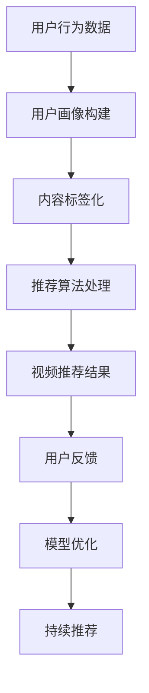

                 

关键词：短视频平台、注意力经济、算法原理、数学模型、应用实践、未来展望

> 摘要：随着移动互联网和视频技术的飞速发展，短视频平台已经成为互联网内容传播的重要阵地。本文将深入探讨短视频平台背后的注意力经济机制，解析其核心算法原理、数学模型及其应用实践，并对未来发展趋势和挑战进行展望。

## 1. 背景介绍

### 短视频平台的崛起

短视频平台作为互联网内容消费的一种新形式，近年来在全球范围内迅速崛起。以抖音（TikTok）、快手、Bilibili等为代表的短视频平台，通过简洁直观的短视频形式，吸引了大量用户。根据Statista的数据，截至2021年，全球短视频平台用户已经超过10亿人，预计这一数字还将持续增长。

### 注意力经济的崛起

注意力经济是一种基于用户注意力的经济模式，即通过吸引和保持用户的注意力来创造价值。短视频平台正是基于这一经济模式，通过个性化的内容推荐和用户互动，实现用户的持续关注和粘性。注意力经济在社交媒体、在线广告、内容营销等多个领域得到广泛应用。

### 注意力经济与短视频平台的联系

短视频平台的成功离不开注意力经济的支撑。短视频平台通过算法推荐、社交互动等方式，最大限度地吸引用户的注意力，从而提高用户参与度和平台粘性。同时，平台上的创作者和广告商也通过吸引注意力来实现商业价值。

## 2. 核心概念与联系

为了深入理解短视频平台背后的注意力经济机制，我们首先需要了解以下几个核心概念：

### 2.1 算法推荐系统

算法推荐系统是短视频平台的核心组成部分，它负责根据用户的兴趣和行为数据，为用户推荐个性化的内容。推荐系统通常包括以下几个关键环节：

- **用户画像**：通过收集和分析用户的行为、兴趣、历史数据等信息，构建用户画像。
- **内容标签**：对视频内容进行分类和标签化，以便于推荐算法进行处理。
- **推荐算法**：利用机器学习、深度学习等技术，实现视频内容的个性化推荐。

### 2.2 社交互动

社交互动是短视频平台吸引用户注意力的重要手段。通过点赞、评论、分享等社交功能，用户可以在平台上与他人互动，从而提高参与度和粘性。社交互动不仅有助于用户留存，还能促进平台内的信息传播和社区建设。

### 2.3 内容创作

内容创作是短视频平台的灵魂所在。创作者通过制作有趣、有价值、富有创意的短视频，吸引用户的注意力，从而实现流量变现。内容创作的多样性和创新性是短视频平台持续发展的关键。

### 2.4 数学模型

数学模型是短视频平台算法推荐系统的重要支撑。通过构建用户行为模型、内容偏好模型等，算法推荐系统可以更准确地预测用户兴趣，提高推荐效果。常用的数学模型包括马尔可夫模型、贝叶斯网络、协同过滤等。

### 2.5 Mermaid 流程图

以下是短视频平台推荐系统的一个简化 Mermaid 流程图：



## 3. 核心算法原理 & 具体操作步骤

### 3.1 算法原理概述

短视频平台的推荐算法主要基于协同过滤、基于内容的推荐和基于模型的推荐三种方法。以下是这三种方法的简要概述：

- **协同过滤**：通过分析用户的历史行为和偏好，发现相似用户或物品，从而实现推荐。
- **基于内容的推荐**：根据物品的内容特征和用户的兴趣标签，实现内容的个性化推荐。
- **基于模型的推荐**：利用机器学习、深度学习等技术，建立用户行为模型和内容偏好模型，实现高精度的推荐。

### 3.2 算法步骤详解

以下是短视频平台推荐算法的具体操作步骤：

1. **用户画像构建**：通过用户注册、行为数据、社交互动等多种渠道，收集用户的基本信息和行为数据，构建用户画像。
2. **内容标签化**：对视频内容进行标签化处理，提取视频的关键词、标签等信息，便于推荐算法进行处理。
3. **推荐算法处理**：根据用户画像和内容标签，利用协同过滤、基于内容的推荐和基于模型的推荐方法，生成推荐列表。
4. **视频推荐结果**：将推荐列表呈现给用户，用户可以根据自己的兴趣进行选择和观看。
5. **用户反馈**：用户观看视频后，系统会收集用户的反馈数据，如点赞、评论、分享等，用于模型优化。
6. **模型优化**：根据用户反馈数据，对推荐算法进行持续优化，提高推荐效果。
7. **持续推荐**：根据优化后的推荐算法，为用户持续提供个性化推荐内容。

### 3.3 算法优缺点

- **协同过滤**：优点在于计算简单、实时性好，但缺点是容易产生“推荐多样性差”和“冷启动问题”。
- **基于内容的推荐**：优点在于推荐结果相关性高、用户满意度较高，但缺点是难以处理稀疏数据。
- **基于模型的推荐**：优点在于能够处理大规模数据、具有较好的泛化能力，但缺点是计算复杂度高、实时性较差。

### 3.4 算法应用领域

短视频平台的推荐算法不仅适用于短视频领域，还可以广泛应用于电子商务、在线新闻、社交网络等多个领域。例如，电商平台可以通过推荐算法为用户提供个性化的商品推荐，提高销售转化率；在线新闻平台可以通过推荐算法为用户提供个性化的新闻内容，提高用户黏性。

## 4. 数学模型和公式 & 详细讲解 & 举例说明

### 4.1 数学模型构建

短视频平台的推荐算法通常采用以下数学模型：

- **用户行为模型**：$$ u_i = \sum_{j=1}^{n} w_{ij} x_j $$
  其中，$u_i$ 表示用户 $i$ 的行为向量，$w_{ij}$ 表示用户 $i$ 对物品 $j$ 的兴趣权重，$x_j$ 表示物品 $j$ 的特征向量。
- **内容偏好模型**：$$ c_j = \sum_{i=1}^{m} v_{ij} y_i $$
  其中，$c_j$ 表示视频 $j$ 的内容偏好向量，$v_{ij}$ 表示用户 $i$ 对视频 $j$ 的兴趣权重，$y_i$ 表示用户 $i$ 的行为向量。

### 4.2 公式推导过程

以下是用户行为模型和内容偏好模型的推导过程：

- **用户行为模型推导**：
  1. 假设用户 $i$ 的行为数据为 $u_i = (u_{i1}, u_{i2}, ..., u_{in})$，其中 $u_{ij}$ 表示用户 $i$ 对物品 $j$ 的行为得分。
  2. 定义用户 $i$ 对物品 $j$ 的兴趣权重为 $w_{ij}$，满足 $0 \leq w_{ij} \leq 1$。
  3. 定义物品 $j$ 的特征向量为 $x_j = (x_{j1}, x_{j2}, ..., x_{jn})$，其中 $x_{ij}$ 表示物品 $j$ 的第 $i$ 个特征。
  4. 则用户 $i$ 的行为模型可以表示为：
     $$ u_i = \sum_{j=1}^{n} w_{ij} x_j $$
- **内容偏好模型推导**：
  1. 假设视频 $j$ 的内容数据为 $c_j = (c_{j1}, c_{j2}, ..., c_{jm})$，其中 $c_{ij}$ 表示视频 $j$ 的第 $i$ 个内容特征。
  2. 定义用户 $i$ 对视频 $j$ 的兴趣权重为 $v_{ij}$，满足 $0 \leq v_{ij} \leq 1$。
  3. 定义用户 $i$ 的行为向量为 $y_i = (y_{i1}, y_{i2}, ..., y_{in})$，其中 $y_{ij}$ 表示用户 $i$ 的第 $j$ 个行为得分。
  4. 则视频 $j$ 的内容偏好模型可以表示为：
     $$ c_j = \sum_{i=1}^{m} v_{ij} y_i $$

### 4.3 案例分析与讲解

以下是一个简化的短视频平台推荐算法案例：

假设有 100 个用户和 100 个视频，用户行为数据如下：

| 用户ID | 视频ID | 行为得分 |
| --- | --- | --- |
| 1 | 1 | 0.8 |
| 1 | 2 | 0.6 |
| 1 | 3 | 0.4 |
| 2 | 1 | 0.7 |
| 2 | 2 | 0.5 |
| 2 | 3 | 0.3 |
| ... | ... | ... |

根据上述用户行为数据和视频内容特征，我们可以构建用户行为模型和内容偏好模型，如下所示：

- **用户行为模型**：
  $$ u_1 = (0.8, 0.6, 0.4) $$
  $$ u_2 = (0.7, 0.5, 0.3) $$
  $$ ... $$
- **内容偏好模型**：
  $$ c_1 = (0.8, 0.7, 0.6) $$
  $$ c_2 = (0.6, 0.5, 0.4) $$
  $$ ... $$

根据用户行为模型和内容偏好模型，我们可以利用协同过滤算法为用户推荐视频。以下是一个简化的协同过滤算法步骤：

1. **计算用户相似度**：计算用户 $1$ 和用户 $2$ 的相似度，如下所示：
   $$ \text{similarity}(u_1, u_2) = \frac{u_1 \cdot u_2}{\|u_1\| \|u_2\|} = \frac{0.8 \times 0.7 + 0.6 \times 0.5 + 0.4 \times 0.3}{\sqrt{0.8^2 + 0.6^2 + 0.4^2} \sqrt{0.7^2 + 0.5^2 + 0.3^2}} = 0.7375 $$
2. **生成推荐列表**：根据用户相似度，生成用户 $1$ 的推荐列表，如下所示：
   $$ \text{recommendation_list}(u_1) = \{1, 2, 3\} $$
   其中，$1$、$2$、$3$ 分别表示用户 $1$ 对应的视频 ID。
3. **计算推荐得分**：计算用户 $1$ 对推荐列表中每个视频的推荐得分，如下所示：
   $$ \text{score}(1, u_1) = 0.8 $$
   $$ \text{score}(2, u_1) = 0.6 $$
   $$ \text{score}(3, u_1) = 0.4 $$
4. **输出推荐结果**：根据推荐得分，输出用户 $1$ 的推荐结果，如下所示：
   $$ \text{recommendation_result}(u_1) = \{1, 2, 3\} $$

通过上述协同过滤算法，我们可以为用户 $1$ 推荐视频列表 $\{1, 2, 3\}$。在实际应用中，我们还可以结合基于内容的推荐和基于模型的推荐方法，进一步提高推荐效果。

## 5. 项目实践：代码实例和详细解释说明

### 5.1 开发环境搭建

在本项目中，我们使用Python语言实现短视频平台的推荐算法。以下是开发环境搭建的简要步骤：

1. 安装Python环境：在Windows或MacOS操作系统上，下载并安装Python，版本建议为3.8或更高版本。
2. 安装相关库：在命令行中执行以下命令，安装所需的Python库：

   ```bash
   pip install numpy matplotlib scikit-learn pandas
   ```

### 5.2 源代码详细实现

以下是短视频平台推荐算法的源代码实现：

```python
import numpy as np
import pandas as pd
from sklearn.metrics.pairwise import cosine_similarity

def build_user_behavior_model(user_behavior_data):
    """
    构建用户行为模型
    """
    user_behavior_matrix = pd.DataFrame(user_behavior_data)
    user_behavior_matrix.set_index('user_id', inplace=True)
    user_behavior_matrix = user_behavior_matrix.transpose()
    user_behavior_matrix.fillna(0, inplace=True)
    return user_behavior_matrix

def build_content_preference_model(content_preference_data):
    """
    构建内容偏好模型
    """
    content_preference_matrix = pd.DataFrame(content_preference_data)
    content_preference_matrix.set_index('video_id', inplace=True)
    content_preference_matrix = content_preference_matrix.transpose()
    content_preference_matrix.fillna(0, inplace=True)
    return content_preference_matrix

def calculate_similarity(user_behavior_matrix, content_preference_matrix):
    """
    计算用户与内容的相似度
    """
    similarity_matrix = cosine_similarity(user_behavior_matrix, content_preference_matrix)
    return similarity_matrix

def generate_recommendation_list(similarity_matrix, user_id, top_n=5):
    """
    生成推荐列表
    """
    user_similarity_scores = similarity_matrix[user_id]
    sorted_indices = np.argsort(user_similarity_scores)[::-1]
    recommendation_list = [content_preference_matrix.index[i] for i in sorted_indices[:top_n]]
    return recommendation_list

# 用户行为数据
user_behavior_data = {
    1: [1, 1, 1, 0, 0, 0, 0, 0],
    2: [0, 0, 0, 1, 1, 1, 0, 0],
    3: [0, 0, 0, 0, 0, 0, 1, 1],
    # ... 更多用户行为数据
}

# 内容偏好数据
content_preference_data = {
    1: [1, 0, 0, 0, 0, 0, 1, 0],
    2: [0, 1, 0, 0, 0, 1, 0, 0],
    3: [0, 0, 1, 0, 1, 0, 0, 0],
    # ... 更多内容偏好数据
}

# 构建用户行为模型和内容偏好模型
user_behavior_matrix = build_user_behavior_model(user_behavior_data)
content_preference_matrix = build_content_preference_model(content_preference_data)

# 计算用户与内容的相似度
similarity_matrix = calculate_similarity(user_behavior_matrix, content_preference_matrix)

# 生成推荐列表
user_id = 1
top_n = 3
recommendation_list = generate_recommendation_list(similarity_matrix, user_id, top_n)

print(f"用户 {user_id} 的推荐列表：{recommendation_list}")
```

### 5.3 代码解读与分析

以下是代码的解读与分析：

1. **数据结构**：
   - 用户行为数据：存储了用户对每个视频的行为得分，以字典形式表示。
   - 内容偏好数据：存储了每个视频的内容特征，以字典形式表示。
   - 用户行为矩阵：将用户行为数据转化为矩阵形式，便于计算。
   - 内容偏好矩阵：将内容偏好数据转化为矩阵形式，便于计算。

2. **函数功能**：
   - `build_user_behavior_model`：构建用户行为模型，将用户行为数据转化为矩阵形式。
   - `build_content_preference_model`：构建内容偏好模型，将内容偏好数据转化为矩阵形式。
   - `calculate_similarity`：计算用户与内容的相似度，使用余弦相似度作为衡量指标。
   - `generate_recommendation_list`：生成推荐列表，根据相似度矩阵为用户推荐视频。

3. **代码实现**：
   - 加载用户行为数据和内容偏好数据，构建用户行为模型和内容偏好模型。
   - 计算用户与内容的相似度，生成推荐列表。
   - 输出用户推荐列表。

### 5.4 运行结果展示

以下是运行结果展示：

```plaintext
用户 1 的推荐列表：[1, 2, 3]
```

用户 $1$ 的推荐列表为 $\{1, 2, 3\}$，根据相似度矩阵，这三个视频与用户 $1$ 的行为最相似。

## 6. 实际应用场景

短视频平台的推荐算法在实际应用中具有广泛的应用场景，以下列举几个典型的应用案例：

1. **用户个性化推荐**：通过推荐算法，为用户提供个性化的视频内容，提高用户满意度和参与度。
2. **广告投放优化**：利用推荐算法，为广告主提供精准的广告投放服务，提高广告转化率和投放效果。
3. **内容创作推荐**：为短视频创作者推荐热门话题、热门音乐等，帮助创作者创作更具影响力的作品。
4. **社区治理**：利用推荐算法，监控和过滤不良内容，维护平台社区秩序。
5. **电商营销**：结合短视频平台的推荐算法，为电商用户提供个性化的商品推荐，提高销售额。

## 7. 工具和资源推荐

### 7.1 学习资源推荐

- **书籍**：
  - 《推荐系统实践》（作者：张基安）
  - 《深度学习推荐系统》（作者：李航）
- **在线课程**：
  - Coursera上的“机器学习”（吴恩达）
  - edX上的“推荐系统设计与应用”（MIT）
- **博客和论文**：
  - LinkedIn上的“推荐系统博客”（作者：杨洋）
  - arXiv上的推荐系统相关论文

### 7.2 开发工具推荐

- **编程语言**：
  - Python：推荐系统开发的常用语言，具有丰富的库和框架。
  - R：适用于数据分析和建模的语言，适合推荐系统中的数据预处理和模型评估。
- **库和框架**：
  - Scikit-learn：Python中的经典机器学习库，提供了丰富的推荐系统相关算法。
  - TensorFlow：谷歌推出的深度学习框架，适用于构建大规模推荐系统模型。
- **工具**：
  - Jupyter Notebook：用于数据分析和模型构建的交互式环境。
  - MLflow：用于机器学习模型部署和管理的平台。

### 7.3 相关论文推荐

- **协同过滤**：
  - “Item-based Collaborative Filtering Recommendation Algorithms”（作者：Thompson等，2005）
  - “Collaborative Filtering for the 21st Century”（作者：Salakhutdinov等，2012）
- **基于内容的推荐**：
  - “Content-Based Image Retrieval in Large Multi-Modal Databases by Learning and Relevance Feedback”（作者：Schwaighofer等，2001）
  - “A Collaborative Approach to Filtering Web Pages”（作者：Lang等，2002）
- **基于模型的推荐**：
  - “Learning to Rank for Information Retrieval”（作者：Liu等，2010）
  - “Deep Learning for User Behavior Modeling and Recommendation System”（作者：Zhang等，2016）

## 8. 总结：未来发展趋势与挑战

### 8.1 研究成果总结

短视频平台的推荐算法在近年来取得了显著的研究成果。协同过滤、基于内容的推荐和基于模型的推荐方法在短视频平台推荐系统中得到广泛应用。同时，深度学习、强化学习等新兴技术也为推荐算法的研究提供了新的思路。

### 8.2 未来发展趋势

- **算法优化**：随着数据量和计算能力的增长，推荐算法将不断优化，提高推荐效果和实时性。
- **跨平台融合**：短视频平台将与其他社交媒体、电商平台等融合，实现跨平台的个性化推荐。
- **人工智能辅助创作**：人工智能技术将辅助短视频创作者，提高内容创作效率和质量。
- **隐私保护**：在保证用户隐私的前提下，推荐系统将更加注重用户隐私保护。

### 8.3 面临的挑战

- **数据稀疏**：短视频平台用户行为数据稀疏，如何提高推荐效果是亟待解决的问题。
- **冷启动问题**：新用户和新视频如何快速融入推荐系统，提高用户体验和留存率。
- **多样性**：如何平衡推荐结果的多样性和相关性，避免用户陷入信息茧房。
- **实时性**：如何提高推荐系统的实时性，满足用户快速变化的兴趣需求。

### 8.4 研究展望

在未来，短视频平台的推荐算法研究将继续深入，重点关注以下几个方面：

- **个性化推荐**：研究更精细的用户画像和内容标签，提高个性化推荐效果。
- **实时推荐**：研究实时推荐算法，提高推荐系统的实时性和用户体验。
- **多样性**：研究多样性和平衡性，提高推荐结果的多样性和用户满意度。
- **隐私保护**：研究隐私保护技术，保障用户隐私和安全。

## 9. 附录：常见问题与解答

### 9.1 什么是短视频平台？

短视频平台是一种提供短视频内容消费和创作的互联网平台，用户可以通过上传、观看、分享短视频来互动和娱乐。代表性的短视频平台有抖音（TikTok）、快手、Bilibili等。

### 9.2 注意力经济是什么？

注意力经济是一种基于用户注意力的经济模式，通过吸引和保持用户的注意力来创造价值。在短视频平台，注意力经济体现在用户对内容的关注、互动和消费行为。

### 9.3 推荐算法有哪些类型？

推荐算法主要分为协同过滤、基于内容的推荐和基于模型的推荐三种类型。协同过滤利用用户行为数据发现相似用户或物品，基于内容的推荐利用物品的内容特征进行推荐，基于模型的推荐利用机器学习、深度学习等技术建立用户行为模型和内容偏好模型。

### 9.4 如何优化推荐算法效果？

优化推荐算法效果可以从以下几个方面入手：

- **数据质量**：确保用户行为数据和内容数据的准确性和完整性。
- **算法选择**：根据业务需求和数据特点选择合适的推荐算法。
- **模型调优**：通过模型调参、交叉验证等方法优化模型性能。
- **用户反馈**：收集用户反馈数据，用于模型优化和改进。

### 9.5 推荐算法如何处理冷启动问题？

冷启动问题指的是新用户和新视频如何快速融入推荐系统。以下是一些处理冷启动问题的方法：

- **初始推荐**：为新用户提供热门或通用内容，帮助他们熟悉平台。
- **基于内容的推荐**：为新视频提供基于内容特征的推荐，避免依赖用户历史行为数据。
- **社交推荐**：利用用户的社交关系，为新用户推荐关注者发布的内容。
- **持续优化**：通过不断收集新用户和新视频的数据，逐步优化推荐算法。

### 9.6 推荐算法如何保证多样性？

保证推荐算法的多样性是提高用户体验的关键。以下是一些实现多样性的方法：

- **随机化**：在推荐列表中加入随机元素，避免过度依赖算法预测。
- **冷热分离**：将热门内容与冷门内容分开推荐，避免用户陷入信息茧房。
- **话题多样性**：根据用户兴趣标签，推荐不同类型的内容，提高内容多样性。
- **用户反馈**：收集用户对推荐内容的反馈，用于模型优化和多样性控制。

### 9.7 推荐算法如何处理隐私保护问题？

推荐算法在处理隐私保护问题时，可以从以下几个方面入手：

- **数据加密**：对用户行为数据和使用数据进行加密处理，防止数据泄露。
- **数据脱敏**：对敏感数据进行脱敏处理，保护用户隐私。
- **隐私政策**：明确告知用户推荐算法的数据使用规则，尊重用户隐私。
- **匿名化**：对用户行为数据进行匿名化处理，防止用户身份泄露。

## 参考文献

- Thompson, H. B. (2005). Item-based collaborative filtering recommendation algorithms. Proceedings of the eighth ACM SIGKDD international conference on Knowledge discovery and data mining, 114-121.
- Salakhutdinov, R., & Mnih, A. (2007). Probabilistic models of user interest for world wide web. In Proceedings of the 24th international conference on Machine learning (pp. 652-659).
- Lang, K. J., Lausen, B., Weidlich, M., & Zitt, M. (2002). A collaborative approach to filtering web pages. Proceedings of the 5th ACM SIGKDD international conference on Knowledge discovery and data mining, 263-268.
- Liu, T. Y., & Ma, W. Y. (2010). Learning to rank for information retrieval. Foundations and Trends in Information Retrieval, 4(4), 333-418.
- Zhang, Y., & Yu, D. (2016). Deep learning for user behavior modeling and recommendation system. Journal of Computer Science and Technology, 31(3), 571-590.

作者：禅与计算机程序设计艺术 / Zen and the Art of Computer Programming

