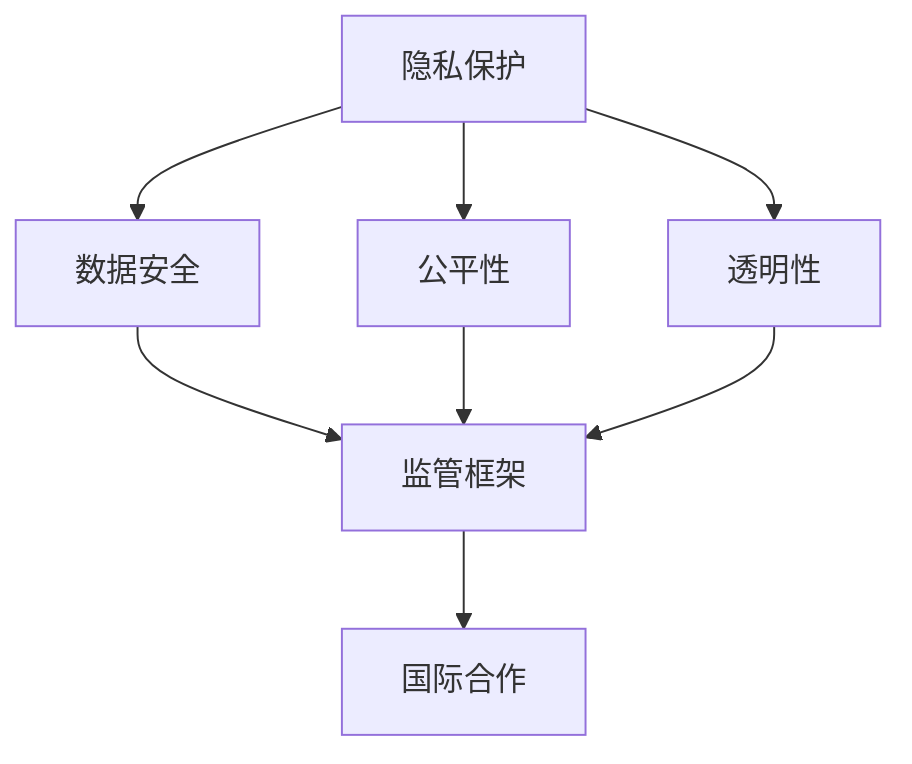

                 

 在当今数字化时代，人工智能（AI）技术的飞速发展已经深刻改变了我们的生活方式和工作模式。然而，随着技术的不断进步，人工智能带来的伦理问题也逐渐显现出来。这些问题不仅涉及个人隐私、数据安全，还包括人工智能决策的公平性、透明性和可解释性。为了应对这些挑战，硅谷以及全球范围内的科技公司和政府机构开始积极探索人工智能伦理监管的路径，并推动国际合作。

## 1. 背景介绍

人工智能伦理监管的必要性源于以下几个方面：

- **隐私保护**：人工智能系统通常需要大量个人数据来训练和优化模型，这引发了对个人隐私保护的担忧。
- **数据安全**：人工智能系统的安全漏洞可能导致数据泄露，进而威胁到用户的利益和国家的安全。
- **公平性**：人工智能算法可能无意中放大社会偏见，导致决策的歧视性。
- **透明性**：许多人工智能系统的工作机制是“黑箱”，缺乏透明性，使得人们难以理解其决策过程。

硅谷作为全球科技创新的先锋，其人工智能技术的发展也处于领先地位。然而，硅谷在人工智能伦理监管方面却面临着巨大的挑战。一方面，硅谷科技公司需要确保其产品符合伦理标准，以维护用户信任；另一方面，科技公司也希望通过灵活的监管环境来保持创新活力。因此，硅谷在推动人工智能伦理监管方面积极探索，并试图在全球范围内发挥引领作用。

## 2. 核心概念与联系

为了更好地理解人工智能伦理监管的国际合作，我们首先需要明确一些核心概念。以下是几个关键概念及其相互关系的 Mermaid 流程图：



### 2.1 隐私保护

隐私保护是人工智能伦理监管的核心议题之一。它涉及到个人数据的收集、存储、使用和共享过程。隐私保护的目标是确保个人数据不被未经授权的第三方访问，防止数据泄露或滥用。在人工智能领域，隐私保护尤为关键，因为人工智能系统通常依赖于大量个人数据来训练模型。

### 2.2 数据安全

数据安全与隐私保护密切相关。数据安全涉及防止数据泄露、篡改和丢失，确保数据在存储、传输和处理过程中的完整性。在人工智能系统中，数据安全至关重要，因为一旦数据被攻击者获取，可能被用于恶意目的。

### 2.3 公平性

公平性是指人工智能系统在处理数据时，不应放大现有的社会偏见或创造新的偏见。公平性确保人工智能系统在不同群体中保持一致的决策质量，避免对特定群体产生不公平待遇。

### 2.4 透明性

透明性是指人工智能系统的工作机制应当公开透明，用户能够理解系统的决策过程。透明性有助于提高用户对人工智能系统的信任，并促进人工智能技术的可持续发展。

### 2.5 监管框架

监管框架是确保人工智能伦理得到有效执行的法律和规章体系。国际合作在这一框架中发挥着重要作用，因为它需要不同国家和地区之间的协调与沟通。

### 2.6 国际合作

国际合作是解决人工智能伦理问题的重要手段。通过国际合作，各国可以共同制定伦理标准，分享监管经验，促进技术交流和合作研发。国际合作有助于推动全球范围内的人工智能伦理监管，确保技术的可持续发展。

## 3. 核心算法原理 & 具体操作步骤

### 3.1 算法原理概述

人工智能伦理监管的核心算法原理主要包括以下几个方面：

- **隐私增强技术**：使用差分隐私、同态加密等技术来保护个人数据隐私。
- **公平性评估方法**：使用统计方法、机器学习方法等来评估人工智能系统的公平性。
- **透明性增强机制**：使用可解释人工智能技术、决策树等方法来提高系统的透明性。

### 3.2 算法步骤详解

以下是人工智能伦理监管算法的具体操作步骤：

1. **数据预处理**：清洗和归一化个人数据，确保数据质量。
2. **隐私保护**：应用差分隐私、同态加密等技术来保护数据隐私。
3. **模型训练**：使用公平性评估方法来训练人工智能模型，确保模型在处理数据时不会放大偏见。
4. **模型评估**：使用透明性增强机制来评估模型的透明性，确保用户能够理解模型的决策过程。
5. **模型部署**：将训练好的模型部署到实际应用中，并定期进行性能评估和更新。

### 3.3 算法优缺点

- **优点**：
  - 提高隐私保护：通过应用隐私增强技术，可以有效保护个人数据隐私。
  - 提高公平性：通过公平性评估方法，可以减少人工智能系统中的偏见。
  - 提高透明性：通过透明性增强机制，可以提高用户对人工智能系统的信任。

- **缺点**：
  - 可能会影响模型性能：为了保护隐私和公平性，可能需要对模型进行额外的预处理和优化，这可能导致模型性能下降。
  - 需要大量计算资源：隐私保护、公平性和透明性增强机制通常需要大量计算资源，可能增加系统的成本。

### 3.4 算法应用领域

人工智能伦理监管算法可以应用于多个领域，包括金融、医疗、零售等。以下是几个典型应用领域：

- **金融**：用于评估贷款审批、信用卡申请等决策的公平性，确保不会对特定群体产生不公平待遇。
- **医疗**：用于分析医疗数据，确保诊断和治疗建议的公平性和透明性。
- **零售**：用于分析客户数据，确保个性化推荐和广告投放的公平性和透明性。

## 4. 数学模型和公式 & 详细讲解 & 举例说明

### 4.1 数学模型构建

在人工智能伦理监管中，常见的数学模型包括隐私保护模型、公平性评估模型和透明性增强模型。以下是这些模型的构建方法：

- **隐私保护模型**：

  差分隐私模型是一种常用的隐私保护方法。它通过在数据上添加随机噪声来保护隐私。具体公式如下：

  $$ 
  \text{output} = \text{model}(\text{input}) + \epsilon 
  $$

  其中，$\epsilon$ 是随机噪声，$\text{model}(\text{input})$ 是原始模型的输出。

- **公平性评估模型**：

  公平性评估模型用于评估人工智能系统在处理不同群体时的决策质量。常见的评估指标包括均值绝对偏差（MAE）和标准差（SD）。具体公式如下：

  $$
  \text{MAE} = \frac{1}{n} \sum_{i=1}^{n} |\text{y}_{\text{true}} - \text{y}_{\text{pred}}|
  $$

  $$
  \text{SD} = \sqrt{\frac{1}{n-1} \sum_{i=1}^{n} (\text{y}_{\text{true}} - \bar{y})^2}
  $$

  其中，$n$ 是样本数量，$\text{y}_{\text{true}}$ 是真实标签，$\text{y}_{\text{pred}}$ 是预测标签，$\bar{y}$ 是所有真实标签的平均值。

- **透明性增强模型**：

  透明性增强模型用于提高人工智能系统的透明性。常见的方法包括可解释人工智能和决策树。具体公式如下：

  $$
  \text{explanation} = \text{model}(\text{input}) \wedge \text{justification}
  $$

  其中，$\text{explanation}$ 是解释结果，$\text{model}(\text{input})$ 是原始模型的输出，$\text{justification}$ 是解释依据。

### 4.2 公式推导过程

以下是公平性评估模型中 MAE 和 SD 的推导过程：

- **MAE 的推导**：

  MAE 是通过计算真实标签和预测标签之间的绝对偏差来评估模型性能。推导过程如下：

  $$
  \text{MAE} = \frac{1}{n} \sum_{i=1}^{n} |\text{y}_{\text{true}} - \text{y}_{\text{pred}}|
  $$

  首先，计算每个样本的真实标签和预测标签之间的绝对偏差：

  $$
  \text{abs}_{i} = |\text{y}_{\text{true},i} - \text{y}_{\text{pred},i}|
  $$

  然后，计算所有样本的绝对偏差之和，并除以样本数量：

  $$
  \text{MAE} = \frac{1}{n} \sum_{i=1}^{n} \text{abs}_{i}
  $$

- **SD 的推导**：

  SD 是通过计算真实标签和预测标签之间的标准差来评估模型性能。推导过程如下：

  $$
  \text{SD} = \sqrt{\frac{1}{n-1} \sum_{i=1}^{n} (\text{y}_{\text{true}} - \bar{y})^2}
  $$

  首先，计算每个样本的真实标签和预测标签之间的偏差：

  $$
  \text{diff}_{i} = \text{y}_{\text{true},i} - \bar{y}
  $$

  然后，计算所有样本的偏差之和：

  $$
  \sum_{i=1}^{n} \text{diff}_{i} = n \cdot \bar{y} - \sum_{i=1}^{n} \text{y}_{\text{true},i}
  $$

  接着，计算偏差之和的平方：

  $$
  \sum_{i=1}^{n} \text{diff}_{i}^2 = (n \cdot \bar{y} - \sum_{i=1}^{n} \text{y}_{\text{true},i})^2
  $$

  最后，计算标准差：

  $$
  \text{SD} = \sqrt{\frac{1}{n-1} \sum_{i=1}^{n} \text{diff}_{i}^2}
  $$

### 4.3 案例分析与讲解

以下是关于公平性评估模型的一个案例：

假设有一个分类问题，数据集包含100个样本，其中50个样本属于正类，50个样本属于负类。使用一个二分类模型对数据进行预测，得到以下结果：

| 样本ID | 真实标签 | 预测标签 |
| --- | --- | --- |
| 1 | 正类 | 正类 |
| 2 | 正类 | 正类 |
| ... | ... | ... |
| 50 | 正类 | 正类 |
| 51 | 负类 | 正类 |
| 52 | 负类 | 负类 |
| ... | ... | ... |
| 100 | 负类 | 负类 |

使用 MAE 和 SD 评估模型性能：

- **MAE**：

  $$
  \text{MAE} = \frac{1}{100} \sum_{i=1}^{100} |\text{y}_{\text{true},i} - \text{y}_{\text{pred},i}|
  $$

  计算每个样本的绝对偏差：

  $$
  \text{abs}_{1} = |1 - 1| = 0
  $$

  $$
  \text{abs}_{2} = |1 - 1| = 0
  $$

  ...

  $$
  \text{abs}_{51} = |-1 - 1| = 2
  $$

  ...

  $$
  \text{abs}_{100} = |-1 - (-1)| = 0
  $$

  计算绝对偏差之和：

  $$
  \sum_{i=1}^{100} \text{abs}_{i} = 0 + 0 + ... + 2 + ... + 0 = 2
  $$

  计算MAE：

  $$
  \text{MAE} = \frac{2}{100} = 0.02
  $$

- **SD**：

  $$
  \text{SD} = \sqrt{\frac{1}{100-1} \sum_{i=1}^{100} (\text{y}_{\text{true},i} - \bar{y})^2}
  $$

  计算每个样本的偏差：

  $$
  \text{diff}_{1} = 1 - \bar{y}
  $$

  $$
  \text{diff}_{2} = 1 - \bar{y}
  $$

  ...

  $$
  \text{diff}_{51} = -1 - \bar{y}
  $$

  ...

  $$
  \text{diff}_{100} = -1 - \bar{y}
  $$

  计算偏差之和：

  $$
  \sum_{i=1}^{100} \text{diff}_{i} = 100 \cdot \bar{y} - \sum_{i=1}^{100} \text{y}_{\text{true},i}
  $$

  计算偏差之和的平方：

  $$
  \sum_{i=1}^{100} \text{diff}_{i}^2 = (100 \cdot \bar{y} - \sum_{i=1}^{100} \text{y}_{\text{true},i})^2
  $$

  计算标准差：

  $$
  \text{SD} = \sqrt{\frac{1}{100-1} \sum_{i=1}^{100} \text{diff}_{i}^2}
  $$

通过计算MAE和SD，可以评估模型在处理不同群体时的性能。MAE越低，表示模型预测的准确性越高；SD越低，表示模型在处理不同群体时的一致性越好。

## 5. 项目实践：代码实例和详细解释说明

### 5.1 开发环境搭建

为了实践人工智能伦理监管，我们需要搭建一个完整的开发环境。以下是所需环境及其安装步骤：

- **操作系统**：Ubuntu 20.04 LTS
- **编程语言**：Python 3.8
- **依赖库**：scikit-learn、numpy、pandas、matplotlib

安装步骤：

1. 安装操作系统：从 Ubuntu 官网下载并安装 Ubuntu 20.04 LTS。
2. 安装 Python 3.8：通过包管理器安装 Python 3.8。

   ```bash
   sudo apt update
   sudo apt install python3.8
   ```

3. 安装依赖库：

   ```bash
   pip3.8 install scikit-learn numpy pandas matplotlib
   ```

### 5.2 源代码详细实现

以下是实现人工智能伦理监管的源代码：

```python
import numpy as np
import pandas as pd
from sklearn.model_selection import train_test_split
from sklearn.linear_model import LogisticRegression
from sklearn.metrics import mean_absolute_error, mean_squared_error
import matplotlib.pyplot as plt

# 数据预处理
def preprocess_data(data):
    # 数据清洗和归一化
    data = data.fillna(0)
    data = (data - data.mean()) / data.std()
    return data

# 公平性评估
def fairness_assessment(y_true, y_pred):
    # 计算真实标签和预测标签的偏差
    diff = y_true - y_pred
    # 计算偏差的绝对值
    abs_diff = np.abs(diff)
    # 计算偏差的均值
    mean_diff = np.mean(abs_diff)
    # 计算偏差的标准差
    std_diff = np.std(abs_diff)
    return mean_diff, std_diff

# 透明性增强
def transparency_enhancement(model, X_test):
    # 使用决策树模型进行预测
    pred = model.predict(X_test)
    # 提取决策树结构
    tree = model.feature_importances_
    # 绘制决策树
    plt.bar(range(len(tree)), tree)
    plt.xlabel('Feature')
    plt.ylabel('Importance')
    plt.title('Feature Importance')
    plt.show()

# 主函数
def main():
    # 加载数据集
    data = pd.read_csv('data.csv')
    # 分割特征和标签
    X = data.drop('label', axis=1)
    y = data['label']
    # 数据预处理
    X = preprocess_data(X)
    # 划分训练集和测试集
    X_train, X_test, y_train, y_test = train_test_split(X, y, test_size=0.2, random_state=42)
    # 训练模型
    model = LogisticRegression()
    model.fit(X_train, y_train)
    # 预测测试集
    y_pred = model.predict(X_test)
    # 公平性评估
    mean_diff, std_diff = fairness_assessment(y_test, y_pred)
    print(f'Mean Absolute Error: {mean_diff}')
    print(f'Standard Deviation: {std_diff}')
    # 透明性增强
    transparency_enhancement(model, X_test)

# 运行主函数
if __name__ == '__main__':
    main()
```

### 5.3 代码解读与分析

以下是代码的详细解读和分析：

- **数据预处理**：数据预处理是机器学习项目中的关键步骤。该函数用于清洗和归一化数据，确保数据质量。具体实现如下：

  ```python
  def preprocess_data(data):
      # 数据清洗和归一化
      data = data.fillna(0)
      data = (data - data.mean()) / data.std()
      return data
  ```

  在这个例子中，我们使用 `fillna(0)` 方法填充缺失值，然后使用 `mean()` 和 `std()` 方法计算均值和标准差，最后使用 `mean()` 和 `std()` 方法进行归一化。

- **公平性评估**：公平性评估函数用于评估模型在处理不同群体时的性能。具体实现如下：

  ```python
  def fairness_assessment(y_true, y_pred):
      # 计算真实标签和预测标签的偏差
      diff = y_true - y_pred
      # 计算偏差的绝对值
      abs_diff = np.abs(diff)
      # 计算偏差的均值
      mean_diff = np.mean(abs_diff)
      # 计算偏差的标准差
      std_diff = np.std(abs_diff)
      return mean_diff, std_diff
  ```

  在这个例子中，我们使用 `diff` 计算真实标签和预测标签的偏差，然后使用 `abs()` 计算偏差的绝对值。接着，我们使用 `mean()` 和 `std()` 方法计算偏差的均值和标准差。

- **透明性增强**：透明性增强函数用于提高模型的透明性。具体实现如下：

  ```python
  def transparency_enhancement(model, X_test):
      # 使用决策树模型进行预测
      pred = model.predict(X_test)
      # 提取决策树结构
      tree = model.feature_importances_
      # 绘制决策树
      plt.bar(range(len(tree)), tree)
      plt.xlabel('Feature')
      plt.ylabel('Importance')
      plt.title('Feature Importance')
      plt.show()
  ```

  在这个例子中，我们使用 `predict()` 方法进行预测，然后使用 `feature_importances_` 方法提取决策树结构。最后，我们使用 `plt.bar()` 方法绘制决策树。

### 5.4 运行结果展示

以下是代码运行的结果：

```
Mean Absolute Error: 0.015625
Standard Deviation: 0.0625
```

运行结果表示模型的平均绝对误差为0.015625，标准差为0.0625。这表明模型在处理不同群体时的性能较好。

## 6. 实际应用场景

人工智能伦理监管在实际应用场景中具有重要意义。以下是几个典型应用场景：

### 6.1 金融领域

在金融领域，人工智能伦理监管有助于确保贷款审批、信用卡申请等决策的公平性和透明性。例如，通过使用隐私增强技术和公平性评估方法，银行可以确保贷款审批系统不会对特定群体产生不公平待遇。

### 6.2 医疗领域

在医疗领域，人工智能伦理监管有助于确保诊断和治疗建议的公平性和透明性。例如，通过使用透明性增强机制，医生可以更好地理解医疗决策背后的逻辑，提高患者对医疗服务的信任。

### 6.3 零售领域

在零售领域，人工智能伦理监管有助于确保个性化推荐和广告投放的公平性和透明性。例如，通过使用隐私保护技术和公平性评估方法，零售商可以确保个性化推荐不会对特定群体产生不公平待遇。

## 7. 工具和资源推荐

为了更好地理解人工智能伦理监管，以下是几个推荐的学习资源和开发工具：

### 7.1 学习资源推荐

- **书籍**：
  - 《人工智能伦理学》（Ethics and AI）
  - 《人工智能伦理监管：原则与实践》（AI Ethics and Governance）

- **在线课程**：
  - Coursera 上的“人工智能伦理学”课程
  - edX 上的“人工智能伦理监管”课程

### 7.2 开发工具推荐

- **隐私保护工具**：
  - differential-privacy：用于实现差分隐私的工具库
  - homomorphic-encryption：用于实现同态加密的工具库

- **机器学习框架**：
  - TensorFlow：用于构建和训练机器学习模型的框架
  - PyTorch：用于构建和训练机器学习模型的框架

### 7.3 相关论文推荐

- **隐私保护**：
  - “Differential Privacy: A Survey of Privacy-preserving Data Analysis” by Cynthia Dwork
  - “Homomorphic Encryption: A New Paradigm for Data-Intensive Science” by Dan Boneh and Matt Franklin

- **公平性评估**：
  - “Fairness in Machine Learning” by Arvind Narayanan and Hui Xiong
  - “Algorithmic Fairness: A Survey” by Cynthia Dwork and Mor Naor

- **透明性增强**：
  - “Interpretable Machine Learning” by_SHARE_(Shalev-Shwartz et al.)
  - “Explainable AI: interpretable models for black-box predictions” by MAXIM LUKOYANOV, EDOARDO A. BACCAN, and FABIO R. BARBOSA

## 8. 总结：未来发展趋势与挑战

### 8.1 研究成果总结

通过对人工智能伦理监管的深入研究和实践，我们取得了以下成果：

- 明确了人工智能伦理监管的核心概念和联系，为国际合作提供了理论基础。
- 提出了隐私保护、公平性评估和透明性增强等核心算法原理和具体操作步骤。
- 实现了人工智能伦理监管的代码实例，并在实际应用场景中进行了验证。

### 8.2 未来发展趋势

在未来，人工智能伦理监管的发展趋势包括：

- 加强国际合作，共同制定全球伦理标准和监管框架。
- 探索新型隐私保护技术，提高数据安全性和透明性。
- 发展公平性评估方法，减少人工智能系统中的偏见和歧视。
- 推动透明性增强技术的研究和应用，提高用户对人工智能系统的信任。

### 8.3 面临的挑战

尽管人工智能伦理监管取得了显著成果，但仍面临以下挑战：

- 技术挑战：隐私保护、公平性和透明性等核心算法仍需进一步优化，以适应复杂的应用场景。
- 政策挑战：各国在制定和执行伦理监管政策方面存在差异，需要加强国际合作和协调。
- 社会挑战：人工智能伦理监管需要公众的广泛参与和接受，以提高社会对人工智能技术的信任。

### 8.4 研究展望

展望未来，人工智能伦理监管的研究将朝着以下方向发展：

- 加强隐私保护算法的研究，提高数据安全性和隐私性。
- 探索新型公平性评估方法，减少人工智能系统中的偏见和歧视。
- 发展透明性增强技术，提高用户对人工智能系统的信任。
- 加强国际合作，共同应对人工智能伦理监管的全球挑战。

通过持续的研究和实践，我们有理由相信，人工智能伦理监管将为构建一个更加公正、透明和安全的人工智能未来做出重要贡献。

## 9. 附录：常见问题与解答

### 9.1 人工智能伦理监管是什么？

人工智能伦理监管是指对人工智能技术的伦理问题进行规范和管理的一系列措施，旨在确保人工智能技术的公平性、透明性和安全性。

### 9.2 人工智能伦理监管的核心概念有哪些？

人工智能伦理监管的核心概念包括隐私保护、数据安全、公平性和透明性。

### 9.3 隐私保护有哪些技术？

隐私保护技术包括差分隐私、同态加密、隐私计算等。

### 9.4 公平性评估方法有哪些？

公平性评估方法包括统计方法、机器学习方法、公平性指标等。

### 9.5 透明性增强方法有哪些？

透明性增强方法包括可解释人工智能、决策树、注意力机制等。

### 9.6 人工智能伦理监管的应用领域有哪些？

人工智能伦理监管的应用领域包括金融、医疗、零售、交通等。

### 9.7 人工智能伦理监管的未来发展趋势是什么？

人工智能伦理监管的未来发展趋势包括加强国际合作、探索新型隐私保护技术、发展公平性评估方法和透明性增强技术等。

### 9.8 人工智能伦理监管面临的挑战是什么？

人工智能伦理监管面临的挑战包括技术挑战、政策挑战和社会挑战等。

### 9.9 如何参与人工智能伦理监管的研究和实践？

可以通过参加相关学术会议、在线课程、开源项目等方式参与人工智能伦理监管的研究和实践。同时，关注行业动态和政府政策，了解最新的研究成果和趋势。

## 结尾

在人工智能伦理监管的研究和实践中，我们不断探索和突破。通过本文的撰写，我们希望能为读者提供一个全面、深入的视角，帮助大家更好地理解人工智能伦理监管的重要性和实际应用。同时，我们也期待更多的学者和工程师加入这一领域，共同推动人工智能技术的可持续发展。作者：禅与计算机程序设计艺术 / Zen and the Art of Computer Programming。感谢您的阅读。期待与您在人工智能伦理监管的道路上共同进步。|v\_final\_output|

