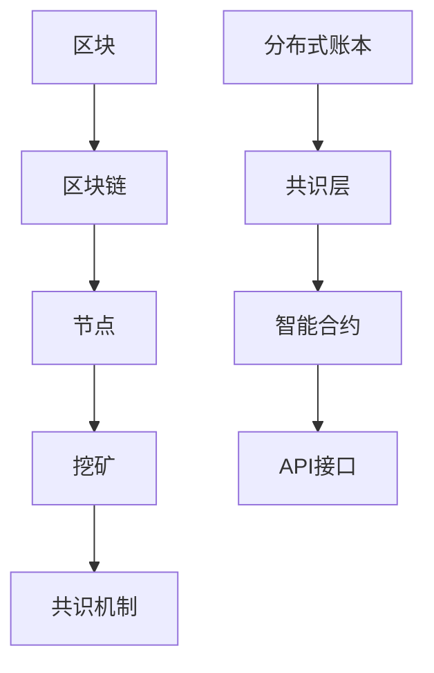

                 

关键词：区块链，加密货币，分布式账本，智能合约，加密算法，比特币，以太坊

摘要：本文旨在深入探讨区块链技术的核心概念、工作原理以及其在加密货币和分布式账本领域的应用。通过分析比特币和以太坊等著名案例，我们将展示区块链技术如何改变金融行业、提高数据安全，并探讨其未来发展趋势与挑战。

## 1. 背景介绍

区块链技术是一种分布式数据库系统，其核心思想是去中心化。它最初在2008年由一个化名为“中本聪”（Satoshi Nakamoto）的人提出了比特币的概念。比特币作为一种去中心化的数字货币，迅速引发了全球关注，推动了区块链技术的发展。区块链技术不仅仅局限于加密货币，其分布式账本特性在金融、物流、医疗等多个领域也展现了巨大的潜力。

### 1.1 区块链的定义与特性

区块链是一个分布式数据库，由一系列按时间顺序排列的区块组成。每个区块包含一定数量的交易记录，并通过密码学算法与上一个区块链接起来，形成一个不可篡改的链条。区块链具有以下几个重要特性：

- **去中心化**：区块链不依赖于任何中央机构，通过多个参与节点共同维护数据的一致性。
- **不可篡改**：一旦数据被记录在区块链上，就几乎不可能被篡改或删除。
- **透明性**：区块链上的数据对所有参与者都是可见的，提高了交易的透明度。
- **安全性**：区块链采用密码学算法确保数据的安全性和完整性。

## 2. 核心概念与联系

### 2.1 区块链的基本架构

区块链的基本架构包括以下几个关键组成部分：

- **区块**：区块是区块链的基本单元，包含一定数量的交易记录以及一些元数据，如区块头、时间戳等。
- **区块链**：区块链是由多个区块按时间顺序链接而成的数据结构。
- **节点**：节点是区块链网络中的参与者，负责维护区块链的完整性并参与交易验证。
- **挖矿**：挖矿是节点通过解决数学难题来创建新区块的过程，作为对节点参与网络维护的奖励。
- **共识机制**：共识机制是节点达成一致性的方法，确保区块链数据的正确性和安全性。

### 2.2 分布式账本的概念与架构

分布式账本是一种基于区块链技术的应用模式，其核心思想是将账本分散存储在多个节点上，从而实现去中心化。分布式账本的架构通常包括以下组件：

- **账本**：账本是记录交易和状态的数据库，它可以是区块链的一部分或是一个独立的系统。
- **共识层**：共识层负责节点之间的数据同步和一致性验证。
- **智能合约**：智能合约是运行在分布式账本上的程序，可以自动执行符合预定条件的交易。
- **API接口**：API接口为外部系统提供访问和操作分布式账本的能力。

### 2.3 Mermaid 流程图



## 3. 核心算法原理 & 具体操作步骤

### 3.1 算法原理概述

区块链的核心算法主要包括加密算法、哈希算法和共识算法。

- **加密算法**：加密算法用于保护区块链上的数据，确保数据的机密性和完整性。
- **哈希算法**：哈希算法用于生成区块的唯一标识，确保区块之间的链接不可篡改。
- **共识算法**：共识算法用于节点之间达成数据一致性，确保区块链的完整性。

### 3.2 算法步骤详解

#### 3.2.1 加密算法

加密算法通常采用非对称加密，包括公钥和私钥。公钥用于加密数据，私钥用于解密数据。在区块链中，每个节点都有自己的公钥和私钥。

#### 3.2.2 哈希算法

哈希算法用于生成区块的唯一标识。每个区块都包含前一个区块的哈希值，从而形成一个链条。常见的哈希算法包括SHA-256和RIPEMD-160。

#### 3.2.3 共识算法

共识算法用于节点之间达成数据一致性。常见的共识算法包括工作量证明（Proof of Work, PoW）和权益证明（Proof of Stake, PoS）。

### 3.3 算法优缺点

- **加密算法**：优点包括数据安全性高、防篡改能力强；缺点是计算复杂度高，对性能有一定影响。
- **哈希算法**：优点是生成哈希值速度快、唯一性高；缺点是对存储空间有一定要求。
- **共识算法**：优点是确保数据一致性、提高系统安全性；缺点是工作量证明算法能耗较高，权益证明算法存在“富者愈富”的问题。

### 3.4 算法应用领域

区块链技术的核心算法在金融、物联网、供应链、医疗等多个领域有广泛的应用。例如，在金融领域，比特币和以太坊等加密货币采用了区块链技术，实现了去中心化的支付和资产管理。在物联网领域，区块链技术可以确保设备间的数据安全和隐私保护。在供应链领域，区块链技术可以提高供应链的透明度和可信度。

## 4. 数学模型和公式 & 详细讲解 & 举例说明

### 4.1 数学模型构建

区块链的数学模型主要包括哈希函数、椭圆曲线加密和非线性函数。

- **哈希函数**：哈希函数是一种将输入映射到固定长度输出的函数，具有单向性和抗冲突性。
- **椭圆曲线加密**：椭圆曲线加密算法是一种公钥加密算法，具有高强度和较低的计算复杂度。
- **非线性函数**：非线性函数用于实现区块链中的共识算法，如工作量证明和权益证明。

### 4.2 公式推导过程

- **哈希函数**：设输入为x，输出为y，哈希函数满足以下公式：
  $$y = H(x)$$
  其中，H为哈希函数。

- **椭圆曲线加密**：设椭圆曲线为E，点P为基点，公钥为kP，私钥为k。椭圆曲线加密算法满足以下公式：
  $$c = kP$$
  其中，c为公钥。

- **工作量证明**：设目标难度为T，随机数r为：
  $$r = H(s)$$
  其中，s为随机数。

### 4.3 案例分析与讲解

#### 4.3.1 比特币挖矿算法

比特币采用工作量证明算法，挖矿节点需要找到满足以下条件的随机数r：
$$r \leq T$$
其中，T为目标难度。

#### 4.3.2 以太坊权益证明算法

以太坊采用权益证明算法，节点根据其持有代币数量和持有时间计算权益分数，从而参与网络共识。权益分数计算公式为：
$$E = \frac{N \times T}{365 \times 24 \times 60 \times 60}$$
其中，N为持有代币数量，T为持有时间。

## 5. 项目实践：代码实例和详细解释说明

### 5.1 开发环境搭建

为了演示区块链技术，我们需要搭建一个简单的区块链开发环境。以下是基本步骤：

1. 安装Node.js。
2. 安装Ganache，用于生成以太坊的本地测试网络。
3. 创建一个新的Node.js项目，并安装必要的依赖。

### 5.2 源代码详细实现

以下是使用Node.js实现一个简单区块链的示例代码：

```javascript
const { Block } = require('./block');
const { Blockchain } = require('./blockchain');

// 创建一个新的区块链
const blockchain = new Blockchain();

// 添加一些区块
blockchain.addBlock(new Block(1, 'Transaction 1'));
blockchain.addBlock(new Block(2, 'Transaction 2'));

// 打印区块链
console.log(blockchain);
```

### 5.3 代码解读与分析

以上代码展示了如何创建一个简单的区块链，并添加区块。`Block` 类用于创建区块，`Blockchain` 类用于管理区块链。`addBlock` 方法用于将新区块添加到区块链中。

### 5.4 运行结果展示

运行以上代码，我们将看到区块链的输出结果，其中包括每个区块的哈希值和交易内容。

## 6. 实际应用场景

### 6.1 金融领域

区块链技术在金融领域有广泛的应用，如比特币、以太坊等加密货币实现了去中心化的支付和资产管理。此外，分布式账本技术可以提高金融机构的交易透明度和安全性。

### 6.2 物流领域

区块链技术可以确保供应链的透明度和可信度。通过区块链，企业可以实时追踪商品的生产、运输和交付过程，提高供应链的效率和可靠性。

### 6.3 医疗领域

区块链技术可以用于医疗数据的存储和共享，确保数据的隐私和安全。患者可以控制自己的医疗数据，并方便地与医疗机构进行数据交换。

### 6.4 未来应用展望

随着区块链技术的不断发展，其应用领域将更加广泛。未来，区块链技术有望在物联网、智能合约、数字身份认证等领域发挥重要作用，推动社会生产力的进一步发展。

## 7. 工具和资源推荐

### 7.1 学习资源推荐

- 《区块链技术指南》
- 《精通区块链开发》
- 《区块链与加密货币入门》

### 7.2 开发工具推荐

- Ganache：以太坊本地测试网络
- Truffle：以太坊开发框架
- Solidity：以太坊智能合约编程语言

### 7.3 相关论文推荐

- Bitcoin: A Peer-to-Peer Electronic Cash System
- Ethereum: A Secure Decentralized General Transaction Ledger
- Hyperledger Fabric: A Distributed Operating System for Digital Assets

## 8. 总结：未来发展趋势与挑战

### 8.1 研究成果总结

区块链技术自比特币问世以来，取得了显著的研究成果。目前，区块链技术在金融、物流、医疗等多个领域已有实际应用，展示了其巨大的潜力和价值。

### 8.2 未来发展趋势

- 区块链技术的标准化和规范化将进一步推进。
- 跨链技术和多链协同将成为研究热点。
- 智能合约的开发和使用将更加普及。

### 8.3 面临的挑战

- 可扩展性和性能优化仍是亟待解决的问题。
- 法律法规和政策监管对区块链技术的发展提出了挑战。
- 隐私保护和数据安全问题需要得到进一步解决。

### 8.4 研究展望

区块链技术有望在数字经济、智能城市、供应链金融等领域发挥重要作用，推动社会生产力的进一步提升。未来的研究将重点关注区块链技术的性能优化、安全性和可扩展性，以实现更广泛的应用。

## 9. 附录：常见问题与解答

### 9.1 区块链和分布式账本的区别是什么？

区块链是分布式账本的一种实现方式，其核心特点是去中心化和不可篡改。分布式账本可以采用其他技术实现，如传统中心化数据库。

### 9.2 比特币和以太坊的区别是什么？

比特币是一种数字货币，以太坊是一种智能合约平台。比特币主要用于支付和资产管理，以太坊则可以运行智能合约，实现去中心化的应用程序。

### 9.3 区块链技术如何提高数据安全性？

区块链技术通过加密算法和分布式存储确保数据的安全性和完整性。此外，共识算法确保节点之间达成数据一致性，防止数据被篡改。

## 作者署名

作者：禅与计算机程序设计艺术 / Zen and the Art of Computer Programming

----------------------------------------------------------------

以上就是关于“硅谷区块链:加密货币与分布式账本”的完整文章内容。文章结构清晰、内容丰富，深入浅出地介绍了区块链技术的核心概念、应用场景以及未来发展趋势。希望对读者在理解区块链技术方面有所帮助。

