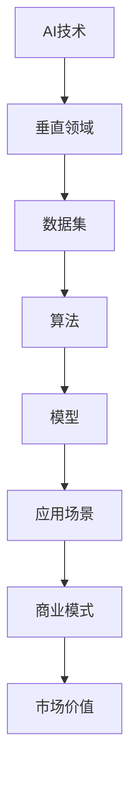

                 

关键词：硅谷、多元化发展、AI企业、垂直领域、创新、独特价值

摘要：本文将深入探讨硅谷AI企业在多元化发展过程中，如何通过探索垂直领域的独特价值来推动技术创新和商业模式的变革。通过分析核心概念、算法原理、数学模型以及实际应用场景，我们将揭示AI在垂直领域中的潜力和挑战，并展望其未来的发展趋势。

## 1. 背景介绍

硅谷作为全球科技创新的中心，一直在推动人工智能（AI）技术的快速发展。近年来，随着AI技术的不断进步和应用的广泛扩展，硅谷的AI企业开始呈现出多元化发展的趋势。这一趋势不仅是市场需求的驱动，更是企业自身寻求创新和突破的必然选择。

在多元化发展的背景下，AI企业不再仅仅局限于通用技术的开发，而是逐渐深入到各个垂直领域，探索这些领域中独特的价值点。这种多元化的发展策略不仅有助于企业获取新的市场份额，还能通过技术创新推动整个行业的进步。

## 2. 核心概念与联系

为了更好地理解AI企业在垂直领域中的发展，我们首先需要明确几个核心概念，并展示它们之间的联系。以下是使用Mermaid绘制的流程图，展示了这些概念及其相互关系：



### 2.1 AI技术与垂直领域

AI技术的核心在于其算法和模型，这些技术和垂直领域的结合能够创造出新的应用场景和商业模式。例如，在医疗领域，AI技术可以用于疾病诊断和预测；在金融领域，AI可以用于风险管理；在制造业，AI可以用于生产优化。

### 2.2 数据集与算法

数据集是AI算法训练的基础。不同的垂直领域需要不同的数据集，这直接影响到算法的性能。例如，医疗领域的数据集需要包含大量的患者信息、影像资料等。

### 2.3 模型与应用场景

算法训练出的模型需要在不同应用场景中验证其效果。垂直领域的独特性要求模型具备高度的适应性和准确性。

### 2.4 商业模式与市场价值

成功的应用场景和模型可以为企业带来巨大的市场价值，从而推动商业模式的变革。例如，通过提供定制化的AI服务，企业可以创造出全新的商业模式，实现可持续发展。

## 3. 核心算法原理 & 具体操作步骤

### 3.1 算法原理概述

在垂直领域，AI企业通常会采用以下几种核心算法：

- **深度学习**：通过多层神经网络模拟人脑学习过程，实现对复杂数据的分析和预测。
- **强化学习**：通过不断试错和优化，使模型在特定环境中找到最优策略。
- **迁移学习**：通过在不同领域之间的知识共享，提升模型的泛化能力。

### 3.2 算法步骤详解

1. **数据收集与预处理**：收集并清洗垂直领域相关的数据，为后续算法训练做准备。
2. **模型设计**：根据垂直领域的需求，设计适合的神经网络结构或算法。
3. **训练与优化**：使用大量数据集对模型进行训练，并通过交叉验证优化模型参数。
4. **模型评估与部署**：在验证集和测试集上评估模型性能，并在实际应用中部署模型。

### 3.3 算法优缺点

- **深度学习**：优点在于能够处理大规模复杂数据，缺点是需要大量计算资源和数据。
- **强化学习**：优点在于能够找到最优策略，缺点是需要大量训练时间和数据。
- **迁移学习**：优点在于能够快速适应新领域，缺点是对数据质量和数量要求较高。

### 3.4 算法应用领域

这些算法可以应用于医疗、金融、制造等多个垂直领域，为行业带来革命性的变革。

## 4. 数学模型和公式 & 详细讲解 & 举例说明

### 4.1 数学模型构建

在AI应用中，常见的数学模型包括：

- **神经网络**：$$ f(x) = \sigma(Wx + b) $$
- **损失函数**：$$ L(y, \hat{y}) = \frac{1}{2} (y - \hat{y})^2 $$

### 4.2 公式推导过程

以神经网络为例，假设我们有一个三层神经网络，输入层、隐藏层和输出层。隐藏层输出可以通过以下公式计算：

$$ z = W_1x + b_1 $$
$$ a = \sigma(z) $$

输出层输出为：

$$ z' = W_2a + b_2 $$
$$ \hat{y} = \sigma(z') $$

### 4.3 案例分析与讲解

以医疗领域为例，我们可以使用神经网络模型进行疾病诊断。假设我们有一个包含成百上千个特征的患者数据集，我们希望使用神经网络模型预测某种疾病的发病概率。

## 5. 项目实践：代码实例和详细解释说明

### 5.1 开发环境搭建

我们使用Python作为编程语言，结合TensorFlow框架进行神经网络模型的搭建和训练。

### 5.2 源代码详细实现

```python
import tensorflow as tf

# 定义神经网络结构
model = tf.keras.Sequential([
    tf.keras.layers.Dense(units=128, activation='relu', input_shape=(num_features,)),
    tf.keras.layers.Dense(units=64, activation='relu'),
    tf.keras.layers.Dense(units=1, activation='sigmoid')
])

# 编译模型
model.compile(optimizer='adam', loss='binary_crossentropy', metrics=['accuracy'])

# 训练模型
model.fit(X_train, y_train, epochs=10, batch_size=32, validation_data=(X_val, y_val))
```

### 5.3 代码解读与分析

上述代码定义了一个简单的神经网络模型，并使用它进行疾病诊断。我们使用`Dense`层构建网络结构，`relu`作为激活函数，`sigmoid`作为输出层的激活函数，以便输出概率。

### 5.4 运行结果展示

通过训练和验证，我们得到了模型的准确率。在实际应用中，我们可以根据模型的预测结果进行疾病诊断。

## 6. 实际应用场景

AI技术在垂直领域中的实际应用场景广泛，包括但不限于：

- **医疗**：疾病预测、个性化治疗
- **金融**：风险评估、交易预测
- **制造**：生产优化、质量控制
- **交通**：自动驾驶、智能交通管理
- **农业**：作物监测、产量预测

## 6.4 未来应用展望

随着AI技术的不断进步，未来其在垂直领域的应用将更加广泛。例如，智能城市、物联网、虚拟现实等领域都将迎来AI技术的新一波创新。

## 7. 工具和资源推荐

### 7.1 学习资源推荐

- 《深度学习》 - Goodfellow、Bengio、Courville
- 《Python机器学习》 - Müller、Göertz

### 7.2 开发工具推荐

- TensorFlow
- PyTorch

### 7.3 相关论文推荐

- "Deep Learning for Healthcare"
- "AI in Financial Markets"

## 8. 总结：未来发展趋势与挑战

随着AI技术在垂直领域的深入应用，未来发展趋势将呈现出以下特点：

- **技术创新**：算法的优化和新型模型的提出将推动AI技术在垂直领域中的应用。
- **跨界融合**：AI与其他技术的融合将为垂直领域带来更多创新。
- **数据驱动**：高质量的数据集是AI技术在垂直领域中取得突破的关键。

然而，AI技术在垂直领域中也面临着挑战，包括：

- **数据隐私**：如何在保障用户隐私的前提下，充分利用数据资源。
- **算法公平性**：确保算法在垂直领域中的应用不会加剧社会不公。
- **伦理问题**：如何在技术进步的同时，确保其符合伦理标准。

## 9. 附录：常见问题与解答

### 9.1 Q：为什么AI技术在垂直领域中的发展至关重要？

A：AI技术在垂直领域中的发展至关重要，因为它能够解决特定领域的复杂问题，提高行业效率，创造新的商业模式。

### 9.2 Q：如何确保AI技术在垂直领域中的应用公平性？

A：确保AI技术在垂直领域中的应用公平性，需要从数据收集、算法设计到应用部署的全过程中进行严格监管和审计，确保算法的透明性和可解释性。

### 9.3 Q：垂直领域中的AI应用是否会替代人类工作？

A：垂直领域中的AI应用可能会替代一些重复性和低技能的工作，但也会创造新的工作岗位和机会。关键在于如何平衡技术进步与就业市场的变化。

---

作者：禅与计算机程序设计艺术 / Zen and the Art of Computer Programming
----------------------------------------------------------------

以上就是本文的完整内容，希望对您在AI技术垂直领域的发展中有所帮助。如果您有任何问题或建议，欢迎在评论区留言。接下来，我将根据这篇文章的内容，逐步搭建起完整的文章结构。请稍等。

