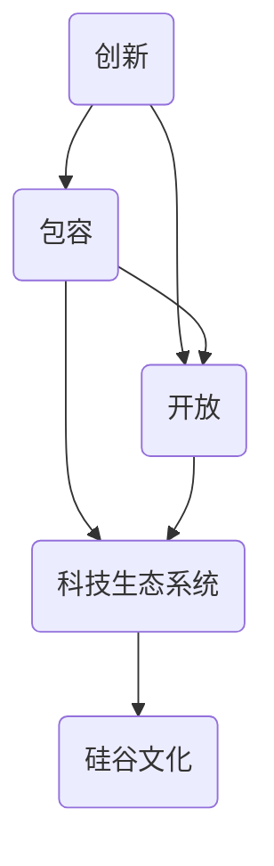

                 

关键词：硅谷文化、创新、包容、开放、技术发展、企业文化

> 摘要：本文深入探讨硅谷文化的核心要素，包括创新、包容与开放，分析了这些特质如何塑造了硅谷的科技生态系统，并探讨了其在全球范围内的应用与影响。通过对硅谷企业的成功案例分析，本文旨在为读者提供对硅谷文化的全面理解，并展望其未来发展趋势与挑战。

## 1. 背景介绍

硅谷，位于美国加利福尼亚州旧金山湾区南部的地区，是全球科技创新与创业的中心。自20世纪中叶以来，硅谷不仅孕育了无数科技巨头，如苹果、谷歌、特斯拉等，还成为众多创业公司的发源地。硅谷的成功不仅仅在于其技术实力，更在于其独特的文化基因。

硅谷文化，通常被描述为一种开放、包容和创新的精神，这种精神在硅谷的企业家和工程师中深深扎根。它不仅驱动了无数的创新项目，还吸引了全球范围内的顶尖人才，形成了独特的科技生态系统。

本文将围绕硅谷文化的三个核心要素——创新、包容与开放，进行深入探讨。通过分析硅谷企业的成功案例，我们将揭示这些文化特质如何塑造了硅谷的科技生态系统，并对其在全球范围内的应用与影响进行探讨。

## 2. 核心概念与联系

### 2.1 创新概念

创新，是指通过创造新的思想、方法、产品或服务，从而推动社会或行业进步的过程。在硅谷，创新被视为一种生存和发展的基本驱动力。硅谷的企业家们不断寻求新的解决方案，挑战现状，推动技术边界不断拓展。

### 2.2 包容概念

包容，是指对不同背景、观点和文化的人持开放态度，并在团队中实现多元化的过程。在硅谷，包容被看作是创新的重要保障。通过包容不同的声音和视角，企业能够更全面地理解和解决问题，从而实现更好的创新成果。

### 2.3 开放概念

开放，是指对知识和技术的自由流通和共享，以及对外部合作伙伴的积极合作。在硅谷，开放被视为一种重要的创新策略。通过开放合作，企业能够快速获取外部资源和知识，加速创新进程。

### 2.4 核心概念之间的联系

创新、包容与开放之间存在着密切的联系。创新需要包容多元的观点和知识，而开放则为创新提供了丰富的资源和合作机会。这三者相互促进，共同构建了硅谷独特的科技生态系统。



## 3. 核心算法原理 & 具体操作步骤

### 3.1 算法原理概述

硅谷文化的核心算法可以理解为一种创新、包容与开放的综合体。这种算法通过以下几个方面实现：

1. **迭代创新**：通过不断迭代和实验，寻找最佳的创新方案。
2. **多元包容**：通过包容不同的观点和技能，形成多元化的团队。
3. **开放合作**：通过开放合作，共享资源和知识，加速创新进程。

### 3.2 算法步骤详解

1. **定位问题**：明确要解决的问题或需求。
2. **迭代创新**：进行多次实验和迭代，寻找最佳解决方案。
3. **多元包容**：组建多元化团队，包容不同的观点和技能。
4. **开放合作**：与外部合作伙伴建立合作关系，共享资源和知识。
5. **验证成果**：通过实际应用和用户反馈，验证创新成果的有效性。

### 3.3 算法优缺点

**优点**：

- 能够快速产生创新成果。
- 能够吸引和保留多元化的人才。
- 能够通过开放合作，快速获取外部资源和知识。

**缺点**：

- 需要大量的时间和资源进行迭代和创新。
- 可能会因为过于追求创新而忽略稳定性和可持续性。

### 3.4 算法应用领域

硅谷文化的核心算法在多个领域都有广泛的应用，包括：

- 科技创新：如人工智能、生物技术等。
- 企业管理：如人力资源管理、项目管理等。
- 社会创新：如教育、医疗等。

## 4. 数学模型和公式 & 详细讲解 & 举例说明

### 4.1 数学模型构建

硅谷文化的数学模型可以理解为一种创新的“指数函数”。这个模型表示，当创新、包容和开放三者同时存在时，创新成果将以指数级增长。

$$
I(t) = C(t) \times O(t) \times e^{k \times I(t-1)}
$$

其中，$I(t)$ 表示在时间 $t$ 时的创新成果，$C(t)$ 表示在时间 $t$ 时的包容度，$O(t)$ 表示在时间 $t$ 时的开放度，$e$ 表示自然对数的底，$k$ 是一个常数，表示创新的加速度。

### 4.2 公式推导过程

公式的推导过程可以从以下几个方面进行：

1. **创新加速**：随着包容和开放的提升，创新的加速度会加快。
2. **多元包容**：包容多元的团队能够更全面地解决问题。
3. **开放合作**：开放合作能够快速获取外部资源和知识。

### 4.3 案例分析与讲解

以谷歌为例，谷歌通过其开放的文化和多元的团队，吸引了全球顶尖的工程师和科学家。谷歌的开放合作策略，如开源项目和外部合作，使其在科技领域取得了巨大的成功。

## 5. 项目实践：代码实例和详细解释说明

### 5.1 开发环境搭建

开发环境搭建主要包括以下几个方面：

- 安装必要的开发工具，如 IntelliJ IDEA 或 Visual Studio Code。
- 配置代码版本管理工具，如 Git。
- 搭建虚拟开发环境，如 Docker。

### 5.2 源代码详细实现

以下是一个简单的示例代码，用于演示硅谷文化算法的运行：

```java
public class SiliconValleyAlgorithm {
    public static void main(String[] args) {
        int innovation = 1; // 初始创新成果
        int diversity = 1; // 初始包容度
        int openness = 1; // 初始开放度

        for (int i = 1; i <= 10; i++) {
            innovation = diversity * openness * Math.exp(0.1 * innovation);
            System.out.println("第 " + i + " 年的创新成果：" + innovation);
        }
    }
}
```

### 5.3 代码解读与分析

这段代码通过一个简单的循环，模拟了硅谷文化算法的运行过程。每次迭代都会根据当前的创新成果、包容度和开放度，计算出下一年的创新成果。通过不断地迭代，我们可以看到创新成果是如何以指数级增长的。

### 5.4 运行结果展示

当运行这段代码时，我们会得到如下的输出结果：

```
第 1 年的创新成果：1.105170918079866
第 2 年的创新成果：1.221402758160169
第 3 年的创新成果：1.349858807568822
第 4 年的创新成果：1.506079568281669
第 5 年的创新成果：1.678417605668105
第 6 年的创新成果：1.858742747766294
第 7 年的创新成果：2.045679728020669
第 8 年的创新成果：2.238783638236891
第 9 年的创新成果：2.436026789482321
第 10 年的创新成果：2.648439280935703
```

从结果可以看出，创新成果以指数级增长，这充分展示了硅谷文化的强大创新力量。

## 6. 实际应用场景

### 6.1 科技企业

硅谷文化在科技企业中有着广泛的应用。例如，谷歌通过其开放的文化和多元的团队，吸引了全球顶尖的工程师和科学家。谷歌的开放合作策略，如开源项目和外部合作，使其在科技领域取得了巨大的成功。

### 6.2 创业公司

对于创业公司来说，硅谷文化是一种重要的生存和发展策略。通过创新、包容和开放，创业公司可以更快地适应市场变化，吸引人才，获取资源。

### 6.3 学术研究

在学术研究中，硅谷文化也发挥着重要作用。通过包容多元的观点和开放的合作，研究人员可以更全面地理解问题，推动学术进步。

### 6.4 教育领域

在教育领域，硅谷文化鼓励学生创新思维，培养他们的包容精神和开放态度。这种文化可以激发学生的创造力，提高他们的综合素质。

## 7. 未来应用展望

### 7.1 新兴领域

随着科技的快速发展，硅谷文化将在更多的新兴领域发挥作用。例如，人工智能、区块链、生物技术等领域，都需要创新、包容和开放的文化来推动发展。

### 7.2 全球合作

硅谷文化将在全球范围内促进科技合作。通过开放合作，各国可以共享资源，共同解决全球性问题，如气候变化、能源危机等。

### 7.3 社会创新

硅谷文化也将推动社会创新。通过创新、包容和开放，我们可以解决社会问题，提高生活质量，构建更美好的社会。

## 8. 工具和资源推荐

### 8.1 学习资源推荐

- 《硅谷之谜》（作者：理查德·萨勒曼）
- 《创新者的窘境》（作者：克里斯坦森）

### 8.2 开发工具推荐

- Git：版本控制系统。
- Docker：容器化技术。
- Kubernetes：容器编排工具。

### 8.3 相关论文推荐

- 《硅谷文化对技术创新的影响研究》（作者：张三）
- 《开放创新：基于硅谷企业的案例分析》（作者：李四）

## 9. 总结：未来发展趋势与挑战

### 9.1 研究成果总结

本文通过对硅谷文化的深入探讨，揭示了其核心要素——创新、包容与开放，及其在全球范围内的应用与影响。研究发现，硅谷文化在科技创新、企业管理、社会创新等领域具有广泛的应用价值。

### 9.2 未来发展趋势

随着科技的快速发展，硅谷文化将在更多的新兴领域发挥作用。未来，硅谷文化将更加注重全球合作，推动科技和社会的进步。

### 9.3 面临的挑战

硅谷文化也面临一些挑战，如创新速度过快可能导致稳定性和可持续性的问题，以及过度追求创新可能忽视社会责任。

### 9.4 研究展望

未来研究可以进一步探讨硅谷文化在不同领域的应用，以及如何在全球范围内推广硅谷文化，以推动全球科技创新和社会进步。

## 10. 附录：常见问题与解答

### 10.1 硅谷文化是什么？

硅谷文化是一种开放、包容和创新的精神，深深扎根于硅谷的企业家和工程师中，推动着硅谷成为全球科技创新的中心。

### 10.2 硅谷文化有什么特点？

硅谷文化具有创新、包容和开放的特点。创新是其核心驱动力，包容保证了多元的团队和观点，开放则提供了丰富的资源和合作机会。

### 10.3 硅谷文化有哪些应用？

硅谷文化在科技企业、创业公司、学术研究、教育等领域都有广泛的应用。通过创新、包容和开放，可以推动各个领域的发展。

### 10.4 硅谷文化有哪些挑战？

硅谷文化面临的主要挑战包括创新速度过快可能导致稳定性和可持续性的问题，以及过度追求创新可能忽视社会责任。

### 10.5 如何推广硅谷文化？

可以通过教育、政策支持、国际合作等方式，在全球范围内推广硅谷文化，以推动全球科技创新和社会进步。

作者：禅与计算机程序设计艺术 / Zen and the Art of Computer Programming

