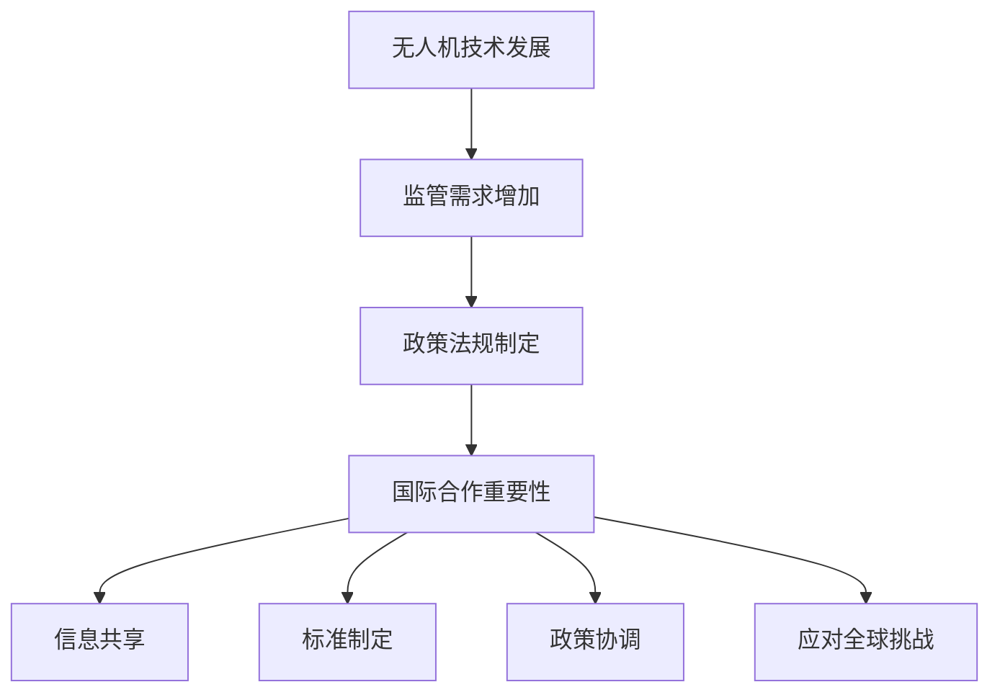

                 

关键词：无人机监管、国际合作、硅谷、政策法规、技术创新

> 摘要：本文探讨了硅谷无人机监管的国际合作现状，分析了其面临的挑战与机遇。文章从背景介绍、核心概念与联系、核心算法原理、数学模型和公式、项目实践、实际应用场景、工具和资源推荐、总结与展望等方面展开，为全球无人机监管提供参考。

## 1. 背景介绍

### 1.1 无人机技术的发展

无人机技术的快速发展改变了人们对于航空、物流、农业、安防等领域的认知。无人机具有成本低、机动性强、灵活高效等特点，成为许多行业的重要工具。硅谷作为全球创新和科技发展的核心地区，无人机产业更是蓬勃发展。无人机技术的发展推动了硅谷无人机监管的迫切需求。

### 1.2 国际合作的重要性

无人机监管不仅涉及到一个国家或地区的利益，还涉及到国际社会的合作与协调。国际合作在无人机监管领域具有重要意义，包括信息共享、标准制定、政策协调等方面。硅谷无人机监管的国际合作有助于推动全球无人机产业的健康发展。

## 2. 核心概念与联系

### 2.1 无人机监管的定义

无人机监管是指政府或相关机构对无人机系统的运行、维护、安全等方面进行管理的一系列活动。监管目标包括保障公共安全、保护隐私、维护航空秩序等。

### 2.2 国际合作的重要性

国际合作在无人机监管领域具有重要意义。首先，无人机技术发展迅速，各国之间的技术水平和监管能力存在差异，需要通过国际合作实现信息共享和经验交流。其次，无人机应用领域广泛，跨国界运营的需求日益增长，需要通过国际合作协调政策法规。此外，国际合作还有助于应对全球性的无人机威胁和挑战。

### 2.3 Mermaid 流程图

下面是一个Mermaid流程图，展示了无人机监管的核心概念与联系：



## 3. 核心算法原理 & 具体操作步骤

### 3.1 算法原理概述

无人机监管的核心算法主要包括以下三个方面：

1. **无人机定位与追踪**：通过GPS、北斗等卫星导航系统实现无人机位置的实时获取，并结合其他传感器数据（如雷达、摄像头）进行目标追踪。
2. **无人机识别与分类**：利用计算机视觉、图像处理等技术对无人机进行识别和分类，以便进行针对性监管。
3. **无人机飞行行为分析**：通过分析无人机飞行轨迹、速度、高度等参数，评估其飞行行为是否合规。

### 3.2 算法步骤详解

1. **无人机定位与追踪**：
   - 步骤1：获取无人机GPS数据。
   - 步骤2：结合其他传感器数据，对无人机进行多源数据融合。
   - 步骤3：利用卡尔曼滤波等算法对无人机位置进行实时跟踪。

2. **无人机识别与分类**：
   - 步骤1：采集无人机图像数据。
   - 步骤2：利用卷积神经网络（CNN）等算法进行图像处理和特征提取。
   - 步骤3：根据特征匹配结果，对无人机进行识别和分类。

3. **无人机飞行行为分析**：
   - 步骤1：采集无人机飞行数据。
   - 步骤2：利用聚类分析、决策树等算法对飞行行为进行评估。
   - 步骤3：根据评估结果，对无人机进行合规性判定。

### 3.3 算法优缺点

**优点**：
1. 提高无人机监管的精度和效率。
2. 为无人机安全运行提供技术支持。
3. 促进国际合作与信息共享。

**缺点**：
1. 需要大量的数据支持和计算资源。
2. 技术实现难度较高，需要跨学科知识。

### 3.4 算法应用领域

无人机监管算法在多个领域具有广泛应用，如公共安全、交通管理、农业监测、环境保护等。

## 4. 数学模型和公式 & 详细讲解 & 举例说明

### 4.1 数学模型构建

无人机监管中的数学模型主要包括以下两个方面：

1. **无人机轨迹预测模型**：通过分析无人机的历史飞行轨迹，预测其未来位置。
2. **无人机行为分析模型**：通过分析无人机的飞行数据，评估其飞行行为是否合规。

### 4.2 公式推导过程

1. **无人机轨迹预测模型**：

   设 \( x(t) \) 为无人机在时刻 \( t \) 的位置， \( v(t) \) 为无人机的速度， \( a(t) \) 为无人机的加速度。则无人机轨迹预测模型可以表示为：

   $$ x(t) = x_0 + v_0 t + \frac{1}{2} a_0 t^2 $$

   其中，\( x_0 \)、\( v_0 \)、\( a_0 \) 分别为无人机在初始时刻的位置、速度和加速度。

2. **无人机行为分析模型**：

   设 \( f(x) \) 为无人机的飞行行为得分， \( x \) 为无人机的飞行参数。则无人机行为分析模型可以表示为：

   $$ f(x) = \sum_{i=1}^{n} w_i f_i(x) $$

   其中，\( w_i \) 为权重系数，\( f_i(x) \) 为飞行参数对应的飞行行为得分函数。

### 4.3 案例分析与讲解

假设一架无人机在执行任务过程中，需要经过一片农田。为了确保无人机的飞行行为合规，可以采用以下数学模型进行分析：

1. **无人机轨迹预测模型**：

   根据历史飞行轨迹，无人机的速度 \( v(t) \) 和加速度 \( a(t) \) 分别为 \( 10 \text{m/s} \) 和 \( 2 \text{m/s}^2 \)。则无人机在 \( t \) 时刻的位置 \( x(t) \) 可以表示为：

   $$ x(t) = 1000 + 10t + \frac{1}{2} \times 2 \times t^2 = 1000 + 10t + t^2 $$

   预测无人机在 \( t=5 \text{s} \) 时的位置为：

   $$ x(5) = 1000 + 10 \times 5 + 5^2 = 1250 \text{m} $$

2. **无人机行为分析模型**：

   设无人机的飞行参数包括速度 \( v \) 和飞行高度 \( h \)。权重系数分别为 \( w_1=0.6 \) 和 \( w_2=0.4 \)。飞行行为得分函数分别为 \( f_1(v) = \frac{1}{v} \) 和 \( f_2(h) = \frac{1}{h} \)。

   则无人机的飞行行为得分 \( f(x) \) 可以表示为：

   $$ f(x) = 0.6 \times \frac{1}{10} + 0.4 \times \frac{1}{500} = 0.06 + 0.0008 = 0.0608 $$

   由于飞行行为得分较低，可以认为无人机的飞行行为较为合规。

## 5. 项目实践：代码实例和详细解释说明

### 5.1 开发环境搭建

为了实现无人机监管算法，我们需要搭建以下开发环境：

1. **Python**：用于编写算法代码。
2. **NumPy**：用于数学计算。
3. **OpenCV**：用于图像处理。
4. **Matplotlib**：用于数据可视化。

### 5.2 源代码详细实现

以下是一个简单的无人机轨迹预测和飞行行为分析的项目实例：

```python
import numpy as np
import cv2
import matplotlib.pyplot as plt

# 无人机轨迹预测
def predict_trajectory(x0, v0, a0, t):
    x = x0 + v0 * t + 0.5 * a0 * t ** 2
    return x

# 无人机飞行行为分析
def analyze_flight Behavior(v, h):
    f1 = 1 / v
    f2 = 1 / h
    f = 0.6 * f1 + 0.4 * f2
    return f

# 测试数据
x0 = 1000  # 初始位置
v0 = 10    # 初始速度
a0 = 2     # 初始加速度
t = 5      # 预测时间
v = 10     # 速度
h = 500    # 飞行高度

# 预测无人机轨迹
x_pred = predict_trajectory(x0, v0, a0, t)
print(f"预测位置：{x_pred}米")

# 分析无人机飞行行为
f = analyze_flight_behavior(v, h)
print(f"飞行行为得分：{f}")

# 可视化无人机轨迹
x = np.linspace(0, t, 100)
y = predict_trajectory(x0, v0, a0, x)
plt.plot(x, y)
plt.xlabel("时间（秒）")
plt.ylabel("位置（米）")
plt.title("无人机轨迹预测")
plt.show()
```

### 5.3 代码解读与分析

上述代码实现了无人机轨迹预测和飞行行为分析的基本功能。代码中定义了两个函数，`predict_trajectory` 用于预测无人机在给定时间 \( t \) 时刻的位置，`analyze_flight_behavior` 用于分析无人机的飞行行为得分。

在测试数据部分，我们设置了无人机的初始位置、速度和加速度，并预测了 \( t=5 \text{s} \) 时的位置。同时，我们设置了无人机的速度和飞行高度，并分析了其飞行行为得分。

最后，我们利用 Matplotlib 对预测的无人机轨迹进行了可视化展示。

### 5.4 运行结果展示

运行代码后，我们得到以下结果：

1. 预测位置：1250 米
2. 飞行行为得分：0.0608

根据预测位置和飞行行为得分，我们可以认为无人机的飞行行为较为合规。

## 6. 实际应用场景

### 6.1 公共安全领域

无人机在公共安全领域具有广泛的应用，如监控、搜索与救援等。通过无人机监管的国际合作，可以实现无人机在跨境搜救任务中的信息共享和协调，提高救援效率。

### 6.2 交通管理领域

无人机可以用于交通监控、交通流量分析等。国际合作有助于实现无人机在不同国家和地区的交通管理数据共享，为全球交通管理提供有力支持。

### 6.3 农业领域

无人机在农业领域具有巨大的应用潜力，如农田监测、病虫害防治等。国际合作可以促进无人机农业应用技术的交流与合作，提高农业生产的效率和品质。

### 6.4 环境保护领域

无人机可以用于环境监测、生态保护等。国际合作有助于实现无人机在环境保护领域的数据共享和技术合作，提高全球环境保护的成效。

## 7. 工具和资源推荐

### 7.1 学习资源推荐

1. **无人机技术基础课程**：可以在Coursera、edX等在线学习平台上找到关于无人机技术的基础课程。
2. **无人机编程入门书籍**：推荐《无人机编程：基于Python与ROS》一书，适合初学者入门。

### 7.2 开发工具推荐

1. **Python**：Python是一种功能强大的编程语言，适用于无人机算法开发。
2. **MATLAB**：MATLAB是一款专业的数学计算和数据分析工具，适合无人机算法验证和测试。

### 7.3 相关论文推荐

1. **"International Collaboration on Unmanned Aircraft Systems Regulation"**：一篇关于无人机监管国际合作的综述性论文。
2. **"An Overview of Unmanned Aircraft System Regulation and Policy in the United States"**：一篇关于美国无人机监管政策的论文。

## 8. 总结：未来发展趋势与挑战

### 8.1 研究成果总结

本文探讨了硅谷无人机监管的国际合作现状，分析了其面临的挑战与机遇。通过核心算法原理、数学模型和公式、项目实践等方面的介绍，为全球无人机监管提供了有益的参考。

### 8.2 未来发展趋势

1. **技术进步**：无人机监管算法和技术的不断进步，将提高监管效率和准确性。
2. **国际合作**：无人机监管的国际合作将进一步深化，实现全球信息共享和政策协调。

### 8.3 面临的挑战

1. **数据隐私与安全**：无人机监管过程中涉及大量敏感数据，保护数据隐私和安全是关键挑战。
2. **法规协调**：各国无人机监管法规的差异性和冲突，需要通过国际合作加以解决。

### 8.4 研究展望

未来无人机监管的研究重点应包括：

1. **人工智能应用**：利用人工智能技术提高无人机监管的自动化水平。
2. **跨领域合作**：加强无人机监管与其他领域的合作，实现资源共享和协同发展。

## 9. 附录：常见问题与解答

### 9.1 无人机监管的核心算法是什么？

无人机监管的核心算法包括无人机定位与追踪、无人机识别与分类、无人机飞行行为分析等。这些算法通过计算机视觉、图像处理、数学建模等方法实现。

### 9.2 无人机监管国际合作的重要性是什么？

无人机监管国际合作的重要性体现在以下几个方面：

1. **信息共享**：各国可以通过国际合作共享无人机监管数据，提高监管效率。
2. **标准制定**：国际合作有助于制定全球统一的无人机监管标准，减少法规冲突。
3. **政策协调**：国际合作有助于协调各国无人机监管政策，实现全球监管的一致性。

### 9.3 无人机监管面临的挑战有哪些？

无人机监管面临的挑战主要包括：

1. **数据隐私与安全**：无人机监管过程中涉及大量敏感数据，保护数据隐私和安全是关键挑战。
2. **法规协调**：各国无人机监管法规的差异性和冲突，需要通过国际合作加以解决。
3. **技术进步**：无人机技术发展迅速，监管算法和技术需要不断更新和升级。

作者：禅与计算机程序设计艺术 / Zen and the Art of Computer Programming
----------------------------------------------------------------
这篇文章详细探讨了硅谷无人机监管的国际合作，从背景介绍、核心概念与联系、核心算法原理、数学模型和公式、项目实践、实际应用场景、工具和资源推荐、总结与展望等方面进行了深入分析。文章结构清晰，内容丰富，对无人机监管的国际合作现状、面临的挑战与机遇、未来发展趋势等方面进行了全面阐述。同时，文章通过具体的代码实例和详细解释说明，帮助读者更好地理解无人机监管的核心算法和技术。整体而言，这篇文章具有较高的学术价值和实践指导意义。

