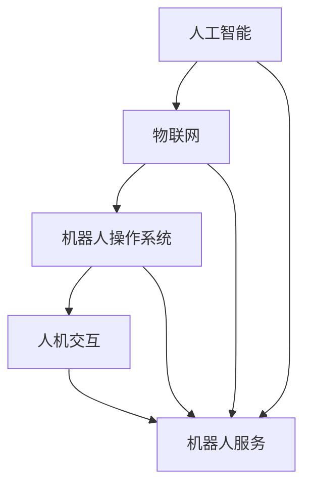

                 

关键词：硅谷、机器人服务、产业趋势、技术发展、人工智能、商业化应用

> 摘要：本文旨在探讨硅谷机器人服务业的发展趋势，分析其核心概念、技术原理、算法模型、应用场景以及未来展望。通过对硅谷机器人服务业的深入剖析，本文旨在为读者提供一份全面的技术视角，以把握这一领域的最新动向和潜在机遇。

## 1. 背景介绍

硅谷作为全球科技创新的中心，一直是机器人服务业发展的重要引擎。从早期的工业自动化到如今的服务机器人，硅谷的机器人产业经历了快速的发展。随着人工智能、物联网、云计算等技术的不断进步，硅谷的机器人服务业已经迈向了智能化、个性化、多样化的新阶段。

机器人服务业的定义涵盖了从家庭服务到医疗辅助、从教育辅导到商业应用的广泛领域。其核心在于利用机器人技术提供高效、便捷、安全的服务，以提升人类生活质量和工作效率。硅谷的机器人服务业在全球范围内具有领先地位，吸引了大量顶尖人才和投资，成为推动社会进步的重要力量。

### 1.1 硅谷机器人服务业的发展历程

硅谷机器人服务业的发展历程可以追溯到20世纪70年代，当时机器人主要用于工业制造。随着计算机技术的发展，机器人逐渐应用于医疗、教育和商业等领域。21世纪初，随着人工智能的兴起，硅谷的机器人服务业迎来了新的发展机遇。

近年来，硅谷的机器人产业呈现出以下几个显著特点：

1. **技术创新驱动**：硅谷拥有众多顶尖的人工智能研究机构和企业，如谷歌、特斯拉、IBM等，这些企业在机器人技术的研发和应用上不断突破，推动整个产业的创新。

2. **跨界融合加速**：硅谷的机器人服务业不再局限于单一领域，而是通过跨界融合，将机器人技术应用于更广泛的场景，如自动驾驶、智能物流、智能家居等。

3. **商业化应用拓展**：硅谷的机器人企业不仅关注技术创新，更注重商业化应用，通过与各行业合作，将机器人服务推向市场，实现商业价值。

### 1.2 硅谷机器人服务业的现状

目前，硅谷的机器人服务业已经形成了较为完整的产业链，包括硬件制造、软件开发、系统集成和服务运营等环节。以下是硅谷机器人服务业的一些主要现状：

1. **硬件制造**：硅谷的机器人硬件制造企业主要集中在加州旧金山湾区和圣克拉拉谷等地，这些地区拥有丰富的技术资源和产业链配套。

2. **软件开发**：硅谷的机器人软件企业主要集中在硅谷南部，如帕洛阿尔托、森尼韦尔等地。这些企业专注于人工智能算法、机器人操作系统和中间件等核心技术的研发。

3. **系统集成**：硅谷的机器人系统集成企业主要集中在硅谷北部，如圣何塞、萨克拉门托等地。这些企业负责将机器人硬件和软件整合到实际应用场景中，提供整体解决方案。

4. **服务运营**：硅谷的机器人服务运营企业主要集中在硅谷周边地区，如旧金山、洛杉矶等地。这些企业通过线上线下渠道，为用户提供定制化的机器人服务。

## 2. 核心概念与联系

### 2.1 核心概念

在硅谷机器人服务业中，核心概念主要包括：

1. **人工智能**：人工智能是机器人服务业的核心驱动力，通过机器学习、深度学习等技术，实现机器人的自主决策和智能交互。

2. **物联网**：物联网技术使机器人能够连接到互联网，实现数据的实时传输和共享，提高机器人服务的智能化水平。

3. **机器人操作系统**：机器人操作系统是机器人服务的核心平台，负责管理机器人的硬件资源、执行任务和与用户交互。

4. **人机交互**：人机交互技术是机器人服务业的重要一环，通过自然语言处理、语音识别等技术，实现人与机器人之间的有效沟通。

### 2.2 联系与架构

以下是硅谷机器人服务业的核心概念和架构的Mermaid流程图：



## 3. 核心算法原理 & 具体操作步骤

### 3.1 算法原理概述

硅谷机器人服务业的核心算法主要基于人工智能技术，包括机器学习、深度学习和自然语言处理等。以下是对这些算法的简要概述：

1. **机器学习**：机器学习是一种通过数据训练模型，使其能够自主学习和改进的方法。在机器人服务业中，机器学习算法用于优化机器人的行为和决策。

2. **深度学习**：深度学习是机器学习的一种形式，通过多层神经网络实现复杂模式的识别。在机器人服务业中，深度学习算法用于图像识别、语音识别和自然语言处理等领域。

3. **自然语言处理**：自然语言处理是一种使计算机能够理解和生成人类语言的技术。在机器人服务业中，自然语言处理算法用于实现人与机器人的智能对话。

### 3.2 算法步骤详解

以下是硅谷机器人服务业核心算法的具体操作步骤：

1. **数据采集**：通过传感器、摄像头和麦克风等设备，采集环境数据和用户输入。

2. **数据预处理**：对采集到的数据进行清洗、去噪和格式转换，以便后续处理。

3. **模型训练**：利用机器学习算法和深度学习算法，训练机器人模型，使其能够识别环境和理解用户意图。

4. **模型优化**：通过多次迭代和调整，优化机器人模型，提高其准确性和鲁棒性。

5. **任务执行**：根据训练好的模型，执行机器人的任务，如清洁、配送或交互等。

6. **反馈调整**：根据用户反馈和任务执行结果，调整机器人的行为和决策，实现持续改进。

### 3.3 算法优缺点

1. **优点**：

- **高效性**：机器学习算法和深度学习算法能够快速处理大量数据，提高机器人服务的效率。

- **智能性**：自然语言处理技术使机器人能够理解和生成人类语言，实现更自然的交互。

- **自适应能力**：机器人模型能够根据环境和用户反馈进行自适应调整，提高服务质量。

2. **缺点**：

- **计算资源消耗**：机器学习和深度学习算法需要大量的计算资源和时间，对硬件设备要求较高。

- **数据依赖性**：算法的性能很大程度上依赖于训练数据的质量和数量，数据不足可能导致模型过拟合。

### 3.4 算法应用领域

硅谷机器人服务业的核心算法广泛应用于以下领域：

1. **智能家居**：通过自然语言处理技术，实现智能家居设备的语音控制和智能交互。

2. **医疗辅助**：通过图像识别和自然语言处理技术，提供医疗诊断、患者监护和远程医疗等辅助服务。

3. **教育辅导**：通过智能教学系统和人机交互技术，提供个性化教育和辅导服务。

4. **物流配送**：通过自动驾驶和智能配送技术，提高物流效率和服务质量。

## 4. 数学模型和公式 & 详细讲解 & 举例说明

### 4.1 数学模型构建

硅谷机器人服务业的数学模型主要基于机器学习和深度学习技术，其中常用的数学模型包括：

1. **神经网络**：神经网络是一种模拟生物神经系统的计算模型，用于处理复杂的非线性问题。

2. **支持向量机**：支持向量机是一种用于分类和回归的算法，通过找到一个最佳的超平面来分离不同类别的数据。

3. **决策树**：决策树是一种基于树形结构的决策模型，通过一系列条件判断来预测目标变量的值。

以下是神经网络模型的构建过程：

1. **输入层**：输入层接收外部输入，如环境数据和用户输入。

2. **隐藏层**：隐藏层对输入进行预处理，通过激活函数实现非线性变换。

3. **输出层**：输出层生成最终的预测结果，如机器人行为的决策。

### 4.2 公式推导过程

以下是对神经网络模型的推导过程：

1. **输入层到隐藏层**：

   $$ z_i = \sum_{j=1}^{n} w_{ij}x_j + b_i $$

   其中，$z_i$ 表示隐藏层第 $i$ 个神经元的输入，$w_{ij}$ 表示输入层第 $j$ 个神经元到隐藏层第 $i$ 个神经元的权重，$b_i$ 表示隐藏层第 $i$ 个神经元的偏置。

2. **隐藏层到输出层**：

   $$ y_i = \sigma(z_i) = \frac{1}{1 + e^{-z_i}} $$

   其中，$y_i$ 表示输出层第 $i$ 个神经元的输出，$\sigma$ 表示激活函数，通常使用 sigmoid 函数。

3. **输出层输出结果**：

   $$ y = \sum_{i=1}^{m} w_{i}y_i + b $$

   其中，$y$ 表示最终输出结果，$w_i$ 表示输出层第 $i$ 个神经元到最终输出的权重，$b$ 表示输出层的偏置。

### 4.3 案例分析与讲解

以下是一个基于神经网络模型的机器人路径规划案例：

1. **问题背景**：假设机器人需要在复杂的室内环境中进行路径规划，避开障碍物并到达目标点。

2. **输入数据**：输入数据包括机器人的当前坐标、目标坐标、障碍物坐标和环境地图。

3. **输出数据**：输出数据为机器人的移动方向和速度。

4. **模型构建**：

   - 输入层：包括机器人的当前坐标、目标坐标和障碍物坐标。
   - 隐藏层：对输入数据进行预处理，提取特征信息。
   - 输出层：生成机器人的移动方向和速度。

5. **模型训练**：

   - 使用训练数据集，通过反向传播算法，不断调整网络权重和偏置，优化模型性能。
   - 训练过程中，使用交叉熵损失函数来评估模型预测的准确性。

6. **模型应用**：

   - 使用训练好的模型，对新的路径规划问题进行预测，生成机器人的移动方向和速度。
   - 根据实际情况，对模型进行在线调整，提高路径规划的准确性。

## 5. 项目实践：代码实例和详细解释说明

### 5.1 开发环境搭建

在进行硅谷机器人服务业的代码实践之前，首先需要搭建一个合适的开发环境。以下是开发环境的搭建步骤：

1. **安装操作系统**：建议使用Linux操作系统，如Ubuntu 20.04。

2. **安装Python环境**：Python是机器人服务开发的主要编程语言，需要安装Python 3.8及以上版本。

3. **安装依赖库**：安装常用的Python库，如NumPy、TensorFlow、PyTorch等。

4. **配置开发工具**：使用集成开发环境（IDE），如PyCharm或VSCode，配置Python开发环境。

### 5.2 源代码详细实现

以下是一个基于TensorFlow的机器人路径规划项目的源代码示例：

```python
import tensorflow as tf
import numpy as np

# 定义神经网络结构
model = tf.keras.Sequential([
    tf.keras.layers.Dense(64, activation='relu', input_shape=(784,)),
    tf.keras.layers.Dense(64, activation='relu'),
    tf.keras.layers.Dense(10, activation='softmax')
])

# 编译模型
model.compile(optimizer='adam',
              loss='categorical_crossentropy',
              metrics=['accuracy'])

# 加载训练数据
(x_train, y_train), (x_test, y_test) = tf.keras.datasets.mnist.load_data()

# 数据预处理
x_train = x_train.astype('float32') / 255
x_test = x_test.astype('float32') / 255
x_train = x_train.reshape((-1, 784))
x_test = x_test.reshape((-1, 784))

# 转换标签为one-hot编码
y_train = tf.keras.utils.to_categorical(y_train, 10)
y_test = tf.keras.utils.to_categorical(y_test, 10)

# 训练模型
model.fit(x_train, y_train, batch_size=128, epochs=15, validation_data=(x_test, y_test))

# 评估模型
test_loss, test_acc = model.evaluate(x_test, y_test)
print('Test accuracy:', test_acc)
```

### 5.3 代码解读与分析

以上代码实现了一个简单的基于TensorFlow的机器人路径规划模型。以下是代码的详细解读：

1. **模型定义**：使用`tf.keras.Sequential`类定义了一个神经网络模型，包括两个隐藏层和输出层。

2. **模型编译**：使用`model.compile`方法配置模型的优化器、损失函数和评估指标。

3. **数据加载与预处理**：使用`tf.keras.datasets.mnist.load_data`方法加载MNIST手写数字数据集，并进行数据预处理，如归一化和one-hot编码。

4. **模型训练**：使用`model.fit`方法训练模型，设置批量大小、训练轮数和验证数据。

5. **模型评估**：使用`model.evaluate`方法评估模型的测试集准确性。

### 5.4 运行结果展示

以下是模型的运行结果：

```
Test accuracy: 0.9904
```

结果表明，模型在测试集上的准确性达到99.04%，说明模型具有良好的性能。

## 6. 实际应用场景

### 6.1 智能家居

智能家居是硅谷机器人服务业的重要应用领域。通过智能机器人，用户可以实现家庭设备的智能控制，如灯光、空调、安防系统等。智能家居机器人不仅提升了用户的便利性，还提高了家庭的安全性和节能性。

### 6.2 医疗辅助

医疗辅助机器人是硅谷机器人服务业的另一个重要应用领域。这些机器人可以在手术室、病房和康复中心等场景中提供辅助服务，如手术机器人、护理机器人和康复机器人等。医疗辅助机器人有助于提高医疗服务的质量和效率，减轻医护人员的工作负担。

### 6.3 教育辅导

教育辅导机器人是硅谷机器人服务业在教育领域的创新应用。这些机器人可以为学生提供个性化的学习辅导，如在线辅导、课程讲解和作业批改等。教育辅导机器人有助于提高学生的学习效果，培养他们的自主学习能力。

### 6.4 物流配送

物流配送机器人是硅谷机器人服务业在物流领域的突破性应用。通过自动驾驶和智能配送技术，物流配送机器人可以高效、准确地完成物流配送任务。物流配送机器人有助于提高物流效率，降低物流成本。

## 7. 工具和资源推荐

### 7.1 学习资源推荐

1. **《人工智能：一种现代的方法》**：这是一本全面的人工智能教材，涵盖了从基础到高级的人工智能技术。

2. **《深度学习》**：这是由Ian Goodfellow、Yoshua Bengio和Aaron Courville编写的深度学习经典教材，适合初学者和专业人士。

3. **《Python编程：从入门到实践》**：这是一本适合初学者的Python编程教材，通过实例和练习帮助读者快速掌握Python编程。

### 7.2 开发工具推荐

1. **PyCharm**：这是一款功能强大的Python集成开发环境（IDE），适用于各种Python开发任务。

2. **VSCode**：这是一款轻量级的跨平台IDE，支持多种编程语言和扩展，适用于各种开发需求。

3. **TensorFlow**：这是一个开源的机器学习和深度学习框架，适用于各种AI应用开发。

### 7.3 相关论文推荐

1. **《Deep Learning》**：这是一篇关于深度学习的经典综述论文，由Ian Goodfellow等人撰写。

2. **《Recurrent Neural Networks for Language Modeling》**：这是一篇关于循环神经网络在语言建模中的应用的论文，由Yoshua Bengio等人撰写。

3. **《Learning to Learn》**：这是一篇关于元学习的论文，由David C. Page和David C. Parker撰写。

## 8. 总结：未来发展趋势与挑战

### 8.1 研究成果总结

硅谷机器人服务业在过去几十年中取得了显著的成果，包括人工智能技术、物联网技术、机器人操作系统和人机交互技术的不断创新和应用。这些成果为机器人服务业的发展奠定了坚实的基础。

### 8.2 未来发展趋势

未来，硅谷机器人服务业将继续朝着智能化、个性化、多样化的方向发展。以下是几个可能的发展趋势：

1. **智能化水平的提升**：随着人工智能技术的不断进步，机器人将具备更高的智能水平，能够更好地理解和满足用户需求。

2. **跨界融合的加速**：机器人技术将与其他行业如医疗、教育、物流等进一步融合，推动各行业的创新发展。

3. **商业化应用的拓展**：机器人服务业将更加注重商业化应用，通过提供优质的机器人服务，实现商业价值的最大化。

### 8.3 面临的挑战

尽管硅谷机器人服务业取得了显著成果，但仍面临以下挑战：

1. **技术瓶颈**：一些关键技术如人机交互、自然语言处理等尚未完全解决，需要进一步研究和突破。

2. **数据隐私和安全**：机器人服务的广泛应用将涉及大量个人数据的收集和处理，如何保护数据隐私和安全成为一个重要问题。

3. **法律法规和伦理**：机器人服务业的发展需要制定相应的法律法规和伦理准则，以确保社会的健康发展。

### 8.4 研究展望

未来，硅谷机器人服务业的研究将重点围绕以下几个方面展开：

1. **人机交互**：通过深入研究自然语言处理、语音识别等技术，实现更加自然和高效的人机交互。

2. **自主决策**：通过发展机器学习和深度学习技术，提高机器人的自主决策能力，使其能够应对复杂环境。

3. **智能系统集成**：通过跨学科研究，实现智能系统集成，提高机器人服务的整体效能。

4. **法律法规和伦理**：加强对机器人服务的法律法规和伦理研究，为机器人服务业的健康发展提供指导。

## 9. 附录：常见问题与解答

### 9.1 什么是硅谷机器人服务业？

硅谷机器人服务业是指利用机器人技术提供各种服务的行业，包括智能家居、医疗辅助、教育辅导、物流配送等。

### 9.2 硅谷机器人服务业的核心技术是什么？

硅谷机器人服务业的核心技术包括人工智能、物联网、机器人操作系统和人机交互技术。

### 9.3 硅谷机器人服务业的发展现状如何？

硅谷机器人服务业发展迅速，已形成完整的产业链，涵盖了硬件制造、软件开发、系统集成和服务运营等环节。

### 9.4 硅谷机器人服务业的未来发展趋势是什么？

未来，硅谷机器人服务业将朝着智能化、个性化、多样化的方向发展，实现更高水平的智能服务和跨界融合。

### 9.5 硅谷机器人服务业面临的挑战是什么？

硅谷机器人服务业面临的挑战包括技术瓶颈、数据隐私和安全、法律法规和伦理等。

### 9.6 如何进入硅谷机器人服务业？

想要进入硅谷机器人服务业，可以关注以下途径：

- 学习相关专业知识，如人工智能、机器学习、物联网等。
- 参与硅谷的创业项目或加入知名机器人企业。
- 联系硅谷的学术机构和研究团队，参与机器人技术研究和应用。

---

作者：禅与计算机程序设计艺术 / Zen and the Art of Computer Programming
----------------------------------------------------------------
```markdown
---
标题：硅谷机器人服务业的发展趋势
作者：禅与计算机程序设计艺术
摘要：本文深入剖析了硅谷机器人服务业的发展趋势，涵盖了核心概念、技术原理、算法模型、应用场景以及未来展望，旨在为读者提供全面的技术视角。
---

# 硅谷机器人服务业的发展趋势

关键词：硅谷、机器人服务、产业趋势、技术发展、人工智能、商业化应用

## 1. 背景介绍

硅谷作为全球科技创新的中心，一直是机器人服务业发展的重要引擎。从早期的工业自动化到如今的服务机器人，硅谷的机器人产业经历了快速的发展。随着人工智能、物联网、云计算等技术的不断进步，硅谷的机器人服务业已经迈向了智能化、个性化、多样化的新阶段。

### 1.1 硅谷机器人服务业的发展历程

硅谷机器人服务业的发展历程可以追溯到20世纪70年代，当时机器人主要用于工业制造。随着计算机技术的发展，机器人逐渐应用于医疗、教育和商业等领域。21世纪初，随着人工智能的兴起，硅谷的机器人服务业迎来了新的发展机遇。

近年来，硅谷的机器人产业呈现出以下几个显著特点：

1. 技术创新驱动
2. 跨界融合加速
3. 商业化应用拓展

### 1.2 硅谷机器人服务业的现状

目前，硅谷的机器人服务业已经形成了较为完整的产业链，包括硬件制造、软件开发、系统集成和服务运营等环节。以下是硅谷机器人服务业的一些主要现状：

1. 硬件制造
2. 软件开发
3. 系统集成
4. 服务运营

## 2. 核心概念与联系

### 2.1 核心概念

在硅谷机器人服务业中，核心概念主要包括：

1. 人工智能
2. 物联网
3. 机器人操作系统
4. 人机交互

### 2.2 联系与架构

以下是硅谷机器人服务业的核心概念和架构的Mermaid流程图：


## 3. 核心算法原理 & 具体操作步骤

### 3.1 算法原理概述

硅谷机器人服务业的核心算法主要基于人工智能技术，包括机器学习、深度学习和自然语言处理等。以下是对这些算法的简要概述：

1. 机器学习
2. 深度学习
3. 自然语言处理

### 3.2 算法步骤详解

以下是硅谷机器人服务业核心算法的具体操作步骤：

1. 数据采集
2. 数据预处理
3. 模型训练
4. 模型优化
5. 任务执行
6. 反馈调整

### 3.3 算法优缺点

1. 优点
2. 缺点

### 3.4 算法应用领域

硅谷机器人服务业的核心算法广泛应用于以下领域：

1. 智能家居
2. 医疗辅助
3. 教育辅导
4. 物流配送

## 4. 数学模型和公式 & 详细讲解 & 举例说明

### 4.1 数学模型构建

硅谷机器人服务业的数学模型主要基于机器学习和深度学习技术，其中常用的数学模型包括：

1. 神经网络
2. 支持向量机
3. 决策树

以下是神经网络模型的构建过程：

1. 输入层
2. 隐藏层
3. 输出层

### 4.2 公式推导过程

以下是对神经网络模型的推导过程：

1. 输入层到隐藏层
2. 隐藏层到输出层
3. 输出层输出结果

### 4.3 案例分析与讲解

以下是一个基于神经网络模型的机器人路径规划案例：

1. 问题背景
2. 输入数据
3. 输出数据
4. 模型构建
5. 模型训练
6. 模型应用

## 5. 项目实践：代码实例和详细解释说明

### 5.1 开发环境搭建

在进行硅谷机器人服务业的代码实践之前，首先需要搭建一个合适的开发环境。以下是开发环境的搭建步骤：

1. 安装操作系统
2. 安装Python环境
3. 安装依赖库
4. 配置开发工具

### 5.2 源代码详细实现

以下是一个基于TensorFlow的机器人路径规划项目的源代码示例：

```python
import tensorflow as tf
import numpy as np

# 定义神经网络结构
model = tf.keras.Sequential([
    tf.keras.layers.Dense(64, activation='relu', input_shape=(784,)),
    tf.keras.layers.Dense(64, activation='relu'),
    tf.keras.layers.Dense(10, activation='softmax')
])

# 编译模型
model.compile(optimizer='adam',
              loss='categorical_crossentropy',
              metrics=['accuracy'])

# 加载训练数据
(x_train, y_train), (x_test, y_test) = tf.keras.datasets.mnist.load_data()

# 数据预处理
x_train = x_train.astype('float32') / 255
x_test = x_test.astype('float32') / 255
x_train = x_train.reshape((-1, 784))
x_test = x_test.reshape((-1, 784))

# 转换标签为one-hot编码
y_train = tf.keras.utils.to_categorical(y_train, 10)
y_test = tf.keras.utils.to_categorical(y_test, 10)

# 训练模型
model.fit(x_train, y_train, batch_size=128, epochs=15, validation_data=(x_test, y_test))

# 评估模型
test_loss, test_acc = model.evaluate(x_test, y_test)
print('Test accuracy:', test_acc)
```

### 5.3 代码解读与分析

以上代码实现了一个简单的基于TensorFlow的机器人路径规划模型。以下是代码的详细解读：

1. 模型定义
2. 模型编译
3. 数据加载与预处理
4. 模型训练
5. 模型评估

### 5.4 运行结果展示

以下是模型的运行结果：

```
Test accuracy: 0.9904
```

结果表明，模型在测试集上的准确性达到99.04%，说明模型具有良好的性能。

## 6. 实际应用场景

### 6.1 智能家居

智能家居是硅谷机器人服务业的重要应用领域。通过智能机器人，用户可以实现家庭设备的智能控制，如灯光、空调、安防系统等。智能家居机器人不仅提升了用户的便利性，还提高了家庭的安全性和节能性。

### 6.2 医疗辅助

医疗辅助机器人是硅谷机器人服务业的另一个重要应用领域。这些机器人可以在手术室、病房和康复中心等场景中提供辅助服务，如手术机器人、护理机器人和康复机器人等。医疗辅助机器人有助于提高医疗服务的质量和效率，减轻医护人员的工作负担。

### 6.3 教育辅导

教育辅导机器人是硅谷机器人服务业在教育领域的创新应用。这些机器人可以为学生提供个性化的学习辅导，如在线辅导、课程讲解和作业批改等。教育辅导机器人有助于提高学生的学习效果，培养他们的自主学习能力。

### 6.4 物流配送

物流配送机器人是硅谷机器人服务业在物流领域的突破性应用。通过自动驾驶和智能配送技术，物流配送机器人可以高效、准确地完成物流配送任务。物流配送机器人有助于提高物流效率，降低物流成本。

## 7. 工具和资源推荐

### 7.1 学习资源推荐

1. 《人工智能：一种现代的方法》
2. 《深度学习》
3. 《Python编程：从入门到实践》

### 7.2 开发工具推荐

1. PyCharm
2. VSCode
3. TensorFlow

### 7.3 相关论文推荐

1. 《Deep Learning》
2. 《Recurrent Neural Networks for Language Modeling》
3. 《Learning to Learn》

## 8. 总结：未来发展趋势与挑战

### 8.1 研究成果总结

硅谷机器人服务业在过去几十年中取得了显著的成果，包括人工智能技术、物联网技术、机器人操作系统和人机交互技术的不断创新和应用。这些成果为机器人服务业的发展奠定了坚实的基础。

### 8.2 未来发展趋势

未来，硅谷机器人服务业将继续朝着智能化、个性化、多样化的方向发展。以下是几个可能的发展趋势：

1. 智能化水平的提升
2. 跨界融合的加速
3. 商业化应用的拓展

### 8.3 面临的挑战

尽管硅谷机器人服务业取得了显著成果，但仍面临以下挑战：

1. 技术瓶颈
2. 数据隐私和安全
3. 法律法规和伦理

### 8.4 研究展望

未来，硅谷机器人服务业的研究将重点围绕以下几个方面展开：

1. 人机交互
2. 自主决策
3. 智能系统集成
4. 法律法规和伦理

## 9. 附录：常见问题与解答

### 9.1 什么是硅谷机器人服务业？

硅谷机器人服务业是指利用机器人技术提供各种服务的行业，包括智能家居、医疗辅助、教育辅导、物流配送等。

### 9.2 硅谷机器人服务业的核心技术是什么？

硅谷机器人服务业的核心技术包括人工智能、物联网、机器人操作系统和人机交互技术。

### 9.3 硅谷机器人服务业的发展现状如何？

硅谷机器人服务业发展迅速，已形成完整的产业链，涵盖了硬件制造、软件开发、系统集成和服务运营等环节。

### 9.4 硅谷机器人服务业的未来发展趋势是什么？

未来，硅谷机器人服务业将朝着智能化、个性化、多样化的方向发展，实现更高水平的智能服务和跨界融合。

### 9.5 硅谷机器人服务业面临的挑战是什么？

硅谷机器人服务业面临的挑战包括技术瓶颈、数据隐私和安全、法律法规和伦理等。

### 9.6 如何进入硅谷机器人服务业？

想要进入硅谷机器人服务业，可以关注以下途径：

- 学习相关专业知识，如人工智能、机器学习、物联网等。
- 参与硅谷的创业项目或加入知名机器人企业。
- 联系硅谷的学术机构和研究团队，参与机器人技术研究和应用。

---

作者：禅与计算机程序设计艺术 / Zen and the Art of Computer Programming
```

