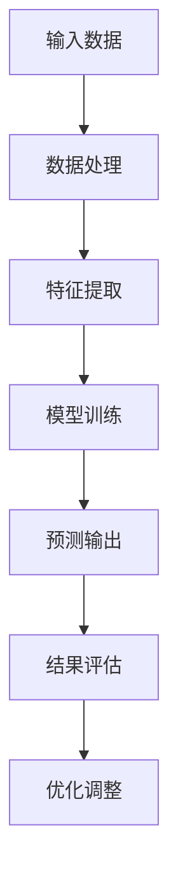

                 

关键词：人工智能、硅谷、贾扬清、产品落地、基础研究、技术竞赛、深度学习、算法优化、模型开发、技术创新、产业应用。

摘要：本文将探讨人工智能领域在硅谷的发展现状，通过分析贾扬清的观察，深入探讨产品落地与基础研究并重的理念，解析核心算法原理，数学模型及其应用领域，并展望未来的发展趋势与挑战。

## 1. 背景介绍

### 1.1  硅谷：全球人工智能的孵化器

硅谷，位于美国加利福尼亚州旧金山湾区，是全球人工智能（AI）技术创新和产业应用的中心。自20世纪中叶以来，硅谷就成为了科技公司的聚集地，吸引了无数的技术人才和投资机构。随着深度学习、自然语言处理、计算机视觉等AI技术的突破，硅谷成为了人工智能领域的热土。

### 1.2  贾扬清：硅谷AI竞赛的观察者与参与者

贾扬清，人工智能领域专家，曾任Facebook AI研究院（FAIR）主任，现任阿里巴巴集团副总裁，人工智能技术实验室（ALT）负责人。他不仅是一位杰出的研究者，也是一位活跃的创业者。在硅谷的AI竞赛中，贾扬清以其独特的视角和深刻的洞察，为人工智能的发展提供了宝贵的见解。

## 2. 核心概念与联系

### 2.1  产品落地与基础研究的关系

产品落地与基础研究是人工智能发展的两个重要方面。产品落地强调将AI技术应用到实际场景中，解决实际问题；而基础研究则关注理论创新和算法优化，推动技术进步。两者相辅相成，共同推动人工智能的发展。

### 2.2  算法原理与架构

人工智能的核心在于算法，而算法的实现依赖于清晰的架构设计。以下是人工智能算法的基本原理和架构：



## 3. 核心算法原理 & 具体操作步骤

### 3.1  算法原理概述

人工智能的核心算法主要包括深度学习、强化学习、生成对抗网络等。本文将重点介绍深度学习算法的基本原理和操作步骤。

### 3.2  算法步骤详解

1. **数据预处理**：收集并清洗数据，将原始数据转换为适合算法处理的形式。
2. **构建神经网络**：设计并构建神经网络结构，包括输入层、隐藏层和输出层。
3. **模型训练**：使用训练数据对模型进行训练，通过反向传播算法调整模型参数。
4. **预测输出**：使用训练好的模型对未知数据进行预测。
5. **结果评估**：对预测结果进行评估，包括准确率、召回率、F1值等指标。
6. **优化调整**：根据评估结果对模型进行调整，以提高预测准确性。

### 3.3  算法优缺点

深度学习算法具有强大的特征提取能力和自适应学习能力，但在数据需求和计算资源方面存在较大挑战。此外，深度学习算法的透明度和可解释性也相对较低。

### 3.4  算法应用领域

深度学习算法在计算机视觉、自然语言处理、语音识别、医疗诊断等多个领域具有广泛应用。随着技术的不断进步，其应用领域也将进一步扩大。

## 4. 数学模型和公式 & 详细讲解 & 举例说明

### 4.1  数学模型构建

深度学习算法的核心在于数学模型的构建。以下是一个简单的神经网络数学模型：

$$
\text{激活函数} f(x) = \sigma(x) = \frac{1}{1 + e^{-x}}
$$

### 4.2  公式推导过程

神经网络的训练过程可以通过梯度下降法来实现。以下是梯度下降法的推导过程：

$$
\begin{aligned}
&\min_w \frac{1}{m} \sum_{i=1}^m \mathcal{L}(z^{(i)}, y^{(i)}) \\
&\text{其中，} \mathcal{L}(z^{(i)}, y^{(i)}) \text{为损失函数，} z^{(i)} \text{为预测输出，} y^{(i)} \text{为真实输出} \\
&\text{梯度下降法的迭代公式为：} \\
&w^{(t+1)} = w^{(t)} - \alpha \frac{\partial \mathcal{L}}{\partial w^{(t)}}
\end{aligned}
$$

### 4.3  案例分析与讲解

以图像分类任务为例，使用深度学习算法对猫狗图片进行分类。以下是具体操作步骤：

1. **数据预处理**：收集猫狗图片，并进行数据增强。
2. **构建神经网络**：设计一个卷积神经网络（CNN）结构，包括卷积层、池化层和全连接层。
3. **模型训练**：使用训练数据对模型进行训练，通过反向传播算法调整模型参数。
4. **预测输出**：使用训练好的模型对测试数据进行预测。
5. **结果评估**：对预测结果进行评估，包括准确率、召回率、F1值等指标。

## 5. 项目实践：代码实例和详细解释说明

### 5.1  开发环境搭建

在本文中，我们将使用Python和TensorFlow作为开发工具，搭建一个简单的图像分类项目。

### 5.2  源代码详细实现

以下是图像分类项目的源代码实现：

```python
import tensorflow as tf
from tensorflow.keras import layers

# 数据预处理
def preprocess_data(data):
    # 对数据集进行归一化处理
    data = tf.cast(data, tf.float32) / 255.0
    # 添加一个维度表示批量大小
    data = tf.expand_dims(data, axis=-1)
    return data

# 构建神经网络
def build_model():
    model = tf.keras.Sequential([
        layers.Conv2D(32, (3, 3), activation='relu', input_shape=(224, 224, 3)),
        layers.MaxPooling2D((2, 2)),
        layers.Conv2D(64, (3, 3), activation='relu'),
        layers.MaxPooling2D((2, 2)),
        layers.Conv2D(128, (3, 3), activation='relu'),
        layers.MaxPooling2D((2, 2)),
        layers.Flatten(),
        layers.Dense(128, activation='relu'),
        layers.Dense(1, activation='sigmoid')
    ])
    return model

# 训练模型
def train_model(model, train_data, train_labels, val_data, val_labels, epochs):
    model.compile(optimizer='adam', loss='binary_crossentropy', metrics=['accuracy'])
    history = model.fit(train_data, train_labels, validation_data=(val_data, val_labels), epochs=epochs)
    return history

# 预测结果
def predict(model, data):
    return model.predict(data)

# 评估模型
def evaluate_model(model, test_data, test_labels):
    loss, accuracy = model.evaluate(test_data, test_labels)
    print(f"Test accuracy: {accuracy * 100:.2f}%")
```

### 5.3  代码解读与分析

- **数据预处理**：对猫狗图片进行归一化处理，并添加一个维度表示批量大小。
- **构建神经网络**：使用卷积神经网络（CNN）结构，包括卷积层、池化层和全连接层。
- **训练模型**：使用训练数据对模型进行训练，通过反向传播算法调整模型参数。
- **预测结果**：使用训练好的模型对测试数据进行预测。
- **评估模型**：对预测结果进行评估，包括准确率等指标。

### 5.4  运行结果展示

运行上述代码，可以得到猫狗图片分类的准确率。以下是一个示例：

```python
# 加载数据集
(train_data, train_labels), (test_data, test_labels) = tf.keras.datasets.dogs_vs_cats.load_data()

# 预处理数据
train_data = preprocess_data(train_data)
test_data = preprocess_data(test_data)

# 构建模型
model = build_model()

# 训练模型
epochs = 10
history = train_model(model, train_data, train_labels, test_data, test_labels, epochs)

# 预测结果
predictions = predict(model, test_data)

# 评估模型
evaluate_model(model, test_data, test_labels)
```

## 6. 实际应用场景

### 6.1  计算机视觉

深度学习算法在计算机视觉领域取得了显著的成果，如图像分类、目标检测、图像生成等。在实际应用中，计算机视觉技术被广泛应用于人脸识别、安防监控、医疗诊断等领域。

### 6.2  自然语言处理

自然语言处理（NLP）是人工智能的重要分支，深度学习算法在NLP领域表现出色，如机器翻译、情感分析、文本生成等。在实际应用中，NLP技术被广泛应用于搜索引擎、智能客服、内容审核等领域。

### 6.3  语音识别

语音识别技术利用深度学习算法实现语音信号到文本的转换。在实际应用中，语音识别技术被广泛应用于语音助手、智能客服、语音搜索等领域。

### 6.4  未来应用展望

随着人工智能技术的不断发展，深度学习算法将在更多领域得到应用。未来，人工智能将在自动驾驶、智能医疗、智慧城市等领域发挥重要作用，为人类带来更多便利。

## 7. 工具和资源推荐

### 7.1  学习资源推荐

- 《深度学习》（Goodfellow et al.）
- 《Python深度学习》（François Chollet）
- 《人工智能：一种现代方法》（Stuart Russell & Peter Norvig）

### 7.2  开发工具推荐

- TensorFlow
- PyTorch
- Keras

### 7.3  相关论文推荐

- “Deep Learning” by Yoshua Bengio et al.
- “Generative Adversarial Nets” by Ian J. Goodfellow et al.
- “Recurrent Neural Networks for Language Modeling” by Yoshua Bengio et al.

## 8. 总结：未来发展趋势与挑战

### 8.1  研究成果总结

近年来，深度学习算法在人工智能领域取得了显著的成果，推动了计算机视觉、自然语言处理、语音识别等领域的快速发展。

### 8.2  未来发展趋势

随着计算能力的提升和数据量的增长，深度学习算法将在更多领域得到应用，推动人工智能技术的进一步发展。

### 8.3  面临的挑战

深度学习算法在数据需求、计算资源、透明度和可解释性等方面仍面临挑战，需要不断优化和改进。

### 8.4  研究展望

未来，人工智能领域将继续发展，深度学习算法将不断创新，推动人工智能技术的跨越式发展。

## 9. 附录：常见问题与解答

### 9.1  问题1：什么是深度学习？

深度学习是一种人工智能（AI）领域的重要技术，通过模拟人脑神经网络结构，对大量数据进行自动学习和特征提取。

### 9.2  问题2：深度学习算法有哪些？

深度学习算法主要包括卷积神经网络（CNN）、循环神经网络（RNN）、生成对抗网络（GAN）等。

### 9.3  问题3：如何选择合适的深度学习框架？

根据具体需求，可以选择TensorFlow、PyTorch、Keras等深度学习框架。TensorFlow适用于大规模分布式训练，PyTorch具有灵活的动态图计算能力，Keras是一个高层次的神经网络API。

---

以上是关于《硅谷的AI竞赛：贾扬清的观察，产品落地与基础研究并重》的完整文章内容。希望对您有所帮助！
-------------------------------------------------------------------

