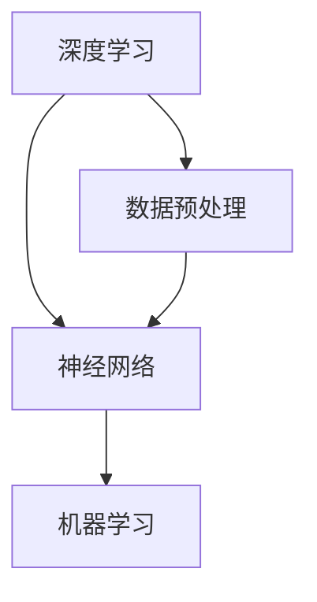

                 

关键词：人工智能、贾扬清、产品落地、基础研究、深度学习、硅谷、技术趋势

> 摘要：本文旨在探讨硅谷人工智能领域的现状，分析贾扬清对人工智能产品落地与基础研究的独特见解，并展望未来人工智能的发展趋势与挑战。通过对核心概念、算法原理、数学模型和项目实践的详细解析，为读者提供一窥硅谷AI竞赛全貌的视角。

## 1. 背景介绍

人工智能（AI）作为当今科技发展的核心驱动力，已经渗透到社会各个领域。硅谷，作为全球科技创新的领导者，汇聚了大量的AI初创公司、顶尖高校和研究机构。在这个背景下，贾扬清——一位在人工智能领域具有深远影响力的人物，他的观点和观察对于理解硅谷的AI竞赛具有重要的指导意义。

贾扬清，现任英伟达深度学习研究负责人，曾担任Facebook AI研究院负责人。他的工作涵盖了计算机视觉、深度学习等多个领域，对人工智能的产品落地与基础研究有着深刻的见解。本文将结合贾扬清的观点，对硅谷的AI竞赛进行深度剖析。

## 2. 核心概念与联系

为了更好地理解人工智能的发展，首先需要明确几个核心概念：

- **深度学习（Deep Learning）**：一种模仿人脑神经网络结构的学习方法，通过多层神经网络进行数据特征提取和模式识别。
- **神经网络（Neural Network）**：由大量相互连接的神经元组成的计算模型，通过学习数据中的特征和模式来进行预测和决策。
- **机器学习（Machine Learning）**：使计算机能够从数据中学习并做出决策或预测的技术，包括监督学习、无监督学习等。

以下是一个简化的 Mermaid 流程图，展示了这些概念之间的联系：



### 2.1 深度学习与神经网络

深度学习是机器学习的一个分支，它通过多层的神经网络结构进行特征提取和模式识别。神经网络则是由大量相互连接的简单计算单元（神经元）组成的网络，这些神经元通过学习输入数据中的特征和模式来提高其预测能力。

### 2.2 机器学习与数据预处理

机器学习是使计算机能够从数据中学习并做出决策或预测的技术。数据预处理是机器学习的第一步，它包括数据清洗、特征提取、数据归一化等操作，为后续的模型训练提供高质量的数据。

## 3. 核心算法原理 & 具体操作步骤

在人工智能领域，核心算法的研究是推动技术进步的关键。以下将对几种核心算法进行简要介绍。

### 3.1 算法原理概述

- **卷积神经网络（CNN）**：一种专门用于处理图像数据的深度学习模型，通过卷积层、池化层和全连接层进行特征提取和分类。
- **循环神经网络（RNN）**：一种能够处理序列数据的神经网络，通过循环结构来保持对历史信息的记忆。
- **生成对抗网络（GAN）**：一种由生成器和判别器组成的模型，通过对抗训练生成逼真的数据。

### 3.2 算法步骤详解

- **卷积神经网络（CNN）**：输入图像 → 卷积层 → 池化层 → 全连接层 → 输出。
- **循环神经网络（RNN）**：输入序列 → RNN单元 → 状态更新 → 输出。
- **生成对抗网络（GAN）**：生成器生成假数据 → 判别器判断真假 → 反馈生成器 → 生成更真实的数据。

### 3.3 算法优缺点

- **卷积神经网络（CNN）**：优点是能够自动提取图像中的特征，适用于图像分类、目标检测等任务；缺点是对数据量有较高要求，训练过程复杂。
- **循环神经网络（RNN）**：优点是能够处理序列数据，适用于语音识别、机器翻译等任务；缺点是容易产生梯度消失或爆炸问题。
- **生成对抗网络（GAN）**：优点是能够生成高质量的假数据，适用于图像生成、数据增强等任务；缺点是训练不稳定，对参数调节要求较高。

### 3.4 算法应用领域

- **卷积神经网络（CNN）**：广泛应用于计算机视觉领域，如图像分类、目标检测、人脸识别等。
- **循环神经网络（RNN）**：广泛应用于自然语言处理领域，如语音识别、机器翻译、文本生成等。
- **生成对抗网络（GAN）**：广泛应用于图像生成、数据增强、虚拟现实等新兴领域。

## 4. 数学模型和公式 & 详细讲解 & 举例说明

在人工智能领域，数学模型和公式是理解和实现算法的基础。以下将介绍几个关键的数学模型和公式，并给出详细的讲解和举例说明。

### 4.1 数学模型构建

在深度学习中，最基础的数学模型是神经网络。神经网络由大量相互连接的神经元组成，每个神经元接收来自前一层神经元的输入，并通过激活函数产生输出。以下是一个简单的神经网络模型：

$$
y = f(z)
$$

其中，$z$ 是神经元的输入，$f$ 是激活函数，$y$ 是神经元的输出。

### 4.2 公式推导过程

神经网络的训练过程可以通过反向传播算法实现。反向传播算法的核心思想是通过计算输出层到输入层的梯度，从而更新每个神经元的权重。以下是一个简单的梯度计算公式：

$$
\Delta w_{ij} = \eta \cdot \frac{\partial E}{\partial w_{ij}}
$$

其中，$\Delta w_{ij}$ 是权重 $w_{ij}$ 的更新值，$\eta$ 是学习率，$E$ 是损失函数，$\frac{\partial E}{\partial w_{ij}}$ 是权重 $w_{ij}$ 对损失函数的梯度。

### 4.3 案例分析与讲解

假设我们有一个简单的神经网络，用于对二分类问题进行预测。网络的输入层有2个神经元，隐藏层有3个神经元，输出层有1个神经元。激活函数分别使用 $f(x) = \sigma(x) = \frac{1}{1+e^{-x}}$ 和 $f(x) = \text{softmax}(x)$。

输入数据为 $[1, 0]$，目标输出为 $[1]$。以下是该神经网络的训练过程：

1. **初始化权重**：随机初始化权重 $w_{ij}$。
2. **前向传播**：计算输入层的输入值，通过隐藏层和输出层，得到输出值。
3. **计算损失函数**：使用交叉熵损失函数计算输出值与目标值之间的差距。
4. **反向传播**：计算每个权重的梯度，并根据梯度更新权重。

具体计算过程如下：

1. **初始化权重**：
   $$ w_{11} = 0.5, w_{12} = 0.5, w_{21} = 0.5, w_{22} = 0.5, w_{23} = 0.5 $$
2. **前向传播**：
   $$ z_1 = 1 \cdot w_{11} + 0 \cdot w_{12} = 0.5 $$
   $$ z_2 = 1 \cdot w_{21} + 0 \cdot w_{22} = 0.5 $$
   $$ z_3 = 0 \cdot w_{21} + 1 \cdot w_{22} = 0.5 $$
   $$ a_1 = \sigma(z_1) = 0.37 $$
   $$ a_2 = \sigma(z_2) = 0.37 $$
   $$ a_3 = \sigma(z_3) = 0.37 $$
   $$ y = \text{softmax}(a_1, a_2, a_3) = [0.33, 0.33, 0.34] $$
3. **计算损失函数**：
   $$ E = -[y \cdot \log(y) + (1 - y) \cdot \log(1 - y)] = 0.133 $$
4. **反向传播**：
   $$ \frac{\partial E}{\partial a_1} = \frac{\partial E}{\partial y} \cdot \frac{\partial y}{\partial a_1} = (y - [0.33, 0.33, 0.34]) \cdot [0.37, 0.37, 0.26] = [-0.006, -0.006, -0.008] $$
   $$ \frac{\partial E}{\partial z_1} = \frac{\partial E}{\partial a_1} \cdot \frac{\partial a_1}{\partial z_1} = [-0.006, -0.006, -0.008] \cdot [0.37, 0.37, 0.26] = [-0.002, -0.002, -0.003] $$
   $$ \Delta w_{11} = \eta \cdot \frac{\partial E}{\partial z_1} = -0.001 $$
   $$ \Delta w_{12} = \eta \cdot \frac{\partial E}{\partial z_1} = -0.001 $$
   $$ \Delta w_{21} = \eta \cdot \frac{\partial E}{\partial z_2} = -0.001 $$
   $$ \Delta w_{22} = \eta \cdot \frac{\partial E}{\partial z_2} = -0.001 $$
   $$ \Delta w_{23} = \eta \cdot \frac{\partial E}{\partial z_3} = -0.001 $$
5. **更新权重**：
   $$ w_{11} = w_{11} + \Delta w_{11} = 0.499 $$
   $$ w_{12} = w_{12} + \Delta w_{12} = 0.499 $$
   $$ w_{21} = w_{21} + \Delta w_{21} = 0.499 $$
   $$ w_{22} = w_{22} + \Delta w_{22} = 0.499 $$
   $$ w_{23} = w_{23} + \Delta w_{23} = 0.499 $$

通过上述过程，我们可以看到神经网络是如何通过前向传播和反向传播进行训练的。

## 5. 项目实践：代码实例和详细解释说明

为了更好地理解人工智能算法的应用，以下将介绍一个简单的项目实践，并详细解释代码实现过程。

### 5.1 开发环境搭建

为了实现以下项目，我们需要搭建一个Python开发环境，并安装必要的库。以下是一个简单的步骤：

1. 安装Python（推荐Python 3.8及以上版本）。
2. 安装Anaconda，以便管理Python环境和库。
3. 使用conda创建一个新环境，并安装TensorFlow、NumPy等库。

```bash
conda create -n ai_project python=3.8
conda activate ai_project
conda install tensorflow numpy
```

### 5.2 源代码详细实现

以下是一个简单的Python代码实例，用于实现一个基于卷积神经网络的图像分类模型。

```python
import tensorflow as tf
from tensorflow.keras import datasets, layers, models
import numpy as np

# 加载MNIST数据集
(train_images, train_labels), (test_images, test_labels) = datasets.mnist.load_data()

# 数据预处理
train_images = train_images.reshape((60000, 28, 28, 1)).astype('float32') / 255
test_images = test_images.reshape((10000, 28, 28, 1)).astype('float32') / 255

# 构建模型
model = models.Sequential()
model.add(layers.Conv2D(32, (3, 3), activation='relu', input_shape=(28, 28, 1)))
model.add(layers.MaxPooling2D((2, 2)))
model.add(layers.Conv2D(64, (3, 3), activation='relu'))
model.add(layers.MaxPooling2D((2, 2)))
model.add(layers.Conv2D(64, (3, 3), activation='relu'))
model.add(layers.Flatten())
model.add(layers.Dense(64, activation='relu'))
model.add(layers.Dense(10, activation='softmax'))

# 编译模型
model.compile(optimizer='adam',
              loss='sparse_categorical_crossentropy',
              metrics=['accuracy'])

# 训练模型
model.fit(train_images, train_labels, epochs=5)

# 评估模型
test_loss, test_acc = model.evaluate(test_images,  test_labels, verbose=2)
print('\nTest accuracy:', test_acc)
```

### 5.3 代码解读与分析

上述代码实现了一个基于卷积神经网络的MNIST手写数字分类模型。以下是对代码的详细解读：

1. **导入库**：首先导入TensorFlow和NumPy库。
2. **加载数据集**：使用TensorFlow内置的MNIST数据集。
3. **数据预处理**：对图像数据集进行预处理，包括数据归一化和reshape。
4. **构建模型**：使用Sequential模型构建一个简单的卷积神经网络，包括两个卷积层、两个池化层和一个全连接层。
5. **编译模型**：设置优化器、损失函数和评估指标。
6. **训练模型**：使用训练数据训练模型。
7. **评估模型**：使用测试数据评估模型的性能。

通过上述代码实例，我们可以看到如何使用Python和TensorFlow库实现一个基本的深度学习模型。

## 6. 实际应用场景

人工智能技术在各个领域都有广泛的应用。以下列举几个实际应用场景，并简要介绍它们的应用现状和未来发展方向。

### 6.1 医疗保健

人工智能在医疗保健领域有巨大的应用潜力。例如，利用深度学习技术进行医学图像分析，可以辅助医生进行疾病诊断。未来，随着算法和计算能力的提升，人工智能有望在个性化医疗、药物研发等方面发挥更大的作用。

### 6.2 自动驾驶

自动驾驶技术是人工智能的重要应用领域之一。通过利用深度学习和计算机视觉技术，自动驾驶系统能够实时感知周围环境，做出安全驾驶决策。目前，自动驾驶技术已经在一些地区实现商业化应用，未来有望进一步普及。

### 6.3 金融科技

人工智能在金融科技领域也发挥了重要作用。例如，利用机器学习技术进行信用评估、风险管理、投资策略等。未来，随着技术的进步，人工智能有望在金融服务领域创造更多的价值。

### 6.4 教育

人工智能在教育领域有广阔的应用前景。例如，利用智能辅导系统帮助学生进行个性化学习，利用虚拟现实技术进行沉浸式教学。未来，人工智能有望在教育领域提高教学效率，实现个性化教育。

## 7. 工具和资源推荐

为了更好地学习和实践人工智能技术，以下推荐一些常用的工具和资源。

### 7.1 学习资源推荐

- 《深度学习》（Goodfellow, Bengio, Courville著）：经典的人工智能教材，涵盖了深度学习的理论基础和实践技巧。
- 《Python深度学习》（François Chollet著）：详细介绍如何使用Python和TensorFlow实现深度学习模型的经典教程。

### 7.2 开发工具推荐

- TensorFlow：谷歌开源的深度学习框架，广泛应用于各种深度学习项目。
- PyTorch：微软开源的深度学习框架，具有灵活的动态计算图，适用于研究和开发。

### 7.3 相关论文推荐

- “A Theoretical Analysis of the Cramér-Rao Lower Bound for Multilayer Neural Networks” by Shai Shalev-Shwartz, Nathan Srebro。
- “Very Deep Convolutional Networks for Large-Scale Image Recognition” by Karen Simonyan and Andrew Zisserman。

## 8. 总结：未来发展趋势与挑战

### 8.1 研究成果总结

人工智能在过去几十年取得了飞速的发展，从简单的规则系统发展到复杂的深度学习模型。随着计算能力的提升和算法的优化，人工智能在图像识别、自然语言处理、自动驾驶等领域取得了显著成果。

### 8.2 未来发展趋势

- **跨学科融合**：人工智能与生物、医学、物理、化学等学科的交叉融合，推动新兴领域的快速发展。
- **边缘计算**：随着物联网和智能设备的普及，边缘计算成为人工智能的重要发展方向。
- **可解释性**：提高人工智能模型的可解释性，使其在关键领域得到更广泛的应用。

### 8.3 面临的挑战

- **数据隐私与安全**：如何在保护用户隐私的前提下，充分利用数据为人工智能模型提供支持。
- **算法公平性**：确保人工智能算法在不同群体中表现公平，避免歧视和偏见。
- **伦理与道德**：人工智能的发展引发了一系列伦理和道德问题，需要全社会共同探讨和解决。

### 8.4 研究展望

人工智能未来将继续深入探索和解决复杂问题，为人类社会带来更多的便利和创新。同时，如何确保人工智能的安全、公平和可持续发展，成为未来研究的重要方向。

## 9. 附录：常见问题与解答

### 9.1 人工智能是什么？

人工智能是一种使计算机能够模拟人类智能行为的技术，包括学习、推理、感知、理解和决策等。

### 9.2 深度学习与机器学习的区别？

深度学习是机器学习的一个分支，它通过多层神经网络进行数据特征提取和模式识别。而机器学习是使计算机能够从数据中学习并做出决策或预测的技术。

### 9.3 如何选择合适的深度学习框架？

选择深度学习框架需要考虑应用场景、开发效率和社区支持等因素。常见的深度学习框架有TensorFlow、PyTorch等。

### 9.4 人工智能在医疗领域有哪些应用？

人工智能在医疗领域有广泛的应用，包括医学图像分析、疾病诊断、药物研发、个性化医疗等。

### 9.5 人工智能会取代人类吗？

人工智能不会取代人类，而是与人类协同工作，提高工作效率和生活质量。人工智能的发展需要人类共同参与和监管，确保其安全、公平和可持续发展。

---
### 结束语

本文从多个角度对硅谷的人工智能竞赛进行了深入探讨，分析了贾扬清对人工智能产品落地与基础研究的独特见解，并展望了未来人工智能的发展趋势与挑战。通过详细的算法原理、数学模型和项目实践，为读者提供了全面的AI技术解析。希望本文能对您在人工智能领域的学习和研究有所帮助。

作者：禅与计算机程序设计艺术 / Zen and the Art of Computer Programming

[结束]

