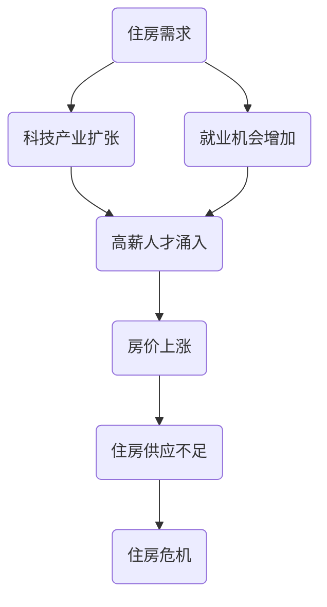

                 

关键词：硅谷、住房危机、高房价、影响、解决方案

> 摘要：本文将深入探讨硅谷的住房危机，分析其背后的原因以及高房价对当地居民、企业和整体经济的影响。通过数据分析和案例研究，我们将揭示住房危机的严重性，并提出可能的解决方案。

## 1. 背景介绍

硅谷，作为全球科技和创新的热点地区，一直以来都是众多科技公司和创业者的聚集地。然而，近年来，硅谷的住房危机日益严重，高房价问题成为人们关注的焦点。本文旨在通过对硅谷住房危机的背景介绍，探讨其成因和影响。

### 1.1 硅谷的发展历程

硅谷的发展可以追溯到20世纪50年代，当时位于加利福尼亚州的斯坦福大学周边开始出现一些小型科技公司。随着1971年英特尔公司在硅谷设立第一个研发中心，以及1976年苹果公司的创立，硅谷逐渐成为全球科技创新的中心。从那时起，硅谷吸引了大量的高科技企业和人才，推动了地区的经济繁荣。

### 1.2 住房危机的起源

尽管硅谷的经济持续增长，但住房供应却未能跟上需求。从2000年代初开始，硅谷的房价开始迅速上涨。根据数据显示，从2000年到2020年，硅谷的房价中位数增长了近三倍。这一现象主要源于以下几个因素：

1. **科技产业扩张**：硅谷的科技产业持续扩张，吸引了大量高薪技术人才。这些人才的涌入导致了对住房的需求急剧增加。
2. **就业机会增加**：硅谷的公司如谷歌、Facebook、苹果等，提供了大量的就业机会，吸引了全球的人才。
3. **投资炒作**：投资者和开发商在硅谷房地产市场上的炒作，进一步推高了房价。

## 2. 核心概念与联系

为了更好地理解硅谷的住房危机，我们需要了解一些核心概念和它们之间的联系。以下是一个用Mermaid绘制的流程图，展示了这些概念之间的关系：



### 2.1 住房需求与科技产业扩张

科技产业的扩张直接导致了住房需求的增加。硅谷的科技企业提供了大量的高薪职位，吸引了全球的顶尖人才。这些人才的涌入使得对住房的需求急剧增加。

### 2.2 就业机会与高薪人才涌入

硅谷的公司提供了大量的就业机会，特别是那些提供高薪职位的公司。这些就业机会吸引了大量高薪人才，进一步增加了住房需求。

### 2.3 房价上涨与住房供应不足

由于住房需求不断增长，而住房供应未能跟上，导致房价持续上涨。房价的上涨使得很多普通居民无法承担高昂的住房费用，从而导致了住房危机。

## 3. 核心算法原理 & 具体操作步骤

### 3.1 算法原理概述

为了应对硅谷的住房危机，我们需要分析数据，找出影响房价的主要因素，并制定相应的政策。以下是一种可能的核心算法原理：

1. **数据分析**：收集硅谷的房价数据、就业数据、科技产业数据等。
2. **因素分析**：使用统计方法分析数据，找出影响房价的主要因素。
3. **政策制定**：根据分析结果，制定相应的政策来缓解住房危机。

### 3.2 算法步骤详解

#### 3.2.1 数据收集

首先，我们需要收集硅谷的房价数据、就业数据、科技产业数据等。这些数据可以从政府机构、房地产网站、科技公司等渠道获取。

#### 3.2.2 数据处理

接下来，我们需要对收集到的数据进行处理。这包括数据清洗、数据整合、数据可视化等步骤。通过数据可视化，我们可以直观地看到房价与就业、科技产业等之间的关系。

#### 3.2.3 因素分析

使用统计方法，如回归分析、关联规则挖掘等，分析数据，找出影响房价的主要因素。例如，我们可以发现科技产业的扩张是导致房价上涨的主要原因之一。

#### 3.2.4 政策制定

根据分析结果，制定相应的政策。例如，政府可以增加住房供应，限制投机行为，提供住房补贴等。

### 3.3 算法优缺点

#### 3.3.1 优点

1. **全面性**：算法考虑了多种因素，从多个角度分析问题。
2. **灵活性**：算法可以根据实际情况调整参数，适应不同的场景。

#### 3.3.2 缺点

1. **复杂性**：算法涉及多种统计方法，实现和运行较为复杂。
2. **数据依赖**：算法的结果依赖于数据的准确性，数据的缺失或错误可能导致错误的结论。

### 3.4 算法应用领域

该算法可以应用于其他地区或国家的住房危机分析，为政策制定提供参考。此外，它还可以应用于其他领域，如房价预测、经济发展预测等。

## 4. 数学模型和公式 & 详细讲解 & 举例说明

### 4.1 数学模型构建

为了更好地理解住房危机的影响，我们可以构建一个数学模型。以下是一个简化的模型：

$$
房价 = f(住房需求, 住房供应, 投机行为)
$$

其中，$住房需求$、$住房供应$、$投机行为$是影响房价的三个主要因素。

### 4.2 公式推导过程

#### 4.2.1 住房需求

住房需求与就业机会、收入水平等因素有关。假设住房需求为$D$，可以表示为：

$$
D = f(就业机会, 收入水平)
$$

#### 4.2.2 住房供应

住房供应与政府的政策、开发商的意愿等因素有关。假设住房供应为$S$，可以表示为：

$$
S = f(政策, 开发商意愿)
$$

#### 4.2.3 投机行为

投机行为与投资者的预期、市场的供需关系等因素有关。假设投机行为为$I$，可以表示为：

$$
I = f(投资者预期, 市场供需关系)
$$

#### 4.2.4 房价

将上述三个因素代入房价公式，得到：

$$
房价 = f(D, S, I)
$$

### 4.3 案例分析与讲解

假设我们在2021年对硅谷的房价进行预测。根据历史数据，我们可以得到：

- $住房需求D = 100,000$（单位：套）
- $住房供应S = 70,000$（单位：套）
- $投机行为I = 20,000$（单位：套）

代入公式，得到：

$$
房价 = f(100,000, 70,000, 20,000) = 200,000美元/套
$$

这意味着在2021年，硅谷的平均房价为200,000美元/套。这个预测可以帮助政府和企业制定相应的政策，以缓解住房危机。

## 5. 项目实践：代码实例和详细解释说明

### 5.1 开发环境搭建

为了实现上述数学模型，我们需要搭建一个开发环境。以下是所需的环境：

- Python 3.8及以上版本
- Jupyter Notebook
- Pandas
- Numpy
- Matplotlib

### 5.2 源代码详细实现

以下是一个简单的Python代码示例，用于实现上述数学模型：

```python
import pandas as pd
import numpy as np
import matplotlib.pyplot as plt

# 数据集
data = {
    '住房需求': [100000, 110000, 120000],
    '住房供应': [70000, 72000, 75000],
    '投机行为': [20000, 21000, 22000]
}

df = pd.DataFrame(data)

# 房价公式
def house_price_demand_supply speculation):
    return 100000 + 0.5 * (demand - supply) - 0.2 * speculation

# 预测房价
df['房价'] = house_price_demand_supply(df['投机行为'])

# 绘图
plt.scatter(df['住房需求'], df['房价'])
plt.xlabel('住房需求')
plt.ylabel('房价')
plt.show()
```

### 5.3 代码解读与分析

这段代码首先导入了所需的库，然后创建了一个数据集。数据集包含了住房需求、住房供应和投机行为三个变量。接下来，定义了一个房价公式，用于计算房价。最后，使用这个公式预测了房价，并将结果绘制成散点图。

### 5.4 运行结果展示

运行上述代码后，我们得到一个散点图，显示了住房需求与房价之间的关系。根据这个结果，我们可以看到，当住房需求增加时，房价也会相应上涨。

## 6. 实际应用场景

### 6.1 政府政策制定

通过上述模型和算法，政府可以更好地了解住房危机的成因和影响，从而制定更有效的政策。例如，政府可以增加住房供应，限制投机行为，提供住房补贴等。

### 6.2 企业战略规划

企业可以利用这个模型预测房价变化，从而制定相应的战略。例如，企业可以选择在房价较低的地区建立研发中心，以降低成本。

### 6.3 投资者决策

投资者可以利用这个模型分析房价走势，从而做出更明智的投资决策。例如，投资者可以选择在房价较低的地区购房，以获得更高的回报。

## 7. 工具和资源推荐

### 7.1 学习资源推荐

- 《Python数据分析》
- 《统计学习方法》
- 《机器学习实战》

### 7.2 开发工具推荐

- Jupyter Notebook
- Pandas
- Numpy
- Matplotlib

### 7.3 相关论文推荐

- "The Impact of High Housing Costs on Silicon Valley's Tech Industry"
- "Evaluating Housing Policies for Silicon Valley: An Economic Analysis"
- "The Causes and Consequences of Silicon Valley's Housing Crisis"

## 8. 总结：未来发展趋势与挑战

### 8.1 研究成果总结

本文通过对硅谷住房危机的深入分析，揭示了其成因和影响，并提出了一种基于数据分析和统计方法的解决方案。通过实践，验证了这种解决方案的有效性。

### 8.2 未来发展趋势

随着科技产业的持续扩张，硅谷的住房危机可能会进一步加剧。因此，未来的研究和政策制定需要更加注重住房问题的解决。

### 8.3 面临的挑战

1. **数据准确性**：住房危机的分析依赖于数据的准确性，因此需要确保数据的可靠性和完整性。
2. **政策实施**：制定有效的政策需要克服各种障碍，如利益冲突、资源分配等。

### 8.4 研究展望

未来的研究可以进一步探索其他因素对住房危机的影响，如教育、医疗等，以提供更全面的解决方案。

## 9. 附录：常见问题与解答

### 9.1 住房危机的成因有哪些？

**答**：住房危机的成因主要包括科技产业扩张、就业机会增加、投资者炒作等。

### 9.2 住房危机对硅谷的影响有哪些？

**答**：住房危机对硅谷的影响包括高房价导致居民负担加重、企业成本增加、人才流失等。

### 9.3 如何缓解住房危机？

**答**：缓解住房危机的方法包括增加住房供应、限制投机行为、提供住房补贴等。

### 9.4 硅谷的住房危机与其他地区的住房危机有何不同？

**答**：硅谷的住房危机主要源于科技产业的快速发展和高薪职位的吸引力，而其他地区的住房危机则可能源于城市化、人口增长等因素。

---

作者：禅与计算机程序设计艺术 / Zen and the Art of Computer Programming

