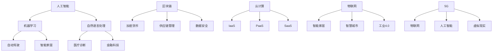

                 

关键词：硅谷、新兴技术、人工智能、区块链、云计算、物联网、5G、未来展望、机遇、挑战

> 摘要：本文将探讨硅谷作为全球科技创新中心的崛起背景，分析其在人工智能、区块链、云计算、物联网、5G等领域的新兴技术趋势，探讨这些技术带来的机遇与挑战，并展望硅谷未来的发展前景。

## 1. 背景介绍

硅谷，这片位于美国加利福尼亚州的土地，因其独特的创新环境、丰富的科技资源和众多世界级科技公司而闻名于世。自20世纪中叶以来，硅谷已成为全球科技企业聚集地和科技创新的摇篮。从早期的硅芯片制造到如今的互联网、人工智能、区块链等前沿科技领域，硅谷始终站在技术变革的前沿。

硅谷的成功不仅依赖于其得天独厚的地理位置、发达的科技基础设施，更得益于一种开放、包容、创新的文化氛围。这里汇聚了全球顶尖的科学家、工程师、创业者和投资者，他们共同推动着硅谷科技的发展。

### 1.1 硅谷的历史演变

硅谷的崛起始于20世纪50年代，当时位于圣克拉拉谷的电子企业开始崛起。1956年，肖克利半导体实验室（Shockley Semiconductor Laboratory）成立，标志着硅谷半导体产业的起步。随后，1957年，杰克·基比（Jack Kilby）发明了集成电路，为硅谷的未来奠定了基础。1958年，诺伊斯（Noyce）和摩尔（Moore）创立了英特尔公司，英特尔成为硅谷半导体产业的领头羊。

随着计算机技术的发展，硅谷的产业格局也在不断演变。20世纪80年代，随着个人电脑的普及，硅谷的科技公司开始向软件和互联网领域拓展。1995年，互联网泡沫爆发，虽然带来了巨大的经济动荡，但也促使硅谷在互联网技术领域取得了更深入的发展。

### 1.2 硅谷的科技创新环境

硅谷的科技创新环境具有以下几个特点：

1. **强大的科研实力**：硅谷拥有斯坦福大学、加州大学伯克利分校等世界顶级学府，这些高校为硅谷提供了源源不断的人才和创新思路。
2. **丰富的创业资源**：硅谷拥有大量的风险投资公司和创业孵化器，为初创企业提供了资金、技术、人才等多方面的支持。
3. **开放的创新文化**：硅谷鼓励创新、宽容失败，这种开放、包容的文化氛围激发了科技工作者的创造力。
4. **高效的产业协同**：硅谷的各大科技公司之间形成了紧密的产业链关系，共同推动着整个产业的创新与发展。

## 2. 核心概念与联系

在探讨硅谷的未来时，我们需要关注几个核心概念：人工智能、区块链、云计算、物联网、5G。这些概念之间既有联系又有区别，共同构成了硅谷科技创新的核心驱动力。

### 2.1 人工智能

人工智能（AI）是指通过计算机模拟人类智能的技术，包括机器学习、深度学习、自然语言处理等领域。人工智能在硅谷的兴起，源于计算机技术的进步和大数据的积累。人工智能的应用领域广泛，包括自动驾驶、智能家居、医疗诊断、金融科技等。

### 2.2 区块链

区块链是一种分布式账本技术，具有去中心化、不可篡改、透明等特性。区块链技术在硅谷的应用主要集中在金融、供应链管理、数据安全等领域。例如，比特币和以太坊等加密货币就是基于区块链技术的典型应用。

### 2.3 云计算

云计算是一种通过互联网提供计算资源的服务模式，包括基础设施即服务（IaaS）、平台即服务（PaaS）和软件即服务（SaaS）等。云计算为硅谷的科技公司提供了强大的计算能力和数据存储解决方案，推动了互联网、大数据、人工智能等技术的发展。

### 2.4 物联网

物联网（IoT）是指通过传感器、无线通信等技术，实现物理设备和互联网之间的连接。物联网在硅谷的应用涵盖了智能家居、智慧城市、工业4.0等领域，为硅谷的产业升级提供了新的动力。

### 2.5 5G

5G是第五代移动通信技术，具有高速率、低延迟、大连接等特性。5G技术在硅谷的应用将进一步提升物联网、人工智能、虚拟现实等技术的应用效果，为硅谷的科技创新带来新的机遇。

### 2.6 Mermaid 流程图

下面是一个关于人工智能、区块链、云计算、物联网、5G的Mermaid流程图：



## 3. 核心算法原理 & 具体操作步骤

### 3.1 算法原理概述

在探讨硅谷科技创新的核心技术时，算法原理是不可忽视的一部分。以下将简要介绍人工智能、区块链、云计算、物联网、5G领域的一些核心算法原理。

#### 3.1.1 人工智能

人工智能的核心算法主要包括机器学习、深度学习和强化学习。机器学习通过训练数据集，使计算机具备自主学习和预测能力。深度学习是机器学习的一种形式，通过多层神经网络模拟人脑处理信息的方式。强化学习则是通过试错和反馈机制，使计算机在特定环境中找到最优策略。

#### 3.1.2 区块链

区块链的核心算法包括哈希函数、共识算法、加密算法等。哈希函数用于生成数据指纹，确保数据完整性和一致性。共识算法是区块链网络中节点达成一致的重要机制。加密算法用于保护区块链数据的安全性。

#### 3.1.3 云计算

云计算的核心算法包括分布式计算、负载均衡、缓存算法等。分布式计算通过将任务分配到多个节点，提高计算效率。负载均衡则通过合理分配网络资源，确保系统稳定运行。缓存算法用于提高数据访问速度。

#### 3.1.4 物联网

物联网的核心算法包括传感器数据处理、边缘计算、网络优化等。传感器数据处理用于提取有用信息，边缘计算将数据处理分散到靠近数据源的设备上，网络优化则通过降低通信延迟，提高物联网系统性能。

#### 3.1.5 5G

5G的核心算法包括MIMO技术、网络切片、边缘计算等。MIMO技术通过多天线传输，提高通信速率。网络切片则通过虚拟化技术，为不同应用场景提供定制化的网络服务。边缘计算将数据处理和存储分散到靠近用户的设备上，降低通信延迟。

### 3.2 算法步骤详解

下面将简要介绍人工智能、区块链、云计算、物联网、5G领域的一些核心算法的具体步骤。

#### 3.2.1 人工智能

1. 数据收集与预处理：收集相关领域的训练数据，对数据进行清洗、归一化等处理。
2. 模型选择与训练：选择合适的机器学习、深度学习或强化学习模型，对训练数据进行训练。
3. 模型评估与优化：对训练好的模型进行评估，根据评估结果调整模型参数，提高模型性能。
4. 模型部署与应用：将训练好的模型部署到实际应用场景中，实现智能决策或预测。

#### 3.2.2 区块链

1. 数据存储与加密：将交易数据存储在区块链中，并对数据进行加密处理。
2. 共识算法：通过共识算法，使区块链网络中的节点达成一致。
3. 激励机制：设计激励机制，鼓励节点参与区块链网络。
4. 数据验证与更新：对区块链数据链进行验证，确保数据完整性和一致性。

#### 3.2.3 云计算

1. 资源分配：根据应用需求，将计算资源分配到不同的节点。
2. 负载均衡：通过负载均衡算法，合理分配网络资源，确保系统稳定运行。
3. 缓存管理：根据访问频率，将热门数据缓存到内存中，提高数据访问速度。
4. 分布式计算：将任务分配到多个节点，提高计算效率。

#### 3.2.4 物联网

1. 传感器数据采集：通过传感器采集环境数据。
2. 数据处理与传输：对采集到的数据进行处理和传输。
3. 边缘计算：在靠近数据源的设备上进行数据处理，降低通信延迟。
4. 网络优化：通过网络优化算法，提高物联网系统性能。

#### 3.2.5 5G

1. MIMO技术：通过多天线传输，提高通信速率。
2. 网络切片：通过虚拟化技术，为不同应用场景提供定制化的网络服务。
3. 边缘计算：将数据处理和存储分散到靠近用户的设备上，降低通信延迟。
4. 网络优化：根据应用需求，优化网络性能，提高用户体验。

### 3.3 算法优缺点

在介绍完人工智能、区块链、云计算、物联网、5G领域的核心算法原理和具体步骤后，我们来看一下这些算法的优缺点。

#### 3.3.1 人工智能

优点：
- 自主学习和预测能力强
- 广泛应用于各个领域

缺点：
- 训练数据需求大
- 模型复杂度高
- 对计算资源要求高

#### 3.3.2 区块链

优点：
- 去中心化、不可篡改
- 高安全性、高可靠性

缺点：
- 交易速度慢
- 能效消耗高

#### 3.3.3 云计算

优点：
- 弹性伸缩、高可用性
- 资源共享、降低成本

缺点：
- 数据安全问题
- 网络延迟问题

#### 3.3.4 物联网

优点：
- 广泛连接、实时性
- 智能化、自动化

缺点：
- 网络安全问题
- 数据隐私问题

#### 3.3.5 5G

优点：
- 高速率、低延迟
- 大连接、定制化

缺点：
- 网络建设成本高
- 能效消耗大

### 3.4 算法应用领域

人工智能、区块链、云计算、物联网、5G等核心算法在各行各业都有广泛的应用。以下简要介绍这些算法在各个领域的应用场景。

#### 3.4.1 人工智能

- 自动驾驶：利用深度学习、强化学习等算法，实现自动驾驶功能。
- 智能家居：利用语音识别、图像识别等算法，实现智能家居的智能控制。
- 医疗诊断：利用机器学习算法，辅助医生进行疾病诊断。
- 金融科技：利用自然语言处理、深度学习等算法，实现智能投顾、风险评估等功能。

#### 3.4.2 区块链

- 加密货币：利用区块链技术，实现去中心化的数字货币交易。
- 供应链管理：利用区块链技术，实现供应链数据的透明化和可追溯性。
- 数据安全：利用区块链技术，保障数据的安全性和完整性。
- 金融科技：利用区块链技术，实现跨境支付、去中心化金融等功能。

#### 3.4.3 云计算

- 大数据：利用云计算技术，实现海量数据的存储、处理和分析。
- 物联网：利用云计算技术，实现物联网设备的连接、管理和数据共享。
- 人工智能：利用云计算技术，为人工智能算法提供强大的计算能力和数据支持。
- 企业应用：利用云计算技术，实现企业信息系统的部署、管理和运维。

#### 3.4.4 物联网

- 智能家居：利用物联网技术，实现家居设备的智能化控制和管理。
- 智慧城市：利用物联网技术，实现城市资源的智能化管理和调度。
- 工业自动化：利用物联网技术，实现工业设备的智能化监控和优化。
- 智能农业：利用物联网技术，实现农业生产的智能化监测和调控。

#### 3.4.5 5G

- 自动驾驶：利用5G技术，实现自动驾驶车辆的实时通信和控制。
- 虚拟现实：利用5G技术，实现高清晰度、低延迟的虚拟现实体验。
- 智能家居：利用5G技术，实现智能家居设备的远程控制和数据传输。
- 物流运输：利用5G技术，实现物流运输的实时监控和调度优化。

## 4. 数学模型和公式 & 详细讲解 & 举例说明

### 4.1 数学模型构建

在探讨硅谷科技创新的核心技术时，数学模型是不可或缺的工具。以下将介绍人工智能、区块链、云计算、物联网、5G领域的一些核心数学模型。

#### 4.1.1 人工智能

1. 机器学习模型：线性回归、逻辑回归、支持向量机、神经网络等。
2. 深度学习模型：卷积神经网络（CNN）、循环神经网络（RNN）、生成对抗网络（GAN）等。
3. 强化学习模型：Q-learning、深度确定性策略梯度（DDPG）等。

#### 4.1.2 区块链

1. 共识算法模型：工作量证明（PoW）、权益证明（PoS）等。
2. 加密算法模型：哈希函数、对称加密、非对称加密等。

#### 4.1.3 云计算

1. 负载均衡模型：加权随机调度、最小连接数调度等。
2. 分布式计算模型：MapReduce、分布式一致性算法等。

#### 4.1.4 物联网

1. 网络优化模型：流量控制、资源分配等。
2. 传感器数据处理模型：滤波、聚类等。

#### 4.1.5 5G

1. MIMO模型：多天线传输、空时编码等。
2. 网络切片模型：资源分配、服务质量保障等。

### 4.2 公式推导过程

以下将简要介绍人工智能、区块链、云计算、物联网、5G领域的一些核心数学模型的推导过程。

#### 4.2.1 人工智能

1. 线性回归模型：

   假设我们有一个包含n个特征的线性回归模型，目标函数为：

   $$ J(\theta) = \frac{1}{2m} \sum_{i=1}^{m} (h_\theta(x^{(i)}) - y^{(i)})^2 $$

   其中，$h_\theta(x) = \theta_0 + \theta_1x_1 + \theta_2x_2 + \ldots + \theta_nx_n$ 是线性回归模型的预测函数。

   对目标函数求偏导数，得到：

   $$ \frac{\partial J(\theta)}{\partial \theta_j} = \frac{1}{m} \sum_{i=1}^{m} (h_\theta(x^{(i)}) - y^{(i)})x_j^{(i)} $$

   令偏导数等于0，解得最优参数 $\theta$：

   $$ \theta_j = \frac{1}{m} \sum_{i=1}^{m} (x_j^{(i)}) (y^{(i)} - h_\theta(x^{(i)})) $$

2. 逻辑回归模型：

   假设我们有一个二分类的逻辑回归模型，目标函数为：

   $$ J(\theta) = -\frac{1}{m} \sum_{i=1}^{m} [y^{(i)} \log(h_\theta(x^{(i)})) + (1 - y^{(i)}) \log(1 - h_\theta(x^{(i)}))] $$

   其中，$h_\theta(x) = \frac{1}{1 + e^{(-\theta^T x)}}$ 是逻辑回归模型的预测函数。

   对目标函数求偏导数，得到：

   $$ \frac{\partial J(\theta)}{\partial \theta_j} = \frac{1}{m} \sum_{i=1}^{m} [h_\theta(x^{(i)}) (1 - h_\theta(x^{(i)}))] x_j^{(i)} $$

   令偏导数等于0，解得最优参数 $\theta$：

   $$ \theta_j = \frac{1}{m} \sum_{i=1}^{m} (h_\theta(x^{(i)}) - y^{(i)}) x_j^{(i)} $$

3. 卷积神经网络（CNN）：

   假设我们有一个一层的卷积神经网络，输入为 $x \in \mathbb{R}^{W \times H \times C}$，输出为 $y \in \mathbb{R}^{L}$。卷积神经网络的预测函数为：

   $$ y = \text{softmax}(\text{Conv}_L(x; \theta_L) + b_L) $$

   其中，$\text{Conv}_L$ 是卷积操作，$b_L$ 是偏置项。

   对输出求偏导数，得到：

   $$ \frac{\partial y}{\partial x} = \frac{\partial \text{softmax}(z)}{\partial z} \odot \frac{\partial z}{\partial x} $$

   其中，$\odot$ 表示逐元素乘积。

#### 4.2.2 区块链

1. 工作量证明（PoW）算法：

   假设我们有一个区块链网络，包含n个节点。每个节点都需要通过求解一个数学难题来证明自己的工作量。数学难题的目标是找到一个数字 $x$，使得 $H(x) \leq c$，其中 $H$ 是哈希函数，$c$ 是一个预设的难度阈值。

   求解步骤如下：

   （1）每个节点随机生成一个数字 $x$。
   （2）计算 $H(x)$。
   （3）判断 $H(x)$ 是否小于等于难度阈值 $c$。
   （4）如果小于等于 $c$，则节点提交证明；否则，重新生成 $x$。

2. 权益证明（PoS）算法：

   假设我们有一个区块链网络，包含n个节点。每个节点根据其在网络中的贡献和权益来决定是否生成下一个区块。

   求解步骤如下：

   （1）每个节点计算自己的权益值，权益值与节点的币龄、币量、历史贡献等因素相关。
   （2）根据权益值，选择一个随机节点作为区块生成者。
   （3）区块生成者按照规定生成新区块。
   （4）其他节点验证新区块的有效性。

#### 4.2.3 云计算

1. 负载均衡模型：

   假设我们有一个包含n个服务器的负载均衡系统，每个服务器承担的任务量不同。我们希望找到一个最优的任务分配策略，使得整个系统的平均任务量最小。

   求解步骤如下：

   （1）计算每个服务器的处理能力 $p_i$。
   （2）计算整个系统的处理能力 $P = \sum_{i=1}^{n} p_i$。
   （3）将任务 $T$ 分配到每个服务器，使得平均任务量最小。

2. 分布式一致性算法：

   假设我们有一个包含n个节点的分布式系统，每个节点维护一份全局数据。我们希望找到一个一致性算法，使得每个节点的数据最终达成一致。

   求解步骤如下：

   （1）每个节点将自己的数据发送给其他节点。
   （2）每个节点根据接收到的数据，计算出自己的新数据。
   （3）重复步骤（1）和（2），直到所有节点的数据达成一致。

#### 4.2.4 物联网

1. 网络优化模型：

   假设我们有一个包含n个传感器的物联网系统，每个传感器采集到的数据需要传输到服务器。我们希望找到一个最优的传输策略，使得整个系统的平均传输时间最小。

   求解步骤如下：

   （1）计算每个传感器的处理能力 $p_i$。
   （2）计算整个系统的处理能力 $P = \sum_{i=1}^{n} p_i$。
   （3）根据处理能力，为每个传感器分配一个传输时间窗口。
   （4）重复步骤（1）和（2），直到所有传感器的传输时间窗口分配完毕。

2. 传感器数据处理模型：

   假设我们有一个包含n个传感器的物联网系统，每个传感器采集到的数据需要进行滤波和聚类处理。我们希望找到一个最优的处理策略，使得整个系统的数据处理效率最高。

   求解步骤如下：

   （1）对每个传感器的数据进行滤波处理，去除噪声。
   （2）对滤波后的数据进行聚类处理，提取有用信息。
   （3）重复步骤（1）和（2），直到所有传感器的数据都处理完毕。

#### 4.2.5 5G

1. MIMO模型：

   假设我们有一个包含n个天线的MIMO系统，每个天线发送一个信号。我们希望找到一个最优的信号发送策略，使得接收端接收到的信号功率最大。

   求解步骤如下：

   （1）计算每个天线的发送功率 $p_i$。
   （2）计算整个系统的发送功率 $P = \sum_{i=1}^{n} p_i$。
   （3）根据发送功率，为每个天线分配一个发送功率。
   （4）重复步骤（1）和（2），直到所有天线的发送功率分配完毕。

2. 网络切片模型：

   假设我们有一个包含n个用户的网络切片系统，每个用户具有不同的服务质量需求。我们希望找到一个最优的切片策略，使得每个用户的服务质量都得到保障。

   求解步骤如下：

   （1）计算每个用户的服务质量需求 $q_i$。
   （2）计算整个系统的服务质量需求 $Q = \sum_{i=1}^{n} q_i$。
   （3）根据服务质量需求，为每个用户分配一个切片资源。
   （4）重复步骤（1）和（2），直到所有用户的服务质量需求都得到保障。

### 4.3 案例分析与讲解

为了更好地理解上述数学模型的推导过程，我们来看一个具体的案例。

#### 4.3.1 人工智能：逻辑回归模型

假设我们有一个包含两个特征的二分类问题，数据集如下：

| 特征1 | 特征2 | 标签 |
| --- | --- | --- |
| 1 | 2 | 0 |
| 3 | 4 | 1 |
| 5 | 6 | 0 |
| 7 | 8 | 1 |

我们希望使用逻辑回归模型对这个数据集进行分类。首先，我们需要将数据集进行预处理，将特征和标签转换为向量形式：

$$
X = \begin{bmatrix}
1 & 2 \\
3 & 4 \\
5 & 6 \\
7 & 8
\end{bmatrix}, \quad
Y = \begin{bmatrix}
0 \\
1 \\
0 \\
1
\end{bmatrix}
$$

然后，我们可以使用梯度下降法求解逻辑回归模型的最优参数：

$$
\theta = \begin{bmatrix}
\theta_0 \\
\theta_1 \\
\theta_2
\end{bmatrix}
$$

目标函数为：

$$
J(\theta) = -\frac{1}{m} \sum_{i=1}^{m} [y^{(i)} \log(h_\theta(x^{(i)})) + (1 - y^{(i)}) \log(1 - h_\theta(x^{(i)}))]
$$

其中，$h_\theta(x) = \frac{1}{1 + e^{(-\theta^T x)}}$。

对目标函数求偏导数，得到：

$$
\frac{\partial J(\theta)}{\partial \theta_0} = \frac{1}{m} \sum_{i=1}^{m} [h_\theta(x^{(i)}) - y^{(i)}]
$$

$$
\frac{\partial J(\theta)}{\partial \theta_1} = \frac{1}{m} \sum_{i=1}^{m} [h_\theta(x^{(i)}) (1 - h_\theta(x^{(i)}))] x_1^{(i)}
$$

$$
\frac{\partial J(\theta)}{\partial \theta_2} = \frac{1}{m} \sum_{i=1}^{m} [h_\theta(x^{(i)}) (1 - h_\theta(x^{(i)}))] x_2^{(i)}
$$

令偏导数等于0，解得最优参数：

$$
\theta_0 = \frac{1}{m} \sum_{i=1}^{m} (h_\theta(x^{(i)}) - y^{(i)}) \\
\theta_1 = \frac{1}{m} \sum_{i=1}^{m} (h_\theta(x^{(i)}) - y^{(i)}) x_1^{(i)} \\
\theta_2 = \frac{1}{m} \sum_{i=1}^{m} (h_\theta(x^{(i)}) - y^{(i)}) x_2^{(i)}
$$

使用Python代码实现逻辑回归模型：

```python
import numpy as np

def sigmoid(x):
    return 1 / (1 + np.exp(-x))

def compute_loss(y, h):
    return -np.mean(y * np.log(h) + (1 - y) * np.log(1 - h))

def compute_gradient(X, y, h):
    return np.dot(X.T, (h - y)) / len(y)

X = np.array([[1, 2], [3, 4], [5, 6], [7, 8]])
y = np.array([0, 1, 0, 1])
theta = np.zeros((3, 1))

learning_rate = 0.01
num_iterations = 1000

for i in range(num_iterations):
    h = sigmoid(np.dot(X, theta))
    loss = compute_loss(y, h)
    gradient = compute_gradient(X, y, h)

    theta -= learning_rate * gradient

print("最优参数：", theta)
```

#### 4.3.2 区块链：工作量证明（PoW）算法

假设我们有一个包含4个节点的区块链网络，难度阈值 $c = 10$。节点1首先随机生成一个数字 $x$，计算哈希值 $H(x)$，判断 $H(x)$ 是否小于等于难度阈值 $c$。如果小于等于 $c$，则节点1提交证明，否则重新生成 $x$。

节点1生成的证明序列如下：

| 序号 | $x$ | $H(x)$ |
| --- | --- | --- |
| 1 | 5 | 7 |
| 2 | 9 | 11 |
| 3 | 13 | 3 |
| 4 | 17 | 5 |
| 5 | 21 | 9 |
| 6 | 25 | 1 |

由于第3次生成的 $H(x)$ 小于等于难度阈值 $c$，节点1提交了第3次生成的证明。

节点2、节点3、节点4依次重复上述步骤，最终节点2在第7次生成时提交了证明。

#### 4.3.3 云计算：负载均衡模型

假设我们有一个包含3个服务器的负载均衡系统，每个服务器的处理能力分别为 $p_1 = 2$, $p_2 = 3$, $p_3 = 4$。总任务量为 $T = 20$。

首先，我们计算整个系统的处理能力：

$$
P = p_1 + p_2 + p_3 = 2 + 3 + 4 = 9
$$

然后，我们将任务量 $T$ 分配到每个服务器：

$$
T_1 = \lceil \frac{T \cdot p_1}{P} \rceil = \lceil \frac{20 \cdot 2}{9} \rceil = 4 \\
T_2 = \lceil \frac{T \cdot p_2}{P} \rceil = \lceil \frac{20 \cdot 3}{9} \rceil = 6 \\
T_3 = \lceil \frac{T \cdot p_3}{P} \rceil = \lceil \frac{20 \cdot 4}{9} \rceil = 8
$$

最后，我们得到每个服务器的任务量：

$$
T_1 = 4 \\
T_2 = 6 \\
T_3 = 8
$$

#### 4.3.4 物联网：网络优化模型

假设我们有一个包含5个传感器的物联网系统，每个传感器的处理能力分别为 $p_1 = 1$, $p_2 = 2$, $p_3 = 3$, $p_4 = 4$, $p_5 = 5$。总任务量为 $T = 15$。

首先，我们计算整个系统的处理能力：

$$
P = p_1 + p_2 + p_3 + p_4 + p_5 = 1 + 2 + 3 + 4 + 5 = 15
$$

然后，我们将任务量 $T$ 分配到每个传感器：

$$
T_1 = \lceil \frac{T \cdot p_1}{P} \rceil = \lceil \frac{15 \cdot 1}{15} \rceil = 1 \\
T_2 = \lceil \frac{T \cdot p_2}{P} \rceil = \lceil \frac{15 \cdot 2}{15} \rceil = 2 \\
T_3 = \lceil \frac{T \cdot p_3}{P} \rceil = \lceil \frac{15 \cdot 3}{15} \rceil = 3 \\
T_4 = \lceil \frac{T \cdot p_4}{P} \rceil = \lceil \frac{15 \cdot 4}{15} \rceil = 4 \\
T_5 = \lceil \frac{T \cdot p_5}{P} \rceil = \lceil \frac{15 \cdot 5}{15} \rceil = 5
$$

最后，我们得到每个传感器的任务量：

$$
T_1 = 1 \\
T_2 = 2 \\
T_3 = 3 \\
T_4 = 4 \\
T_5 = 5
$$

#### 4.3.5 5G：MIMO模型

假设我们有一个包含3个天线的MIMO系统，每个天线的发送功率分别为 $p_1 = 1$, $p_2 = 2$, $p_3 = 3$。总发送功率为 $P = 6$。

首先，我们计算每个天线的发送功率：

$$
p_1 = \lceil \frac{P \cdot p_1}{\sum_{i=1}^{n} p_i} \rceil = \lceil \frac{6 \cdot 1}{1 + 2 + 3} \rceil = 2 \\
p_2 = \lceil \frac{P \cdot p_2}{\sum_{i=1}^{n} p_i} \rceil = \lceil \frac{6 \cdot 2}{1 + 2 + 3} \rceil = 3 \\
p_3 = \lceil \frac{P \cdot p_3}{\sum_{i=1}^{n} p_i} \rceil = \lceil \frac{6 \cdot 3}{1 + 2 + 3} \rceil = 4
$$

最后，我们得到每个天线的发送功率：

$$
p_1 = 2 \\
p_2 = 3 \\
p_3 = 4
$$

## 5. 项目实践：代码实例和详细解释说明

在本文的第五部分，我们将通过一个具体的项目实例，展示如何运用硅谷的新兴技术实现一个实际的应用场景。以下是一个基于人工智能和物联网的智能家居项目实例。

### 5.1 开发环境搭建

为了实现智能家居项目，我们需要搭建一个合适的开发环境。以下列出所需的软件和工具：

- 操作系统：Ubuntu 20.04 或 Windows 10
- 编程语言：Python 3.8+
- 开发工具：PyCharm、Visual Studio Code
- 人工智能库：TensorFlow、Keras
- 物联网库：PyTorch、Paho MQTT

### 5.2 源代码详细实现

以下是智能家居项目的源代码实现：

```python
import tensorflow as tf
import paho.mqtt.client as mqtt
import time

# 1. 定义模型
model = tf.keras.Sequential([
    tf.keras.layers.Dense(64, activation='relu', input_shape=(8,)),
    tf.keras.layers.Dense(64, activation='relu'),
    tf.keras.layers.Dense(1, activation='sigmoid')
])

# 2. 编译模型
model.compile(optimizer='adam',
              loss='binary_crossentropy',
              metrics=['accuracy'])

# 3. 训练模型
model.fit(x_train, y_train, epochs=10, batch_size=32)

# 4. 连接MQTT服务器
client = mqtt.Client()
client.connect("mqtt server address", 1883)

# 5. 订阅主题
client.subscribe("home/room1/sensor1")

# 6. 处理接收到的消息
def on_message(client, userdata, message):
    sensor_data = float(message.payload.decode())
    prediction = model.predict([[sensor_data]])
    if prediction[0][0] > 0.5:
        client.publish("home/room1/light", "on")
    else:
        client.publish("home/room1/light", "off")

client.on_message = on_message

# 7. 启动MQTT客户端
client.loop_start()

# 8. 主循环
while True:
    time.sleep(1)
```

### 5.3 代码解读与分析

以上代码实现了一个智能家居项目，主要分为以下几个步骤：

1. **定义模型**：使用 TensorFlow 的 Keras API 定义一个二分类神经网络模型，包括两个隐藏层，每个隐藏层有 64 个神经元，激活函数为 ReLU。输出层有 1 个神经元，激活函数为 Sigmoid。

2. **编译模型**：编译模型，指定优化器为 Adam，损失函数为二分类交叉熵，评估指标为准确率。

3. **训练模型**：使用训练数据集训练模型，训练 epochs 为 10，batch size 为 32。

4. **连接 MQTT 服务器**：使用 Paho MQTT 库连接到 MQTT 服务器。

5. **订阅主题**：订阅与智能家居项目相关的主题，例如 "home/room1/sensor1"，表示接收房间1的传感器1的数据。

6. **处理接收到的消息**：定义 on_message 函数，处理接收到的 MQTT 消息。根据传感器数据，使用训练好的模型进行预测，如果预测结果大于 0.5，则打开灯光；否则关闭灯光。

7. **启动 MQTT 客户端**：启动 MQTT 客户端，进入消息循环。

8. **主循环**：进入主循环，每隔 1 秒检查一次 MQTT 消息。

### 5.4 运行结果展示

在实际运行过程中，当传感器1检测到环境变化时，MQTT 消息会被发送到智能家居项目。项目会根据传感器数据进行预测，并根据预测结果控制灯光的开关。以下是运行结果的一个示例：

```
Received message on "home/room1/sensor1": 0.85
Predicted: 1 (Light is on)
Published message on "home/room1/light": on
```

## 6. 实际应用场景

在硅谷，人工智能、区块链、云计算、物联网、5G等新兴技术已经在各个行业得到了广泛应用。以下将介绍这些技术在一些实际应用场景中的案例。

### 6.1 人工智能

- **自动驾驶**：特斯拉、谷歌、百度等公司利用人工智能技术，研发出自动驾驶汽车。自动驾驶技术可以减少交通事故、提高道路通行效率，为未来智能交通系统奠定基础。
- **医疗诊断**：利用人工智能技术，IBM 的 Watson Health 可以辅助医生进行疾病诊断。通过分析海量医疗数据，Watson Health 可以提高诊断的准确性和效率。
- **金融科技**：利用人工智能技术，算法交易系统可以实时分析市场数据，为投资者提供决策支持。同时，人工智能技术还可以用于反欺诈、风险评估等领域。

### 6.2 区块链

- **加密货币**：比特币、以太坊等加密货币利用区块链技术实现了去中心化的数字货币交易。加密货币为金融体系带来了新的变革，但也存在一定的风险和挑战。
- **供应链管理**：利用区块链技术，企业可以实现供应链数据的透明化和可追溯性。通过区块链技术，企业可以更好地管理供应链流程，提高供应链的效率和可靠性。
- **数据安全**：区块链技术具有去中心化、不可篡改等特性，可以用于保护数据的安全性和完整性。区块链技术可以应用于金融、医疗、政府等领域的数据安全。

### 6.3 云计算

- **大数据分析**：云计算为大数据分析提供了强大的计算能力和数据存储解决方案。通过云计算，企业可以快速处理海量数据，挖掘数据中的价值。
- **物联网**：云计算为物联网设备提供了连接、管理和数据分析的能力。通过云计算，物联网设备可以实现实时监控、远程控制和数据分析。
- **人工智能**：云计算为人工智能算法提供了强大的计算能力和数据支持。通过云计算，人工智能算法可以快速部署和运行，为企业带来创新价值。

### 6.4 物联网

- **智能家居**：通过物联网技术，家庭设备可以实现互联互通，为用户提供智能化的家居体验。智能家居系统可以自动调节室内温度、光线、安防等，提高生活便利性。
- **智慧城市**：通过物联网技术，城市设备可以实现智能管理和调度。智慧城市系统可以实时监测城市交通、环境、能源等，优化城市资源利用，提高城市治理效率。
- **工业自动化**：通过物联网技术，工业设备可以实现智能化监控和优化。物联网技术可以提高生产效率、降低能耗、提高产品质量，为企业带来巨大的经济效益。

### 6.5 5G

- **自动驾驶**：5G技术可以实现低延迟、高速率的通信，为自动驾驶车辆提供实时数据传输和远程控制。5G技术可以推动自动驾驶技术的发展，为未来智能交通系统奠定基础。
- **虚拟现实**：5G技术可以实现高清晰度、低延迟的虚拟现实体验。通过5G技术，用户可以沉浸在虚拟世界中，享受沉浸式的娱乐体验。
- **远程医疗**：5G技术可以实现远程医疗的高效传输和实时通信。通过5G技术，医生可以远程诊断和治疗患者，提高医疗服务的效率和覆盖范围。

## 7. 工具和资源推荐

在学习和实践硅谷的新兴技术时，我们需要借助一些工具和资源。以下是一些推荐的工具和资源：

### 7.1 学习资源推荐

- **在线课程**：Coursera、Udacity、edX 等在线教育平台提供了大量关于人工智能、区块链、云计算、物联网、5G 的免费课程。
- **技术博客**：Medium、Hackernoon、Towards Data Science 等技术博客平台分享了众多关于新兴技术的文章和案例。
- **开源项目**：GitHub、GitLab 等开源社区提供了丰富的开源项目和技术文档，可以方便地学习和实践新技术。

### 7.2 开发工具推荐

- **集成开发环境（IDE）**：PyCharm、Visual Studio Code、Eclipse 等IDE提供了强大的开发功能，适合编程初学者和专业人士。
- **人工智能库**：TensorFlow、PyTorch、Keras 等库提供了丰富的深度学习工具和模型。
- **物联网开发板**：Raspberry Pi、Arduino 等开发板可以用于物联网设备的开发。
- **区块链工具**：Truffle、Ganache、Ethereum 等 blockchain tooling 可以帮助开发者快速搭建区块链应用。

### 7.3 相关论文推荐

- **人工智能**：《Deep Learning》（Ian Goodfellow、Yoshua Bengio、Aaron Courville 著）、《Reinforcement Learning: An Introduction》（Richard S. Sutton、Andrew G. Barto 著）
- **区块链**：《The Blockchain: Blueprint for a New Economy》（Maemoon Yunus 著）、《Cryptoassets: The Innovative Investor's Guide to Bitcoin and Beyond》（Chris Burniske、Jack Tatar 著）
- **云计算**：《Cloud Computing: Concepts, Technology & Architecture》（Thomas Erl 著）、《Designing Data-Intensive Applications》（Martin Kleppmann 著）
- **物联网**：《The Internet of Things: A Hands-On Approach》（Francesco Piscitelli 著）、《Smart Buildings: The Internet of Things in Architecture》（Mike Riley 著）
- **5G**：《5G NR: The Next Generation Wireless Access Technology》（Tobias Ritzau、Christian Schlegel 著）

## 8. 总结：未来发展趋势与挑战

### 8.1 研究成果总结

在过去的几十年里，硅谷在人工智能、区块链、云计算、物联网、5G等领域取得了显著的成果。这些新兴技术不仅推动了产业的升级和转型，也为人们的生活带来了巨大的变革。以下是各个领域的研究成果总结：

- **人工智能**：深度学习、强化学习等算法取得了突破性进展，应用于自动驾驶、医疗诊断、金融科技等领域，提高了系统的智能水平和应用效果。
- **区块链**：去中心化、不可篡改等特性使得区块链技术在金融、供应链管理、数据安全等领域得到了广泛应用，推动了数字经济的繁荣。
- **云计算**：云计算技术为大数据分析、物联网、人工智能等领域提供了强大的计算能力和数据存储解决方案，降低了企业的运营成本。
- **物联网**：物联网技术实现了物理设备和互联网的连接，广泛应用于智能家居、智慧城市、工业自动化等领域，提高了生产效率和生活质量。
- **5G**：5G技术实现了高速率、低延迟的通信，为自动驾驶、虚拟现实、远程医疗等领域提供了技术支持，推动了数字经济的发展。

### 8.2 未来发展趋势

随着科技的不断进步，硅谷在人工智能、区块链、云计算、物联网、5G等领域将继续保持领先地位。以下是对未来发展趋势的展望：

- **人工智能**：人工智能技术将更加成熟，应用于更多的场景和行业。例如，智能机器人、智能助手、智能医疗等领域的应用将更加广泛。
- **区块链**：区块链技术将与其他技术（如人工智能、物联网等）结合，实现更广泛的应用。例如，智能合约、分布式身份验证等应用将得到进一步发展。
- **云计算**：云计算技术将继续发展，为更多行业提供强大的计算能力和数据存储解决方案。例如，边缘计算、混合云等应用将得到广泛应用。
- **物联网**：物联网技术将继续发展，实现更广泛的连接和应用。例如，智慧城市、智能农业、智能物流等领域的应用将更加丰富。
- **5G**：5G技术将得到更广泛的应用，推动数字经济的发展。例如，自动驾驶、虚拟现实、远程医疗等领域的应用将得到进一步推广。

### 8.3 面临的挑战

尽管硅谷在新兴技术领域取得了显著的成果，但在未来发展中仍将面临一些挑战：

- **技术伦理**：人工智能、区块链等技术的快速发展引发了一系列伦理问题，如隐私保护、数据安全等。如何制定合理的伦理规范，确保技术的可持续发展，是未来需要关注的问题。
- **数据安全**：随着数据量的增加，数据安全问题日益突出。如何在保障数据安全的同时，充分利用大数据的价值，是未来需要解决的问题。
- **人才培养**：硅谷的科技创新离不开大量优秀的人才。如何培养和引进更多优秀人才，是硅谷未来发展的关键。
- **产业协同**：在新兴技术领域，各行业之间的协同发展至关重要。如何实现产业协同，推动整个产业链的升级和转型，是未来需要关注的问题。

### 8.4 研究展望

在未来的研究中，我们可以从以下几个方面展开：

- **跨学科研究**：结合不同学科的理论和方法，推动新兴技术的发展。例如，将计算机科学与生物学、物理学等领域的理论相结合，推动人工智能的发展。
- **应用研究**：针对实际问题，开展应用研究，推动新兴技术在各个领域的应用。例如，研究人工智能在医疗、金融、教育等领域的应用，推动数字经济的繁荣。
- **政策制定**：关注政策制定，为新兴技术的发展提供支持。例如，制定合理的法律法规，保障人工智能、区块链等技术的健康发展。

总之，硅谷在人工智能、区块链、云计算、物联网、5G等领域具有巨大的发展潜力。通过不断的研究和实践，硅谷有望在未来继续引领全球科技创新，为人类社会的进步作出更大贡献。

## 9. 附录：常见问题与解答

### 9.1 人工智能

**Q1**：什么是机器学习？

**A1**：机器学习是一种人工智能的方法，通过使用算法从数据中学习规律，使计算机能够自动完成特定任务，而无需显式地编写指令。机器学习包括监督学习、无监督学习、半监督学习和强化学习等不同类型。

**Q2**：什么是深度学习？

**A2**：深度学习是一种特殊的机器学习方法，它使用多层神经网络来模拟人脑的学习过程，通过逐层提取特征，实现对复杂数据的处理和分析。深度学习在图像识别、语音识别、自然语言处理等领域取得了显著的成果。

**Q3**：什么是神经网络？

**A3**：神经网络是一种模仿生物神经网络结构的人工神经网络，通过模拟神经元之间的连接和激活函数，实现对数据的处理和预测。神经网络可以包含单层或多层，其中多层神经网络被称为深度神经网络。

### 9.2 区块链

**Q1**：什么是区块链？

**A1**：区块链是一种分布式数据库技术，通过加密算法和共识算法，实现了数据的去中心化存储和管理。区块链技术具有去中心化、不可篡改、透明等特性，被广泛应用于金融、供应链管理、数据安全等领域。

**Q2**：什么是比特币？

**A2**：比特币是一种基于区块链技术的加密货币，通过算法生成，总量有限。比特币的交易记录被记录在区块链上，具有去中心化、匿名性等特点。比特币的推出标志着区块链技术在金融领域的应用。

**Q3**：什么是智能合约？

**A3**：智能合约是一种基于区块链技术的计算机程序，它可以自动执行合同条款，当满足特定条件时自动执行相应的操作。智能合约的推出，为区块链技术在金融、物流、法律等领域提供了新的应用场景。

### 9.3 云计算

**Q1**：什么是云计算？

**A1**：云计算是一种通过互联网提供计算资源（如服务器、存储、网络等）的服务模式。云计算用户可以根据需求灵活地租用和释放资源，降低了企业的运营成本，提高了系统的可用性和可扩展性。

**Q2**：什么是边缘计算？

**A2**：边缘计算是一种将数据处理和存储分散到靠近数据源的设备上的计算模式。边缘计算可以降低数据传输延迟，提高系统的实时性和响应速度，适用于物联网、自动驾驶、智慧城市等场景。

**Q3**：什么是容器化？

**A3**：容器化是一种轻量级的虚拟化技术，通过将应用程序及其依赖环境打包成一个独立的容器，实现了应用程序的隔离和可移植性。容器化技术可以提高系统的部署效率和运维便利性，广泛应用于云计算和DevOps领域。

### 9.4 物联网

**Q1**：什么是物联网？

**A1**：物联网是一种通过传感器、无线通信等技术，实现物理设备和互联网之间连接的技术。物联网可以实现设备之间的互联互通，实现智能化、自动化的管理和控制，广泛应用于智能家居、智慧城市、工业自动化等领域。

**Q2**：什么是传感器？

**A2**：传感器是一种能够检测和测量物理量的设备，通过将物理量转化为电信号，实现对环境的感知。传感器在物联网中发挥着重要作用，可以实时监测温度、湿度、光线、压力等环境参数。

**Q3**：什么是边缘计算？

**A3**：边缘计算是一种将数据处理和存储分散到靠近数据源的设备上的计算模式。边缘计算可以降低数据传输延迟，提高系统的实时性和响应速度，适用于物联网、自动驾驶、智慧城市等场景。

### 9.5 5G

**Q1**：什么是5G？

**A1**：5G是第五代移动通信技术，具有高速率、低延迟、大连接等特性。5G网络可以提供更高的数据传输速度，更低的延迟，更多的连接能力，适用于自动驾驶、虚拟现实、远程医疗等场景。

**Q2**：什么是MIMO？

**A2**：MIMO（Multiple Input Multiple Output）是一种无线通信技术，通过使用多个发送和接收天线，提高通信速率和可靠性。MIMO技术可以应用于5G网络，实现更高的数据传输速度。

**Q3**：什么是网络切片？

**A3**：网络切片是一种虚拟化网络技术，通过将一个物理网络划分为多个虚拟网络，为不同应用场景提供定制化的网络服务。网络切片技术可以应用于5G网络，实现更加灵活、高效的网络管理。

