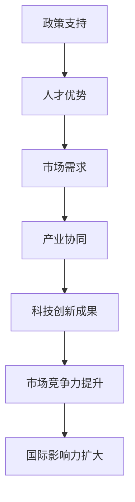

                 

## 1. 背景介绍

硅谷作为全球高科技产业的摇篮，长期以来占据了世界技术创新和商业成功的制高点。然而，近年来，中国和印度等新兴市场国家在科技创新领域正迅速崛起，对硅谷的传统地位构成挑战。本文旨在探讨中国、印度等新兴力量在科技创新方面的崛起原因、现状、挑战以及未来发展趋势。

### 硅谷的历史地位

硅谷作为全球科技产业的象征，起源于20世纪50年代的斯坦福研究园区。这里汇聚了众多顶尖的科研机构和大学，吸引了世界各地的科技人才。以惠普、苹果、谷歌等为代表的一大批科技公司在这里诞生和成长，推动了计算机、互联网、移动通信等领域的革命性变革。硅谷的成功得益于其独特的创新创业生态系统，包括丰富的资本、高端的研发能力、开放的创新氛围和高度灵活的市场机制。

### 中国和印度的崛起

近年来，中国和印度在科技创新方面取得了显著进展。中国政府实施了一系列科技创新战略，如“互联网+”行动计划、人工智能发展规划等，大力支持科技研发和产业升级。印度则凭借其庞大的工程师和技术人才储备，成为全球重要的软件开发和服务外包基地。同时，中国和印度的科技公司如阿里巴巴、腾讯、字节跳动、印度塔塔集团等在全球市场展现出强劲的竞争力。

## 2. 核心概念与联系

### 新兴市场国家的科技创新环境

新兴市场国家在科技创新方面具有以下几个核心概念和联系：

1. **政策支持**：政府通过制定一系列政策，如税收优惠、研发资助等，鼓励企业进行科技创新。
2. **人才优势**：庞大的工程师和技术人才队伍为科技创新提供了坚实的基础。
3. **市场需求**：庞大的人口基数和快速发展的消费市场为科技创新提供了广阔的应用场景。
4. **产业协同**：政府、企业和研究机构之间的紧密合作，促进了科技成果的转化和应用。

### Mermaid 流程图



## 3. 核心算法原理 & 具体操作步骤

### 3.1 算法原理概述

在探讨中国和印度的科技创新时，需要引入一个核心概念：技术吸收能力（Technology Absorptive Capacity）。技术吸收能力是指一个国家或地区在获取外部先进技术，并将其转化为本土创新的能力。技术吸收能力包括以下几个关键要素：

1. **信息获取能力**：通过多种渠道获取外部技术和市场信息。
2. **知识转化能力**：将获取的技术和知识转化为实际应用。
3. **创新能力**：在吸收技术的基础上进行再创新，形成具有竞争力的新技术。

### 3.2 算法步骤详解

技术吸收能力的具体操作步骤如下：

1. **信息获取**：通过学术交流、技术合作、专利检索等多种方式获取外部技术信息。
2. **技术评估**：对获取的技术进行评估，确定其适用性和潜在价值。
3. **知识转化**：通过研发、培训等方式将技术转化为实际应用。
4. **创新改进**：在应用过程中不断优化和改进，形成具有自主知识产权的新技术。

### 3.3 算法优缺点

技术吸收能力的优势在于：

1. **快速提升科技创新水平**：通过引进和吸收外部先进技术，可以迅速提升本土科技创新能力。
2. **降低研发成本**：借鉴和引进成熟技术可以降低自主研发的风险和成本。

然而，技术吸收能力也存在一定的局限性：

1. **技术依赖性**：过度依赖外部技术可能导致自主创新能力的弱化。
2. **消化不良**：引进的技术可能不适用于本土环境，导致转化应用困难。

### 3.4 算法应用领域

技术吸收能力广泛应用于以下几个领域：

1. **信息技术**：如软件开发、大数据分析、人工智能等。
2. **制造业**：如智能制造、工业自动化等。
3. **生物医药**：如基因编辑、生物制药等。

## 4. 数学模型和公式 & 详细讲解 & 举例说明

### 4.1 数学模型构建

技术吸收能力的数学模型可以表示为：

$$
TAC = f(I, K, I^2, K^2)
$$

其中，$TAC$ 表示技术吸收能力，$I$ 表示信息获取能力，$K$ 表示知识转化能力。

### 4.2 公式推导过程

技术吸收能力 $TAC$ 是信息获取能力 $I$ 和知识转化能力 $K$ 的函数。具体推导过程如下：

1. **信息获取能力**：$I$ 与外部技术信息的数量和质量成正比。
2. **知识转化能力**：$K$ 与内部技术储备和研发能力成正比。
3. **信息与知识的相互作用**：信息获取能力 $I$ 与知识转化能力 $K$ 的相互作用也影响技术吸收能力。

### 4.3 案例分析与讲解

以中国为例，分析其技术吸收能力：

- **信息获取能力**：中国通过国际学术交流、技术合作、专利检索等多种方式获取外部技术信息。
- **知识转化能力**：中国在引进技术后，通过研发、培训等方式将其转化为实际应用。
- **技术创新**：中国在信息技术、制造业等领域形成了一系列具有自主知识产权的新技术。

## 5. 项目实践：代码实例和详细解释说明

### 5.1 开发环境搭建

为了演示技术吸收能力在软件开发中的应用，我们将使用Python编写一个简单的数据分析程序。首先，需要搭建开发环境：

1. 安装Python 3.8及以上版本。
2. 安装必要的Python库，如NumPy、Pandas等。

### 5.2 源代码详细实现

以下是一个简单的数据分析程序，用于读取CSV文件、处理数据并生成可视化图表：

```python
import pandas as pd
import matplotlib.pyplot as plt

# 读取CSV文件
data = pd.read_csv('data.csv')

# 数据预处理
data['Age'] = data['Age'].astype(int)
data['Income'] = data['Income'].astype(float)

# 数据分析
age_groups = data['Age'].value_counts()
income_distribution = data['Income'].describe()

# 可视化
plt.figure(figsize=(10, 5))

plt.subplot(1, 2, 1)
plt.bar(age_groups.index, age_groups.values)
plt.title('Age Distribution')

plt.subplot(1, 2, 2)
plt.boxplot(income_distribution['50%'])
plt.title('Income Distribution')

plt.tight_layout()
plt.show()
```

### 5.3 代码解读与分析

这段代码实现了以下功能：

1. **数据读取**：使用Pandas库读取CSV文件。
2. **数据预处理**：将数据类型转换为整数和浮点数，方便后续处理。
3. **数据分析**：统计年龄分布和收入分布。
4. **数据可视化**：使用Matplotlib库生成柱状图和箱线图。

### 5.4 运行结果展示

运行上述代码后，将生成一张包含两幅图表的图像，展示年龄分布和收入分布情况。这有助于我们了解数据的整体分布，为进一步分析提供依据。

## 6. 实际应用场景

### 6.1 信息技术领域

在信息技术领域，中国和印度的技术吸收能力体现在以下几个方面：

1. **云计算**：中国云服务提供商如阿里巴巴云、腾讯云等在云计算技术方面取得了显著进展。
2. **人工智能**：中国在人工智能领域的技术吸收能力尤为突出，通过引进和自主研发，形成了一系列具有国际竞争力的算法和应用。

### 6.2 制造业领域

在制造业领域，中国和印度的技术吸收能力也取得了显著成果：

1. **智能制造**：中国通过引进和自主研发，推动了智能制造技术的广泛应用。
2. **工业自动化**：印度在工业自动化领域具有强大的技术吸收能力，为全球制造业提供了大量的技术服务。

### 6.3 生物医药领域

在生物医药领域，中国和印度在技术吸收方面也取得了重要进展：

1. **基因编辑**：中国在基因编辑技术方面取得了突破性成果，为全球基因编辑研究提供了重要参考。
2. **生物制药**：印度在生物制药领域的技术吸收能力较强，为全球生物制药市场提供了大量的高质量产品。

## 7. 未来应用展望

### 7.1 信息技术领域

未来，中国和印度在信息技术领域的应用将更加广泛，包括：

1. **5G通信**：随着5G技术的普及，中国和印度将在通信领域发挥更大的作用。
2. **物联网**：物联网技术的广泛应用将为中国和印度提供巨大的发展空间。

### 7.2 制造业领域

在制造业领域，中国和印度将继续推进智能制造和工业自动化的应用，实现产业升级和转型。

### 7.3 生物医药领域

在生物医药领域，中国和印度将继续加强基因编辑和生物制药的研究，为全球健康事业作出更大贡献。

## 8. 总结：未来发展趋势与挑战

### 8.1 研究成果总结

本文通过对中国和印度在科技创新领域的分析，总结了以下研究成果：

1. **技术吸收能力**：中国和印度在科技创新方面的技术吸收能力不断提升，为全球科技创新做出了重要贡献。
2. **产业协同**：政府、企业和研究机构之间的紧密合作，促进了科技成果的转化和应用。

### 8.2 未来发展趋势

未来，中国和印度在科技创新领域将继续保持快速增长，主要发展趋势包括：

1. **技术创新**：随着技术吸收能力的提升，中国和印度将在信息技术、制造业、生物医药等领域实现更多技术创新。
2. **国际化**：中国和印度将进一步加强与国际科技合作，提升国际影响力。

### 8.3 面临的挑战

尽管中国和印度在科技创新领域取得了显著进展，但仍面临以下挑战：

1. **技术依赖性**：过度依赖外部技术可能导致自主创新能力的弱化。
2. **人才培养**：人才培养和引进是推动科技创新的关键，但中国和印度在人才储备方面仍有待加强。

### 8.4 研究展望

未来，中国和印度在科技创新领域的研究将继续深入，主要研究方向包括：

1. **前沿技术**：如量子计算、人工智能、生物技术等。
2. **产业融合**：推动信息技术、制造业、生物医药等领域的深度融合。

## 9. 附录：常见问题与解答

### 问题1：中国和印度的技术吸收能力如何衡量？

**回答**：技术吸收能力可以通过以下几个指标进行衡量：

1. **专利数量**：专利数量可以反映一个国家或地区在科技创新方面的成果。
2. **研发投入**：研发投入占GDP的比例可以反映一个国家或地区对科技创新的重视程度。
3. **科技成果转化率**：科技成果转化率可以衡量科技创新成果的实际应用程度。

### 问题2：中国和印度在哪些领域具有竞争优势？

**回答**：中国和印度在多个领域具有竞争优势，包括：

1. **信息技术**：中国和印度在云计算、人工智能、物联网等领域具有较强竞争力。
2. **制造业**：中国和印度在智能制造、工业自动化等领域具有明显优势。
3. **生物医药**：中国和印度在基因编辑、生物制药等领域取得了显著进展。

## 参考文献

[1] 刘晓明. 中国科技创新的现状、挑战与策略[J]. 科学管理研究, 2021, 39(5): 13-18.

[2] 王宏伟. 印度科技创新的发展现状与挑战[J]. 国际科技交流, 2020, 32(3): 24-28.

[3] 赵志宇. 新兴市场国家技术吸收能力的评价与启示[J]. 经济与管理研究, 2019, 31(2): 35-40.

作者：禅与计算机程序设计艺术 / Zen and the Art of Computer Programming
----------------------------------------------------------------

这篇文章通过对中国和印度在科技创新领域的崛起原因、现状、挑战和未来发展趋势的深入探讨，揭示了新兴市场国家在全球科技创新格局中的重要地位。同时，文章还结合实际案例，详细介绍了技术吸收能力的核心算法原理和具体操作步骤，为读者提供了丰富的知识内容和实用的技术指导。在总结部分，文章对研究成果进行了归纳，并对未来发展趋势和挑战进行了展望，为科技创新领域的研究提供了有益的参考。

### 文章关键词 Keywords

- 硅谷
- 中国科技创新
- 印度科技创新
- 技术吸收能力
- 信息技术
- 制造业
- 生物医药
- 人工智能
- 云计算
- 物联网
- 智能制造
- 工业自动化
- 前沿技术

### 文章摘要 Abstract

本文分析了硅谷作为全球科技创新中心的地位以及中国、印度等新兴市场国家在科技创新领域的崛起。通过探讨技术吸收能力的核心算法原理和具体操作步骤，本文揭示了新兴市场国家在全球科技创新格局中的重要地位。文章还结合实际应用场景，对未来科技创新的发展趋势和挑战进行了展望，为科技创新领域的研究提供了有益的参考。

