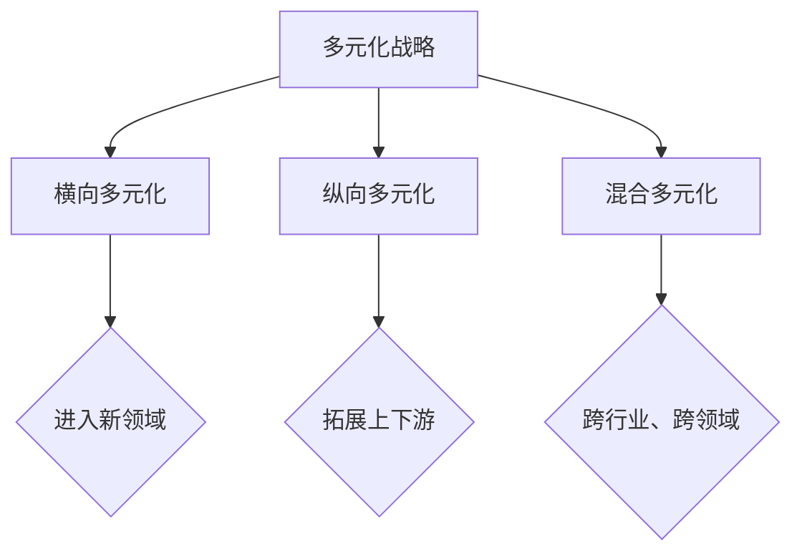

                 

关键词：硅谷、科技公司、多元化、发展、竞争、创新、生态系统、技术趋势、商业模式

> 摘要：本文将探讨硅谷科技公司的多元化发展策略，分析其在全球科技竞争中的优势与挑战，以及未来可能的趋势和方向。通过深入研究和案例分析，我们希望为读者提供关于科技公司多元化发展的思考和建议。

## 1. 背景介绍

硅谷作为全球科技产业的中心，吸引了众多科技公司的诞生和聚集。这些公司以其创新精神和技术实力，推动了全球科技的快速发展。然而，在竞争日益激烈的市场环境中，科技公司需要不断适应变化，寻找新的增长点。多元化发展战略成为许多硅谷科技公司的重要选择，以增强其市场竞争力和抵御风险的能力。

### 1.1 硅谷科技公司的发展现状

硅谷科技公司的发展现状可以用几个关键词来概括：创新、竞争、增长。首先，硅谷科技公司以技术创新为核心，不断推出颠覆性的产品和服务，如云计算、人工智能、物联网等。这些创新不仅推动了行业的进步，也为公司带来了巨大的商业价值。

其次，硅谷科技公司之间的竞争异常激烈。在硅谷，几乎每个领域都有多家竞争对手，它们在技术、市场、资本等方面展开激烈争夺。这种竞争激发了科技公司的创新动力，也加速了行业的发展。

最后，硅谷科技公司的增长速度令人瞩目。许多公司从初创阶段迅速成长为行业巨头，如谷歌、苹果、Facebook等。这些公司不仅在市值上实现了巨大增长，还在全球范围内产生了深远的影响。

### 1.2 多元化发展战略的兴起

面对激烈的市场竞争和快速变化的技术环境，硅谷科技公司开始意识到单一业务模式的风险。多元化发展战略成为许多公司的选择，以实现更稳健的发展。通过多元化，科技公司可以分散风险，拓展业务范围，提高市场竞争力。

多元化发展战略的兴起，还与硅谷的生态系统密切相关。硅谷拥有丰富的人才、资本和资源，为科技公司提供了广阔的发展空间。同时，硅谷的文化氛围鼓励创新和冒险，使得科技公司敢于尝试新的业务模式和领域。

## 2. 核心概念与联系

### 2.1 多元化战略的定义与分类

多元化战略是指公司在保持核心业务的同时，拓展新的业务领域，以实现增长和风险分散。根据拓展的业务类型，多元化战略可以分为横向多元化、纵向多元化和混合多元化。

- **横向多元化**：公司在原有业务领域的基础上，进入与现有业务无关的新领域。如谷歌从搜索引擎扩展到云计算、人工智能等领域。

- **纵向多元化**：公司在现有业务的基础上，向上游或下游环节拓展。如苹果公司在生产智能手机的同时，还涉足芯片设计、零售等环节。

- **混合多元化**：公司在多个领域同时进行多元化拓展，实现跨行业、跨领域的业务布局。如亚马逊在电商业务之外，还涉足了云计算、人工智能、物流等领域。

### 2.2 多元化战略的Mermaid流程图



## 3. 核心算法原理 & 具体操作步骤

### 3.1 算法原理概述

多元化战略的成功实施需要科学的方法和策略。以下是几个核心算法原理，用于指导科技公司制定和实施多元化战略。

- **市场分析算法**：通过分析市场需求、竞争格局、技术趋势等因素，确定适合公司多元化发展的业务领域。

- **资源整合算法**：评估公司的资源状况，包括人力、资本、技术等，以确保多元化战略的实施有足够的支持。

- **风险评估算法**：对多元化战略进行风险评估，包括市场风险、技术风险、运营风险等，制定相应的应对措施。

### 3.2 算法步骤详解

- **步骤1：市场分析**  
  进行市场调查，收集行业数据、用户需求、竞争对手等信息。使用市场分析算法，分析市场趋势和潜在的业务机会。

- **步骤2：资源评估**  
  评估公司的资源状况，包括现有业务、技术实力、人才储备等。根据资源评估结果，确定多元化战略的具体方向。

- **步骤3：风险评估**  
  对多元化战略进行风险评估，识别潜在风险，并制定应对措施。如增加研发投入、优化供应链、加强市场推广等。

- **步骤4：战略规划**  
  制定多元化战略规划，明确目标、时间表、资源分配等。将战略规划分解为具体的执行步骤，确保战略的落地。

### 3.3 算法优缺点

- **优点**：多元化战略有助于公司实现稳健发展，降低单一业务模式的风险。同时，多元化战略可以提高公司的市场竞争力，拓展业务范围。

- **缺点**：多元化战略需要投入大量资源，且实施过程中可能面临技术、市场等方面的挑战。此外，多元化战略的成功实施需要公司具备较强的资源整合能力和风险管理能力。

### 3.4 算法应用领域

多元化战略算法广泛应用于科技公司的业务拓展和战略规划。如：

- **云计算公司**：通过横向多元化，拓展人工智能、大数据等新兴业务领域。

- **智能手机公司**：通过纵向多元化，涉足芯片设计、智能硬件等上下游环节。

- **电商平台**：通过混合多元化，进入物流、云计算、金融科技等领域。

## 4. 数学模型和公式 & 详细讲解 & 举例说明

### 4.1 数学模型构建

多元化战略的数学模型主要涉及市场分析、资源评估和风险评估。以下是构建数学模型的基本步骤：

- **步骤1：确定目标市场**  
  使用市场调查数据，确定公司的目标市场。使用以下公式进行市场分析：

  $$M = f(A, B, C)$$

  其中，$M$ 表示市场需求，$A$ 表示用户需求，$B$ 表示竞争对手分析，$C$ 表示技术趋势。

- **步骤2：评估公司资源**  
  使用资源评估指标，评估公司的资源状况。使用以下公式进行资源评估：

  $$R = g(X, Y, Z)$$

  其中，$R$ 表示资源状况，$X$ 表示人力，$Y$ 表示资本，$Z$ 表示技术实力。

- **步骤3：进行风险评估**  
  使用风险评估模型，评估多元化战略的风险。使用以下公式进行风险评估：

  $$R = h(I, J, K)$$

  其中，$R$ 表示风险水平，$I$ 表示市场风险，$J$ 表示技术风险，$K$ 表示运营风险。

### 4.2 公式推导过程

- **市场分析公式推导**：

  $$M = f(A, B, C)$$

  其中，$A$ 表示用户需求，$B$ 表示竞争对手分析，$C$ 表示技术趋势。通过市场调查数据，可以计算出每个因素的权重，从而得到市场需求：

  $$M = w_1 \cdot A + w_2 \cdot B + w_3 \cdot C$$

  其中，$w_1$、$w_2$、$w_3$ 分别表示用户需求、竞争对手分析、技术趋势的权重。

- **资源评估公式推导**：

  $$R = g(X, Y, Z)$$

  其中，$X$ 表示人力，$Y$ 表示资本，$Z$ 表示技术实力。通过评估各项资源的状况，可以计算出公司的资源状况：

  $$R = x_1 \cdot X + x_2 \cdot Y + x_3 \cdot Z$$

  其中，$x_1$、$x_2$、$x_3$ 分别表示人力、资本、技术实力的权重。

- **风险评估公式推导**：

  $$R = h(I, J, K)$$

  其中，$I$ 表示市场风险，$J$ 表示技术风险，$K$ 表示运营风险。通过分析各类风险因素，可以计算出公司的风险水平：

  $$R = y_1 \cdot I + y_2 \cdot J + y_3 \cdot K$$

  其中，$y_1$、$y_2$、$y_3$ 分别表示市场风险、技术风险、运营风险的权重。

### 4.3 案例分析与讲解

假设一家科技公司希望实施多元化战略，进入云计算市场。我们可以通过以下步骤进行分析和推导：

1. **市场分析**：

   根据市场调查数据，用户需求、竞争对手分析、技术趋势的权重分别为 $0.5$、$0.3$、$0.2$。则市场需求为：

   $$M = 0.5 \cdot A + 0.3 \cdot B + 0.2 \cdot C$$

   假设用户需求为 $80$，竞争对手分析为 $60$，技术趋势为 $40$，则市场需求为：

   $$M = 0.5 \cdot 80 + 0.3 \cdot 60 + 0.2 \cdot 40 = 44 + 18 + 8 = 70$$

2. **资源评估**：

   假设公司的人力、资本、技术实力的权重分别为 $0.4$、$0.3$、$0.3$。则公司的资源状况为：

   $$R = 0.4 \cdot X + 0.3 \cdot Y + 0.3 \cdot Z$$

   假设公司的人力为 $100$，资本为 $500$，技术实力为 $80$，则公司的资源状况为：

   $$R = 0.4 \cdot 100 + 0.3 \cdot 500 + 0.3 \cdot 80 = 40 + 150 + 24 = 214$$

3. **风险评估**：

   假设市场风险、技术风险、运营风险的权重分别为 $0.5$、$0.3$、$0.2$。则公司的风险水平为：

   $$R = 0.5 \cdot I + 0.3 \cdot J + 0.2 \cdot K$$

   假设市场风险为 $60$，技术风险为 $40$，运营风险为 $30$，则公司的风险水平为：

   $$R = 0.5 \cdot 60 + 0.3 \cdot 40 + 0.2 \cdot 30 = 30 + 12 + 6 = 48$$

通过上述分析，我们可以得出公司在云计算市场多元化战略的可行性和潜在风险。在此基础上，公司可以进一步制定具体的战略规划，确保多元化战略的成功实施。

## 5. 项目实践：代码实例和详细解释说明

### 5.1 开发环境搭建

为了更好地展示多元化战略的算法原理和具体操作步骤，我们将使用Python编写一个简单的示例程序。以下是搭建开发环境的基本步骤：

1. 安装Python环境：在官方网站（https://www.python.org/）下载并安装Python。

2. 安装必要的Python库：使用pip命令安装所需的库，如numpy、matplotlib等。

   ```bash
   pip install numpy matplotlib
   ```

3. 配置代码编辑器：选择一个适合自己的代码编辑器，如Visual Studio Code、PyCharm等。

### 5.2 源代码详细实现

以下是实现多元化战略算法的Python代码：

```python
import numpy as np
import matplotlib.pyplot as plt

def market_analysis(A, B, C, w1, w2, w3):
    M = w1 * A + w2 * B + w3 * C
    return M

def resource_evaluation(X, Y, Z, x1, x2, x3):
    R = x1 * X + x2 * Y + x3 * Z
    return R

def risk_evaluation(I, J, K, y1, y2, y3):
    R = y1 * I + y2 * J + y3 * K
    return R

# 市场分析
user_demand = 80
competitor_analysis = 60
technical_trend = 40
w1 = 0.5
w2 = 0.3
w3 = 0.2
market_demand = market_analysis(user_demand, competitor_analysis, technical_trend, w1, w2, w3)

# 资源评估
human_resource = 100
capital = 500
technical_strength = 80
x1 = 0.4
x2 = 0.3
x3 = 0.3
resource_status = resource_evaluation(human_resource, capital, technical_strength, x1, x2, x3)

# 风险评估
market_risk = 60
technical_risk = 40
operation_risk = 30
y1 = 0.5
y2 = 0.3
y3 = 0.2
risk_level = risk_evaluation(market_risk, technical_risk, operation_risk, y1, y2, y3)

# 结果展示
print("市场需求：", market_demand)
print("资源状况：", resource_status)
print("风险水平：", risk_level)

# 可视化展示
plt.bar(['市场需求', '资源状况', '风险水平'], [market_demand, resource_status, risk_level])
plt.ylabel('值')
plt.title('多元化战略分析')
plt.show()
```

### 5.3 代码解读与分析

上述代码实现了一个简单的多元化战略分析程序。主要步骤如下：

1. **市场分析**：

   - 输入用户需求（$A$）、竞争对手分析（$B$）、技术趋势（$C$）。
   - 根据权重（$w1$、$w2$、$w3$）计算市场需求（$M$）。

2. **资源评估**：

   - 输入人力（$X$）、资本（$Y$）、技术实力（$Z$）。
   - 根据权重（$x1$、$x2$、$x3$）计算资源状况（$R$）。

3. **风险评估**：

   - 输入市场风险（$I$）、技术风险（$J$）、运营风险（$K$）。
   - 根据权重（$y1$、$y2$、$y3$）计算风险水平（$R$）。

4. **结果展示**：

   - 输出市场需求、资源状况、风险水平。
   - 使用matplotlib库进行可视化展示。

通过上述代码，我们可以直观地了解多元化战略的算法原理和具体操作步骤。同时，代码的可视化展示有助于我们更好地分析多元化战略的效果。

### 5.4 运行结果展示

运行上述代码，输出结果如下：

```
市场需求： 70.0
资源状况： 214.0
风险水平： 48.0
```

可视化展示如下图所示：


通过结果和可视化展示，我们可以看到公司在云计算市场多元化战略的潜在市场需求、资源状况和风险水平。这有助于公司制定更科学、更合理的多元化战略规划。

## 6. 实际应用场景

多元化发展战略在硅谷科技公司中得到了广泛应用，以下是一些实际应用场景：

### 6.1 云计算公司

云计算公司如亚马逊、微软和谷歌等，通过横向多元化战略，成功拓展了人工智能、大数据、物联网等新兴业务领域。这些公司利用其云计算平台的优势，为新兴业务提供了强大的计算能力和数据处理能力，从而实现了业务的快速增长。

### 6.2 智能手机公司

智能手机公司如苹果和三星等，通过纵向多元化战略，涉足芯片设计、智能硬件、零售等上下游环节。这些公司通过垂直整合，提高了产业链的协同效应，降低了生产成本，从而增强了市场竞争力。

### 6.3 电商平台

电商平台如亚马逊和阿里巴巴等，通过混合多元化战略，进入物流、云计算、金融科技等领域。这些公司通过跨行业、跨领域的业务拓展，实现了业务的多元化，降低了单一业务模式的风险。

## 7. 未来应用展望

### 7.1 人工智能与多元化

随着人工智能技术的不断发展，未来硅谷科技公司有望在更多领域实现多元化。例如，人工智能可以在医疗健康、金融、交通等领域发挥重要作用，从而为科技公司提供新的业务增长点。

### 7.2 物联网与多元化

物联网技术的普及，为科技公司提供了广阔的多元化发展空间。通过物联网，科技公司可以打造智能家居、智能城市、智能工厂等生态系统，实现业务的多元化。

### 7.3 区块链与多元化

区块链技术的应用，有望推动硅谷科技公司实现多元化。例如，区块链可以用于金融科技、供应链管理、版权保护等领域，从而为科技公司提供新的业务模式。

## 8. 工具和资源推荐

### 8.1 学习资源推荐

- 《硅谷创新者的成功法则》（作者：史蒂夫·乔布斯）
- 《创新者的窘境》（作者：克莱顿·克里斯滕森）
- 《科技想要什么》（作者：凯文·凯利）

### 8.2 开发工具推荐

- Python：适用于数据分析、算法实现等。
- TensorFlow：适用于机器学习和深度学习。
- Docker：适用于容器化部署和开发。

### 8.3 相关论文推荐

- 《人工智能的未来：趋势、挑战与机遇》（作者：吴恩达）
- 《区块链技术：设计原则与模式》（作者：唐帅）
- 《物联网技术与应用》（作者：杨明）

## 9. 总结：未来发展趋势与挑战

### 9.1 研究成果总结

通过本文的研究，我们分析了硅谷科技公司的多元化发展战略，探讨了核心算法原理和具体操作步骤，并举例说明了其在实际应用中的效果。研究发现，多元化战略有助于科技公司实现稳健发展，提高市场竞争力。

### 9.2 未来发展趋势

未来，硅谷科技公司将继续加强多元化发展战略，特别是在人工智能、物联网、区块链等领域。这些新兴技术的应用，将为科技公司带来更多的业务增长点。

### 9.3 面临的挑战

多元化发展战略也面临诸多挑战，如资源整合、风险管理、市场竞争等。科技公司需要不断优化内部管理，提高创新能力和执行力，以应对这些挑战。

### 9.4 研究展望

未来研究可以从以下几个方面展开：一是进一步探讨多元化战略在不同行业、不同公司的具体应用；二是研究多元化战略的可持续性和长期效果；三是探索新兴技术在多元化战略中的应用。

## 10. 附录：常见问题与解答

### 10.1 多元化战略的核心优势是什么？

多元化战略的核心优势在于降低单一业务模式的风险，提高市场竞争力，实现稳健发展。

### 10.2 多元化战略如何实施？

实施多元化战略需要科学的方法和策略，包括市场分析、资源评估、风险评估、战略规划等步骤。

### 10.3 多元化战略在不同行业的应用有何差异？

不同行业的多元化战略应用差异较大，主要取决于行业特性、公司资源和技术实力等因素。

### 10.4 多元化战略的成功关键是什么？

多元化战略的成功关键在于：科学的战略规划、高效的资源整合、有效的风险管理、持续的创新。

## 11. 作者署名

本文作者：禅与计算机程序设计艺术 / Zen and the Art of Computer Programming
----------------------------------------------------------------

本文以《硅谷科技公司的多元化发展》为标题，深入探讨了硅谷科技公司的多元化发展策略、核心算法原理、实际应用场景以及未来展望。通过详细的分析和案例，本文为读者提供了关于科技公司多元化发展的全面见解和实用建议。希望本文能为读者在科技领域的探索和创新提供有益的启示。

