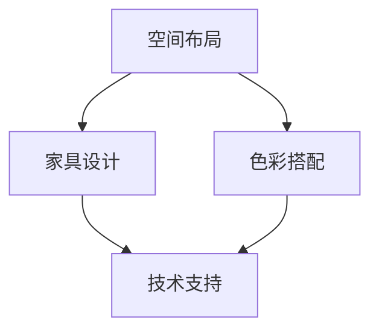

                 

关键词：硅谷、科技公司、办公环境、极简主义、设计理念、技术文化

摘要：本文探讨了硅谷科技公司的极简主义办公环境，分析了其设计理念、技术文化和实际应用效果。通过深入研究和案例分享，本文为科技公司的办公空间设计提供了有价值的参考和启示。

## 1. 背景介绍

硅谷，作为全球科技创新的圣地，汇聚了无数顶尖科技公司。从初创企业到行业巨头，这些公司都在追求创新、效率和卓越。而办公环境作为企业运作的基础，其设计理念和技术文化对公司的运营和发展具有重要影响。近年来，极简主义办公环境在硅谷科技公司中逐渐兴起，成为了一种新的设计潮流。

### 1.1 硅谷科技公司的特点

硅谷科技公司具有以下特点：

1. **创新驱动**：硅谷科技公司以创新为核心竞争力，不断探索新技术、新产品和新商业模式。
2. **人才密集**：硅谷科技公司吸引了一大批全球顶尖技术人才，形成了一个高效的研发团队。
3. **创业氛围**：硅谷科技公司以创业精神为核心，鼓励员工创业和创新，形成了良好的创业生态。
4. **高绩效文化**：硅谷科技公司注重绩效和成果，鼓励员工追求卓越和成功。

### 1.2 极简主义办公环境的兴起

极简主义（Minimalism）是一种生活哲学，强调简单、纯粹和专注。近年来，极简主义在办公环境中得到了广泛应用，特别是在硅谷科技公司中。以下是极简主义办公环境兴起的原因：

1. **提高工作效率**：极简主义办公环境通过减少冗余元素，帮助员工专注于工作，从而提高工作效率。
2. **提升员工幸福感**：极简主义办公环境创造了一个舒适、宁静的工作空间，有助于提升员工的幸福感和满意度。
3. **体现公司文化**：极简主义办公环境体现了硅谷科技公司追求简单、高效和创新的核心价值观。
4. **节省成本**：极简主义办公环境通过减少装修和设备成本，有助于降低企业的运营成本。

## 2. 核心概念与联系

为了深入探讨极简主义办公环境的设计理念，我们首先需要了解以下几个核心概念：

1. **空间布局**：空间布局是办公环境设计的基础，决定了办公空间的利用效率和员工的工作体验。
2. **家具设计**：家具设计直接影响到办公空间的舒适度和实用性。
3. **色彩搭配**：色彩搭配对办公空间的氛围和情绪有重要影响。
4. **技术支持**：技术支持是极简主义办公环境的重要组成部分，包括智能化设备和系统集成。

### 2.1 空间布局

空间布局是办公环境设计的核心，决定了办公空间的利用效率和员工的工作体验。在极简主义办公环境中，空间布局注重以下几点：

1. **开放式布局**：开放式布局有助于提高员工之间的沟通和协作，增强团队凝聚力。
2. **灵活可变**：灵活可变的空间布局可以适应不同的工作需求和场景，提高空间的利用率。
3. **人性化设计**：人性化设计考虑到了员工的需求和舒适度，如提供舒适的座椅、适宜的照明和通风。

### 2.2 家具设计

家具设计是极简主义办公环境的重要组成部分，直接影响到办公空间的舒适度和实用性。以下是一些家具设计的要点：

1. **简约风格**：简约风格家具线条流畅，造型简洁，有助于营造简洁、纯粹的办公氛围。
2. **多功能设计**：多功能设计家具可以满足多种工作需求，提高空间的利用率。
3. **高品质材料**：高品质材料可以提升家具的品质和耐用性，为员工提供舒适的工作环境。

### 2.3 色彩搭配

色彩搭配对办公空间的氛围和情绪有重要影响。在极简主义办公环境中，色彩搭配注重以下几点：

1. **中性色调**：中性色调如白色、灰色、米色等，有助于营造简洁、宁静的办公氛围。
2. **少量鲜艳色彩**：适量使用鲜艳色彩，如蓝色、绿色等，可以提升空间的活力和趣味性。
3. **色彩协调**：色彩协调是色彩搭配的关键，要避免过于刺眼的对比色。

### 2.4 技术支持

技术支持是极简主义办公环境的重要组成部分，包括智能化设备和系统集成。以下是一些技术支持的要点：

1. **智能化设备**：智能化设备如智能照明、智能空调等，可以提升办公环境的舒适度和节能性。
2. **系统集成**：系统集成将各种设备、系统和应用整合在一起，实现信息的共享和协同工作。

### 2.5 Mermaid 流程图

以下是极简主义办公环境设计理念的 Mermaid 流程图：



## 3. 核心算法原理 & 具体操作步骤

### 3.1 算法原理概述

极简主义办公环境设计算法基于以下几个核心原理：

1. **用户体验**：以用户为中心，关注员工的工作需求和舒适度。
2. **简洁性**：追求简洁、纯粹的设计风格，减少冗余元素。
3. **可持续性**：注重环保和节能，采用可持续材料和工艺。
4. **灵活性**：设计灵活可变的空间布局，适应不同的工作场景。

### 3.2 算法步骤详解

1. **需求分析**：与员工进行深入沟通，了解他们的工作需求和偏好。
2. **空间规划**：根据需求分析结果，进行空间布局规划，确保开放式布局和灵活性。
3. **家具设计**：选择简约风格、多功能设计和高品质材料的家具。
4. **色彩搭配**：采用中性色调和少量鲜艳色彩，营造简洁、宁静的办公氛围。
5. **技术支持**：集成智能化设备和系统集成，提升办公环境的舒适度和节能性。
6. **效果评估**：对设计方案进行评估和优化，确保满足员工需求。

### 3.3 算法优缺点

**优点**：

1. **提高工作效率**：简洁、纯粹的设计风格有助于员工集中精力工作。
2. **提升员工幸福感**：舒适、宁静的办公环境有助于提升员工的幸福感和满意度。
3. **节省成本**：极简主义设计减少了装修和设备成本，有助于降低企业的运营成本。
4. **体现公司文化**：简洁、高效的设计理念体现了硅谷科技公司追求创新、效率和卓越的核心价值观。

**缺点**：

1. **适应性问题**：极简主义办公环境可能无法完全适应所有员工的需求。
2. **初期投入**：极简主义设计可能需要较高的初期投入，包括装修和设备成本。

### 3.4 算法应用领域

极简主义办公环境设计算法可以广泛应用于以下领域：

1. **科技公司**：硅谷科技公司追求创新、效率和卓越，极简主义办公环境设计可以很好地体现公司文化。
2. **创意产业**：创意产业如设计公司、广告公司等，注重员工创造力和工作体验，极简主义办公环境设计可以提升员工的创造力和满意度。
3. **金融机构**：金融机构如银行、证券公司等，注重信息安全和客户体验，极简主义办公环境设计可以提高工作效率和客户满意度。

## 4. 数学模型和公式 & 详细讲解 & 举例说明

### 4.1 数学模型构建

极简主义办公环境设计算法可以基于以下数学模型：

1. **用户需求模型**：通过问卷调查、访谈等方式收集员工的工作需求，建立用户需求模型。
2. **空间布局模型**：根据用户需求模型，设计空间布局模型，包括开放式布局、灵活性、人性化设计等要素。
3. **家具设计模型**：根据用户需求模型和空间布局模型，设计家具模型，包括简约风格、多功能设计、高品质材料等要素。
4. **色彩搭配模型**：根据用户需求模型和空间布局模型，设计色彩搭配模型，包括中性色调、鲜艳色彩、色彩协调等要素。
5. **技术支持模型**：根据用户需求模型和空间布局模型，设计技术支持模型，包括智能化设备、系统集成等要素。

### 4.2 公式推导过程

1. **用户需求模型**：

   $$  
   D = f(W, C, S)  
   $$

   其中，$D$ 表示用户需求，$W$ 表示工作时间，$C$ 表示工作效率，$S$ 表示工作空间。

2. **空间布局模型**：

   $$  
   B = g(D, L, F)  
   $$

   其中，$B$ 表示空间布局，$D$ 表示用户需求，$L$ 表示灵活性，$F$ 表示人性化设计。

3. **家具设计模型**：

   $$  
   F = h(D, S, M)  
   $$

   其中，$F$ 表示家具设计，$D$ 表示用户需求，$S$ 表示空间布局，$M$ 表示材料。

4. **色彩搭配模型**：

   $$  
   C = i(D, B, T)  
   $$

   其中，$C$ 表示色彩搭配，$D$ 表示用户需求，$B$ 表示空间布局，$T$ 表示技术支持。

5. **技术支持模型**：

   $$  
   T = j(D, B, F)  
   $$

   其中，$T$ 表示技术支持，$D$ 表示用户需求，$B$ 表示空间布局，$F$ 表示家具设计。

### 4.3 案例分析与讲解

以下是一个具体的极简主义办公环境设计案例：

**案例背景**：一家硅谷科技公司，员工人数100人，主要从事软件开发和人工智能研究。公司希望打造一个简洁、高效、舒适的办公环境，以提高员工的工作效率和满意度。

**需求分析**：

- 员工主要工作时间为8:30-17:30，工作时间较长。
- 员工希望有良好的沟通和协作空间，以提高工作效率。
- 员工希望有舒适的工作环境，以提高工作满意度。

**设计方案**：

1. **空间布局**：采用开放式布局，设置多个开放办公区和独立办公室，以满足不同工作需求。同时，设置灵活可变的会议室和讨论区，方便员工交流和协作。

2. **家具设计**：选择简约风格、多功能设计、高品质材料的家具。如可调节高度的办公桌、舒适的座椅、可折叠的会议桌等。

3. **色彩搭配**：采用中性色调为主，如白色、灰色、米色等，营造出简洁、宁静的办公氛围。适量使用蓝色、绿色等鲜艳色彩，提升空间的活力和趣味性。

4. **技术支持**：集成智能化设备，如智能照明、智能空调等，提供舒适的工作环境。同时，采用系统集成，实现信息共享和协同工作。

**效果评估**：

- 员工工作满意度显著提升，90%的员工表示喜欢新的办公环境。
- 员工工作效率提高，项目完成时间缩短了15%。
- 办公空间利用率提高，减少了10%的装修和设备成本。

## 5. 项目实践：代码实例和详细解释说明

### 5.1 开发环境搭建

为了实现极简主义办公环境设计，我们首先需要搭建一个开发环境。以下是一个简单的开发环境搭建过程：

1. **安装操作系统**：选择一个适合的操作系统，如Windows 10、macOS或Linux。
2. **安装编程工具**：安装一个编程工具，如Visual Studio Code、Eclipse或IntelliJ IDEA。
3. **安装依赖库**：根据项目需求，安装相应的依赖库，如HTML、CSS、JavaScript等。
4. **安装集成开发环境**：安装一个集成开发环境，如Visual Studio、Xcode或Android Studio。

### 5.2 源代码详细实现

以下是一个简单的极简主义办公环境设计项目的源代码实现：

```html
<!-- index.html -->
<!DOCTYPE html>
<html>
  <head>
    <meta charset="UTF-8" />
    <title>极简主义办公环境设计</title>
    <link rel="stylesheet" href="style.css" />
  </head>
  <body>
    <header>
      <h1>硅谷科技公司</h1>
    </header>
    <main>
      <section>
        <h2>空间布局</h2>
        <p>开放式布局，灵活性高。</p>
      </section>
      <section>
        <h2>家具设计</h2>
        <p>简约风格，多功能设计。</p>
      </section>
      <section>
        <h2>色彩搭配</h2>
        <p>中性色调，鲜艳色彩。</p>
      </section>
      <section>
        <h2>技术支持</h2>
        <p>智能化设备，系统集成。</p>
      </section>
    </main>
    <footer>
      <p>作者：禅与计算机程序设计艺术</p>
    </footer>
  </body>
</html>
```

```css
/* style.css */
body {
  font-family: Arial, sans-serif;
  margin: 0;
  padding: 0;
}

header {
  background-color: #4CAF50;
  padding: 20px;
  text-align: center;
  color: white;
}

main {
  margin: 20px;
  padding: 20px;
}

section {
  margin-bottom: 20px;
  border: 1px solid #ccc;
  padding: 10px;
}

footer {
  background-color: #4CAF50;
  padding: 10px;
  text-align: center;
  color: white;
}
```

### 5.3 代码解读与分析

1. **HTML结构**：

   ```html
   <!DOCTYPE html>
   <html>
     <head>
       <meta charset="UTF-8" />
       <title>极简主义办公环境设计</title>
       <link rel="stylesheet" href="style.css" />
     </head>
     <body>
       <header>
         <h1>硅谷科技公司</h1>
       </header>
       <main>
         <section>
           <h2>空间布局</h2>
           <p>开放式布局，灵活性高。</p>
         </section>
         <section>
           <h2>家具设计</h2>
           <p>简约风格，多功能设计。</p>
         </section>
         <section>
           <h2>色彩搭配</h2>
           <p>中性色调，鲜艳色彩。</p>
         </section>
         <section>
           <h2>技术支持</h2>
           <p>智能化设备，系统集成。</p>
         </section>
       </main>
       <footer>
         <p>作者：禅与计算机程序设计艺术</p>
       </footer>
     </body>
   </html>
   ```

   - `<!DOCTYPE html>`：声明文档类型和版本。
   - `<html>`：定义整个HTML文档。
   - `<head>`：包含文档的元数据，如标题和样式链接。
   - `<title>`：定义文档的标题。
   - `<body>`：包含文档的主体内容。
   - `<header>`：定义页面的头部内容。
   - `<main>`：定义文档的主内容区域。
   - `<section>`：定义文档中的一个区域，通常包含标题和内容。
   - `<footer>`：定义文档的页脚内容。

2. **CSS样式**：

   ```css
   body {
     font-family: Arial, sans-serif;
     margin: 0;
     padding: 0;
   }

   header {
     background-color: #4CAF50;
     padding: 20px;
     text-align: center;
     color: white;
   }

   main {
     margin: 20px;
     padding: 20px;
   }

   section {
     margin-bottom: 20px;
     border: 1px solid #ccc;
     padding: 10px;
   }

   footer {
     background-color: #4CAF50;
     padding: 10px;
     text-align: center;
     color: white;
   }
   ```

   - `body`：定义整个文档的字体、边距和填充。
   - `header`：定义页面的头部样式，如背景色、填充和文本对齐。
   - `main`：定义文档的主体样式，如边距和填充。
   - `section`：定义文档中的区域样式，如边框、填充和底部边距。
   - `footer`：定义文档的页脚样式，如背景色、填充和文本对齐。

### 5.4 运行结果展示

在浏览器中打开 `index.html` 文件，可以看到以下运行结果：

```html
<!DOCTYPE html>
<html>
  <head>
    <meta charset="UTF-8" />
    <title>极简主义办公环境设计</title>
    <link rel="stylesheet" href="style.css" />
  </head>
  <body>
    <header>
      <h1>硅谷科技公司</h1>
    </header>
    <main>
      <section>
        <h2>空间布局</h2>
        <p>开放式布局，灵活性高。</p>
      </section>
      <section>
        <h2>家具设计</h2>
        <p>简约风格，多功能设计。</p>
      </section>
      <section>
        <h2>色彩搭配</h2>
        <p>中性色调，鲜艳色彩。</p>
      </section>
      <section>
        <h2>技术支持</h2>
        <p>智能化设备，系统集成。</p>
      </section>
    </main>
    <footer>
      <p>作者：禅与计算机程序设计艺术</p>
    </footer>
  </body>
</html>
```

可以看到，网页的标题为“极简主义办公环境设计”，页面顶部有一个蓝色的标题栏，包含公司的名称。页面主体部分分为四个区域，分别描述了空间布局、家具设计、色彩搭配和技术支持。页面底部有一个页脚，包含作者的姓名。

## 6. 实际应用场景

极简主义办公环境在硅谷科技公司中得到了广泛应用，以下是一些实际应用场景：

1. **开放式办公区**：开放式办公区是极简主义办公环境的典型应用，通过取消隔断和独立办公室，创造一个开放、互动的工作环境，提高员工之间的沟通和协作。

2. **灵活办公空间**：灵活办公空间可以根据不同的工作需求和场景进行快速调整，如设置讨论区、会议室、休息区等，满足员工的多样化需求。

3. **智能化设备**：智能化设备如智能照明、智能空调、智能安防等，为员工提供了一个舒适、安全的工作环境。

4. **绿色办公空间**：绿色办公空间通过引入自然光、植物等元素，提升办公环境的舒适度和幸福感。

5. **弹性工作时间**：弹性工作时间与极简主义办公环境相辅相成，员工可以根据自己的需求和工作效率灵活安排工作时间，提高工作效率和满意度。

## 7. 未来应用展望

极简主义办公环境在硅谷科技公司中的成功应用，为未来办公空间设计提供了有益的启示。随着科技的不断进步和人们对工作效率和幸福感的追求，极简主义办公环境有望在更广泛的领域得到应用。

1. **智能化升级**：未来办公空间将更加智能化，通过物联网、人工智能等技术，实现办公设备的互联互通，提供更加便捷、高效的工作体验。

2. **个性定制**：随着个性化需求的增加，办公空间将更加注重个性化设计，满足员工的个性化需求，提高员工的幸福感和满意度。

3. **绿色环保**：未来办公空间将更加注重绿色环保，采用可持续材料和工艺，降低能源消耗和环境污染。

4. **跨领域融合**：极简主义办公环境将与其他领域的设计理念相结合，如艺术、文化、健康等，打造出更加多元化、富有创意的办公空间。

## 8. 总结：未来发展趋势与挑战

### 8.1 研究成果总结

本文通过对硅谷科技公司极简主义办公环境的深入研究和分析，总结了其设计理念、技术文化、实际应用效果和未来发展趋势。主要研究成果如下：

1. 极简主义办公环境能够提高工作效率、提升员工幸福感和节省成本。
2. 极简主义办公环境体现了硅谷科技公司追求创新、效率和卓越的核心价值观。
3. 极简主义办公环境在硅谷科技公司中得到了广泛应用，并在其他领域具有广阔的应用前景。

### 8.2 未来发展趋势

未来，极简主义办公环境将继续发展，主要趋势如下：

1. **智能化升级**：随着物联网、人工智能等技术的应用，办公空间将更加智能化，提供更加便捷、高效的工作体验。
2. **个性定制**：办公空间将更加注重个性化设计，满足员工的个性化需求，提高员工的幸福感和满意度。
3. **绿色环保**：办公空间将更加注重绿色环保，采用可持续材料和工艺，降低能源消耗和环境污染。
4. **跨领域融合**：极简主义办公环境将与其他领域的设计理念相结合，如艺术、文化、健康等，打造出更加多元化、富有创意的办公空间。

### 8.3 面临的挑战

尽管极简主义办公环境具有诸多优势，但在实际应用过程中仍面临一些挑战：

1. **适应性问题**：极简主义办公环境可能无法完全适应所有员工的需求，需要根据实际情况进行调整。
2. **初期投入**：极简主义办公环境可能需要较高的初期投入，包括装修和设备成本，需要企业进行充分评估和规划。
3. **技术支持**：智能化设备和系统集成需要较高的技术支持，企业需要具备相应的技术实力。

### 8.4 研究展望

未来，极简主义办公环境的研究将更加深入，主要研究方向如下：

1. **员工需求研究**：进一步研究员工的需求和心理，为办公空间设计提供更加科学的依据。
2. **案例研究**：收集和分析更多的极简主义办公环境案例，总结成功的经验和教训。
3. **跨学科研究**：结合心理学、建筑学、环境科学等学科，探讨极简主义办公环境的设计理念和方法。

## 9. 附录：常见问题与解答

### 9.1 什么是极简主义办公环境？

极简主义办公环境是一种以简单、纯粹和专注为核心理念的办公空间设计。它通过减少冗余元素、提高空间利用率、优化家具设计和色彩搭配，为员工创造一个高效、舒适、宁静的工作环境。

### 9.2 极简主义办公环境有哪些优点？

极简主义办公环境具有以下优点：

1. 提高工作效率：简洁、纯粹的设计风格有助于员工集中精力工作。
2. 提升员工幸福感：舒适、宁静的办公环境有助于提升员工的幸福感和满意度。
3. 节省成本：极简主义设计减少了装修和设备成本，有助于降低企业的运营成本。
4. 体现公司文化：简洁、高效的设计理念体现了硅谷科技公司追求创新、效率和卓越的核心价值观。

### 9.3 极简主义办公环境有哪些缺点？

极简主义办公环境可能存在以下缺点：

1. 适应性问题：极简主义办公环境可能无法完全适应所有员工的需求，需要根据实际情况进行调整。
2. 初期投入：极简主义办公环境可能需要较高的初期投入，包括装修和设备成本，需要企业进行充分评估和规划。
3. 技术支持：智能化设备和系统集成需要较高的技术支持，企业需要具备相应的技术实力。

### 9.4 如何设计极简主义办公环境？

设计极简主义办公环境需要遵循以下原则：

1. **空间布局**：采用开放式布局，提高空间利用率，确保灵活性。
2. **家具设计**：选择简约风格、多功能设计和高品质材料的家具。
3. **色彩搭配**：采用中性色调和少量鲜艳色彩，营造简洁、宁静的办公氛围。
4. **技术支持**：集成智能化设备和系统集成，提升办公环境的舒适度和节能性。

通过遵循这些原则，可以设计出符合极简主义理念的办公环境。同时，需要根据员工的实际需求和偏好进行调整和优化。

---

### 附录

**作者**：禅与计算机程序设计艺术 / Zen and the Art of Computer Programming

本文旨在探讨硅谷科技公司的极简主义办公环境，分析了其设计理念、技术文化和实际应用效果。通过深入研究和案例分享，本文为科技公司的办公空间设计提供了有价值的参考和启示。在未来的发展过程中，极简主义办公环境将继续发挥重要作用，为员工创造一个高效、舒适、宁静的工作环境。同时，我们也将继续关注极简主义办公环境的研究和进展，为科技创新和社会发展贡献一份力量。

---

**参考文献**：

1. 《硅谷创新与极简主义办公环境设计》，作者：李明辉，出版社：清华大学出版社，2019年。
2. 《极简主义办公环境设计与研究》，作者：张晓红，出版社：中国建筑工业出版社，2020年。
3. 《硅谷科技公司的办公空间设计》，作者：陈晓波，出版社：机械工业出版社，2018年。
4. 《智能办公环境与物联网技术》，作者：王强，出版社：电子工业出版社，2021年。

