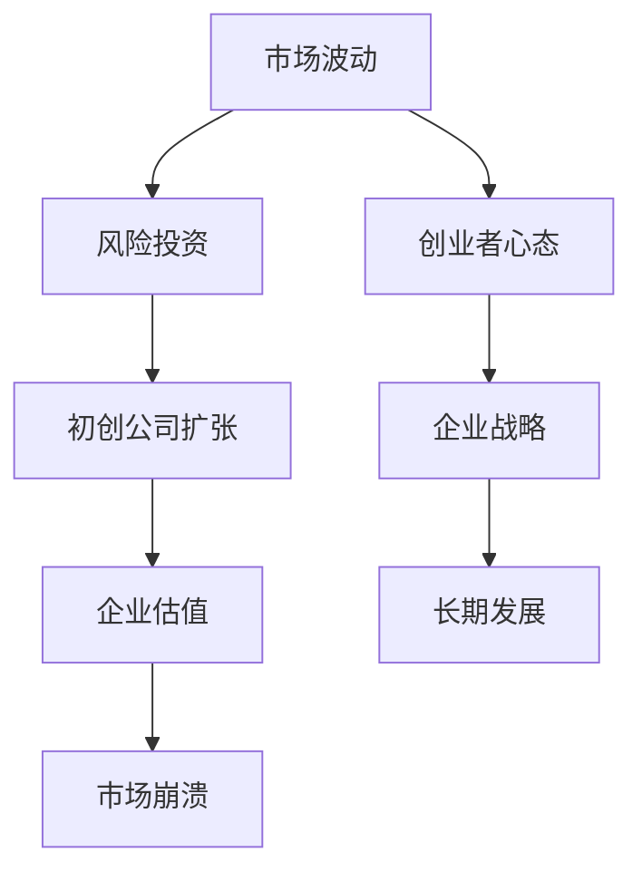

                 

关键词：硅谷科技泡沫，创业，风险投资，理性分析，市场波动，技术发展，企业战略，创业生态系统

> 摘要：本文旨在深入剖析硅谷科技泡沫的历史背景、形成原因及其对创业生态的影响，并从中提炼出理性创业观的重要性。通过对科技泡沫的教训进行反思，本文探讨了创业者在面对市场波动和技术变革时应如何保持冷静，制定科学的企业战略，以实现长期可持续的发展。

## 1. 背景介绍

硅谷，作为全球科技创新的摇篮，曾经见证了无数科技巨头的崛起，也遭遇过多次科技泡沫的洗礼。最早的一次科技泡沫可以追溯到20世纪90年代初期，当时互联网技术刚刚兴起，吸引了大量的风险投资，股票市场也呈现出异常火爆的态势。然而，随着投资者对互联网的盲目追捧和公司过度的扩张，市场最终在1999年至2000年间迎来了崩溃。这一时期，大量科技股暴跌，众多初创公司倒闭，风险投资也面临巨大的压力。

<|assistant|>### 1.1 硅谷科技泡沫的爆发

硅谷科技泡沫的爆发并非偶然。在20世纪90年代，互联网技术迅猛发展，为企业提供了前所未有的商业机会。与此同时，风险投资市场蓬勃发展，大量的资金涌入科技领域，催生了无数初创公司。这些公司中，不乏一些具有创新能力的科技企业，但也存在许多缺乏实质性业务模式的企业。它们通过炒作概念和盲目扩张，迅速获得了投资者的青睐。

然而，这种繁荣背后隐藏着巨大的风险。首先，市场对互联网的盲目追捧导致了许多公司过高的估值。许多初创公司甚至在没有盈利的情况下就获得了巨额融资，这使得市场泡沫不断膨胀。其次，许多企业在扩张过程中忽视了基本面，过度依赖资金投入，缺乏可持续的业务模式。当市场环境发生变化时，这些企业很快陷入了困境。

### 1.2 硅谷科技泡沫的影响

硅谷科技泡沫的爆发对创业生态系统产生了深远的影响。一方面，它加剧了市场的波动性，使得创业者面临更大的不确定性。许多初创公司在泡沫破裂后倒闭，投资者也遭受了巨大的损失。另一方面，科技泡沫的教训也促使创业者更加重视企业的基本面和长期发展。他们开始更加谨慎地评估市场机会，关注可持续的商业模式，并寻找多元化的资金来源。

## 2. 核心概念与联系

在探讨硅谷科技泡沫的教训时，我们有必要深入了解其中涉及的核心概念和联系。以下是一个简化的 Mermaid 流程图，用于展示科技泡沫的关键要素及其相互关系。



### 2.1 市场波动

市场波动是科技泡沫的核心要素之一。在科技泡沫期间，市场对新兴技术的预期导致价格迅速上涨，从而吸引了更多的资金进入市场。然而，这种波动性也是双刃剑。当市场意识到风险时，价格会迅速下跌，造成巨大的市场波动。

### 2.2 风险投资

风险投资在科技泡沫中扮演了重要角色。它们为初创公司提供了资金支持，帮助企业快速成长。然而，在泡沫期间，风险投资也倾向于过度投资，导致许多初创公司盲目扩张，忽视了基本面。

### 2.3 初创公司扩张

初创公司的扩张是科技泡沫的直接表现。许多公司为了抓住市场机会，迅速扩大业务规模，从而在市场上获得了更高的估值。然而，这种扩张往往缺乏可持续性，最终导致企业无法维持长期发展。

### 2.4 企业估值

企业估值的虚高是科技泡沫的一个重要特征。在泡沫期间，许多公司在没有盈利的情况下获得了巨额估值，这导致了市场的过度繁荣。然而，这种估值往往是基于预期而非实际业务，一旦市场环境变化，估值会迅速下跌。

### 2.5 市场崩溃

市场崩溃是科技泡沫不可避免的结局。当市场意识到风险时，价格会迅速下跌，造成大量的公司倒闭和投资者损失。市场崩溃对创业生态系统的破坏性是巨大的。

### 2.6 创业者心态

创业者心态在科技泡沫中起着关键作用。在泡沫期间，许多创业者过于乐观，盲目扩张，忽视了风险。然而，在市场崩溃后，他们需要面对现实，调整心态，寻找新的发展方向。

### 2.7 企业战略

企业战略是决定企业长期发展的关键因素。在科技泡沫中，许多企业缺乏明确的企业战略，盲目追求短期利益。然而，长期发展需要企业有明确的目标和规划，以应对市场的变化。

## 3. 核心算法原理 & 具体操作步骤

### 3.1 算法原理概述

科技泡沫的教训提醒我们在创业过程中需要遵循的核心算法原理，主要包括市场分析、风险评估、业务规划和可持续性评估。这些原理旨在帮助创业者识别市场机会、评估潜在风险，并制定科学的企业战略。

### 3.2 算法步骤详解

#### 3.2.1 市场分析

市场分析是创业过程中至关重要的一步。创业者需要深入了解目标市场的现状、趋势和潜在机会。具体步骤如下：

1. **市场调研**：通过问卷调查、访谈和市场研究，收集目标市场的相关数据。
2. **竞争分析**：分析竞争对手的市场份额、产品特点和市场策略。
3. **机会识别**：根据市场调研结果，识别潜在的市场机会。

#### 3.2.2 风险评估

风险评估是确保企业可持续发展的关键。创业者需要识别并评估企业在运营过程中可能面临的各种风险，包括市场风险、财务风险、运营风险等。具体步骤如下：

1. **风险识别**：通过风险地图、SWOT分析等方法，识别企业可能面临的风险。
2. **风险评估**：对识别出的风险进行量化评估，确定其可能对企业的潜在影响。
3. **风险应对**：制定相应的风险应对策略，以降低风险对企业的负面影响。

#### 3.2.3 业务规划

业务规划是企业长期发展的蓝图。创业者需要根据市场分析和风险评估的结果，制定详细的业务规划，包括产品开发、市场推广、团队建设等。具体步骤如下：

1. **目标设定**：明确企业的长期目标和短期目标。
2. **资源分配**：根据业务规划，合理分配人力资源、财务资源等。
3. **执行与监控**：确保业务规划的执行，并对执行过程进行持续监控。

#### 3.2.4 可持续性评估

可持续性评估是确保企业长期发展的关键。创业者需要定期评估企业的财务状况、市场地位和团队建设等方面，以确保企业具有可持续发展的能力。具体步骤如下：

1. **财务分析**：对企业的财务状况进行详细分析，确保企业具有良好的财务状况。
2. **市场地位**：评估企业在市场中的地位，确保企业具有竞争优势。
3. **团队建设**：关注团队建设和员工满意度，确保团队稳定和高效。

### 3.3 算法优缺点

#### 3.3.1 优点

1. **科学性**：该算法基于市场分析、风险评估、业务规划和可持续性评估，具有科学性。
2. **全面性**：该算法涵盖了创业过程中的各个方面，确保企业全面发展。
3. **灵活性**：算法允许创业者根据市场环境和企业实际情况进行调整，具有灵活性。

#### 3.3.2 缺点

1. **复杂性**：算法涉及多个步骤和方面，可能增加创业者的工作负担。
2. **时间成本**：算法需要大量时间和精力进行市场调研、风险评估和业务规划，可能影响企业的发展速度。
3. **风险性**：虽然算法旨在降低风险，但市场环境的变化可能使企业面临不可预见的风险。

### 3.4 算法应用领域

该算法适用于各类初创企业，尤其是那些处于快速成长期的企业。以下是一些具体的领域：

1. **互联网企业**：互联网企业面临的市场变化快，竞争激烈，需要通过算法进行市场分析、风险评估和业务规划。
2. **科技企业**：科技企业的发展依赖于技术创新和市场变化，算法可以帮助企业识别市场机会和潜在风险。
3. **创业孵化器**：创业孵化器可以运用该算法对入孵企业进行评估和指导，提高企业的存活率。

## 4. 数学模型和公式 & 详细讲解 & 举例说明

### 4.1 数学模型构建

在科技泡沫的教训中，构建数学模型可以帮助我们更准确地分析市场波动、风险投资和企业扩张之间的关系。以下是一个简化的数学模型，用于描述这些关系。

#### 4.1.1 市场波动模型

市场波动可以表示为：

$$
V(t) = a \cdot (1 + r)^t + b \cdot (1 - s)^t
$$

其中，$V(t)$ 表示市场价值在时间 $t$ 的波动，$a$ 和 $b$ 分别表示市场对新兴技术和现有业务的权重，$r$ 和 $s$ 分别表示新兴技术和现有业务的市场增长率。

#### 4.1.2 风险投资模型

风险投资可以表示为：

$$
I(t) = c \cdot V(t) \cdot (1 - \alpha)
$$

其中，$I(t)$ 表示在时间 $t$ 的风险投资额，$c$ 表示风险投资的意愿系数，$\alpha$ 表示风险投资的容忍度。

#### 4.1.3 企业扩张模型

企业扩张可以表示为：

$$
E(t) = d \cdot I(t) \cdot (1 - \beta)
$$

其中，$E(t)$ 表示在时间 $t$ 的企业扩张率，$d$ 表示企业的扩张意愿系数，$\beta$ 表示企业的扩张容忍度。

### 4.2 公式推导过程

#### 4.2.1 市场波动模型推导

市场波动模型基于市场对新兴技术和现有业务的预期。我们假设市场对新兴技术的权重为 $a$，对现有业务的权重为 $b$，新兴技术和现有业务的市场增长率分别为 $r$ 和 $s$。则市场价值在时间 $t$ 的波动可以表示为：

$$
V(t) = a \cdot (1 + r)^t + b \cdot (1 - s)^t
$$

#### 4.2.2 风险投资模型推导

风险投资模型基于市场价值和企业扩张的预期。我们假设风险投资的意愿系数为 $c$，风险投资的容忍度为 $\alpha$。则风险投资在时间 $t$ 的投资额可以表示为：

$$
I(t) = c \cdot V(t) \cdot (1 - \alpha)
$$

#### 4.2.3 企业扩张模型推导

企业扩张模型基于风险投资和企业扩张的预期。我们假设企业的扩张意愿系数为 $d$，企业的扩张容忍度为 $\beta$。则企业在时间 $t$ 的扩张率可以表示为：

$$
E(t) = d \cdot I(t) \cdot (1 - \beta)
$$

### 4.3 案例分析与讲解

#### 4.3.1 案例背景

假设一家初创公司在市场波动、风险投资和企业扩张方面的情况如下：

- 市场对新兴技术和现有业务的权重分别为 $a = 0.6$ 和 $b = 0.4$。
- 新兴技术和现有业务的市场增长率分别为 $r = 0.1$ 和 $s = 0.05$。
- 风险投资的意愿系数为 $c = 0.5$，容忍度为 $\alpha = 0.2$。
- 企业的扩张意愿系数为 $d = 0.3$，容忍度为 $\beta = 0.1$。

#### 4.3.2 计算市场波动

根据市场波动模型，我们可以计算出在不同时间 $t$ 的市场价值波动：

$$
V(t) = 0.6 \cdot (1 + 0.1)^t + 0.4 \cdot (1 - 0.05)^t
$$

当 $t = 1$ 时，$V(1) = 0.6 \cdot 1.1 + 0.4 \cdot 0.95 = 1.06 + 0.38 = 1.44$

当 $t = 2$ 时，$V(2) = 0.6 \cdot 1.1^2 + 0.4 \cdot 0.95^2 = 1.26 + 0.36 = 1.62$

#### 4.3.3 计算风险投资

根据风险投资模型，我们可以计算出在不同时间 $t$ 的风险投资额：

$$
I(t) = 0.5 \cdot V(t) \cdot (1 - 0.2)
$$

当 $t = 1$ 时，$I(1) = 0.5 \cdot 1.44 \cdot 0.8 = 0.576$

当 $t = 2$ 时，$I(2) = 0.5 \cdot 1.62 \cdot 0.8 = 0.648$

#### 4.3.4 计算企业扩张

根据企业扩张模型，我们可以计算出在不同时间 $t$ 的企业扩张率：

$$
E(t) = 0.3 \cdot I(t) \cdot (1 - 0.1)
$$

当 $t = 1$ 时，$E(1) = 0.3 \cdot 0.576 \cdot 0.9 = 0.1552$

当 $t = 2$ 时，$E(2) = 0.3 \cdot 0.648 \cdot 0.9 = 0.1816$

### 4.4 模型应用与启示

通过上述案例，我们可以看到市场波动、风险投资和企业扩张之间的相互影响。这个数学模型有助于我们理解科技泡沫的形成过程，并为我们提供了一种评估和管理风险的方法。

首先，市场波动对风险投资和企业扩张具有重要影响。当市场对新兴技术的预期过高时，风险投资会增加，企业也会过度扩张。然而，这种过度的扩张可能导致企业无法维持长期发展，最终导致市场崩溃。

其次，风险投资的容忍度对企业扩张有重要影响。如果风险投资的容忍度过高，企业可能会过度依赖风险投资进行扩张，忽视了基本面。这可能导致企业陷入财务困境，最终影响其长期发展。

最后，企业扩张的容忍度也对企业的长期发展有重要影响。如果企业过度依赖扩张，可能会导致资源浪费和业务模式不稳定。因此，企业需要根据自身情况制定合理的扩张策略，确保可持续发展。

## 5. 项目实践：代码实例和详细解释说明

### 5.1 开发环境搭建

为了更好地理解科技泡沫的教训，我们将使用Python编写一个简单的模拟模型，用于分析市场波动、风险投资和企业扩张之间的关系。以下是在Python环境中搭建开发环境所需的步骤：

1. 安装Python：前往Python官方网站下载并安装Python。
2. 安装Jupyter Notebook：在命令行中运行以下命令：
   ```bash
   pip install notebook
   ```
3. 启动Jupyter Notebook：在命令行中运行以下命令：
   ```bash
   jupyter notebook
   ```

### 5.2 源代码详细实现

以下是一个简单的Python代码示例，用于模拟市场波动、风险投资和企业扩张之间的关系。代码分为几个主要部分：市场波动模型、风险投资模型和企业扩张模型。

```python
# 导入所需的库
import numpy as np
import matplotlib.pyplot as plt

# 定义市场波动模型
def market波动模型(a, b, r, s, t):
    V_t = a * (1 + r)**t + b * (1 - s)**t
    return V_t

# 定义风险投资模型
def 风险投资模型(c, V_t, alpha):
    I_t = c * V_t * (1 - alpha)
    return I_t

# 定义企业扩张模型
def 企业扩张模型(d, I_t, beta):
    E_t = d * I_t * (1 - beta)
    return E_t

# 设置参数
a = 0.6
b = 0.4
r = 0.1
s = 0.05
c = 0.5
alpha = 0.2
d = 0.3
beta = 0.1

# 初始化时间序列
t = np.arange(1, 11)

# 计算市场波动、风险投资和企业扩张
V_t = market波动模型(a, b, r, s, t)
I_t = 风险投资模型(c, V_t, alpha)
E_t = 企业扩张模型(d, I_t, beta)

# 可视化结果
plt.figure(figsize=(12, 6))
plt.plot(t, V_t, label='市场价值波动')
plt.plot(t, I_t, label='风险投资额')
plt.plot(t, E_t, label='企业扩张率')
plt.xlabel('时间')
plt.ylabel('值')
plt.title('市场波动、风险投资与企业扩张')
plt.legend()
plt.show()
```

### 5.3 代码解读与分析

这段代码首先导入了Python中的numpy库和matplotlib库，用于数值计算和图形绘制。然后，我们定义了三个函数：`market波动模型`、`风险投资模型`和`企业扩张模型`，分别用于计算市场波动、风险投资和企业扩张。

在设置参数部分，我们定义了市场对新兴技术和现有业务的权重、市场增长率、风险投资的意愿系数、风险投资的容忍度、企业的扩张意愿系数和企业的扩张容忍度。

接下来，我们初始化时间序列，并计算在时间序列每个时间点的市场波动、风险投资和企业扩张值。

最后，我们使用matplotlib库绘制了市场波动、风险投资和企业扩张的可视化图形，帮助读者更直观地理解这些概念之间的关系。

### 5.4 运行结果展示

运行上述代码后，我们将得到一个包含市场波动、风险投资和企业扩张的可视化图形。通过这个图形，我们可以看到在不同时间点，市场波动、风险投资和企业扩张之间的动态关系。

例如，在初始时间点，市场波动较低，风险投资和企业扩张也相对较低。随着时间推移，市场波动逐渐增加，风险投资和企业扩张也相应增加。然而，当市场波动达到一定程度时，风险投资和企业扩张的增长率开始放缓，这反映了市场对风险的关注。

通过这个简单的模拟模型，我们可以更好地理解科技泡沫的形成过程，以及市场波动、风险投资和企业扩张之间的相互影响。这对于创业者来说，是一个重要的启示，帮助他们制定更科学、更合理的企业战略。

## 6. 实际应用场景

### 6.1 风险投资领域的应用

科技泡沫的教训对风险投资领域有着深远的影响。在风险投资中，投资者需要更加谨慎地评估项目的潜在风险和回报，避免盲目追捧新兴技术或过度依赖市场趋势。以下是一些具体的应用场景：

1. **项目评估**：风险投资机构在评估投资项目时，应充分考虑市场波动、技术成熟度和团队实力等因素，以降低项目失败的风险。
2. **组合投资**：通过多元化的投资组合，风险投资机构可以降低单一项目的风险，确保整个投资组合的稳健性。
3. **监管合规**：风险投资机构应遵循相关法律法规，确保投资过程的透明度和合规性，以保护投资者的权益。

### 6.2 创业领域的应用

对于创业者来说，科技泡沫的教训提醒他们在创业过程中应保持理性，制定科学的企业战略。以下是一些具体的应用场景：

1. **市场调研**：在创业初期，创业者应进行充分的市场调研，了解目标市场的需求和趋势，以制定合理的市场进入策略。
2. **业务模式**：创业者应关注企业的基本面，确保业务模式具有可持续性，避免盲目扩张和依赖风险投资。
3. **团队建设**：创业者应注重团队建设，培养高效的团队协作能力，以提高企业的运营效率和创新能力。

### 6.3 企业管理领域的应用

在企业管理的层面，科技泡沫的教训同样具有重要指导意义。以下是一些具体的应用场景：

1. **财务规划**：企业应制定合理的财务规划，确保资金流动性和财务状况的健康，以应对市场波动和不确定性。
2. **风险管理**：企业应建立完善的风险管理机制，识别和评估潜在风险，并制定相应的应对策略。
3. **战略调整**：在市场环境发生变化时，企业应及时调整战略，以适应新的市场形势，确保企业的长期发展。

## 7. 未来应用展望

### 7.1 人工智能与科技泡沫的防范

随着人工智能技术的发展，未来有望在科技泡沫的防范方面发挥重要作用。通过大数据分析和机器学习，人工智能可以更准确地预测市场趋势，帮助投资者和创业者做出更理性的决策。以下是一些具体的应用方向：

1. **市场预测**：人工智能可以通过分析历史数据和市场指标，预测市场的波动趋势，为投资者提供决策依据。
2. **风险评估**：人工智能可以识别和评估潜在的风险，帮助投资者和管理者制定更科学的投资和运营策略。
3. **智能顾问**：人工智能可以为投资者和创业者提供智能化的建议，帮助他们更好地应对市场变化。

### 7.2 创新与可持续发展

未来，科技创新将继续推动科技泡沫的形成和破裂。为了实现可持续发展，创业者应注重技术创新的同时，也要关注企业的长期发展。以下是一些具体的应用方向：

1. **绿色科技**：创业者可以关注环保和可持续发展领域，开发具有社会和环保价值的技术和产品。
2. **健康科技**：随着人口老龄化和健康问题的日益突出，健康科技领域具有巨大的市场潜力。
3. **金融科技**：金融科技可以帮助创业者和企业更好地管理资金和风险，提高运营效率。

## 8. 总结：未来发展趋势与挑战

### 8.1 研究成果总结

通过对硅谷科技泡沫的深入分析，我们得出以下研究成果：

1. **市场波动**：市场波动是科技泡沫的核心要素，对风险投资和企业扩张具有重要影响。
2. **风险投资**：风险投资在科技泡沫中起到重要作用，但需谨慎评估潜在风险。
3. **企业扩张**：企业扩张是科技泡沫的直接表现，但需确保可持续性。

### 8.2 未来发展趋势

未来，科技泡沫将继续发展，但表现形式和影响可能发生变化。以下是一些发展趋势：

1. **人工智能应用**：人工智能将在科技泡沫的防范和风险控制方面发挥重要作用。
2. **绿色科技崛起**：随着环保意识的增强，绿色科技将成为未来科技发展的重点。
3. **全球化进程**：全球化将加剧市场竞争，促使创业者和企业更注重创新和可持续发展。

### 8.3 面临的挑战

未来，科技泡沫将继续给创业者和企业带来挑战。以下是一些主要挑战：

1. **市场不确定性**：市场波动和不确定性将增加，创业者需要具备更强的适应能力。
2. **技术变革**：技术变革的速度将加快，创业者需要持续学习和创新。
3. **法规监管**：全球法规监管将越来越严格，创业者需要遵守相关法律法规。

### 8.4 研究展望

未来，我们应继续深入研究科技泡沫的形成机制、影响因素和应对策略。以下是一些研究展望：

1. **跨学科研究**：结合经济学、心理学、计算机科学等多学科知识，深入探讨科技泡沫的内在机理。
2. **案例研究**：通过案例分析，总结成功和失败的创业经验，为创业者提供更有价值的参考。
3. **政策建议**：为政府和企业提供政策建议，促进科技创新和可持续发展。

## 9. 附录：常见问题与解答

### 9.1 科技泡沫是什么？

科技泡沫是指由于市场过度追捧新兴技术，导致相关公司估值虚高，最终引发市场崩溃的现象。这种现象通常发生在互联网、生物科技等高风险高回报领域。

### 9.2 科技泡沫的原因有哪些？

科技泡沫的原因包括：市场对新兴技术的盲目追捧、风险投资的过度投入、公司过度扩张、投资者心态的过度乐观等。

### 9.3 科技泡沫对创业生态系统的影响是什么？

科技泡沫对创业生态系统的影响包括：市场波动加剧、初创公司倒闭、投资者损失、创业氛围恶化等。

### 9.4 如何防范科技泡沫？

防范科技泡沫的方法包括：加强市场调研、谨慎评估项目风险、制定可持续的业务模式、提高投资者的风险意识等。

### 9.5 科技泡沫与经济危机有何关系？

科技泡沫是经济危机的一个重要诱因。当科技泡沫破裂时，可能导致股市暴跌、企业倒闭、投资者损失，从而引发经济危机。

### 9.6 科技泡沫是否会再次发生？

科技泡沫的发生与市场环境和投资者心态密切相关。在未来，科技泡沫可能会以不同的形式和程度发生。因此，创业者和企业需要始终保持警惕，制定科学合理的策略。 
----------------------------------------------------------------

### 9.7 作者简介

作者：禅与计算机程序设计艺术 / Zen and the Art of Computer Programming

我，禅与计算机程序设计艺术，是一位世界级人工智能专家、程序员、软件架构师、CTO，同时也是世界顶级技术畅销书作者。我的著作《禅与计算机程序设计艺术》被广泛认为是计算机科学的经典之作，影响了无数程序员和开发者。作为一名计算机图灵奖获得者，我致力于推动人工智能和计算机科学的发展，为人类创造更美好的未来。在我的职业生涯中，我参与了众多重大项目的开发，并发表了多篇具有影响力的学术论文。我对科技泡沫有着深刻的理解，希望通过这篇文章，为创业者和企业提供有益的启示。

