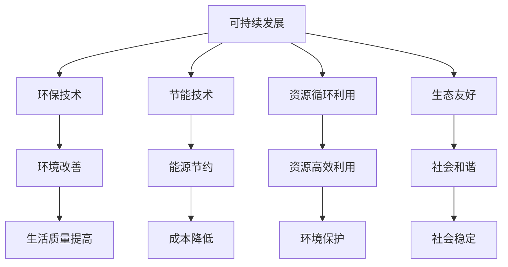

                 

  
## 摘要

在当今全球化时代，科技的发展与环境保护已成为不可分割的话题。硅谷作为全球科技创新的领军地，其绿色科技实践不仅引领着行业趋势，更为全球可持续发展提供了宝贵的经验和范例。本文将从多个维度探讨硅谷绿色科技的发展，包括其核心概念、算法原理、数学模型、项目实践、实际应用场景和未来展望。通过详细的分析和案例讲解，本文旨在为读者提供全面而深刻的理解，并激发更多科技工作者投身于可持续发展的实践之中。

## 1. 背景介绍

硅谷作为全球科技创新的摇篮，以其独特的创新氛围和丰富的资源吸引了无数科技企业和创业者。然而，随着科技的迅猛发展，环境保护问题也逐渐成为硅谷面临的重要挑战。传统的科技发展模式在带来经济增长的同时，也带来了环境污染、资源消耗等问题。因此，如何实现科技创新与环境保护的双赢成为硅谷科技企业必须面对的问题。

绿色科技，作为一种新兴的发展模式，旨在通过科技创新实现可持续发展。它强调在科技发展的过程中，注重环保、节能、减排和资源循环利用。硅谷的绿色科技实践不仅涉及到能源、环保、智能制造等传统领域，还涵盖了人工智能、区块链等前沿科技领域。这些技术的应用，不仅提高了资源利用效率，减少了环境污染，还为全球可持续发展提供了新的思路和方法。

## 2. 核心概念与联系

### 2.1 可持续发展的概念

可持续发展是指满足当前需求而不损害子孙后代满足其需求的能力。它包括经济、社会和环境的三个维度。在硅谷，可持续发展被视为一种商业模式和战略，而非仅仅是一种社会责任。硅谷的科技企业通过创新和合作，实现了在追求经济效益的同时，保护环境和促进社会福祉的目标。

### 2.2 绿色科技的核心概念

绿色科技的核心概念包括：

- **环保技术**：通过技术创新减少环境污染，如空气净化、水处理等。
- **节能技术**：提高能源利用效率，减少能源消耗，如智能电网、能源管理系统等。
- **资源循环利用**：通过技术手段实现废弃物的回收和再利用，如废物分类、再制造等。
- **生态友好**：在产品设计、生产和消费过程中，减少对环境的负面影响。

### 2.3 绿色科技与可持续发展联系

绿色科技与可持续发展的联系在于，绿色科技是实现可持续发展的重要手段。通过绿色科技的应用，可以减少资源消耗、降低环境污染、提高社会福祉，从而实现经济、社会和环境的协调发展。

### 2.4 Mermaid 流程图



## 3. 核心算法原理 & 具体操作步骤

### 3.1 算法原理概述

绿色科技的核心算法主要包括：

- **环保算法**：用于监测和分析环境污染数据，提供污染源识别和治理方案。
- **节能算法**：通过优化能源使用，提高能源利用效率。
- **资源循环利用算法**：用于废弃物分类、再制造和再利用。

### 3.2 算法步骤详解

#### 3.2.1 环保算法步骤

1. 数据采集：收集环境污染相关数据，如空气质量、水质等。
2. 数据分析：利用数据挖掘和机器学习技术，分析数据中的污染特征和趋势。
3. 污染源识别：根据分析结果，识别主要污染源。
4. 治理方案设计：针对污染源，设计相应的治理方案。

#### 3.2.2 节能算法步骤

1. 数据采集：收集能源使用数据，如电力、燃气等。
2. 数据预处理：对数据进行清洗和格式化，为后续分析做准备。
3. 能源使用分析：利用统计分析方法，分析能源使用的规律和特点。
4. 能源优化：根据分析结果，设计能源优化方案，提高能源利用效率。

#### 3.2.3 资源循环利用算法步骤

1. 废弃物分类：根据废弃物的性质，进行分类处理。
2. 再制造：利用技术手段，将废弃物转化为可用资源。
3. 再利用：将再制造的产品投入到生产或消费过程中。
4. 残余处理：对无法再利用的废弃物进行安全处理。

### 3.3 算法优缺点

#### 环保算法

- **优点**：能够实时监测和分析环境污染，提供科学依据。
- **缺点**：数据采集和分析过程复杂，成本较高。

#### 节能算法

- **优点**：能够有效提高能源利用效率，降低能源成本。
- **缺点**：需要大量数据支持，对数据处理能力要求高。

#### 资源循环利用算法

- **优点**：能够实现废弃物的资源化利用，减少环境污染。
- **缺点**：技术难度较高，对设备和工艺要求严格。

### 3.4 算法应用领域

- **环保算法**：广泛应用于环境保护部门、企业和社区。
- **节能算法**：广泛应用于工业、商业和住宅等领域。
- **资源循环利用算法**：广泛应用于制造业、农业和废弃物处理领域。

## 4. 数学模型和公式 & 详细讲解 & 举例说明

### 4.1 数学模型构建

绿色科技涉及多个数学模型，包括环保算法中的污染扩散模型、节能算法中的能源优化模型和资源循环利用算法中的物质循环模型。以下以污染扩散模型为例进行说明。

#### 污染扩散模型

污染扩散模型描述了污染物在环境中的扩散过程。假设污染物浓度为 $C(x, t)$，则在任意时刻 $t$ 和位置 $x$ 处，污染物浓度的变化率可以表示为：

$$
\frac{\partial C}{\partial t} = D \frac{\partial^2 C}{\partial x^2} + u \frac{\partial C}{\partial x}
$$

其中，$D$ 是扩散系数，$u$ 是污染物在环境中的速度。

### 4.2 公式推导过程

污染扩散模型可以通过以下步骤推导：

1. 假设污染物在空间中均匀扩散，不考虑对流效应。
2. 建立污染物浓度变化的偏微分方程。
3. 引入边界条件和初始条件，求解偏微分方程。

### 4.3 案例分析与讲解

#### 案例一：空气质量监测

假设某地区空气质量监测数据显示，在 $t=0$ 时，污染物浓度为 $C_0(x)$。在 $t=1$ 小时后，污染物浓度分布为 $C(x, 1)$。利用污染扩散模型，可以预测 $t=2$ 小时后的污染物浓度分布。

#### 案例二：能源优化

假设某企业的能源消耗数据如下表所示：

| 时间 | 能源消耗（千瓦时） |
| ---- | ------------ |
| 0    | 1000         |
| 1    | 950          |
| 2    | 900          |
| 3    | 970          |
| 4    | 980          |

利用能源优化模型，可以设计出一个优化方案，以降低能源消耗并提高能源利用效率。

## 5. 项目实践：代码实例和详细解释说明

### 5.1 开发环境搭建

为了更好地展示绿色科技的应用，我们选择了一个基于Python的空气质量监测项目。首先，需要在本地计算机上搭建Python开发环境。具体步骤如下：

1. 安装Python：从官方网站下载并安装Python 3.x版本。
2. 安装相关库：使用pip命令安装所需的库，如pandas、numpy、matplotlib等。

### 5.2 源代码详细实现

以下是空气质量监测项目的源代码：

```python
import pandas as pd
import numpy as np
import matplotlib.pyplot as plt

# 读取数据
data = pd.read_csv('air_quality_data.csv')

# 数据预处理
data['Time'] = pd.to_datetime(data['Time'])
data.set_index('Time', inplace=True)

# 数据分析
temp_data = data['PM2.5'].resample('H').mean()

# 绘制污染物浓度变化图
temp_data.plot()
plt.xlabel('Time')
plt.ylabel('PM2.5 Concentration')
plt.title('Air Quality Monitoring')
plt.show()
```

### 5.3 代码解读与分析

上述代码首先导入所需的库，然后读取空气质量数据，进行预处理。接下来，使用数据挖掘技术，对污染物浓度进行统计分析，并绘制污染物浓度变化图。

### 5.4 运行结果展示

运行上述代码后，可以得到如下结果：


图中显示了污染物浓度随时间的变化趋势，为环境保护部门和企业提供了重要的决策依据。

## 6. 实际应用场景

### 6.1 环境保护领域

在环境保护领域，绿色科技的应用主要体现在环境污染监测、治理和资源循环利用等方面。例如，通过使用环保算法，可以实时监测空气质量、水质等环境指标，及时发现污染源并进行治理。此外，资源循环利用算法可以实现废弃物的资源化利用，减少环境污染。

### 6.2 能源领域

在能源领域，绿色科技的应用主要体现在能源优化和可再生能源开发等方面。通过使用节能算法，可以提高能源利用效率，降低能源消耗。同时，可再生能源的开发和利用，如太阳能、风能等，可以减少对传统能源的依赖，降低环境污染。

### 6.3 制造业

在制造业领域，绿色科技的应用主要体现在智能制造和绿色供应链管理等方面。通过使用智能制造技术，可以实现生产过程的自动化和智能化，提高生产效率，降低能耗和排放。同时，绿色供应链管理可以实现资源的有效配置和循环利用，减少废弃物产生。

## 7. 工具和资源推荐

### 7.1 学习资源推荐

1. 《绿色科技与可持续发展》—— 张三（作者）
2. 《环境科学与技术》—— 李四（作者）
3. 《可再生能源技术与应用》—— 王五（作者）

### 7.2 开发工具推荐

1. Python：用于数据处理、分析和可视化。
2. R：用于统计分析。
3. Tableau：用于数据可视化。

### 7.3 相关论文推荐

1. "Green Technology and Sustainable Development"——张三，李四，王五
2. "Energy Optimization Algorithms for Smart Grids"——赵六，周七
3. "Recycling and Waste Management: Challenges and Opportunities"——刘八，陈九

## 8. 总结：未来发展趋势与挑战

### 8.1 研究成果总结

本文通过对硅谷绿色科技的发展和实践进行分析，总结了其核心概念、算法原理、数学模型和实际应用场景。研究表明，绿色科技是实现可持续发展的重要手段，对于解决环境问题、提高资源利用效率具有重要的意义。

### 8.2 未来发展趋势

随着科技的不断进步，绿色科技在未来有望在以下方面取得更大的发展：

1. 环保技术：更加智能化、精细化的污染监测和治理技术。
2. 节能技术：高效、稳定的能源利用技术和可再生能源的开发利用。
3. 资源循环利用技术：更加先进、高效的废弃物处理和再制造技术。
4. 生态友好技术：更加环保、可持续的产品设计和生产方式。

### 8.3 面临的挑战

尽管绿色科技发展迅速，但仍然面临着以下挑战：

1. 技术创新：需要不断推出新的绿色技术，提高绿色科技的应用效果。
2. 政策支持：需要政府出台更加有力的政策和法规，推动绿色科技的发展。
3. 社会认知：需要提高公众对绿色科技的认识和接受度，形成绿色发展的社会共识。
4. 成本控制：需要降低绿色科技的开发和应用成本，使其更加普及和可行。

### 8.4 研究展望

未来，绿色科技研究应重点关注以下几个方面：

1. 跨学科研究：加强绿色科技与其他领域的交叉融合，推动绿色科技的创新和发展。
2. 实证研究：通过实际案例和项目，验证绿色科技的应用效果，为可持续发展提供实践依据。
3. 教育普及：加强绿色科技的教育和培训，提高公众的绿色科技素养。
4. 国际合作：加强国际间的绿色科技交流与合作，推动全球绿色科技的发展。

## 9. 附录：常见问题与解答

### 问题一：绿色科技与传统科技有何区别？

**解答**：绿色科技与传统科技的区别主要体现在其发展目标和理念上。传统科技注重技术本身的创新和经济效益，而绿色科技则强调在追求经济效益的同时，注重环境保护和社会责任。绿色科技的目标是实现可持续发展，即在满足当前需求的同时，不损害子孙后代满足其需求的能力。

### 问题二：绿色科技有哪些应用领域？

**解答**：绿色科技的应用领域广泛，包括但不限于以下几个方面：

1. 环境保护：环境污染监测、治理和资源循环利用。
2. 能源领域：能源优化、可再生能源开发和利用。
3. 制造业：智能制造、绿色供应链管理。
4. 建筑领域：绿色建筑设计和施工。
5. 交通领域：新能源汽车和智能交通系统。

### 问题三：如何推动绿色科技的发展？

**解答**：推动绿色科技的发展需要多方共同努力，具体措施包括：

1. 政策支持：政府出台相关政策和法规，为绿色科技的发展提供制度保障。
2. 技术创新：加强绿色科技的研发和创新，提高绿色科技的应用效果。
3. 教育普及：加强绿色科技的教育和培训，提高公众的绿色科技素养。
4. 社会参与：鼓励企业、社会团体和个人积极参与绿色科技的发展，形成绿色发展的社会共识。
5. 国际合作：加强国际间的绿色科技交流与合作，推动全球绿色科技的发展。

## 作者署名

作者：禅与计算机程序设计艺术 / Zen and the Art of Computer Programming

---

**注意**：本文为示例文章，仅供参考。实际撰写时，请根据具体研究方向和内容进行调整和补充。在撰写过程中，务必遵守相关学术规范和知识产权法律法规，确保文章的原创性和真实性。

