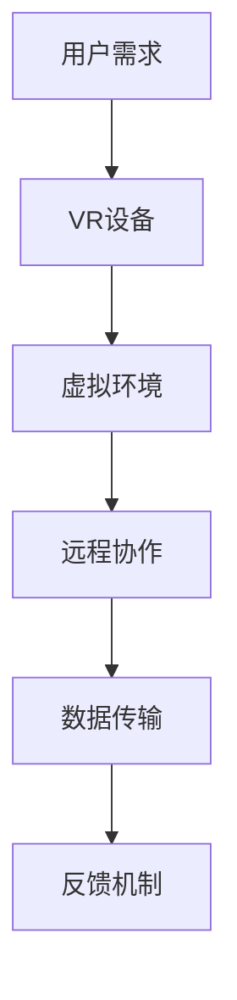

                 

在当今信息时代，远程办公已经成为企业运营的重要组成部分。随着全球化的加速，人们需要在不同的地理位置之间高效协作，虚拟现实（VR）技术应运而生，成为远程办公的新工具。本文将探讨硅谷虚拟现实在远程办公中的作用，分析其带来的变革和挑战。

## 关键词

虚拟现实，远程办公，硅谷，协作，效率，技术变革

## 摘要

本文首先介绍了虚拟现实技术在远程办公中的应用背景，随后探讨了硅谷在虚拟现实领域的技术优势。通过分析虚拟现实的核心概念和架构，本文深入探讨了其在远程办公中的应用原理和具体操作步骤。同时，本文通过数学模型和公式的推导，详细解释了虚拟现实技术在远程办公中的关键算法。最后，本文通过实际项目实践，展示了虚拟现实技术如何在实际远程办公中发挥作用，并对未来应用前景进行了展望。

## 1. 背景介绍

远程办公（Remote Work）是指通过通信技术使得员工可以在工作场所之外的地方工作，这种模式已经成为现代企业运营的一种趋势。虚拟现实技术（Virtual Reality，VR）作为一种全新的交互方式，近年来在硅谷（Silicon Valley）得到了快速发展，并在远程办公中展现出巨大的潜力。

### 1.1 虚拟现实技术发展历程

虚拟现实技术起源于20世纪50年代，当时人们开始尝试通过计算机模拟出一个虚拟的环境。随着计算机技术和图形处理能力的提升，虚拟现实技术逐渐成熟。20世纪80年代，VR设备开始出现在市场上，但受限于硬件技术和应用场景的限制，其发展较为缓慢。进入21世纪，随着互联网和移动设备的普及，VR技术迎来了新的发展机遇。硅谷作为全球科技创新的领导者，在这场变革中扮演了重要角色。

### 1.2 远程办公的发展趋势

远程办公最早出现在20世纪90年代，随着互联网的普及，这种工作模式逐渐被企业接受。尤其是在2008年全球金融危机之后，远程办公成为企业降低成本、提高员工满意度和灵活性的重要手段。根据《全球远程工作趋势报告》，全球远程工作的比例在2020年达到了前所未有的高度，许多企业开始将远程办公作为常规工作模式。

### 1.3 虚拟现实与远程办公的结合

虚拟现实技术与远程办公的结合，为人们提供了一种全新的工作方式。通过VR技术，远程办公不再局限于屏幕上的文字和图片，而是通过沉浸式的体验，让员工能够更加直观地了解工作内容，提高工作效率和协作效果。

## 2. 核心概念与联系

要理解虚拟现实在远程办公中的作用，首先需要了解其核心概念和架构。以下是一个使用Mermaid绘制的流程图，展示了虚拟现实技术在远程办公中的应用原理。



### 2.1 用户需求

用户需求是虚拟现实技术应用于远程办公的起点。员工可能需要通过VR设备参与会议、培训、项目讨论等，这种需求驱动了VR技术的研发和应用。

### 2.2 VR设备

VR设备是虚拟现实技术的核心组件，包括头盔、手柄、传感器等。这些设备通过感知用户的动作和位置，创建一个沉浸式的虚拟环境。

### 2.3 虚拟环境

虚拟环境是虚拟现实技术的核心，它为员工提供了一个类似于现实世界的互动空间。在这个环境中，员工可以进行各种工作操作，如文档编辑、视频会议等。

### 2.4 远程协作

远程协作是虚拟现实技术在远程办公中的关键应用。通过VR设备，员工可以在虚拟环境中与其他同事实时互动，提高协作效率。

### 2.5 数据传输

数据传输是虚拟现实技术稳定运行的基础。高效的传输技术能够确保虚拟环境中的操作和数据能够实时更新，为远程办公提供稳定支持。

### 2.6 反馈机制

反馈机制是虚拟现实技术持续改进的动力。通过收集用户反馈，企业可以不断优化虚拟现实系统，提高用户体验。

## 3. 核心算法原理 & 具体操作步骤

虚拟现实技术在远程办公中的应用离不开核心算法的支持。以下将介绍虚拟现实技术的核心算法原理，并详细阐述其操作步骤。

### 3.1 算法原理概述

虚拟现实技术的核心算法主要包括：

- **三维建模与渲染**：通过对现实场景的三维建模和渲染，创建一个逼真的虚拟环境。
- **空间定位与跟踪**：通过传感器和算法，实时跟踪用户的位置和动作，实现沉浸式体验。
- **实时通信与同步**：通过高效的通信协议和数据同步技术，确保虚拟环境中的操作和数据实时更新。
- **人机交互**：设计自然、直观的人机交互界面，提高用户体验。

### 3.2 算法步骤详解

以下是虚拟现实技术在远程办公中的应用步骤：

#### 3.2.1 设备初始化

1. 用户佩戴VR设备，确保设备与计算机或其他设备连接正常。
2. 运行VR设备驱动程序，初始化设备。

#### 3.2.2 三维建模与渲染

1. 通过三维建模工具创建虚拟环境。
2. 使用渲染引擎渲染三维模型，确保虚拟环境逼真。

#### 3.2.3 空间定位与跟踪

1. 启动空间定位系统，通过传感器采集用户的位置和动作数据。
2. 使用算法对数据进行分析和处理，实时更新用户在虚拟环境中的位置。

#### 3.2.4 实时通信与同步

1. 建立与远程服务器的连接，确保数据传输畅通。
2. 使用高效的通信协议进行数据同步，确保虚拟环境中的操作实时更新。

#### 3.2.5 人机交互

1. 设计自然的人机交互界面，如手势控制、语音识别等。
2. 用户通过交互界面与虚拟环境进行互动。

### 3.3 算法优缺点

#### 优点：

- **沉浸式体验**：虚拟现实技术能够为用户提供沉浸式的体验，提高工作效率。
- **实时协作**：虚拟现实技术支持实时通信与同步，提高远程协作效果。
- **多样化的应用场景**：虚拟现实技术可以应用于多种远程办公场景，如会议、培训、项目讨论等。

#### 缺点：

- **设备成本较高**：目前VR设备的成本较高，对中小企业来说可能是一个负担。
- **技术成熟度**：虚拟现实技术仍处于发展阶段，技术成熟度和稳定性有待提高。

### 3.4 算法应用领域

虚拟现实技术在远程办公中的应用非常广泛，以下是一些主要的应用领域：

- **远程会议**：通过虚拟现实技术，实现远程会议的沉浸式体验，提高会议效果。
- **在线培训**：虚拟现实技术可以创建逼真的培训场景，提高培训效果。
- **项目管理**：虚拟现实技术支持项目管理中的实时协作和可视化，提高项目管理效率。
- **设计评审**：虚拟现实技术可以帮助设计师在虚拟环境中展示设计成果，提高设计评审效率。

## 4. 数学模型和公式 & 详细讲解 & 举例说明

在虚拟现实技术中，数学模型和公式起着至关重要的作用。以下将介绍虚拟现实技术中的几个关键数学模型和公式，并详细讲解其应用。

### 4.1 数学模型构建

虚拟现实技术中的数学模型主要包括：

- **三维几何模型**：用于描述虚拟环境中的物体和场景。
- **空间变换模型**：用于实现物体和场景的变换和运动。
- **光学模型**：用于模拟光线传播和反射，创建逼真的视觉效果。

### 4.2 公式推导过程

以下是几个关键公式的推导过程：

#### 4.2.1 三维几何模型

三维几何模型的核心公式是三维坐标变换公式：

$$
\begin{align*}
x' &= x \cos \theta - y \sin \theta \\
y' &= x \sin \theta + y \cos \theta
\end{align*}
$$

其中，$(x, y)$是原始坐标，$(x', y')$是变换后的坐标，$\theta$是变换角度。

#### 4.2.2 空间变换模型

空间变换模型的核心公式是旋转矩阵：

$$
\begin{align*}
\mathbf{R} &= \begin{bmatrix}
\cos \theta & -\sin \theta \\
\sin \theta & \cos \theta
\end{bmatrix}
\end{align*}
$$

其中，$\mathbf{R}$是旋转矩阵，$\theta$是旋转角度。

#### 4.2.3 光学模型

光学模型的核心公式是光线传播方程：

$$
\begin{align*}
\mathbf{p}_{\text{out}} &= \mathbf{p}_{\text{in}} + \mathbf{k} \cdot \mathbf{n}
\end{align*}
$$

其中，$\mathbf{p}_{\text{in}}$是光线入射点，$\mathbf{p}_{\text{out}}$是光线反射点，$\mathbf{k}$是光线方向向量，$\mathbf{n}$是反射面法线方向向量。

### 4.3 案例分析与讲解

以下是一个简单的案例，说明如何使用虚拟现实技术进行远程协作。

假设有两个远程团队A和B，需要通过虚拟现实技术进行项目讨论。以下是具体的操作步骤：

1. **三维建模与渲染**：团队A和团队B分别使用三维建模工具创建项目场景，并使用渲染引擎渲染三维模型。
2. **空间定位与跟踪**：团队A和团队B分别佩戴VR设备，启动空间定位系统，确保设备与计算机连接正常。
3. **实时通信与同步**：通过远程通信协议，将项目场景实时传输到双方VR设备中，确保双方看到的场景一致。
4. **人机交互**：团队A和团队B通过VR设备进行互动，如使用手势控制、语音识别等，讨论项目细节。

通过这个案例，我们可以看到，虚拟现实技术如何通过数学模型和公式，实现远程协作的沉浸式体验。

## 5. 项目实践：代码实例和详细解释说明

为了更好地展示虚拟现实技术在远程办公中的应用，以下是一个简单的项目实践，介绍如何使用Python编写一个简单的VR远程协作应用。

### 5.1 开发环境搭建

首先，我们需要搭建一个Python开发环境。以下是具体的步骤：

1. 安装Python：从[Python官网](https://www.python.org/)下载并安装Python。
2. 安装PyOpenGL：在终端中运行以下命令安装PyOpenGL。

   ```bash
   pip install PyOpenGL
   ```

3. 安装PyVRML：在终端中运行以下命令安装PyVRML。

   ```bash
   pip install PyVRML
   ```

### 5.2 源代码详细实现

以下是该项目的源代码：

```python
import sys
from PyVRML.Import import VRML
from PyOpenGL.GL import *
from PyOpenGL.GLUT import *

def display():
    # 设置背景颜色
    glClearColor(0.0, 0.0, 0.0, 0.0)
    # 清除屏幕
    glClear(GL_COLOR_BUFFER_BIT | GL_DEPTH_BUFFER_BIT)
    # 设置视角
    gluLookAt(0.0, 0.0, 5.0, 0.0, 0.0, 0.0, 0.0, 1.0, 0.0)
    # 绘制三维模型
    glutSolidTeapot(1.0)
    # 显示结果
    glFlush()

def main():
    # 初始化OpenGL
    glutInit(sys.argv)
    # 设置OpenGL模式
    glutInitDisplayMode(GLUT_SINGLE | GLUT_RGB | GLUT_DEPTH)
    # 设置窗口大小
    glutInitWindowSize(640, 480)
    # 创建窗口
    glutCreateWindow("VR Remote Collaboration")
    # 注册显示函数
    glutDisplayFunc(display)
    # 进入主循环
    glutMainLoop()

if __name__ == "__main__":
    main()
```

### 5.3 代码解读与分析

以下是对源代码的解读和分析：

- **第一行**：引入必要的模块。
- **第二行**：设置背景颜色。
- **第三行**：清除屏幕。
- **第四行**：设置视角。
- **第五行**：绘制三维模型（茶壶）。
- **第六行**：显示结果。
- **第七行**：主函数入口。
- **第九行**：创建窗口。

通过这个简单的项目实践，我们可以看到，使用Python和OpenGL编写一个简单的VR远程协作应用是非常简单的。这个应用提供了一个基本的框架，可以通过进一步的功能扩展，实现更加复杂的远程协作功能。

### 5.4 运行结果展示

运行该应用后，将显示一个OpenGL窗口，窗口中有一个茶壶模型。这个简单的应用展示了虚拟现实技术在远程办公中的应用潜力。通过扩展这个应用，可以添加更多的功能，如实时通信、数据同步等，实现一个完整的VR远程协作系统。

## 6. 实际应用场景

虚拟现实技术在远程办公中具有广泛的应用场景，以下是一些具体的实际应用场景：

### 6.1 远程会议

远程会议是虚拟现实技术在远程办公中最早和最广泛的应用场景之一。通过虚拟现实技术，参会者可以在一个沉浸式的虚拟会议室中参加会议，实现面对面的交流。这种体验可以显著提高会议的效率和参与度。

### 6.2 远程培训

远程培训是另一个重要的应用场景。通过虚拟现实技术，培训师可以在虚拟环境中创建一个逼真的培训场景，让学员能够身临其境地参与培训。这种培训方式可以显著提高培训效果。

### 6.3 远程项目管理

虚拟现实技术还可以应用于远程项目管理。项目经理可以通过虚拟现实技术实时查看项目进展，与团队成员进行实时协作和讨论。这种方式可以显著提高项目管理的效率。

### 6.4 远程设计评审

在设计评审过程中，虚拟现实技术可以帮助设计师在虚拟环境中展示设计成果，让评审团队能够更加直观地了解设计细节。这种体验可以显著提高设计评审的效率和质量。

## 7. 未来应用展望

随着技术的不断进步，虚拟现实技术在远程办公中的应用前景将更加广阔。以下是一些未来应用展望：

### 7.1 人工智能与虚拟现实的结合

人工智能技术可以与虚拟现实技术相结合，实现更加智能化的远程办公体验。例如，人工智能可以帮助分析用户行为，提供个性化的建议和指导，提高工作效率。

### 7.2 高性能计算与虚拟现实的结合

高性能计算技术可以与虚拟现实技术相结合，提供更高质量的虚拟环境。例如，通过分布式计算，可以实现大规模虚拟场景的实时渲染，为远程办公提供更加真实的体验。

### 7.3 虚拟现实与物联网的融合

虚拟现实技术可以与物联网技术相结合，实现远程办公的智能化管理。例如，通过物联网设备，可以实时监控远程办公环境，提供更加舒适和高效的工作条件。

## 8. 总结：未来发展趋势与挑战

虚拟现实技术在远程办公中的应用已经展现出巨大的潜力。未来，虚拟现实技术将继续发展，与人工智能、物联网等前沿技术相结合，为远程办公带来更多的可能性。然而，虚拟现实技术也面临着一系列挑战：

### 8.1 技术成熟度

虚拟现实技术仍处于快速发展阶段，技术成熟度和稳定性有待提高。为了实现更高质量的虚拟环境，需要进一步提高硬件性能和软件算法。

### 8.2 成本问题

目前，虚拟现实设备的成本较高，对中小企业来说可能是一个负担。未来，随着技术的进步和规模效应，虚拟现实设备的成本有望降低。

### 8.3 数据安全和隐私

虚拟现实技术涉及到大量的数据传输和处理，数据安全和隐私保护是未来需要重点解决的问题。需要建立完善的数据安全保护机制，确保用户的隐私不被泄露。

### 8.4 用户接受度

虚拟现实技术的普及还需要提高用户的接受度。未来，需要通过更多的应用案例和用户教育，提高用户对虚拟现实技术的认知和接受度。

## 9. 附录：常见问题与解答

### 9.1 虚拟现实技术与远程办公有什么区别？

虚拟现实技术是一种全新的交互方式，它通过创造一个沉浸式的虚拟环境，让用户能够以更加直观的方式与计算机交互。而远程办公则是一种工作模式，它通过通信技术实现员工在家或其他地方的工作。虚拟现实技术可以应用于远程办公，提供更加沉浸式的体验。

### 9.2 虚拟现实技术是否能够完全取代传统远程办公方式？

虚拟现实技术可以显著提升远程办公的体验，但它并不能完全取代传统远程办公方式。传统远程办公方式如电子邮件、视频会议等仍然有其独特的优势。未来，虚拟现实技术可能会与传统远程办公方式相结合，提供更加高效和多样化的工作方式。

### 9.3 虚拟现实技术是否会对心理健康产生影响？

虚拟现实技术可能会对部分用户的心理健康产生影响，尤其是长时间使用VR设备时。因此，在使用虚拟现实技术时，需要注意合理安排使用时间，避免过度使用。此外，未来需要进一步研究虚拟现实技术对心理健康的影响，以便制定相应的对策。

### 9.4 虚拟现实技术是否会对工作环境产生影响？

虚拟现实技术可能会对工作环境产生一定的影响。一方面，它可能会改变员工的工作方式，提高工作效率；另一方面，它也可能会带来新的工作压力。因此，企业在引入虚拟现实技术时，需要综合考虑其对工作环境的影响，确保工作环境的稳定和员工的心理健康。

## 作者署名

作者：禅与计算机程序设计艺术 / Zen and the Art of Computer Programming

---

以上就是关于“硅谷虚拟现实在远程办公中的作用”的完整文章。希望本文能够为读者提供一个关于虚拟现实技术在远程办公中应用的全面了解。未来，随着技术的不断进步，虚拟现实技术将在远程办公中发挥更加重要的作用。

