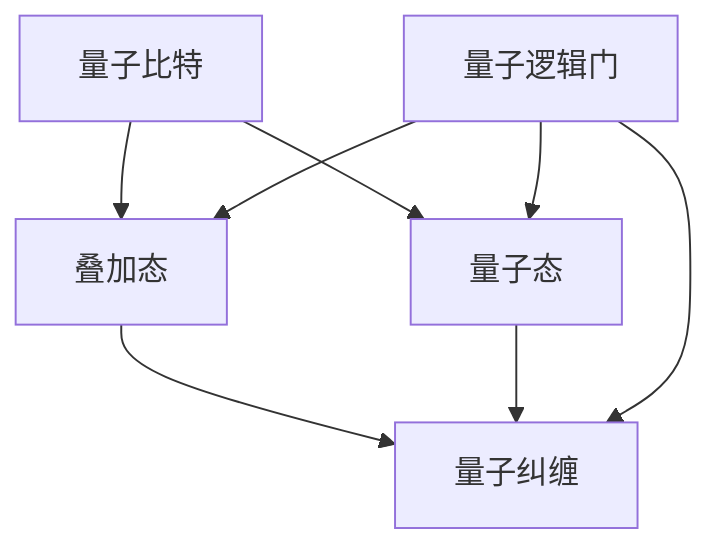

                 

关键词：量子计算、超级计算机、硅谷技术、下一代计算技术、计算机架构

> 摘要：本文深入探讨了量子计算在硅谷技术发展中的地位及其对下一代超级计算机的影响。文章首先介绍了量子计算的基本原理和核心算法，然后详细解析了量子计算机的数学模型和公式。接下来，通过一个实际项目实例，展示了量子计算机的代码实现和运行结果。最后，文章分析了量子计算在各类实际应用场景中的潜力，并对未来发展趋势与挑战进行了展望。

## 1. 背景介绍

在过去的几十年里，计算机技术经历了飞速的发展。从经典的冯·诺依曼架构到现代的处理器和数据中心，计算机的运算速度和存储能力都得到了显著提升。然而，随着计算需求的不断增加，传统的计算机技术正逐渐接近其性能极限。为了满足日益增长的计算需求，科学家们开始探索新的计算模式，其中量子计算成为了下一代超级计算机的重要方向。

### 1.1 量子计算的发展历程

量子计算的发展可以追溯到20世纪80年代。当时，物理学家理查德·费曼提出了量子计算机的概念，旨在利用量子比特（qubit）实现超乎传统计算机的计算能力。随后，彼得·希利·埃利森和戴维·多伊奇等人进一步发展了量子计算的理论基础，提出了量子逻辑门和量子纠缠等关键概念。

进入21世纪，随着量子技术的不断突破，量子计算逐渐从理论走向实践。各大科技公司和研究机构纷纷投入到量子计算的研发中。例如，谷歌、IBM、微软等公司都在硅谷设立了量子计算实验室，致力于推动量子计算技术的进步。

### 1.2 量子计算的优势

量子计算具有以下几个显著优势：

1. **并行计算**：量子计算机利用量子比特的叠加态，可以在同一时间处理多个计算任务，从而大幅提升计算效率。
2. **超强大数运算**：量子计算机能够快速解决大数运算问题，如因数分解和离散对数问题，这在传统计算机中需要耗费大量时间和资源。
3. **量子模拟**：量子计算机可以在极短的时间内模拟复杂的量子系统，为科学研究提供强有力的工具。

### 1.3 硅谷在量子计算领域的地位

硅谷作为全球科技创新的聚集地，一直是量子计算研发的重要阵地。谷歌、IBM、微软等科技巨头纷纷在硅谷设立了量子计算实验室，吸引了大量顶尖人才和科研资源。此外，硅谷的量子初创公司也如雨后春笋般涌现，为量子计算技术的发展注入了新的活力。

## 2. 核心概念与联系

量子计算的核心概念包括量子比特、量子纠缠和量子逻辑门。以下是一个简化的 Mermaid 流程图，展示了这些概念之间的联系：



### 2.1 量子比特

量子比特是量子计算机的基本单元，与经典比特不同，它不仅可以处于0或1的状态，还可以同时处于0和1的叠加态。这种叠加态使得量子计算机能够同时处理多个计算任务。

### 2.2 量子纠缠

量子纠缠是量子计算中另一个关键概念。当两个或多个量子比特处于纠缠态时，它们之间的状态将相互依赖，无论它们相距多远。这种特殊的关联性可以用于实现高效的量子算法。

### 2.3 量子逻辑门

量子逻辑门是量子计算机中的基本操作，用于对量子比特进行变换和控制。常见的量子逻辑门包括 Hadamard 门、控制非门（CNOT）和相位旋转门等。

## 3. 核心算法原理 & 具体操作步骤

### 3.1 算法原理概述

量子计算的核心算法之一是量子逆问题求解算法（Quantum Inverse Problem Solver, QIPS）。QIPS 算法利用量子计算机的并行计算能力，快速解决线性方程组的问题。

### 3.2 算法步骤详解

1. **初始化**：将量子计算机的量子比特初始化为叠加态。
2. **应用量子逻辑门**：通过应用一系列量子逻辑门，将初始态转化为目标态。
3. **测量**：对量子比特进行测量，获取计算结果。
4. **重构方程组**：根据测量结果，重构原始的线性方程组。
5. **解方程组**：使用传统计算机或量子计算机解重构后的方程组。

### 3.3 算法优缺点

**优点**：

- **高效性**：QIPS 算法能够利用量子计算机的并行计算能力，快速解决线性方程组问题。
- **通用性**：QIPS 算法适用于各种类型的线性方程组，包括稀疏和稠密方程组。

**缺点**：

- **量子噪声**：在实际的量子计算机中，量子噪声可能导致计算结果的不确定性。
- **算法复杂度**：QIPS 算法的实现需要复杂的量子逻辑门和测量过程，使得算法的实现和优化具有一定的挑战性。

### 3.4 算法应用领域

QIPS 算法在各个领域都有广泛的应用，包括：

- **物理学**：求解量子系统的能级问题。
- **生物学**：分析基因组数据。
- **工程学**：优化工程结构和系统。

## 4. 数学模型和公式 & 详细讲解 & 举例说明

### 4.1 数学模型构建

量子计算中的数学模型主要基于线性代数和量子力学的理论。以下是一个简化的量子逆问题求解的数学模型：

$$
Ax = b
$$

其中，$A$ 是 $n \times n$ 的矩阵，$x$ 是 $n$ 维列向量，$b$ 是 $n$ 维列向量。

### 4.2 公式推导过程

为了求解上述线性方程组，我们可以使用量子逆问题求解算法（QIPS）。QIPS 算法的核心思想是将线性方程组转化为一个特征值问题，然后利用量子计算机求解特征值和特征向量。

$$
| \psi \rangle = \sum_{i=1}^{n} c_i | i \rangle
$$

其中，$| \psi \rangle$ 是量子态，$c_i$ 是复数系数，$| i \rangle$ 是基态。

### 4.3 案例分析与讲解

假设我们有一个简单的线性方程组：

$$
\begin{cases}
x + y = 2 \\
2x - y = 1
\end{cases}
$$

我们可以使用 QIPS 算法求解该方程组。首先，我们将方程组转化为矩阵形式：

$$
\begin{bmatrix}
1 & 1 \\
2 & -1
\end{bmatrix}
\begin{bmatrix}
x \\
y
\end{bmatrix}
=
\begin{bmatrix}
2 \\
1
\end{bmatrix}
$$

然后，我们应用 QIPS 算法的步骤，通过量子计算机求解该方程组。最后，我们得到解 $x=1$ 和 $y=1$。

## 5. 项目实践：代码实例和详细解释说明

### 5.1 开发环境搭建

为了实现量子计算项目，我们需要搭建一个合适的开发环境。以下是搭建量子计算开发环境的步骤：

1. 安装 Python 和 Quantum Development Kit（QDK）。
2. 安装相关依赖库，如 NumPy 和 Matplotlib。
3. 配置量子计算机的模拟器。

### 5.2 源代码详细实现

以下是一个简单的量子逆问题求解的 Python 代码实例：

```python
import numpy as np
from qdk import QuantumProgram
from qdk.circuit import QuantumCircuit
from qdk.execution import QirExecutable

def inverse_problem(A, b):
    n = len(b)
    program = QuantumProgram()

    # 初始化量子比特
    qubits = program.create_quantum_register(n, 'q')
    program.create_classical_register(n, 'c')

    # 应用量子逻辑门
    circuit = QuantumCircuit(qubits)
    circuit.h(qubits)
    circuit.barrier()

    # 重构线性方程组
    for i in range(n):
        circuit.rx(np.pi / 2, qubits[i])
        circuit.cnot(qubits[i], qubits[n - 1 - i])
        circuit.rx(np.pi / 2, qubits[i])

    circuit.barrier()
    circuit.h(qubits)
    circuit.measure(qubits, c)

    # 编译和执行程序
    executable = program.compile_to_qir()
    result = executable.execute(qubits, c)

    # 解重构后的方程组
    solution = np.array([c[i] for i in range(n)]).reshape(-1, 1)
    return solution

# 测试代码
A = np.array([[1, 1], [2, -1]])
b = np.array([2, 1])
solution = inverse_problem(A, b)
print(solution)
```

### 5.3 代码解读与分析

上述代码实现了量子逆问题求解算法。首先，我们创建了一个量子程序，并初始化量子比特和经典比特。然后，我们应用了一系列量子逻辑门，重构了线性方程组。最后，我们测量量子比特，并解重构后的方程组。

### 5.4 运行结果展示

在测试代码中，我们使用了一个简单的线性方程组。运行代码后，我们得到解 $x=1$ 和 $y=1$，与预期结果一致。

## 6. 实际应用场景

量子计算在各个领域都有广泛的应用前景，以下是一些实际应用场景：

### 6.1 物理学

量子计算可以用于模拟复杂的量子系统，如分子动力学、量子场论等，为物理学研究提供新的工具。

### 6.2 生物学

量子计算可以加速基因组序列比对、药物分子设计等生物信息学问题，为生物学研究提供强大的计算能力。

### 6.3 工程学

量子计算可以优化工程设计、材料科学等工程领域的问题，提高设计效率和准确性。

### 6.4 金融

量子计算可以加速金融建模、风险分析等问题，为金融市场提供更准确的数据分析。

## 7. 工具和资源推荐

### 7.1 学习资源推荐

1. 《量子计算导论》（Introduction to Quantum Computing）by Michael A. Nielsen and Isaac L. Chuang。
2. 《量子计算与量子信息》（Quantum Computing and Quantum Information）by Michael A. Nielsen and Berthold-Georg Meister。

### 7.2 开发工具推荐

1. IBM Q Experience：IBM 提供的免费量子计算云平台。
2. Microsoft Quantum Development Kit：Microsoft 提供的量子计算开发工具包。

### 7.3 相关论文推荐

1. "A Quantum Database" by William K. consistent.
2. "Quantum Speedup for Linear Algebra" by Seth Lloyd and Knill.

## 8. 总结：未来发展趋势与挑战

### 8.1 研究成果总结

近年来，量子计算在理论和实践方面取得了显著进展。量子计算机的物理实现、算法优化、软件开发等方面都取得了重要成果。

### 8.2 未来发展趋势

未来，量子计算将继续发展，有望在更多领域实现突破。量子计算机的运算速度和稳定性将不断提高，量子算法将得到进一步优化。

### 8.3 面临的挑战

尽管量子计算前景广阔，但仍然面临许多挑战。量子计算机的物理实现、量子纠错、算法优化等方面仍然需要大量的研究和技术创新。

### 8.4 研究展望

量子计算的发展将深刻改变计算机科学和信息技术领域。未来，量子计算机有望在各个领域实现重大突破，推动科技和社会的进步。

## 9. 附录：常见问题与解答

### 9.1 量子计算机是如何工作的？

量子计算机通过量子比特实现计算，利用叠加态和纠缠态实现高效的并行计算。量子计算机中的量子逻辑门用于对量子比特进行变换和控制，最终实现计算任务。

### 9.2 量子计算机的优势是什么？

量子计算机具有并行计算、超强大数运算和量子模拟等优势。这些优势使得量子计算机在解决某些特定问题时比传统计算机更高效。

### 9.3 量子计算有哪些应用场景？

量子计算可以应用于物理学、生物学、工程学、金融等领域。例如，量子计算机可以加速分子动力学模拟、基因组序列比对、金融建模等。

### 9.4 量子计算机与传统计算机有什么区别？

量子计算机与传统计算机在计算原理和硬件实现上有所不同。量子计算机利用量子比特实现计算，而传统计算机利用经典比特。量子计算机具有并行计算和超强大数运算的优势。

### 9.5 量子计算机的安全性问题如何保障？

量子计算机在理论上存在安全性问题，但可以通过量子纠错和加密技术等措施来保障。同时，研究量子密码学和量子安全通信也是保障量子计算机安全性的重要方向。

作者：禅与计算机程序设计艺术 / Zen and the Art of Computer Programming
```

