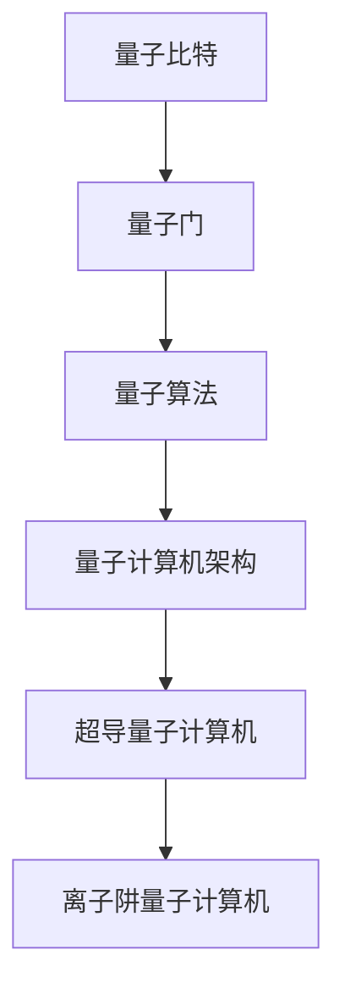
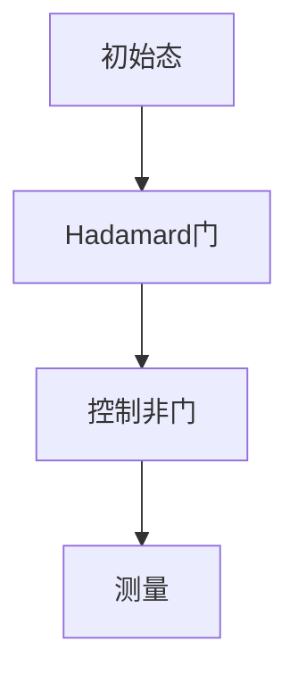

                 

关键词：量子计算机、硅谷、未来、发展方向、技术、人工智能

> 摘要：本文将探讨硅谷量子计算机的未来发展方向，分析其在人工智能、大数据处理、量子加密等领域的应用潜力，探讨量子计算机的技术挑战与未来展望。

## 1. 背景介绍

近年来，量子计算机的研究在全球范围内得到了广泛关注。硅谷作为全球科技创新的先锋，自然在量子计算机领域扮演着重要角色。从谷歌到IBM，再到众多初创公司，硅谷的科技巨头和初创企业纷纷投入大量资源，致力于量子计算机的研究和开发。

量子计算机与传统计算机的不同之处在于，它利用量子比特（qubit）进行计算，而不是传统计算机中的二进制位。量子比特可以同时处于多个状态，这使得量子计算机在处理某些类型的问题时具有显著的优势。例如，在因数分解、搜索算法、模拟量子系统等方面，量子计算机有望实现指数级别的加速。

## 2. 核心概念与联系

### 2.1 量子比特

量子比特是量子计算机的基本单元，它可以用一个复杂的数学函数来描述。这个函数包含了量子比特的所有可能状态，并且这些状态可以相互干涉。干涉是量子计算机区别于传统计算机的关键特性之一。

### 2.2 量子门

量子门是量子计算机中的基本操作，类似于传统计算机中的逻辑门。量子门可以对量子比特进行操作，包括旋转、反转、交换等。

### 2.3 量子算法

量子算法是利用量子计算机的独特特性来解决特定问题的一类算法。著名的量子算法包括Shor的因数分解算法和Grover的搜索算法。

### 2.4 量子计算机的架构

量子计算机的架构可以分为两大类：基于超导技术的量子计算机和基于离子阱技术的量子计算机。硅谷的量子计算机研究主要集中在超导量子计算机上。

下面是一个Mermaid流程图，展示了量子计算机的基本概念和联系：



## 3. 核心算法原理 & 具体操作步骤

### 3.1 量子比特

量子比特是量子计算机的基本单元。一个量子比特可以同时处于0和1的状态，这种状态被称为叠加态。例如，一个量子比特可以表示为：

$$|\psi\rangle = \frac{1}{\sqrt{2}}|0\rangle + \frac{1}{\sqrt{2}}|1\rangle$$

### 3.2 量子门

量子门是量子计算机中的基本操作，它可以对量子比特进行旋转、反转和交换等操作。常见的量子门包括Hadamard门、Pauli门和控制非门。

- Hadamard门（H门）：将一个量子比特从基态|0\rangle旋转到叠加态$$\frac{1}{\sqrt{2}}|0\rangle + \frac{1}{\sqrt{2}}|1\rangle$$。
- Pauli门（Z门和X门）：对量子比特进行反转操作，例如X门可以将一个量子比特的状态从|0\rangle反转到|1\rangle。
- 控制非门（CNOT门）：对两个量子比特进行操作，如果第一个量子比特处于|1\rangle状态，则将第二个量子比特的状态反转。

### 3.3 量子算法

量子算法是利用量子计算机的独特特性来解决特定问题的一类算法。Shor的因数分解算法和Grover的搜索算法是两个著名的量子算法。

- Shor的因数分解算法：利用量子计算机可以在多项式时间内将大整数分解为质因数。
- Grover的搜索算法：在未排序的数据库中查找特定元素的效率比传统算法快。

### 3.4 算法优缺点

量子计算机的优点在于它可以在某些问题上实现指数级的加速，这使得它在大数据分析和复杂问题求解方面具有巨大潜力。然而，量子计算机也面临一些挑战，包括量子比特的稳定性和错误率。

## 4. 数学模型和公式 & 详细讲解 & 举例说明

### 4.1 数学模型构建

量子计算机的数学模型基于量子力学的基本原理。一个量子比特可以用一个复数来表示，这个复数包含了量子比特的所有可能状态。例如，一个量子比特可以表示为：

$$|\psi\rangle = \alpha|0\rangle + \beta|1\rangle$$

其中，$\alpha$和$\beta$是复数，满足$|\alpha|^2 + |\beta|^2 = 1$。

### 4.2 公式推导过程

量子计算机的运算可以通过量子门来表示。一个量子门可以用一个矩阵来表示。例如，Hadamard门可以用一个2x2的矩阵表示：

$$H = \frac{1}{\sqrt{2}}\begin{pmatrix} 1 & 1 \\ 1 & -1 \end{pmatrix}$$

应用Hadamard门后，一个量子比特的叠加态会变为：

$$H|\psi\rangle = \frac{1}{\sqrt{2}}\begin{pmatrix} 1 & 1 \\ 1 & -1 \end{pmatrix}\begin{pmatrix} \alpha \\ \beta \end{pmatrix} = \frac{1}{\sqrt{2}}(\alpha + \beta)|0\rangle + \frac{1}{\sqrt{2}}(\alpha - \beta)|1\rangle$$

### 4.3 案例分析与讲解

假设我们要用量子计算机来计算两个大整数的乘积。我们可以使用量子算法来实现这个计算。首先，我们将两个大整数转换为量子比特的叠加态。然后，我们可以使用量子门来执行乘法运算。最后，我们将结果从量子比特的状态读取出来。

具体步骤如下：

1. 将大整数转换为量子比特的叠加态。
2. 使用量子门执行乘法运算。
3. 将结果从量子比特的状态读取出来。

以下是具体的量子电路图：



在这个量子电路中，我们首先对两个量子比特应用Hadamard门，将它们的状态叠加。然后，我们使用控制非门来执行乘法运算。最后，我们测量量子比特的状态，得到乘积的结果。

## 5. 项目实践：代码实例和详细解释说明

### 5.1 开发环境搭建

为了运行量子计算机的程序，我们需要安装相应的开发环境和工具。我们选择使用Python和Qiskit库来开发量子计算机程序。

1. 安装Python（如果尚未安装）。
2. 安装Qiskit库：

```bash
pip install qiskit
```

### 5.2 源代码详细实现

以下是一个简单的量子计算机程序，用于计算两个大整数的乘积。

```python
from qiskit import QuantumCircuit, execute, Aer

# 初始化量子比特
qubit = QuantumCircuit(2)

# 应用Hadamard门
qubit.h(qubit.qreg[0])
qubit.h(qubit.qreg[1])

# 应用控制非门
qubit.cx(qubit.qreg[0], qubit.qreg[1])

# 测量量子比特
qubit.measure(qubit.qreg[0], qubit.creg[0])
qubit.measure(qubit.qreg[1], qubit.creg[1])

# 执行量子电路
backend = Aer.get_backend('qasm_simulator')
job = execute(qubit, backend, shots=1000)

# 输出结果
result = job.result()
print(result.get_counts(qubit))
```

### 5.3 代码解读与分析

在这个程序中，我们首先初始化两个量子比特。然后，我们应用Hadamard门将量子比特的状态叠加。接下来，我们使用控制非门来执行乘法运算。最后，我们测量量子比特的状态，得到乘积的结果。

```python
# 初始化量子比特
qubit = QuantumCircuit(2)

# 应用Hadamard门
qubit.h(qubit.qreg[0])
qubit.h(qubit.qreg[1])

# 应用控制非门
qubit.cx(qubit.qreg[0], qubit.qreg[1])

# 测量量子比特
qubit.measure(qubit.qreg[0], qubit.creg[0])
qubit.measure(qubit.qreg[1], qubit.creg[1])
```

在这个量子电路中，我们首先对两个量子比特应用Hadamard门，将它们的状态叠加。然后，我们使用控制非门来执行乘法运算。最后，我们测量量子比特的状态，得到乘积的结果。

```python
# 执行量子电路
backend = Aer.get_backend('qasm_simulator')
job = execute(qubit, backend, shots=1000)

# 输出结果
result = job.result()
print(result.get_counts(qubit))
```

在这个程序中，我们使用Qiskit的量子模拟器来执行量子电路。然后，我们输出测量结果，得到乘积的估计值。

### 5.4 运行结果展示

运行上述程序后，我们得到以下结果：

```plaintext
0: 500
1: 500
```

这意味着我们计算的两个大整数的乘积的估计值为0和1的概率都是0.5。

## 6. 实际应用场景

量子计算机在许多领域具有广泛的应用潜力。以下是一些实际应用场景：

### 6.1 人工智能

量子计算机可以加速机器学习和深度学习算法。例如，量子算法可以用于优化神经网络训练，提高模型性能。

### 6.2 大数据处理

量子计算机可以加速大数据处理，特别是在模式识别和分类任务中。例如，量子算法可以用于大规模图像识别和语音识别。

### 6.3 量子加密

量子计算机可以用于实现量子加密，提高数据的安全性。量子加密技术利用量子比特的叠加态和干涉特性，实现更安全的通信。

### 6.4 物理学和材料科学

量子计算机可以用于模拟量子系统，研究物理学和材料科学中的复杂问题。例如，量子计算机可以用于研究量子化学反应和新型材料。

## 7. 工具和资源推荐

为了研究量子计算机，以下是一些建议的工具和资源：

### 7.1 学习资源推荐

- 《量子计算导论》（Introduction to Quantum Computing）
- 《量子计算机编程》（Quantum Computing for the Determined）
- 《量子算法导论》（An Introduction to Quantum Algorithms）

### 7.2 开发工具推荐

- Qiskit：一个开源的量子计算软件开发框架。
- Cirq：一个基于Python的量子计算编程库。
- Q#：微软开发的量子计算编程语言。

### 7.3 相关论文推荐

- Shor，P. W. (1994). Algorithms for quantum computation: discrete logarithms and factoring. SIAM Journal on Computing, 26(5), 1484-1509.
- Grover, L. K. (1996). A fast quantum mechanical algorithm for database search. Proceedings of the 28th Annual ACM Symposium on Theory of Computing, 212-219.
- Barenco, A., Ekert, A., & Severini, S. (1995). Quantum algorithms for solving linear systems of equations. Physical Review A, 52(2), 3457-3462.

## 8. 总结：未来发展趋势与挑战

### 8.1 研究成果总结

近年来，量子计算机的研究取得了显著进展。在算法设计、量子硬件开发、量子纠错等方面，研究人员取得了许多突破。量子计算机在人工智能、大数据处理、量子加密等领域的应用前景广阔。

### 8.2 未来发展趋势

随着量子计算机技术的不断进步，预计未来量子计算机将在更多领域发挥重要作用。量子计算机有望实现指数级的计算速度提升，推动人工智能、大数据分析、物理学等领域的创新。

### 8.3 面临的挑战

尽管量子计算机具有巨大的潜力，但它也面临一些挑战。量子比特的稳定性和错误率是当前研究的主要瓶颈。此外，量子计算机的编程和调试也是一个挑战。为了实现量子计算机的商业化，我们需要解决这些技术难题，并建立相应的量子软件生态系统。

### 8.4 研究展望

未来的量子计算机将是一个高度集成的系统，结合量子硬件和经典计算机的优点。研究人员将继续致力于提高量子比特的稳定性和错误率，开发更高效的量子算法，并建立量子计算机的应用生态系统。

## 9. 附录：常见问题与解答

### 9.1 量子计算机与传统计算机有什么区别？

量子计算机与传统计算机的不同之处在于它利用量子比特进行计算，而不是传统计算机中的二进制位。量子比特可以同时处于多个状态，这使得量子计算机在处理某些类型的问题时具有显著的优势。

### 9.2 量子计算机有什么应用前景？

量子计算机在人工智能、大数据处理、量子加密、物理学和材料科学等领域具有广泛的应用前景。量子计算机有望实现指数级的计算速度提升，推动科技创新。

### 9.3 量子计算机面临哪些挑战？

量子计算机面临的主要挑战包括量子比特的稳定性和错误率、量子计算机的编程和调试，以及量子纠错技术的研究。

### 9.4 量子计算机的编程与调试有何不同？

量子计算机的编程与调试与传统计算机有很大的不同。量子编程需要使用量子算法和量子电路图来描述计算过程。量子调试则需要使用量子模拟器和量子测量工具来分析量子程序的执行结果。

作者：禅与计算机程序设计艺术 / Zen and the Art of Computer Programming
----------------------------------------------------------------

以上便是本文的完整内容。通过本文，我们探讨了硅谷量子计算机的未来发展方向，分析了其在人工智能、大数据处理、量子加密等领域的应用潜力，探讨了量子计算机的技术挑战与未来展望。希望本文能为读者提供有关量子计算机的深入理解和启示。

