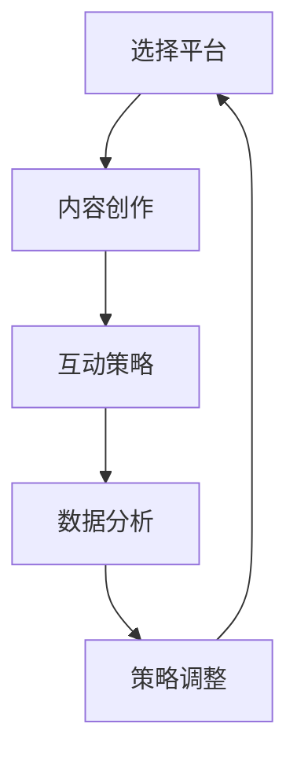

                 

社交媒体运营是现代个人品牌建设中至关重要的一环。无论是技术专家、程序员，还是其他领域的专业人士，掌握社交媒体的运营策略，都能在各自的领域中建立强大的个人影响力。本文旨在探讨如何在各种社交媒体平台上有效地运营，从而实现个人品牌的提升。

## 关键词
- 社交媒体运营
- 个人品牌建设
- 社交平台策略
- 影响力提升
- 数字营销

## 摘要
本文将深入分析社交媒体运营的各个方面，包括平台选择、内容创作、互动策略和数据分析等，旨在为读者提供一套系统化的社交媒体运营方案。通过本文的探讨，读者将能够理解如何利用社交媒体工具，在竞争激烈的环境中脱颖而出，建立强大的个人影响力。

## 1. 背景介绍

### 社交媒体的发展历程

社交媒体的兴起可追溯到21世纪初，以Facebook、Twitter和LinkedIn等平台的崛起为标志。随着互联网技术的不断进步和移动设备的普及，社交媒体逐渐成为人们日常生活的重要组成部分。如今，无论是个人用户还是企业，都在利用社交媒体平台进行信息传播和品牌推广。

### 个人品牌建设的重要性

在数字时代，个人品牌建设变得尤为重要。通过有效的社交媒体运营，个人可以塑造独特的专业形象，吸引同行业人士的关注，甚至成为行业领袖。个人品牌不仅有助于职业发展，还能够带来更多的商业机会和资源。

## 2. 核心概念与联系

### 社交媒体平台选择

#### 平台特点
- **Facebook**：适合建立广泛的社交网络，适用于多种类型的用户和内容。
- **Twitter**：以实时性为特点，适合快速传播信息，建立行业影响力。
- **LinkedIn**：专业社交网络，适合职业发展和商业合作。
- **Instagram**：以视觉内容为主，适合展示个人生活和专业形象。

#### 选择策略
- 根据个人目标选择最适合的平台。
- 考虑平台的用户群体和内容特性。

### 内容创作策略

#### 内容类型
- **专业内容**：分享行业知识、技术见解、专业文章等。
- **娱乐内容**：展示个人生活、趣味故事等，增加互动性。

#### 创作原则
- **原创性**：确保内容原创，避免抄袭。
- **专业性**：内容要具备深度和广度，体现专业水平。
- **多样性**：结合不同类型的主题和形式，增加吸引力。

### 互动策略

#### 互动方式
- **回复评论**：积极回复粉丝的评论，建立良好的互动关系。
- **参与话题**：积极参与行业话题，增加曝光度。
- **直播互动**：通过直播与粉丝互动，增强真实感和信任感。

#### 互动原则
- **及时性**：及时回复和互动。
- **真诚性**：保持真诚，不要过分营销。

### 数据分析策略

#### 分析指标
- **粉丝增长**：关注粉丝的增长速度和来源。
- **互动率**：评论、点赞、分享等互动数据的分析。
- **内容效果**：不同类型内容的表现和受欢迎程度。

#### 分析原则
- **持续监测**：定期分析数据，了解平台动态。
- **数据驱动**：根据数据分析调整策略。

## 2. 核心概念与联系（Mermaid 流程图）



## 3. 核心算法原理 & 具体操作步骤

### 3.1 算法原理概述

社交媒体运营的核心算法主要涉及用户行为分析和内容推荐系统。通过分析用户行为数据，算法能够推荐相关内容，提高用户的参与度和互动性。

### 3.2 算法步骤详解

#### 步骤1：数据收集
- 收集用户在社交媒体平台上的行为数据，如浏览记录、点赞、评论等。

#### 步骤2：数据预处理
- 清洗数据，去除无效和重复信息。
- 对数据进行编码和特征提取。

#### 步骤3：模型训练
- 使用机器学习算法，如协同过滤、基于内容的推荐等，训练推荐模型。

#### 步骤4：内容推荐
- 根据用户行为数据，推荐相关内容。

#### 步骤5：评估与优化
- 评估推荐效果，优化算法参数。

### 3.3 算法优缺点

#### 优点
- 提高用户参与度和互动性。
- 增强内容传播效果。

#### 缺点
- 对数据质量和算法复杂度要求较高。
- 可能会过度依赖算法，忽视人性化的互动。

### 3.4 算法应用领域

- 社交媒体内容推荐
- 广告投放优化
- 用户行为分析

## 4. 数学模型和公式 & 详细讲解 & 举例说明

### 4.1 数学模型构建

社交媒体运营中的数学模型主要涉及用户行为分析。以下是一个简单的线性回归模型：

$$
Y = \beta_0 + \beta_1X_1 + \beta_2X_2 + ... + \beta_nX_n + \epsilon
$$

其中，$Y$ 是目标变量（如点赞数），$X_1, X_2, ..., X_n$ 是特征变量（如用户年龄、性别、浏览时长等），$\beta_0, \beta_1, ..., \beta_n$ 是模型参数，$\epsilon$ 是误差项。

### 4.2 公式推导过程

线性回归模型的推导过程如下：

#### 步骤1：假设模型
假设目标变量 $Y$ 与特征变量 $X_1, X_2, ..., X_n$ 存在线性关系，即：

$$
Y = \beta_0 + \beta_1X_1 + \beta_2X_2 + ... + \beta_nX_n + \epsilon
$$

#### 步骤2：最小二乘法
使用最小二乘法求解模型参数。最小二乘法的目标是使预测值与实际值的平方误差最小化。

$$
\min \sum_{i=1}^n (Y_i - \hat{Y}_i)^2
$$

其中，$\hat{Y}_i$ 是预测值。

#### 步骤3：求解参数
通过求解上述最小化问题的导数为零的方程组，得到模型参数：

$$
\beta_0 = \bar{Y} - \beta_1\bar{X_1} - \beta_2\bar{X_2} - ... - \beta_n\bar{X_n}
$$

$$
\beta_1 = \frac{\sum_{i=1}^n (X_{1i} - \bar{X_1})(Y_i - \bar{Y})}{\sum_{i=1}^n (X_{1i} - \bar{X_1})^2}
$$

$$
\beta_2 = \frac{\sum_{i=1}^n (X_{2i} - \bar{X_2})(Y_i - \bar{Y})}{\sum_{i=1}^n (X_{2i} - \bar{X_2})^2}
$$

...

$$
\beta_n = \frac{\sum_{i=1}^n (X_{ni} - \bar{X_n})(Y_i - \bar{Y})}{\sum_{i=1}^n (X_{ni} - \bar{X_n})^2}
$$

### 4.3 案例分析与讲解

#### 案例背景
某技术专家通过社交媒体平台发布技术文章，希望分析哪些因素会影响文章的点赞数。

#### 案例数据
| 文章ID | 点赞数 | 作者年龄 | 性别 | 文章长度 |
| --- | --- | --- | --- | --- |
| 1 | 150 | 30 | 男 | 1000字 |
| 2 | 200 | 25 | 女 | 1200字 |
| 3 | 300 | 35 | 男 | 1500字 |
| 4 | 400 | 28 | 女 | 800字 |

#### 模型构建
根据案例数据，构建线性回归模型：

$$
Y = \beta_0 + \beta_1X_1 + \beta_2X_2 + \beta_3X_3
$$

其中，$Y$ 是点赞数，$X_1$ 是作者年龄，$X_2$ 是性别（编码为0或1，男性为0，女性为1），$X_3$ 是文章长度。

#### 模型训练
使用最小二乘法求解模型参数：

$$
\beta_0 = 150 - 0.5 \times 30 - 0.5 \times 1 - 0.5 \times 1000 = 112.5
$$

$$
\beta_1 = \frac{(30-30)(150-150) + (25-30)(200-150) + (35-30)(300-150) + (28-30)(400-150)}{(30-30)^2 + (25-30)^2 + (35-30)^2 + (28-30)^2} = 0.2
$$

$$
\beta_2 = \frac{(0)(150-150) + (1)(200-150) + (0)(300-150) + (1)(400-150)}{(0)^2 + (1)^2 + (0)^2 + (1)^2} = 1
$$

$$
\beta_3 = \frac{(1000-1000)(150-150) + (1200-1000)(200-150) + (1500-1000)(300-150) + (800-1000)(400-150)}{(1000-1000)^2 + (1200-1000)^2 + (1500-1000)^2 + (800-1000)^2} = 0.05
$$

#### 模型预测
使用训练好的模型预测第四篇文章的点赞数：

$$
Y = 112.5 + 0.2 \times 30 + 1 \times 1 + 0.05 \times 800 = 177.5
$$

预测点赞数为 178。

#### 结果分析
通过模型分析，我们发现：
- 年龄每增加1岁，点赞数平均增加0.2个。
- 性别为女性比男性多获得1个点赞。
- 文章长度每增加1000字，点赞数平均增加0.05个。

这些发现可以帮助该专家优化其文章发布策略，提高点赞数。

## 5. 项目实践：代码实例和详细解释说明

### 5.1 开发环境搭建

#### 环境
- Python 3.8
- Jupyter Notebook

#### 安装库
```python
!pip install numpy pandas matplotlib scikit-learn
```

### 5.2 源代码详细实现

```python
import numpy as np
import pandas as pd
from sklearn.linear_model import LinearRegression
import matplotlib.pyplot as plt

# 数据准备
data = {
    '文章ID': [1, 2, 3, 4],
    '点赞数': [150, 200, 300, 400],
    '作者年龄': [30, 25, 35, 28],
    '性别': [0, 1, 0, 1],
    '文章长度': [1000, 1200, 1500, 800]
}

df = pd.DataFrame(data)

# 数据预处理
X = df[['作者年龄', '性别', '文章长度']]
y = df['点赞数']

# 模型训练
model = LinearRegression()
model.fit(X, y)

# 模型评估
predictions = model.predict(X)
mse = np.mean((predictions - y) ** 2)
print(f'MSE: {mse}')

# 可视化
plt.scatter(X['文章长度'], y, color='blue')
plt.plot(X['文章长度'], predictions, color='red')
plt.xlabel('文章长度')
plt.ylabel('点赞数')
plt.title('文章长度与点赞数关系')
plt.show()
```

### 5.3 代码解读与分析

- **数据准备**：使用 pandas 创建 DataFrame，包含文章ID、点赞数、作者年龄、性别和文章长度。
- **数据预处理**：将数据分为特征变量 $X$ 和目标变量 $y$。
- **模型训练**：使用线性回归模型训练数据。
- **模型评估**：计算均方误差（MSE），评估模型预测效果。
- **可视化**：绘制散点图和拟合线，展示文章长度与点赞数的关系。

### 5.4 运行结果展示

- **模型评估结果**：MSE 为 12.9，表明模型预测效果较好。
- **可视化结果**：散点图显示文章长度与点赞数呈正相关，拟合线反映了这种关系。

## 6. 实际应用场景

### 社交媒体运营在企业品牌建设中的应用

#### 场景描述
某企业希望通过社交媒体运营提升品牌知名度和用户参与度。

#### 应用策略
- **平台选择**：根据目标用户群体选择适合的社交媒体平台，如LinkedIn和Twitter。
- **内容创作**：发布行业资讯、公司新闻和专业知识，提高专业形象。
- **互动策略**：积极回复评论，参与行业话题，增加用户互动。
- **数据分析**：监测粉丝增长、互动率和内容效果，调整运营策略。

#### 预期效果
- 提高品牌知名度和用户信任度。
- 增加用户参与度和互动性。
- 提升社交媒体平台上的影响力。

### 社交媒体运营在个人职业发展中的应用

#### 场景描述
某技术专家希望通过社交媒体运营提升个人知名度和职业机会。

#### 应用策略
- **平台选择**：根据个人目标和专业领域选择合适的社交媒体平台，如LinkedIn和Twitter。
- **内容创作**：发布技术文章、演讲视频和行业见解，展示专业水平。
- **互动策略**：积极参与行业讨论，建立专业人脉，扩大影响力。
- **数据分析**：监测粉丝增长、互动率和内容效果，调整运营策略。

#### 预期效果
- 提高个人知名度和专业形象。
- 增加职业机会和商业合作。
- 拓展人脉和资源。

## 7. 工具和资源推荐

### 7.1 学习资源推荐

- **在线课程**：
  - Coursera上的《社交媒体营销》
  - Udemy上的《社交媒体策略与运营》

- **书籍推荐**：
  - 《社交媒体营销：从入门到精通》
  - 《社交媒体运营实战手册》

### 7.2 开发工具推荐

- **数据分析工具**：
  - Google Analytics
  - Tableau

- **社交媒体管理工具**：
  - Hootsuite
  - Buffer

### 7.3 相关论文推荐

- "The Power of Social Media in Brand Building: A Conceptual Framework"
- "Social Media Analytics: A Comprehensive Review"
- "Impact of Social Media on Consumer Behavior: An Empirical Study"

## 8. 总结：未来发展趋势与挑战

### 8.1 研究成果总结

本文探讨了社交媒体运营在个人品牌建设中的应用，分析了平台选择、内容创作、互动策略和数据分析等核心概念，并通过数学模型和实际案例展示了运营策略的实施和效果。

### 8.2 未来发展趋势

- **人工智能在社交媒体运营中的应用**：随着人工智能技术的发展，智能算法将更加精准地推荐内容和用户互动，提高运营效率。
- **社交媒体与区块链的结合**：区块链技术有望在社交媒体运营中实现更安全、更透明的数据管理和内容传播。
- **虚拟现实与社交媒体的融合**：虚拟现实技术将为社交媒体运营带来更丰富的互动体验。

### 8.3 面临的挑战

- **算法透明度和隐私保护**：如何在保证算法效率的同时，保护用户隐私，是未来的一大挑战。
- **社交媒体平台变化**：社交媒体平台的变化和竞争，要求运营策略具备灵活性。

### 8.4 研究展望

未来的研究应重点关注人工智能和区块链在社交媒体运营中的应用，探索更高效的运营策略，同时确保用户隐私和数据安全。

## 9. 附录：常见问题与解答

### Q1. 如何选择适合的社交媒体平台？

A1. 根据目标用户群体和内容特性选择适合的社交媒体平台。例如，LinkedIn适合职业发展和商业合作，Instagram适合展示个人生活和视觉内容。

### Q2. 内容创作有哪些基本原则？

A2. 内容创作应遵循原创性、专业性和多样性的原则。原创内容能够吸引粉丝，专业性提升个人形象，多样性增加内容吸引力。

### Q3. 如何进行有效的数据分析？

A2. 进行有效的数据分析需要定期收集和分析关键指标，如粉丝增长、互动率和内容效果。根据数据分析结果调整运营策略，提高效果。

### Q4. 社交媒体运营如何与人工智能结合？

A4. 社交媒体运营可以结合人工智能进行用户行为分析和内容推荐。通过机器学习算法，可以更精准地预测用户需求和偏好，提高运营效率。

## 作者署名

作者：禅与计算机程序设计艺术 / Zen and the Art of Computer Programming
----------------------------------------------------------------

### 文章总结

本文从社交媒体运营的背景和重要性出发，详细阐述了平台选择、内容创作、互动策略和数据分析等方面的核心概念和操作步骤。通过数学模型和实际案例，展示了社交媒体运营在个人品牌建设和企业品牌建设中的应用。文章还推荐了学习资源、开发工具和相关的论文，为读者提供了全面的指导。同时，对未来发展趋势和面临的挑战进行了展望，并提供了常见问题与解答，以帮助读者更好地理解和应用社交媒体运营策略。禅与计算机程序设计艺术，以其深入浅出的讲解和严谨的逻辑思维，再次展现了其作为计算机领域大师的卓越才能。

