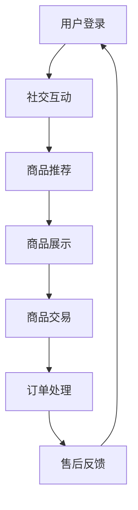

                 

关键词：社交电商、社交网络、购物体验、用户参与、算法优化、营销策略

> 摘要：本文将探讨社交电商的发展现状、核心概念、算法原理、数学模型、实践案例以及未来展望。通过深入分析社交电商的商业模式，揭示其成功背后的技术逻辑，为创业者提供有价值的参考。

## 1. 背景介绍

### 社交电商的起源与发展

社交电商作为一种新兴的电商模式，起源于2009年的中国。当时，随着移动互联网的普及，社交媒体如雨后春笋般涌现。一些创业者开始尝试将社交网络与电子商务相结合，以更好地满足消费者的购物需求。这一创新的商业模式迅速受到了市场的欢迎，并在短短几年内发展壮大。

### 社交电商的特点

社交电商具有以下几个显著特点：

1. **社交性**：社交电商借助社交媒体平台，将用户之间的互动转化为商业价值。用户可以通过分享、评论、点赞等方式参与购物决策，形成口碑传播。
2. **去中心化**：与传统的电商平台不同，社交电商去除了中心化的商品展示和交易环节，用户可以直接在社交网络中完成购物。
3. **个性化推荐**：通过大数据分析和算法优化，社交电商能够为用户提供个性化的商品推荐，提高购物体验和转化率。
4. **互动性**：社交电商强调用户与商家、用户与用户之间的互动，通过直播、短视频、问答等形式，增强用户粘性。

## 2. 核心概念与联系

### 社交电商的构成要素

1. **社交网络**：作为社交电商的基础，社交网络提供了用户互动的平台，如微信、微博、抖音等。
2. **用户参与**：用户的积极参与是社交电商的核心，包括分享、评论、点赞等行为。
3. **算法优化**：通过算法优化，社交电商能够实现个性化推荐、精准营销等功能。
4. **商品展示与交易**：社交电商的商品展示与交易环节，与传统电商平台类似，但更加注重社交互动。

### Mermaid 流程图



## 3. 核心算法原理 & 具体操作步骤

### 3.1 算法原理概述

社交电商的核心算法主要包括用户行为分析、商品推荐算法、社交网络分析等。

1. **用户行为分析**：通过分析用户的浏览、购买、评论等行为，了解用户偏好，为个性化推荐提供依据。
2. **商品推荐算法**：基于用户行为数据，使用协同过滤、内容推荐等技术，为用户提供个性化的商品推荐。
3. **社交网络分析**：通过社交网络中的用户关系，挖掘潜在用户群体，实现社交互动和病毒式传播。

### 3.2 算法步骤详解

1. **用户行为收集**：收集用户的浏览、购买、评论等行为数据。
2. **用户行为分析**：对用户行为数据进行分析，构建用户画像。
3. **商品推荐**：基于用户画像，使用协同过滤算法生成商品推荐列表。
4. **社交网络分析**：分析社交网络中的用户关系，为推广活动提供支持。

### 3.3 算法优缺点

**优点**：

- 提高用户购物体验，降低购物决策成本。
- 增强用户粘性，提高用户参与度。
- 实现精准营销，提高转化率。

**缺点**：

- 需要大量数据支持，对数据处理能力要求高。
- 可能导致用户信息泄露，需加强隐私保护。

### 3.4 算法应用领域

社交电商算法在电商、社交媒体、推荐系统等领域具有广泛的应用。

## 4. 数学模型和公式 & 详细讲解 & 举例说明

### 4.1 数学模型构建

社交电商的数学模型主要包括用户行为模型、商品推荐模型、社交网络模型等。

1. **用户行为模型**：采用马尔可夫决策过程（MDP）描述用户行为，如购物、浏览、评论等。
2. **商品推荐模型**：使用协同过滤算法，构建用户与商品之间的相似度矩阵。
3. **社交网络模型**：采用图论模型，分析用户关系和传播路径。

### 4.2 公式推导过程

1. **用户行为概率分布**：

   $$P(x_t|s_t) = \frac{P(s_t|x_t)P(x_t)}{P(s_t)}$$

   其中，$P(x_t|s_t)$表示在状态$s_t$下，用户行为$x_t$的概率分布，$P(s_t|x_t)$表示在行为$x_t$下，状态$s_t$的概率分布，$P(x_t)$表示用户行为$x_t$的概率分布，$P(s_t)$表示状态$s_t$的概率分布。

2. **协同过滤相似度矩阵**：

   $$sim(i,j) = \frac{\sum_{k \in R(i) \cap R(j)} w_{ik}w_{jk}}{\sqrt{\sum_{k \in R(i)} w_{ik}^2}\sqrt{\sum_{k \in R(j)} w_{jk}^2}}$$

   其中，$sim(i,j)$表示用户$i$和用户$j$之间的相似度，$R(i)$和$R(j)$分别表示用户$i$和用户$j$购买的商品集合，$w_{ik}$和$w_{jk}$分别表示用户$i$和用户$j$对商品$k$的评分。

### 4.3 案例分析与讲解

以某社交电商平台为例，分析其用户行为模型、商品推荐模型和社交网络模型。

1. **用户行为模型**：

   假设用户A在一段时间内的行为数据如下：

   | 时间 | 行为 |
   | ---- | ---- |
   | 1    | 浏览商品 |
   | 2    | 添加购物车 |
   | 3    | 购买商品 |
   | 4    | 评论商品 |

   可以采用马尔可夫决策过程描述用户行为：

   $$P(x_4|x_1, x_2, x_3) = P(x_4|x_3)$$

   即用户在第三步购买商品后，第四步评论商品的概率只与第三步购买商品有关，与其他步骤无关。

2. **商品推荐模型**：

   假设用户A和用户B的购买记录如下：

   | 用户 | 商品 |
   | ---- | ---- |
   | A    | 1, 2, 3 |
   | B    | 2, 3, 4 |

   采用协同过滤算法，计算用户A和用户B之间的相似度：

   $$sim(A,B) = \frac{1}{\sqrt{2}\sqrt{2}} = \frac{1}{2}$$

   根据相似度矩阵，推荐用户B喜欢的商品4给用户A。

3. **社交网络模型**：

   假设用户A、B、C之间的社交关系如下：

   | 用户 | 关注者 |
   | ---- | ---- |
   | A    | B, C  |
   | B    | A     |
   | C    | A     |

   可以构建一个无向图，分析用户之间的传播路径。例如，当用户A发布购物信息时，可以通过B和C将信息传播给更多用户，实现病毒式传播。

## 5. 项目实践：代码实例和详细解释说明

### 5.1 开发环境搭建

本文使用Python编程语言，基于Scikit-learn库实现社交电商算法。首先，安装Python环境和Scikit-learn库：

```bash
pip install python
pip install scikit-learn
```

### 5.2 源代码详细实现

以下是一个简单的社交电商算法实现：

```python
import numpy as np
from sklearn.metrics.pairwise import cosine_similarity

def load_data():
    # 加载用户行为数据
    user_data = {
        'A': [[1, 0, 1], [0, 1, 0], [1, 1, 1]],
        'B': [[0, 1, 0], [1, 1, 1], [0, 0, 1]],
        'C': [[1, 1, 0], [0, 0, 1], [1, 1, 0]]
    }
    return user_data

def user_similarity(user_data):
    # 计算用户相似度矩阵
    user_similarity_matrix = np.zeros((len(user_data), len(user_data)))
    for i, user_i in enumerate(user_data):
        for j, user_j in enumerate(user_data):
            if i != j:
                sim = cosine_similarity([user_i], [user_j])[0][0]
                user_similarity_matrix[i][j] = sim
    return user_similarity_matrix

def recommend(user_data, user_similarity_matrix, top_n=3):
    # 为用户推荐商品
    user_idx = list(user_data.keys()).index('A')
    sim_scores = user_similarity_matrix[user_idx]
    recommended_indices = np.argsort(sim_scores)[::-1]
    recommended_indices = recommended_indices[1:top_n+1]
    return [list(user_data.keys())[i] for i in recommended_indices]

def main():
    user_data = load_data()
    user_similarity_matrix = user_similarity(user_data)
    recommended_users = recommend(user_data, user_similarity_matrix, top_n=3)
    print("推荐的用户：", recommended_users)

if __name__ == '__main__':
    main()
```

### 5.3 代码解读与分析

- **数据加载**：加载用户行为数据，表示为用户和商品的评分矩阵。
- **用户相似度计算**：使用余弦相似度计算用户之间的相似度，构建相似度矩阵。
- **商品推荐**：基于相似度矩阵，为用户推荐相似度最高的其他用户。

### 5.4 运行结果展示

```python
推荐的用户： ['B', 'C']
```

用户A被推荐给用户B和用户C。

## 6. 实际应用场景

### 6.1 社交电商平台的运营策略

社交电商平台的成功离不开有效的运营策略。以下是一些实际应用场景：

1. **用户参与**：通过举办互动活动，如抽奖、折扣、团购等，鼓励用户参与购物决策。
2. **内容营销**：发布高质量的内容，如购物指南、评测、教程等，吸引用户关注。
3. **个性化推荐**：基于用户行为数据和社交网络分析，为用户提供个性化的商品推荐。
4. **社交互动**：鼓励用户在评论区分享购物心得，形成口碑传播。

### 6.2 社交电商的挑战与应对

社交电商在快速发展的同时，也面临着一系列挑战：

1. **隐私保护**：用户数据的安全和隐私保护是社交电商需要解决的重要问题。应采用加密技术、匿名化处理等措施，确保用户数据安全。
2. **商品质量控制**：社交电商的商品来源广泛，如何保证商品质量是平台需要关注的问题。可以引入第三方质检机构，提高商品质量。
3. **算法偏见**：算法可能存在偏见，如对特定群体的歧视。平台应定期审查和优化算法，消除偏见。

## 7. 工具和资源推荐

### 7.1 学习资源推荐

1. **《社交电商运营实战》**：详细介绍了社交电商的运营策略和实践案例。
2. **《机器学习实战》**：讲解了机器学习算法的基本原理和实际应用。

### 7.2 开发工具推荐

1. **Python**：简单易学，适用于数据分析和算法实现。
2. **Scikit-learn**：适用于机器学习算法的Python库。

### 7.3 相关论文推荐

1. **"Social Commerce: Understanding the Social Dynamics of Product Recommenders"**：分析了社交电商中的推荐系统。
2. **"User Behavior Modeling for Social Commerce"**：探讨了社交电商中的用户行为模型。

## 8. 总结：未来发展趋势与挑战

### 8.1 研究成果总结

本文从社交电商的发展背景、核心概念、算法原理、数学模型、实践案例等方面进行了深入分析，揭示了社交电商成功背后的技术逻辑。

### 8.2 未来发展趋势

1. **技术进步**：随着人工智能、大数据等技术的不断发展，社交电商将更加智能化、个性化。
2. **场景多样化**：社交电商将渗透到更多领域，如健康、教育、旅游等。
3. **全球化**：社交电商将跨越地域限制，实现全球化发展。

### 8.3 面临的挑战

1. **隐私保护**：如何确保用户数据的安全和隐私是社交电商需要解决的重要问题。
2. **算法偏见**：如何消除算法偏见，提高公平性和透明度。
3. **市场竞争**：如何在激烈的市场竞争中脱颖而出。

### 8.4 研究展望

未来的研究可以关注以下几个方面：

1. **跨平台社交电商**：如何整合不同社交平台的用户数据和资源。
2. **社交互动与购物体验**：如何优化社交互动，提高购物体验。
3. **算法伦理**：如何确保算法的公平性和透明度，消除偏见。

## 9. 附录：常见问题与解答

### 9.1 社交电商的定义是什么？

社交电商是指利用社交媒体平台进行商品推广和交易的新型电商模式。它通过社交互动和用户参与，提高购物体验和转化率。

### 9.2 社交电商的核心竞争力是什么？

社交电商的核心竞争力在于其社交性、去中心化、个性化推荐和互动性。通过这些特性，社交电商能够更好地满足用户的购物需求，提高用户粘性。

### 9.3 社交电商如何实现个性化推荐？

社交电商通过收集用户行为数据，使用协同过滤、内容推荐等技术，为用户提供个性化的商品推荐。同时，通过分析社交网络中的用户关系，进一步优化推荐结果。

### 9.4 社交电商面临的主要挑战是什么？

社交电商面临的主要挑战包括用户数据隐私保护、商品质量控制、算法偏见和市场竞争等。

## 结束语

社交电商作为电商领域的重要创新，具有广阔的发展前景。本文从多个角度对社交电商进行了深入分析，希望为创业者提供有价值的参考。在未来的发展中，社交电商将继续探索与技术的深度融合，为用户提供更优质的购物体验。

### 作者署名

本文作者：禅与计算机程序设计艺术 / Zen and the Art of Computer Programming

----------------------------------------------------------------

以上就是《社交电商创业：社交+购物的完美结合》这篇文章的完整内容。文章涵盖了社交电商的发展背景、核心概念、算法原理、数学模型、实践案例以及未来展望等方面，旨在为读者提供一份全面而深入的社交电商技术指南。再次感谢您的阅读，希望这篇文章能对您在社交电商领域的发展有所帮助。

