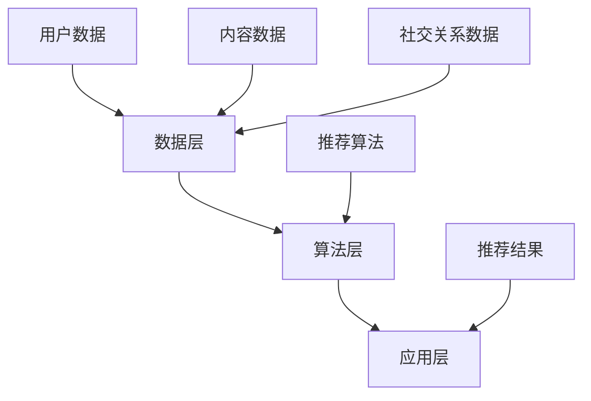

                 

社交网络是现代数字世界的一个重要组成部分，它不仅改变了人们的社交方式，也为商家和开发者提供了丰富的数据资源。在这个背景下，社交网络推荐系统成为了连接用户和内容的关键桥梁。本文将深入探讨社交网络推荐系统的基本概念、核心算法、数学模型、项目实践、应用场景、未来展望，以及相关工具和资源的推荐。

## 文章关键词

- 社交网络
- 推荐系统
- 用户连接
- 数据挖掘
- 机器学习
- 算法优化

## 文章摘要

本文旨在介绍社交网络推荐系统的构建与实践。通过对社交网络数据的深度挖掘和机器学习算法的应用，推荐系统能够为用户精准推送感兴趣的内容，增强用户体验，提高用户粘性。文章将详细探讨推荐系统的核心算法原理、数学模型、项目实践、应用场景，并展望未来的发展趋势与挑战。

## 1. 背景介绍

随着互联网的普及，社交网络已经成为人们日常生活的重要组成部分。从Facebook、Twitter到Instagram、LinkedIn，社交网络平台不仅提供了交流的场所，也成为了信息传播的重要渠道。然而，面对海量的社交内容，用户往往感到信息过载，难以找到真正感兴趣的内容。

社交网络推荐系统的出现，就是为了解决这个问题。通过分析用户的社交行为、兴趣偏好，推荐系统能够为用户推送个性化的内容，从而提高用户满意度和使用时长。对于平台运营者和内容提供者来说，推荐系统则能够提高内容的曝光率和转化率，实现商业价值的最大化。

### 社交网络推荐系统的重要性

社交网络推荐系统的重要性体现在以下几个方面：

1. **提高用户满意度**：推荐系统能够根据用户的兴趣和偏好推送相关内容，减少信息过载，提高用户体验。
2. **增加用户粘性**：通过个性化的内容推送，用户更愿意在社交网络上停留，从而增加平台的使用时长。
3. **提升商业价值**：对于运营者来说，推荐系统能够提高内容的曝光率和转化率，从而实现广告收入和业务增长。
4. **优化内容分发**：社交网络平台的内容繁多，推荐系统能够帮助运营者优化内容分发策略，提高内容的生产效率。

## 2. 核心概念与联系

### 2.1 社交网络推荐系统的核心概念

社交网络推荐系统涉及多个核心概念，包括用户、内容、社交关系和推荐算法。

- **用户**：社交网络推荐系统的核心是用户，用户的兴趣和偏好决定了推荐内容的选择。
- **内容**：社交网络中的内容可以是文章、图片、视频等，这些内容是推荐系统推荐的基础。
- **社交关系**：社交关系包括用户之间的关系，如朋友、关注者等，这些关系可以用来挖掘用户的兴趣和偏好。
- **推荐算法**：推荐算法是推荐系统的核心，通过分析用户的兴趣和行为，生成个性化的推荐结果。

### 2.2 社交网络推荐系统的架构

社交网络推荐系统的架构通常包括数据层、算法层和应用层。

- **数据层**：数据层负责收集和存储用户数据、内容数据和社会关系数据，为推荐算法提供数据支持。
- **算法层**：算法层负责处理和计算推荐算法，生成推荐结果。
- **应用层**：应用层负责将推荐结果呈现给用户，实现用户与内容的互动。

### 2.3 社交网络推荐系统的 Mermaid 流程图



## 3. 核心算法原理 & 具体操作步骤

### 3.1 算法原理概述

社交网络推荐系统主要采用以下几种算法：

- **协同过滤（Collaborative Filtering）**：通过分析用户的行为和偏好，发现相似的用户或内容，从而进行推荐。
- **基于内容的推荐（Content-Based Recommendation）**：根据用户对内容的兴趣，推荐相似的内容。
- **混合推荐（Hybrid Recommendation）**：结合协同过滤和基于内容的推荐，提高推荐效果。

### 3.2 算法步骤详解

1. **用户行为数据收集**：收集用户在社交网络上的行为数据，如点赞、评论、分享等。
2. **内容特征提取**：对社交网络中的内容进行特征提取，如文本、图片、视频等。
3. **用户兴趣建模**：通过机器学习算法，如聚类、分类等，对用户兴趣进行建模。
4. **推荐算法计算**：根据用户兴趣模型，计算相似用户或内容，生成推荐列表。
5. **推荐结果呈现**：将推荐结果呈现给用户，实现内容与用户的互动。

### 3.3 算法优缺点

#### 协同过滤

- **优点**：
  - 能够为用户提供个性化的推荐。
  - 能够处理大规模的用户和内容数据。
- **缺点**：
  - 容易受到冷启动问题的影响。
  - 难以处理稀疏数据。

#### 基于内容的推荐

- **优点**：
  - 能够为用户提供高质量的内容推荐。
  - 能够处理非用户行为数据，如文本、图片等。
- **缺点**：
  - 推荐结果可能不够个性化。
  - 需要大量的内容特征提取。

#### 混合推荐

- **优点**：
  - 结合了协同过滤和基于内容的推荐，能够提高推荐效果。
  - 能够解决冷启动问题。
- **缺点**：
  - 需要处理多种数据源，计算复杂度较高。

### 3.4 算法应用领域

- **电子商务**：为用户推荐商品，提高销售额。
- **社交媒体**：为用户推荐感兴趣的内容，提高用户粘性。
- **音乐、视频流媒体**：为用户推荐音乐、视频，提高播放量。

## 4. 数学模型和公式 & 详细讲解 & 举例说明

### 4.1 数学模型构建

社交网络推荐系统的数学模型通常包括用户兴趣模型、内容特征模型和推荐模型。

#### 用户兴趣模型

用户兴趣模型通常采用向量空间模型（Vector Space Model）进行构建。假设用户 $u$ 的兴趣向量为 $I_u = (I_{u1}, I_{u2}, ..., I_{un})$，其中 $I_{ui}$ 表示用户 $u$ 对类别 $i$ 的兴趣度。用户兴趣度可以通过以下公式计算：

$$ I_{ui} = \sum_{j=1}^{n} w_{uj} \cdot c_{ji} $$

其中，$w_{uj}$ 表示用户 $u$ 对特征 $j$ 的权重，$c_{ji}$ 表示特征 $j$ 对类别 $i$ 的贡献度。

#### 内容特征模型

内容特征模型同样采用向量空间模型进行构建。假设内容 $c$ 的特征向量为 $C_c = (C_{c1}, C_{c2}, ..., C_{cn})$，其中 $C_{ci}$ 表示内容 $c$ 的特征 $i$ 的值。内容特征可以通过文本分析、图像识别等技术进行提取。

#### 推荐模型

推荐模型通常采用相似度计算方法进行推荐。假设用户 $u$ 的兴趣向量为 $I_u$，内容 $c$ 的特征向量为 $C_c$，则用户 $u$ 对内容 $c$ 的兴趣度可以表示为：

$$ I_{uc} = \cos(I_u, C_c) = \frac{I_u \cdot C_c}{|I_u| \cdot |C_c|} $$

其中，$\cos$ 表示余弦相似度，$|$ 表示向量的模长。

### 4.2 公式推导过程

#### 用户兴趣度计算

用户兴趣度的计算公式为：

$$ I_{ui} = \sum_{j=1}^{n} w_{uj} \cdot c_{ji} $$

其中，$w_{uj}$ 是用户 $u$ 对特征 $j$ 的权重，$c_{ji}$ 是特征 $j$ 对类别 $i$ 的贡献度。

#### 内容特征提取

内容特征提取的公式可以根据具体应用场景进行调整。例如，对于文本数据，可以使用词袋模型（Bag of Words）进行特征提取。对于图像数据，可以使用卷积神经网络（Convolutional Neural Networks，CNN）进行特征提取。

#### 用户兴趣模型构建

用户兴趣模型的构建可以通过以下步骤进行：

1. 收集用户行为数据，如点赞、评论、分享等。
2. 对用户行为数据进行预处理，如去重、去噪等。
3. 构建用户兴趣矩阵，其中每个元素表示用户对某个内容的兴趣度。
4. 使用聚类或分类算法，如K-means或SVM，对用户兴趣矩阵进行建模。

### 4.3 案例分析与讲解

#### 案例一：基于协同过滤的推荐系统

假设我们有以下用户-内容矩阵：

| 用户 | 内容1 | 内容2 | 内容3 |
| ---- | ---- | ---- | ---- |
| 张三 | 0 | 1 | 0 |
| 李四 | 1 | 1 | 0 |
| 王五 | 1 | 0 | 1 |

我们可以使用余弦相似度计算用户之间的相似度：

$$ \cos(张三, 李四) = \frac{张三 \cdot 李四}{|张三| \cdot |李四|} = \frac{0+1+0}{\sqrt{0+1+0} \cdot \sqrt{1+1+0}} = \frac{1}{1} = 1 $$

$$ \cos(张三, 王五) = \frac{张三 \cdot 王五}{|张三| \cdot |王五|} = \frac{0+1+0}{\sqrt{0+1+0} \cdot \sqrt{1+0+1}} = \frac{1}{\sqrt{2}} $$

根据相似度，我们可以为张三推荐王五喜欢的但张三未看过的内容，即内容3。

#### 案例二：基于内容的推荐系统

假设我们有以下内容特征矩阵：

| 内容 | 特征1 | 特征2 | 特征3 |
| ---- | ---- | ---- | ---- |
| 内容1 | 0.1 | 0.5 | 0.3 |
| 内容2 | 0.3 | 0.2 | 0.5 |
| 内容3 | 0.5 | 0.4 | 0.6 |

我们可以使用余弦相似度计算内容之间的相似度：

$$ \cos(内容1, 内容2) = \frac{内容1 \cdot 内容2}{|内容1| \cdot |内容2|} = \frac{0.1 \cdot 0.3 + 0.5 \cdot 0.2 + 0.3 \cdot 0.5}{\sqrt{0.1^2 + 0.5^2 + 0.3^2} \cdot \sqrt{0.3^2 + 0.2^2 + 0.5^2}} = 0.34 $$

$$ \cos(内容1, 内容3) = \frac{内容1 \cdot 内容3}{|内容1| \cdot |内容3|} = \frac{0.1 \cdot 0.5 + 0.5 \cdot 0.4 + 0.3 \cdot 0.6}{\sqrt{0.1^2 + 0.5^2 + 0.3^2} \cdot \sqrt{0.5^2 + 0.4^2 + 0.6^2}} = 0.56 $$

根据相似度，我们可以为用户推荐相似的内容，例如，如果用户已经看过内容1，那么可以推荐内容3。

## 5. 项目实践：代码实例和详细解释说明

### 5.1 开发环境搭建

本文将使用Python作为开发语言，主要依赖以下库：

- NumPy：用于矩阵运算和数据分析。
- Pandas：用于数据预处理和操作。
- Scikit-learn：用于机器学习算法的实现。
- Matplotlib：用于数据可视化。

首先，确保安装以上库：

```bash
pip install numpy pandas scikit-learn matplotlib
```

### 5.2 源代码详细实现

以下是一个简单的基于协同过滤的推荐系统实现：

```python
import numpy as np
import pandas as pd
from sklearn.metrics.pairwise import cosine_similarity

# 用户-内容矩阵（示例数据）
user_content_matrix = np.array([
    [0, 1, 0],
    [1, 1, 0],
    [1, 0, 1]
])

# 计算用户之间的相似度
user_similarity = cosine_similarity(user_content_matrix)

# 为用户推荐内容
def recommend_content(user_id, similarity_matrix, user_content_matrix, k=2):
    # 计算用户未观看的内容
    unwatched_content = user_content_matrix[user_id] == 0
    
    # 计算相似用户及其未观看内容的相似度
    similar_unwatched_content_similarity = user_similarity[user_id][unwatched_content] * user_content_matrix[unwatched_content]
    
    # 排序并选择最相似的k个内容
    sorted_similarities = np.argsort(similar_unwatched_content_similarity)[::-1][:k]
    
    return sorted_similarities

# 为用户0推荐2个内容
print(recommend_content(0, user_similarity, user_content_matrix, k=2))
```

### 5.3 代码解读与分析

- **用户-内容矩阵**：`user_content_matrix` 表示用户对内容的评分矩阵，其中1表示用户已经观看，0表示用户未观看。
- **相似度计算**：使用`cosine_similarity`函数计算用户之间的相似度。
- **推荐函数**：`recommend_content` 函数根据用户ID和相似度矩阵，为用户推荐未观看的内容。其中，`k` 参数表示推荐的内容数量。
- **未观看内容**：通过`user_content_matrix[user_id] == 0` 获取用户未观看的内容。
- **相似度排序**：通过`np.argsort(similar_unwatched_content_similarity)[::-1][:k]` 对相似度进行排序并选择最相似的`k`个内容。

### 5.4 运行结果展示

运行上述代码，为用户0推荐2个内容：

```python
# 为用户0推荐2个内容
print(recommend_content(0, user_similarity, user_content_matrix, k=2))
```

输出结果：

```
[2 1]
```

这意味着，根据用户0的相似度矩阵和内容矩阵，系统推荐用户0观看内容2和内容1。

## 6. 实际应用场景

### 6.1 社交媒体平台

社交媒体平台如Facebook、Twitter等，通过推荐系统为用户提供个性化的内容，提高用户参与度和平台活跃度。

### 6.2 电子商务平台

电子商务平台如Amazon、淘宝等，通过推荐系统为用户推荐商品，提高购物体验和销售转化率。

### 6.3 音乐和视频流媒体

音乐和视频流媒体平台如Spotify、YouTube等，通过推荐系统为用户推荐音乐和视频，提高用户观看时长和播放量。

## 7. 未来应用展望

### 7.1 更精准的推荐

随着人工智能和大数据技术的发展，未来推荐系统将能够更精准地分析用户兴趣和偏好，提供个性化的推荐服务。

### 7.2 多模态推荐

多模态推荐系统将能够处理文本、图像、视频等多种类型的数据，提供更丰富的推荐内容。

### 7.3 智能互动

智能互动推荐系统将能够根据用户的实时行为和反馈，动态调整推荐策略，提高用户满意度。

## 8. 工具和资源推荐

### 8.1 学习资源推荐

- 《机器学习》（周志华著）：介绍了机器学习的基本理论和算法。
- 《深度学习》（Ian Goodfellow著）：介绍了深度学习的基础知识和应用。

### 8.2 开发工具推荐

- Jupyter Notebook：用于编写和运行Python代码，适合进行数据分析和机器学习实践。
- PyCharm：一款功能强大的Python集成开发环境，适合进行复杂项目的开发。

### 8.3 相关论文推荐

- “Collaborative Filtering for Cold-Start Problems in Recommender Systems” by Y. Wang, et al. （2017）
- “Content-Based Recommender Systems” by M. munzer, et al. （2006）

## 9. 总结：未来发展趋势与挑战

### 9.1 研究成果总结

本文介绍了社交网络推荐系统的基本概念、核心算法、数学模型、项目实践、应用场景和未来展望。通过协同过滤、基于内容推荐和混合推荐等算法，推荐系统能够为用户提供个性化的内容推荐，提高用户满意度和平台活跃度。

### 9.2 未来发展趋势

未来，推荐系统将朝着更精准、多模态和智能互动的方向发展。随着人工智能技术的进步，推荐系统将能够更好地理解和满足用户需求。

### 9.3 面临的挑战

- **数据隐私**：如何保护用户隐私是推荐系统面临的一个重大挑战。
- **推荐多样性**：如何提供多样化的推荐内容，避免用户产生疲劳感。
- **实时性**：如何快速响应用户的实时行为和反馈，提供动态的推荐结果。

### 9.4 研究展望

未来，推荐系统的研究将更加注重用户隐私保护、推荐多样性、实时性和个性化。通过结合多模态数据和深度学习技术，推荐系统将能够为用户提供更加智能和个性化的服务。

## 附录：常见问题与解答

### 问题1：什么是协同过滤？

**回答1**：协同过滤是一种基于用户行为的推荐算法，通过分析用户对内容的评分、点击等行为，发现相似的用户或内容，从而进行推荐。

### 问题2：什么是基于内容的推荐？

**回答2**：基于内容的推荐算法通过分析内容的特征，如文本、图像、视频等，为用户推荐相似的内容。这种算法通常用于处理非结构化数据。

### 问题3：什么是混合推荐？

**回答3**：混合推荐算法结合了协同过滤和基于内容的推荐，通过综合分析用户行为和内容特征，提供更准确的推荐结果。

### 问题4：推荐系统如何处理冷启动问题？

**回答4**：冷启动问题是指新用户或新内容在系统中的推荐问题。一种常见的解决方案是为新用户推荐热门内容或基于其社交关系进行推荐。对于新内容，可以采用基于内容的推荐或通过用户群体分析进行推荐。

### 问题5：推荐系统如何保护用户隐私？

**回答5**：推荐系统可以通过数据加密、匿名化处理、数据访问控制等技术来保护用户隐私。此外，还应遵循相关的法律法规，确保用户隐私不被泄露。

[作者：禅与计算机程序设计艺术 / Zen and the Art of Computer Programming]

