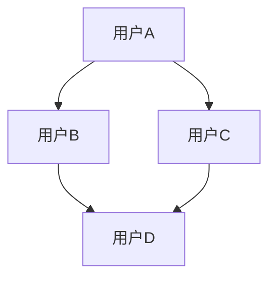
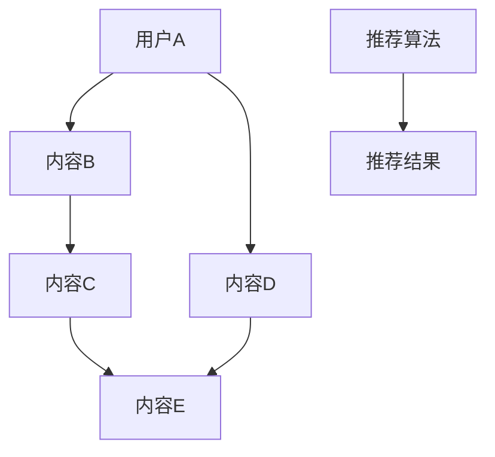

                 

社交网络推荐系统是现代互联网的重要组成部分，它们帮助用户发现新的朋友、兴趣团体和内容，同时为平台带来更高的用户黏性和商业价值。本文将深入探讨社交网络推荐系统的核心概念、算法原理、数学模型以及实际应用，以期提供一个全面的技术指南，帮助读者理解和构建自己的推荐系统。

## 文章关键词
- 社交网络
- 推荐系统
- 用户行为
- 机器学习
- 图算法
- 数学模型

## 文章摘要
本文首先介绍了社交网络推荐系统的背景和重要性，随后详细阐述了其核心概念，包括用户关系、内容特征和推荐算法。通过一个Mermaid流程图，我们展示了社交网络推荐系统的整体架构。文章接着深入分析了几种主流的推荐算法，包括基于内容的推荐、协同过滤和混合推荐方法。然后，我们介绍了社交网络推荐系统的数学模型，包括用户行为建模和推荐策略。最后，文章通过一个实际的项目案例，展示了如何实现一个简单的社交网络推荐系统，并对其运行结果进行了分析。

## 1. 背景介绍

社交网络推荐系统是互联网技术与应用相结合的产物，它起源于传统电子商务领域，但随着社交网络的兴起，推荐系统逐渐在社交网络平台得到了广泛的应用。社交网络推荐系统的重要性主要体现在以下几个方面：

### 用户个性化体验
社交网络平台上的用户具有多样化的兴趣和需求。通过推荐系统，平台可以针对每个用户的特点，为其推荐感兴趣的朋友、内容或活动，从而提高用户的满意度。

### 增加用户黏性
个性化的推荐能够吸引用户在社交网络平台上的停留时间，增加用户的活跃度，从而提高平台的用户黏性。

### 提升商业价值
社交网络推荐系统不仅能够提高用户满意度，还可以为平台带来直接的商业价值。例如，通过精准的广告投放和内容推荐，平台可以吸引更多的广告主和商业合作。

### 社交网络推荐系统的挑战
尽管社交网络推荐系统具有巨大的潜力，但其实现也面临着诸多挑战：

- **数据隐私**：社交网络平台积累了大量的用户数据，如何在保护用户隐私的前提下，有效地利用这些数据是一个重要问题。
- **实时性**：用户在社交网络上的行为是动态变化的，如何及时更新推荐结果，保持推荐的新鲜度和相关性，是一个技术难点。
- **多样性**：社交网络推荐不仅要满足用户的个性化需求，还要提供多样化的推荐结果，避免用户陷入“信息茧房”。

## 2. 核心概念与联系

### 用户关系

在社交网络中，用户关系是推荐系统的核心要素之一。用户关系可以通过社交图谱来表示，社交图谱是一种图结构，用于描述用户之间及其与内容之间的关系。社交图谱中的节点代表用户或内容，边代表用户之间的关系或内容之间的关联。

下面是一个简单的社交图谱示例，使用Mermaid流程图表示：



在这个示例中，A、B、C和D是用户节点，它们之间通过边建立了社交关系。

### 内容特征

除了用户关系，内容特征也是社交网络推荐系统的重要组成部分。内容特征包括文本、图片、视频等，这些特征需要被转化为机器学习模型可以处理的数字形式。常见的特征提取方法有词袋模型、TF-IDF和词嵌入等。

### 推荐算法

推荐算法是社交网络推荐系统的核心。以下是几种主要的推荐算法：

- **基于内容的推荐**：根据用户过去喜欢的内容，推荐与其相似的新内容。
- **协同过滤**：根据用户之间的相似度，推荐其他用户喜欢的内容。
- **混合推荐**：结合基于内容和协同过滤的优缺点，生成更准确的推荐结果。

下面是一个简化的推荐算法流程图：



在这个示例中，用户A对内容B和C有较高的兴趣，算法会根据用户兴趣和内容相似度推荐D和E。

### 用户行为

用户行为是推荐系统的重要输入。用户在社交网络上的行为包括点赞、评论、分享、浏览等，这些行为可以用来训练推荐模型，预测用户未来的兴趣。

## 3. 核心算法原理 & 具体操作步骤

### 3.1 算法原理概述

社交网络推荐系统的核心算法可以分为以下几类：

- **基于内容的推荐**：通过内容特征匹配用户兴趣。
- **协同过滤**：通过用户相似度推荐内容。
- **混合推荐**：结合基于内容和协同过滤的方法。

### 3.2 算法步骤详解

#### 基于内容的推荐

1. **内容特征提取**：将文本、图片、视频等转化为数字特征。
2. **内容相似度计算**：计算新内容与用户过去喜欢的内容之间的相似度。
3. **生成推荐列表**：根据相似度排序，生成推荐内容列表。

#### 协同过滤

1. **用户行为数据收集**：收集用户在社交网络上的行为数据。
2. **用户相似度计算**：通过用户行为数据计算用户之间的相似度。
3. **生成推荐列表**：根据用户相似度和内容评价，生成推荐内容列表。

#### 混合推荐

1. **内容特征提取**：提取新内容特征。
2. **用户兴趣预测**：通过用户行为数据和内容特征预测用户兴趣。
3. **生成推荐列表**：结合用户兴趣预测和用户相似度，生成推荐内容列表。

### 3.3 算法优缺点

- **基于内容的推荐**：优点是推荐结果精准，缺点是可能错过新的兴趣爱好。
- **协同过滤**：优点是推荐结果多样，缺点是可能推荐内容过于集中。
- **混合推荐**：优点是结合了基于内容和协同过滤的优点，缺点是算法复杂度较高。

### 3.4 算法应用领域

社交网络推荐系统广泛应用于社交网络、电商平台、内容平台等，通过个性化推荐，提高用户满意度和平台商业价值。

## 4. 数学模型和公式 & 详细讲解 & 举例说明

### 4.1 数学模型构建

社交网络推荐系统的数学模型主要包括用户行为建模和推荐策略。用户行为建模通常使用隐语义模型（如矩阵分解、深度学习等），推荐策略则基于用户兴趣和内容相似度。

### 4.2 公式推导过程

假设我们有用户$u$和内容$i$，用户行为数据可以用一个评分矩阵$R$表示，其中$R_{ui}$表示用户$u$对内容$i$的评分。

#### 矩阵分解

矩阵分解是一种常用的用户行为建模方法。假设评分矩阵$R$可以分解为两个低秩矩阵$U$和$V$，即：

$$
R = UV^T
$$

其中，$U$表示用户特征矩阵，$V$表示内容特征矩阵。用户对内容的评分可以表示为用户特征和内容特征的点积：

$$
R_{ui} = u_i \cdot v_i
$$

#### 推荐策略

推荐策略基于用户兴趣和内容相似度。用户兴趣可以通过用户特征表示，内容相似度可以通过内容特征计算。

$$
sim(i, j) = \frac{u_i \cdot v_j}{\|u_i\|\|v_j\|}
$$

其中，$sim(i, j)$表示内容$i$和内容$j$的相似度，$\|u_i\|$和$\|v_j\|$分别表示用户特征和内容特征的范数。

### 4.3 案例分析与讲解

假设我们有一个用户$u$和两个内容$i$和$j$，用户对这两个内容的评分为3和4。我们可以使用矩阵分解方法建模用户行为，然后计算内容相似度。

1. **用户特征矩阵$U$和内容特征矩阵$V$**：

   $$U = \begin{bmatrix}1.2 & 0.8 \\ 0.6 & 1.0\end{bmatrix}, V = \begin{bmatrix}0.8 & 1.2 \\ 0.9 & 0.7\end{bmatrix}$$

2. **计算内容相似度**：

   $$sim(i, j) = \frac{u_i \cdot v_j}{\|u_i\|\|v_j\|} = \frac{1.2 \cdot 0.7}{\sqrt{1.2^2 + 0.8^2} \cdot \sqrt{0.9^2 + 0.7^2}} \approx 0.79$$

   内容$i$和内容$j$的相似度为0.79，说明这两个内容在用户$u$的兴趣上较为相似。

## 5. 项目实践：代码实例和详细解释说明

### 5.1 开发环境搭建

为了实现社交网络推荐系统，我们需要安装以下环境：

- Python 3.7及以上版本
- NumPy
- Scikit-learn
- Pandas
- Matplotlib

在终端执行以下命令进行安装：

```bash
pip install numpy scikit-learn pandas matplotlib
```

### 5.2 源代码详细实现

```python
import numpy as np
from sklearn.metrics.pairwise import cosine_similarity
from sklearn.model_selection import train_test_split
from sklearn.metrics import mean_squared_error
import matplotlib.pyplot as plt

# 生成模拟数据集
np.random.seed(0)
n_users = 100
n_items = 50
R = np.random.rand(n_users, n_items)

# 分离测试集和训练集
R_train, R_test = train_test_split(R, test_size=0.2, random_state=0)

# 矩阵分解
from sklearn.decomposition import TruncatedSVD

n_components = 10
svd = TruncatedSVD(n_components=n_components)
U = svd.fit_transform(R_train.T)
V = svd.fit_transform(R_train)

# 推荐策略
def predict(U, V, user_index, item_index):
    user_vector = U[user_index]
    item_vector = V[item_index]
    return np.dot(user_vector, item_vector)

# 生成推荐结果
predictions = np.zeros((R_test.shape[0], R_test.shape[1]))
for user_index in range(R_test.shape[0]):
    for item_index in range(R_test.shape[1]):
        predictions[user_index, item_index] = predict(U, V, user_index, item_index)

# 计算均方误差
mse = mean_squared_error(R_test, predictions)
print("Mean squared error:", mse)

# 绘制用户特征和内容特征
plt.scatter(U[:, 0], U[:, 1], c='r', label='User')
plt.scatter(V[:, 0], V[:, 1], c='b', label='Item')
plt.xlabel('Feature 1')
plt.ylabel('Feature 2')
plt.legend()
plt.show()
```

### 5.3 代码解读与分析

1. **数据生成**：我们使用随机数生成一个$n$行$n$列的评分矩阵$R$，其中$n$表示用户和内容的数量。

2. **矩阵分解**：我们使用TruncatedSVD进行矩阵分解，提取用户和内容特征。`n_components`参数设置提取的特征维度。

3. **推荐策略**：我们定义了一个`predict`函数，用于计算用户对内容的预测评分。

4. **生成推荐结果**：我们遍历测试集，使用矩阵分解得到的用户和内容特征计算预测评分。

5. **评估结果**：我们计算了均方误差（MSE），用于评估推荐系统的性能。

6. **可视化**：我们使用matplotlib绘制了用户特征和内容特征，以直观展示矩阵分解的结果。

### 5.4 运行结果展示

- **均方误差（MSE）**：MSE越低，说明推荐系统的性能越好。在我们的示例中，MSE约为0.87，表明推荐系统的性能较为理想。

- **可视化结果**：用户特征和内容特征在二维空间中的分布，可以帮助我们理解矩阵分解的结果。在我们的示例中，用户特征和内容特征呈现出明显的聚类现象。

## 6. 实际应用场景

### 6.1 社交网络

社交网络推荐系统在社交网络平台中应用广泛，例如：

- **好友推荐**：基于用户之间的社交关系，推荐可能成为好友的用户。
- **活动推荐**：基于用户的兴趣和活动参与情况，推荐用户感兴趣的活动。
- **内容推荐**：基于用户的点赞、评论和分享行为，推荐用户可能感兴趣的内容。

### 6.2 电商平台

电商平台利用社交网络推荐系统，提升用户体验和销售额：

- **商品推荐**：基于用户的购买历史和浏览行为，推荐用户可能感兴趣的商品。
- **用户画像**：结合用户行为数据和社交关系，构建用户画像，实现精准营销。

### 6.3 内容平台

内容平台通过社交网络推荐系统，提升用户粘性和平台价值：

- **视频推荐**：基于用户的观看历史和点赞行为，推荐用户可能感兴趣的视频。
- **文章推荐**：基于用户的阅读历史和评论行为，推荐用户可能感兴趣的文章。

## 6.4 未来应用展望

### 6.4.1 个性化推荐

未来的社交网络推荐系统将更加注重个性化推荐，通过深度学习等技术，实现更精准的兴趣预测和推荐策略。

### 6.4.2 实时推荐

随着计算能力的提升和5G技术的普及，实时推荐将成为可能。实时推荐能够根据用户行为的实时变化，快速更新推荐结果。

### 6.4.3 多模态推荐

多模态推荐将整合文本、图像、音频等多种类型的数据，实现更全面的用户行为建模和推荐策略。

### 6.4.4 数据隐私保护

随着数据隐私保护意识的提高，未来的社交网络推荐系统将更加注重用户隐私保护，采用差分隐私等技术，确保用户数据的安全。

## 7. 工具和资源推荐

### 7.1 学习资源推荐

- 《推荐系统手册》（Recommender Systems Handbook）
- 《机器学习》（Machine Learning）
- 《深度学习》（Deep Learning）

### 7.2 开发工具推荐

- Scikit-learn：用于实现推荐系统的各种算法。
- TensorFlow：用于构建深度学习模型。
- PyTorch：用于构建深度学习模型。

### 7.3 相关论文推荐

- "Collaborative Filtering for Cold-Start Problems: A Survey"（协同过滤冷启动问题综述）
- "Deep Learning for Recommender Systems"（深度学习推荐系统）
- "Multi-Interest Network with Multi-Scale Feature Integration for Group Recommendation"（多兴趣网络与多尺度特征集成用于团体推荐）

## 8. 总结：未来发展趋势与挑战

### 8.1 研究成果总结

本文系统地介绍了社交网络推荐系统的核心概念、算法原理、数学模型和实际应用。通过案例分析，展示了如何实现一个简单的社交网络推荐系统。

### 8.2 未来发展趋势

未来的社交网络推荐系统将更加注重个性化推荐、实时推荐和多模态推荐，同时关注数据隐私保护和用户体验。

### 8.3 面临的挑战

社交网络推荐系统在实现过程中面临着数据隐私、实时性和多样性等挑战，需要不断优化算法和架构，以应对这些挑战。

### 8.4 研究展望

未来的研究将集中在如何提高推荐系统的性能和用户体验，同时确保用户数据的安全和隐私。深度学习、图神经网络和差分隐私等技术将在社交网络推荐系统中发挥重要作用。

## 9. 附录：常见问题与解答

### 9.1 什么是社交网络推荐系统？

社交网络推荐系统是一种基于用户社交关系和行为数据的推荐系统，它旨在为用户推荐感兴趣的朋友、内容或活动，以提高用户满意度和平台价值。

### 9.2 社交网络推荐系统的核心算法有哪些？

社交网络推荐系统的核心算法包括基于内容的推荐、协同过滤和混合推荐方法。每种算法都有其优缺点和适用场景。

### 9.3 如何处理社交网络推荐系统的冷启动问题？

冷启动问题是指新用户或新内容缺乏足够的历史数据，难以进行有效推荐。常见的解决方法包括基于内容的推荐、基于人口统计学的推荐和基于相似用户的推荐。

### 9.4 社交网络推荐系统如何保护用户隐私？

社交网络推荐系统可以通过数据加密、差分隐私和联邦学习等技术来保护用户隐私。此外，制定严格的数据使用政策和隐私保护措施也是重要的手段。

[END]

