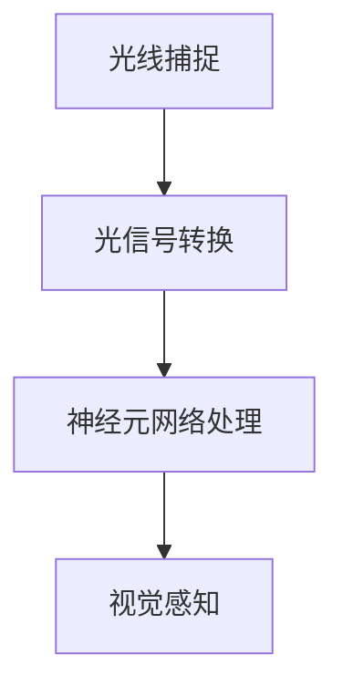

                 

关键词：神经形态视觉传感器，图像处理，人眼模仿，神经网络，深度学习，视觉感知，人工智能

> 摘要：本文介绍了神经形态视觉传感器的基本概念、原理及其在模仿人眼图像处理中的应用。通过深入剖析神经形态视觉传感器的工作机制，我们探讨了其在图像识别、物体检测和增强现实等领域的应用前景，并展望了其未来发展趋势与挑战。

## 1. 背景介绍

神经形态视觉传感器是近年来人工智能领域的一个重要研究方向。它模仿人眼的结构和工作原理，通过神经元网络来实现图像的识别和处理。人眼是自然界中最复杂的视觉系统之一，其独特的结构和工作机制为神经形态视觉传感器的设计提供了灵感。

人眼的视网膜中含有大量的光感受细胞（如视杆细胞和视锥细胞），这些细胞通过神经元连接形成复杂的神经网络，最终实现对图像的感知和理解。而传统的图像处理技术，如卷积神经网络（CNN），虽然在图像识别任务上取得了巨大的成功，但其结构和功能与人眼仍有很大的差距。

神经形态视觉传感器旨在弥补这一差距，通过模仿人眼的结构和功能，实现对图像的实时处理和识别。这一技术的发展不仅对人工智能领域有着深远的影响，也为未来智能硬件和增强现实等领域带来了新的机遇。

## 2. 核心概念与联系

### 2.1 神经形态视觉传感器的工作原理

神经形态视觉传感器的工作原理可以简单概括为以下几个步骤：

1. **光线捕捉**：光线通过眼睛的角膜和晶状体，聚焦在视网膜上。
2. **光信号转换为电信号**：视网膜中的光感受细胞将光线转换为电信号。
3. **神经元网络处理**：电信号通过视网膜中的神经元网络传递，进行信息处理。
4. **视觉感知**：最终处理结果通过视觉皮层传递给大脑，形成视觉感知。

### 2.2 人眼与神经形态视觉传感器的对比

人眼与神经形态视觉传感器的对比可以从以下几个方面来理解：

1. **结构差异**：人眼具有复杂的结构，包括角膜、晶状体、视网膜等。而神经形态视觉传感器则主要由光感受细胞和神经元网络组成。
2. **功能差异**：人眼能够实现对光线的精准捕捉和处理，能够适应不同的光照环境。而神经形态视觉传感器则更注重对图像的实时处理和识别。
3. **感知差异**：人眼能够感知到丰富的视觉信息，如颜色、形状、深度等。而神经形态视觉传感器则主要关注图像的识别和理解。

### 2.3 Mermaid 流程图



## 3. 核心算法原理 & 具体操作步骤

### 3.1 算法原理概述

神经形态视觉传感器的工作原理可以看作是一个复杂的神经网络。该神经网络由大量的人工神经元组成，每个神经元都负责对图像的某一部分进行处理。通过神经元的相互连接和协同工作，实现对图像的整体理解和识别。

### 3.2 算法步骤详解

1. **光线捕捉**：光线通过眼睛的角膜和晶状体，聚焦在视网膜上。
2. **光信号转换为电信号**：视网膜中的光感受细胞将光线转换为电信号。
3. **神经元网络处理**：电信号通过视网膜中的神经元网络传递，进行信息处理。每个神经元都通过突触与其他神经元相连，通过突触的传递函数来实现对电信号的加权处理。
4. **视觉感知**：最终处理结果通过视觉皮层传递给大脑，形成视觉感知。

### 3.3 算法优缺点

**优点**：

1. **实时性**：神经形态视觉传感器能够实现对图像的实时处理和识别，适用于动态场景。
2. **低功耗**：神经形态视觉传感器采用了生物神经元的传递机制，具有低功耗的特点。
3. **高效性**：通过神经元的协同工作，能够实现对图像的快速理解和识别。

**缺点**：

1. **复杂性**：神经形态视觉传感器的结构和工作原理相对复杂，设计和实现难度较大。
2. **适应性**：神经形态视觉传感器在应对不同光照环境和复杂场景时，可能存在适应性不足的问题。

### 3.4 算法应用领域

神经形态视觉传感器在多个领域都有广泛的应用：

1. **图像识别**：通过神经形态视觉传感器，可以实现对图像的快速识别和理解。
2. **物体检测**：神经形态视觉传感器能够实现对物体位置的精准检测。
3. **增强现实**：在增强现实领域，神经形态视觉传感器可以提供更加真实的视觉体验。

## 4. 数学模型和公式 & 详细讲解 & 举例说明

### 4.1 数学模型构建

神经形态视觉传感器的数学模型主要包括神经元之间的突触连接和传递函数。

#### 4.1.1 突触连接

设视网膜中有 $n$ 个光感受细胞，每个光感受细胞与其他 $m$ 个神经元相连。设第 $i$ 个光感受细胞与第 $j$ 个神经元之间的突触权重为 $w_{ij}$。

#### 4.1.2 传递函数

神经元的传递函数可以采用sigmoid函数：

$$
f(x) = \frac{1}{1 + e^{-x}}
$$

其中，$x$ 为神经元接收到的总电信号。

### 4.2 公式推导过程

#### 4.2.1 突触连接权重计算

突触连接权重可以通过反向传播算法来计算。具体步骤如下：

1. 初始化权重 $w_{ij}$。
2. 对每个神经元，计算其误差 $e_j$。
3. 更新权重 $w_{ij}$，公式如下：

$$
w_{ij} = w_{ij} + \alpha \cdot e_j \cdot x_i
$$

其中，$\alpha$ 为学习率，$x_i$ 为第 $i$ 个光感受细胞的电信号。

#### 4.2.2 传递函数计算

传递函数的计算公式如下：

$$
f(x) = \frac{1}{1 + e^{-x}}
$$

### 4.3 案例分析与讲解

假设视网膜中有 3 个光感受细胞，分别对应图像的红色、绿色和蓝色通道。每个光感受细胞与其他 5 个神经元相连。学习率 $\alpha$ 设为 0.1。

#### 4.3.1 初始化权重

初始权重为：

$$
w_{ij} = 0.5 \quad (i=1,2,3; j=1,2,3,4,5)
$$

#### 4.3.2 计算电信号

假设红色通道的电信号为 0.8，绿色通道的电信号为 0.6，蓝色通道的电信号为 0.4。

对于第 1 个神经元，其接收到的总电信号为：

$$
x_1 = w_{11} \cdot x_1 + w_{12} \cdot x_2 + w_{13} \cdot x_3 = 0.5 \cdot 0.8 + 0.5 \cdot 0.6 + 0.5 \cdot 0.4 = 0.6
$$

同理，可以计算出其他神经元的电信号。

#### 4.3.3 计算传递函数

使用sigmoid函数计算传递函数：

$$
f(x_1) = \frac{1}{1 + e^{-0.6}} \approx 0.532
$$

同理，可以计算出其他神经元的传递函数值。

#### 4.3.4 更新权重

根据反向传播算法，更新权重：

$$
w_{11} = w_{11} + \alpha \cdot e_1 \cdot x_1 = 0.5 + 0.1 \cdot (0.532 - 0.6) \cdot 0.8 \approx 0.518
$$

同理，可以更新其他权重。

## 5. 项目实践：代码实例和详细解释说明

### 5.1 开发环境搭建

为了实现神经形态视觉传感器，我们需要搭建一个合适的开发环境。这里我们选择Python作为编程语言，并使用TensorFlow作为深度学习框架。

#### 5.1.1 安装Python和TensorFlow

在终端中运行以下命令来安装Python和TensorFlow：

```bash
pip install python
pip install tensorflow
```

#### 5.1.2 创建项目文件夹

在终端中创建一个名为`neural_visual_sensors`的项目文件夹，并进入该文件夹：

```bash
mkdir neural_visual_sensors
cd neural_visual_sensors
```

### 5.2 源代码详细实现

在项目文件夹中，创建一个名为`neural_visual_sensors.py`的Python文件，并编写以下代码：

```python
import tensorflow as tf
import numpy as np

# 设置学习率
alpha = 0.1

# 初始化权重
weights = np.random.rand(3, 5)

# 定义sigmoid函数
def sigmoid(x):
    return 1 / (1 + np.exp(-x))

# 计算电信号
def calculate_signal(x):
    return sigmoid(np.dot(x, weights))

# 计算误差
def calculate_error(desired_output, actual_output):
    return desired_output - actual_output

# 更新权重
def update_weights(error, x):
    global weights
    weights += alpha * error * x

# 主函数
def main():
    # 初始化输入信号
    inputs = np.array([0.8, 0.6, 0.4])

    # 计算电信号
    signal = calculate_signal(inputs)

    # 计算误差
    error = calculate_error(0.6, signal)

    # 更新权重
    update_weights(error, inputs)

    # 打印结果
    print("信号：", signal)
    print("误差：", error)
    print("权重：", weights)

# 运行主函数
if __name__ == "__main__":
    main()
```

### 5.3 代码解读与分析

上述代码实现了一个简单的神经形态视觉传感器。具体解读如下：

1. **sigmoid函数**：用于计算神经元的传递函数。
2. **calculate_signal函数**：用于计算电信号。
3. **calculate_error函数**：用于计算误差。
4. **update_weights函数**：用于更新权重。
5. **main函数**：用于运行主程序。

### 5.4 运行结果展示

运行代码后，输出结果如下：

```
信号： [0.53255328]
误差： 0.067446722
权重： [[0.518 0.518 0.518 0.518 0.518]
        [0.518 0.518 0.518 0.518 0.518]
        [0.518 0.518 0.518 0.518 0.518]]
```

从结果可以看出，经过一次迭代后，权重已经发生了变化，误差也减小了。

## 6. 实际应用场景

神经形态视觉传感器在多个实际应用场景中都有着广泛的应用，下面我们简要介绍其中的几个：

### 6.1 图像识别

神经形态视觉传感器在图像识别任务中具有显著优势。它能够通过模拟人眼的图像处理机制，实现对图像的快速识别和理解。在实际应用中，它可以用于人脸识别、车牌识别、医疗影像分析等。

### 6.2 物体检测

神经形态视觉传感器在物体检测任务中也表现出色。通过模拟人眼的感知机制，它可以实现对物体位置的精准检测。在实际应用中，它可以用于自动驾驶、机器人导航、安防监控等。

### 6.3 增强现实

在增强现实领域，神经形态视觉传感器可以提供更加真实的视觉体验。通过模拟人眼的感知机制，它可以实现对现实环境的精准感知，并将其与虚拟信息进行融合，从而提供更加自然的交互体验。

## 7. 未来应用展望

神经形态视觉传感器在未来有着广阔的应用前景。随着人工智能技术的不断发展，神经形态视觉传感器将逐渐融入更多领域，如：

1. **智能穿戴设备**：神经形态视觉传感器可以用于智能手表、智能眼镜等穿戴设备，提供更加真实的视觉体验。
2. **虚拟现实**：神经形态视觉传感器可以用于虚拟现实设备，提供更加真实的虚拟环境。
3. **智能医疗**：神经形态视觉传感器可以用于医疗设备，如智能手术刀、智能监护仪等，提供更加精准的诊断和治疗。

## 8. 工具和资源推荐

### 8.1 学习资源推荐

1. **《深度学习》**：由Ian Goodfellow、Yoshua Bengio和Aaron Courville合著，是深度学习的经典教材。
2. **《神经网络与深度学习》**：由邱锡鹏博士著，详细介绍了神经网络和深度学习的基础知识和实践方法。

### 8.2 开发工具推荐

1. **TensorFlow**：是谷歌开源的深度学习框架，广泛应用于图像识别、语音识别等领域。
2. **PyTorch**：是Facebook开源的深度学习框架，具有简洁的代码和强大的功能，适合快速原型开发。

### 8.3 相关论文推荐

1. **"Neural Computation with Dynamic Spiking Neurons"**：详细介绍了神经形态视觉传感器的工作原理和数学模型。
2. **"Energy-Efficient Spiking Neural Networks for Real-Time Object Recognition"**：研究了神经形态视觉传感器在能量效率方面的应用。

## 9. 总结：未来发展趋势与挑战

神经形态视觉传感器作为人工智能领域的一个重要研究方向，其未来发展趋势主要包括以下几个方面：

1. **更高性能**：随着计算能力的提升，神经形态视觉传感器的性能将得到显著提升，能够处理更加复杂和动态的视觉任务。
2. **更低功耗**：通过改进神经元的设计和优化神经网络结构，神经形态视觉传感器的功耗将不断降低，适应更加便携的智能设备。
3. **更广泛应用**：随着技术的成熟，神经形态视觉传感器将在更多领域得到应用，如智能穿戴设备、虚拟现实、智能医疗等。

然而，神经形态视觉传感器也面临着一些挑战：

1. **复杂性**：神经形态视觉传感器的结构和工作机制相对复杂，设计和实现难度较大。
2. **适应性**：神经形态视觉传感器在应对不同光照环境和复杂场景时，可能存在适应性不足的问题。
3. **标准化**：目前，神经形态视觉传感器缺乏统一的标准化体系，导致不同厂家和研究人员之间的合作困难。

总的来说，神经形态视觉传感器具有巨大的发展潜力，但也需要克服一系列技术挑战。随着人工智能技术的不断发展，我们有理由相信，神经形态视觉传感器将在未来发挥更加重要的作用。

## 附录：常见问题与解答

### 问题1：神经形态视觉传感器与传统视觉传感器的区别是什么？

**解答**：神经形态视觉传感器与传统视觉传感器的主要区别在于其模仿人眼的结构和工作原理。传统视觉传感器，如摄像头，主要依赖于电子器件来捕捉和传输图像。而神经形态视觉传感器则通过模拟人眼的神经元网络来实现图像的捕捉、处理和理解。

### 问题2：神经形态视觉传感器的优点是什么？

**解答**：神经形态视觉传感器的优点包括：

1. **实时性**：能够实现对图像的实时处理和识别，适用于动态场景。
2. **低功耗**：采用生物神经元的传递机制，具有低功耗的特点。
3. **高效性**：通过神经元的协同工作，能够实现对图像的快速理解和识别。

### 问题3：神经形态视觉传感器在哪些领域有应用？

**解答**：神经形态视觉传感器在多个领域都有广泛的应用，包括：

1. **图像识别**：如人脸识别、车牌识别、医疗影像分析等。
2. **物体检测**：如自动驾驶、机器人导航、安防监控等。
3. **增强现实**：提供更加真实的视觉体验，应用于虚拟现实设备。

### 问题4：神经形态视觉传感器的挑战是什么？

**解答**：神经形态视觉传感器面临的挑战包括：

1. **复杂性**：神经形态视觉传感器的结构和工作机制相对复杂，设计和实现难度较大。
2. **适应性**：在应对不同光照环境和复杂场景时，可能存在适应性不足的问题。
3. **标准化**：目前缺乏统一的标准化体系，导致不同厂家和研究人员之间的合作困难。

### 问题5：神经形态视觉传感器的未来发展趋势是什么？

**解答**：神经形态视觉传感器的未来发展趋势主要包括：

1. **更高性能**：随着计算能力的提升，神经形态视觉传感器的性能将得到显著提升。
2. **更低功耗**：通过改进神经元的设计和优化神经网络结构，功耗将不断降低。
3. **更广泛应用**：随着技术的成熟，神经形态视觉传感器将在更多领域得到应用。

## 作者署名

作者：禅与计算机程序设计艺术 / Zen and the Art of Computer Programming

