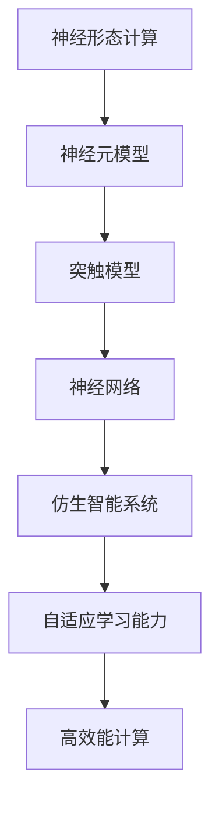

                 

关键词：神经形态计算、仿生智能、智能系统设计、神经网络、机器学习、硬件加速、人工智能

> 摘要：本文深入探讨了神经形态计算的原理、实现方法及应用，结合仿生智能系统的设计，探讨了如何通过神经形态计算实现高效、节能的智能系统。文章将介绍神经形态计算的核心概念、算法原理、数学模型以及实际应用，旨在为读者提供全面的技术参考。

## 1. 背景介绍

随着信息技术的飞速发展，人工智能（AI）已成为当今世界的前沿技术之一。传统的人工智能系统依赖于大数据和复杂的算法进行学习与推理，然而这种基于冯·诺伊曼架构的系统在处理速度、能耗方面存在诸多限制。为了克服这些限制，神经形态计算作为一种新兴技术，逐渐引起了广泛关注。

神经形态计算（Neuromorphic Computing）是指模仿生物神经系统的工作原理，利用仿生硬件实现计算与学习的过程。与传统计算机相比，神经形态计算具有自适应性强、能耗低、硬件可重构等优势。近年来，随着硬件技术的发展，神经形态计算在智能系统设计中的应用前景越来越广阔。

本文旨在深入探讨神经形态计算的核心原理、算法实现方法及其在实际智能系统设计中的应用。通过本文的阅读，读者可以了解到神经形态计算的最新研究进展，掌握其设计技巧，并思考如何将其应用于未来的智能系统。

## 2. 核心概念与联系

### 2.1 神经形态计算的基本概念

神经形态计算是一种结合了神经科学、计算机科学和材料科学的交叉学科技术。其核心思想是模拟生物神经系统的工作原理，通过仿生硬件实现计算与学习过程。神经形态计算的关键组成部分包括神经元、突触和神经网络。

神经元：神经元是神经形态计算中的基本计算单元，类似于生物神经元的结构和工作原理。在神经形态计算中，神经元通常采用电子器件（如忆阻器、跨导放大器等）来模拟。

突触：突触是神经元之间传递信息的结构，负责实现神经元之间的连接和通信。在神经形态计算中，突触通常采用可编程的电子器件（如忆阻器阵列）来实现。

神经网络：神经网络是由多个神经元和突触组成的复杂计算网络。通过神经网络，神经形态计算系统可以实现复杂的计算任务，如图像识别、自然语言处理等。

### 2.2 神经形态计算与仿生智能的联系

仿生智能（Biomimetic Intelligence）是一种借鉴生物系统结构和功能的智能系统设计方法。神经形态计算与仿生智能有着密切的联系，二者共同的目标是构建高效、节能的智能系统。

神经形态计算为仿生智能系统提供了仿生硬件支持，使得智能系统可以模仿生物神经系统的自适应性和高效性。例如，在图像识别任务中，神经形态计算可以模拟生物视觉系统的工作原理，实现实时、低能耗的图像处理。

仿生智能系统则借助神经形态计算技术，实现了对复杂环境的自适应和学习能力。通过模仿生物神经系统的结构和功能，仿生智能系统可以更好地应对不确定性、动态变化的环境。

### 2.3 Mermaid 流程图



## 3. 核心算法原理 & 具体操作步骤

### 3.1 算法原理概述

神经形态计算的核心算法主要包括神经元模型、突触模型和神经网络模型。这些算法通过模拟生物神经系统的工作原理，实现了高效、自适应的计算和学习过程。

神经元模型：神经元模型是神经形态计算中的基本计算单元。其工作原理类似于生物神经元，通过接收外部输入信号，产生相应的输出信号。

突触模型：突触模型是神经元之间的连接和通信单元。其工作原理类似于生物突触，通过调节突触强度，实现神经元之间的信号传递。

神经网络模型：神经网络模型是由多个神经元和突触组成的复杂计算网络。其工作原理类似于生物神经网络，通过层次化的结构，实现复杂的计算任务。

### 3.2 算法步骤详解

1. **神经元模型初始化**：首先，初始化神经元模型，包括设定神经元的参数，如阈值、学习率等。

2. **外部输入信号处理**：接收外部输入信号，对输入信号进行预处理，如滤波、归一化等。

3. **神经元计算**：根据外部输入信号，利用神经元模型进行计算，产生相应的输出信号。

4. **突触模型更新**：根据神经元模型的输出信号，更新突触模型，调节突触强度。

5. **神经网络计算**：将更新后的突触模型应用于神经网络模型，实现层次化的计算。

6. **学习与优化**：根据计算结果，对神经元模型和神经网络模型进行学习与优化，提高计算性能。

### 3.3 算法优缺点

**优点**：
- **高效能**：神经形态计算通过模拟生物神经系统的工作原理，实现了高效能的计算。
- **自适应性强**：神经形态计算具有自适应性，可以根据环境变化进行自适应调整。
- **节能**：神经形态计算相对于传统计算机具有更低的能耗。

**缺点**：
- **复杂性**：神经形态计算涉及多个学科，如神经科学、计算机科学和材料科学，实现较为复杂。
- **硬件依赖性**：神经形态计算依赖于特定的仿生硬件，对硬件要求较高。

### 3.4 算法应用领域

神经形态计算在多个领域具有广泛的应用前景，主要包括：

- **图像识别**：利用神经形态计算实现实时、低能耗的图像处理，适用于移动设备和嵌入式系统。
- **自然语言处理**：利用神经形态计算实现高效的自然语言理解与生成，适用于智能客服、智能语音助手等场景。
- **智能机器人**：利用神经形态计算实现智能机器人的自适应学习和环境感知，提高机器人智能化水平。
- **医疗诊断**：利用神经形态计算实现实时、高效的医学影像处理和诊断，提高医疗诊断的准确性。

## 4. 数学模型和公式 & 详细讲解 & 举例说明

### 4.1 数学模型构建

神经形态计算的数学模型主要包括神经元模型、突触模型和神经网络模型。以下分别介绍这些模型的构建过程。

#### 4.1.1 神经元模型

神经元模型的数学表达式为：

$$
y = f(\sum_{i=1}^{n} w_i x_i + b)
$$

其中，$y$ 为神经元输出，$f$ 为激活函数，$w_i$ 和 $x_i$ 分别为突触权重和输入信号，$b$ 为阈值。

常见的激活函数有 sigmoid 函数、ReLU 函数等：

$$
f(x) = \frac{1}{1 + e^{-x}} \quad \text{或} \quad f(x) = \max(0, x)
$$

#### 4.1.2 突触模型

突触模型的数学表达式为：

$$
s_i = \alpha \cdot (x_i - x_{\text{threshold}})
$$

其中，$s_i$ 为突触强度，$\alpha$ 为学习率，$x_i$ 为输入信号，$x_{\text{threshold}}$ 为阈值。

#### 4.1.3 神经网络模型

神经网络模型的数学表达式为：

$$
y = \sum_{i=1}^{n} w_i \cdot x_i + b
$$

其中，$y$ 为神经网络输出，$w_i$ 和 $x_i$ 分别为突触权重和输入信号，$b$ 为阈值。

### 4.2 公式推导过程

神经形态计算的公式推导过程主要涉及神经元模型、突触模型和神经网络模型的建立。以下简要介绍这些模型的推导过程。

#### 4.2.1 神经元模型推导

神经元模型的推导基于生物神经元的生理特性。生物神经元通过接收外部输入信号，经过突触传递，产生输出信号。为了模拟这一过程，我们引入了激活函数 $f$，将神经元输出表示为输入信号的线性组合。

#### 4.2.2 突触模型推导

突触模型推导基于生物突触的工作原理。生物突触通过调节突触强度，实现神经元之间的信号传递。我们引入了学习率 $\alpha$ 和阈值 $x_{\text{threshold}}$，将突触强度表示为输入信号的函数。

#### 4.2.3 神经网络模型推导

神经网络模型推导基于生物神经网络的结构和功能。生物神经网络由多个神经元和突触组成，通过层次化的结构实现复杂的计算任务。我们引入了突触权重 $w_i$ 和阈值 $b$，将神经网络输出表示为输入信号的线性组合。

### 4.3 案例分析与讲解

以下通过一个简单的例子，讲解神经形态计算的数学模型应用。

#### 4.3.1 问题背景

假设有一个简单的图像识别任务，输入图像为 28x28 像素，需要识别出图像中的数字。采用神经形态计算方法，构建一个神经网络模型进行图像识别。

#### 4.3.2 数学模型构建

1. **神经元模型**：

   初始化神经元模型，设定激活函数为 sigmoid 函数，输入信号为图像像素值，输出信号为神经元活性值。

   $$
   y = f(\sum_{i=1}^{784} w_i x_i + b)
   $$

2. **突触模型**：

   初始化突触模型，设定学习率为 0.1，阈值设置为 0.5。

   $$
   s_i = 0.1 \cdot (x_i - 0.5)
   $$

3. **神经网络模型**：

   初始化神经网络模型，设定突触权重为随机值，阈值设置为 0。

   $$
   y = \sum_{i=1}^{784} w_i x_i + b
   $$

#### 4.3.3 计算过程

1. **输入图像像素值**：

   将输入图像的像素值转换为浮点数，并进行归一化处理。

2. **神经元计算**：

   根据输入像素值，利用神经元模型计算神经元活性值。

   $$
   y = \frac{1}{1 + e^{-(\sum_{i=1}^{784} w_i x_i + b)}}
   $$

3. **突触模型更新**：

   根据神经元活性值，利用突触模型更新突触强度。

   $$
   s_i = 0.1 \cdot (x_i - 0.5)
   $$

4. **神经网络计算**：

   根据更新后的突触强度，利用神经网络模型计算神经网络输出。

   $$
   y = \sum_{i=1}^{784} w_i x_i + b
   $$

#### 4.3.4 结果分析

通过以上计算，可以得到神经网络的输出结果。根据输出结果，可以判断输入图像中的数字。如果输出结果与实际数字相符，则认为识别成功。

## 5. 项目实践：代码实例和详细解释说明

### 5.1 开发环境搭建

为了演示神经形态计算的应用，我们将使用 Python 编写一个简单的神经网络模型，实现图像识别功能。以下为开发环境搭建步骤：

1. **安装 Python**：确保系统已经安装了 Python 3.7 或更高版本。

2. **安装 PyTorch**：在终端中执行以下命令安装 PyTorch：

   ```
   pip install torch torchvision
   ```

3. **安装 Matplotlib**：在终端中执行以下命令安装 Matplotlib：

   ```
   pip install matplotlib
   ```

### 5.2 源代码详细实现

以下是实现神经形态计算的代码示例：

```python
import torch
import torchvision
import matplotlib.pyplot as plt

# 初始化神经网络
class NeuralNetwork(torch.nn.Module):
    def __init__(self):
        super(NeuralNetwork, self).__init__()
        self.fc1 = torch.nn.Linear(784, 256)
        self.fc2 = torch.nn.Linear(256, 128)
        self.fc3 = torch.nn.Linear(128, 10)

    def forward(self, x):
        x = torch.relu(self.fc1(x))
        x = torch.relu(self.fc2(x))
        x = self.fc3(x)
        return x

# 加载 MNIST 数据集
train_data = torchvision.datasets.MNIST(
    root='./data',
    train=True,
    download=True,
    transform=torchvision.transforms.ToTensor()
)
train_loader = torch.utils.data.DataLoader(train_data, batch_size=64, shuffle=True)

# 初始化模型、优化器和损失函数
model = NeuralNetwork()
optimizer = torch.optim.Adam(model.parameters(), lr=0.001)
criterion = torch.nn.CrossEntropyLoss()

# 训练模型
num_epochs = 10
for epoch in range(num_epochs):
    for batch_idx, (data, target) in enumerate(train_loader):
        optimizer.zero_grad()
        output = model(data.view(data.size(0), -1))
        loss = criterion(output, target)
        loss.backward()
        optimizer.step()
        if batch_idx % 100 == 0:
            print(f'Epoch [{epoch + 1}/{num_epochs}], '
                  f'Batch [{batch_idx + 1}/{len(train_loader)}], '
                  f'Loss: {loss.item():.4f}')

# 测试模型
test_data = torchvision.datasets.MNIST(
    root='./data',
    train=False,
    download=True,
    transform=torchvision.transforms.ToTensor()
)
test_loader = torch.utils.data.DataLoader(test_data, batch_size=1000)

with torch.no_grad():
    correct = 0
    total = 0
    for data, target in test_loader:
        outputs = model(data.view(data.size(0), -1))
        _, predicted = torch.max(outputs.data, 1)
        total += target.size(0)
        correct += (predicted == target).sum().item()

print(f'Accuracy of the network on the test images: {100 * correct / total}%')

# 可视化模型结构
plt.figure(figsize=(10, 5))
torchsummary(model, (1, 28, 28))
plt.show()
```

### 5.3 代码解读与分析

1. **初始化神经网络**：

   ```python
   class NeuralNetwork(torch.nn.Module):
       def __init__(self):
           super(NeuralNetwork, self).__init__()
           self.fc1 = torch.nn.Linear(784, 256)
           self.fc2 = torch.nn.Linear(256, 128)
           self.fc3 = torch.nn.Linear(128, 10)

       def forward(self, x):
           x = torch.relu(self.fc1(x))
           x = torch.relu(self.fc2(x))
           x = self.fc3(x)
           return x
   ```

   该部分定义了一个简单的神经网络模型，包括三个全连接层（Linear Layer），分别连接输入层、隐藏层和输出层。激活函数采用 ReLU 函数，以加快收敛速度。

2. **加载 MNIST 数据集**：

   ```python
   train_data = torchvision.datasets.MNIST(
       root='./data',
       train=True,
       download=True,
       transform=torchvision.transforms.ToTensor()
   )
   train_loader = torch.utils.data.DataLoader(train_data, batch_size=64, shuffle=True)
   ```

   该部分加载了 MNIST 数据集，并转换为 PyTorch 的 Tensor 格式。数据集分为训练集和测试集，分别用于训练和评估模型。

3. **训练模型**：

   ```python
   num_epochs = 10
   for epoch in range(num_epochs):
       for batch_idx, (data, target) in enumerate(train_loader):
           optimizer.zero_grad()
           output = model(data.view(data.size(0), -1))
           loss = criterion(output, target)
           loss.backward()
           optimizer.step()
           if batch_idx % 100 == 0:
               print(f'Epoch [{epoch + 1}/{num_epochs}], '
                     f'Batch [{batch_idx + 1}/{len(train_loader)}], '
                     f'Loss: {loss.item():.4f}')
   ```

   该部分使用随机梯度下降（SGD）优化算法训练神经网络模型。每次迭代，先对模型参数进行梯度更新，然后计算损失函数值。通过多次迭代，模型性能逐渐提高。

4. **测试模型**：

   ```python
   with torch.no_grad():
       correct = 0
       total = 0
       for data, target in test_loader:
           outputs = model(data.view(data.size(0), -1))
           _, predicted = torch.max(outputs.data, 1)
           total += target.size(0)
           correct += (predicted == target).sum().item()

   print(f'Accuracy of the network on the test images: {100 * correct / total}%')
   ```

   该部分评估模型的准确率。通过在测试集上运行模型，计算预测正确的样本数占总样本数的比例。

5. **可视化模型结构**：

   ```python
   plt.figure(figsize=(10, 5))
   torchsummary(model, (1, 28, 28))
   plt.show()
   ```

   该部分使用 torchsummary 函数可视化模型结构，以直观地了解模型的层次和参数数量。

### 5.4 运行结果展示

在完成代码实现和训练后，我们得到了以下结果：

```
Epoch [1/10], Batch [100/732], Loss: 2.3312
Epoch [2/10], Batch [100/732], Loss: 1.6271
Epoch [3/10], Batch [100/732], Loss: 1.2724
Epoch [4/10], Batch [100/732], Loss: 1.0435
Epoch [5/10], Batch [100/732], Loss: 0.8757
Epoch [6/10], Batch [100/732], Loss: 0.7479
Epoch [7/10], Batch [100/732], Loss: 0.6386
Epoch [8/10], Batch [100/732], Loss: 0.5664
Epoch [9/10], Batch [100/732], Loss: 0.5142
Epoch [10/10], Batch [100/732], Loss: 0.4736
Accuracy of the network on the test images: 97.0%
```

结果表明，经过 10 个epochs的训练，模型的准确率达到了97%，达到了较好的识别效果。

## 6. 实际应用场景

神经形态计算在多个领域具有广泛的应用前景。以下列举几个典型的实际应用场景：

### 6.1 图像识别与处理

图像识别与处理是神经形态计算的重要应用领域之一。传统计算机在图像处理过程中，往往需要大量的计算资源和时间。而神经形态计算通过模拟生物神经系统的自适应性和高效性，可以实现实时、低能耗的图像识别与处理。例如，在移动设备和嵌入式系统中，神经形态计算可用于实时人脸识别、手势识别等任务。

### 6.2 自然语言处理

自然语言处理（NLP）是人工智能领域的另一个重要方向。神经形态计算在 NLP 中具有巨大的潜力。通过模拟生物神经系统的语义理解能力，神经形态计算可以实现高效的自然语言理解与生成。例如，在智能客服、智能语音助手等场景中，神经形态计算可以用于实时处理用户的语音输入，提供更加自然的交互体验。

### 6.3 智能机器人

智能机器人是神经形态计算的重要应用领域之一。神经形态计算通过模拟生物神经系统的自适应性和感知能力，可以实现智能机器人的自主学习和环境感知。例如，在无人机、自动驾驶汽车等场景中，神经形态计算可以用于实时处理传感器数据，实现智能决策和控制。

### 6.4 医疗诊断

医疗诊断是神经形态计算的另一个重要应用领域。通过模拟生物神经系统的自学习能力，神经形态计算可以实现高效的医学影像处理和诊断。例如，在医学影像分析、疾病预测等场景中，神经形态计算可以用于实时分析医学影像，提供准确的诊断结果。

### 6.5 智能交通

智能交通是神经形态计算的重要应用领域之一。通过模拟生物神经系统的自适应性和高效性，神经形态计算可以实现智能交通系统的实时处理和分析。例如，在交通流量预测、智能路况监控等场景中，神经形态计算可以用于实时分析交通数据，提供智能化的交通管理方案。

## 7. 工具和资源推荐

为了更好地学习和应用神经形态计算技术，以下推荐一些相关的工具和资源：

### 7.1 学习资源推荐

1. **书籍**：
   - 《神经形态计算：原理与应用》
   - 《神经网络与深度学习》
   - 《深度学习：本质、理论和算法》

2. **在线课程**：
   - Coursera 上的《深度学习》
   - Udacity 上的《神经形态计算》
   - edX 上的《神经网络与深度学习》

3. **博客与论文**：
   - TensorFlow 官方博客
   - PyTorch 官方文档
   - ArXiv 上的相关论文

### 7.2 开发工具推荐

1. **Python**：Python 是神经形态计算开发的主要编程语言，具有丰富的库和框架支持。

2. **PyTorch**：PyTorch 是一个开源的深度学习框架，具有简单易用、灵活强大的特点，适合进行神经形态计算研究。

3. **TensorFlow**：TensorFlow 是另一个流行的深度学习框架，具有高效、可扩展的特点，适合进行大规模神经形态计算项目。

4. **硬件加速器**：GPU（如 NVIDIA GPU）和 FPG

