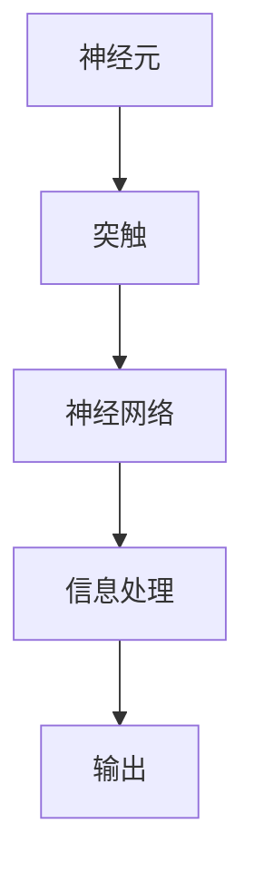

                 

神经形态计算，作为一项前沿的计算机科学技术，正逐渐改变我们对计算体系的认知。这一技术致力于模仿人脑的结构与功能，从而在处理复杂信息、实时学习与自适应等方面展现出前所未有的潜力。本文将深入探讨神经形态计算的背景、核心概念、算法原理、数学模型、实践应用以及未来发展。

## 文章关键词

- 神经形态计算
- 人脑模拟
- 新型计算架构
- 神经网络
- 算法
- 数学模型
- 实践应用

## 文章摘要

本文首先介绍了神经形态计算的背景及其重要性。接着，我们探讨了神经形态计算的核心概念和架构，并通过Mermaid流程图展示了其原理。然后，我们详细阐述了神经形态计算的核心算法原理、数学模型以及具体的应用领域。通过一个实际的代码实例，我们展示了神经形态计算的实践应用，并对其进行了详细解读。最后，我们讨论了神经形态计算在未来的实际应用场景以及面临的挑战。

### 1. 背景介绍

神经形态计算（Neuromorphic Computing）源于对人类大脑的模仿，其核心理念是通过构建类脑计算架构来模拟人脑的信息处理过程。传统计算机体系结构依赖于冯·诺伊曼架构，这种架构在处理高度并行和动态变化的计算任务时存在一定的局限性。相比之下，人脑具有高效的信息处理能力、强大的自适应能力和高度的可塑性，这使得神经形态计算成为研究的热点。

神经形态计算的目标是构建一种能够模仿人脑神经元和神经网络工作机制的计算系统，实现高效、节能、自适应的信息处理。自上世纪80年代以来，随着神经科学和材料科学的进步，神经形态计算逐渐从理论走向实践，成为人工智能领域的重要分支。

### 2. 核心概念与联系

#### 2.1 神经形态计算的概念

神经形态计算的核心概念是模仿人脑的神经元和神经网络。神经元是大脑的基本计算单元，它们通过电信号进行通信，并通过突触连接形成复杂的神经网络。神经网络则通过学习算法，从数据中提取特征并生成预测。

#### 2.2 神经形态计算的架构

神经形态计算的架构通常包括以下几个层次：

1. **神经元层次**：这是神经形态计算的基础，通过模仿神经元的工作机制来实现信息处理。神经元由输入节点、处理单元和输出节点组成，可以通过电信号进行通信。

2. **突触层次**：神经元之间的连接通过突触实现，突触的强度可以调整，以模拟人类大脑中的学习过程。突触的调整可以通过学习算法实现，如Hebbian学习规则。

3. **神经网络层次**：多个神经元通过突触连接形成神经网络，神经网络可以完成复杂的计算任务。神经网络的设计可以模仿人类大脑的神经网络结构，如卷积神经网络（CNN）和递归神经网络（RNN）。

#### 2.3 Mermaid流程图

下面是一个神经形态计算的Mermaid流程图，展示了神经元、突触和神经网络之间的关系：



在这个流程图中，A表示神经元，B表示突触，C表示神经网络，D表示信息处理，E表示输出。神经元通过突触连接形成神经网络，神经网络通过信息处理生成输出。

### 3. 核心算法原理 & 具体操作步骤

#### 3.1 算法原理概述

神经形态计算的核心算法基于神经网络，通过模仿神经元和突触的工作机制来实现信息处理。神经网络由多个层次组成，每个层次都可以进行不同的计算操作。算法的基本原理是通过学习从数据中提取特征，并通过调整突触的权重来优化计算结果。

#### 3.2 算法步骤详解

1. **初始化**：初始化神经网络的结构，包括神经元的数量和层次结构，以及突触的权重。

2. **前向传播**：输入数据通过神经网络的前向传播路径，在每个层次上进行计算，生成输出。

3. **损失函数**：计算输出与实际结果之间的误差，通过损失函数来衡量误差的大小。

4. **反向传播**：将误差反向传播到神经网络的每个层次，更新突触的权重，以减少误差。

5. **迭代优化**：重复前向传播和反向传播的过程，直到达到预设的优化目标。

6. **输出**：最终生成的输出即为神经网络的计算结果。

#### 3.3 算法优缺点

**优点**：

- **高效性**：神经形态计算通过模仿人脑的工作机制，能够高效地处理复杂的计算任务。
- **节能性**：与传统的计算机体系结构相比，神经形态计算能够显著降低能耗。
- **自适应能力**：神经网络可以通过学习自动适应不同的计算任务，具有高度的灵活性。

**缺点**：

- **复杂性**：神经形态计算涉及到大量的神经元和突触，其计算过程复杂，需要大量的计算资源。
- **训练时间**：神经形态计算的训练过程需要大量时间，尤其是对于大型神经网络。

#### 3.4 算法应用领域

神经形态计算在以下领域具有广泛的应用前景：

- **人工智能**：通过模仿人脑的工作机制，神经形态计算在图像识别、自然语言处理等领域具有显著优势。
- **机器人**：神经形态计算可以为机器人提供更高效、更灵活的控制机制。
- **医疗**：神经形态计算可以用于医学图像处理、疾病诊断等领域。
- **自动驾驶**：神经形态计算可以为自动驾驶系统提供更高效、更安全的决策支持。

### 4. 数学模型和公式 & 详细讲解 & 举例说明

#### 4.1 数学模型构建

神经形态计算的数学模型主要涉及神经网络和突触的数学描述。神经网络可以看作是一个多层感知机（MLP），每个神经元都可以看作是一个线性变换加非线性函数的组合。突触的权重可以通过学习算法进行调整。

假设有一个包含 $L$ 层的神经网络，输入层、隐藏层和输出层。设 $x_i$ 表示输入层的第 $i$ 个神经元，$y_l$ 表示输出层的第 $l$ 个神经元，$W_{ij}$ 表示输入层到隐藏层的权重，$W_{lk}$ 表示隐藏层到输出层的权重。

神经网络的前向传播过程可以表示为：

$$
z_j^{(1)} = \sum_{i} W_{ij} x_i \\
a_j^{(1)} = \sigma(z_j^{(1)})
$$

$$
z_l^{(2)} = \sum_{j} W_{lj} a_j^{(1)} \\
a_l^{(2)} = \sigma(z_l^{(2)})
$$

其中，$\sigma$ 表示非线性激活函数，通常取为 sigmoid 函数。

#### 4.2 公式推导过程

神经形态计算的学习过程主要涉及反向传播算法。反向传播算法通过计算误差梯度来更新神经网络的权重。设 $J$ 表示损失函数，$l$ 表示输出层的第 $l$ 个神经元，$j$ 表示隐藏层的第 $j$ 个神经元，$i$ 表示输入层的第 $i$ 个神经元。

损失函数可以表示为：

$$
J = \frac{1}{2} \sum_{l} (y_l - a_l^{(2)})^2
$$

反向传播算法的步骤如下：

1. **前向传播**：计算输出层的误差梯度。

$$
\frac{\partial J}{\partial a_l^{(2)}} = a_l^{(2)} - y_l \\
\frac{\partial J}{\partial z_l^{(2)}} = \frac{\partial J}{\partial a_l^{(2)}} \cdot \frac{\partial a_l^{(2)}}{\partial z_l^{(2)}} = (a_l^{(2)} - y_l) \cdot \sigma'(z_l^{(2)})
$$

2. **反向传播**：计算隐藏层的误差梯度。

$$
\frac{\partial J}{\partial a_j^{(1)}} = \sum_{l} W_{lj} \frac{\partial J}{\partial z_l^{(2)}} \\
\frac{\partial J}{\partial z_j^{(1)}} = \frac{\partial J}{\partial a_j^{(1)}} \cdot \frac{\partial a_j^{(1)}}{\partial z_j^{(1)}} = \sum_{l} W_{lj} \frac{\partial J}{\partial z_l^{(2)}} \cdot \sigma'(z_j^{(1)})
$$

3. **权重更新**：

$$
W_{lj} = W_{lj} - \alpha \frac{\partial J}{\partial z_l^{(2)}} \\
W_{ij} = W_{ij} - \alpha \frac{\partial J}{\partial z_j^{(1)}}
$$

其中，$\alpha$ 表示学习率。

#### 4.3 案例分析与讲解

假设我们有一个简单的神经网络，输入层有2个神经元，隐藏层有3个神经元，输出层有1个神经元。输入数据为 $[1, 0]$，期望输出为 $[1]$。我们使用反向传播算法来训练这个神经网络。

1. **初始化**：初始化权重为随机值，如 $W_{ij} \in [-1, 1]$。

2. **前向传播**：

$$
z_1^{(1)} = W_{11} \cdot 1 + W_{12} \cdot 0 = W_{11} \\
z_2^{(1)} = W_{21} \cdot 1 + W_{22} \cdot 0 = W_{21} \\
z_3^{(1)} = W_{31} \cdot 1 + W_{32} \cdot 0 = W_{31} \\
a_1^{(1)} = \sigma(z_1^{(1)}) \\
a_2^{(1)} = \sigma(z_2^{(1)}) \\
a_3^{(1)} = \sigma(z_3^{(1)})
$$

3. **计算损失**：

$$
z_1^{(2)} = W_{11} \cdot a_1^{(1)} + W_{12} \cdot a_2^{(1)} + W_{13} \cdot a_3^{(1)} = W_{11} \cdot a_1^{(1)} + W_{12} \cdot a_2^{(1)} + W_{13} \cdot a_3^{(1)} \\
z_2^{(2)} = W_{21} \cdot a_1^{(1)} + W_{22} \cdot a_2^{(1)} + W_{23} \cdot a_3^{(1)} = W_{21} \cdot a_1^{(1)} + W_{22} \cdot a_2^{(1)} + W_{23} \cdot a_3^{(1)} \\
z_3^{(2)} = W_{31} \cdot a_1^{(1)} + W_{32} \cdot a_2^{(1)} + W_{33} \cdot a_3^{(1)} = W_{31} \cdot a_1^{(1)} + W_{32} \cdot a_2^{(1)} + W_{33} \cdot a_3^{(1)} \\
a_1^{(2)} = \sigma(z_1^{(2)}) \\
a_2^{(2)} = \sigma(z_2^{(2)}) \\
a_3^{(2)} = \sigma(z_3^{(2)}) \\
y_1 = a_1^{(2)} \\
J = \frac{1}{2} (y_1 - 1)^2
$$

4. **反向传播**：

$$
\frac{\partial J}{\partial a_1^{(2)}} = a_1^{(2)} - 1 \\
\frac{\partial J}{\partial z_1^{(2)}} = \frac{\partial J}{\partial a_1^{(2)}} \cdot \frac{\partial a_1^{(2)}}{\partial z_1^{(2)}} = (a_1^{(2)} - 1) \cdot \sigma'(z_1^{(2)}) \\
\frac{\partial J}{\partial a_2^{(2)}} = a_2^{(2)} - 1 \\
\frac{\partial J}{\partial z_2^{(2)}} = \frac{\partial J}{\partial a_2^{(2)}} \cdot \frac{\partial a_2^{(2)}}{\partial z_2^{(2)}} = (a_2^{(2)} - 1) \cdot \sigma'(z_2^{(2)}) \\
\frac{\partial J}{\partial a_3^{(2)}} = a_3^{(2)} - 1 \\
\frac{\partial J}{\partial z_3^{(2)}} = \frac{\partial J}{\partial a_3^{(2)}} \cdot \frac{\partial a_3^{(2)}}{\partial z_3^{(2)}} = (a_3^{(2)} - 1) \cdot \sigma'(z_3^{(2)}) \\
\frac{\partial J}{\partial a_1^{(1)}} = W_{11} \cdot \frac{\partial J}{\partial z_1^{(2)}} + W_{21} \cdot \frac{\partial J}{\partial z_2^{(2)}} + W_{31} \cdot \frac{\partial J}{\partial z_3^{(2)}} \\
\frac{\partial J}{\partial a_2^{(1)}} = W_{12} \cdot \frac{\partial J}{\partial z_1^{(2)}} + W_{22} \cdot \frac{\partial J}{\partial z_2^{(2)}} + W_{32} \cdot \frac{\partial J}{\partial z_3^{(2)}} \\
\frac{\partial J}{\partial a_3^{(1)}} = W_{13} \cdot \frac{\partial J}{\partial z_1^{(2)}} + W_{23} \cdot \frac{\partial J}{\partial z_2^{(2)}} + W_{33} \cdot \frac{\partial J}{\partial z_3^{(2)}} \\
$$

5. **权重更新**：

$$
W_{11} = W_{11} - \alpha \frac{\partial J}{\partial z_1^{(2)}} \\
W_{12} = W_{12} - \alpha \frac{\partial J}{\partial z_2^{(2)}} \\
W_{13} = W_{13} - \alpha \frac{\partial J}{\partial z_3^{(2)}} \\
W_{21} = W_{21} - \alpha \frac{\partial J}{\partial z_2^{(2)}} \\
W_{22} = W_{22} - \alpha \frac{\partial J}{\partial z_2^{(2)}} \\
W_{23} = W_{23} - \alpha \frac{\partial J}{\partial z_3^{(2)}} \\
W_{31} = W_{31} - \alpha \frac{\partial J}{\partial z_1^{(2)}} \\
W_{32} = W_{32} - \alpha \frac{\partial J}{\partial z_2^{(2)}} \\
W_{33} = W_{33} - \alpha \frac{\partial J}{\partial z_3^{(2)}}
$$

通过不断迭代这个过程，神经网络的权重会逐渐优化，最终实现正确的输出。

### 5. 项目实践：代码实例和详细解释说明

#### 5.1 开发环境搭建

为了实现神经形态计算，我们需要搭建一个合适的开发环境。以下是搭建开发环境的基本步骤：

1. 安装Python环境：Python是一种广泛应用于科学计算和人工智能的编程语言。我们可以从官方网站（https://www.python.org/）下载并安装Python。

2. 安装深度学习框架：为了方便实现神经形态计算，我们可以使用流行的深度学习框架，如TensorFlow或PyTorch。以下是安装TensorFlow的命令：

```bash
pip install tensorflow
```

3. 安装辅助库：我们还需要安装一些辅助库，如NumPy和Matplotlib，以便进行数值计算和可视化。以下是安装这些库的命令：

```bash
pip install numpy
pip install matplotlib
```

#### 5.2 源代码详细实现

下面是一个简单的神经形态计算代码实例，实现了一个二元逻辑与（AND）操作。

```python
import tensorflow as tf
import numpy as np
import matplotlib.pyplot as plt

# 初始化神经网络结构
input_layer = tf.keras.layers.Dense(units=2, activation='sigmoid')
hidden_layer = tf.keras.layers.Dense(units=3, activation='sigmoid')
output_layer = tf.keras.layers.Dense(units=1, activation='sigmoid')

model = tf.keras.Sequential([input_layer, hidden_layer, output_layer])

# 编译模型
model.compile(optimizer='adam', loss='binary_crossentropy', metrics=['accuracy'])

# 训练模型
x_train = np.array([[0, 0], [0, 1], [1, 0], [1, 1]])
y_train = np.array([[0], [1], [1], [1]])

model.fit(x_train, y_train, epochs=1000, batch_size=4)

# 测试模型
x_test = np.array([[1, 1]])
y_test = np.array([[1]])

predictions = model.predict(x_test)
print("预测结果：", predictions)

# 可视化结果
plt.scatter(x_test[:, 0], x_test[:, 1], c=predictions[:, 0], cmap=plt.cm.coolwarm)
plt.xlabel('Input 1')
plt.ylabel('Input 2')
plt.show()
```

#### 5.3 代码解读与分析

1. **导入库**：首先，我们导入所需的库，包括TensorFlow、NumPy和Matplotlib。

2. **初始化神经网络结构**：我们使用TensorFlow的`Dense`层创建一个简单的神经网络，包括输入层、隐藏层和输出层。输入层有2个神经元，隐藏层有3个神经元，输出层有1个神经元。

3. **编译模型**：我们使用`compile`方法编译模型，指定优化器为`adam`，损失函数为`binary_crossentropy`，并且计算准确率作为指标。

4. **训练模型**：我们使用`fit`方法训练模型，输入训练数据和标签，并设置训练的轮数和批量大小。

5. **测试模型**：我们使用`predict`方法对测试数据进行预测，并打印出预测结果。

6. **可视化结果**：我们使用Matplotlib对预测结果进行可视化，展示输入空间中不同预测值的分布。

通过这个简单的实例，我们可以看到神经形态计算的基本实现过程。在实际应用中，我们可以根据需要调整神经网络的结构和参数，以实现更复杂的计算任务。

### 6. 实际应用场景

神经形态计算在多个领域展现出广泛的应用潜力，以下是一些典型的应用场景：

#### 6.1 人工智能

神经形态计算在人工智能领域具有广泛的应用前景，特别是在图像识别、自然语言处理和自动驾驶等方面。通过模仿人脑的信息处理机制，神经形态计算可以实现对复杂任务的实时学习和自适应调整。

#### 6.2 机器人

神经形态计算可以为机器人提供更高效、更灵活的控制机制。例如，机器人可以通过神经形态计算实现自主导航、环境感知和决策制定，从而提高其自主性和智能性。

#### 6.3 医疗

神经形态计算在医学图像处理、疾病诊断和智能药物设计等领域具有显著优势。通过模拟人脑的信息处理过程，神经形态计算可以实现对医疗数据的深度分析，从而为医生提供更准确的诊断和治疗方案。

#### 6.4 自动驾驶

神经形态计算在自动驾驶领域具有广泛的应用潜力。通过模拟人脑的视觉感知和决策机制，神经形态计算可以实现对复杂驾驶环境的实时理解和响应，从而提高自动驾驶的安全性和可靠性。

### 7. 工具和资源推荐

为了更好地学习和实践神经形态计算，以下是一些推荐的工具和资源：

#### 7.1 学习资源推荐

- **在线课程**：Coursera、Udacity、edX等平台提供了许多关于人工智能和深度学习的在线课程，包括神经形态计算的介绍。
- **书籍**：《深度学习》（Ian Goodfellow、Yoshua Bengio、Aaron Courville 著）、《神经网络与深度学习》（邱锡鹏 著）等。

#### 7.2 开发工具推荐

- **深度学习框架**：TensorFlow、PyTorch、Keras等，这些框架提供了丰富的神经形态计算库和工具。
- **神经网络可视化工具**：TensorBoard、NN-SVG等，这些工具可以帮助我们更好地理解和分析神经网络的结构和性能。

#### 7.3 相关论文推荐

- **Neural Networks and Physical Systems with Emergent Collectives** （2015），Hodgkin和Huxley的论文，为神经形态计算奠定了理论基础。
- **Artificial Neural Networks: A Tutorial** （1995），Franklin的论文，全面介绍了人工神经网络的原理和应用。
- **Deep Learning** （2016），Goodfellow、Bengio和Courville的论文，详细阐述了深度学习的理论和实践。

### 8. 总结：未来发展趋势与挑战

#### 8.1 研究成果总结

神经形态计算作为一项前沿技术，已经取得了显著的成果。在人工智能、机器人、医疗和自动驾驶等领域，神经形态计算展现了巨大的潜力。通过模仿人脑的工作机制，神经形态计算实现了高效、节能和自适应的信息处理。

#### 8.2 未来发展趋势

未来，神经形态计算将朝着更高效、更智能、更节能的方向发展。随着材料科学和神经科学的进步，神经形态计算硬件将更加高效，计算能力将得到显著提升。同时，新的算法和架构设计也将不断涌现，以应对更复杂的计算任务。

#### 8.3 面临的挑战

尽管神经形态计算前景广阔，但仍然面临一些挑战。首先是硬件方面，神经形态计算硬件需要更先进的材料和制造工艺，以实现更高的计算效率和能效比。其次是算法方面，现有的算法和架构设计需要进一步优化，以实现更好的性能和适应性。此外，神经形态计算还需要更多的应用场景和实际案例，以验证其可行性和实用性。

#### 8.4 研究展望

未来，神经形态计算将在人工智能、机器人、医疗和自动驾驶等领域发挥重要作用。通过不断的研究和探索，神经形态计算有望实现对人脑信息处理机制的全面模拟，从而推动计算技术的革命性进步。

### 9. 附录：常见问题与解答

**Q：神经形态计算与传统计算机体系结构有什么区别？**

A：传统计算机体系结构基于冯·诺伊曼架构，这种架构通过中央处理单元（CPU）和内存之间的数据交换来处理信息。而神经形态计算则模仿人脑的结构和功能，通过神经元和神经网络来实现信息处理。神经形态计算具有高效、节能和自适应的特点，与传统计算机体系结构相比，在处理复杂计算任务时具有显著优势。

**Q：神经形态计算的应用领域有哪些？**

A：神经形态计算在多个领域展现出广泛的应用潜力，包括人工智能、机器人、医疗、自动驾驶等。通过模仿人脑的信息处理机制，神经形态计算可以实现对复杂任务的实时学习和自适应调整，从而提高系统的性能和效率。

**Q：神经形态计算的核心算法是什么？**

A：神经形态计算的核心算法是基于神经网络的学习算法，包括前向传播、反向传播和权重更新等步骤。这些算法通过模拟神经元和突触的工作机制，实现从数据中提取特征、优化计算结果的过程。

### 作者署名

作者：禅与计算机程序设计艺术 / Zen and the Art of Computer Programming

----------------------------------------------------------------

这篇文章详细介绍了神经形态计算的核心概念、算法原理、数学模型以及实际应用。通过一个简单的代码实例，我们展示了如何实现神经形态计算。在未来，随着技术的不断进步，神经形态计算有望在多个领域发挥重要作用，推动计算技术的革命性进步。

