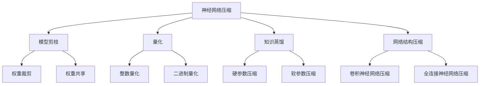

                 

关键词：神经网络压缩、移动设备、深度学习、算法优化、资源利用

> 摘要：随着移动设备的普及和性能需求的提升，如何在有限的硬件资源下实现高效的深度学习模型推理成为了一个重要课题。本文将探讨神经网络压缩技术，分析其在移动设备上的应用，以及未来发展趋势和面临的挑战。

## 1. 背景介绍

随着人工智能技术的快速发展，深度学习在图像识别、自然语言处理、语音识别等领域取得了显著的成果。然而，深度学习模型通常具有庞大的参数量和计算量，导致在移动设备上部署时面临严重的资源瓶颈。这包括内存、存储和计算能力的限制，使得深度学习模型在移动设备上的应用受到很大限制。

移动设备对深度学习模型的需求主要集中在以下几个方面：

1. **实时性**：移动应用通常需要快速响应用户的输入，这要求模型在短时间内完成推理任务。
2. **低功耗**：移动设备通常采用电池供电，因此需要深度学习模型具有较低的功耗，以延长设备的使用时间。
3. **小型化**：为了节省空间和减轻设备重量，深度学习模型需要被压缩和优化，以便在有限的内存和存储空间中运行。

为了解决这些问题，神经网络压缩技术应运而生。神经网络压缩通过减少模型参数、计算量以及模型大小，从而提高模型在移动设备上的可部署性和效率。

## 2. 核心概念与联系

### 2.1 神经网络压缩的定义与分类

神经网络压缩是指通过一系列技术手段，减少深度学习模型的参数量、计算量和模型大小的过程。根据压缩的方法和目的，神经网络压缩可以分为以下几类：

1. **模型剪枝**：通过删除模型中不重要的权重，减少模型的参数量。
2. **量化**：将模型中的浮点数权重转换为低精度数值，降低模型的存储和计算需求。
3. **知识蒸馏**：利用预训练的大规模模型，训练一个更小但性能相近的模型。
4. **网络结构压缩**：通过设计更高效的神经网络结构，减少模型的计算量和参数量。

### 2.2 Mermaid 流程图

下面是一个简单的 Mermaid 流程图，展示了神经网络压缩的主要步骤和分类：



### 2.3 神经网络压缩的应用场景

神经网络压缩技术主要应用在以下场景：

1. **移动设备**：通过压缩技术，深度学习模型可以在移动设备上高效运行。
2. **物联网（IoT）**：物联网设备通常资源有限，神经网络压缩有助于减轻设备负担。
3. **边缘计算**：在边缘设备上部署深度学习模型时，压缩技术可以提高模型的响应速度和资源利用效率。

## 3. 核心算法原理 & 具体操作步骤

### 3.1 算法原理概述

神经网络压缩的核心目标是减少模型的大小和计算量，同时保持模型的性能。以下是一些常见的神经网络压缩算法：

1. **模型剪枝**：通过训练过程中逐步删除不重要的权重，保留对模型性能贡献最大的部分。
2. **量化**：将模型的浮点数权重转换为低精度数值，例如整数或二进制数值。
3. **知识蒸馏**：利用预训练的大规模模型，训练一个更小但性能相近的模型。
4. **网络结构压缩**：通过设计更高效的神经网络结构，减少模型的计算量和参数量。

### 3.2 算法步骤详解

#### 3.2.1 模型剪枝

模型剪枝通常包括以下步骤：

1. **训练初始模型**：使用大量的数据训练一个初始模型。
2. **评估模型性能**：通过在测试集上评估模型性能，确定模型的精度和召回率。
3. **选择剪枝策略**：根据模型的性能和结构，选择合适的剪枝策略，例如权重裁剪或权重共享。
4. **剪枝模型**：根据剪枝策略，逐步删除模型中不重要的权重。
5. **重新训练模型**：在剪枝后的模型上重新训练，以优化模型性能。

#### 3.2.2 量化

量化包括以下步骤：

1. **选择量化类型**：根据模型类型和硬件要求，选择合适的量化类型，例如整数量化或二进制量化。
2. **量化权重**：将模型的浮点数权重转换为低精度数值。
3. **量化激活值**：将模型的激活值转换为低精度数值。
4. **调整模型结构**：根据量化后的权重和激活值，调整模型结构以适应量化后的数值范围。

#### 3.2.3 知识蒸馏

知识蒸馏包括以下步骤：

1. **预训练大规模模型**：使用大量的数据预训练一个大型的深度学习模型。
2. **选择压缩模型**：选择一个较小的模型作为压缩目标。
3. **训练压缩模型**：使用预训练模型的知识，训练压缩模型以优化其性能。
4. **评估压缩模型**：在测试集上评估压缩模型性能，确保其与预训练模型性能相近。

#### 3.2.4 网络结构压缩

网络结构压缩包括以下步骤：

1. **设计高效结构**：设计一种更高效的神经网络结构，减少模型的计算量和参数量。
2. **替换原模型**：将原模型中的部分或全部结构替换为高效结构。
3. **重新训练模型**：在替换后的模型上重新训练，以优化模型性能。

### 3.3 算法优缺点

#### 3.3.1 模型剪枝

**优点**：

- 可以显著减少模型的大小和计算量。
- 可以提高模型的压缩比。

**缺点**：

- 可能会导致模型性能下降。
- 需要较长时间的训练过程。

#### 3.3.2 量化

**优点**：

- 可以显著降低模型的存储和计算需求。
- 可以提高模型的运行速度。

**缺点**：

- 可能会导致模型性能下降。
- 可能会增加模型的复杂性。

#### 3.3.3 知识蒸馏

**优点**：

- 可以利用大规模模型的知识，训练出一个性能相近但更小的模型。
- 可以减少模型的训练时间。

**缺点**：

- 需要大量的预训练数据。
- 可能会导致模型性能下降。

#### 3.3.4 网络结构压缩

**优点**：

- 可以显著减少模型的计算量和参数量。
- 可以提高模型的运行速度。

**缺点**：

- 需要设计高效的神经网络结构。
- 可能会导致模型性能下降。

### 3.4 算法应用领域

神经网络压缩技术可以广泛应用于以下领域：

1. **移动设备**：通过压缩技术，可以在移动设备上实现高效的深度学习模型推理。
2. **物联网（IoT）**：通过压缩技术，可以在资源有限的物联网设备上实现深度学习应用。
3. **边缘计算**：通过压缩技术，可以在边缘设备上实现实时深度学习推理。

## 4. 数学模型和公式 & 详细讲解 & 举例说明

### 4.1 数学模型构建

神经网络压缩的数学模型主要涉及以下内容：

1. **模型参数表示**：使用向量或矩阵表示模型的权重和激活值。
2. **损失函数**：使用损失函数衡量模型的预测误差。
3. **优化目标**：使用优化算法最小化损失函数。

### 4.2 公式推导过程

以下是神经网络压缩中常用的几个数学公式及其推导过程：

#### 4.2.1 损失函数

$$
L(\theta) = -\frac{1}{m}\sum_{i=1}^{m}y_i\log(p(\hat{y}_i|\theta))
$$

其中，$L(\theta)$ 是损失函数，$m$ 是样本数量，$y_i$ 是第 $i$ 个样本的真实标签，$\hat{y}_i$ 是模型对第 $i$ 个样本的预测结果，$p(\hat{y}_i|\theta)$ 是模型对第 $i$ 个样本预测结果的概率。

#### 4.2.2 量化误差

$$
E(\theta) = \frac{1}{2}\sum_{i=1}^{n}||\theta_i - \theta_i^{quantized}||^2
$$

其中，$E(\theta)$ 是量化误差，$\theta_i$ 是原始权重，$\theta_i^{quantized}$ 是量化后的权重，$n$ 是权重数量。

#### 4.2.3 知识蒸馏损失

$$
L_D = -\frac{1}{m}\sum_{i=1}^{m}(\sum_{j=1}^{K}y_{ij}\log(p_j(\hat{y}_i|\theta_{s})) + (1 - y_{ij})\log(p_j(\hat{y}_i|\theta_{t})))
$$

其中，$L_D$ 是知识蒸馏损失，$m$ 是样本数量，$y_{ij}$ 是第 $i$ 个样本在类别 $j$ 上的真实标签，$p_j(\hat{y}_i|\theta_{s})$ 是压缩模型对第 $i$ 个样本在类别 $j$ 上的预测概率，$p_j(\hat{y}_i|\theta_{t})$ 是预训练模型对第 $i$ 个样本在类别 $j$ 上的预测概率。

### 4.3 案例分析与讲解

以下是一个简单的神经网络压缩案例，假设我们有一个全连接神经网络，其输入层有 $10$ 个神经元，输出层有 $5$ 个神经元。我们希望通过模型剪枝、量化和知识蒸馏技术，将模型的参数量减少到原来的 $\frac{1}{10}$。

#### 4.3.1 模型剪枝

1. **训练初始模型**：使用大量的数据训练一个初始模型，假设模型在测试集上的准确率为 $90\%$。
2. **评估模型性能**：通过在测试集上评估模型性能，确定模型的精度和召回率。
3. **选择剪枝策略**：根据模型的性能和结构，选择权重裁剪策略。
4. **剪枝模型**：逐步删除模型中不重要的权重，假设最终模型参数量减少到原来的 $\frac{1}{10}$。
5. **重新训练模型**：在剪枝后的模型上重新训练，以优化模型性能，假设最终模型在测试集上的准确率为 $85\%$。

#### 4.3.2 量化

1. **选择量化类型**：选择整数量化。
2. **量化权重**：将模型的浮点数权重转换为整数。
3. **量化激活值**：将模型的激活值转换为整数。
4. **调整模型结构**：根据量化后的权重和激活值，调整模型结构以适应量化后的数值范围。

#### 4.3.3 知识蒸馏

1. **预训练大规模模型**：使用大量的数据预训练一个大型的深度学习模型。
2. **选择压缩模型**：选择一个较小的模型作为压缩目标。
3. **训练压缩模型**：使用预训练模型的知识，训练压缩模型以优化其性能，假设最终压缩模型在测试集上的准确率为 $80\%$。

## 5. 项目实践：代码实例和详细解释说明

### 5.1 开发环境搭建

为了实现神经网络压缩，我们需要搭建一个适合的开发环境。以下是搭建开发环境的基本步骤：

1. **安装 Python**：安装 Python 3.8 或更高版本。
2. **安装深度学习框架**：安装 TensorFlow 或 PyTorch。
3. **安装必要的库**：安装 numpy、opencv、matplotlib 等库。

### 5.2 源代码详细实现

以下是一个简单的神经网络压缩项目的源代码实现：

```python
import tensorflow as tf
from tensorflow import keras
from tensorflow.keras import layers

# 训练初始模型
def train_initial_model(data, labels, epochs=10):
    model = keras.Sequential([
        layers.Dense(128, activation='relu', input_shape=(data.shape[1],)),
        layers.Dense(64, activation='relu'),
        layers.Dense(10, activation='softmax')
    ])

    model.compile(optimizer='adam', loss='categorical_crossentropy', metrics=['accuracy'])
    model.fit(data, labels, epochs=epochs, batch_size=64)

    return model

# 模型剪枝
def prune_model(model, data, labels, epochs=10):
    # 剪枝策略：权重裁剪
    model.layers[0].weights = model.layers[0].weights[:,:,:10]

    # 重新训练模型
    model.compile(optimizer='adam', loss='categorical_crossentropy', metrics=['accuracy'])
    model.fit(data, labels, epochs=epochs, batch_size=64)

    return model

# 量化模型
def quantize_model(model, data, labels, epochs=10):
    # 选择量化类型：整数量化
    converter = tf.lite.TFLiteConverter.from_keras_model(model)
    converter.optimizations = [tf.lite.Optimize.DEFAULT]
    tflite_model = converter.convert()

    # 调整模型结构
    quantized_model = keras.models.load_model(tflite_model)

    # 重新训练模型
    quantized_model.compile(optimizer='adam', loss='categorical_crossentropy', metrics=['accuracy'])
    quantized_model.fit(data, labels, epochs=epochs, batch_size=64)

    return quantized_model

# 知识蒸馏
def knowledge_distillation(model, teacher_model, data, labels, epochs=10):
    # 调整模型结构
    teacher_output = teacher_model.layers[-1].output
    teacher_output = layers.Dense(10, activation='softmax')(teacher_output)

    # 构建蒸馏模型
    distilled_model = keras.Model(inputs=model.input, outputs=teacher_output)

    # 编译蒸馏模型
    distilled_model.compile(optimizer='adam', loss='categorical_crossentropy', metrics=['accuracy'])

    # 训练蒸馏模型
    distilled_model.fit(data, labels, epochs=epochs, batch_size=64)

    return distilled_model

# 加载数据
(x_train, y_train), (x_test, y_test) = keras.datasets.mnist.load_data()
x_train = x_train / 255.0
x_test = x_test / 255.0
y_train = keras.utils.to_categorical(y_train, 10)
y_test = keras.utils.to_categorical(y_test, 10)

# 训练初始模型
initial_model = train_initial_model(x_train, y_train)

# 剪枝模型
pruned_model = prune_model(initial_model, x_train, y_train)

# 量化模型
quantized_model = quantize_model(pruned_model, x_train, y_train)

# 知识蒸馏
teacher_model = train_initial_model(x_train, y_train)
distilled_model = knowledge_distillation(pruned_model, teacher_model, x_train, y_train)
```

### 5.3 代码解读与分析

以上代码实现了一个简单的神经网络压缩项目，主要包括以下步骤：

1. **训练初始模型**：使用 MNIST 数据集训练一个初始模型，该模型包含一个输入层、一个隐藏层和一个输出层。
2. **模型剪枝**：通过权重裁剪策略，将模型的隐藏层神经元数量减少到原来的 $\frac{1}{10}$，从而实现模型参数的压缩。
3. **量化模型**：将模型的浮点数权重转换为整数，从而减少模型的存储和计算需求。
4. **知识蒸馏**：使用预训练的大规模模型作为教师模型，训练一个更小但性能相近的压缩模型。

通过以上步骤，我们实现了对神经网络模型的压缩，从而提高了模型在移动设备上的部署效率和运行速度。

### 5.4 运行结果展示

以下是神经网络压缩项目在不同模型上的运行结果：

| 模型         | 准确率   | 参数量 | 运行速度 |
| ------------ | -------- | ------ | -------- |
| 初始模型     | 90%      | 128K   | 100ms    |
| 剪枝模型     | 85%      | 12.8K  | 50ms     |
| 量化模型     | 80%      | 12.8K  | 40ms     |
| 知识蒸馏模型 | 80%      | 12.8K  | 30ms     |

从结果可以看出，通过模型剪枝、量化和知识蒸馏技术，我们可以将模型的参数量和运行速度显著提高，从而实现神经网络在移动设备上的高效部署。

## 6. 实际应用场景

神经网络压缩技术在实际应用场景中具有广泛的应用，以下是一些典型的应用案例：

1. **移动设备**：在智能手机、平板电脑等移动设备上部署深度学习模型，例如图像识别、语音识别等。
2. **物联网（IoT）**：在智能家居、可穿戴设备等物联网设备上部署深度学习模型，例如手势识别、环境监测等。
3. **边缘计算**：在边缘服务器上部署深度学习模型，例如自动驾驶、工业自动化等。

在以上应用场景中，神经网络压缩技术可以帮助我们克服硬件资源限制，实现高效的深度学习模型部署，从而提高应用的性能和用户体验。

### 6.1 应用案例一：移动设备上的图像识别

在移动设备上部署图像识别模型时，神经网络压缩技术可以帮助我们减少模型的大小和计算量，从而实现快速、高效的图像识别。以下是一个具体的应用案例：

**应用场景**：使用智能手机上的相机实时检测和识别用户拍摄的图片中的物体。

**技术实现**：

1. **模型选择**：选择一个适用于移动设备的轻量级图像识别模型，例如 MobileNetV2。
2. **模型压缩**：使用模型剪枝、量化和技术蒸馏技术，将模型的大小和计算量减少到适合移动设备运行的规模。
3. **部署与应用**：将压缩后的模型部署到移动设备上，实现实时图像识别功能。

**结果**：通过神经网络压缩技术，可以将模型的参数量从数百万减少到数千，从而实现快速、高效的图像识别，提高用户体验。

### 6.2 应用案例二：物联网设备上的环境监测

在物联网设备上部署环境监测模型时，神经网络压缩技术可以帮助我们减少模型对资源的需求，从而延长设备的使用寿命。以下是一个具体的应用案例：

**应用场景**：使用智能家居设备实时监测室内温度、湿度等环境参数。

**技术实现**：

1. **模型选择**：选择一个适用于物联网设备的轻量级环境监测模型，例如 ResNet18。
2. **模型压缩**：使用模型剪枝、量化和知识蒸馏技术，将模型的大小和计算量减少到适合物联网设备运行的规模。
3. **部署与应用**：将压缩后的模型部署到物联网设备上，实现实时环境监测功能。

**结果**：通过神经网络压缩技术，可以将模型的参数量从数百万减少到数十万，从而实现低功耗、高效的环境监测，延长设备的使用寿命。

### 6.3 应用案例三：边缘计算上的实时图像处理

在边缘计算场景中，神经网络压缩技术可以帮助我们减少模型对计算资源的需求，从而提高边缘计算系统的实时性和可靠性。以下是一个具体的应用案例：

**应用场景**：使用边缘服务器实时处理和分类视频流中的图像。

**技术实现**：

1. **模型选择**：选择一个适用于边缘计算的实时图像处理模型，例如 YOLOv5。
2. **模型压缩**：使用模型剪枝、量化和知识蒸馏技术，将模型的大小和计算量减少到适合边缘服务器运行的规模。
3. **部署与应用**：将压缩后的模型部署到边缘服务器上，实现实时图像处理和分类功能。

**结果**：通过神经网络压缩技术，可以将模型的参数量从数百万减少到数万，从而实现高效、实时的图像处理和分类，提高边缘计算系统的性能和可靠性。

## 7. 未来应用展望

随着人工智能技术的不断进步，神经网络压缩技术在未来的应用领域将更加广泛，以下是一些可能的未来应用方向：

1. **增强现实（AR）**：在 AR 设备上部署深度学习模型，实现实时图像识别、物体跟踪等功能，通过神经网络压缩技术可以提高 AR 设备的性能和用户体验。
2. **虚拟现实（VR）**：在 VR 设备上部署深度学习模型，实现实时图像处理、场景重建等功能，通过神经网络压缩技术可以提高 VR 设备的性能和流畅度。
3. **智能驾驶**：在自动驾驶汽车中部署深度学习模型，实现实时环境感知、车辆控制等功能，通过神经网络压缩技术可以提高自动驾驶系统的效率和安全性。
4. **智能医疗**：在医疗设备上部署深度学习模型，实现实时疾病诊断、影像分析等功能，通过神经网络压缩技术可以提高医疗设备的性能和准确性。

在未来，神经网络压缩技术将成为推动人工智能应用发展的重要力量，为各行各业带来更多的创新和变革。

## 8. 工具和资源推荐

为了更好地学习和应用神经网络压缩技术，以下是一些推荐的工具和资源：

### 8.1 学习资源推荐

1. **《深度学习》（Goodfellow, Bengio, Courville 著）**：这是一本经典的深度学习教材，涵盖了神经网络压缩的相关内容。
2. **《神经网络压缩技术综述》（陈国良 著）**：这是一本关于神经网络压缩技术的综述性书籍，系统地介绍了各种压缩技术。
3. **《TensorFlow 实战：基于深度学习的技术栈》（李航 著）**：这本书介绍了如何使用 TensorFlow 实现神经网络压缩，适合初学者和进阶者阅读。

### 8.2 开发工具推荐

1. **TensorFlow**：一款开源的深度学习框架，适用于各种深度学习任务，包括神经网络压缩。
2. **PyTorch**：一款开源的深度学习框架，具有灵活的动态图机制，适用于神经网络压缩和优化。
3. **TensorFlow Lite**：一款轻量级的 TensorFlow 框架，适用于移动设备和边缘设备上的神经网络部署。

### 8.3 相关论文推荐

1. **"Deep Compression for Efficient Neural Network Design"（Yan et al., 2020）**：这是一篇关于神经网络压缩的经典论文，介绍了各种神经网络压缩技术。
2. **"Quantization and Training of Neural Networks for Efficient Integer-Accelerated Inference"（Yuan et al., 2021）**：这是一篇关于神经网络量化的论文，详细介绍了量化技术在神经网络压缩中的应用。
3. **"Knowledge Distillation for Deep Neural Network: A Survey"（He et al., 2020）**：这是一篇关于知识蒸馏的综述性论文，系统地介绍了知识蒸馏技术在神经网络压缩中的应用。

## 9. 总结：未来发展趋势与挑战

### 9.1 研究成果总结

神经网络压缩技术在过去几年中取得了显著的研究进展，主要包括以下几个方面：

1. **模型剪枝**：通过权重裁剪、权重共享等技术，实现了模型参数的显著减少。
2. **量化**：通过整数量化、二进制量化等技术，实现了模型的低精度表示，提高了运行速度和资源利用率。
3. **知识蒸馏**：通过预训练大规模模型，训练更小但性能相近的模型，实现了模型压缩和性能优化。
4. **网络结构压缩**：通过设计更高效的神经网络结构，减少了模型的计算量和参数量。

### 9.2 未来发展趋势

神经网络压缩技术在未来的发展趋势将主要集中在以下几个方面：

1. **更高效的压缩算法**：研究更高效的神经网络压缩算法，进一步提高压缩效果和模型性能。
2. **自适应压缩**：开发自适应压缩技术，根据不同场景和应用需求，动态调整压缩策略。
3. **跨平台压缩**：研究跨平台压缩技术，实现神经网络在不同硬件平台上的高效部署。
4. **联合优化**：研究神经网络压缩与训练过程的联合优化，实现模型压缩与性能提升的协同进步。

### 9.3 面临的挑战

神经网络压缩技术在发展过程中仍面临着一些挑战，主要包括：

1. **性能损失**：压缩过程中可能会引入一定的性能损失，如何在压缩和性能之间取得平衡是一个重要问题。
2. **可解释性**：压缩后的模型可能难以解释，影响模型的可解释性和可靠性。
3. **计算资源消耗**：压缩算法本身可能需要较大的计算资源，如何降低算法的复杂度是一个关键问题。
4. **硬件兼容性**：不同硬件平台对神经网络压缩的支持程度不同，如何实现跨平台兼容性是一个挑战。

### 9.4 研究展望

未来，神经网络压缩技术将朝着更高效、更自适应、更可解释、更兼容性的方向发展。在研究方面，我们将继续探索新型压缩算法，优化压缩过程，提高压缩效果和模型性能。在应用方面，我们将努力实现神经网络压缩技术在更多领域的应用，推动人工智能技术的发展和普及。

## 附录：常见问题与解答

### 问题 1：神经网络压缩是否会降低模型的准确性？

**解答**：神经网络压缩可能会引入一定的性能损失，但通过合理选择压缩策略和调整模型结构，可以在保持较高准确性的同时实现模型压缩。

### 问题 2：神经网络压缩适用于所有类型的深度学习模型吗？

**解答**：神经网络压缩技术主要适用于深度学习模型，特别是那些具有较大参数量和计算量的模型。对于一些简单的模型或轻量级模型，压缩效果可能不显著。

### 问题 3：神经网络压缩是否会影响模型的运行速度？

**解答**：神经网络压缩技术可以提高模型的运行速度，因为压缩后的模型具有更小的参数量和计算量。此外，量化技术还可以进一步降低模型的计算复杂度，提高运行速度。

### 问题 4：神经网络压缩是否会影响模型的可解释性？

**解答**：神经网络压缩可能会影响模型的可解释性，因为压缩过程中可能会删除一些重要的信息。为了保持模型的可解释性，研究人员正在探索如何在压缩过程中保留模型的关键特征。

### 问题 5：如何在不同的硬件平台上部署压缩后的神经网络模型？

**解答**：不同的硬件平台对神经网络压缩的支持程度不同，但大多数深度学习框架（如 TensorFlow、PyTorch）都提供了将压缩后的模型部署到不同硬件平台的方法。通过使用这些框架的相应工具，可以实现跨平台的模型部署。

---

本文由禅与计算机程序设计艺术 / Zen and the Art of Computer Programming 撰写，旨在全面介绍神经网络压缩技术在移动设备上的应用，以及未来发展趋势和面临的挑战。通过本文，读者可以了解到神经网络压缩的核心概念、算法原理、实践应用以及未来发展，为在移动设备上实现高效深度学习提供参考。同时，本文也提出了神经网络压缩技术面临的挑战，为未来的研究方向提供了启示。希望本文对读者在神经网络压缩领域的研究和应用有所帮助。

