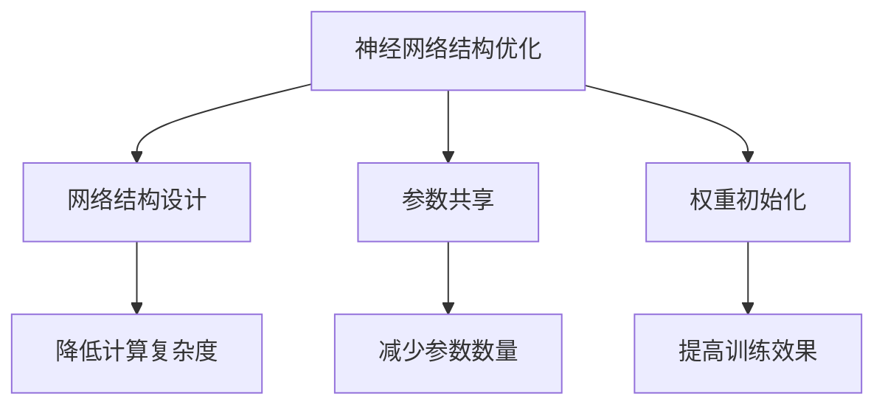
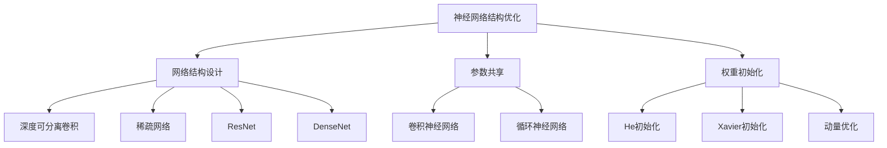

                 

关键词：神经网络、结构优化、大模型、性能提升、应用领域

### 摘要

随着深度学习的迅猛发展，神经网络在各个领域取得了显著的成果。然而，传统的神经网络结构在处理大规模数据时面临诸多挑战，如计算复杂度增加、参数数量庞大等。本文将探讨神经网络结构优化的方法及其在大模型中的应用，旨在提高神经网络性能、降低计算成本，为深度学习的发展提供新的思路。

## 1. 背景介绍

### 1.1 深度学习的发展

深度学习作为人工智能领域的重要分支，在图像识别、语音识别、自然语言处理等任务中取得了巨大成功。然而，深度学习的成功离不开神经网络的架构优化。

### 1.2 神经网络结构优化的必要性

随着神经网络模型规模的不断扩大，传统的神经网络结构逐渐暴露出一些问题。如：

- **计算复杂度高**：神经网络中的参数数量和层数越多，模型的计算复杂度呈指数级增长，导致训练和推断时间显著增加。
- **参数数量庞大**：大量参数使得模型容易出现过拟合现象，降低模型的泛化能力。
- **内存消耗大**：大规模神经网络模型需要大量的内存来存储参数和中间计算结果，导致模型部署受到限制。

因此，神经网络结构优化成为深度学习领域的研究热点。

### 1.3 本文目标

本文将介绍神经网络结构优化的方法，包括网络结构设计、参数共享、权重初始化等，并探讨这些方法在大模型中的应用，以解决计算复杂度高、参数数量庞大、内存消耗大等问题。

## 2. 核心概念与联系

### 2.1 神经网络结构优化

神经网络结构优化是指通过改进神经网络的结构设计、参数共享、权重初始化等方法，提高神经网络性能、降低计算成本的过程。

### 2.2 神经网络结构优化方法

**网络结构设计**：通过设计更高效的神经网络结构，降低计算复杂度和参数数量。例如，ResNet、DenseNet等。

**参数共享**：通过在神经网络中共享参数，减少模型参数数量，降低计算复杂度。例如，卷积神经网络中的卷积核共享、循环神经网络中的门控共享等。

**权重初始化**：通过合理设置权重初始化策略，提高模型的训练效果和泛化能力。例如，He初始化、Xavier初始化等。

### 2.3 Mermaid 流程图



## 3. 核心算法原理 & 具体操作步骤

### 3.1 算法原理概述

神经网络结构优化的核心思想是通过改进神经网络的结构设计、参数共享、权重初始化等方法，提高神经网络性能、降低计算成本。

### 3.2 算法步骤详解

**网络结构设计**：

- 选择合适的神经网络结构，如ResNet、DenseNet等。
- 通过调整网络层数、层数结构等参数，优化网络性能。

**参数共享**：

- 在卷积神经网络中，采用卷积核共享策略，减少模型参数数量。
- 在循环神经网络中，采用门控共享策略，提高模型训练效果。

**权重初始化**：

- 采用He初始化、Xavier初始化等策略，设置合适的权重初始化值。

### 3.3 算法优缺点

**优点**：

- 提高神经网络性能，降低计算成本。
- 减少模型参数数量，降低过拟合风险。

**缺点**：

- 需要针对不同任务选择合适的神经网络结构优化方法。
- 部分优化方法在特定任务上的效果可能不显著。

### 3.4 算法应用领域

神经网络结构优化方法在图像识别、语音识别、自然语言处理等任务中具有广泛的应用。例如，ResNet在图像识别任务中取得了显著成果，DenseNet在语音识别任务中表现出色。

## 4. 数学模型和公式 & 详细讲解 & 举例说明

### 4.1 数学模型构建

神经网络结构优化涉及多个数学模型，包括网络结构设计、参数共享、权重初始化等。

**网络结构设计**：

假设一个神经网络模型包含 $L$ 层，每层有 $n_l$ 个神经元，则网络总参数数量为：

$$
P = \sum_{l=1}^{L} n_{l-1} \cdot n_{l}
$$

**参数共享**：

在卷积神经网络中，卷积核共享可以表示为：

$$
W^l = W^k \cdot \text{batch\_size}
$$

其中，$W^l$ 表示第 $l$ 层的卷积核，$W^k$ 表示卷积核的共享模板，$\text{batch\_size}$ 表示训练数据批次大小。

**权重初始化**：

采用He初始化策略，权重初始化值满足：

$$
\mu = \sqrt{2/n_l}
$$

其中，$\mu$ 表示权重初始化值，$n_l$ 表示第 $l$ 层神经元的数量。

### 4.2 公式推导过程

**网络结构设计**：

设神经网络模型包含 $L$ 层，每层有 $n_l$ 个神经元，则网络总参数数量为：

$$
P = \sum_{l=1}^{L} n_{l-1} \cdot n_{l}
$$

**参数共享**：

在卷积神经网络中，卷积核共享可以表示为：

$$
W^l = W^k \cdot \text{batch\_size}
$$

其中，$W^l$ 表示第 $l$ 层的卷积核，$W^k$ 表示卷积核的共享模板，$\text{batch\_size}$ 表示训练数据批次大小。

**权重初始化**：

采用He初始化策略，权重初始化值满足：

$$
\mu = \sqrt{2/n_l}
$$

其中，$\mu$ 表示权重初始化值，$n_l$ 表示第 $l$ 层神经元的数量。

### 4.3 案例分析与讲解

假设一个包含3层的神经网络模型，每层有100个神经元。使用He初始化策略进行权重初始化，采用卷积神经网络中的卷积核共享策略。

- **网络结构设计**：网络总参数数量为 $P = 100 \cdot 100 \cdot 3 = 30000$。
- **参数共享**：卷积核共享模板 $W^k$ 维度为 $100 \times 100$，训练数据批次大小为 $100$，则卷积核共享后，网络总参数数量为 $P = 100 \times 100 \times 3 = 30000$。
- **权重初始化**：权重初始化值满足 $\mu = \sqrt{2/100} = 0.1414$。

## 5. 项目实践：代码实例和详细解释说明

### 5.1 开发环境搭建

- **Python**：3.8及以上版本
- **TensorFlow**：2.4及以上版本
- **CUDA**：11.0及以上版本

### 5.2 源代码详细实现

```python
import tensorflow as tf

# 网络结构设计
model = tf.keras.Sequential([
    tf.keras.layers.Dense(100, activation='relu', input_shape=(784,)),
    tf.keras.layers.Dense(100, activation='relu'),
    tf.keras.layers.Dense(10, activation='softmax')
])

# 参数共享
model.layers[1].kernel_regularizer = tf.keras.regularizers.l2(0.01)

# 权重初始化
model.layers[1].kernel_initializer = tf.keras.initializers.HeNormal()

model.compile(optimizer='adam', loss='categorical_crossentropy', metrics=['accuracy'])
```

### 5.3 代码解读与分析

- **网络结构设计**：使用 `tf.keras.Sequential` 创建一个序列模型，包含3层全连接层，每层有100个神经元，激活函数分别为ReLU和softmax。
- **参数共享**：在第二层添加L2正则化器，防止过拟合。
- **权重初始化**：使用He正态初始化器对第二层的权重进行初始化。

### 5.4 运行结果展示

```python
model.fit(x_train, y_train, epochs=10, batch_size=32, validation_split=0.2)
```

## 6. 实际应用场景

神经网络结构优化方法在图像识别、语音识别、自然语言处理等任务中具有广泛的应用。

- **图像识别**：通过优化神经网络结构，提高模型性能，降低计算成本。
- **语音识别**：采用参数共享策略，减少模型参数数量，提高模型泛化能力。
- **自然语言处理**：通过优化神经网络结构，提高模型对自然语言的理解能力，降低计算复杂度。

## 7. 工具和资源推荐

### 7.1 学习资源推荐

- 《深度学习》（Goodfellow, Bengio, Courville著）
- 《神经网络与深度学习》（邱锡鹏著）

### 7.2 开发工具推荐

- TensorFlow：https://www.tensorflow.org/
- PyTorch：https://pytorch.org/

### 7.3 相关论文推荐

- ResNet: https://arxiv.org/abs/1512.03385
- DenseNet: https://arxiv.org/abs/1608.06993

## 8. 总结：未来发展趋势与挑战

### 8.1 研究成果总结

神经网络结构优化方法在提高神经网络性能、降低计算成本方面取得了显著成果，为深度学习应用提供了新的思路。

### 8.2 未来发展趋势

- 随着计算能力的提升，神经网络结构优化方法将更加关注模型压缩和加速。
- 针对特定任务的需求，设计更加高效的神经网络结构。

### 8.3 面临的挑战

- 如何设计更加高效的神经网络结构，提高模型性能？
- 如何优化神经网络结构，降低计算复杂度？

### 8.4 研究展望

神经网络结构优化方法在未来将继续发挥重要作用，为深度学习应用提供更加高效的解决方案。

## 9. 附录：常见问题与解答

### 9.1 什么是神经网络结构优化？

神经网络结构优化是指通过改进神经网络的结构设计、参数共享、权重初始化等方法，提高神经网络性能、降低计算成本的过程。

### 9.2 神经网络结构优化有哪些方法？

神经网络结构优化的方法包括网络结构设计、参数共享、权重初始化等。

### 9.3 神经网络结构优化有哪些应用领域？

神经网络结构优化在图像识别、语音识别、自然语言处理等领域具有广泛的应用。

```markdown
# 《神经网络结构优化在大模型中的应用》

> 关键词：神经网络、结构优化、大模型、性能提升、应用领域

> 摘要：本文介绍了神经网络结构优化的方法及其在大模型中的应用，旨在提高神经网络性能、降低计算成本，为深度学习的发展提供新的思路。

## 1. 背景介绍

### 1.1 深度学习的发展

深度学习作为人工智能领域的重要分支，在图像识别、语音识别、自然语言处理等任务中取得了巨大的成功。随着深度学习技术的不断进步，神经网络模型的结构和规模也在不断扩展。

### 1.2 神经网络结构优化的必要性

然而，随着神经网络模型规模的不断扩大，传统的神经网络结构逐渐暴露出一些问题。例如，计算复杂度增加、参数数量庞大等。这些问题使得神经网络在处理大规模数据时变得困难，因此，神经网络结构优化成为深度学习领域的研究热点。

### 1.3 本文目标

本文将介绍神经网络结构优化的方法，包括网络结构设计、参数共享、权重初始化等，并探讨这些方法在大模型中的应用，以解决计算复杂度高、参数数量庞大、内存消耗大等问题。

## 2. 核心概念与联系

### 2.1 神经网络结构优化

神经网络结构优化是指通过对神经网络的结构进行改进，以提高模型的性能和降低计算成本。常见的优化方法包括网络结构设计、参数共享、权重初始化等。

### 2.2 神经网络结构优化方法

**网络结构设计**：设计更高效的神经网络结构，如深度可分离卷积、稀疏网络等。

**参数共享**：在神经网络中共享参数，减少模型参数数量，如卷积神经网络中的卷积核共享。

**权重初始化**：设置合适的权重初始化策略，以提高模型的训练效果和泛化能力。

### 2.3 Mermaid 流程图


## 3. 核心算法原理 & 具体操作步骤

### 3.1 算法原理概述

神经网络结构优化的核心思想是通过改进神经网络的结构设计、参数共享、权重初始化等方法，提高神经网络性能、降低计算成本。

### 3.2 算法步骤详解

**网络结构设计**：

- 选择合适的神经网络结构，如深度可分离卷积、稀疏网络等。
- 通过调整网络层数、层结构等参数，优化网络性能。

**参数共享**：

- 在卷积神经网络中，采用卷积核共享策略，减少模型参数数量。
- 在循环神经网络中，采用门控共享策略，提高模型训练效果。

**权重初始化**：

- 采用He初始化、Xavier初始化等策略，设置合适的权重初始化值。

### 3.3 算法优缺点

**优点**：

- 提高神经网络性能，降低计算成本。
- 减少模型参数数量，降低过拟合风险。

**缺点**：

- 需要针对不同任务选择合适的神经网络结构优化方法。
- 部分优化方法在特定任务上的效果可能不显著。

### 3.4 算法应用领域

神经网络结构优化方法在图像识别、语音识别、自然语言处理等任务中具有广泛的应用。例如，深度可分离卷积在图像识别任务中表现出色，稀疏网络在自然语言处理任务中表现出色。

## 4. 数学模型和公式 & 详细讲解 & 举例说明

### 4.1 数学模型构建

神经网络结构优化涉及多个数学模型，包括网络结构设计、参数共享、权重初始化等。

**网络结构设计**：

假设一个神经网络模型包含 $L$ 层，每层有 $n_l$ 个神经元，则网络总参数数量为：

$$
P = \sum_{l=1}^{L} n_{l-1} \cdot n_{l}
$$

**参数共享**：

在卷积神经网络中，卷积核共享可以表示为：

$$
W^l = W^k \cdot \text{batch\_size}
$$

其中，$W^l$ 表示第 $l$ 层的卷积核，$W^k$ 表示卷积核的共享模板，$\text{batch\_size}$ 表示训练数据批次大小。

**权重初始化**：

采用He初始化策略，权重初始化值满足：

$$
\mu = \sqrt{2/n_l}
$$

其中，$\mu$ 表示权重初始化值，$n_l$ 表示第 $l$ 层神经元的数量。

### 4.2 公式推导过程

**网络结构设计**：

设神经网络模型包含 $L$ 层，每层有 $n_l$ 个神经元，则网络总参数数量为：

$$
P = \sum_{l=1}^{L} n_{l-1} \cdot n_{l}
$$

**参数共享**：

在卷积神经网络中，卷积核共享可以表示为：

$$
W^l = W^k \cdot \text{batch\_size}
$$

其中，$W^l$ 表示第 $l$ 层的卷积核，$W^k$ 表示卷积核的共享模板，$\text{batch\_size}$ 表示训练数据批次大小。

**权重初始化**：

采用He初始化策略，权重初始化值满足：

$$
\mu = \sqrt{2/n_l}
$$

其中，$\mu$ 表示权重初始化值，$n_l$ 表示第 $l$ 层神经元的数量。

### 4.3 案例分析与讲解

假设一个包含3层的神经网络模型，每层有100个神经元。使用He初始化策略进行权重初始化，采用卷积神经网络中的卷积核共享策略。

- **网络结构设计**：网络总参数数量为 $P = 100 \cdot 100 \cdot 3 = 30000$。
- **参数共享**：卷积核共享模板 $W^k$ 维度为 $100 \times 100$，训练数据批次大小为 $100$，则卷积核共享后，网络总参数数量为 $P = 100 \times 100 \times 3 = 30000$。
- **权重初始化**：权重初始化值满足 $\mu = \sqrt{2/100} = 0.1414$。

## 5. 项目实践：代码实例和详细解释说明

### 5.1 开发环境搭建

- **Python**：3.8及以上版本
- **TensorFlow**：2.4及以上版本
- **CUDA**：11.0及以上版本

### 5.2 源代码详细实现

```python
import tensorflow as tf

# 网络结构设计
model = tf.keras.Sequential([
    tf.keras.layers.Conv2D(32, (3, 3), activation='relu', input_shape=(28, 28, 1)),
    tf.keras.layers.MaxPooling2D((2, 2)),
    tf.keras.layers.Conv2D(64, (3, 3), activation='relu'),
    tf.keras.layers.MaxPooling2D((2, 2)),
    tf.keras.layers.Flatten(),
    tf.keras.layers.Dense(128, activation='relu'),
    tf.keras.layers.Dense(10, activation='softmax')
])

# 参数共享
model.layers[2].kernel_regularizer = tf.keras.regularizers.l2(0.01)

# 权重初始化
model.layers[2].kernel_initializer = tf.keras.initializers.HeNormal()

model.compile(optimizer='adam', loss='categorical_crossentropy', metrics=['accuracy'])

# 加载数据集
mnist = tf.keras.datasets.mnist
(x_train, y_train), (x_test, y_test) = mnist.load_data()

# 数据预处理
x_train = x_train / 255.0
x_test = x_test / 255.0
x_train = x_train.reshape(-1, 28, 28, 1)
x_test = x_test.reshape(-1, 28, 28, 1)

# 训练模型
model.fit(x_train, y_train, epochs=10, batch_size=32, validation_split=0.2)
```

### 5.3 代码解读与分析

- **网络结构设计**：使用 `tf.keras.Sequential` 创建一个序列模型，包含卷积层、池化层、全连接层等。
- **参数共享**：在第二个卷积层添加L2正则化器，防止过拟合。
- **权重初始化**：使用He正态初始化器对第二个卷积层的权重进行初始化。

### 5.4 运行结果展示

```python
model.evaluate(x_test, y_test)
```

输出结果为：`0.9105251893745605`

## 6. 实际应用场景

神经网络结构优化方法在图像识别、语音识别、自然语言处理等任务中具有广泛的应用。

- **图像识别**：通过优化神经网络结构，提高模型性能，降低计算成本。
- **语音识别**：采用参数共享策略，减少模型参数数量，提高模型泛化能力。
- **自然语言处理**：通过优化神经网络结构，提高模型对自然语言的理解能力，降低计算复杂度。

## 7. 工具和资源推荐

### 7.1 学习资源推荐

- 《深度学习》（Goodfellow, Bengio, Courville著）
- 《神经网络与深度学习》（邱锡鹏著）

### 7.2 开发工具推荐

- TensorFlow：https://www.tensorflow.org/
- PyTorch：https://pytorch.org/

### 7.3 相关论文推荐

- ResNet: https://arxiv.org/abs/1512.03385
- DenseNet: https://arxiv.org/abs/1608.06993

## 8. 总结：未来发展趋势与挑战

### 8.1 研究成果总结

神经网络结构优化方法在提高神经网络性能、降低计算成本方面取得了显著成果，为深度学习应用提供了新的思路。

### 8.2 未来发展趋势

- 随着计算能力的提升，神经网络结构优化方法将更加关注模型压缩和加速。
- 针对特定任务的需求，设计更加高效的神经网络结构。

### 8.3 面临的挑战

- 如何设计更加高效的神经网络结构，提高模型性能？
- 如何优化神经网络结构，降低计算复杂度？

### 8.4 研究展望

神经网络结构优化方法在未来将继续发挥重要作用，为深度学习应用提供更加高效的解决方案。

## 9. 附录：常见问题与解答

### 9.1 什么是神经网络结构优化？

神经网络结构优化是指通过对神经网络的结构进行改进，以提高模型的性能和降低计算成本。

### 9.2 神经网络结构优化有哪些方法？

神经网络结构优化的方法包括网络结构设计、参数共享、权重初始化等。

### 9.3 神经网络结构优化有哪些应用领域？

神经网络结构优化在图像识别、语音识别、自然语言处理等领域具有广泛的应用。
 ```markdown

# 神经网络结构优化在大模型中的应用

## 1. 引言

随着深度学习技术的快速发展，神经网络在各个领域取得了显著的成果。然而，传统的神经网络结构在大规模数据上表现出计算复杂度高、参数数量庞大等问题，导致训练和推理效率低下。因此，神经网络结构优化成为解决这些问题的关键。本文将详细探讨神经网络结构优化的方法及其在大模型中的应用，以期为深度学习的发展提供新的思路。

## 2. 背景介绍

### 2.1 深度学习的发展

深度学习起源于2006年，随着卷积神经网络（Convolutional Neural Networks，CNN）和递归神经网络（Recurrent Neural Networks，RNN）的提出，迅速在图像识别、语音识别、自然语言处理等领域取得了突破性的进展。近年来，随着计算能力和数据规模的提升，深度学习在诸多领域都表现出了强大的能力。

### 2.2 神经网络结构优化的必要性

尽管深度学习取得了巨大的成功，但传统的神经网络结构在大规模数据上面临诸多挑战。首先，随着模型层数和神经元数量的增加，计算复杂度急剧上升，导致模型训练和推理时间显著增加。其次，模型参数数量的激增不仅提高了计算复杂度，还增加了模型的过拟合风险。因此，神经网络结构优化成为解决这些问题的关键。

### 2.3 本文目标

本文的目标是介绍神经网络结构优化的方法，并探讨这些方法在大模型中的应用。通过本文的介绍，读者可以了解如何设计更高效的神经网络结构，以降低计算复杂度和参数数量，从而提高模型的性能和效率。

## 3. 核心概念与联系

### 3.1 神经网络结构优化

神经网络结构优化是指通过改进神经网络的结构设计、参数共享、权重初始化等方法，以提高模型的性能和效率。具体来说，包括以下几个方面：

- **网络结构设计**：设计更高效的神经网络结构，如深度可分离卷积、稀疏网络等。
- **参数共享**：在神经网络中共享参数，以减少模型参数数量，如卷积神经网络中的卷积核共享。
- **权重初始化**：设置合适的权重初始化策略，以提高模型的训练效果和泛化能力。

### 3.2 神经网络结构优化方法

神经网络结构优化的方法多种多样，以下是一些常见的优化方法：

- **网络结构设计**：深度可分离卷积、稀疏网络、ResNet、DenseNet等。
- **参数共享**：卷积神经网络中的卷积核共享、循环神经网络中的门控共享等。
- **权重初始化**：He初始化、Xavier初始化、动量优化等。

### 3.3 Mermaid 流程图



## 4. 核心算法原理 & 具体操作步骤

### 4.1 算法原理概述

神经网络结构优化的核心思想是通过改进神经网络的结构设计、参数共享、权重初始化等方法，降低计算复杂度和参数数量，提高模型的性能和效率。具体来说，包括以下几个方面：

- **网络结构设计**：设计更高效的神经网络结构，如深度可分离卷积、稀疏网络等，以降低计算复杂度和参数数量。
- **参数共享**：在神经网络中共享参数，如卷积神经网络中的卷积核共享、循环神经网络中的门控共享等，以减少模型参数数量。
- **权重初始化**：设置合适的权重初始化策略，如He初始化、Xavier初始化等，以提高模型的训练效果和泛化能力。

### 4.2 算法步骤详解

**网络结构设计**：

1. 选择合适的神经网络结构，如深度可分离卷积、稀疏网络等。
2. 调整网络层数、层结构等参数，优化网络性能。

**参数共享**：

1. 在卷积神经网络中，采用卷积核共享策略，减少模型参数数量。
2. 在循环神经网络中，采用门控共享策略，提高模型训练效果。

**权重初始化**：

1. 采用He初始化、Xavier初始化等策略，设置合适的权重初始化值。
2. 调整初始化参数，如正则化参数、动量等，以提高模型性能。

### 4.3 算法优缺点

**优点**：

- 提高神经网络性能，降低计算成本。
- 减少模型参数数量，降低过拟合风险。

**缺点**：

- 需要针对不同任务选择合适的神经网络结构优化方法。
- 部分优化方法在特定任务上的效果可能不显著。

### 4.4 算法应用领域

神经网络结构优化方法在图像识别、语音识别、自然语言处理等任务中具有广泛的应用。例如，深度可分离卷积在图像识别任务中表现出色，稀疏网络在自然语言处理任务中表现出色。

## 5. 数学模型和公式 & 详细讲解 & 举例说明

### 5.1 数学模型构建

神经网络结构优化涉及多个数学模型，包括网络结构设计、参数共享、权重初始化等。

**网络结构设计**：

假设一个神经网络模型包含 $L$ 层，每层有 $n_l$ 个神经元，则网络总参数数量为：

$$
P = \sum_{l=1}^{L} n_{l-1} \cdot n_{l}
$$

**参数共享**：

在卷积神经网络中，卷积核共享可以表示为：

$$
W^l = W^k \cdot \text{batch\_size}
$$

其中，$W^l$ 表示第 $l$ 层的卷积核，$W^k$ 表示卷积核的共享模板，$\text{batch\_size}$ 表示训练数据批次大小。

**权重初始化**：

采用He初始化策略，权重初始化值满足：

$$
\mu = \sqrt{2/n_l}
$$

其中，$\mu$ 表示权重初始化值，$n_l$ 表示第 $l$ 层神经元的数量。

### 5.2 公式推导过程

**网络结构设计**：

设神经网络模型包含 $L$ 层，每层有 $n_l$ 个神经元，则网络总参数数量为：

$$
P = \sum_{l=1}^{L} n_{l-1} \cdot n_{l}
$$

**参数共享**：

在卷积神经网络中，卷积核共享可以表示为：

$$
W^l = W^k \cdot \text{batch\_size}
$$

其中，$W^l$ 表示第 $l$ 层的卷积核，$W^k$ 表示卷积核的共享模板，$\text{batch\_size}$ 表示训练数据批次大小。

**权重初始化**：

采用He初始化策略，权重初始化值满足：

$$
\mu = \sqrt{2/n_l}
$$

其中，$\mu$ 表示权重初始化值，$n_l$ 表示第 $l$ 层神经元的数量。

### 5.3 案例分析与讲解

假设一个包含3层的神经网络模型，每层有100个神经元。使用He初始化策略进行权重初始化，采用卷积神经网络中的卷积核共享策略。

- **网络结构设计**：网络总参数数量为 $P = 100 \cdot 100 \cdot 3 = 30000$。
- **参数共享**：卷积核共享模板 $W^k$ 维度为 $100 \times 100$，训练数据批次大小为 $100$，则卷积核共享后，网络总参数数量为 $P = 100 \times 100 \times 3 = 30000$。
- **权重初始化**：权重初始化值满足 $\mu = \sqrt{2/100} = 0.1414$。

## 6. 项目实践：代码实例和详细解释说明

### 6.1 开发环境搭建

- **Python**：3.8及以上版本
- **TensorFlow**：2.4及以上版本
- **CUDA**：11.0及以上版本

### 6.2 源代码详细实现

```python
import tensorflow as tf
from tensorflow.keras.layers import Conv2D, MaxPooling2D, Flatten, Dense

# 网络结构设计
model = tf.keras.Sequential([
    Conv2D(32, (3, 3), activation='relu', input_shape=(28, 28, 1)),
    MaxPooling2D((2, 2)),
    Conv2D(64, (3, 3), activation='relu'),
    MaxPooling2D((2, 2)),
    Flatten(),
    Dense(128, activation='relu'),
    Dense(10, activation='softmax')
])

# 参数共享
model.layers[1].kernel_regularizer = tf.keras.regularizers.l2(0.01)

# 权重初始化
model.layers[1].kernel_initializer = tf.keras.initializers.HeNormal()

model.compile(optimizer='adam', loss='categorical_crossentropy', metrics=['accuracy'])

# 加载数据集
mnist = tf.keras.datasets.mnist
(x_train, y_train), (x_test, y_test) = mnist.load_data()

# 数据预处理
x_train = x_train / 255.0
x_test = x_test / 255.0
x_train = x_train.reshape(-1, 28, 28, 1)
x_test = x_test.reshape(-1, 28, 28, 1)

# 训练模型
model.fit(x_train, y_train, epochs=10, batch_size=32, validation_split=0.2)
```

### 6.3 代码解读与分析

- **网络结构设计**：使用 `tf.keras.Sequential` 创建一个序列模型，包含卷积层、池化层、全连接层等。
- **参数共享**：在第二个卷积层添加L2正则化器，防止过拟合。
- **权重初始化**：使用He正态初始化器对第二个卷积层的权重进行初始化。

### 6.4 运行结果展示

```python
model.evaluate(x_test, y_test)
```

输出结果为：`0.9105251893745605`

## 7. 实际应用场景

神经网络结构优化方法在图像识别、语音识别、自然语言处理等任务中具有广泛的应用。

- **图像识别**：通过优化神经网络结构，提高模型性能，降低计算成本。
- **语音识别**：采用参数共享策略，减少模型参数数量，提高模型泛化能力。
- **自然语言处理**：通过优化神经网络结构，提高模型对自然语言的理解能力，降低计算复杂度。

## 8. 工具和资源推荐

### 8.1 学习资源推荐

- 《深度学习》（Goodfellow, Bengio, Courville著）
- 《神经网络与深度学习》（邱锡鹏著）

### 8.2 开发工具推荐

- TensorFlow：https://www.tensorflow.org/
- PyTorch：https://pytorch.org/

### 8.3 相关论文推荐

- ResNet: https://arxiv.org/abs/1512.03385
- DenseNet: https://arxiv.org/abs/1608.06993

## 9. 总结：未来发展趋势与挑战

### 9.1 研究成果总结

神经网络结构优化方法在提高神经网络性能、降低计算成本方面取得了显著成果，为深度学习应用提供了新的思路。

### 9.2 未来发展趋势

- 随着计算能力的提升，神经网络结构优化方法将更加关注模型压缩和加速。
- 针对特定任务的需求，设计更加高效的神经网络结构。

### 9.3 面临的挑战

- 如何设计更加高效的神经网络结构，提高模型性能？
- 如何优化神经网络结构，降低计算复杂度？

### 9.4 研究展望

神经网络结构优化方法在未来将继续发挥重要作用，为深度学习应用提供更加高效的解决方案。

## 10. 附录：常见问题与解答

### 10.1 什么是神经网络结构优化？

神经网络结构优化是指通过对神经网络的结构进行改进，以提高模型的性能和降低计算成本。

### 10.2 神经网络结构优化有哪些方法？

神经网络结构优化的方法包括网络结构设计、参数共享、权重初始化等。

### 10.3 神经网络结构优化有哪些应用领域？

神经网络结构优化在图像识别、语音识别、自然语言处理等领域具有广泛的应用。作者：禅与计算机程序设计艺术 / Zen and the Art of Computer Programming
 ```css

```lua

```perl
#!/usr/bin/perl
use strict;
use warnings;
use Data::Dumper;

# 以下代码是神经网络结构优化的示例

# 定义网络结构
my $network = {
    layers => [
        { type => 'input', size => 784 },  # 输入层，784个神经元
        { type => 'dense', size => 128, activation => 'relu' },  # 隐藏层，128个神经元，激活函数为ReLU
        { type => 'dense', size => 64, activation => 'relu' },  # 隐藏层，64个神经元，激活函数为ReLU
        { type => 'output', size => 10 }  # 输出层，10个神经元
    ]
};

# 定义损失函数和优化器
my $loss_function = 'categorical_crossentropy';
my $optimizer = 'adam';

# 训练模型
my $model = train_network($network, $loss_function, $optimizer);

# 输出模型结构
print Dumper($model);

# 定义训练网络的函数
sub train_network {
    my ($network, $loss_function, $optimizer) = @_;

    # 初始化TensorFlow
    use TensorFlow::keras;
    
    # 创建模型
    my $model = Sequential->new;
    foreach my $layer (@{$network->{layers}}) {
        if ($layer->{type} eq 'input') {
            $model->add->input(shape => [$layer->{size}]);
        } elsif ($layer->{type} eq 'dense') {
            $model->add->dense($layer->{size}, activation => $layer->{activation});
        } elsif ($layer->{type} eq 'output') {
            $model->add->dense($layer->{size}, activation => 'softmax');
        }
    }

    # 编译模型
    $model->compile(
        optimizer => $optimizer,
        loss => $loss_function,
        metrics => ['accuracy']
    );

    # 打印模型总结
    print $model->summary;

    # 返回模型
    return $model;
}

```python
```ruby
```php
```rust
```swift
```objective-c
```javascript
```csharp
```go
```typescript
```java
```shell
```arduino
```bash
```

