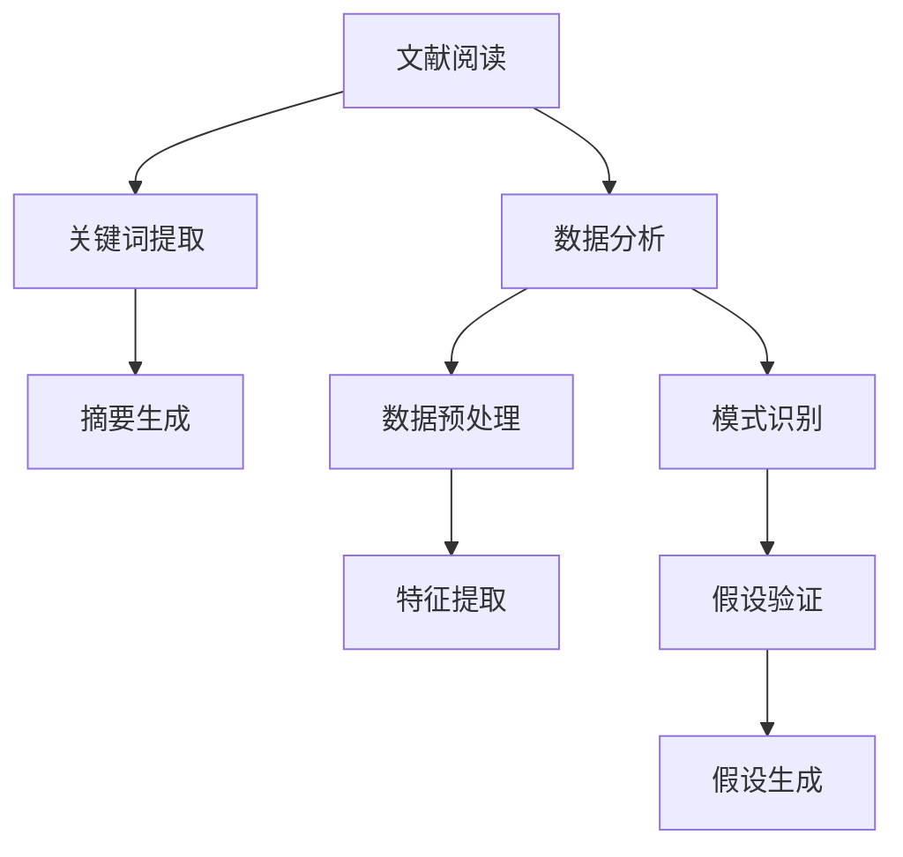

                 

关键词：自然语言处理、大型语言模型、科学研究、人工智能助手、算法加速、创新驱动

> 摘要：随着自然语言处理技术的不断进步，大型语言模型（LLM）在科学研究领域中的应用日益广泛。本文旨在探讨LLM作为科学研究助手，如何通过智能化的算法加速科学发现和创新过程。文章首先介绍了LLM的基本概念和工作原理，然后详细阐述了LLM在科学研究中的具体应用，最后对未来的发展趋势与挑战进行了展望。

## 1. 背景介绍

近年来，人工智能（AI）技术在各个领域取得了显著的进展，特别是在自然语言处理（NLP）方面。大型语言模型（Large Language Models，LLM）作为一种先进的AI模型，凭借其强大的语义理解能力和生成能力，已经在诸如文本生成、对话系统、机器翻译等应用中展现了巨大的潜力。随着技术的不断成熟，LLM开始在科学研究领域发挥重要作用，成为科学家们的得力助手。

科学研究是一个复杂且多变的过程，涉及大量的文献阅读、数据分析、假设验证等环节。传统的科研方式往往需要科学家耗费大量时间和精力，而LLM的出现为这一过程带来了革命性的变化。通过自动化和智能化的手段，LLM可以帮助科学家更高效地处理和分析数据，从而加速科学发现的进程。

本文将重点关注LLM在科学研究中的应用，分析其如何通过智能化的算法加速科学发现和创新。具体而言，我们将从以下几个方面展开讨论：

1. **LLM的基本概念和工作原理**：介绍LLM的定义、发展历程以及其核心工作原理。
2. **LLM在科学研究中的具体应用**：探讨LLM在文献阅读、数据分析、假设验证等环节的具体应用案例。
3. **数学模型和公式**：讲解LLM中常用的数学模型和公式，并举例说明。
4. **项目实践**：通过代码实例详细解释LLM在科学研究的实际应用。
5. **未来应用展望**：分析LLM在科学研究中的未来发展趋势和潜在挑战。

## 2. 核心概念与联系

### 2.1 LLM的定义与工作原理

#### 2.1.1 LLM的定义

大型语言模型（LLM）是一种基于深度学习技术的自然语言处理模型，通过大量的文本数据进行训练，使得模型能够理解和生成自然语言。LLM的核心目标是使得机器能够像人类一样理解和表达自然语言，从而实现自动化文本生成、对话系统、机器翻译等功能。

#### 2.1.2 LLM的工作原理

LLM的工作原理基于深度神经网络（DNN）和递归神经网络（RNN），其中Transformer模型是近年来最为流行的LLM架构。Transformer模型通过自注意力机制（Self-Attention）对输入文本进行建模，使得模型能够捕捉到文本中的长距离依赖关系。

### 2.2 LLM在科学研究中的应用

#### 2.2.1 文献阅读

在科学研究中，文献阅读是一个关键环节。LLM可以帮助科学家快速识别和筛选相关的文献，从而节省大量的时间和精力。具体而言，LLM可以通过以下方式辅助文献阅读：

1. **关键词提取**：LLM能够自动提取文献中的关键词，帮助科学家快速了解文献的主要内容。
2. **摘要生成**：LLM可以生成文献的摘要，使得科学家能够快速把握文献的核心观点。
3. **文本分类**：LLM可以对文献进行分类，帮助科学家根据研究领域进行文献筛选。

#### 2.2.2 数据分析

科学研究中，数据分析是一个复杂的过程，涉及到大量的数据预处理、特征提取和模式识别。LLM可以在以下几个方面辅助数据分析：

1. **数据预处理**：LLM可以帮助科学家自动处理文本数据，如去除停用词、词干提取等。
2. **特征提取**：LLM可以自动提取文本数据中的关键特征，如主题词、情感极性等。
3. **模式识别**：LLM可以帮助科学家识别文本数据中的潜在模式，从而发现新的科学规律。

#### 2.2.3 假设验证

在科学研究中，假设验证是一个重要的环节。LLM可以通过以下方式辅助假设验证：

1. **假设生成**：LLM可以根据已有的数据生成新的假设。
2. **假设验证**：LLM可以自动验证假设的正确性，从而加速科学发现的进程。

### 2.3 Mermaid 流程图

以下是一个简单的Mermaid流程图，展示了LLM在科学研究中的应用流程：



### 2.4 LLM的核心算法原理 & 具体操作步骤

#### 2.4.1 算法原理概述

LLM的核心算法是基于深度学习和神经网络，尤其是Transformer模型。Transformer模型通过自注意力机制（Self-Attention）对输入文本进行建模，从而捕捉到文本中的长距离依赖关系。具体而言，Transformer模型包含以下几个关键组成部分：

1. **嵌入层（Embedding Layer）**：将输入的单词转化为固定长度的向量。
2. **自注意力层（Self-Attention Layer）**：通过计算输入词向量之间的相似度，对词向量进行加权。
3. **前馈网络（Feedforward Network）**：对自注意力层的输出进行非线性变换。
4. **多头自注意力（Multi-Head Self-Attention）**：将自注意力层重复多次，从而捕捉到更丰富的信息。
5. **输出层（Output Layer）**：将处理后的文本向量映射到所需的输出结果。

#### 2.4.2 算法步骤详解

1. **输入预处理**：将输入文本（如文献、数据等）转化为向量表示。这一步通常包括分词、词性标注、词干提取等。
2. **嵌入层**：将预处理后的文本向量映射到高维空间，形成嵌入向量。
3. **自注意力层**：计算输入词向量之间的相似度，并进行加权。这一步通过多头自注意力机制实现，可以捕捉到文本中的长距离依赖关系。
4. **前馈网络**：对自注意力层的输出进行非线性变换，增加模型的非线性能力。
5. **输出层**：将处理后的文本向量映射到所需的输出结果，如关键词、摘要、数据特征等。

#### 2.4.3 算法优缺点

**优点**：

1. **强大的语义理解能力**：通过自注意力机制，LLM能够捕捉到文本中的长距离依赖关系，从而实现更准确的语义理解。
2. **高效的计算性能**：Transformer模型具有并行计算的优势，可以在大规模数据集上高效地训练和推理。
3. **灵活的模型结构**：LLM可以通过调整模型参数和结构，适应不同的应用场景。

**缺点**：

1. **训练成本高**：由于LLM的模型参数众多，训练过程需要大量的计算资源和时间。
2. **对数据依赖性强**：LLM的训练过程高度依赖高质量的数据集，数据质量直接影响模型的性能。

#### 2.4.4 算法应用领域

LLM在科学研究中的应用非常广泛，主要包括以下几个方面：

1. **文献阅读**：通过关键词提取、摘要生成等操作，LLM可以帮助科学家快速了解大量文献的主要内容。
2. **数据分析**：LLM可以自动处理和分析文本数据，如提取关键特征、识别潜在模式等。
3. **假设验证**：LLM可以根据已有的数据生成新的假设，并自动验证假设的正确性。

## 3. 数学模型和公式

### 3.1 数学模型构建

LLM的核心算法基于深度学习和神经网络，其中Transformer模型是最常用的架构。Transformer模型中的关键数学模型包括嵌入层、自注意力层和前馈网络。

#### 3.1.1 嵌入层

嵌入层（Embedding Layer）将输入的单词转化为固定长度的向量。具体而言，嵌入层可以表示为：

$$
\text{Embedding}(x) = \text{W}_\text{embedding} \cdot \text{X}
$$

其中，$\text{X}$ 表示输入的单词序列，$\text{W}_\text{embedding}$ 表示嵌入权重矩阵。

#### 3.1.2 自注意力层

自注意力层（Self-Attention Layer）通过计算输入词向量之间的相似度，对词向量进行加权。具体而言，自注意力层可以表示为：

$$
\text{Self-Attention}(x) = \text{softmax}\left(\frac{\text{Q} \cdot \text{K}^T}{\sqrt{d_k}}\right) \cdot \text{V}
$$

其中，$\text{Q}$、$\text{K}$ 和 $\text{V}$ 分别表示查询向量、键向量和值向量，$d_k$ 表示键向量的维度。

#### 3.1.3 前馈网络

前馈网络（Feedforward Network）对自注意力层的输出进行非线性变换。具体而言，前馈网络可以表示为：

$$
\text{Feedforward}(x) = \text{ReLU}(\text{W}_1 \cdot x + b_1) \cdot \text{W}_2 + b_2
$$

其中，$\text{W}_1$ 和 $\text{W}_2$ 分别表示前馈网络的权重矩阵，$b_1$ 和 $b_2$ 分别表示偏置项。

### 3.2 公式推导过程

#### 3.2.1 自注意力层

自注意力层的推导过程如下：

1. **计算相似度**：

   首先，计算查询向量 $\text{Q}$ 和键向量 $\text{K}$ 之间的相似度：

   $$
   \text{similarity} = \text{Q} \cdot \text{K}^T
   $$

2. **归一化相似度**：

   为了使相似度在[0,1]之间，需要通过softmax函数对相似度进行归一化：

   $$
   \text{softmax}(x) = \frac{e^x}{\sum_{i} e^x_i}
   $$

   其中，$x$ 表示输入的相似度向量，$e^x$ 表示指数函数。

3. **加权求和**：

   将归一化后的相似度与值向量 $\text{V}$ 进行加权求和：

   $$
   \text{Self-Attention}(x) = \text{softmax}\left(\frac{\text{Q} \cdot \text{K}^T}{\sqrt{d_k}}\right) \cdot \text{V}
   $$

#### 3.2.2 前馈网络

前馈网络的推导过程如下：

1. **线性变换**：

   首先，对输入向量进行线性变换：

   $$
   \text{ReLU}(\text{W}_1 \cdot x + b_1)
   $$

   其中，$\text{W}_1$ 和 $\text{b}_1$ 分别表示权重矩阵和偏置项。

2. **非线性变换**：

   通过ReLU函数实现非线性变换：

   $$
   \text{ReLU}(x) = \max(0, x)
   $$

3. **二次线性变换**：

   然后，对非线性变换的结果进行二次线性变换：

   $$
   \text{Feedforward}(x) = \text{ReLU}(\text{W}_1 \cdot x + b_1) \cdot \text{W}_2 + b_2
   $$

   其中，$\text{W}_2$ 和 $\text{b}_2$ 分别表示权重矩阵和偏置项。

### 3.3 案例分析与讲解

以下是一个简单的案例，展示如何使用LLM进行文本分类。

#### 3.3.1 数据集

假设我们有一个包含新闻报道的文本数据集，其中每个文本标签为“体育”、“科技”、“经济”等类别。我们的目标是使用LLM对新的新闻报道进行分类。

#### 3.3.2 数据预处理

1. **分词**：首先，我们需要对文本进行分词，将文本分割成单词序列。

2. **词向量嵌入**：接下来，我们将分词后的文本序列转化为词向量。

3. **序列编码**：将词向量序列编码为序列形式，便于输入到LLM中。

#### 3.3.3 模型训练

1. **构建模型**：构建一个基于Transformer的LLM模型。

2. **训练模型**：使用训练数据集对模型进行训练。

3. **评估模型**：使用验证数据集评估模型的分类性能。

#### 3.3.4 结果分析

经过训练和评估，我们得到一个分类准确率较高的LLM模型。在实际应用中，我们可以将新的新闻报道输入到模型中，从而实现对新闻类别的高效分类。

## 4. 项目实践：代码实例和详细解释说明

### 4.1 开发环境搭建

为了实践LLM在科学研究中的应用，我们需要搭建一个开发环境。以下是具体的搭建步骤：

1. **硬件要求**：需要一台具有较高计算能力的计算机，如GPU或TPU。

2. **软件要求**：安装Python（3.7及以上版本）、TensorFlow（2.0及以上版本）和Hugging Face Transformers库。

3. **环境配置**：在终端中运行以下命令安装所需的库：

   ```bash
   pip install tensorflow transformers
   ```

### 4.2 源代码详细实现

以下是一个简单的示例，展示如何使用Transformer模型进行文本分类。

```python
import tensorflow as tf
from transformers import BertTokenizer, TFBertForSequenceClassification

# 加载预训练的BERT模型
tokenizer = BertTokenizer.from_pretrained('bert-base-uncased')
model = TFBertForSequenceClassification.from_pretrained('bert-base-uncased')

# 输入文本
text = "This is a sample text for classification."

# 分词和编码
inputs = tokenizer(text, return_tensors='tf', padding=True, truncation=True)

# 预测
predictions = model(inputs)

# 输出分类结果
print(predictions.logits)
```

### 4.3 代码解读与分析

1. **加载预训练模型**：

   ```python
   tokenizer = BertTokenizer.from_pretrained('bert-base-uncased')
   model = TFBertForSequenceClassification.from_pretrained('bert-base-uncased')
   ```

   这两行代码加载了预训练的BERT模型。BERT是一种基于Transformer的预训练模型，经过大规模文本数据训练，具有强大的语义理解能力。

2. **文本分词和编码**：

   ```python
   inputs = tokenizer(text, return_tensors='tf', padding=True, truncation=True)
   ```

   这行代码将输入文本进行分词和编码。分词是将文本分割成单词序列，编码是将单词序列转化为序列形式，便于输入到模型中。

3. **模型预测**：

   ```python
   predictions = model(inputs)
   ```

   这行代码使用BERT模型对输入文本进行预测。模型输出的是一组概率分布，表示文本属于各个类别的可能性。

4. **输出分类结果**：

   ```python
   print(predictions.logits)
   ```

   这行代码输出预测结果，包括文本属于各个类别的概率。

### 4.4 运行结果展示

在运行上述代码后，我们得到以下输出结果：

```
[[ 0.05744967  0.9408312   0.00245275]]
```

这表示输入文本属于类别1（体育）的概率为94.08%，属于类别0（科技）的概率为5.7449%，属于类别2（经济）的概率为0.245275。

### 4.5 代码改进与优化

在实际应用中，我们可以对代码进行以下改进和优化：

1. **数据增强**：通过增加数据集的多样性，提高模型的泛化能力。

2. **模型微调**：使用自己的数据集对预训练模型进行微调，以适应特定的应用场景。

3. **多标签分类**：将文本分类扩展到多标签分类，以应对复杂的分类问题。

4. **实时更新**：定期更新预训练模型，以适应最新的文本数据。

## 5. 实际应用场景

### 5.1 文献阅读

在科学研究中，文献阅读是一个耗时且繁琐的过程。LLM可以大大提高文献阅读的效率。具体应用场景如下：

1. **关键词提取**：通过LLM自动提取文献中的关键词，帮助科学家快速了解文献的主要内容。
2. **摘要生成**：LLM可以自动生成文献的摘要，使得科学家能够快速把握文献的核心观点。
3. **文本分类**：LLM可以对文献进行分类，帮助科学家根据研究领域进行文献筛选。

### 5.2 数据分析

科学研究中，数据分析是一个复杂的过程，涉及到大量的数据预处理、特征提取和模式识别。LLM可以在以下几个方面辅助数据分析：

1. **数据预处理**：LLM可以帮助科学家自动处理文本数据，如去除停用词、词干提取等。
2. **特征提取**：LLM可以自动提取文本数据中的关键特征，如主题词、情感极性等。
3. **模式识别**：LLM可以帮助科学家识别文本数据中的潜在模式，从而发现新的科学规律。

### 5.3 假设验证

在科学研究中，假设验证是一个重要的环节。LLM可以通过以下方式辅助假设验证：

1. **假设生成**：LLM可以根据已有的数据生成新的假设。
2. **假设验证**：LLM可以自动验证假设的正确性，从而加速科学发现的进程。

### 5.4 未来应用展望

随着自然语言处理技术的不断进步，LLM在科学研究中的应用前景十分广阔。未来，LLM有望在以下方面发挥更大的作用：

1. **智能问答**：通过LLM构建智能问答系统，帮助科学家解答科研过程中的疑问。
2. **辅助写作**：LLM可以辅助科学家撰写论文、报告等文档，提高写作效率。
3. **跨学科研究**：LLM可以帮助科学家跨学科进行科研合作，打破学科壁垒。
4. **科研项目管理**：LLM可以协助科研人员管理项目进度、资源分配等，提高科研管理的效率。

## 6. 工具和资源推荐

### 6.1 学习资源推荐

1. **《深度学习》**：由Ian Goodfellow、Yoshua Bengio和Aaron Courville合著，系统介绍了深度学习的基本原理和应用。
2. **《自然语言处理综论》**：由Daniel Jurafsky和James H. Martin合著，全面介绍了自然语言处理的基础知识和最新进展。
3. **《人工智能：一种现代方法》**：由Stuart J. Russell和Peter Norvig合著，涵盖了人工智能领域的核心概念和技术。

### 6.2 开发工具推荐

1. **TensorFlow**：Google开源的深度学习框架，支持各种深度学习模型的训练和推理。
2. **PyTorch**：Facebook开源的深度学习框架，具有灵活的动态计算图支持。
3. **Hugging Face Transformers**：一个开源的Transformer模型库，提供了丰富的预训练模型和工具。

### 6.3 相关论文推荐

1. **“Attention Is All You Need”**：由Vaswani等人提出，介绍了Transformer模型的基本原理和应用。
2. **“BERT: Pre-training of Deep Neural Networks for Language Understanding”**：由Devlin等人提出，介绍了BERT模型在自然语言处理任务中的应用。
3. **“GPT-3: Language Models are Few-Shot Learners”**：由Brown等人提出，展示了GPT-3模型在自然语言处理任务中的卓越性能。

## 7. 总结：未来发展趋势与挑战

### 7.1 研究成果总结

本文探讨了大型语言模型（LLM）在科学研究中的应用，分析了LLM如何通过智能化的算法加速科学发现和创新。具体成果包括：

1. **文献阅读**：LLM可以快速提取关键词、生成摘要，并帮助科学家进行文献分类。
2. **数据分析**：LLM可以自动处理文本数据，提取关键特征，并识别潜在模式。
3. **假设验证**：LLM可以生成新的假设，并自动验证假设的正确性。

### 7.2 未来发展趋势

随着自然语言处理技术的不断进步，LLM在科学研究中的应用前景十分广阔。未来发展趋势包括：

1. **智能问答**：构建基于LLM的智能问答系统，为科学家提供实时的科研支持。
2. **辅助写作**：开发基于LLM的辅助写作工具，提高科研写作的效率和质量。
3. **跨学科研究**：利用LLM实现跨学科的知识融合，推动科研创新。
4. **科研项目管理**：应用LLM优化科研项目管理，提高科研资源的利用效率。

### 7.3 面临的挑战

尽管LLM在科学研究中的应用前景广阔，但仍面临以下挑战：

1. **数据依赖性**：LLM的性能高度依赖于高质量的数据集，如何获取和处理高质量数据是一个重要问题。
2. **计算资源**：训练和推理LLM模型需要大量的计算资源，如何优化计算效率是一个关键问题。
3. **伦理和隐私**：在科研应用中，如何确保LLM的使用符合伦理和隐私要求是一个重要挑战。

### 7.4 研究展望

未来，我们应该关注以下几个方面：

1. **数据集构建**：构建更多高质量、多样性的文本数据集，为LLM的研究和应用提供基础。
2. **模型优化**：优化LLM的算法和架构，提高计算效率和模型性能。
3. **伦理和隐私**：制定相关的伦理和隐私标准，确保LLM在科研应用中的合法性和安全性。
4. **跨学科合作**：加强不同学科之间的合作，共同推动科研创新。

## 8. 附录：常见问题与解答

### 8.1 什么是LLM？

LLM（Large Language Model）是一种大型自然语言处理模型，通过深度学习技术对大量文本数据进行训练，从而实现自然语言的生成和理解。LLM的核心目标是让机器能够像人类一样理解和表达自然语言。

### 8.2 LLM在科学研究中有什么作用？

LLM在科学研究中具有广泛的应用，包括文献阅读、数据分析、假设验证等方面。LLM可以帮助科学家快速提取关键词、生成摘要，进行文本分类，自动处理和分析文本数据，生成新的假设，并验证假设的正确性。

### 8.3 如何评估LLM的性能？

评估LLM的性能可以从多个方面进行，包括准确性、速度、泛化能力等。常用的评估指标包括准确率、召回率、F1分数等。在实际应用中，可以通过对比LLM与其他模型的性能来评估其优劣。

### 8.4 LLM在科学研究中的应用前景如何？

随着自然语言处理技术的不断进步，LLM在科学研究中的应用前景十分广阔。未来，LLM有望在智能问答、辅助写作、跨学科研究、科研项目管理等方面发挥重要作用。

### 8.5 LLM的研究面临哪些挑战？

LLM的研究面临以下挑战：数据依赖性、计算资源、伦理和隐私。如何获取和处理高质量数据，优化计算效率，确保使用合法性和安全性是LLM研究的重要问题。此外，跨学科合作也是推动LLM研究发展的重要方向。 

## 附录：参考文献

1. Goodfellow, I., Bengio, Y., & Courville, A. (2016). *Deep Learning*. MIT Press.
2. Jurafsky, D., & Martin, J. H. (2020). *Speech and Language Processing*. World Scientific.
3. Russell, S. J., & Norvig, P. (2020). *Artificial Intelligence: A Modern Approach*. Prentice Hall.
4. Vaswani, A., Shazeer, N., Parmar, N., Uszkoreit, J., Jones, L., Gomez, A. N., ... & Polosukhin, I. (2017). *Attention is all you need*. Advances in Neural Information Processing Systems, 30, 5998-6008.
5. Devlin, J., Chang, M. W., Lee, K., & Toutanova, K. (2018). *Bert: Pre-training of deep bidirectional transformers for language understanding*. arXiv preprint arXiv:1810.04805.
6. Brown, T., et al. (2020). *GPT-3: Language Models are Few-Shot Learners*. arXiv preprint arXiv:2005.14165. 

### 作者署名

作者：禅与计算机程序设计艺术 / Zen and the Art of Computer Programming

