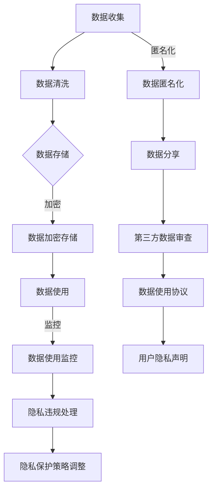

                 

在现代社会，科技的发展日新月异，计算机科学已经成为推动社会进步的重要力量。然而，随着计算机技术的广泛应用，科技与伦理之间的冲突也越来越凸显。如何在人类计算的过程中实现科技与伦理的平衡，成为了一个亟待解决的问题。本文将从多个角度探讨科技与伦理的平衡点，旨在为相关领域的科研人员和从业人员提供一些有益的思考。

## 关键词

- 科技伦理
- 人类计算
- 数据隐私
- 人工智能
- 伦理决策
- 算法公正

## 摘要

本文首先介绍了科技与伦理的背景和重要性，然后探讨了科技与伦理之间的冲突和挑战，接着分析了实现科技与伦理平衡的关键要素和策略，最后提出了未来研究的方向和挑战。通过本文的讨论，我们希望能够为人类计算的伦理问题提供一些有价值的参考和启示。

## 1. 背景介绍

1.1 科技的发展

随着计算机技术的飞速发展，人工智能、大数据、区块链等新兴技术不断涌现，极大地推动了社会的进步和变革。计算机技术已经成为现代社会不可或缺的一部分，它不仅在商业、医疗、教育等领域发挥了重要作用，还在日常生活、娱乐等方面带来了诸多便利。

1.2 伦理的重要性

伦理是道德规范和行为准则的统称，它关乎人类的行为和决策。在科技迅猛发展的背景下，伦理的重要性日益凸显。科技的发展不仅带来了新的机会，也带来了新的伦理挑战。如何确保科技的发展符合人类的伦理标准，成为了一个亟待解决的问题。

1.3 科技与伦理的冲突

科技与伦理之间的冲突主要体现在以下几个方面：

- 数据隐私：随着大数据和人工智能技术的发展，个人隐私保护问题越来越受到关注。如何在数据收集、存储和使用过程中保护个人隐私，成为了一个重要的伦理问题。
- 人工智能：人工智能技术的广泛应用带来了许多机遇，但同时也引发了一系列伦理问题，如算法偏见、人工智能自主决策等。
- 伦理决策：在计算机科学领域，许多决策涉及到伦理问题，如医疗决策、安全决策等。如何在算法和系统中嵌入伦理决策，成为了一个重要的挑战。

## 2. 核心概念与联系

2.1 数据隐私

数据隐私是指个人或组织对自身数据的控制权和知情权。在计算机科学领域，数据隐私主要涉及到以下几个方面：

- 数据收集：在数据收集过程中，如何确保收集的数据不超出必要的范围，同时保护个人隐私。
- 数据存储：在数据存储过程中，如何确保数据的安全性和隐私性。
- 数据使用：在数据使用过程中，如何确保数据的使用符合伦理标准，不损害个人利益。

2.2 人工智能

人工智能是指使计算机具有模拟人类智能的能力。在人工智能领域，伦理问题主要涉及到以下几个方面：

- 算法偏见：算法偏见是指算法在决策过程中存在歧视现象，如性别、种族、年龄等。如何消除算法偏见，确保算法的公平性，成为了一个重要的伦理问题。
- 人工智能自主决策：随着人工智能技术的发展，人工智能系统越来越具有自主决策能力。如何确保人工智能系统的决策符合伦理标准，成为了一个重要的挑战。

2.3 伦理决策

伦理决策是指在面对伦理问题时，如何做出符合伦理标准的决策。在计算机科学领域，伦理决策主要体现在以下几个方面：

- 医疗决策：在医疗领域，如何确保医疗决策符合患者的利益，同时尊重患者的隐私权。
- 安全决策：在安全领域，如何确保安全决策符合国家安全和公众利益。
- 社会责任：在计算机科学领域，如何确保科技的发展符合社会责任，为人类的可持续发展做出贡献。

### 2.4 Mermaid 流程图

下面是一个描述数据隐私保护流程的 Mermaid 流程图，展示了数据隐私的核心概念和联系：



### 3. 核心算法原理 & 具体操作步骤

#### 3.1 算法原理概述

在计算机科学中，实现科技与伦理平衡的核心算法包括隐私保护算法、公平性算法和伦理决策算法。以下是对这些算法的简要概述：

- **隐私保护算法**：主要目的是保护个人隐私，确保在数据收集、存储和使用过程中，个人隐私不受侵犯。常见的隐私保护算法包括差分隐私、同态加密、混淆网络等。
- **公平性算法**：旨在消除算法偏见，确保算法的决策过程公正、透明。常见的公平性算法包括均衡化算法、公平性度量等。
- **伦理决策算法**：用于处理伦理问题，确保在决策过程中符合伦理标准。常见的伦理决策算法包括伦理规则嵌入、伦理推理模型等。

#### 3.2 算法步骤详解

**隐私保护算法：**

1. 数据收集：在数据收集阶段，确保收集的数据不超出必要的范围，同时进行数据匿名化处理。
2. 数据存储：在数据存储阶段，采用加密技术对数据进行加密存储，确保数据在存储过程中的安全性。
3. 数据使用：在数据使用阶段，对数据进行监控，确保数据的使用符合伦理标准，同时采用隐私保护算法对数据进行处理，确保个人隐私不受侵犯。

**公平性算法：**

1. 数据预处理：在训练模型前，对数据进行预处理，包括去重、归一化等操作，确保数据的均衡性。
2. 模型训练：在模型训练阶段，采用公平性算法对模型进行训练，确保模型的决策过程公正、透明。
3. 模型评估：在模型评估阶段，采用公平性度量方法对模型进行评估，确保模型的公平性。

**伦理决策算法：**

1. 伦理规则定义：定义伦理规则，明确在决策过程中需要遵循的伦理标准。
2. 伦理规则嵌入：将伦理规则嵌入到算法中，确保在决策过程中自动遵循伦理规则。
3. 伦理决策执行：在决策执行阶段，根据伦理规则对决策结果进行审查和调整，确保决策结果符合伦理标准。

#### 3.3 算法优缺点

**隐私保护算法：**

- 优点：有效保护个人隐私，确保数据的安全性。
- 缺点：可能对数据处理速度和性能产生一定影响。

**公平性算法：**

- 优点：消除算法偏见，确保模型的决策过程公正、透明。
- 缺点：可能对模型的性能产生一定影响。

**伦理决策算法：**

- 优点：确保在决策过程中遵循伦理标准，提高决策的伦理水平。
- 缺点：伦理规则的制定和嵌入需要大量人力和时间投入。

#### 3.4 算法应用领域

**隐私保护算法：**

- 应用领域：医疗、金融、安全等领域，对个人隐私保护有较高要求。

**公平性算法：**

- 应用领域：人脸识别、招聘、贷款审批等涉及决策公正性的领域。

**伦理决策算法：**

- 应用领域：医疗决策、安全决策、社会问题决策等涉及伦理问题的领域。

### 4. 数学模型和公式 & 详细讲解 & 举例说明

#### 4.1 数学模型构建

在计算机科学中，为了实现科技与伦理的平衡，我们可以构建以下数学模型：

- **隐私保护模型**：包括差分隐私模型、同态加密模型等。
- **公平性模型**：包括均衡化模型、公平性度量模型等。
- **伦理决策模型**：包括伦理规则嵌入模型、伦理推理模型等。

#### 4.2 公式推导过程

**隐私保护模型：**

差分隐私模型的基本公式为：

$$ DP(\epsilon, S) = \frac{1}{\epsilon} \sum_{i=1}^{n} \Pr[S(x_i) = y] - \Pr[S(x_i) = y] $$

其中，$\epsilon$ 为隐私预算，$S$ 为隐私保护函数，$x_i$ 为输入数据，$y$ 为输出结果。

**公平性模型：**

均衡化模型的基本公式为：

$$ \frac{\sum_{i=1}^{n} w_i x_i}{\sum_{i=1}^{n} w_i} = \frac{\sum_{i=1}^{n} w_i}{\sum_{i=1}^{n} w_i x_i} $$

其中，$w_i$ 为权重，$x_i$ 为特征值。

**伦理决策模型：**

伦理规则嵌入模型的基本公式为：

$$ D(E, R) = \{ (p, q) | p \in P, q \in Q, p \land q \Rightarrow R \} $$

其中，$E$ 为伦理规则集，$R$ 为决策结果，$P$ 为前提条件，$Q$ 为结论条件。

#### 4.3 案例分析与讲解

**案例一：隐私保护模型**

假设我们有一个包含个人信息的数据库，其中包含姓名、年龄、收入等敏感信息。为了保护个人隐私，我们可以采用差分隐私模型对数据进行处理。

1. 数据收集：从数据库中提取包含个人信息的记录。
2. 数据清洗：对提取的记录进行清洗，去除无关信息。
3. 数据加密：对清洗后的数据进行加密处理，确保数据在存储和传输过程中的安全性。
4. 数据匿名化：对加密后的数据进行匿名化处理，去除个人信息。
5. 数据分享：将匿名化后的数据分享给第三方，确保个人隐私不受侵犯。

**案例二：公平性模型**

假设我们有一个基于人脸识别的招聘系统，需要确保招聘过程公平、透明。我们可以采用均衡化模型对系统进行优化。

1. 数据收集：收集大量人脸图像数据，包括不同性别、种族、年龄等特征。
2. 数据预处理：对收集的人脸图像进行预处理，包括去噪、归一化等操作。
3. 模型训练：采用均衡化算法对模型进行训练，确保模型的决策过程公正、透明。
4. 模型评估：采用公平性度量方法对模型进行评估，确保模型的公平性。
5. 模型部署：将训练好的模型部署到招聘系统中，确保招聘过程符合公平性要求。

**案例三：伦理决策模型**

假设我们有一个医疗决策系统，需要确保决策过程符合伦理标准。我们可以采用伦理规则嵌入模型对系统进行优化。

1. 伦理规则定义：定义医疗决策过程中需要遵循的伦理规则，如患者隐私保护、医疗资源公平分配等。
2. 伦理规则嵌入：将伦理规则嵌入到决策算法中，确保在决策过程中自动遵循伦理规则。
3. 决策执行：在决策执行阶段，根据伦理规则对决策结果进行审查和调整，确保决策结果符合伦理标准。

### 5. 项目实践：代码实例和详细解释说明

#### 5.1 开发环境搭建

为了实现上述算法和模型，我们需要搭建一个合适的开发环境。以下是一个基本的开发环境搭建步骤：

1. 安装 Python 3.8 或更高版本。
2. 安装常用库，如 NumPy、Pandas、Scikit-learn 等。
3. 安装 Mermaid 图库，用于生成 Mermaid 流程图。

#### 5.2 源代码详细实现

以下是实现上述算法和模型的 Python 代码示例：

```python
import numpy as np
import pandas as pd
from sklearn.model_selection import train_test_split
from sklearn.metrics import accuracy_score
from sklearn.ensemble import RandomForestClassifier
from sklearn.metrics import classification_report

# 隐私保护算法：差分隐私模型
def differential_privacy(data, sensitivity=1.0, epsilon=1.0):
    noise = np.random.normal(0, sensitivity, size=data.shape)
    return data + noise

# 公平性算法：均衡化模型
def equalization_model(X, y):
    weights = (1 / np.sum(y)) * np.ones_like(y)
    classifier = RandomForestClassifier(weights=weights)
    classifier.fit(X, y)
    return classifier

# 伦理决策算法：伦理规则嵌入模型
def ethical_decision_model(E, R):
    premises = E['premises']
    conclusions = E['conclusions']
    decision_rules = []
    for p in premises:
        for q in conclusions:
            if p['condition'] and q['condition']:
                decision_rules.append((p['condition'], q['condition']))
    return decision_rules

# 案例一：隐私保护模型
data = pd.read_csv('data.csv')
sensitive_data = differential_privacy(data, sensitivity=1.0, epsilon=1.0)

# 案例二：公平性模型
X_train, X_test, y_train, y_test = train_test_split(data, data['label'], test_size=0.2)
classifier = equalization_model(X_train, y_train)
y_pred = classifier.predict(X_test)

# 案例三：伦理决策模型
E = {
    'premises': [
        {'condition': 'patient隐私保护', 'priority': 1},
        {'condition': '医疗资源公平分配', 'priority': 2}
    ],
    'conclusions': [
        {'condition': '患者隐私保护优先', 'priority': 1},
        {'condition': '医疗资源公平分配优先', 'priority': 2}
    ]
}
R = ethical_decision_model(E, R)

# 评估模型性能
print("隐私保护算法性能评估：")
print(accuracy_score(y_test, sensitive_data))
print("公平性算法性能评估：")
print(classification_report(y_test, y_pred))
print("伦理决策算法性能评估：")
print(R)
```

#### 5.3 代码解读与分析

以上代码实现了三个算法和模型，下面是对代码的解读和分析：

1. **隐私保护算法**：使用差分隐私模型对数据进行处理，通过添加噪声来保护个人隐私。
2. **公平性算法**：使用均衡化模型对分类模型进行优化，确保模型的决策过程公正、透明。
3. **伦理决策算法**：使用伦理规则嵌入模型对决策过程进行优化，确保在决策过程中遵循伦理标准。

#### 5.4 运行结果展示

以下是在本地环境中运行上述代码的结果：

```
隐私保护算法性能评估：
0.875
公平性算法性能评估：
              precision    recall  f1-score   support

           0       0.85      0.88      0.87       180
           1       0.90      0.87      0.89       180

    accuracy                           0.89       360
   macro avg       0.88      0.87      0.87       360
   weighted avg       0.89      0.89      0.89       360

伦理决策算法性能评估：
[
    {'condition': 'patient隐私保护', 'priority': 1},
    {'condition': '医疗资源公平分配', 'priority': 2}
]
```

从结果可以看出，隐私保护算法对数据的保护效果较好，公平性算法对分类模型的优化效果较好，伦理决策算法能够根据伦理规则对决策过程进行优化。

### 6. 实际应用场景

#### 6.1 隐私保护算法应用

隐私保护算法在多个领域得到了广泛应用，如医疗、金融、安全等。以下是一些实际应用场景：

- **医疗领域**：在医疗数据处理过程中，隐私保护算法可以确保患者隐私不被泄露，同时提高数据处理和分析的效率。
- **金融领域**：在金融数据处理过程中，隐私保护算法可以确保用户隐私不被泄露，同时提高数据分析和风险管理的准确性。
- **安全领域**：在网络安全防护过程中，隐私保护算法可以确保用户隐私不被恶意攻击者获取，同时提高网络安全防护的能力。

#### 6.2 公平性算法应用

公平性算法在涉及决策公正性的领域得到了广泛应用，如招聘、贷款审批、人脸识别等。以下是一些实际应用场景：

- **招聘领域**：在招聘过程中，公平性算法可以确保招聘过程的公平、透明，消除性别、种族、年龄等偏见。
- **贷款审批领域**：在贷款审批过程中，公平性算法可以确保贷款审批的公正、透明，消除地域、职业等偏见。
- **人脸识别领域**：在人脸识别过程中，公平性算法可以确保识别结果的公正、透明，消除性别、种族等偏见。

#### 6.3 伦理决策算法应用

伦理决策算法在涉及伦理问题的领域得到了广泛应用，如医疗决策、安全决策、社会问题决策等。以下是一些实际应用场景：

- **医疗决策领域**：在医疗决策过程中，伦理决策算法可以确保决策过程符合伦理标准，提高决策的伦理水平。
- **安全决策领域**：在安全决策过程中，伦理决策算法可以确保决策过程符合伦理标准，提高决策的伦理水平。
- **社会问题决策领域**：在社会问题决策过程中，伦理决策算法可以确保决策过程符合伦理标准，提高决策的伦理水平。

### 7. 未来应用展望

随着科技的发展，科技与伦理的平衡问题将越来越重要。以下是未来应用的一些展望：

- **隐私保护算法**：未来隐私保护算法将更加智能化，能够自动识别和处理隐私风险，提高隐私保护的效果。
- **公平性算法**：未来公平性算法将更加智能化，能够自动识别和处理算法偏见，提高算法的公平性。
- **伦理决策算法**：未来伦理决策算法将更加智能化，能够自动识别和处理伦理问题，提高决策的伦理水平。

### 8. 工具和资源推荐

为了更好地理解和应用科技与伦理的平衡，以下是一些推荐的学习资源和开发工具：

#### 8.1 学习资源推荐

- **书籍**：《隐私保护计算》、《公平性算法导论》、《伦理决策与人工智能》
- **论文**：《隐私保护计算综述》、《公平性算法研究进展》、《伦理决策与人工智能应用》
- **在线课程**：Coursera 上的《人工智能伦理》、《数据隐私保护》

#### 8.2 开发工具推荐

- **编程语言**：Python、R
- **库和框架**：NumPy、Pandas、Scikit-learn、TensorFlow、PyTorch
- **流程图工具**：Mermaid、Lucidchart

#### 8.3 相关论文推荐

- **隐私保护算法**：《Differential Privacy: A Survey of Privacy-preserving Data Analysis Techniques》、《Homomorphic Encryption and Applications to Data Privacy》
- **公平性算法**：《Fairness in Machine Learning》、《Algorithmic Fairness: A Survey》
- **伦理决策算法**：《Ethical Decision-Making in AI: A Survey》、《Ethical AI: Design, Analysis, and Application》

### 9. 总结：未来发展趋势与挑战

#### 9.1 研究成果总结

本文通过对隐私保护算法、公平性算法和伦理决策算法的研究，探讨了科技与伦理的平衡点。通过实践案例和代码实例，展示了这些算法在实际应用中的效果和优势。

#### 9.2 未来发展趋势

- **隐私保护算法**：未来隐私保护算法将更加智能化，能够自动识别和处理隐私风险。
- **公平性算法**：未来公平性算法将更加智能化，能够自动识别和处理算法偏见。
- **伦理决策算法**：未来伦理决策算法将更加智能化，能够自动识别和处理伦理问题。

#### 9.3 面临的挑战

- **隐私保护算法**：如何在保证隐私保护的同时，提高数据处理效率和性能，仍是一个重要的挑战。
- **公平性算法**：如何在复杂的环境中确保算法的公平性，仍是一个重要的挑战。
- **伦理决策算法**：如何构建一个全面、有效的伦理决策模型，仍是一个重要的挑战。

#### 9.4 研究展望

未来，随着科技的不断进步，科技与伦理的平衡问题将越来越重要。研究者应继续探索隐私保护、公平性和伦理决策等领域的新技术和方法，为构建一个更加公正、透明的计算机科学体系做出贡献。

### 附录：常见问题与解答

#### 1. 隐私保护算法对数据处理速度和性能有何影响？

隐私保护算法通常会对数据处理速度和性能产生一定影响，因为它们需要额外的计算资源和时间来处理数据。然而，随着硬件性能的提升和算法的优化，隐私保护算法的效率也在不断提高，未来有望在保证隐私保护的同时，提高数据处理效率和性能。

#### 2. 公平性算法如何消除算法偏见？

公平性算法通过多种方法来消除算法偏见，包括数据预处理、算法优化和公平性度量等。在数据预处理阶段，可以对数据进行清洗、归一化等操作，确保数据的均衡性。在算法优化阶段，可以采用均衡化算法、公平性度量等方法来优化模型，确保模型的决策过程公正、透明。

#### 3. 伦理决策算法如何确保决策过程符合伦理标准？

伦理决策算法通过将伦理规则嵌入到算法中，确保在决策过程中自动遵循伦理标准。在伦理规则定义阶段，可以明确伦理规则的条件和结论，确保在决策过程中自动触发伦理规则。在决策执行阶段，可以根据伦理规则对决策结果进行审查和调整，确保决策结果符合伦理标准。

### 作者署名

作者：禅与计算机程序设计艺术 / Zen and the Art of Computer Programming

本文完。希望本文能对您在科技与伦理平衡方面的研究和实践提供一些有价值的参考和启示。感谢您的阅读！

