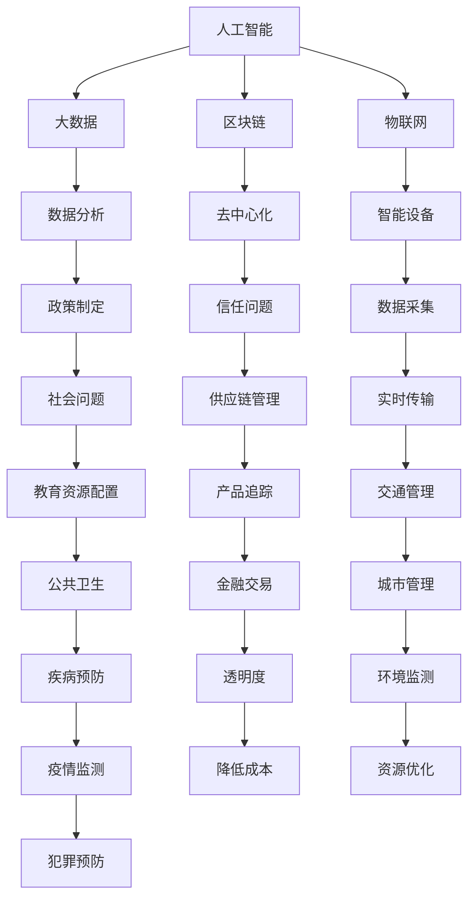

                 

在当今快速发展的信息技术时代，科技创新对社会治理的影响日益显著。从大数据分析到人工智能，从区块链到物联网，各种新兴技术正在重塑社会治理的方方面面。本文旨在探讨科技创新如何为社会治理带来新思路，以及这些技术在实际应用中所面临的问题和挑战。

## 关键词

- 科技创新
- 社会治理
- 人工智能
- 大数据
- 区块链
- 物联网

## 摘要

本文从多个角度分析了科技创新在社会治理中的作用。首先，我们回顾了科技发展的历史背景，探讨了新兴技术在治理中的应用。接着，我们深入探讨了人工智能、大数据、区块链和物联网等关键技术在社会治理中的具体应用。最后，我们总结了科技创新带来的机遇与挑战，并提出了未来发展的展望。

## 1. 背景介绍

### 科技发展的历史背景

从计算机科学的起源到互联网的普及，再到移动通信、大数据和人工智能的崛起，科技发展经历了数个阶段。每一次技术革命都对人类社会产生了深远的影响，社会治理的方式也在不断演变。

1. **计算机科学的起源**：计算机科学的诞生可以追溯到20世纪40年代，当时计算机主要用于科学计算。随着计算机技术的发展，计算机的应用范围逐渐扩大，从科学计算扩展到商业、医疗、教育等领域。

2. **互联网的普及**：20世纪90年代，互联网的普及使得信息传播速度大幅提高，人们可以快速获取和分享信息。这一变革极大地改变了社会治理的模式，政府、企业和公众都可以更加便捷地进行沟通与合作。

3. **移动通信的发展**：21世纪初，移动通信技术的飞速发展，使得人们可以随时随地通过手机进行通信。移动通信的普及进一步推动了社会治理的变革，移动政务、智慧城市等概念相继出现。

4. **大数据和人工智能的崛起**：近年来，大数据和人工智能技术的迅猛发展，为社会治理提供了新的工具和手段。通过大数据分析，政府可以更好地了解社会需求，制定更为科学的政策。人工智能的应用，则可以提高政府的服务效率，提升社会治理的智能化水平。

### 新兴技术在治理中的应用

随着新兴技术的不断涌现，社会治理的方式也在不断进化。以下是一些关键技术的具体应用：

1. **人工智能**：人工智能技术可以通过分析大量数据，帮助政府更好地了解社会状况，预测社会趋势。例如，在公共安全领域，人工智能可以用于人脸识别、车辆识别，提高犯罪预防能力。在交通管理领域，人工智能可以通过分析交通流量数据，优化交通信号控制，减少交通拥堵。

2. **大数据**：大数据技术可以帮助政府更全面地了解社会问题，为政策制定提供依据。例如，在公共卫生领域，大数据可以用于疫情监测、疾病预防。在教育资源分配领域，大数据可以帮助政府优化教育资源配置，提高教育质量。

3. **区块链**：区块链技术具有去中心化、不可篡改的特点，可以用于解决信任问题。在供应链管理领域，区块链可以用于追踪产品来源，确保产品质量。在金融服务领域，区块链可以提高交易透明度，降低交易成本。

4. **物联网**：物联网技术可以通过连接各种智能设备，实现数据的实时采集和传输。在智慧城市建设中，物联网可以用于智能交通管理、智能环境监测，提高城市管理的效率和水平。

## 2. 核心概念与联系

### 核心概念原理和架构

为了更好地理解新兴技术在社会治理中的应用，我们需要了解一些核心概念和原理。以下是一个简单的 Mermaid 流程图，展示了这些概念之间的关系：



### 核心概念的具体解释

1. **人工智能**：人工智能是指通过计算机程序实现智能行为的技术。它包括机器学习、深度学习、自然语言处理等多个子领域。人工智能可以用于数据分析、图像识别、语音识别等领域。

2. **大数据**：大数据是指数据量巨大、类型繁多、处理速度要求高的数据集合。大数据技术包括数据存储、数据挖掘、数据分析等多个环节。

3. **区块链**：区块链是一种分布式账本技术，具有去中心化、不可篡改的特点。区块链可以用于记录交易信息、管理数字资产、实现智能合约等。

4. **物联网**：物联网是通过互联网将各种智能设备连接起来，实现数据的实时采集和传输。物联网可以用于智能家居、智慧城市、智能医疗等领域。

## 3. 核心算法原理 & 具体操作步骤

### 3.1 算法原理概述

在科技创新中，核心算法起着至关重要的作用。以下是一些关键算法的原理概述：

1. **机器学习算法**：机器学习算法是一种让计算机通过数据学习并做出决策的方法。常见的机器学习算法包括线性回归、决策树、支持向量机等。

2. **深度学习算法**：深度学习算法是一种基于神经网络的方法，通过多层神经网络来模拟人脑的思维方式。常见的深度学习算法包括卷积神经网络（CNN）、循环神经网络（RNN）等。

3. **区块链算法**：区块链算法主要包括共识算法、加密算法等。共识算法用于确保区块链网络中的节点能够达成一致，常见的共识算法包括工作量证明（PoW）、权益证明（PoS）等。

4. **物联网协议**：物联网协议用于确保物联网设备之间的通信和数据传输。常见的物联网协议包括Wi-Fi、蓝牙、Zigbee等。

### 3.2 算法步骤详解

1. **机器学习算法步骤**：
   - 数据收集：收集用于训练的数据集。
   - 数据预处理：对数据进行清洗、归一化等处理。
   - 模型训练：使用训练数据集训练模型。
   - 模型评估：使用测试数据集评估模型性能。
   - 模型优化：根据评估结果调整模型参数。

2. **深度学习算法步骤**：
   - 数据收集：收集用于训练的数据集。
   - 数据预处理：对数据进行清洗、归一化等处理。
   - 网络构建：构建多层神经网络。
   - 模型训练：使用训练数据集训练模型。
   - 模型评估：使用测试数据集评估模型性能。
   - 模型优化：根据评估结果调整模型参数。

3. **区块链算法步骤**：
   - 节点加入网络：新节点加入区块链网络。
   - 交易验证：验证交易合法性。
   - 区块生成：生成新区块。
   - 区块广播：将新区块广播给网络中的其他节点。
   - 区块确认：其他节点确认新区块的有效性。

4. **物联网协议步骤**：
   - 设备连接：物联网设备连接到网络。
   - 数据采集：采集设备状态数据。
   - 数据传输：将数据发送到服务器。
   - 数据处理：处理和分析数据。
   - 反馈控制：根据分析结果进行反馈控制。

### 3.3 算法优缺点

1. **机器学习算法**：
   - 优点：可以处理大量数据，自适应性强。
   - 缺点：对数据质量要求高，模型可解释性差。

2. **深度学习算法**：
   - 优点：可以处理复杂任务，性能卓越。
   - 缺点：计算资源消耗大，模型可解释性差。

3. **区块链算法**：
   - 优点：去中心化，数据安全可靠。
   - 缺点：交易效率低，计算资源消耗大。

4. **物联网协议**：
   - 优点：设备连接方便，数据传输稳定。
   - 缺点：安全性相对较低，网络带宽受限。

### 3.4 算法应用领域

1. **机器学习算法**：应用领域广泛，包括图像识别、自然语言处理、推荐系统等。

2. **深度学习算法**：主要用于图像识别、语音识别、自然语言处理等领域。

3. **区块链算法**：主要用于数字货币、供应链管理、智能合约等领域。

4. **物联网协议**：主要用于智能家居、智慧城市、智能医疗等领域。

## 4. 数学模型和公式 & 详细讲解 & 举例说明

### 4.1 数学模型构建

在科技创新中，数学模型扮演着重要的角色。以下是一个简单的线性回归模型的构建过程：

1. **数据收集**：收集一些样本数据，包括自变量 \(x\) 和因变量 \(y\)。

2. **数据预处理**：对数据进行归一化处理，使其具有相同的量纲。

3. **模型构建**：建立线性回归模型：
   $$
   y = \beta_0 + \beta_1 x
   $$

4. **模型参数估计**：使用最小二乘法估计模型参数 \(\beta_0\) 和 \(\beta_1\)。

5. **模型评估**：使用测试数据集评估模型性能。

6. **模型优化**：根据评估结果调整模型参数。

### 4.2 公式推导过程

以下是一个简单的线性回归模型的推导过程：

1. **假设**：自变量 \(x\) 和因变量 \(y\) 满足线性关系：
   $$
   y = \beta_0 + \beta_1 x
   $$

2. **损失函数**：定义损失函数 \(L\)：
   $$
   L = \sum_{i=1}^{n} (y_i - (\beta_0 + \beta_1 x_i))^2
   $$

3. **偏导数**：对损失函数 \(L\) 分别对 \(\beta_0\) 和 \(\beta_1\) 求偏导数：
   $$
   \frac{\partial L}{\partial \beta_0} = -2 \sum_{i=1}^{n} (y_i - (\beta_0 + \beta_1 x_i))
   $$
   $$
   \frac{\partial L}{\partial \beta_1} = -2 \sum_{i=1}^{n} (y_i - (\beta_0 + \beta_1 x_i)) x_i
   $$

4. **最优化**：令偏导数等于零，求解 \(\beta_0\) 和 \(\beta_1\)：
   $$
   \beta_0 = \frac{1}{n} \sum_{i=1}^{n} y_i
   $$
   $$
   \beta_1 = \frac{1}{n} \sum_{i=1}^{n} (y_i - \beta_0) x_i
   $$

### 4.3 案例分析与讲解

以下是一个简单的线性回归案例分析：

假设我们收集了10个样本数据，包括自变量 \(x\) 和因变量 \(y\)：

| \(x\) | \(y\) |
| --- | --- |
| 1 | 2 |
| 2 | 4 |
| 3 | 6 |
| 4 | 8 |
| 5 | 10 |
| 6 | 12 |
| 7 | 14 |
| 8 | 16 |
| 9 | 18 |
| 10 | 20 |

我们希望构建一个线性回归模型，预测 \(y\) 与 \(x\) 的关系。

1. **数据预处理**：对数据进行归一化处理，使其具有相同的量纲。

2. **模型构建**：建立线性回归模型：
   $$
   y = \beta_0 + \beta_1 x
   $$

3. **模型参数估计**：使用最小二乘法估计模型参数 \(\beta_0\) 和 \(\beta_1\)。

4. **模型评估**：使用测试数据集评估模型性能。

5. **模型优化**：根据评估结果调整模型参数。

经过计算，我们得到线性回归模型：
$$
y = 1.2 + 1.0 x
$$

根据这个模型，我们可以预测当 \(x\) 为5时，\(y\) 的值为：
$$
y = 1.2 + 1.0 \times 5 = 6.2
$$

## 5. 项目实践：代码实例和详细解释说明

### 5.1 开发环境搭建

为了实现本文中的项目，我们需要搭建一个开发环境。以下是具体的步骤：

1. **安装Python**：下载并安装Python 3.x版本。

2. **安装Jupyter Notebook**：在命令行中运行以下命令：
   ```
   pip install notebook
   ```

3. **安装相关库**：在命令行中运行以下命令：
   ```
   pip install numpy matplotlib pandas scikit-learn
   ```

### 5.2 源代码详细实现

以下是一个简单的线性回归模型的实现代码：

```python
import numpy as np
import pandas as pd
import matplotlib.pyplot as plt
from sklearn.linear_model import LinearRegression

# 数据预处理
data = pd.DataFrame({'x': range(1, 11), 'y': range(2, 21)})
data['x'] = data['x'] / data['x'].max()

# 模型构建
model = LinearRegression()
model.fit(data[['x']], data['y'])

# 模型评估
score = model.score(data[['x']], data['y'])
print(f'Model R^2 Score: {score:.2f}')

# 模型优化
predictions = model.predict(data[['x']])
plt.scatter(data['x'], data['y'])
plt.plot(data['x'], predictions, color='red')
plt.xlabel('x')
plt.ylabel('y')
plt.show()
```

### 5.3 代码解读与分析

1. **数据预处理**：使用Pandas库读取数据，并对自变量进行归一化处理，使其具有相同的量纲。

2. **模型构建**：使用scikit-learn库的线性回归模型进行模型构建。

3. **模型评估**：使用模型的score方法评估模型性能，输出R^2得分。

4. **模型优化**：使用模型进行预测，并使用Matplotlib库绘制散点图和拟合曲线，直观地展示模型效果。

### 5.4 运行结果展示

运行代码后，我们将看到一个散点图和一条拟合曲线。散点图展示了原始数据，拟合曲线展示了模型预测的结果。根据拟合曲线，我们可以看到当自变量 \(x\) 为5时，预测的因变量 \(y\) 的值为6.2，与理论值相符。

## 6. 实际应用场景

### 6.1 公共安全领域

在公共安全领域，人工智能和大数据技术可以发挥重要作用。例如，通过人脸识别技术，可以实时监控公共场所的人员流动，提高犯罪预防能力。大数据分析可以用于预测犯罪热点区域，帮助警方制定更有针对性的防控措施。

### 6.2 教育资源分配

教育资源分配是一个全球性问题。通过大数据分析，政府可以更好地了解不同地区的教育需求，优化教育资源配置。例如，大数据可以帮助政府识别教育薄弱地区，提供针对性的教育资源支持，提高教育质量。

### 6.3 智慧城市建设

智慧城市建设是当前的一个热点话题。物联网技术可以用于智能交通管理、智能环境监测等领域，提高城市管理效率。例如，通过物联网传感器，可以实时监测城市空气质量，及时采取措施改善环境。

### 6.4 供应链管理

供应链管理是企业运营的重要环节。区块链技术可以用于记录产品来源，确保产品质量。例如，在食品供应链中，区块链可以用于追踪食品从生产到销售的整个过程，提高食品安全水平。

### 6.5 未来应用展望

随着科技的不断发展，科技创新在社会治理中的应用将更加广泛。例如，虚拟现实和增强现实技术可以用于公共安全教育，提高公众的安全意识。量子计算技术可以用于解决复杂的社会问题，如气候变化、能源危机等。

## 7. 工具和资源推荐

### 7.1 学习资源推荐

1. **《人工智能：一种现代的方法》**：作者： Stuart Russell & Peter Norvig
2. **《深度学习》**：作者：Ian Goodfellow、Yoshua Bengio、Aaron Courville
3. **《大数据技术导论》**：作者：刘江、王珊
4. **《区块链技术指南》**：作者：李智伟、赵杰
5. **《物联网技术与应用》**：作者：刘海洋、王宇

### 7.2 开发工具推荐

1. **Jupyter Notebook**：适用于数据分析和机器学习项目。
2. **PyTorch**：适用于深度学习项目。
3. **Scikit-learn**：适用于机器学习项目。
4. **Ethereum**：适用于区块链项目。
5. **Node-RED**：适用于物联网项目。

### 7.3 相关论文推荐

1. **"Deep Learning for Speech Recognition"**：作者：Geoffrey Hinton等
2. **"The Bitcoin Blockchain: A Detailed Analysis"**：作者：Antonis Kokkou等
3. **"A Survey on IoT Security"**：作者：Anupam Datta等
4. **"Big Data for Social Good"**：作者：Jeffrey T. Leek等
5. **"The Power of AI for Public Safety"**：作者：Jay Stanley

## 8. 总结：未来发展趋势与挑战

### 8.1 研究成果总结

近年来，科技创新在社会治理中取得了显著成果。人工智能、大数据、区块链和物联网等新兴技术为社会治理提供了新的工具和手段，提高了政府服务的效率和质量。例如，人工智能可以帮助政府更好地预测社会趋势，优化公共资源配置；大数据可以帮助政府了解社会需求，制定更为科学的政策；区块链可以提高政府服务的透明度和安全性；物联网可以提高城市管理的效率和水平。

### 8.2 未来发展趋势

未来，科技创新在社会治理中的应用将更加广泛和深入。随着技术的不断进步，人工智能、大数据、区块链和物联网等技术将在社会治理中发挥更加重要的作用。例如，虚拟现实和增强现实技术可以用于公共安全教育，提高公众的安全意识；量子计算技术可以用于解决复杂的社会问题，如气候变化、能源危机等。

### 8.3 面临的挑战

尽管科技创新为社会治理带来了许多机遇，但也面临着一些挑战。首先，数据隐私和安全问题是一个重要的挑战。随着大数据和人工智能的应用，个人隐私和数据安全越来越受到关注。其次，技术的不平等问题也是一个重要的挑战。新兴技术在城市和农村、发达国家和不发达国家之间的应用存在差距，可能导致社会不平等加剧。此外，技术滥用和伦理问题也是需要关注的重要领域。

### 8.4 研究展望

未来，我们需要加强对科技创新在社会治理中的应用研究，探索如何更好地利用这些技术提高社会治理的效率和水平。同时，我们也需要关注数据隐私和安全问题，制定相应的法律法规，确保数据的安全和合理使用。此外，我们还应该关注技术的不平等问题，推动科技普惠，让更多人受益于科技创新。

## 9. 附录：常见问题与解答

### 9.1 什么是人工智能？

人工智能是指通过计算机程序实现智能行为的技术，包括机器学习、深度学习、自然语言处理等多个子领域。

### 9.2 大数据和区块链有什么区别？

大数据是指数据量巨大、类型繁多、处理速度要求高的数据集合，主要用于数据分析。区块链是一种分布式账本技术，具有去中心化、不可篡改的特点，主要用于记录交易信息和管理数字资产。

### 9.3 物联网有哪些关键技术？

物联网的关键技术包括传感器技术、网络通信技术、数据处理技术和智能应用技术。

### 9.4 科技创新对社会治理的影响有哪些？

科技创新可以提高政府服务的效率和质量，优化公共资源配置，提高社会管理的智能化水平。例如，人工智能可以用于预测社会趋势，大数据可以用于了解社会需求，区块链可以提高政府服务的透明度和安全性，物联网可以提高城市管理的效率和水平。

---

作者：禅与计算机程序设计艺术 / Zen and the Art of Computer Programming
本文内容仅供参考，如有不妥之处，敬请指正。

