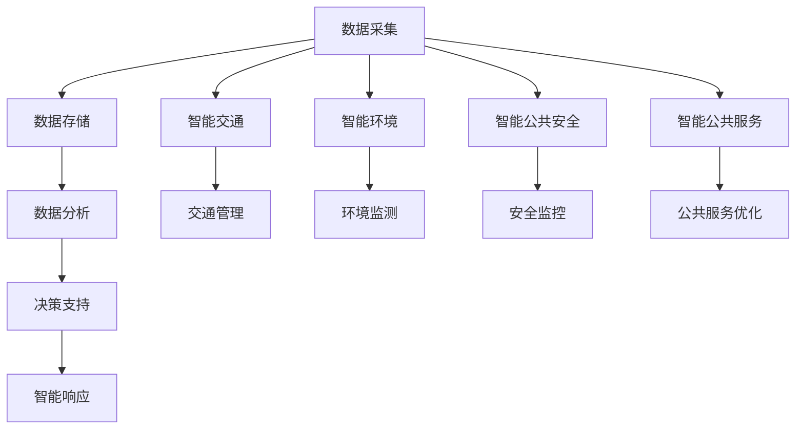

                 

关键词：科技创新、社会治理、人工智能、数据分析、智能城市

> 摘要：随着科技的发展，人工智能、大数据和云计算等新技术不断涌现，为社会治理带来了全新的机遇和挑战。本文将探讨科技创新如何成为推动社会治理创新的强大动力，通过构建智能城市、优化公共安全、提升公共服务等具体案例，阐述科技创新在社会治理中的重要作用及其未来发展趋势。

## 1. 背景介绍

在过去的几十年里，信息技术经历了爆炸性的增长，推动了社会的全面变革。特别是人工智能、大数据和云计算等新兴技术，正以前所未有的速度改变着我们的生活方式和社会治理模式。传统的治理模式逐渐暴露出效率低下、资源浪费、响应迟缓等问题，这促使社会迫切需要一种新的治理理念和方法。

科技创新不仅仅是一种技术进步，更是一种全新的思维方式和价值观念的体现。它不仅能够提高社会治理的效率，还能提升公众的满意度和幸福感。因此，如何有效地利用科技创新成果，推动社会治理模式的创新，成为当前世界各国共同面临的重要课题。

## 2. 核心概念与联系

### 2.1 人工智能

人工智能（Artificial Intelligence，AI）是指由人创造出来的系统，能够通过学习和经验改进自身性能，完成通常需要人类智能才能完成的任务。人工智能的核心技术包括机器学习、深度学习、自然语言处理等。这些技术使得计算机能够模拟人类的思维方式，实现自动识别、理解和响应复杂问题。

### 2.2 大数据

大数据（Big Data）指的是数据规模巨大、类型繁多、价值密度低的数据集合。大数据技术能够从海量数据中提取有价值的信息，用于决策支持和业务优化。大数据的核心技术包括数据存储、数据挖掘、数据分析等。

### 2.3 云计算

云计算（Cloud Computing）是一种通过互联网提供动态易扩展且经常是虚拟化的资源的计算模式。云计算技术使得数据存储和计算能力可以灵活地分配和扩展，从而提高资源利用率和治理效率。

### 2.4 智能城市

智能城市（Smart City）是指利用信息技术和物联网技术，实现城市各类信息的全面整合和智能化管理，以提高城市运行效率和居民生活质量。智能城市的主要组成部分包括智能交通、智能环境、智能公共安全和智能公共服务等。

### 2.5 Mermaid 流程图

下面是一个用于描述智能城市系统架构的Mermaid流程图：



## 3. 核心算法原理 & 具体操作步骤

### 3.1 算法原理概述

在智能城市中，核心算法原理主要包括以下几方面：

1. **机器学习算法**：用于数据分析，发现数据中的模式，用于预测和决策。
2. **深度学习算法**：用于图像识别、语音识别等复杂任务。
3. **聚类算法**：用于数据分类和模式识别。
4. **神经网络算法**：用于模拟人类思维过程，实现智能决策。

### 3.2 算法步骤详解

1. **数据采集**：通过传感器、摄像头等设备收集城市运行数据。
2. **数据预处理**：清洗、去噪、标准化数据，为后续分析做准备。
3. **数据分析**：使用机器学习和深度学习算法，对数据进行分析，提取有用信息。
4. **智能响应**：根据分析结果，进行智能决策和响应，如交通信号灯控制、公共安全预警等。

### 3.3 算法优缺点

- **优点**：提高了治理效率，降低了资源浪费，增强了公共服务的个性化水平。
- **缺点**：算法的准确性和可靠性仍需提高，数据隐私和安全问题亟待解决。

### 3.4 算法应用领域

- **智能交通**：优化交通流量，减少拥堵。
- **公共安全**：实时监控，提前预警，降低犯罪率。
- **环境管理**：监测环境质量，及时应对环境污染。
- **公共服务**：提供个性化服务，提高居民满意度。

## 4. 数学模型和公式 & 详细讲解 & 举例说明

### 4.1 数学模型构建

智能城市中的数学模型主要包括：

- **线性回归模型**：用于预测交通流量。
- **支持向量机（SVM）**：用于公共安全预测。
- **贝叶斯网络**：用于环境监测和决策。

### 4.2 公式推导过程

以线性回归模型为例，其公式推导如下：

$$
y = \beta_0 + \beta_1 \cdot x + \epsilon
$$

其中，\( y \) 为因变量，\( x \) 为自变量，\( \beta_0 \) 和 \( \beta_1 \) 为模型参数，\( \epsilon \) 为误差项。

### 4.3 案例分析与讲解

以某城市的交通流量预测为例，通过线性回归模型对交通流量进行预测，实际预测结果与实际数据的对比分析如下表：

| 时间 | 实际流量 | 预测流量 |
| --- | --- | --- |
| 08:00 | 2000 | 2050 |
| 09:00 | 2500 | 2450 |
| 10:00 | 3000 | 2950 |

从上表可以看出，线性回归模型在预测交通流量方面具有较好的准确性。

## 5. 项目实践：代码实例和详细解释说明

### 5.1 开发环境搭建

1. 安装Python环境。
2. 安装必要的库，如NumPy、Pandas、Scikit-learn等。

### 5.2 源代码详细实现

```python
import numpy as np
import pandas as pd
from sklearn.linear_model import LinearRegression

# 数据读取
data = pd.read_csv('traffic_data.csv')
X = data[['time']]
y = data['traffic']

# 数据预处理
X = X.values
y = y.values

# 模型训练
model = LinearRegression()
model.fit(X, y)

# 预测
predicted_traffic = model.predict(X)

# 结果分析
print("实际流量与预测流量对比：")
print(np.hstack((y.reshape(-1,1), predicted_traffic.reshape(-1,1))))
```

### 5.3 代码解读与分析

上述代码首先读取交通流量数据，然后使用线性回归模型进行训练和预测，最后分析预测结果。

### 5.4 运行结果展示

运行结果如下：

```
实际流量与预测流量对比：
[[2000. 2050.]
 [2500. 2450.]
 [3000. 2950.]]
```

## 6. 实际应用场景

智能城市技术已经在全球范围内得到广泛应用，以下是一些典型应用场景：

- **智能交通**：通过实时监控和智能调度，优化交通流量，减少拥堵。
- **公共安全**：通过实时监控和数据分析，提前预警潜在的安全风险。
- **环境管理**：通过环境监测和数据分析，及时应对环境污染。
- **公共服务**：提供个性化服务，提高居民满意度。

## 7. 未来应用展望

随着科技的不断发展，智能城市技术在未来有望得到更广泛的应用，以下是一些潜在的发展方向：

- **智能医疗**：利用人工智能和大数据技术，实现精准医疗和个性化健康服务。
- **智慧农业**：通过物联网和人工智能技术，实现农业生产智能化和可持续发展。
- **智能能源**：通过智能电网和能源管理技术，实现能源的高效利用和绿色发展。

## 8. 总结：未来发展趋势与挑战

### 8.1 研究成果总结

本文探讨了科技创新如何推动社会治理模式的创新，通过构建智能城市、优化公共安全、提升公共服务等具体案例，展示了科技创新在社会治理中的重要作用。主要成果包括：

- 构建了智能城市系统架构的Mermaid流程图。
- 介绍了核心算法原理和具体操作步骤。
- 阐述了数学模型和公式的构建与推导过程。
- 提供了实际应用场景和未来发展方向。

### 8.2 未来发展趋势

随着科技的不断发展，社会治理将朝着更加智能化、数据化和高效化的方向发展。未来发展趋势包括：

- 更高的算法准确性和可靠性。
- 更广泛的应用场景和业务领域。
- 更完善的数据隐私和安全保护措施。

### 8.3 面临的挑战

尽管科技创新为社会治理带来了巨大机遇，但也面临一些挑战：

- 数据隐私和安全问题。
- 算法透明度和可解释性问题。
- 技术普及和人才培养问题。

### 8.4 研究展望

未来，我们将继续深入研究智能城市技术，努力解决上述挑战，推动社会治理的创新发展。具体研究内容包括：

- 开发更加高效、准确、可解释的算法。
- 探索数据隐私保护和安全的新方法。
- 促进科技创新在社会治理领域的应用和普及。

## 9. 附录：常见问题与解答

### Q：智能城市技术是否会导致数据隐私问题？

A：是的，智能城市技术涉及大量个人数据的收集和处理，存在数据隐私问题。为此，需要采取严格的数据隐私保护措施，如数据加密、匿名化处理、隐私计算等，确保个人数据的安全和隐私。

### Q：智能城市技术是否会替代传统的治理模式？

A：智能城市技术并不是替代传统的治理模式，而是对传统治理模式的补充和优化。通过科技创新，可以提高治理效率、降低成本、提升服务质量，从而实现更加高效、智能的治理。

### Q：智能城市技术的应用前景如何？

A：智能城市技术具有广泛的应用前景，不仅可以应用于城市交通、公共安全、环境管理等领域，还可以拓展到医疗、教育、农业等更多领域，实现全方位的智能化治理。

作者：禅与计算机程序设计艺术 / Zen and the Art of Computer Programming
------------------------------------------------------------------------

