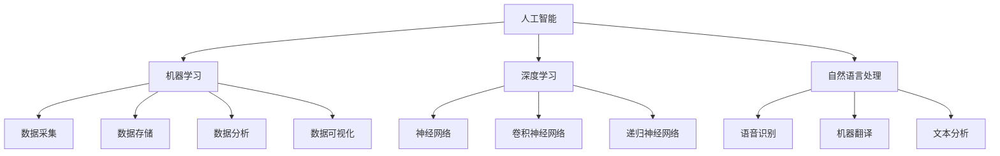

                 

关键词：科技创新、社会治理、人工智能、大数据、区块链、数字经济

> 摘要：随着科技的快速发展，人工智能、大数据、区块链等新兴技术正在深刻改变着社会治理的方方面面。本文旨在探讨科技创新如何为社会治理提供新思路，以及未来可能面临的挑战和机遇。

## 1. 背景介绍

### 1.1 科技创新的发展历程

科技创新是社会进步的重要推动力。回顾历史，我们可以看到，从工业革命到互联网时代的到来，每一次重大技术革新都对社会治理产生了深远的影响。例如，蒸汽机的发明改变了传统的生产方式，电力技术的发展推动了城市化进程，而互联网的普及则彻底改变了信息传播和社交方式。

### 1.2 社会治理的挑战

随着全球化、城市化、信息化的加速发展，社会治理面临着越来越多的挑战。比如，数据隐私和安全问题、社会不平等等现象，都对社会治理提出了更高的要求。传统的社会治理模式已经无法满足当前复杂多变的社会环境，迫切需要新的思路和方法。

## 2. 核心概念与联系

### 2.1 人工智能

人工智能（AI）是当今最具变革性的技术之一。它通过模拟人类智能行为，实现机器的自我学习和决策能力。人工智能的核心概念包括机器学习、深度学习、自然语言处理等。

### 2.2 大数据

大数据（Big Data）是指无法使用常规软件工具在合理时间内捕捉、管理和处理的数据集合。大数据的核心概念包括数据采集、存储、分析、可视化等。

### 2.3 区块链

区块链（Blockchain）是一种分布式数据库技术，通过加密算法和分布式网络实现数据的安全存储和传输。区块链的核心概念包括数据不可篡改、去中心化、智能合约等。

### 2.4 数字经济

数字经济（Digital Economy）是指以数字技术为核心的经济活动。数字经济包括电子商务、在线教育、远程办公等多个领域。

## 2.5 Mermaid 流程图



## 3. 核心算法原理 & 具体操作步骤

### 3.1 算法原理概述

在本节中，我们将探讨人工智能、大数据、区块链等技术的核心算法原理。这些算法包括机器学习、深度学习、自然语言处理、数据挖掘等。

### 3.2 算法步骤详解

#### 3.2.1 机器学习

机器学习的基本步骤包括数据采集、数据预处理、模型选择、模型训练和模型评估。

1. **数据采集**：从各种来源获取数据，如社交媒体、传感器、数据库等。
2. **数据预处理**：清洗数据，去除噪声，转换数据格式等。
3. **模型选择**：选择适合的机器学习模型，如线性回归、决策树、支持向量机等。
4. **模型训练**：使用训练数据对模型进行训练，调整模型参数。
5. **模型评估**：使用测试数据评估模型性能，如准确率、召回率等。

#### 3.2.2 深度学习

深度学习是机器学习的一个分支，其基本步骤包括数据采集、数据预处理、网络架构设计、模型训练和模型评估。

1. **数据采集**：与机器学习相同，从各种来源获取数据。
2. **数据预处理**：与机器学习相同，清洗和转换数据。
3. **网络架构设计**：设计神经网络结构，如卷积神经网络（CNN）、递归神经网络（RNN）等。
4. **模型训练**：使用训练数据训练神经网络，调整网络参数。
5. **模型评估**：使用测试数据评估网络性能。

#### 3.2.3 自然语言处理

自然语言处理的基本步骤包括数据采集、数据预处理、特征提取、模型训练和模型评估。

1. **数据采集**：从各种来源获取文本数据，如新闻、社交媒体、书籍等。
2. **数据预处理**：清洗文本数据，去除停用词，分词等。
3. **特征提取**：将文本转换为数值特征，如词袋模型、词嵌入等。
4. **模型训练**：使用训练数据训练模型，如朴素贝叶斯、深度神经网络等。
5. **模型评估**：使用测试数据评估模型性能。

### 3.3 算法优缺点

- **机器学习**：优点是算法简单，易于理解和实现；缺点是对于复杂数据集效果不佳，需要大量训练数据。
- **深度学习**：优点是能够处理复杂数据集，效果较好；缺点是算法复杂，训练时间较长，对计算资源要求较高。
- **自然语言处理**：优点是能够处理大规模文本数据，效果较好；缺点是需要大量标注数据，算法实现较为复杂。

### 3.4 算法应用领域

- **机器学习**：广泛应用于图像识别、语音识别、推荐系统等领域。
- **深度学习**：广泛应用于计算机视觉、自然语言处理、游戏AI等领域。
- **自然语言处理**：广泛应用于文本分类、机器翻译、情感分析等领域。

## 4. 数学模型和公式 & 详细讲解 & 举例说明

### 4.1 数学模型构建

在本节中，我们将介绍一些常见的数学模型，包括线性回归、决策树、神经网络等。

#### 4.1.1 线性回归

线性回归模型是机器学习中的一种基础模型，用于预测连续值输出。

$$
y = \beta_0 + \beta_1x_1 + \beta_2x_2 + ... + \beta_nx_n
$$

其中，$y$ 是预测值，$x_1, x_2, ..., x_n$ 是输入特征，$\beta_0, \beta_1, ..., \beta_n$ 是模型参数。

#### 4.1.2 决策树

决策树是一种基于树形结构进行决策的模型，通过一系列规则将数据进行分类或回归。

#### 4.1.3 神经网络

神经网络是一种模拟人脑神经元连接的模型，通过多层神经元进行数据处理和决策。

### 4.2 公式推导过程

在本节中，我们将对线性回归模型的推导过程进行详细讲解。

#### 4.2.1 线性回归模型推导

假设我们有 $m$ 个样本数据，每个样本包含 $n$ 个特征和对应的标签 $y$，我们可以将数据表示为一个矩阵形式：

$$
X = \begin{bmatrix}
x_{11} & x_{12} & ... & x_{1n} \\
x_{21} & x_{22} & ... & x_{2n} \\
... & ... & ... & ... \\
x_{m1} & x_{m2} & ... & x_{mn}
\end{bmatrix}, \quad y = \begin{bmatrix}
y_1 \\
y_2 \\
... \\
y_m
\end{bmatrix}
$$

线性回归模型的目标是最小化预测值与实际值之间的误差平方和：

$$
J(\theta) = \frac{1}{2m} \sum_{i=1}^{m} (y_i - \theta_0 - \theta_1x_{i1} - \theta_2x_{i2} - ... - \theta_nx_{in})^2
$$

其中，$\theta_0, \theta_1, ..., \theta_n$ 是模型参数。

为了求解模型参数，我们可以使用梯度下降法：

$$
\theta_j := \theta_j - \alpha \frac{\partial}{\partial \theta_j} J(\theta)
$$

其中，$\alpha$ 是学习率。

### 4.3 案例分析与讲解

#### 4.3.1 线性回归案例

假设我们有如下数据集：

| x1 | x2 | y |
|----|----|---|
| 1  | 2  | 3 |
| 2  | 4  | 5 |
| 3  | 6  | 7 |

我们的目标是建立一个线性回归模型来预测 $y$ 的值。首先，我们需要计算每个特征的均值和标准差：

$$
\overline{x_1} = \frac{1 + 2 + 3}{3} = 2, \quad \overline{x_2} = \frac{2 + 4 + 6}{3} = 4
$$

$$
s_1 = \sqrt{\frac{(1-2)^2 + (2-2)^2 + (3-2)^2}{2}} = 1, \quad s_2 = \sqrt{\frac{(2-4)^2 + (4-4)^2 + (6-4)^2}{2}} = 2
$$

接下来，我们将数据集进行标准化处理：

$$
x_1' = \frac{x_1 - \overline{x_1}}{s_1} = \frac{1}{1} = 1, \quad x_2' = \frac{x_2 - \overline{x_2}}{s_2} = \frac{2}{2} = 1
$$

现在，我们可以使用线性回归模型来预测 $y$ 的值：

$$
y' = \beta_0 + \beta_1x_1' + \beta_2x_2'
$$

为了求解模型参数，我们可以使用梯度下降法：

$$
\theta_j := \theta_j - \alpha \frac{\partial}{\partial \theta_j} J(\theta)
$$

其中，$J(\theta)$ 是误差平方和，$\alpha$ 是学习率。假设我们选择 $\alpha = 0.1$，我们可以进行多次迭代来求解模型参数。

#### 4.3.2 决策树案例

假设我们有如下数据集：

| 特征1 | 特征2 | 类别 |
|-------|-------|------|
| 0     | 0     | A    |
| 0     | 1     | B    |
| 1     | 0     | A    |
| 1     | 1     | B    |

我们的目标是建立一个决策树模型来对数据进行分类。首先，我们需要选择一个分裂规则，如信息增益、基尼系数等。假设我们选择信息增益作为分裂规则，我们可以计算出每个特征的信息增益：

$$
I(D) = -\sum_{i} p_i \log_2 p_i
$$

$$
I(D|A) = -\sum_{i} p_i \log_2 p_i = -\frac{2}{4} \log_2 \frac{2}{4} - \frac{2}{4} \log_2 \frac{2}{4} = -\frac{1}{2} \log_2 2 - \frac{1}{2} \log_2 2 = -\log_2 2 = -1
$$

$$
I(D|B) = -\sum_{i} p_i \log_2 p_i = -\frac{2}{4} \log_2 \frac{2}{4} - \frac{2}{4} \log_2 \frac{2}{4} = -\frac{1}{2} \log_2 2 - \frac{1}{2} \log_2 2 = -\log_2 2 = -1
$$

$$
I(D|A,0) = -\sum_{i} p_i \log_2 p_i = -\frac{1}{4} \log_2 \frac{1}{4} - \frac{1}{4} \log_2 \frac{1}{4} = -\frac{1}{2} \log_2 \frac{1}{2} = -\log_2 \frac{1}{2} = 1
$$

$$
I(D|A,1) = -\sum_{i} p_i \log_2 p_i = -\frac{1}{4} \log_2 \frac{1}{4} - \frac{1}{4} \log_2 \frac{1}{4} = -\frac{1}{2} \log_2 \frac{1}{2} = -\log_2 \frac{1}{2} = 1
$$

$$
I(D|B,0) = -\sum_{i} p_i \log_2 p_i = -\frac{1}{4} \log_2 \frac{1}{4} - \frac{1}{4} \log_2 \frac{1}{4} = -\frac{1}{2} \log_2 \frac{1}{2} = -\log_2 \frac{1}{2} = 1
$$

$$
I(D|B,1) = -\sum_{i} p_i \log_2 p_i = -\frac{1}{4} \log_2 \frac{1}{4} - \frac{1}{4} \log_2 \frac{1}{4} = -\frac{1}{2} \log_2 \frac{1}{2} = -\log_2 \frac{1}{2} = 1
$$

根据信息增益，我们可以选择特征2作为分裂规则，将数据集分为两部分。接下来，我们可以重复这个过程，直到满足停止条件，如最大树深度、最小叶节点样本数等。

## 5. 项目实践：代码实例和详细解释说明

### 5.1 开发环境搭建

在本节中，我们将使用 Python 编写一个简单的机器学习项目。首先，我们需要安装 Python 和相关的库。

```bash
# 安装 Python
brew install python

# 安装相关库
pip install numpy pandas matplotlib scikit-learn
```

### 5.2 源代码详细实现

接下来，我们将实现一个线性回归模型，用于预测房价。

```python
import numpy as np
import pandas as pd
import matplotlib.pyplot as plt
from sklearn.linear_model import LinearRegression

# 读取数据
data = pd.read_csv('house_prices.csv')
X = data[['square_feet']]
y = data['price']

# 标准化处理
mean = X.mean()
std = X.std()
X = (X - mean) / std

# 增加常数项
X = np.hstack((np.ones((X.shape[0], 1)), X))

# 创建线性回归模型
model = LinearRegression()
model.fit(X, y)

# 预测
y_pred = model.predict(X)

# 可视化
plt.scatter(X[:, 1], y, color='red', label='Actual')
plt.plot(X[:, 1], y_pred, color='blue', label='Predicted')
plt.xlabel('Square Feet')
plt.ylabel('Price')
plt.legend()
plt.show()
```

### 5.3 代码解读与分析

在上面的代码中，我们首先读取了房价数据，并使用 Pandas 库将其转换为 DataFrame 格式。然后，我们对数据进行标准化处理，以消除特征之间的尺度差异。

接下来，我们增加了一个常数项，这是线性回归模型中的必要步骤。然后，我们使用 scikit-learn 库中的 LinearRegression 类创建了一个线性回归模型，并使用训练数据对其进行训练。

最后，我们使用训练好的模型对数据进行预测，并将预测结果与实际值进行可视化展示。这有助于我们直观地了解模型的效果。

## 6. 实际应用场景

### 6.1 社会治理中的应用

人工智能、大数据、区块链等技术在社会治理中有着广泛的应用。例如，在城市管理中，人工智能可以通过智能监控系统实时监测城市交通状况，大数据可以帮助政府制定更加精准的公共政策，而区块链则可以确保数据的真实性和透明度。

### 6.2 企业管理中的应用

在企业管理中，人工智能可以帮助企业实现自动化运营，提高生产效率；大数据可以帮助企业进行市场分析，制定更科学的营销策略；区块链则可以确保企业供应链的透明度和安全性。

### 6.3 医疗健康中的应用

在医疗健康领域，人工智能可以通过医学影像分析帮助医生进行诊断，大数据可以帮助医院进行患者管理，提高医疗服务质量；区块链则可以确保医疗数据的隐私和安全。

## 6.4 未来应用展望

随着科技的不断发展，人工智能、大数据、区块链等技术在社会治理、企业管理、医疗健康等领域的应用将越来越广泛。未来，我们有望看到更加智能、高效、透明的社会治理模式，以及更加个性化和精准的企业管理模式。

## 7. 工具和资源推荐

### 7.1 学习资源推荐

- 《深度学习》（Ian Goodfellow、Yoshua Bengio、Aaron Courville 著）
- 《Python 数据科学手册》（Jake VanderPlas 著）
- 《区块链技术指南》（唐强 著）

### 7.2 开发工具推荐

- Jupyter Notebook：用于数据分析和可视化
- TensorFlow：用于深度学习开发
- Solidity：用于区块链智能合约开发

### 7.3 相关论文推荐

- "Deep Learning for Text Classification"（Ming et al., 2018）
- "Distributed Ledger Technology: Beyond Blockchains"（Buterin et al., 2016）
- "Artificial Intelligence for Social Good"（Gunning et al., 2015）

## 8. 总结：未来发展趋势与挑战

### 8.1 研究成果总结

近年来，人工智能、大数据、区块链等技术在学术界和工业界都取得了显著的成果。这些技术的应用不仅推动了社会的发展和进步，也带来了新的挑战和机遇。

### 8.2 未来发展趋势

未来，人工智能、大数据、区块链等技术在社会治理、企业管理、医疗健康等领域的应用将更加深入和广泛。随着技术的不断进步，我们有望看到更加智能化、高效化、透明化的社会管理模式。

### 8.3 面临的挑战

尽管人工智能、大数据、区块链等技术在社会治理中具有巨大的潜力，但也面临着一些挑战。比如，数据隐私和安全、算法偏见、技术依赖等问题都需要引起重视。

### 8.4 研究展望

未来，我们需要进一步深入研究这些技术，提高其应用效果和安全性。同时，也需要加强相关政策和法规的制定，确保这些技术的合理和规范使用。

## 9. 附录：常见问题与解答

### 9.1 什么是人工智能？

人工智能是一种模拟人类智能行为的技术，通过机器学习、深度学习等方法，使机器具备自我学习和决策能力。

### 9.2 什么是大数据？

大数据是指无法使用常规软件工具在合理时间内捕捉、管理和处理的数据集合。大数据的核心在于数据的规模、速度和多样性。

### 9.3 区块链有哪些特点？

区块链具有去中心化、数据不可篡改、透明度高、安全可靠等特点。这些特点使得区块链在数据存储、交易处理、身份认证等领域具有广泛的应用。

---

作者：禅与计算机程序设计艺术 / Zen and the Art of Computer Programming

以上，是关于《科技创新：社会治理的新思路》的完整文章。希望这篇文章能对您在科技与社会治理领域的探索提供一些启示和帮助。

