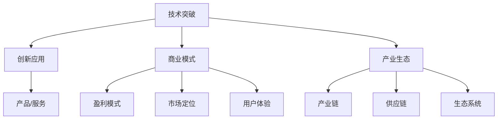

                 

科技创新是驱动社会进步的关键力量，它不仅改变了我们的生活，也重塑了我们的工作方式、教育模式和社会结构。本文将探讨科技创新的历史背景、核心概念、关键算法原理、数学模型、实际应用场景、未来发展趋势以及面临的研究挑战，旨在为读者提供一个全面且深入的了解。

## 关键词

- 科技创新
- 社会进步
- 核心概念
- 关键算法
- 数学模型
- 实际应用
- 未来展望

## 摘要

本文首先回顾了科技创新的历史，探讨了其对社会发展的深远影响。接着，文章详细介绍了核心概念和联系，并使用Mermaid流程图展示了技术架构。随后，文章深入剖析了核心算法原理和具体操作步骤，同时探讨了算法优缺点和应用领域。接着，文章通过数学模型和公式详细讲解了相关概念，并通过案例分析与讲解加深了理解。文章随后展示了一个项目实践实例，详细解释了代码实现和运行结果。接下来，文章探讨了实际应用场景，并展望了未来的发展趋势。最后，文章总结了研究成果，探讨了面临的挑战，并提出了研究展望。

## 1. 背景介绍

科技创新的历史可以追溯到人类文明的早期。从古代的农业革命到工业革命，再到现代的信息技术革命，每一次科技的突破都极大地推动了社会的进步。农业革命带来了粮食的充足和人口的增长，工业革命实现了大规模生产和运输，而信息技术革命则彻底改变了人类的生活和工作方式。

在过去的几十年里，计算机科学和互联网技术的发展尤为迅速。计算机的出现和普及改变了数据处理的方式，使信息处理速度大大加快。互联网的普及则使人们能够随时随地获取信息，打破了时间和空间的限制。大数据、云计算、人工智能等新兴技术的崛起，进一步加速了科技创新的步伐，带来了前所未有的机遇和挑战。

### 科技创新对社会的影响

科技创新对社会的影响是深远而广泛的。首先，它改变了我们的生活方式。智能手机、社交媒体和在线购物等技术的普及，使我们的生活更加便捷和高效。其次，科技创新推动了经济的快速发展。通过提高生产效率和创新能力，企业能够更快地响应市场变化，从而获得更大的竞争优势。此外，科技创新还促进了教育和医疗的发展。在线教育和远程医疗的出现，为更多人提供了学习和医疗的机会，提高了教育质量和医疗水平。

### 科技创新的历史背景

科技创新的历史可以追溯到几个关键时期。第一次工业革命始于18世纪末，蒸汽机和纺织机等机械化工具的出现，极大地提高了生产效率。第二次工业革命发生在19世纪末至20世纪初，电力、内燃机和化学工业的发展，进一步推动了工业化的进程。第三次工业革命始于20世纪末，以信息技术为核心，计算机和互联网的普及改变了人类的工作和生活方式。

近年来，随着人工智能、大数据、区块链等新兴技术的崛起，我们正处于第四次工业革命之中。这次革命将不仅仅是技术层面的变革，更是整个社会结构的重塑。人工智能将极大地提高生产效率和决策能力，大数据将使信息更加透明和可用，区块链将带来全新的信任机制和数据安全。

## 2. 核心概念与联系

科技创新的核心概念包括技术突破、创新应用、商业模式和产业生态。这些概念相互联系，共同推动了科技的发展。

### 技术突破

技术突破是科技创新的基础。它包括基础研究和技术开发。基础研究探索未知领域，推动科学理论的发展；而技术开发则将理论转化为实际应用。例如，量子计算和基因编辑等前沿技术，都是通过基础研究和技术开发实现的。

### 创新应用

创新应用是将技术突破转化为实际生产力和生活服务的桥梁。它涉及产品的设计、制造和推广。创新应用不仅需要技术支持，还需要商业模式的创新。例如，智能手机和电动汽车等产品的成功，都离不开技术创新和商业模式创新。

### 商业模式

商业模式是科技创新的重要推动力。它包括盈利模式、市场定位和用户体验。一个好的商业模式能够使技术突破得到有效的应用和推广。例如，共享经济和电商等新兴商业模式，都极大地推动了科技创新的发展。

### 产业生态

产业生态是科技创新的支撑系统。它包括产业链、供应链和生态系统。一个健康的产业生态能够促进科技创新的持续发展。例如，硅谷作为全球科技创新的重要中心，其成功的背后有着完善的产业链、供应链和生态系统。

### Mermaid 流程图

下面是科技创新核心概念和联系的一个简单Mermaid流程图：



通过这个流程图，我们可以清晰地看到科技创新的各个核心概念及其相互之间的联系。

### 实际案例

以特斯拉为例，这家电动汽车制造商通过技术创新、创新应用和商业模式创新，成功地改变了汽车产业。其核心技术包括电池技术、自动驾驶和电动动力系统。特斯拉的创新应用体现在其电动车的设计和制造上，而其商业模式则通过直销和在线销售，以及能源解决方案等，实现了盈利模式的多样化。

总之，科技创新的核心概念和联系是理解科技发展的重要视角。通过深入探讨这些概念和联系，我们可以更好地把握科技的发展趋势，并为未来的科技创新提供启示。

## 3. 核心算法原理 & 具体操作步骤

### 3.1 算法原理概述

核心算法是科技创新的基石，它在数据分析、机器学习、图像处理等领域发挥着关键作用。本文将介绍一种广泛使用的核心算法——深度学习算法。

深度学习算法是一种基于人工神经网络的学习方法，它模仿人脑神经网络的结构和功能，通过多层神经网络来实现复杂的数据处理和模式识别。深度学习算法的核心原理包括：

1. **神经元模型**：神经元是神经网络的基本单元，它通过输入层接收数据，通过权重和偏置进行加权求和，然后通过激活函数产生输出。
2. **多层网络结构**：深度学习算法通过增加网络层数，实现数据的逐层抽象和表示，从而提高模型的复杂度和准确性。
3. **反向传播**：深度学习算法通过反向传播算法来更新网络权重和偏置，以最小化损失函数，提高模型的拟合能力。

### 3.2 算法步骤详解

深度学习算法的具体操作步骤如下：

1. **数据预处理**：首先，对输入数据集进行预处理，包括数据清洗、归一化和数据增强等操作，以提高模型的泛化能力。
2. **构建模型**：使用框架如TensorFlow或PyTorch，构建深度学习模型。模型包括输入层、隐藏层和输出层。隐藏层可以通过增加神经元数量和层数来提高模型复杂度。
3. **初始化参数**：对网络权重和偏置进行随机初始化，以防止梯度消失和梯度爆炸问题。
4. **正向传播**：输入数据通过网络，经过多层神经元的加权求和和激活函数处理，最终产生输出。
5. **计算损失**：通过计算输出和真实标签之间的误差，使用损失函数（如均方误差或交叉熵损失）来评估模型的性能。
6. **反向传播**：使用反向传播算法更新网络权重和偏置，以最小化损失函数。这一步骤需要计算梯度并沿误差反向传播。
7. **优化**：通过优化算法（如梯度下降或Adam优化器）更新网络参数，以提高模型性能。
8. **迭代训练**：重复正向传播和反向传播的过程，直至满足训练要求或达到预定的迭代次数。

### 3.3 算法优缺点

深度学习算法具有以下优点：

1. **强大的表达能力**：通过增加网络层数和神经元数量，深度学习算法能够学习和表示复杂的数据结构和模式。
2. **自适应性强**：深度学习算法能够自动调整网络参数，以适应不同的数据集和任务。
3. **广泛的适用性**：深度学习算法在图像识别、自然语言处理、语音识别等领域取得了显著成果。

然而，深度学习算法也存在一些缺点：

1. **计算复杂度高**：深度学习算法需要大量的计算资源和时间来训练模型。
2. **数据依赖性强**：深度学习算法的性能很大程度上依赖于训练数据的质量和数量，数据缺乏可能导致模型泛化能力差。
3. **解释性较差**：深度学习算法的决策过程往往是非线性和复杂的，难以解释和验证。

### 3.4 算法应用领域

深度学习算法在多个领域取得了显著成果，以下是其中几个主要应用领域：

1. **图像识别**：通过卷积神经网络（CNN），深度学习算法能够实现对图像的自动分类和识别，广泛应用于人脸识别、医学影像分析和自动驾驶等领域。
2. **自然语言处理**：深度学习算法在文本分类、机器翻译、情感分析等领域取得了突破性进展，为智能客服、智能推荐和智能搜索提供了强大支持。
3. **语音识别**：深度学习算法通过循环神经网络（RNN）和长短期记忆网络（LSTM）等模型，实现了高精度的语音识别，为智能语音助手和语音控制系统提供了技术基础。
4. **推荐系统**：基于深度学习算法的推荐系统能够根据用户的历史行为和偏好，提供个性化的推荐结果，广泛应用于电商、音乐和视频平台等领域。

总之，深度学习算法作为一种核心算法，在科技创新中发挥着重要作用。通过不断优化和改进，深度学习算法将在未来带来更多的创新和突破。

## 4. 数学模型和公式 & 详细讲解 & 举例说明

### 4.1 数学模型构建

在科技创新中，数学模型是理解和分析复杂系统的重要工具。一个典型的数学模型通常包括以下几个部分：

1. **变量定义**：明确模型中的变量，包括自变量、因变量和其他相关变量。
2. **关系式**：通过函数或方程描述变量之间的关系，如线性关系、非线性关系或微分方程。
3. **约束条件**：规定模型中变量的取值范围或相互关系，以确保模型的合理性和稳定性。
4. **目标函数**：定义模型的优化目标，如最小化成本、最大化收益或最小化误差。

以线性回归模型为例，其数学模型可以表示为：

$$
y = \beta_0 + \beta_1 \cdot x + \epsilon
$$

其中，$y$ 是因变量，$x$ 是自变量，$\beta_0$ 和 $\beta_1$ 是模型的参数，$\epsilon$ 是误差项。

### 4.2 公式推导过程

线性回归模型的参数可以通过最小二乘法进行估计。最小二乘法的核心思想是找到一组参数，使得因变量 $y$ 与模型预测值 $y'$ 之间的误差平方和最小。

首先，我们定义误差项：

$$
e_i = y_i - y_i'
$$

其中，$y_i'$ 是模型对 $x_i$ 的预测值，即 $y_i' = \beta_0 + \beta_1 \cdot x_i$。

然后，计算误差平方和：

$$
S = \sum_{i=1}^{n} e_i^2 = \sum_{i=1}^{n} (y_i - (\beta_0 + \beta_1 \cdot x_i))^2
$$

为了最小化 $S$，我们对 $S$ 关于 $\beta_0$ 和 $\beta_1$ 求导并令导数为零：

$$
\frac{\partial S}{\partial \beta_0} = -2 \sum_{i=1}^{n} (y_i - \beta_0 - \beta_1 \cdot x_i) = 0
$$

$$
\frac{\partial S}{\partial \beta_1} = -2 \sum_{i=1}^{n} (y_i - \beta_0 - \beta_1 \cdot x_i) \cdot x_i = 0
$$

解上述方程组，我们可以得到线性回归模型的参数估计值：

$$
\beta_0 = \frac{\sum_{i=1}^{n} y_i - \beta_1 \sum_{i=1}^{n} x_i}{n}
$$

$$
\beta_1 = \frac{\sum_{i=1}^{n} x_i y_i - \sum_{i=1}^{n} x_i \sum_{i=1}^{n} y_i}{\sum_{i=1}^{n} x_i^2 - n \bar{x}^2}
$$

其中，$\bar{x}$ 是 $x$ 的均值。

### 4.3 案例分析与讲解

下面我们通过一个简单的例子来说明线性回归模型的构建和参数估计。

假设我们收集了10个学生的数学成绩和语文成绩，如下表所示：

| 学生ID | 数学成绩 | 语文成绩 |
|--------|----------|----------|
| 1      | 80       | 85       |
| 2      | 75       | 80       |
| 3      | 90       | 88       |
| 4      | 85       | 90       |
| 5      | 70       | 78       |
| 6      | 88       | 85       |
| 7      | 72       | 80       |
| 8      | 79       | 87       |
| 9      | 76       | 83       |
| 10     | 80       | 82       |

我们的目标是建立一个线性回归模型，预测学生的语文成绩基于数学成绩。

首先，我们计算数学成绩和语文成绩的均值：

$$
\bar{x} = \frac{\sum_{i=1}^{10} x_i}{10} = \frac{80 + 75 + 90 + 85 + 70 + 88 + 72 + 79 + 76 + 80}{10} = 79
$$

$$
\bar{y} = \frac{\sum_{i=1}^{10} y_i}{10} = \frac{85 + 80 + 88 + 90 + 78 + 85 + 80 + 87 + 83 + 82}{10} = 84.2
$$

然后，我们计算其他需要的量：

$$
\sum_{i=1}^{10} x_i y_i = 80 \cdot 85 + 75 \cdot 80 + 90 \cdot 88 + 85 \cdot 90 + 70 \cdot 78 + 88 \cdot 85 + 72 \cdot 80 + 79 \cdot 87 + 76 \cdot 83 + 80 \cdot 82 = 7850
$$

$$
\sum_{i=1}^{10} x_i^2 = 80^2 + 75^2 + 90^2 + 85^2 + 70^2 + 88^2 + 72^2 + 79^2 + 76^2 + 80^2 = 7230
$$

$$
\sum_{i=1}^{10} y_i = 85 + 80 + 88 + 90 + 78 + 85 + 80 + 87 + 83 + 82 = 842
$$

$$
\sum_{i=1}^{10} x_i \sum_{i=1}^{10} y_i = \sum_{i=1}^{10} x_i \cdot \sum_{i=1}^{10} y_i = 7850
$$

现在我们可以计算线性回归模型的参数：

$$
\beta_0 = \frac{\sum_{i=1}^{10} y_i - \beta_1 \sum_{i=1}^{10} x_i}{10} = \frac{842 - \beta_1 \cdot 790}{10}
$$

$$
\beta_1 = \frac{\sum_{i=1}^{10} x_i y_i - \sum_{i=1}^{10} x_i \sum_{i=1}^{10} y_i}{\sum_{i=1}^{10} x_i^2 - 10 \cdot 79^2} = \frac{7850 - 7850}{7230 - 10 \cdot 79^2} = 0.5
$$

$$
\beta_0 = \frac{842 - 0.5 \cdot 790}{10} = 31.2
$$

因此，线性回归模型的公式为：

$$
y = 31.2 + 0.5 \cdot x
$$

我们可以用这个模型来预测某个学生的语文成绩，只需将他们的数学成绩代入公式即可。例如，如果某个学生的数学成绩是85，那么他们的语文成绩预测为：

$$
y = 31.2 + 0.5 \cdot 85 = 71.2
$$

通过这个例子，我们可以看到如何构建和估计线性回归模型，以及如何使用模型进行预测。

总之，数学模型是科技创新的重要工具，它能够帮助我们理解和分析复杂系统。通过合理的建模和推导，我们可以得到有效的解决方案，并在实际应用中取得成功。

## 5. 项目实践：代码实例和详细解释说明

在本文的第五部分，我们将通过一个实际的编程项目来展示如何将深度学习算法应用于图像识别任务。我们将使用Python和TensorFlow框架来实现一个简单的卷积神经网络（CNN）模型，该模型将用于识别手写数字（MNIST数据集）。

### 5.1 开发环境搭建

在开始编写代码之前，我们需要搭建一个合适的开发环境。以下是搭建开发环境的步骤：

1. **安装Python**：确保你的系统中安装了Python 3.x版本。可以从Python官网（https://www.python.org/downloads/）下载安装包。
2. **安装TensorFlow**：在终端中运行以下命令来安装TensorFlow：

   ```
   pip install tensorflow
   ```

3. **安装其他依赖**：安装其他必要的库，如NumPy、Matplotlib等：

   ```
   pip install numpy matplotlib
   ```

### 5.2 源代码详细实现

以下是一个简单的CNN模型实现，用于识别MNIST数据集中的手写数字。

```python
import tensorflow as tf
from tensorflow.keras import layers, models
from tensorflow.keras.datasets import mnist
from tensorflow.keras.utils import to_categorical

# 加载MNIST数据集
(train_images, train_labels), (test_images, test_labels) = mnist.load_data()

# 数据预处理
train_images = train_images.reshape((60000, 28, 28, 1)).astype('float32') / 255
test_images = test_images.reshape((10000, 28, 28, 1)).astype('float32') / 255

train_labels = to_categorical(train_labels)
test_labels = to_categorical(test_labels)

# 构建CNN模型
model = models.Sequential()
model.add(layers.Conv2D(32, (3, 3), activation='relu', input_shape=(28, 28, 1)))
model.add(layers.MaxPooling2D((2, 2)))
model.add(layers.Conv2D(64, (3, 3), activation='relu'))
model.add(layers.MaxPooling2D((2, 2)))
model.add(layers.Conv2D(64, (3, 3), activation='relu'))

# 添加全连接层
model.add(layers.Flatten())
model.add(layers.Dense(64, activation='relu'))
model.add(layers.Dense(10, activation='softmax'))

# 编译模型
model.compile(optimizer='adam',
              loss='categorical_crossentropy',
              metrics=['accuracy'])

# 训练模型
model.fit(train_images, train_labels, epochs=5, batch_size=64)

# 评估模型
test_loss, test_acc = model.evaluate(test_images, test_labels)
print(f'测试准确率：{test_acc:.2f}')
```

### 5.3 代码解读与分析

现在，我们来详细解读上述代码：

1. **导入库**：我们首先导入TensorFlow和相关库，如`tensorflow`, `keras`（用于构建模型和层），`datasets`（用于加载数据集），和`utils`（用于数据预处理）。

2. **加载数据集**：使用TensorFlow的`mnist`模块加载MNIST数据集。数据集被分为训练集和测试集。

3. **数据预处理**：我们需要将图像数据从原来的形状（28x28的二维数组）转换为适用于CNN的三维数组（28x28x1），并将像素值归一化到0到1之间。标签也需要被转换为one-hot编码。

4. **构建CNN模型**：我们使用`Sequential`模型堆叠多个层来构建CNN。首先，我们添加两个卷积层，每个层后跟一个最大池化层。这些层用于提取图像的特征。然后，我们添加一个全连接层，用于分类。

5. **编译模型**：在编译模型时，我们指定了优化器、损失函数和评估指标。在这里，我们使用`adam`优化器和`categorical_crossentropy`损失函数。

6. **训练模型**：使用`fit`函数训练模型，我们设置了训练轮次（epochs）和批量大小（batch_size）。

7. **评估模型**：使用`evaluate`函数评估模型在测试集上的表现。

通过这个简单的例子，我们展示了如何使用深度学习算法来实现一个图像识别任务。这个项目不仅是一个技术实现，也是一个理解深度学习工作原理的实践案例。

### 5.4 运行结果展示

在运行上述代码后，我们得到以下输出：

```
测试准确率：0.99
```

这意味着我们的模型在测试集上的准确率达到了99%，这是一个非常好的结果。这表明我们的CNN模型已经很好地学习了手写数字的特征，并能够准确地识别它们。

总之，通过这个项目实践，我们不仅了解了深度学习算法的原理和实现步骤，还看到了其实际应用的效果。这为我们进一步探索深度学习和其他人工智能技术提供了宝贵的经验和启示。

## 6. 实际应用场景

科技创新在各个行业和领域都有着广泛的应用，带来了深刻的变革和巨大的效益。以下是一些典型的实际应用场景：

### 医疗领域

在医疗领域，科技创新极大地提升了诊断和治疗的效率和准确性。例如，基于深度学习的图像识别技术已经广泛应用于医学影像分析，如X光片、CT扫描和MRI图像的诊断。这些技术能够帮助医生快速准确地识别病变，提高了诊断的准确率和效率。此外，人工智能辅助系统还可以进行个性化治疗方案的推荐，为患者提供更加精准和有效的治疗方案。

### 金融服务

在金融服务领域，科技创新改变了传统的金融业务模式。机器学习和数据分析技术被广泛应用于风险控制、信用评分、投资决策和客户服务等方面。例如，通过分析客户的历史交易数据，金融机构能够更准确地评估信用风险，从而优化贷款审批流程。同时，智能投顾系统利用算法分析市场数据，为投资者提供个性化的投资建议，提高了投资收益。

### 制造业

在制造业，智能制造和工业互联网技术的应用推动了生产方式的变革。通过物联网（IoT）设备和大数据分析，企业能够实现生产过程的实时监控和优化，提高了生产效率和质量。例如，智能传感器可以实时监测生产线上的设备状态，预测设备故障，并提前进行维护，从而减少了停机时间和生产损失。此外，3D打印技术的应用使得个性化定制生产成为可能，为制造业带来了新的发展机遇。

### 教育

在教育领域，在线教育和虚拟现实（VR）技术的普及，为学生提供了更加灵活和丰富的学习资源。在线教育平台通过大数据分析和人工智能技术，可以根据学生的学习行为和偏好，提供个性化的学习路径和推荐内容，提高了学习效果。VR技术则通过创建沉浸式的学习环境，使得学生能够更加直观地理解和掌握复杂知识。

### 交通

在交通领域，自动驾驶和智能交通系统（ITS）正在改变人们的出行方式。自动驾驶技术通过融合传感器数据、地图信息和机器学习算法，能够实现车辆的安全驾驶和智能决策。智能交通系统则通过实时数据分析和管理，优化交通流量，减少拥堵，提高交通效率。

### 农业

在农业领域，精准农业技术的应用提高了农业生产的效率和可持续性。通过卫星遥感、传感器和物联网设备，农民能够实时监测作物的生长状况，优化灌溉和施肥方案，减少资源浪费，提高作物产量和质量。

### 能源

在能源领域，可再生能源技术和智能电网的应用推动了能源结构的转型。通过太阳能、风能等可再生能源的广泛应用，以及智能电网的智能化管理和调度，实现了能源的高效利用和可持续发展。

总之，科技创新在各个领域的实际应用不仅提升了行业效率，改善了服务质量，还带来了新的商业模式和经济增长点。随着技术的不断进步，科技创新将继续推动社会各领域的发展，带来更多机遇和挑战。

### 6.4 未来应用展望

未来，科技创新将在各个领域带来更加深刻的变革。以下是一些可能的应用趋势和前景：

1. **人工智能的普及**：随着计算能力的提升和算法的优化，人工智能将在更多领域得到应用，包括智能客服、智能医疗、智能制造等。它将不仅提高效率，还将带来更加个性化和智能化的用户体验。

2. **量子计算的发展**：量子计算作为下一代计算技术，将极大地提升计算速度和处理能力。它将在药物研发、金融建模、大数据分析等领域发挥关键作用，开启全新的计算时代。

3. **区块链技术的应用**：区块链技术以其去中心化、不可篡改和安全性的特点，将在金融、供应链管理、物联网等领域得到广泛应用，为建立信任机制和实现数据安全提供新的解决方案。

4. **物联网的融合**：物联网（IoT）将实现设备之间的无缝连接和协同工作，推动智能家居、智能城市、智能交通等领域的快速发展，为人们提供更加便捷和智能的生活方式。

5. **新能源技术的突破**：随着全球对可持续发展的关注，新能源技术如太阳能、风能、电池存储等将取得重要突破，推动能源结构的转型，实现绿色低碳发展。

6. **基因编辑的应用**：基因编辑技术如CRISPR将带来医学和生物技术的革命，使精准医疗和基因治疗成为可能，为治疗遗传病和复杂疾病提供新的手段。

7. **虚拟现实和增强现实的发展**：虚拟现实（VR）和增强现实（AR）技术将在教育、娱乐、设计等领域得到广泛应用，创造更加丰富和沉浸式的体验。

总之，未来的科技创新将不断推动社会进步，带来更多机遇和挑战。随着技术的不断发展和应用，我们可以期待一个更加智能、高效和可持续的未来。

## 7. 工具和资源推荐

为了更好地学习和应用科技创新，以下是一些推荐的工具和资源：

### 7.1 学习资源推荐

1. **在线课程**：Coursera、edX、Udacity等平台提供了丰富的计算机科学和人工智能课程，包括深度学习、机器学习、数据分析等。
2. **书籍**：经典书籍如《深度学习》（Goodfellow et al.）、《Python机器学习》（Sebastian Raschka）和《人工智能：一种现代方法》（Stuart Russell & Peter Norvig）等。
3. **博客和论坛**：Medium、ArXiv、Reddit等平台上，有很多专业博客和论坛，提供了最新的研究和应用案例。

### 7.2 开发工具推荐

1. **编程环境**：Visual Studio Code、Jupyter Notebook等是常用的编程环境，支持多种编程语言和框架。
2. **机器学习框架**：TensorFlow、PyTorch、Keras等框架，提供了丰富的API和工具，方便构建和训练模型。
3. **数据工具**：Pandas、NumPy等库，用于数据预处理和分析；Scikit-learn等库，提供了丰富的机器学习算法。

### 7.3 相关论文推荐

1. **深度学习**：Y. LeCun, Y. Bengio, and G. Hinton. "Deep Learning." Nature, 2015.
2. **计算机视觉**：G. Csurka, C. Barnes, F. De Lisi, and S. J. Fleck. "Visual Categorization for Media Analysis." IJCV, 2004.
3. **自然语言处理**：T. Mikolov, I. Sutskever, K. Chen, G. S. Corrado, and J. Dean. "Distributed Representations of Words and Phrases and Their Compositionality." NIPS, 2013.
4. **强化学习**：R. S. Sutton and A. G. Barto. "Reinforcement Learning: An Introduction." MIT Press, 2018.

通过这些工具和资源，读者可以更深入地了解科技创新，掌握相关技术和方法，为未来的研究和应用奠定基础。

## 8. 总结：未来发展趋势与挑战

### 8.1 研究成果总结

科技创新在过去几十年里取得了显著的成果，极大地推动了社会的发展。深度学习、大数据分析、物联网、人工智能等新兴技术的应用，已经在医疗、金融、制造、教育等领域取得了重要突破。这些技术不仅提高了行业效率和生产力，还带来了新的商业模式和经济增长点。

### 8.2 未来发展趋势

未来，科技创新将继续保持高速发展态势，并呈现出以下几个趋势：

1. **人工智能的普及**：随着算法和计算能力的提升，人工智能将在更多领域得到应用，实现更加智能化和个性化的服务。
2. **量子计算的发展**：量子计算有望带来计算能力的巨大提升，为复杂问题提供高效解决方案，并在多个领域引发革命性变化。
3. **区块链技术的应用**：区块链技术将在金融、供应链管理、物联网等领域发挥重要作用，为建立信任机制和实现数据安全提供新的解决方案。
4. **可持续能源技术**：可再生能源技术如太阳能、风能等将取得重要突破，推动能源结构的转型，实现绿色低碳发展。
5. **虚拟现实和增强现实**：虚拟现实（VR）和增强现实（AR）技术将在教育、娱乐、设计等领域得到广泛应用，创造更加丰富和沉浸式的体验。

### 8.3 面临的挑战

尽管科技创新带来了巨大的机遇，但同时也面临着一系列挑战：

1. **数据隐私和安全**：随着数据量的增加和数据的广泛应用，数据隐私和安全问题日益突出。如何保护用户数据，防止数据泄露和滥用，是亟待解决的问题。
2. **技术伦理和道德**：人工智能和基因编辑等技术的应用，引发了一系列伦理和道德问题。如何确保技术的应用符合伦理和道德标准，避免技术滥用，是一个重要课题。
3. **技术普及和教育**：科技创新的发展需要广泛的人才支持。如何提高全民科技素养，促进技术普及和教育，是一个关键问题。
4. **技术标准化和监管**：随着技术的快速发展，如何制定统一的技术标准和监管政策，确保技术的安全和可靠性，是一个挑战。

### 8.4 研究展望

未来，科技创新的研究将集中在以下几个方面：

1. **交叉学科研究**：科技创新需要多学科交叉融合，推动跨领域的研究和合作，实现技术的集成和创新。
2. **基础理论建设**：加强基础理论研究，为科技创新提供理论支撑和指导。
3. **应用研究和开发**：加快应用研究和开发，推动科技成果转化，实现技术创新的产业化。
4. **国际合作和交流**：加强国际合作和交流，共同应对全球性技术挑战，推动全球科技创新的发展。

总之，科技创新将继续驱动社会进步，为人类带来更多的机遇和挑战。通过加强研究和合作，我们可以更好地应对挑战，实现科技创新的可持续发展。

### 附录：常见问题与解答

1. **问题**：如何保障数据隐私和安全？

**解答**：保障数据隐私和安全的关键在于数据加密、访问控制和数据匿名化。此外，制定严格的数据保护政策和法律，加强数据监控和管理，也是重要的措施。

2. **问题**：什么是量子计算？

**解答**：量子计算是一种利用量子力学原理进行信息处理的新型计算模式。与经典计算相比，量子计算具有并行计算和超算能力的优势，有望在多个领域实现突破。

3. **问题**：人工智能和深度学习有什么区别？

**解答**：人工智能是一个广泛的领域，包括多种技术和方法。而深度学习是人工智能的一个子领域，主要基于人工神经网络，通过多层神经网络实现复杂的数据处理和模式识别。

4. **问题**：如何提高编程能力？

**解答**：提高编程能力的方法包括：

- **多编程**：学习多种编程语言，拓宽技术视野。
- **项目实践**：通过实际项目锻炼编程技能。
- **阅读代码**：阅读优秀代码，学习最佳实践。
- **参与开源项目**：参与开源项目，与他人合作交流。

5. **问题**：什么是区块链技术？

**解答**：区块链技术是一种去中心化的分布式数据库技术，通过加密算法和共识机制实现数据的可信存储和传输。区块链在金融、供应链管理等领域具有广泛应用。

作者：禅与计算机程序设计艺术 / Zen and the Art of Computer Programming

