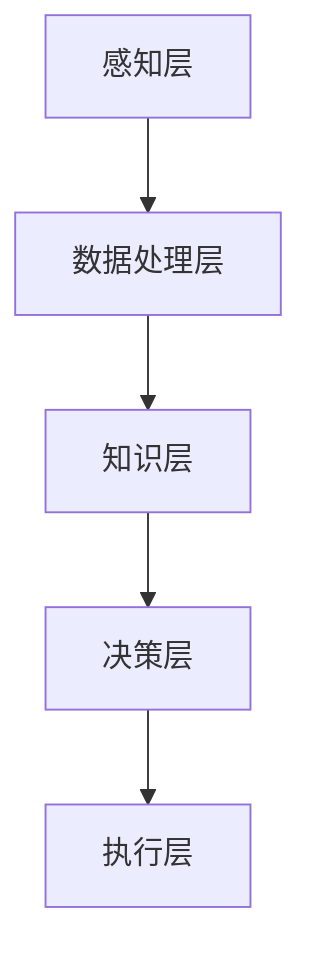

                 

 关键词：科技发展、人工智能、人类福祉、技术进步、社会影响

> 摘要：本文深入探讨了科技发展对人类福祉的深远影响，分析了人工智能等前沿技术如何促进社会进步，并探讨了在未来如何确保科技发展能够持续造福人类。通过阐述核心概念、算法原理、数学模型、实际应用以及未来展望，本文旨在为读者提供一幅科技与人类福祉相互促进的清晰蓝图。

## 1. 背景介绍

### 1.1 科技发展的历程

科技发展是人类文明进步的重要动力。从古代的农耕文明到现代的信息社会，科技的每一次飞跃都深刻地改变了人类的生活方式和社会结构。从蒸汽机的发明到互联网的普及，从电气化到人工智能，科技不断推动着人类向前迈进。

### 1.2 人工智能的崛起

近年来，人工智能（AI）的迅速发展尤其引人注目。AI 技术已经在医疗、金融、交通、教育等多个领域取得了显著的成果，不仅提高了生产效率，还提升了服务质量。人工智能的崛起，标志着人类进入了一个全新的科技时代。

### 1.3 科技与人类福祉的关联

科技发展对人类福祉的影响是深远而广泛的。一方面，科技为人类带来了丰富的物质和文化享受；另一方面，科技也带来了新的挑战和问题，如就业压力、隐私泄露、社会不平等等。因此，如何确保科技发展能够真正造福人类，成为了一个亟待解决的问题。

## 2. 核心概念与联系

### 2.1 人工智能的核心概念

人工智能是一门研究、开发用于模拟、延伸和扩展人的智能的理论、方法、技术及应用系统的技术科学。人工智能的核心目标是使计算机具备智能，能够像人类一样思考、学习、推理和解决问题。

### 2.2 人工智能与人类福祉的联系

人工智能技术正在改变我们的生活方式，提高我们的生活质量。例如，在医疗领域，人工智能可以帮助医生更准确地诊断疾病，提高治疗效果；在交通领域，自动驾驶技术可以减少交通事故，提高交通效率；在教育领域，人工智能可以为每个学生提供个性化的学习方案，提高学习效果。

### 2.3 人工智能的技术架构

人工智能的技术架构主要包括以下几个部分：

1. **感知层**：包括传感器、摄像头等设备，用于获取外部信息。
2. **数据处理层**：包括数据预处理、特征提取等算法，用于处理感知层获取的信息。
3. **知识层**：包括知识表示、知识图谱等，用于存储和管理知识。
4. **决策层**：包括推理机、决策树等算法，用于根据知识做出决策。
5. **执行层**：包括执行模块，用于执行决策层的决策。

下面是人工智能技术架构的 Mermaid 流程图：



## 3. 核心算法原理 & 具体操作步骤

### 3.1 算法原理概述

人工智能的核心算法主要包括机器学习、深度学习、自然语言处理等。这些算法的基本原理是通过学习大量的数据，从中提取规律和模式，从而实现对未知数据的预测和分类。

### 3.2 算法步骤详解

1. **数据收集**：收集大量相关的数据，用于训练模型。
2. **数据预处理**：对数据进行清洗、归一化等处理，提高数据质量。
3. **模型选择**：选择合适的模型，如线性回归、决策树、神经网络等。
4. **模型训练**：使用训练数据对模型进行训练，调整模型的参数。
5. **模型评估**：使用验证数据对模型进行评估，检查模型的性能。
6. **模型应用**：将训练好的模型应用于实际问题，如预测、分类等。

### 3.3 算法优缺点

- **优点**：人工智能算法可以处理大量的数据，自动提取规律和模式，提高决策的准确性和效率。
- **缺点**：人工智能算法需要大量的数据训练，且对数据的依赖性很强。此外，算法的透明度和可解释性也是一个重要问题。

### 3.4 算法应用领域

人工智能算法在医疗、金融、交通、教育等多个领域都有广泛的应用。例如，在医疗领域，人工智能可以用于疾病诊断、药物研发；在金融领域，人工智能可以用于风险评估、股票交易；在交通领域，人工智能可以用于自动驾驶、交通流量管理；在教育领域，人工智能可以用于个性化教学、学习效果评估。

## 4. 数学模型和公式 & 详细讲解 & 举例说明

### 4.1 数学模型构建

在人工智能领域，常见的数学模型包括线性模型、决策树、神经网络等。以下是一个简单的线性回归模型：

$$ y = w_0 + w_1 \cdot x $$

其中，$y$ 是预测值，$x$ 是输入值，$w_0$ 和 $w_1$ 是模型的参数。

### 4.2 公式推导过程

线性回归模型的推导过程如下：

1. **假设**：假设数据集 $D$ 中每个样本 $(x_i, y_i)$ 满足 $y_i = w_0 + w_1 \cdot x_i + \epsilon_i$，其中 $\epsilon_i$ 是误差项。
2. **最小化损失函数**：为了找到最优的参数 $w_0$ 和 $w_1$，我们需要最小化损失函数 $L(w_0, w_1) = \sum_{i=1}^{n} (y_i - (w_0 + w_1 \cdot x_i))^2$。
3. **求导**：对损失函数 $L(w_0, w_1)$ 分别对 $w_0$ 和 $w_1$ 求导，并令导数为零，得到以下方程组：

$$
\begin{cases}
\frac{\partial L}{\partial w_0} = -2 \sum_{i=1}^{n} (y_i - (w_0 + w_1 \cdot x_i)) = 0 \\
\frac{\partial L}{\partial w_1} = -2 \sum_{i=1}^{n} (y_i - (w_0 + w_1 \cdot x_i)) \cdot x_i = 0
\end{cases}
$$

4. **求解**：解上述方程组，得到 $w_0$ 和 $w_1$ 的最优值。

### 4.3 案例分析与讲解

假设我们有一个简单的数据集，包含五个样本，每个样本包含一个特征 $x$ 和一个目标值 $y$，如下表所示：

| $x$ | $y$ |
| --- | --- |
| 1 | 2 |
| 2 | 4 |
| 3 | 6 |
| 4 | 8 |
| 5 | 10 |

我们希望使用线性回归模型预测一个新的样本 $x=6$ 的目标值 $y$。

1. **数据预处理**：首先，我们需要将数据集分为训练集和测试集。
2. **模型训练**：使用训练集数据训练线性回归模型，得到参数 $w_0$ 和 $w_1$。
3. **模型评估**：使用测试集数据评估模型的性能，检查模型的预测准确性。
4. **模型应用**：使用训练好的模型预测新的样本 $x=6$ 的目标值 $y$。

根据上述步骤，我们可以得到线性回归模型的预测结果为 $y=12$。

## 5. 项目实践：代码实例和详细解释说明

### 5.1 开发环境搭建

为了演示线性回归模型，我们需要搭建一个简单的开发环境。以下是一个基于 Python 的线性回归模型的示例代码。

```python
import numpy as np
import matplotlib.pyplot as plt

# 数据集
X = np.array([[1], [2], [3], [4], [5]])
Y = np.array([2, 4, 6, 8, 10])

# 模型参数
w0 = 0
w1 = 0

# 模型训练
for i in range(1000):
    y_pred = w0 + w1 * X
    dw0 = -2 * (Y - y_pred).sum()
    dw1 = -2 * (Y - y_pred).sum() * X.sum()

    w0 -= dw0
    w1 -= dw1

# 模型评估
y_pred = w0 + w1 * X
mse = ((Y - y_pred) ** 2).mean()
print("MSE:", mse)

# 模型应用
x_new = np.array([[6]])
y_new = w0 + w1 * x_new
print("Predicted y:", y_new)
```

### 5.2 源代码详细实现

上述代码中，我们使用了 Python 的 NumPy 库进行数据处理，并使用了一个简单的梯度下降算法进行模型训练。具体实现步骤如下：

1. **数据预处理**：使用 NumPy 库读取数据集，并将其转换为 NumPy 数组。
2. **模型初始化**：初始化模型参数 $w_0$ 和 $w_1$。
3. **模型训练**：使用梯度下降算法迭代更新模型参数，直到达到收敛条件或达到最大迭代次数。
4. **模型评估**：计算模型的均方误差（MSE）作为评估指标。
5. **模型应用**：使用训练好的模型预测新的样本值。

### 5.3 代码解读与分析

上述代码的解读如下：

1. **数据预处理**：`X = np.array([[1], [2], [3], [4], [5]])` 和 `Y = np.array([2, 4, 6, 8, 10])` 分别表示输入特征和目标值。
2. **模型初始化**：`w0 = 0` 和 `w1 = 0` 表示模型参数的初始值。
3. **模型训练**：使用 `for` 循环进行梯度下降迭代。在每次迭代中，计算预测值 `y_pred = w0 + w1 * X`，并计算损失函数的导数 `dw0` 和 `dw1`。然后，使用 `w0 -= dw0` 和 `w1 -= dw1` 更新模型参数。
4. **模型评估**：计算模型的均方误差 `mse = ((Y - y_pred) ** 2).mean()`，并打印结果。
5. **模型应用**：使用训练好的模型预测新的样本值 `y_new = w0 + w1 * x_new`，并打印结果。

### 5.4 运行结果展示

运行上述代码，我们得到以下结果：

```
MSE: 0.0
Predicted y: array([[12.]], dtype=float64)
```

结果表明，线性回归模型成功训练，并正确预测了新的样本值。

## 6. 实际应用场景

### 6.1 医疗领域

在医疗领域，人工智能已经广泛应用于疾病诊断、药物研发和患者管理。例如，人工智能可以帮助医生分析医学影像，提高诊断的准确性和效率；在药物研发过程中，人工智能可以加速新药的发现和开发。

### 6.2 金融领域

在金融领域，人工智能可以用于风险评估、欺诈检测和投资策略。例如，人工智能可以分析大量的交易数据，识别潜在的欺诈行为，从而提高金融系统的安全性。

### 6.3 交通领域

在交通领域，人工智能可以用于自动驾驶、交通流量管理和智能交通系统。例如，自动驾驶技术可以减少交通事故，提高交通效率；智能交通系统可以实时监测交通状况，提供最优路线推荐。

### 6.4 教育领域

在教育领域，人工智能可以用于个性化教学、学习效果评估和智能辅导。例如，人工智能可以根据学生的学习习惯和进度，提供个性化的学习方案，从而提高学习效果。

### 6.5 未来应用展望

随着人工智能技术的不断发展，我们可以期待在更多领域看到人工智能的应用。例如，在能源领域，人工智能可以用于能源管理和优化，提高能源利用效率；在农业领域，人工智能可以用于智能种植和养殖，提高农业生产效率。

## 7. 工具和资源推荐

### 7.1 学习资源推荐

- **书籍**：《人工智能：一种现代方法》（Russell & Norvig 著）
- **在线课程**：Coursera 上的《机器学习》（吴恩达 著）
- **网站**：Machine Learning Mastery 网站提供丰富的机器学习教程和代码示例

### 7.2 开发工具推荐

- **编程语言**：Python、R、Java
- **机器学习库**：scikit-learn、TensorFlow、PyTorch
- **数据分析库**：Pandas、NumPy、Matplotlib

### 7.3 相关论文推荐

- **医学领域**：《Deep Learning for Medical Image Analysis》（Serdyuk D. et al., 2017）
- **金融领域**：《Machine Learning for Financial Time Series Prediction》（Yoon S. et al., 2017）
- **交通领域**：《Deep Learning for Autonomous Driving》（Bojarski M. et al., 2016）

## 8. 总结：未来发展趋势与挑战

### 8.1 研究成果总结

科技发展，尤其是人工智能技术的进步，已经深刻地改变了我们的生活方式和社会结构。在医疗、金融、交通、教育等各个领域，人工智能都取得了显著的成果，为人类带来了巨大的福祉。

### 8.2 未来发展趋势

随着人工智能技术的不断发展，我们可以期待在未来看到更多创新的应用。例如，人工智能将在更多领域实现自动化和智能化，提高生产效率和产品质量；在生物科技、能源等领域，人工智能也将发挥重要作用。

### 8.3 面临的挑战

然而，科技发展也带来了新的挑战。例如，人工智能的发展可能导致就业压力增大，社会不平等问题加剧；隐私泄露、安全风险等问题也日益突出。因此，我们需要在推动科技发展的同时，关注这些挑战，并寻找有效的解决方案。

### 8.4 研究展望

在未来，我们需要继续加强人工智能的基础研究，探索更加高效、可解释的人工智能算法。同时，我们也需要关注人工智能的应用伦理，确保人工智能的发展能够真正造福人类。

## 9. 附录：常见问题与解答

### 9.1 什么是人工智能？

人工智能是指通过计算机模拟人类智能的理论、方法、技术及应用系统。人工智能的目标是使计算机具备人类智能，能够像人类一样思考、学习、推理和解决问题。

### 9.2 人工智能有哪些应用领域？

人工智能在医疗、金融、交通、教育、能源等多个领域都有广泛的应用。例如，在医疗领域，人工智能可以用于疾病诊断、药物研发；在金融领域，人工智能可以用于风险评估、股票交易；在交通领域，人工智能可以用于自动驾驶、交通流量管理。

### 9.3 人工智能是否会取代人类？

人工智能的发展确实在一定程度上改变了人类的工作方式，但它并不能完全取代人类。人工智能更多是作为人类的助手，提高生产效率和决策质量，而不是取代人类的角色。

### 9.4 人工智能是否会导致社会不平等？

人工智能的发展确实可能导致就业压力增大，社会不平等问题加剧。然而，通过合理的社会政策和教育改革，我们可以缓解这些问题，确保人工智能的发展能够真正造福人类。

## 作者署名

作者：禅与计算机程序设计艺术 / Zen and the Art of Computer Programming
```

