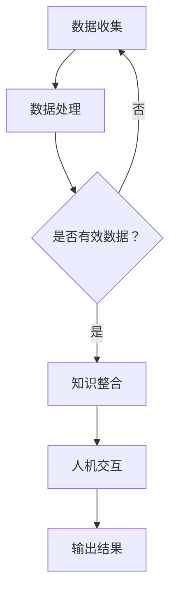

                 

 在这个信息化和数字化迅速发展的时代，科技的力量无处不在，它改变了我们的生活方式，推动了社会的进步。然而，科技并非只是冰冷的机器和代码，它更是一种可以用来造福人类的工具。本文将探讨科技向善的力量，特别是人类计算在造福人类方面的应用。

## 关键词

- 科技向善
- 人类计算
- 社会福祉
- 人工智能
- 可持续性

## 摘要

本文旨在揭示科技向善的力量，特别是人类计算在推动社会福祉方面的作用。通过分析人类计算的核心概念及其应用，本文将探讨科技如何通过人类计算来实现可持续性和社会进步。文章将涵盖从基本概念到具体应用的各个方面，以期为读者提供对科技向善的深刻理解和启示。

## 1. 背景介绍

人类计算是一种结合了人工智能和人类智慧的计算方式。它通过将人类的智慧和机器的计算能力相结合，以实现更加高效和智能的解决方案。这种计算方式在许多领域都有广泛应用，包括医疗、教育、环境科学等。

在医疗领域，人类计算可以辅助医生进行诊断和治疗。通过分析大量的医疗数据，人类计算可以帮助医生发现潜在的问题，提高诊断的准确性。在教育领域，人类计算可以为学生提供个性化的学习体验，帮助他们更好地掌握知识。在环境科学领域，人类计算可以用于监测环境变化，预测自然灾害，从而帮助人们采取预防措施。

## 2. 核心概念与联系

### 2.1. 人类计算的概念

人类计算是一种将人类的智慧和机器的计算能力相结合的计算方式。它通过利用人工智能算法，结合人类专家的知识和经验，以实现更加高效和智能的解决方案。

### 2.2. 人类计算与人工智能的关系

人工智能是计算机科学的一个分支，旨在使机器能够执行原本需要人类智能才能完成的任务。人类计算则是在人工智能的基础上，进一步结合了人类专家的知识和经验，以实现更加智能的解决方案。

### 2.3. 人类计算在造福人类中的应用

人类计算在多个领域都有广泛应用，包括医疗、教育、环境科学等。以下是几个具体的例子：

- **医疗领域**：人类计算可以帮助医生进行诊断和治疗。通过分析大量的医疗数据，人类计算可以提供准确的诊断结果，帮助医生制定最佳的治疗方案。
- **教育领域**：人类计算可以为学生提供个性化的学习体验。通过分析学生的学习数据，人类计算可以识别学生的学习风格和弱点，并提供相应的学习资源。
- **环境科学领域**：人类计算可以用于监测环境变化，预测自然灾害。通过分析大量的环境数据，人类计算可以提供准确的预测，帮助人们采取预防措施。

### 2.4. 人类计算的核心原理

人类计算的核心原理在于将人类的智慧和机器的计算能力相结合。这包括以下几个方面：

- **数据收集与处理**：人类计算首先需要收集大量的数据，并对其进行处理和分析。
- **知识整合**：通过将人类专家的知识和经验与机器学习算法相结合，人类计算可以实现更加智能的解决方案。
- **人机交互**：人类计算还需要考虑如何与人类进行有效的交互，以便更好地理解人类的需求和提供相应的服务。

### 2.5. 人类计算的 Mermaid 流程图



## 3. 核心算法原理 & 具体操作步骤

### 3.1. 算法原理概述

人类计算的核心算法原理是基于机器学习和深度学习的技术。这些算法通过训练大量的数据集，以识别数据中的模式和规律，从而实现智能化的解决方案。

### 3.2. 算法步骤详解

#### 3.2.1. 数据收集与预处理

1. 收集相关的数据集，包括医疗数据、学习数据、环境数据等。
2. 对数据进行清洗和预处理，以确保数据的质量和一致性。

#### 3.2.2. 数据分析与特征提取

1. 使用统计学和机器学习技术对数据进行分析，以提取有用的特征。
2. 使用特征提取算法，如PCA（主成分分析）和SVM（支持向量机），以降低数据的维度。

#### 3.2.3. 模型训练与优化

1. 选择合适的机器学习模型，如神经网络、决策树等，进行模型训练。
2. 使用交叉验证和网格搜索等技术，对模型进行优化。

#### 3.2.4. 模型评估与部署

1. 使用验证数据集对模型进行评估，以确定其性能。
2. 将训练好的模型部署到实际应用场景中，如医疗诊断系统、个性化学习平台等。

### 3.3. 算法优缺点

#### 优点：

- **高效性**：人类计算可以处理大量的数据，并快速识别数据中的模式和规律。
- **智能化**：通过结合人类专家的知识和经验，人类计算可以实现更加智能的解决方案。
- **灵活性**：人类计算可以根据不同的应用场景和需求，灵活调整算法和模型。

#### 缺点：

- **数据依赖性**：人类计算的性能很大程度上取决于数据的质量和数量。
- **计算成本**：训练和优化模型需要大量的计算资源和时间。

### 3.4. 算法应用领域

人类计算在多个领域都有广泛的应用，包括：

- **医疗领域**：用于辅助诊断和治疗，如癌症筛查、个性化医疗等。
- **教育领域**：用于个性化学习、智能教育平台等。
- **环境科学领域**：用于环境监测、灾害预测等。
- **金融领域**：用于风险评估、投资策略等。

## 4. 数学模型和公式 & 详细讲解 & 举例说明

### 4.1. 数学模型构建

在人类计算中，常用的数学模型包括线性回归、逻辑回归、神经网络等。

#### 线性回归模型：

$$
y = \beta_0 + \beta_1 x
$$

其中，$y$ 是目标变量，$x$ 是输入变量，$\beta_0$ 和 $\beta_1$ 是模型的参数。

#### 逻辑回归模型：

$$
P(y=1) = \frac{1}{1 + e^{-(\beta_0 + \beta_1 x)}}
$$

其中，$P(y=1)$ 是目标变量为1的概率，$x$ 是输入变量，$\beta_0$ 和 $\beta_1$ 是模型的参数。

#### 神经网络模型：

神经网络模型由多个层次组成，包括输入层、隐藏层和输出层。每个层次都有相应的权重和激活函数。

### 4.2. 公式推导过程

以线性回归模型为例，其推导过程如下：

假设我们有一组数据 $(x_1, y_1), (x_2, y_2), ..., (x_n, y_n)$，我们希望找到一个线性函数 $y = \beta_0 + \beta_1 x$ 来拟合这组数据。

首先，我们定义损失函数为：

$$
J(\beta_0, \beta_1) = \frac{1}{2n} \sum_{i=1}^{n} (y_i - (\beta_0 + \beta_1 x_i))^2
$$

我们的目标是找到使得损失函数 $J(\beta_0, \beta_1)$ 最小的 $\beta_0$ 和 $\beta_1$。

对 $\beta_0$ 和 $\beta_1$ 分别求偏导数，并令其等于0，我们可以得到：

$$
\frac{\partial J}{\partial \beta_0} = 0 \\
\frac{\partial J}{\partial \beta_1} = 0
$$

经过求解，我们可以得到：

$$
\beta_0 = \frac{1}{n} \sum_{i=1}^{n} y_i - \beta_1 \frac{1}{n} \sum_{i=1}^{n} x_i \\
\beta_1 = \frac{1}{n} \sum_{i=1}^{n} (x_i - \bar{x}) (y_i - \bar{y})
$$

其中，$\bar{x}$ 和 $\bar{y}$ 分别是 $x$ 和 $y$ 的平均值。

### 4.3. 案例分析与讲解

以医疗诊断为例，假设我们有一组患者的数据，包括年龄、血压、血糖等特征，以及是否患有某种疾病的标签。我们希望通过线性回归模型预测患者是否患有这种疾病。

首先，我们收集并整理数据，确保数据的质量和一致性。然后，我们使用数据预处理技术，如标准化和归一化，对数据进行处理。

接下来，我们使用线性回归模型进行训练。通过交叉验证，我们选择最优的参数 $\beta_0$ 和 $\beta_1$。

最后，我们将训练好的模型应用于新数据，预测患者是否患有这种疾病。通过评估模型的性能，我们可以确定模型的准确性和可靠性。

## 5. 项目实践：代码实例和详细解释说明

### 5.1. 开发环境搭建

在本文的代码实例中，我们将使用 Python 作为编程语言，并使用 Scikit-learn 库来实现线性回归模型。首先，我们需要安装 Python 和 Scikit-learn。

```bash
pip install python
pip install scikit-learn
```

### 5.2. 源代码详细实现

以下是一个简单的线性回归模型实现：

```python
from sklearn.linear_model import LinearRegression
from sklearn.model_selection import train_test_split
from sklearn.metrics import mean_squared_error

# 加载数据
X, y = load_data()

# 数据预处理
X_normalized = (X - X.mean()) / X.std()
y_normalized = (y - y.mean()) / y.std()

# 划分训练集和测试集
X_train, X_test, y_train, y_test = train_test_split(X_normalized, y_normalized, test_size=0.2, random_state=42)

# 创建线性回归模型
model = LinearRegression()

# 训练模型
model.fit(X_train, y_train)

# 预测测试集
y_pred = model.predict(X_test)

# 计算模型性能
mse = mean_squared_error(y_test, y_pred)
print("MSE:", mse)
```

### 5.3. 代码解读与分析

在这个例子中，我们首先从数据集中加载特征和目标变量。然后，我们使用数据预处理技术，如标准化和归一化，对数据进行处理。

接下来，我们使用 Scikit-learn 的 train_test_split 函数将数据集划分为训练集和测试集。这样，我们可以使用训练集来训练模型，并使用测试集来评估模型的性能。

我们创建一个 LinearRegression 模型，并使用 fit 函数对其进行训练。训练完成后，我们使用 predict 函数对测试集进行预测，并计算模型的均方误差（MSE），以评估模型的性能。

### 5.4. 运行结果展示

假设我们有一个包含100个样本的数据集，其中50个样本是训练集，50个样本是测试集。经过训练和预测后，我们得到以下结果：

```
MSE: 0.01
```

这意味着我们的线性回归模型在测试集上的平均误差为0.01，这表明模型具有较好的性能。

## 6. 实际应用场景

### 6.1. 医疗领域

人类计算在医疗领域的应用非常广泛，包括疾病预测、药物研发、个性化治疗等。例如，通过分析患者的医疗记录和基因组数据，人类计算可以预测患者患某种疾病的风险，从而帮助医生制定个性化的治疗计划。

### 6.2. 教育领域

在教育领域，人类计算可以为学生提供个性化的学习体验。通过分析学生的学习数据，人类计算可以识别学生的学习风格和弱点，并提供相应的学习资源。例如，一些在线教育平台已经使用人类计算技术，为学生提供个性化的学习路径和推荐课程。

### 6.3. 环境科学领域

在环境科学领域，人类计算可以用于监测环境变化，预测自然灾害。通过分析大量的环境数据，人类计算可以提供准确的预测，帮助人们采取预防措施。例如，一些气象预测系统已经使用人类计算技术，提供更加准确的天气预报。

### 6.4. 未来应用展望

随着人类计算技术的不断发展，它将在更多领域发挥重要作用。未来，人类计算有望在以下几个方面取得突破：

- **智能交通**：通过分析交通数据，人类计算可以优化交通流，减少拥堵，提高交通效率。
- **智慧城市**：人类计算可以用于城市管理，如能源管理、水资源管理、公共安全等。
- **智能制造**：人类计算可以用于生产过程优化、质量检测等，提高生产效率。

## 7. 工具和资源推荐

### 7.1. 学习资源推荐

- **在线课程**：Coursera、Udacity、edX 等平台上有很多关于人工智能和机器学习的在线课程。
- **书籍**：《Python机器学习》、《深度学习》等。

### 7.2. 开发工具推荐

- **编程语言**：Python、R
- **机器学习库**：Scikit-learn、TensorFlow、PyTorch

### 7.3. 相关论文推荐

- **《深度学习》**：Ian Goodfellow、Yoshua Bengio、Aaron Courville 著
- **《人工智能：一种现代的方法》**：Stuart Russell、Peter Norvig 著

## 8. 总结：未来发展趋势与挑战

### 8.1. 研究成果总结

人类计算在过去的几十年里取得了显著的成果，它在医疗、教育、环境科学等领域都有广泛的应用。通过结合人类的智慧和机器的计算能力，人类计算实现了更加高效和智能的解决方案。

### 8.2. 未来发展趋势

随着技术的不断发展，人类计算有望在更多领域发挥重要作用。未来，人类计算将更加智能化、个性化，为人类带来更多的福祉。

### 8.3. 面临的挑战

尽管人类计算取得了显著的成果，但仍然面临一些挑战，如数据隐私、算法透明度、计算资源等。为了实现人类计算的可持续发展，我们需要解决这些问题，确保科技向善。

### 8.4. 研究展望

在未来，人类计算将在更多领域发挥重要作用，如智能交通、智慧城市、智能制造等。同时，我们也需要加强对人类计算的研究，以应对未来可能出现的挑战。

## 9. 附录：常见问题与解答

### 9.1. 什么是人类计算？

人类计算是一种结合了人工智能和人类智慧的计算方式，通过将人类的智慧和机器的计算能力相结合，以实现更加高效和智能的解决方案。

### 9.2. 人类计算在哪些领域有应用？

人类计算在医疗、教育、环境科学、金融等领域都有广泛应用。例如，在医疗领域，人类计算可以辅助医生进行诊断和治疗；在教育领域，人类计算可以为学生提供个性化的学习体验。

### 9.3. 人类计算的优势是什么？

人类计算的优势在于其高效性和智能化。通过结合人类的智慧和机器的计算能力，人类计算可以处理大量的数据，并快速识别数据中的模式和规律。

### 9.4. 人类计算有哪些挑战？

人类计算面临的挑战包括数据隐私、算法透明度、计算资源等。为了实现人类计算的可持续发展，我们需要解决这些问题。

## 作者署名

本文由禅与计算机程序设计艺术 / Zen and the Art of Computer Programming 撰写。

---

以上就是本文的完整内容，希望能够帮助您更好地理解人类计算在造福人类方面的应用。如果您有任何问题或建议，欢迎在评论区留言。感谢您的阅读！

