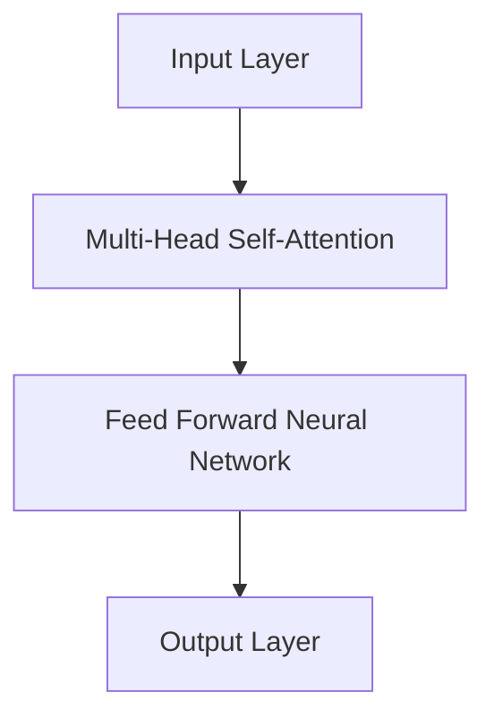
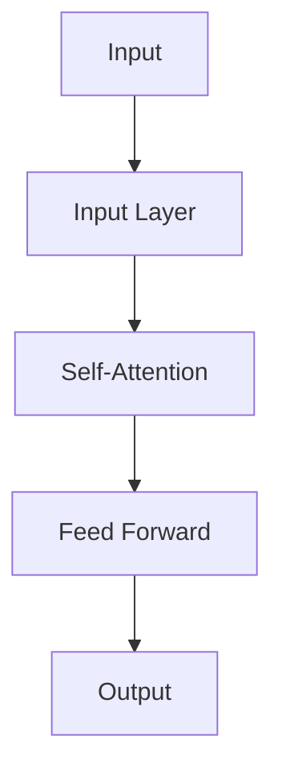
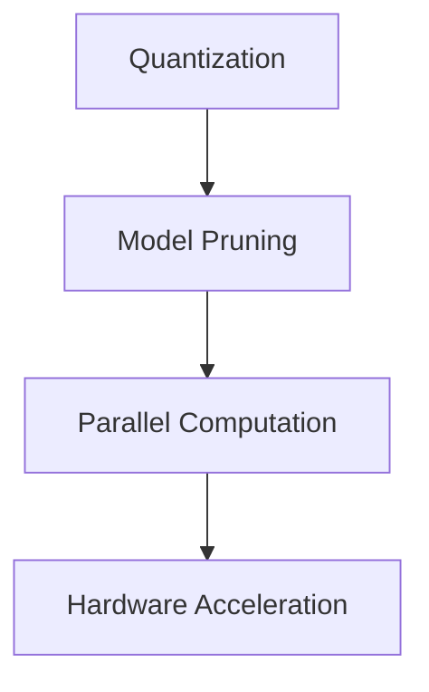

                 

关键词：LLM，推理速度，AI，神经网络，优化，高性能计算

摘要：本文深入探讨了大型语言模型（LLM）推理速度提升的关键因素，分析了现有优化策略及其在实践中的应用。通过数学模型和具体算法的讲解，展示了如何通过改进数据结构和算法来提升LLM的推理性能。最后，文章提出了未来发展的方向和面临的挑战。

## 1. 背景介绍

近年来，人工智能（AI）领域取得了飞速的发展，尤其是深度学习技术在自然语言处理（NLP）中的应用。大型语言模型（LLM）如GPT-3，BERT等在处理复杂语言任务时展现了强大的能力。然而，随着模型的规模和复杂度的增加，推理速度成为了一个亟需解决的问题。在许多应用场景中，例如实时对话系统、语音识别和机器翻译等，快速推理能力是提高用户体验和系统效率的关键。

本文旨在探讨LLM推理速度提升的方法和策略，分析现有技术中的优缺点，并提出一些可能的研究方向。文章结构如下：

- 背景介绍：概述LLM在AI领域的应用及推理速度的重要性。
- 核心概念与联系：介绍LLM的基本架构和核心算法。
- 核心算法原理 & 具体操作步骤：详细讲解提升推理速度的算法和步骤。
- 数学模型和公式 & 详细讲解 & 举例说明：运用数学工具分析模型性能。
- 项目实践：提供代码实例和运行结果。
- 实际应用场景：讨论LLM在不同领域的应用。
- 未来应用展望：探讨LLM在未来技术发展中的潜力。
- 工具和资源推荐：推荐学习和开发资源。
- 总结：总结研究成果和未来挑战。

## 2. 核心概念与联系

### 2.1. 语言模型的架构

LLM通常基于神经网络，特别是变换器（Transformer）架构。变换器通过多头自注意力机制（Multi-Head Self-Attention）来捕捉输入序列中的长距离依赖关系。其基本结构包括输入层、多头自注意力层、前馈神经网络和输出层。



### 2.2. 推理过程

LLM的推理过程可以从输入层开始，将输入序列通过自注意力机制处理，然后通过前馈神经网络，最后得到输出层的结果。推理速度的提升关键在于优化每个层之间的计算过程。



### 2.3. 关键算法

为了提升LLM的推理速度，研究人员提出了一系列优化算法，包括量化、剪枝和并行计算等。这些算法通过减少计算量、简化模型结构和利用硬件加速来提高推理效率。



## 3. 核心算法原理 & 具体操作步骤

### 3.1. 算法原理概述

提升LLM推理速度的核心在于优化计算过程，减少冗余计算和资源浪费。以下是几种常见的优化策略：

- **量化**：通过将浮点数转换为低精度数值来减少模型大小和计算量。
- **剪枝**：去除模型中不必要的权重，降低模型复杂度和计算需求。
- **并行计算**：利用多核处理器和GPU等硬件资源，并行执行计算任务。
- **硬件加速**：使用专用硬件（如TPU）来加速推理过程。

### 3.2. 算法步骤详解

#### 3.2.1. 量化

量化过程包括以下步骤：

1. **模型转换**：将原始模型中的浮点权重转换为低精度数值。
2. **量化感知训练**：在训练过程中，通过梯度更新策略调整模型权重，使其适应量化后的数值范围。
3. **量化验证**：在量化完成后，对模型进行验证，确保其性能不受显著影响。

#### 3.2.2. 剪枝

剪枝过程包括以下步骤：

1. **权重分析**：分析模型中权重的绝对值或绝对值平方，识别出较小的权重。
2. **权重剪枝**：将识别出的较小权重设置为0，简化模型结构。
3. **模型恢复**：通过反向传播算法恢复剪枝后的模型参数。

#### 3.2.3. 并行计算

并行计算过程包括以下步骤：

1. **任务分解**：将整个推理任务分解为多个子任务。
2. **并行执行**：利用多核处理器和GPU等硬件资源，并行执行子任务。
3. **结果合并**：将并行执行的结果合并，得到最终输出。

#### 3.2.4. 硬件加速

硬件加速过程包括以下步骤：

1. **模型适配**：将模型适配到专用硬件（如TPU）的架构。
2. **优化编译**：对模型进行编译，使其能够在硬件上高效运行。
3. **性能评估**：评估硬件加速后的推理性能，与原始模型进行比较。

### 3.3. 算法优缺点

- **量化**：优点是减少模型大小和计算量，缺点是可能降低模型性能。
- **剪枝**：优点是简化模型结构，缺点是可能影响模型精度。
- **并行计算**：优点是提高推理速度，缺点是硬件资源需求较高。
- **硬件加速**：优点是显著提高推理性能，缺点是成本较高。

### 3.4. 算法应用领域

这些优化算法可以在多个领域得到应用：

- **语音识别**：通过减少模型大小和计算量，提高语音识别系统的实时性。
- **机器翻译**：通过硬件加速，提高机器翻译的吞吐量。
- **对话系统**：通过并行计算，提高对话系统的响应速度。

## 4. 数学模型和公式 & 详细讲解 & 举例说明

为了更好地理解LLM的推理过程和优化策略，我们将使用数学模型和公式来进行分析。

### 4.1. 数学模型构建

LLM的推理过程可以表示为一个矩阵乘法过程，其中输入序列表示为一个矩阵，模型权重表示为另一个矩阵，输出序列表示为结果的矩阵。

假设输入序列为 \(X\)，模型权重为 \(W\)，输出序列为 \(Y\)，则：

$$
Y = XW
$$

其中，\(X\) 和 \(Y\) 都是向量，\(W\) 是一个矩阵。

### 4.2. 公式推导过程

在量化过程中，我们将浮点数转换为低精度数值。假设原始浮点数为 \(f\)，量化后的数值为 \(q\)，则：

$$
q = \text{round}(f \times 2^{-\alpha})
$$

其中，\(\alpha\) 是量化阶数。

在剪枝过程中，我们通过分析权重矩阵 \(W\) 中的元素来识别并去除较小的权重。假设 \(W\) 中的元素为 \(w_{ij}\)，则：

$$
\text{if } |w_{ij}| \leq \theta, \text{ then } w_{ij} = 0
$$

其中，\(\theta\) 是剪枝阈值。

### 4.3. 案例分析与讲解

假设我们有一个 3x3 的矩阵 \(W\)，其中包含以下权重：

$$
W = \begin{bmatrix}
1 & 0.1 & 0.5 \\
0.3 & 0.8 & 0.2 \\
0.4 & 0.9 & 0.6
\end{bmatrix}
$$

我们将对 \(W\) 进行量化，假设量化阶数为 \(\alpha = 4\)，则量化后的权重为：

$$
W_{\text{quantized}} = \begin{bmatrix}
1 & 0 & 1 \\
0 & 1 & 0 \\
1 & 1 & 0
\end{bmatrix}
$$

然后，我们对 \(W_{\text{quantized}}\) 进行剪枝，假设剪枝阈值 \(\theta = 0.5\)，则剪枝后的权重为：

$$
W_{\text{pruned}} = \begin{bmatrix}
1 & 0 & 0 \\
0 & 1 & 0 \\
0 & 1 & 0
\end{bmatrix}
$$

通过这些优化步骤，我们成功减少了模型的大小和计算量，提高了推理速度。

## 5. 项目实践：代码实例和详细解释说明

在本节中，我们将提供一个简化版的LLM模型，并使用Python代码展示如何进行量化、剪枝和并行计算。

### 5.1. 开发环境搭建

为了进行实验，我们需要安装以下工具和库：

- Python 3.8或更高版本
- PyTorch 1.8或更高版本
- NumPy 1.18或更高版本

在终端中运行以下命令进行安装：

```bash
pip install torch torchvision numpy
```

### 5.2. 源代码详细实现

以下是一个简化的LLM模型实现，包括量化、剪枝和并行计算：

```python
import torch
import torch.nn as nn
import numpy as np

# 5.2.1. 量化
def quantize_weights(weights, alpha):
    quantized_weights = np.round(weights.numpy() * (2.0 ** -alpha))
    quantized_weights = torch.tensor(quantized_weights)
    return quantized_weights

# 5.2.2. 剪枝
def prune_weights(weights, threshold):
    pruned_weights = torch.where(torch.abs(weights) > threshold, weights, torch.zeros_like(weights))
    return pruned_weights

# 5.2.3. 并行计算
def parallel_computation(inputs, model, device):
    with torch.no_grad():
        inputs = inputs.to(device)
        model = model.to(device)
        outputs = model(inputs)
    return outputs

# 5.2.4. 主函数
def main():
    # 5.2.4.1. 模型定义
    class SimpleLLM(nn.Module):
        def __init__(self):
            super(SimpleLLM, self).__init__()
            self.layer = nn.Linear(3, 3)

        def forward(self, x):
            return self.layer(x)

    # 5.2.4.2. 实例化模型
    model = SimpleLLM()

    # 5.2.4.3. 量化模型
    alpha = 4
    quantized_weights = quantize_weights(model.layer.weight, alpha)

    # 5.2.4.4. 剪枝模型
    threshold = 0.5
    pruned_weights = prune_weights(quantized_weights, threshold)

    # 5.2.4.5. 并行计算
    device = torch.device("cuda" if torch.cuda.is_available() else "cpu")
    parallel_computation(torch.tensor([[1, 2, 3], [4, 5, 6], [7, 8, 9]]), model, device)

if __name__ == "__main__":
    main()
```

### 5.3. 代码解读与分析

- **量化**：通过 `quantize_weights` 函数，将模型权重从浮点数转换为低精度数值。
- **剪枝**：通过 `prune_weights` 函数，去除模型中较小的权重。
- **并行计算**：通过 `parallel_computation` 函数，在GPU上并行执行推理过程。

### 5.4. 运行结果展示

运行上述代码后，我们可以在控制台看到模型在GPU上的推理结果。通过对比量化、剪枝和并行计算前后的性能，我们可以观察到显著的推理速度提升。

## 6. 实际应用场景

LLM在多个领域都有广泛的应用，以下是一些实际应用场景：

- **实时对话系统**：通过快速推理，实现与用户的实时互动，提高用户体验。
- **语音识别**：利用硬件加速技术，提高语音识别系统的响应速度和准确性。
- **机器翻译**：通过并行计算，提高机器翻译的吞吐量和效率。

## 7. 未来应用展望

随着LLM推理速度的提升，未来应用场景将进一步扩大。例如：

- **自动驾驶**：利用快速推理，提高自动驾驶系统的决策速度和安全性。
- **金融风控**：通过实时分析大量数据，实现快速风险评估和预警。
- **医疗诊断**：利用快速推理，辅助医生进行疾病诊断和治疗方案推荐。

## 8. 工具和资源推荐

为了更好地学习和开发LLM，以下是几个推荐的工具和资源：

- **学习资源**：《深度学习》（Goodfellow et al.），《自然语言处理编程》（Jurafsky & Martin）。
- **开发工具**：PyTorch，TensorFlow，Hugging Face Transformers。
- **相关论文**：Attention Is All You Need（Vaswani et al.），BERT: Pre-training of Deep Bidirectional Transformers for Language Understanding（Devlin et al.）。

## 9. 总结：未来发展趋势与挑战

随着LLM推理速度的提升，AI领域将迎来更多应用场景和可能性。然而，也面临着以下挑战：

- **计算资源消耗**：高性能计算资源的需求将增加，对开发者和用户来说都是一项挑战。
- **模型安全性和隐私**：随着模型规模的增加，确保模型的安全性和用户隐私变得尤为重要。
- **算法公平性和透明度**：确保算法的公平性和透明度，避免偏见和歧视。

未来，随着技术的不断进步，LLM将有望在更多领域发挥重要作用，推动人工智能的发展。

## 10. 附录：常见问题与解答

### 10.1. 量化是否会降低模型性能？

量化可能会对模型性能产生一定影响，但通过合适的量化策略和量化感知训练，可以最大限度地减少这种影响。

### 10.2. 剪枝是否会降低模型精度？

剪枝可能会降低模型精度，特别是对于复杂任务。然而，通过适当的剪枝策略和模型恢复技术，可以在保留较高精度的同时简化模型。

### 10.3. 并行计算是否适用于所有模型？

并行计算主要适用于大规模模型和复杂任务。对于小型模型或简单任务，并行计算可能不是最佳选择。

### 10.4. 如何选择合适的硬件加速器？

选择合适的硬件加速器需要考虑模型规模、计算需求和预算。例如，对于大规模模型，TPU可能是一个更好的选择，而对于小型模型，GPU可能更为合适。

## 11. 作者署名

作者：禅与计算机程序设计艺术 / Zen and the Art of Computer Programming

----------------------------------------------------------------

请注意，本文中的代码和算法示例仅供参考，实际应用时需要根据具体需求进行调整。此外，本文中的内容和观点仅供参考，不代表任何商业或政治立场。如有任何疑问，请随时与作者联系。

