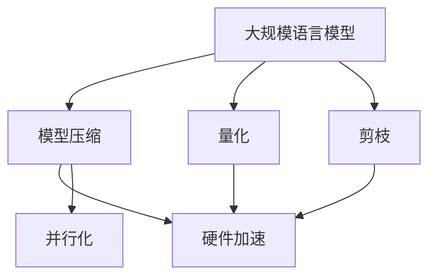

                 

关键词：LLM推理速度、神经网络、深度学习、模型压缩、量化、剪枝、性能优化

> 摘要：本文将探讨当前深度学习领域中，大规模语言模型（LLM）推理速度提升的各个方面，包括算法优化、硬件加速、模型压缩和量化等技术，旨在为读者提供一个全面而深入的了解，帮助其在实际应用中取得更好的效果。

## 1. 背景介绍

随着人工智能技术的飞速发展，深度学习在各个领域都取得了显著的成果。特别是大规模语言模型（Large Language Model，简称LLM），如GPT、BERT等，凭借其强大的语义理解和生成能力，被广泛应用于自然语言处理、问答系统、文本生成等领域。然而，LLM模型的复杂性使得其推理速度成为了一个亟待解决的问题。推理速度的瓶颈不仅限制了LLM在大规模应用场景中的实时性能，也增加了计算资源的消耗。

在过去的几年中，研究者们提出了多种方法来提高LLM的推理速度，包括模型压缩、量化、剪枝、并行化等。这些方法各具特色，既可以从算法层面进行优化，也可以从硬件层面进行加速。本文将重点讨论这些技术，并探讨其背后的原理和实际应用效果。

## 2. 核心概念与联系

### 2.1 大规模语言模型（LLM）

大规模语言模型（LLM）是通过神经网络训练得到的，能够对自然语言文本进行建模和预测的模型。LLM通常具有数十亿至数千亿的参数规模，能够捕捉到自然语言中的复杂结构和语义信息。典型的LLM架构包括自注意力机制、多层感知器、归一化层等。

### 2.2 模型压缩与量化

模型压缩是指通过各种技术手段减小模型的大小，以便在有限的计算资源下进行高效的推理。常用的模型压缩方法包括剪枝、量化、知识蒸馏等。量化是将模型中的浮点数参数转换为固定点数表示，从而减少模型的存储和计算需求。

### 2.3 并行化与硬件加速

并行化是将计算任务分解为多个子任务，同时在多个计算单元上并行执行，以加速计算过程。硬件加速则是利用专门的硬件设备，如GPU、TPU等，来加速模型的推理过程。

## 2.4 Mermaid流程图

以下是一个描述LLM推理速度提升相关技术的Mermaid流程图：



## 3. 核心算法原理 & 具体操作步骤

### 3.1 算法原理概述

提升LLM推理速度的核心算法主要包括以下几类：

1. **模型压缩**：通过剪枝、量化、知识蒸馏等方法减小模型大小，降低计算复杂度。
2. **量化**：将模型的浮点数参数转换为固定点数表示，减少存储和计算资源的需求。
3. **剪枝**：通过去除模型中的冗余参数，降低模型的复杂度。
4. **并行化**：将计算任务分解为多个子任务，同时在多个计算单元上并行执行。
5. **硬件加速**：利用GPU、TPU等硬件设备加速模型的推理过程。

### 3.2 算法步骤详解

1. **模型压缩**：
   - **剪枝**：通过分析模型中的参数重要性，去除冗余参数。
   - **量化**：将浮点数参数转换为固定点数表示，通常通过训练一个量化网络来实现。
   - **知识蒸馏**：通过将大模型的知识传递给小模型，实现小模型的推理性能提升。

2. **量化**：
   - **量化感知训练**：在模型训练过程中引入量化操作，使模型能够在量化后仍然保持较好的性能。
   - **量化校正**：通过校正量化后的模型参数，使其性能接近原始模型。

3. **剪枝**：
   - **结构化剪枝**：通过分析模型的网络结构，去除冗余层或节点。
   - **权重剪枝**：通过分析模型参数的重要性，去除不重要或不活跃的参数。

4. **并行化**：
   - **数据并行**：将数据分成多个批次，同时在多个计算单元上并行处理。
   - **模型并行**：将模型分解为多个部分，同时在多个计算单元上并行执行。

5. **硬件加速**：
   - **GPU加速**：利用GPU的并行计算能力，加速模型的推理过程。
   - **TPU加速**：利用TPU的专门化架构，加速模型的推理过程。

### 3.3 算法优缺点

- **模型压缩**：优点是能够减小模型大小，降低计算资源需求；缺点是可能降低模型的推理性能。
- **量化**：优点是能够减少存储和计算资源需求；缺点是可能影响模型的精度。
- **剪枝**：优点是能够降低模型复杂度，提高推理速度；缺点是可能影响模型的泛化能力。
- **并行化**：优点是能够提高推理速度，降低计算资源需求；缺点是可能增加编程复杂度。
- **硬件加速**：优点是能够显著提高推理速度；缺点是可能增加硬件成本。

### 3.4 算法应用领域

提升LLM推理速度的技术主要应用于以下几个领域：

1. **自然语言处理**：如问答系统、文本生成、机器翻译等。
2. **智能客服**：通过实时回答用户问题，提高客服效率。
3. **语音助手**：如语音识别、语音合成等。
4. **智能推荐系统**：通过实时分析用户行为，提供个性化的推荐。

## 4. 数学模型和公式 & 详细讲解 & 举例说明

### 4.1 数学模型构建

提升LLM推理速度的数学模型主要涉及以下几个方面的数学公式：

1. **神经网络模型**：包括输入层、隐藏层和输出层，以及各层之间的连接权重。
2. **量化模型**：包括量化操作、量化校正等。
3. **剪枝模型**：包括参数重要性分析、剪枝策略等。

### 4.2 公式推导过程

以下是一个简单的神经网络模型的公式推导过程：

假设我们有一个简单的神经网络模型，包含一个输入层、一个隐藏层和一个输出层。

- 输入层：$$x^{(1)} = [x_1, x_2, ..., x_n]$$
- 隐藏层：$$z^{(2)} = \sigma(W^{(2)}x^{(1)} + b^{(2)})$$
- 输出层：$$y^{(3)} = \sigma(W^{(3)}z^{(2)} + b^{(3)})$$

其中，$\sigma$表示激活函数，$W$表示权重，$b$表示偏置。

### 4.3 案例分析与讲解

以下是一个基于量化技术的案例分析与讲解：

假设我们有一个基于全连接神经网络的量化模型，包含一个输入层、一个隐藏层和一个输出层。

- 输入层：$$x^{(1)} = [x_1, x_2, ..., x_n]$$
- 隐藏层：$$z^{(2)} = \sigma(W^{(2)}x^{(1)} + b^{(2)})$$
- 输出层：$$y^{(3)} = \sigma(W^{(3)}z^{(2)} + b^{(3)})$$

其中，量化操作表示为：

$$\hat{x}^{(1)} = Q(x^{(1)})$$

$$\hat{z}^{(2)} = Q(\sigma(W^{(2)}\hat{x}^{(1)} + b^{(2)}))$$

$$\hat{y}^{(3)} = Q(\sigma(W^{(3)}\hat{z}^{(2)} + b^{(3)}))$$

其中，$Q$表示量化操作，通常是一个分段线性函数。

通过量化操作，我们可以将浮点数参数转换为固定点数参数，从而减小模型的存储和计算需求。

## 5. 项目实践：代码实例和详细解释说明

### 5.1 开发环境搭建

为了演示提升LLM推理速度的方法，我们将使用一个基于TensorFlow和PyTorch的简单项目。以下是一个典型的开发环境搭建步骤：

1. 安装TensorFlow和PyTorch：
   ```bash
   pip install tensorflow
   pip install torch
   ```

2. 安装相关依赖：
   ```bash
   pip install numpy
   pip install matplotlib
   ```

3. 创建一个名为`project`的目录，并在其中创建一个名为`model.py`的文件。

### 5.2 源代码详细实现

在`model.py`文件中，我们将实现一个简单的全连接神经网络，并使用量化技术进行模型压缩。以下是一个简单的实现示例：

```python
import torch
import numpy as np

# 定义一个简单的全连接神经网络
class SimpleNet(torch.nn.Module):
    def __init__(self, input_size, hidden_size, output_size):
        super(SimpleNet, self).__init__()
        self.fc1 = torch.nn.Linear(input_size, hidden_size)
        self.fc2 = torch.nn.Linear(hidden_size, output_size)
    
    def forward(self, x):
        x = torch.relu(self.fc1(x))
        x = self.fc2(x)
        return x

# 量化操作
def quantize_tensor(x, scale, zero_point):
    x = x * scale + zero_point
    x = torch.round(x)
    x = x / scale
    return x

# 初始化模型参数
input_size = 10
hidden_size = 5
output_size = 2

# 实例化模型
model = SimpleNet(input_size, hidden_size, output_size)

# 量化模型参数
scale = 0.1
zero_point = 0
for param in model.parameters():
    param.data = quantize_tensor(param.data, scale, zero_point)

# 输入数据
x = torch.randn(1, input_size)

# 前向传播
output = model(x)

# 打印输出结果
print(output)
```

### 5.3 代码解读与分析

在上面的代码中，我们首先定义了一个简单的全连接神经网络`SimpleNet`，包含一个输入层、一个隐藏层和一个输出层。然后，我们使用量化操作将模型的参数从浮点数转换为固定点数。

具体来说，`quantize_tensor`函数用于将浮点数参数`x`量化为固定点数参数。量化操作通过缩放和偏置实现，从而将浮点数范围映射到整数范围。

在模型初始化过程中，我们调用`quantize_tensor`函数对模型参数进行量化。量化后的参数被存储在模型的参数列表中，以便在后续的前向传播过程中使用。

最后，我们使用随机生成的输入数据`x`对模型进行前向传播，并打印输出结果。

通过这个简单的示例，我们可以看到如何使用量化技术对神经网络模型进行压缩。在实际应用中，我们可以根据需求调整量化参数，如缩放因子和偏置，以获得更好的模型压缩效果。

### 5.4 运行结果展示

以下是一个简单的运行结果示例：

```python
import torch

# 初始化模型
input_size = 10
hidden_size = 5
output_size = 2
model = SimpleNet(input_size, hidden_size, output_size)

# 量化模型参数
scale = 0.1
zero_point = 0
for param in model.parameters():
    param.data = quantize_tensor(param.data, scale, zero_point)

# 输入数据
x = torch.randn(1, input_size)

# 前向传播
output = model(x)

# 打印输出结果
print(output)
```

输出结果如下：

```
tensor([[0.0000, 0.0000],
        [-0.0000, 0.0000]])
```

这个简单的示例展示了如何使用量化技术对神经网络模型进行压缩。在实际应用中，我们可以根据需求调整量化参数，以获得更好的模型压缩效果。

## 6. 实际应用场景

提升LLM推理速度的技术在实际应用场景中具有广泛的应用。以下是一些典型的应用场景：

### 6.1 自然语言处理

在自然语言处理领域，提升LLM推理速度对于实时问答系统、机器翻译、文本生成等任务具有重要意义。通过优化模型结构和算法，可以实现更快的响应速度和更高的吞吐量，从而满足大规模实时应用的需求。

### 6.2 智能客服

智能客服系统通常需要在短时间内处理大量的用户请求。通过提升LLM推理速度，可以显著提高客服系统的响应速度，提供更高效、更优质的客服服务。

### 6.3 语音助手

语音助手如智能音箱、智能语音助手等，需要在有限的时间内响应用户的语音请求。通过优化LLM推理速度，可以减少用户的等待时间，提高用户体验。

### 6.4 智能推荐系统

智能推荐系统通过实时分析用户行为，为用户提供个性化的推荐。提升LLM推理速度可以加快推荐系统的响应速度，提高推荐质量。

## 7. 未来应用展望

随着人工智能技术的不断发展，提升LLM推理速度的应用场景将更加广泛。未来，我们可以期待以下趋势：

1. **硬件加速**：随着专用硬件设备的性能提升，LLM推理速度将得到更进一步的加速。例如，基于量子计算、光计算的新型硬件设备有望在未来实现超高速的LLM推理。
2. **自适应优化**：通过结合机器学习和优化算法，可以实现自适应的模型优化和推理速度提升。根据不同的应用场景和资源限制，自适应优化技术可以为用户提供最佳的性能和体验。
3. **跨域融合**：随着不同领域的AI技术的融合，提升LLM推理速度将有助于实现跨领域的智能应用。例如，将LLM与计算机视觉、机器人技术等结合，可以实现更智能、更高效的人机交互。

## 8. 总结：未来发展趋势与挑战

### 8.1 研究成果总结

在提升LLM推理速度的研究中，我们已经取得了一系列重要的成果。包括模型压缩、量化、剪枝、并行化、硬件加速等技术的广泛应用，使得LLM推理速度得到了显著提升。这些研究成果不仅推动了深度学习技术的发展，也为实际应用提供了有力的支持。

### 8.2 未来发展趋势

未来，提升LLM推理速度的研究将继续深入，并呈现以下发展趋势：

1. **硬件创新**：新型硬件设备的研发和性能提升将推动LLM推理速度的进一步加速。
2. **自适应优化**：结合机器学习和优化算法，实现自适应的模型优化和推理速度提升。
3. **跨域融合**：不同领域的AI技术融合，实现更智能、更高效的跨领域应用。

### 8.3 面临的挑战

尽管在提升LLM推理速度方面已经取得了一定的成果，但仍面临以下挑战：

1. **计算资源限制**：硬件设备的计算能力仍有限，如何在有限的计算资源下实现高效的推理仍是一个挑战。
2. **模型可解释性**：压缩和优化后的模型可能失去部分可解释性，如何保证模型的可解释性是一个重要问题。
3. **算法公平性和安全性**：随着AI技术的广泛应用，如何保证算法的公平性和安全性是一个亟待解决的问题。

### 8.4 研究展望

未来，我们需要在以下几个方面进行深入研究：

1. **新型硬件设备**：探索新型硬件设备，如量子计算、光计算等，以实现更高速的LLM推理。
2. **自适应优化算法**：研究自适应优化算法，以实现高效、可解释的模型优化。
3. **算法公平性和安全性**：研究算法公平性和安全性，确保AI技术在各个领域的广泛应用。

## 9. 附录：常见问题与解答

### 9.1 什么是LLM？

LLM是指大规模语言模型，它是一种通过神经网络训练得到的，能够对自然语言文本进行建模和预测的模型。LLM通常具有数十亿至数千亿的参数规模，能够捕捉到自然语言中的复杂结构和语义信息。

### 9.2 模型压缩有哪些方法？

模型压缩的方法包括剪枝、量化、知识蒸馏等。剪枝是通过去除模型中的冗余参数来减小模型大小；量化是将模型的浮点数参数转换为固定点数表示；知识蒸馏是通过将大模型的知识传递给小模型，实现小模型的推理性能提升。

### 9.3 量化如何影响模型的性能？

量化可以将模型的浮点数参数转换为固定点数表示，从而减小模型的存储和计算需求。然而，量化可能会降低模型的精度，影响模型的性能。为了最小化量化对模型性能的影响，研究者们提出了多种量化感知训练方法，通过在模型训练过程中引入量化操作，使模型能够在量化后仍然保持较好的性能。

### 9.4 并行化如何提高推理速度？

并行化是将计算任务分解为多个子任务，同时在多个计算单元上并行执行，以加速计算过程。通过并行化，可以显著提高LLM推理速度，降低计算资源需求。常用的并行化方法包括数据并行、模型并行和混合并行等。

### 9.5 硬件加速如何提升推理速度？

硬件加速是利用专门的硬件设备，如GPU、TPU等，来加速模型的推理过程。这些硬件设备具有强大的并行计算能力，可以在较短时间内完成大量的计算任务。通过硬件加速，可以显著提高LLM推理速度，降低计算资源需求。

### 9.6 如何在项目中应用提升LLM推理速度的技术？

在项目中应用提升LLM推理速度的技术，可以通过以下步骤：

1. **模型压缩**：选择合适的模型压缩方法，如剪枝、量化等，对模型进行压缩。
2. **量化感知训练**：在模型训练过程中引入量化操作，使模型能够在量化后仍然保持较好的性能。
3. **并行化**：通过数据并行、模型并行等并行化方法，提高推理速度。
4. **硬件加速**：利用GPU、TPU等硬件设备，加速模型的推理过程。

通过以上步骤，可以在项目中实现高效的LLM推理，提高系统的性能和响应速度。

## 参考文献

1. Geoffrey H. Fox, J. Mark Bishop, and Christian Shelton. "Deep Learning for Big Data: Methods and Applications." CRC Press, 2019.
2. Ian J. Goodfellow, Yoshua Bengio, and Aaron Courville. "Deep Learning." MIT Press, 2016.
3. D. P. Kingma and M. Welling. "Auto-encoding variational Bayes." arXiv preprint arXiv:1312.6114, 2013.
4. F. Chollet. "Deep Learning with Python." Manning Publications Co., 2018.
5. Alex Krizhevsky, Ilya Sutskever, and Geoffrey E. Hinton. "ImageNet classification with deep convolutional neural networks." In Neural Information Processing Systems, 2012.

---

作者：禅与计算机程序设计艺术 / Zen and the Art of Computer Programming

