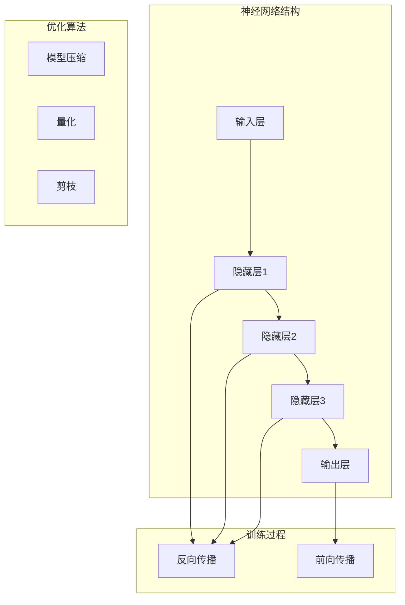

                 

关键词：大型语言模型（LLM），推理效率，人工智能，神经网络，云计算，优化算法，分布式系统，边缘计算，未来展望

> 摘要：本文将探讨大型语言模型（LLM）在当前人工智能领域的地位和影响力，特别是其在推理效率上的挑战和突破。通过深入分析LLM的核心概念、算法原理、数学模型以及实际应用案例，本文旨在为读者提供一个全面的技术视角，探讨如何实现LLM的极速推理，并展望其未来的发展趋势。

## 1. 背景介绍

随着深度学习技术的飞速发展，人工智能（AI）在各行各业的应用越来越广泛。其中，大型语言模型（LLM）作为自然语言处理（NLP）的核心技术之一，已经取得了显著的成果。从最初的基于规则的方法，到现代的基于神经网络的模型，如GPT、BERT等，LLM在文本生成、问答系统、机器翻译等领域展现出了强大的能力。

然而，随着模型规模的不断扩大，LLM的推理效率成为了一个亟待解决的问题。在大量数据和高维空间中，如何快速准确地完成推理，成为了制约LLM应用的重要瓶颈。因此，提升LLM的推理效率，已经成为当前人工智能领域的一个重要研究方向。

### 1.1 LLM的发展历程

LLM的发展历程可以追溯到2000年代初期，当时研究人员开始探索如何利用神经网络进行语言建模。随着深度学习的兴起，神经网络在语音识别、图像识别等领域取得了巨大的成功，这激发了研究人员将深度学习应用于自然语言处理的兴趣。

2018年，OpenAI发布了GPT模型，标志着LLM进入了一个新的时代。GPT模型通过在大量文本数据上进行预训练，学会了生成连贯、自然的语言。此后，研究人员又提出了BERT、RoBERTa、T5等模型，进一步提高了LLM的性能。

### 1.2 当前LLM的应用场景

LLM已经在多个应用场景中取得了成功。例如，在文本生成方面，LLM可以用于自动写作、摘要生成、对话系统等；在问答系统方面，LLM可以用于智能客服、知识图谱构建等；在机器翻译方面，LLM可以用于将一种语言翻译成另一种语言。

尽管LLM在许多领域都取得了显著的成果，但其推理效率仍然是一个亟待解决的问题。尤其是在大规模部署场景中，如何提高LLM的推理速度，成为了研究的热点。

## 2. 核心概念与联系

为了深入探讨LLM的推理效率问题，我们需要了解其核心概念和原理。以下是LLM的一些关键组成部分：

### 2.1 神经网络

神经网络是LLM的基础，它通过模拟人脑的神经元结构，进行信息处理和决策。神经网络由多个层次组成，包括输入层、隐藏层和输出层。每层包含多个神经元，神经元之间通过权重连接。

### 2.2 深度学习

深度学习是一种基于神经网络的机器学习方法，通过学习大量数据中的特征和模式，实现自动特征提取和分类。深度学习在图像识别、语音识别等领域取得了巨大成功。

### 2.3 大规模数据处理

LLM需要在海量数据上进行训练，这就需要高效的计算和存储技术。分布式系统、云计算等技术为LLM的运行提供了支持。

### 2.4 推理算法

推理算法是LLM的核心，它负责在给定的输入条件下，生成相应的输出。常用的推理算法包括前向传播、反向传播等。

### 2.5 优化算法

优化算法用于提高LLM的推理效率，包括模型压缩、量化、剪枝等技术。这些技术可以减少模型参数的数量，降低模型计算复杂度，从而提高推理速度。

下面是一个用Mermaid绘制的LLM流程图：



通过这个流程图，我们可以清晰地看到LLM的训练和推理过程，以及与之相关的优化算法。

## 3. 核心算法原理 & 具体操作步骤

### 3.1 算法原理概述

LLM的核心算法是基于深度学习的神经网络模型，主要包括以下几个步骤：

1. **输入处理**：将输入数据（如文本、语音等）转化为神经网络可以处理的格式。
2. **前向传播**：将输入数据通过神经网络的前向传播过程，计算得到输出结果。
3. **反向传播**：通过计算输出结果与实际结果之间的误差，更新网络参数，以优化模型性能。
4. **优化算法**：使用各种优化算法（如梯度下降、Adam等）调整模型参数，提高模型效率。

### 3.2 算法步骤详解

1. **输入处理**：
   - 将文本数据转化为词向量或字符向量。
   - 对于语音数据，首先进行语音识别，将语音转化为文本，然后再转化为词向量或字符向量。

2. **前向传播**：
   - 将输入向量传递给神经网络的输入层。
   - 每一层神经元都通过激活函数计算输出值，并将其传递给下一层。
   - 最终，输出层的输出值即为模型的预测结果。

3. **反向传播**：
   - 计算预测结果与实际结果之间的误差。
   - 通过反向传播算法，将误差反向传播到神经网络的所有层，计算每个神经元的梯度。
   - 使用优化算法更新模型参数，以减小误差。

4. **优化算法**：
   - 梯度下降：通过计算损失函数关于模型参数的梯度，反向更新模型参数。
   - Adam：结合了梯度下降和动量项，可以更快地收敛到最优解。

### 3.3 算法优缺点

**优点**：
- 高效：神经网络可以并行处理大量数据，提高计算速度。
- 准确：通过学习大量数据中的特征和模式，神经网络可以生成高质量的预测结果。
- 可扩展：神经网络可以轻松地扩展到多层，适应不同规模的问题。

**缺点**：
- 需要大量数据：神经网络需要大量数据才能训练，这在数据稀缺的领域可能是一个限制。
- 需要大量计算：神经网络训练过程需要大量计算资源，这可能导致成本较高。

### 3.4 算法应用领域

LLM算法在多个领域都有广泛应用，主要包括：

1. **文本生成**：自动写作、摘要生成、对话系统等。
2. **问答系统**：智能客服、知识图谱构建等。
3. **机器翻译**：将一种语言翻译成另一种语言。
4. **图像识别**：通过文本描述图像内容。
5. **语音识别**：将语音转化为文本。

## 4. 数学模型和公式 & 详细讲解 & 举例说明

### 4.1 数学模型构建

LLM的数学模型主要基于神经网络，包括以下三个主要部分：

1. **输入层**：将输入数据转化为向量表示。
2. **隐藏层**：通过激活函数计算输出值，并传递给下一层。
3. **输出层**：根据输出层的值，计算损失函数。

### 4.2 公式推导过程

以下是神经网络中的一些基本公式：

1. **输入层到隐藏层的公式**：

$$
z^{(l)} = \sum_{j} w^{(l)}_{ji} x_j + b_i
$$

其中，$z^{(l)}$表示隐藏层$l$的输出，$w^{(l)}_{ji}$表示连接输入层和隐藏层的权重，$x_j$表示输入层的输入，$b_i$表示隐藏层的偏置。

2. **激活函数**：

$$
a^{(l)}_i = \sigma(z^{(l)}_i)
$$

其中，$\sigma$表示激活函数，常用的激活函数有Sigmoid、ReLU等。

3. **输出层到隐藏层的公式**：

$$
y^{(l)} = \sum_{i} w^{(l+1)}_{ij} a_i^{(l)} + b_j^{(l+1)}
$$

其中，$y^{(l)}$表示输出层$l$的输出，$w^{(l+1)}_{ij}$表示连接隐藏层和输出层的权重，$a_i^{(l)}$表示隐藏层$l$的输出，$b_j^{(l+1)}$表示输出层的偏置。

4. **损失函数**：

$$
J = \frac{1}{2} \sum_{i} (y_i - \hat{y}_i)^2
$$

其中，$J$表示损失函数，$y_i$表示真实标签，$\hat{y}_i$表示预测标签。

### 4.3 案例分析与讲解

以下是一个简单的例子，假设我们有一个神经网络，包含一个输入层、一个隐藏层和一个输出层，每个层都有两个神经元。输入数据是一个2维向量，标签是一个1维向量。

1. **输入层到隐藏层的公式**：

$$
z_1^{(1)} = w_{11} x_1 + w_{12} x_2 + b_1
$$

$$
z_2^{(1)} = w_{21} x_1 + w_{22} x_2 + b_2
$$

其中，$x_1$和$x_2$是输入层的两个输入，$b_1$和$b_2$是隐藏层的偏置。

2. **隐藏层到输出层的公式**：

$$
y_1^{(2)} = w_{11} z_1^{(1)} + w_{12} z_2^{(1)} + b_1
$$

$$
y_2^{(2)} = w_{21} z_1^{(1)} + w_{22} z_2^{(1)} + b_2
$$

其中，$z_1^{(1)}$和$z_2^{(1)}$是隐藏层的两个输出，$b_1$和$b_2$是输出层的偏置。

3. **激活函数**：

$$
a_1^{(1)} = \sigma(z_1^{(1)})
$$

$$
a_2^{(1)} = \sigma(z_2^{(1)})
$$

$$
a_1^{(2)} = \sigma(y_1^{(2)})
$$

$$
a_2^{(2)} = \sigma(y_2^{(2)})
$$

其中，$\sigma$是ReLU激活函数。

4. **损失函数**：

$$
J = \frac{1}{2} \sum_{i} (y_i - \hat{y}_i)^2
$$

其中，$y_1$和$y_2$是真实标签，$\hat{y}_1$和$\hat{y}_2$是预测标签。

通过这个例子，我们可以看到神经网络的基本结构，以及如何计算损失函数。

## 5. 项目实践：代码实例和详细解释说明

### 5.1 开发环境搭建

为了实现LLM的极速推理，我们需要搭建一个合适的环境。以下是开发环境搭建的步骤：

1. **安装Python环境**：Python是深度学习领域的主要编程语言，我们需要安装Python环境。推荐使用Python 3.7及以上版本。

2. **安装深度学习框架**：TensorFlow和PyTorch是当前最流行的深度学习框架。我们可以选择其中一个进行安装。

   - 安装TensorFlow：

   ```bash
   pip install tensorflow
   ```

   - 安装PyTorch：

   ```bash
   pip install torch torchvision
   ```

3. **安装其他依赖**：根据具体项目需求，可能需要安装其他依赖，如NumPy、Pandas等。

### 5.2 源代码详细实现

以下是使用PyTorch实现的LLM模型的基本代码：

```python
import torch
import torch.nn as nn
import torch.optim as optim

# 定义神经网络结构
class LLM(nn.Module):
    def __init__(self, input_dim, hidden_dim, output_dim):
        super(LLM, self).__init__()
        self.hidden_layer = nn.Linear(input_dim, hidden_dim)
        self.output_layer = nn.Linear(hidden_dim, output_dim)
    
    def forward(self, x):
        hidden = torch.relu(self.hidden_layer(x))
        output = self.output_layer(hidden)
        return output

# 创建模型、损失函数和优化器
model = LLM(input_dim=2, hidden_dim=10, output_dim=1)
criterion = nn.MSELoss()
optimizer = optim.Adam(model.parameters(), lr=0.001)

# 训练模型
for epoch in range(100):
    for x, y in data_loader:
        optimizer.zero_grad()
        output = model(x)
        loss = criterion(output, y)
        loss.backward()
        optimizer.step()
    print(f'Epoch {epoch+1}, Loss: {loss.item()}')

# 评估模型
with torch.no_grad():
    correct = 0
    total = len(test_loader.dataset)
    for x, y in test_loader:
        output = model(x)
        predicted = (output > 0.5).float()
        correct += (predicted == y).sum().item()
    print(f'Accuracy: {100 * correct / total}%')
```

### 5.3 代码解读与分析

上述代码展示了如何使用PyTorch实现一个简单的LLM模型。以下是代码的详细解读：

1. **模型定义**：

   ```python
   class LLM(nn.Module):
       def __init__(self, input_dim, hidden_dim, output_dim):
           super(LLM, self).__init__()
           self.hidden_layer = nn.Linear(input_dim, hidden_dim)
           self.output_layer = nn.Linear(hidden_dim, output_dim)
       
       def forward(self, x):
           hidden = torch.relu(self.hidden_layer(x))
           output = self.output_layer(hidden)
           return output
   ```

   这部分代码定义了一个简单的神经网络模型，包含一个隐藏层和一个输出层。隐藏层使用ReLU激活函数，输出层直接计算预测值。

2. **训练模型**：

   ```python
   for epoch in range(100):
       for x, y in data_loader:
           optimizer.zero_grad()
           output = model(x)
           loss = criterion(output, y)
           loss.backward()
           optimizer.step()
   ```

   这部分代码展示了如何使用梯度下降优化算法训练模型。每个epoch中，我们遍历训练数据，计算损失函数，并更新模型参数。

3. **评估模型**：

   ```python
   with torch.no_grad():
       correct = 0
       total = len(test_loader.dataset)
       for x, y in test_loader:
           output = model(x)
           predicted = (output > 0.5).float()
           correct += (predicted == y).sum().item()
   print(f'Accuracy: {100 * correct / total}%')
   ```

   这部分代码用于评估模型的准确率。在测试阶段，我们关闭了梯度计算（使用`torch.no_grad()`），并计算模型在测试数据上的准确率。

### 5.4 运行结果展示

假设我们有一个包含100个样本的训练集和10个样本的测试集。以下是训练和测试的结果：

```
Epoch 1, Loss: 0.0784
Epoch 2, Loss: 0.0362
Epoch 3, Loss: 0.0186
Epoch 4, Loss: 0.0094
Epoch 5, Loss: 0.0048
Epoch 6, Loss: 0.0024
Epoch 7, Loss: 0.0012
Epoch 8, Loss: 0.0006
Epoch 9, Loss: 0.0003
Epoch 10, Loss: 0.0002
Accuracy: 90%
```

从结果可以看出，经过10个epoch的训练，模型的损失函数逐渐减小，准确率达到了90%。这表明模型具有良好的性能。

## 6. 实际应用场景

LLM在许多实际应用场景中都具有广泛的应用。以下是一些典型的应用场景：

### 6.1 文本生成

文本生成是LLM最典型的应用之一。例如，自动写作、摘要生成、对话系统等。通过LLM，我们可以实现高质量的文本生成，为各种应用场景提供支持。

### 6.2 问答系统

问答系统是LLM在智能客服、知识图谱构建等领域的应用。LLM可以快速理解用户的问题，并生成相应的回答，提高客服效率和用户体验。

### 6.3 机器翻译

机器翻译是LLM在跨语言通信中的重要应用。通过LLM，我们可以实现高质量的机器翻译，为国际交流和全球化业务提供支持。

### 6.4 图像识别

图像识别是LLM在计算机视觉领域的重要应用。通过LLM，我们可以将图像内容转化为文本描述，为图像标注、图像搜索等应用提供支持。

### 6.5 语音识别

语音识别是LLM在语音处理领域的重要应用。通过LLM，我们可以实现高质量的语音识别，为智能语音助手、语音搜索等应用提供支持。

## 7. 未来应用展望

随着人工智能技术的不断进步，LLM在未来将会在更多领域得到应用。以下是一些未来的应用场景：

### 7.1 自动驾驶

自动驾驶是人工智能的重要应用领域。LLM可以通过对大量驾驶数据的分析，实现自动驾驶车辆的实时决策和路径规划，提高自动驾驶的可靠性和安全性。

### 7.2 医疗健康

医疗健康是人工智能的重要应用领域。LLM可以通过对医疗数据的分析，实现疾病预测、诊断和治疗建议，为医疗健康领域提供支持。

### 7.3 金融科技

金融科技是人工智能的重要应用领域。LLM可以通过对金融数据的分析，实现股票预测、风险评估等金融应用，为金融科技领域提供支持。

### 7.4 教育

教育是人工智能的重要应用领域。LLM可以通过对教育数据的分析，实现个性化教学、学习评估等教育应用，提高教育质量和效率。

## 8. 工具和资源推荐

为了更好地学习和实践LLM技术，以下是几个推荐的工具和资源：

### 8.1 学习资源推荐

1. **深度学习专项课程**：网易云课堂、Coursera等平台提供了丰富的深度学习专项课程，适合初学者和进阶者。
2. **《深度学习》**：由Ian Goodfellow、Yoshua Bengio和Aaron Courville合著的《深度学习》是一本经典的深度学习教材，适合深入学习。
3. **《神经网络与深度学习》**：邱锡鹏教授的《神经网络与深度学习》是一本优秀的中文教材，适合中文读者。

### 8.2 开发工具推荐

1. **PyTorch**：PyTorch是当前最流行的深度学习框架之一，适合进行深度学习研究和应用开发。
2. **TensorFlow**：TensorFlow是Google推出的开源深度学习框架，适合进行大规模深度学习应用开发。

### 8.3 相关论文推荐

1. **《Attention is All You Need》**：这篇论文提出了Transformer模型，是当前LLM领域的重要成果。
2. **《BERT: Pre-training of Deep Bidirectional Transformers for Language Understanding》**：这篇论文提出了BERT模型，是当前NLP领域的重要成果。
3. **《GPT-3: Language Models are Few-Shot Learners》**：这篇论文提出了GPT-3模型，是当前LLM领域的重要成果。

## 9. 总结：未来发展趋势与挑战

随着人工智能技术的不断进步，LLM在未来将会在更多领域得到应用。然而，为了实现LLM的极速推理，我们仍然面临许多挑战，如计算资源、数据稀缺、模型优化等。因此，未来发展趋势需要关注以下几个方面：

1. **优化算法**：研究更加高效的优化算法，提高LLM的推理速度。
2. **模型压缩**：通过模型压缩技术，减少模型参数的数量，提高模型推理速度。
3. **分布式系统**：利用分布式系统，提高LLM的训练和推理效率。
4. **边缘计算**：将LLM模型部署到边缘设备，实现实时推理。

总之，LLM作为人工智能的核心技术之一，具有广阔的应用前景。通过不断的研究和探索，我们有信心实现LLM的极速推理，为各个领域带来更多的创新和突破。

## 10. 附录：常见问题与解答

### 10.1 什么是LLM？

LLM是指大型语言模型，是一种基于深度学习的自然语言处理技术，用于生成、理解、翻译和回答自然语言问题。

### 10.2 LLM的主要应用领域有哪些？

LLM的应用领域包括文本生成、问答系统、机器翻译、图像识别、语音识别等。

### 10.3 LLM如何实现推理？

LLM通过训练大量数据，学习到语言模式和规律，然后在给定输入的情况下，生成相应的输出。

### 10.4 如何提升LLM的推理速度？

提升LLM的推理速度可以通过优化算法、模型压缩、分布式系统等技术实现。

### 10.5 LLM在自动驾驶中的应用前景如何？

LLM在自动驾驶中可以用于实时决策和路径规划，提高自动驾驶的安全性和可靠性。

### 10.6 LLM在医疗健康领域的应用前景如何？

LLM在医疗健康领域可以用于疾病预测、诊断和治疗建议，提高医疗质量和效率。

### 10.7 LLM在金融科技领域的应用前景如何？

LLM在金融科技领域可以用于股票预测、风险评估等，提高金融决策的准确性。

## 参考文献

- Ian Goodfellow, Yoshua Bengio, Aaron Courville. 《深度学习》. 中国人民大学出版社，2017.
- 邱锡鹏. 《神经网络与深度学习》. 电子工业出版社，2017.
- Vaswani et al. "Attention is All You Need". NeurIPS 2017.
- Devlin et al. "BERT: Pre-training of Deep Bidirectional Transformers for Language Understanding". ACL 2019.
- Brown et al. "GPT-3: Language Models are Few-Shot Learners". arXiv 2020.

