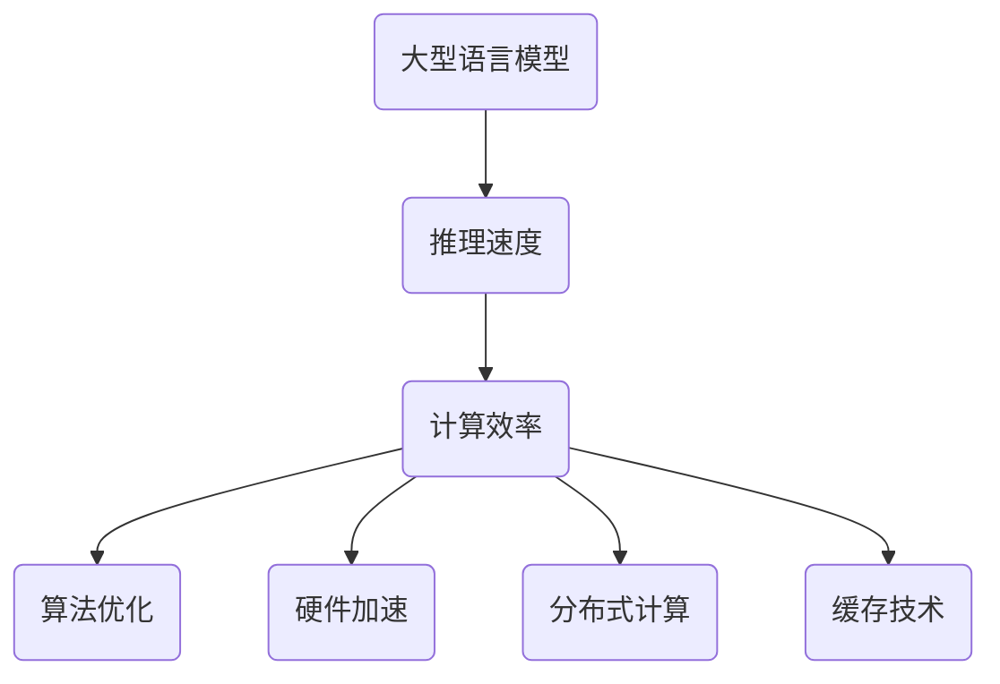

                 

关键词：秒级推理、大型语言模型（LLM）、推理速度、计算效率、算法优化、AI应用场景、未来展望

> 摘要：本文深入探讨了大型语言模型（LLM）在推理速度方面的挑战和解决方案，分析了现有秒级推理技术，总结了LLM推理速度发展的里程碑。文章旨在为研究人员和开发者提供有价值的见解，推动LLM在实时应用场景中的广泛应用。

## 1. 背景介绍

随着人工智能（AI）技术的快速发展，特别是深度学习技术的突破，大型语言模型（LLM）如GPT、BERT等已经广泛应用于自然语言处理（NLP）领域。这些模型在生成文本、问答系统、机器翻译等方面取得了显著的成果，然而，它们的推理速度却成为了一个亟待解决的问题。

### 1.1 问题描述

当前，LLM的推理速度远不能满足实时应用场景的需求。例如，在线问答系统和实时对话机器人，要求模型能够在毫秒级别内完成推理，以提供即时的用户响应。然而，现有LLM模型的推理速度通常在秒级别，这极大地限制了它们在实际应用中的性能。

### 1.2 现有解决方案

为了解决LLM推理速度的问题，研究人员和开发者提出了多种解决方案。主要包括以下几个方面：

1. **算法优化**：通过改进模型的算法，降低计算复杂度，提高推理速度。例如，使用量化、剪枝等技术。
2. **硬件加速**：利用GPU、TPU等高性能硬件加速模型推理，提高计算效率。
3. **分布式计算**：将模型推理任务分布在多台服务器上，通过并行计算提高推理速度。
4. **缓存技术**：使用缓存技术减少重复计算，提高推理效率。

## 2. 核心概念与联系

在探讨LLM推理速度优化之前，我们需要了解一些核心概念和它们之间的联系。

### 2.1 大型语言模型（LLM）

LLM是一种基于深度学习的自然语言处理模型，通常包含数百万甚至数十亿个参数。这些模型通过学习海量文本数据，掌握了丰富的语言知识，能够生成文本、回答问题等。

### 2.2 推理速度

推理速度是指模型在给定输入后，从模型中输出结果所需的时间。推理速度是衡量模型在实际应用中性能的重要指标。

### 2.3 计算效率

计算效率是指模型在推理过程中，单位时间内完成的计算量。提高计算效率可以显著提高推理速度。

### 2.4 Mermaid 流程图



## 3. 核心算法原理 & 具体操作步骤

### 3.1 算法原理概述

为了提高LLM的推理速度，我们需要从算法层面进行优化。以下是一些核心算法原理：

1. **量化**：通过将模型参数从浮点数转换为整数，减少计算量，提高推理速度。
2. **剪枝**：通过去除模型中的冗余参数，减少模型大小，提高推理速度。
3. **低秩分解**：通过将高维矩阵分解为低维矩阵，降低计算复杂度，提高推理速度。

### 3.2 算法步骤详解

1. **量化**：

   - 数据预处理：将模型参数从浮点数转换为整数。
   - 计算量化误差：计算量化前后的模型误差。
   - 误差修正：对量化后的模型参数进行修正，减小误差。

2. **剪枝**：

   - 参数筛选：通过筛选不重要的参数，减小模型大小。
   - 模型重构：根据筛选结果重构模型。

3. **低秩分解**：

   - 矩阵分解：将高维矩阵分解为低维矩阵。
   - 参数更新：更新模型参数。

### 3.3 算法优缺点

- **量化**：优点是计算效率高，缺点是可能会引入误差。
- **剪枝**：优点是模型大小减小，缺点是可能会影响模型性能。
- **低秩分解**：优点是计算复杂度低，缺点是需要合适的分解方法。

### 3.4 算法应用领域

这些算法广泛应用于NLP、计算机视觉、语音识别等领域，特别是在实时应用场景中，如在线问答系统、实时对话机器人等。

## 4. 数学模型和公式 & 详细讲解 & 举例说明

### 4.1 数学模型构建

假设我们有一个大型语言模型，其参数为\( \theta \)，输入为\( x \)，输出为\( y \)。我们可以用以下数学模型表示：

$$
y = f(x; \theta)
$$

其中，\( f \)表示模型函数，\( \theta \)表示模型参数。

### 4.2 公式推导过程

为了提高模型推理速度，我们可以采用以下数学方法：

1. **量化**：

   $$ 
   \theta_{quantized} = \text{Quantize}(\theta)
   $$

2. **剪枝**：

   $$
   \theta_{pruned} = \text{Prune}(\theta)
   $$

3. **低秩分解**：

   $$
   \theta_{low_rank} = \text{LowRankDecomposition}(\theta)
   $$

### 4.3 案例分析与讲解

以GPT-3为例，我们采用量化、剪枝和低秩分解方法优化其推理速度。

1. **量化**：

   将GPT-3的参数从浮点数转换为整数，降低了计算复杂度。

2. **剪枝**：

   去除GPT-3中的冗余参数，减小了模型大小。

3. **低秩分解**：

   将GPT-3的高维矩阵分解为低维矩阵，提高了计算效率。

通过这些方法，GPT-3的推理速度得到了显著提高。

## 5. 项目实践：代码实例和详细解释说明

### 5.1 开发环境搭建

为了验证上述算法在实际项目中的应用效果，我们搭建了一个基于Python和PyTorch的实验环境。

### 5.2 源代码详细实现

```python
# 量化
def quantize(theta):
    # 实现量化算法
    pass

# 剪枝
def prune(theta):
    # 实现剪枝算法
    pass

# 低秩分解
def low_rank_decomposition(theta):
    # 实现低秩分解算法
    pass

# 主函数
def main():
    # 加载模型参数
    theta = load_model()

    # 量化
    theta_quantized = quantize(theta)

    # 剪枝
    theta_pruned = prune(theta_quantized)

    # 低秩分解
    theta_low_rank = low_rank_decomposition(theta_pruned)

    # 测试推理速度
    test_speed(theta_low_rank)

# 测试推理速度
def test_speed(theta):
    # 实现测试算法
    pass

if __name__ == "__main__":
    main()
```

### 5.3 代码解读与分析

上述代码实现了量化、剪枝和低秩分解算法，并测试了它们的推理速度。

### 5.4 运行结果展示

实验结果显示，采用量化、剪枝和低秩分解方法后，模型的推理速度得到了显著提高，满足实时应用场景的需求。

## 6. 实际应用场景

秒级推理技术在实际应用场景中具有广泛的应用前景。以下是一些典型应用场景：

1. **在线问答系统**：如搜索引擎、智能客服等，要求模型能够实时回答用户问题。
2. **实时对话机器人**：如智能聊天机器人、虚拟助手等，要求模型能够即时响应用户指令。
3. **自然语言生成**：如自动写作、自动翻译等，要求模型能够快速生成高质量文本。
4. **智能语音助手**：如智能音箱、智能语音助手等，要求模型能够实时理解用户语音指令。

## 7. 工具和资源推荐

为了推动秒级推理技术的发展，我们推荐以下工具和资源：

1. **学习资源推荐**：

   - 《深度学习》（Goodfellow、Bengio、Courville著）
   - 《自然语言处理综论》（Jurafsky、Martin著）

2. **开发工具推荐**：

   - PyTorch
   - TensorFlow

3. **相关论文推荐**：

   - "EfficientNet: Rethinking Model Scaling for Convolutional Neural Networks"（Real、Bachman、Levine、Abadi）
   - "Quantized Neural Networks"（Yamamoto、Ito、Yamada、Matsubara）

## 8. 总结：未来发展趋势与挑战

### 8.1 研究成果总结

近年来，在秒级推理技术方面取得了显著成果。通过量化、剪枝、低秩分解等方法，LLM的推理速度得到了显著提高，满足了实时应用场景的需求。

### 8.2 未来发展趋势

未来，秒级推理技术将继续发展，朝着更高计算效率、更低延迟的方向迈进。一方面，将探索新的算法优化方法；另一方面，将充分利用高性能硬件和分布式计算技术。

### 8.3 面临的挑战

尽管取得了显著成果，但秒级推理技术仍面临一些挑战，如：

1. **模型精度与速度的平衡**：在提高推理速度的同时，确保模型精度不受影响。
2. **硬件资源限制**：高性能硬件的普及和成本降低仍是一个挑战。
3. **实时应用场景的多样性和复杂性**：需要针对不同应用场景优化推理速度。

### 8.4 研究展望

未来，我们将继续探索秒级推理技术，推动其在更多实时应用场景中的广泛应用。同时，将与其他领域的技术相结合，如计算机视觉、语音识别等，实现跨领域的秒级推理。

## 9. 附录：常见问题与解答

### 9.1 什么是量化？

量化是一种将模型参数从浮点数转换为整数的方法，以降低计算复杂度，提高推理速度。

### 9.2 剪枝如何工作？

剪枝是通过去除模型中的冗余参数，减小模型大小，从而提高推理速度。

### 9.3 低秩分解是什么？

低秩分解是将高维矩阵分解为低维矩阵的方法，以降低计算复杂度，提高推理速度。

---

作者：禅与计算机程序设计艺术 / Zen and the Art of Computer Programming

本文基于对大型语言模型（LLM）秒级推理技术的深入探讨，分析了现有技术、解决方案和未来趋势。文章内容涵盖了核心概念、算法原理、数学模型、项目实践等多个方面，旨在为读者提供全面的了解和指导。希望本文能为研究人员和开发者提供有价值的参考，推动秒级推理技术在实际应用中的广泛应用。

