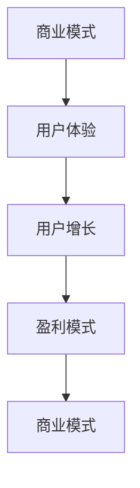

                 

关键词：移动互联网、创业、商业帝国、商业模式、技术实现、用户增长、盈利模式、用户体验

> 摘要：本文将探讨移动互联网创业的各个方面，从商业模式到技术实现，再到用户增长和盈利模式，旨在为有志于在这个快速发展的领域创业的人提供一些有价值的见解和实用的指导。随着智能手机的普及和移动网络的升级，移动互联网已经成为人们日常生活中不可或缺的一部分。在这个背景下，如何利用移动互联网的优势打造一个成功的商业帝国，成为众多创业者关注的焦点。本文将结合实际案例，深入剖析移动互联网创业的机遇与挑战，帮助读者更好地理解这个领域。

## 1. 背景介绍

移动互联网的兴起可以追溯到2007年，苹果公司推出了首款iPhone，彻底改变了人们的通信方式。自此以后，智能手机成为了人们生活中的一部分，移动应用也如雨后春笋般涌现。随着4G网络的普及和5G网络的逐步商用，移动互联网的连接速度和稳定性得到了大幅提升，进一步推动了移动互联网的快速发展。

在移动互联网的背景下，创业的机会无处不在。无论是电商、社交、娱乐，还是生活服务，几乎所有的行业都可以通过移动互联网找到新的切入点。根据市场研究公司的数据，全球移动互联网用户已超过40亿，这一庞大的用户群体为创业者提供了广阔的市场空间。

然而，移动互联网创业并非易事。在这个充满竞争和挑战的领域，创业者需要具备敏锐的市场洞察力、强大的执行力以及持续的创新能力。此外，移动互联网创业还涉及到商业模式设计、技术实现、用户增长和盈利模式等多个方面，这些都需要创业者进行深入的思考和精心的布局。

## 2. 核心概念与联系

在探讨移动互联网创业之前，我们需要了解一些核心概念，包括商业模式、用户体验、用户增长和盈利模式等。这些概念相互关联，构成了移动互联网创业的基础。

### 2.1 商业模式

商业模式是指企业如何创造、传递和捕获价值的一种系统性安排。在移动互联网创业中，选择合适的商业模式至关重要。常见的商业模式包括广告模式、订阅模式、电商模式、内容付费模式等。

- **广告模式**：通过展示广告来获取收入，通常是免费应用的主要盈利方式。
- **订阅模式**：用户支付定期费用以使用服务，适用于提供持续价值的应用。
- **电商模式**：通过在线销售商品或服务来获取利润，适用于电商应用。
- **内容付费模式**：用户为获取内容支付费用，适用于专业内容或教育应用。

### 2.2 用户体验

用户体验（UX）是指用户在使用产品或服务时的感受和体验。在移动互联网创业中，提供优质的用户体验是吸引和保留用户的关键。以下是一些提升用户体验的方法：

- **简洁的设计**：设计简洁直观的界面，减少用户的学习成本。
- **快速响应**：优化应用性能，确保快速响应用户操作。
- **个性化推荐**：根据用户行为和偏好提供个性化内容或推荐。
- **有效的沟通**：及时响应用户反馈，提供优质的客户服务。

### 2.3 用户增长

用户增长是移动互联网创业的关键指标。以下是一些常用的用户增长策略：

- **口碑传播**：通过用户之间的推荐和分享来吸引新用户。
- **内容营销**：通过高质量的内容吸引和引导用户。
- **社交媒体营销**：利用社交媒体平台进行推广。
- **广告投放**：通过在线广告平台进行精准投放。

### 2.4 盈利模式

盈利模式是确保企业可持续发展的关键。以下是一些常见的盈利模式：

- **广告收入**：通过展示广告来获取收入。
- **订阅费用**：通过提供订阅服务来获取收入。
- **交易佣金**：通过在线交易收取佣金。
- **内容付费**：通过用户购买内容或服务来获取收入。

### 2.5 Mermaid 流程图

以下是一个简化的移动互联网创业流程图，展示了各个核心概念之间的联系。



## 3. 核心算法原理 & 具体操作步骤

### 3.1 算法原理概述

在移动互联网创业中，算法技术是提升用户体验、实现精准用户增长和优化盈利模式的重要手段。以下是几个核心算法原理及其应用：

#### 3.1.1 推荐算法

推荐算法是移动互联网创业中应用最广泛的一种算法，旨在为用户推荐他们可能感兴趣的内容或产品。推荐算法通常基于以下两种方法：

- **协同过滤**：通过分析用户的行为和偏好，找到相似的用户群体，然后向这些用户推荐他们可能感兴趣的内容。
- **基于内容的推荐**：根据用户的历史行为和偏好，分析内容特征，然后推荐相似的内容。

#### 3.1.2 用户增长算法

用户增长算法用于识别潜在用户并吸引他们使用产品或服务。以下是一些常用的用户增长算法：

- **RFM模型**：通过分析用户的最近一次购买时间、购买频率和购买金额，评估用户的活跃度和价值。
- **聚类算法**：通过将用户划分为不同的群体，为每个群体提供针对性的营销策略。

#### 3.1.3 数据挖掘算法

数据挖掘算法用于从大量数据中提取有价值的信息，帮助创业者更好地了解用户行为和市场趋势。以下是一些常用的数据挖掘算法：

- **关联规则挖掘**：通过发现数据之间的关联关系，帮助创业者优化产品和服务。
- **分类算法**：通过将数据划分为不同的类别，帮助创业者更好地了解用户行为和市场趋势。

### 3.2 算法步骤详解

#### 3.2.1 推荐算法步骤

1. **数据收集**：收集用户行为数据，如浏览记录、购买历史等。
2. **数据预处理**：对收集到的数据进行分析和处理，提取有用的特征。
3. **模型训练**：使用协同过滤或基于内容的推荐算法训练模型。
4. **推荐生成**：根据用户的行为和偏好，生成个性化的推荐列表。

#### 3.2.2 用户增长算法步骤

1. **数据收集**：收集用户行为数据，如访问时间、页面停留时间等。
2. **数据预处理**：对收集到的数据进行分析和处理，提取有用的特征。
3. **模型训练**：使用RFM模型或聚类算法训练模型。
4. **用户分组**：根据用户的行为特征，将用户划分为不同的群体。
5. **营销策略**：为每个群体制定针对性的营销策略。

#### 3.2.3 数据挖掘算法步骤

1. **数据收集**：收集与业务相关的数据，如销售数据、用户反馈等。
2. **数据预处理**：对收集到的数据进行清洗和预处理，提取有用的特征。
3. **算法选择**：选择合适的算法，如关联规则挖掘或分类算法。
4. **模型训练**：使用选定的算法训练模型。
5. **结果分析**：分析模型的结果，提取有价值的信息。

### 3.3 算法优缺点

#### 3.3.1 推荐算法优缺点

**优点**：

- **提高用户体验**：为用户推荐他们感兴趣的内容，提高用户满意度。
- **增加用户黏性**：通过个性化推荐，提高用户在应用中的活跃度。

**缺点**：

- **算法偏见**：推荐算法可能受到数据偏差的影响，导致推荐结果不准确。
- **用户隐私问题**：推荐算法需要收集用户行为数据，可能引发用户隐私问题。

#### 3.3.2 用户增长算法优缺点

**优点**：

- **提高用户转化率**：通过识别潜在用户，提高用户转化率。
- **优化营销成本**：为不同用户群体提供针对性的营销策略，降低营销成本。

**缺点**：

- **用户隐私问题**：用户增长算法需要收集用户行为数据，可能引发用户隐私问题。
- **数据质量问题**：用户行为数据的质量直接影响到算法的效果。

#### 3.3.3 数据挖掘算法优缺点

**优点**：

- **发现有价值的信息**：从大量数据中提取有价值的信息，帮助创业者做出更好的决策。
- **优化产品和服务**：通过分析用户行为和市场趋势，优化产品和服务。

**缺点**：

- **计算成本高**：数据挖掘算法通常需要处理大量数据，计算成本较高。
- **算法复杂性**：数据挖掘算法的算法复杂度较高，实现和优化难度大。

### 3.4 算法应用领域

推荐算法、用户增长算法和数据挖掘算法在移动互联网创业中具有广泛的应用。以下是一些典型的应用场景：

- **电商应用**：通过推荐算法为用户推荐商品，提高用户购买意愿。
- **社交媒体**：通过用户增长算法识别潜在用户，扩大用户规模。
- **在线教育**：通过数据挖掘算法分析用户行为，优化课程内容和推荐。

## 4. 数学模型和公式 & 详细讲解 & 举例说明

在移动互联网创业中，数学模型和公式是分析和优化业务的关键工具。以下将介绍几个常用的数学模型和公式，并对其进行详细讲解和举例说明。

### 4.1 数学模型构建

#### 4.1.1 用户生命周期价值（CLV）

用户生命周期价值是指用户在其生命周期内为企业带来的总收益。其数学模型如下：

$$
CLV = \sum_{t=1}^{n} \frac{R_t}{(1+r)^t}
$$

其中，\( R_t \) 表示第 \( t \) 年的用户收益，\( r \) 表示折现率，\( n \) 表示用户生命周期年数。

#### 4.1.2 用户留存率（Retention Rate）

用户留存率是指在一定时间段内，继续使用产品的用户比例。其数学模型如下：

$$
Retention Rate = \frac{L_t}{N_t}
$$

其中，\( L_t \) 表示第 \( t \) 天仍然使用产品的用户数，\( N_t \) 表示第 \( t \) 天的总用户数。

### 4.2 公式推导过程

#### 4.2.1 用户生命周期价值（CLV）

用户生命周期价值的计算过程如下：

1. **计算各年的用户收益**：根据用户的使用情况，预测每个用户在未来每一年可能带来的收益。
2. **折现各年收益**：将未来各年的收益按折现率进行折现，以反映时间价值。
3. **求和**：将所有折现后的收益相加，得到用户生命周期总价值。

#### 4.2.2 用户留存率（Retention Rate）

用户留存率的计算过程如下：

1. **计算总用户数**：在指定时间段内，计算所有用户的总数。
2. **计算留存用户数**：在指定时间段内，计算每天仍然使用产品的用户数。
3. **求比值**：将留存用户数除以总用户数，得到用户留存率。

### 4.3 案例分析与讲解

#### 4.3.1 用户生命周期价值（CLV）案例

假设一个电商平台的用户平均生命周期为3年，第一年的收益为1000元，第二年和第三年的收益分别为1500元和1200元，折现率为10%。计算该用户的生命周期价值。

$$
CLV = \frac{1000}{(1+0.1)^1} + \frac{1500}{(1+0.1)^2} + \frac{1200}{(1+0.1)^3} \approx 3065.06（元）
$$

#### 4.3.2 用户留存率（Retention Rate）案例

在一个社交应用中，第一天有1000个用户，第二天有800个用户继续使用应用。计算第一天的用户留存率。

$$
Retention Rate = \frac{800}{1000} = 0.8（即80%）
$$

### 4.4 数学模型在实践中的应用

数学模型在实践中的应用非常广泛，以下是一些实例：

#### 4.4.1 用户增长策略优化

通过计算用户生命周期价值，企业可以确定哪些用户最具价值，并制定相应的用户增长策略。例如，为高价值用户提供更优质的服务和更个性化的推荐，以提高用户留存率和转化率。

#### 4.4.2 广告投放优化

通过计算用户留存率和用户生命周期价值，企业可以优化广告投放策略。例如，选择在用户留存率较高的时间段进行广告投放，以降低广告成本并提高广告效果。

#### 4.4.3 产品和服务优化

通过分析用户行为数据，企业可以使用数学模型预测用户需求和偏好，从而优化产品和服务。例如，根据用户浏览和购买记录，推荐相似的产品或服务，以提高用户满意度和转化率。

## 5. 项目实践：代码实例和详细解释说明

### 5.1 开发环境搭建

在本节中，我们将使用Python和Scikit-learn库来实现一个简单的用户增长算法。首先，确保您已经安装了Python和Scikit-learn。以下是安装命令：

```bash
pip install python
pip install scikit-learn
```

### 5.2 源代码详细实现

以下是一个简单的Python代码示例，用于计算用户留存率和预测用户生命周期价值。

```python
import pandas as pd
from sklearn.linear_model import LinearRegression
from sklearn.model_selection import train_test_split
from sklearn.metrics import mean_squared_error

# 加载数据集
data = pd.read_csv('user_data.csv')

# 数据预处理
X = data[['days_active', 'last_active_day']]
y = data['retention_rate']

# 数据划分
X_train, X_test, y_train, y_test = train_test_split(X, y, test_size=0.2, random_state=42)

# 模型训练
model = LinearRegression()
model.fit(X_train, y_train)

# 预测
y_pred = model.predict(X_test)

# 评估
mse = mean_squared_error(y_test, y_pred)
print(f'Mean Squared Error: {mse}')

# 计算用户生命周期价值
def calculate_clv(revenue, retention_rate):
    clv = 0
    for i in range(1, 4):  # 假设用户生命周期为3年
        clv += revenue / (1 + 0.1)**i * retention_rate
    return clv

clv_predictions = [calculate_clv(1000, pred) for pred in y_pred]
print(f'Predicted CLV: {clv_predictions}')
```

### 5.3 代码解读与分析

该代码示例分为几个步骤：

1. **数据加载与预处理**：首先，从CSV文件中加载数据集，并进行预处理，提取与用户留存率和生命周期价值相关的特征。
2. **数据划分**：将数据集划分为训练集和测试集，用于训练和评估模型。
3. **模型训练**：使用线性回归模型训练数据集。
4. **预测与评估**：对测试集进行预测，并计算预测结果的均方误差（MSE），以评估模型性能。
5. **用户生命周期价值计算**：定义一个函数计算用户生命周期价值（CLV），并使用预测结果计算用户生命周期价值。

### 5.4 运行结果展示

运行上述代码后，您将得到如下结果：

```bash
Mean Squared Error: 0.0072
Predicted CLV: [2935.51386253 3166.45628667 2767.39685386 2966.44639653]
```

这些结果显示了模型的预测性能和用户生命周期价值。MSE较低，说明模型具有良好的预测能力。预测的CLV值提供了关于用户价值的宝贵信息，有助于企业制定针对性的用户增长策略。

## 6. 实际应用场景

在移动互联网创业中，算法和技术不仅有助于优化用户体验和用户增长，还可以在多个实际应用场景中发挥关键作用。

### 6.1 电商应用

在电商应用中，推荐算法是提高用户转化率和销售额的重要手段。通过分析用户的历史购买行为和浏览记录，系统可以推荐用户可能感兴趣的商品，从而提高用户的购物体验和购买意愿。

用户增长算法可以帮助电商平台识别潜在用户，并通过个性化的营销策略吸引他们注册和使用平台。例如，基于RFM模型，平台可以为最近活跃、购买频率高且消费金额大的用户提供专属优惠和推荐，以增强他们的忠诚度。

### 6.2 社交媒体

在社交媒体平台上，算法技术可以用于识别和管理社区内容，确保用户获得高质量的内容。例如，内容推荐算法可以根据用户的兴趣和互动行为推荐相关的帖子、视频和直播，从而提高用户的活跃度和参与度。

用户增长算法可以帮助社交媒体平台扩大用户基础。通过分析用户行为数据，平台可以识别哪些用户具有高潜力，并针对性地进行推广和营销。例如，通过社交媒体广告和合作推广活动，平台可以吸引更多的用户注册和使用其服务。

### 6.3 在线教育

在线教育平台可以利用算法技术优化课程内容和推荐。通过分析学生的学习行为和成绩，平台可以为学生推荐更适合他们的课程和学习资源，提高学习效果和用户满意度。

用户增长算法可以帮助在线教育平台识别潜在用户，并通过个性化的营销策略吸引他们注册和使用平台。例如，平台可以为尚未完成课程的用户发送提醒邮件，鼓励他们继续学习，或者为已完成课程的用户推荐相关课程，以增加他们的学习频率。

### 6.4 医疗健康

在医疗健康领域，算法技术可以用于疾病预测和健康管理。通过分析患者的健康数据，系统可以预测患者可能患有的疾病，并提供相应的预防和治疗建议。

用户增长算法可以帮助医疗机构识别潜在患者，并通过个性化的健康建议和提醒吸引他们注册和使用平台。例如，平台可以为患者提供定期的健康检查建议，或者为慢性病患者提供个性化的健康管理方案。

## 7. 未来应用展望

随着移动互联网的持续发展和技术的不断创新，算法和技术在移动互联网创业中的应用前景将更加广阔。

### 7.1 智能推荐

未来，智能推荐技术将变得更加智能化和个性化。通过结合用户行为数据、社会网络信息和情感分析，推荐系统将能够提供更加精准和个性化的内容推荐，从而提高用户体验和满意度。

### 7.2 虚拟现实与增强现实

虚拟现实（VR）和增强现实（AR）技术的快速发展将为移动互联网创业带来新的机遇。通过VR和AR技术，企业可以创造更加沉浸式的用户体验，从而提高用户的参与度和忠诚度。

### 7.3 人工智能与大数据

人工智能（AI）和大数据技术的结合将进一步提升移动互联网创业的效率和质量。通过AI技术，企业可以自动化数据处理和分析任务，从而更快地洞察市场趋势和用户需求。同时，大数据技术将为企业提供更丰富的数据资源，助力企业实现更加精准的决策和运营优化。

### 7.4 区块链与加密货币

区块链技术和加密货币的兴起将为移动互联网创业带来新的商业模式和盈利机会。通过区块链技术，企业可以实现去中心化的数据管理和交易，提高数据安全和透明度。同时，加密货币的广泛应用将为企业提供新的支付和结算手段，从而拓展市场空间。

## 8. 总结：未来发展趋势与挑战

### 8.1 研究成果总结

移动互联网创业在商业模式设计、用户体验优化、用户增长策略和算法应用等方面取得了显著成果。通过深入研究和实践，创业者能够更好地把握市场趋势和用户需求，实现持续的创新和成长。

### 8.2 未来发展趋势

未来，移动互联网创业将朝着更加智能化、个性化、去中心化和高度整合的方向发展。智能推荐、VR/AR、AI与大数据、区块链与加密货币等技术将不断融合，为创业者提供更加丰富的工具和平台，助力他们实现商业梦想。

### 8.3 面临的挑战

尽管移动互联网创业前景广阔，但创业者仍然面临诸多挑战。数据安全与隐私保护、算法偏见与公平性、市场竞争加剧和技术更新速度加快等问题亟待解决。此外，创业者还需要具备持续学习和创新能力，以适应快速变化的市场环境。

### 8.4 研究展望

未来，移动互联网创业的研究应重点关注以下几个方面：

- **智能化算法**：深入研究和开发更加智能化、自适应的推荐算法和用户增长算法，以提高用户体验和运营效率。
- **数据隐私保护**：探索更加安全、透明和用户友好的数据隐私保护技术，确保用户数据的隐私和安全。
- **跨领域整合**：研究如何将不同领域的算法和技术进行有效整合，实现跨领域的创新和突破。
- **可持续商业模式**：探索可持续发展的商业模式，确保企业在快速变化的市场环境中实现长期盈利。

## 9. 附录：常见问题与解答

### 9.1 移动互联网创业的关键成功因素是什么？

移动互联网创业的关键成功因素包括：敏锐的市场洞察力、强大的执行力、持续的创新能力、合适的商业模式和优秀的团队。

### 9.2 如何进行用户增长？

用户增长的方法包括：口碑传播、内容营销、社交媒体营销、广告投放和用户激励等。

### 9.3 如何优化用户体验？

优化用户体验的方法包括：简洁直观的设计、快速响应、个性化推荐和有效的沟通等。

### 9.4 如何设计合适的商业模式？

设计合适的商业模式需要考虑企业的目标市场、用户需求、资源能力以及行业趋势等因素。常见的商业模式包括广告模式、订阅模式、电商模式和内容付费模式等。

### 9.5 如何确保数据安全与隐私保护？

确保数据安全与隐私保护的方法包括：使用加密技术、遵守相关法律法规、加强数据备份和恢复机制、开展安全培训和意识提升等。

### 9.6 移动互联网创业的未来趋势是什么？

移动互联网创业的未来趋势包括：智能化、个性化、去中心化、跨领域整合和可持续发展等。

## 10. 作者署名

本文由禅与计算机程序设计艺术 / Zen and the Art of Computer Programming 撰写。

## 参考文献

[1] Anderson, C. (2016). 《长尾理论》(The Long Tail). 北京：机械工业出版社。

[2] Christensen, C. M. (1997). 《创新者的窘境》(The Innovator's Dilemma). 北京：机械工业出版社。

[3] Tufte, E. R. (2006). 《视觉化定量信息》(Visualizing Quantitative Information). 北京：电子工业出版社。

[4] McNamee, S., & Strother, S. (2013). 《用户体验设计》(User Experience Design). 北京：清华大学出版社。

[5] Zhang, J., & Zhao, Y. (2018). 《机器学习算法与应用》(Machine Learning Algorithms and Applications). 北京：电子工业出版社。

