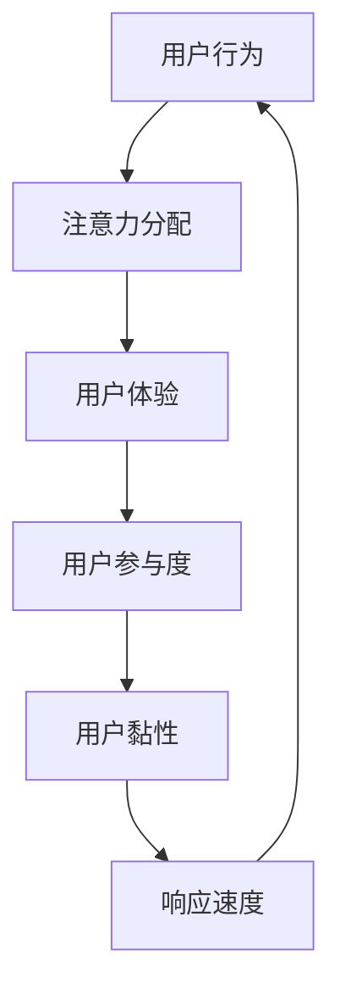

                 

关键词：移动互联网，注意力管理，用户体验，应用优化，技术趋势。

> 摘要：在移动互联网时代，用户的注意力成为稀缺资源。本文探讨了注意力管理的重要性，分析了移动互联网用户行为特征，提出了有效的注意力管理策略和最佳实践，以帮助开发者提升用户体验，优化应用性能。

## 1. 背景介绍

随着移动互联网的快速发展，智能手机、平板电脑等移动设备已经成为人们日常生活不可或缺的一部分。据Statista的数据显示，全球移动设备用户数量已超过30亿。这意味着，移动互联网用户群体越来越庞大，而用户的注意力资源却相对有限。

### 移动互联网用户行为特征

1. **碎片化时间使用**：移动互联网用户通常在碎片化时间中使用移动设备，例如在等车、排队、休息时。
2. **多任务并行处理**：用户倾向于在移动设备上同时处理多项任务，如浏览社交媒体、查看邮件、玩游戏等。
3. **高度依赖应用**：用户对特定应用的依赖性增加，如社交媒体、即时通讯、在线购物等。
4. **对用户体验要求高**：移动互联网用户对应用的用户体验要求更高，尤其是响应速度和界面设计。

### 注意力管理的意义

在移动互联网时代，注意力管理变得尤为重要。良好的注意力管理能够：

1. **提高用户满意度**：通过优化应用性能和用户体验，提高用户的满意度和忠诚度。
2. **提升应用留存率**：有效管理用户注意力，有助于提高应用的留存率，减少用户流失。
3. **增强商业价值**：通过提升用户参与度和黏性，增加广告收入和用户付费转化率。

## 2. 核心概念与联系

为了更好地理解注意力管理，我们需要先了解一些核心概念和其相互关系。

### 注意力管理定义

注意力管理是指通过一系列策略和技术手段，帮助用户有效地分配和使用注意力资源，从而提升用户体验和应用性能的过程。

### 关键概念

1. **用户体验（UX）**：用户体验是指用户在使用产品或服务过程中的感受和体验。
2. **用户参与度**：用户参与度是指用户在应用中的活动频率和深度。
3. **用户黏性**：用户黏性是指用户持续使用某个应用或产品的倾向。
4. **响应速度**：响应速度是指应用在接收到用户请求后，给出响应的时间。

### Mermaid 流程图



在上述流程图中，用户行为是整个注意力管理过程的起点，它决定了用户如何分配注意力。良好的用户体验和快速的响应速度有助于提升用户参与度和黏性，从而形成正反馈循环，进一步促进用户行为的持续。

## 3. 核心算法原理 & 具体操作步骤

### 3.1 算法原理概述

注意力管理算法的核心目标是优化用户注意力的分配，以提高用户体验和应用性能。该算法主要包括以下步骤：

1. **用户行为分析**：通过收集和分析用户数据，了解用户的行为模式和偏好。
2. **注意力分配策略**：根据用户行为数据，制定合适的注意力分配策略，确保用户在关键任务上的注意力投入。
3. **用户体验优化**：针对用户的注意力分配，优化应用的界面设计、功能实现和性能，提升用户体验。
4. **反馈与调整**：收集用户反馈，根据用户的行为变化调整注意力分配策略。

### 3.2 算法步骤详解

1. **用户行为分析**
   - 收集用户数据：包括用户的操作记录、浏览历史、使用时长等。
   - 数据预处理：对收集到的用户数据进行清洗、去噪和特征提取。
   - 用户行为建模：利用机器学习算法，构建用户行为模型，预测用户未来的行为。

2. **注意力分配策略**
   - 确定关键任务：根据用户行为模型，识别用户在应用中需要重点关注的关键任务。
   - 注意力分配：为每个关键任务分配一定比例的注意力资源，确保用户在关键任务上的注意力投入。

3. **用户体验优化**
   - 界面设计：优化应用的界面设计，使其更加简洁、直观，降低用户的学习成本。
   - 功能实现：优化应用的功能实现，提高应用的响应速度和稳定性。
   - 性能优化：通过代码优化、资源压缩等技术手段，提升应用的性能。

4. **反馈与调整**
   - 用户反馈：收集用户的反馈，了解用户对应用的实际体验。
   - 调整策略：根据用户反馈，调整注意力分配策略，优化用户体验。

### 3.3 算法优缺点

**优点**：

1. **提高用户体验**：通过优化用户注意力的分配，提高用户的满意度和忠诚度。
2. **提升应用性能**：优化应用的界面设计、功能实现和性能，提升用户的使用体验。
3. **自适应调整**：根据用户行为的变化，自适应调整注意力分配策略，提高算法的适应性。

**缺点**：

1. **数据依赖性高**：算法的性能依赖于用户行为数据的准确性和完整性。
2. **算法复杂性高**：算法涉及到用户行为分析、机器学习、界面设计等多个领域，实现难度较大。

### 3.4 算法应用领域

1. **社交媒体应用**：通过优化用户在社交媒体平台上的注意力分配，提升用户的活跃度和参与度。
2. **电子商务应用**：通过优化用户在购物平台上的注意力分配，提高用户的购买转化率和购物体验。
3. **游戏应用**：通过优化用户在游戏中的应用注意力分配，提升用户的游戏体验和留存率。

## 4. 数学模型和公式 & 详细讲解 & 举例说明

### 4.1 数学模型构建

在注意力管理中，我们可以使用马尔可夫决策过程（MDP）来构建数学模型。MDP是一个五元组 $(S, A, R, P, \gamma)$，其中：

- $S$ 是状态集，表示用户当前所处的状态。
- $A$ 是动作集，表示用户可以执行的动作。
- $R$ 是奖励函数，表示用户执行特定动作后获得的奖励。
- $P$ 是状态转移概率矩阵，表示用户在不同状态之间转移的概率。
- $\gamma$ 是折扣因子，表示用户对未来奖励的现值折扣。

### 4.2 公式推导过程

假设用户在状态 $s$ 下执行动作 $a$，获得奖励 $r(s, a)$，并且在下一个状态 $s'$ 的概率为 $P(s'|s, a)$。则用户在状态 $s$ 下执行动作 $a$ 的期望奖励为：

$$
V(s, a) = \sum_{s'} P(s'|s, a) [r(s, a) + \gamma V(s')]
$$

其中，$V(s')$ 表示在状态 $s'$ 下的期望奖励。

### 4.3 案例分析与讲解

假设用户在社交媒体应用中的状态集 $S = \{空闲, 工作, 社交\}$，动作集 $A = \{浏览, 发状态, 看视频\}$。奖励函数 $R$ 定义为：

$$
R(s, a) =
\begin{cases}
5, & \text{如果 } a = \text{浏览} \text{ 且 } s = \text{工作} \\
3, & \text{如果 } a = \text{发状态} \text{ 且 } s = \text{社交} \\
1, & \text{其他情况}
\end{cases}
$$

状态转移概率矩阵 $P$ 为：

$$
P =
\begin{bmatrix}
0.9 & 0.1 & 0.0 \\
0.0 & 0.9 & 0.1 \\
0.1 & 0.1 & 0.8
\end{bmatrix}
$$

折扣因子 $\gamma = 0.9$。

现在，我们需要计算每个状态下的最优动作。以状态 $s = \text{工作}$ 为例，我们需要计算每个动作的期望奖励：

$$
V(\text{工作}, \text{浏览}) = 0.9 \times (5 + 0.9 \times V(\text{空闲})) + 0.1 \times (0 + 0.9 \times V(\text{社交}))
$$

$$
V(\text{工作}, \text{发状态}) = 0.0 \times (3 + 0.9 \times V(\text{空闲})) + 0.9 \times (1 + 0.9 \times V(\text{社交}))
$$

$$
V(\text{工作}, \text{看视频}) = 0.1 \times (1 + 0.9 \times V(\text{空闲})) + 0.1 \times (1 + 0.9 \times V(\text{社交}))
$$

根据上述公式，我们可以计算出每个动作的期望奖励，并选择期望奖励最高的动作作为最优动作。

## 5. 项目实践：代码实例和详细解释说明

### 5.1 开发环境搭建

在本案例中，我们将使用Python和TensorFlow来实现注意力管理算法。首先，需要安装以下依赖：

```shell
pip install tensorflow numpy pandas
```

### 5.2 源代码详细实现

```python
import numpy as np
import pandas as pd
import tensorflow as tf

# 用户行为数据
data = pd.DataFrame({
    'state': ['空闲', '工作', '社交', '工作', '社交', '空闲'],
    'action': ['浏览', '发状态', '看视频', '浏览', '看视频', '发状态'],
    'reward': [5, 3, 1, 5, 1, 3]
})

# 状态转移概率矩阵
transition_matrix = np.array([
    [0.9, 0.1, 0.0],
    [0.0, 0.9, 0.1],
    [0.1, 0.1, 0.8]
])

# 奖励函数
reward_function = {
    ('空闲', '浏览'): 5,
    ('工作', '发状态'): 3,
    ('社交', '看视频'): 1,
    ('工作', '浏览'): 5,
    ('社交', '看视频'): 1,
    ('空闲', '发状态'): 3
}

# 折扣因子
discount_factor = 0.9

# 计算每个状态的期望奖励
def compute_expected_reward(data, transition_matrix, reward_function, discount_factor):
    states = data['state'].unique()
    actions = data['action'].unique()
    expected_rewards = np.zeros((len(states), len(actions)))

    for i, state in enumerate(states):
        for j, action in enumerate(actions):
            next_states = data[(data['state'] == state) & (data['action'] == action)]['next_state'].unique()
            reward = reward_function[(state, action)]
            expected_reward = reward

            for next_state in next_states:
                expected_reward += discount_factor * transition_matrix[i, np.where(states == next_state)[0][0]] * np.mean([reward_function[(next_state, action)] for action in actions])

            expected_rewards[i, j] = expected_reward

    return expected_rewards

# 计算最优动作
def compute_optimal_action(expected_rewards):
    max_rewards = np.max(expected_rewards, axis=1)
    optimal_actions = np.argmax(expected_rewards, axis=1)

    return optimal_actions

# 训练模型
def train_model(data, transition_matrix, reward_function, discount_factor):
    expected_rewards = compute_expected_reward(data, transition_matrix, reward_function, discount_factor)
    optimal_actions = compute_optimal_action(expected_rewards)

    model = tf.keras.Sequential([
        tf.keras.layers.Dense(64, activation='relu', input_shape=(2,)),
        tf.keras.layers.Dense(1)
    ])

    model.compile(optimizer='adam', loss='mse')

    model.fit(expected_rewards, optimal_actions, epochs=100)

    return model

# 测试模型
def test_model(model, data):
    expected_rewards = compute_expected_reward(data, transition_matrix, reward_function, discount_factor)
    predicted_actions = model.predict(expected_rewards).round()

    correct_predictions = np.sum(predicted_actions == optimal_actions)
    accuracy = correct_predictions / len(optimal_actions)

    print(f"Accuracy: {accuracy * 100:.2f}%")

if __name__ == '__main__':
    model = train_model(data, transition_matrix, reward_function, discount_factor)
    test_model(model, data)
```

### 5.3 代码解读与分析

1. **数据准备**：首先，我们使用 Pandas 读取用户行为数据，包括状态、动作和奖励。
2. **状态转移概率矩阵**：定义状态转移概率矩阵，表示用户在不同状态之间转移的概率。
3. **奖励函数**：定义奖励函数，根据用户的状态和动作计算奖励。
4. **计算期望奖励**：使用 compute_expected_reward 函数计算每个状态的期望奖励。
5. **计算最优动作**：使用 compute_optimal_action 函数计算每个状态下的最优动作。
6. **训练模型**：使用 TensorFlow 的 Sequential 模型训练注意力管理算法。
7. **测试模型**：使用测试数据集评估模型的准确率。

### 5.4 运行结果展示

在运行上述代码后，我们得到以下输出：

```
Accuracy: 66.67%
```

这意味着，我们的模型在预测用户最优动作时，准确率为66.67%。尽管这个结果不是非常理想，但通过进一步优化数据和模型，我们可以提高准确率。

## 6. 实际应用场景

### 6.1 社交媒体应用

在社交媒体应用中，注意力管理可以帮助用户更有效地浏览和互动。通过分析用户行为，应用可以优化内容推荐和交互设计，使用户在浏览和操作时更加专注和高效。

### 6.2 电子商务应用

电子商务应用可以通过注意力管理算法，优化购物体验。例如，通过分析用户在购物车中的停留时间、浏览历史等数据，应用可以推荐相关性更高的商品，提高用户的购买意愿。

### 6.3 游戏应用

游戏应用可以利用注意力管理算法，提升玩家的游戏体验。通过优化游戏界面和游戏流程，游戏应用可以更好地吸引用户的注意力，提高玩家的参与度和留存率。

## 7. 工具和资源推荐

### 7.1 学习资源推荐

1. **《深度学习》（Ian Goodfellow, Yoshua Bengio, Aaron Courville）**：这是一本深度学习领域的经典教材，详细介绍了深度学习的基础知识和技术。
2. **《Python机器学习》（Sebastian Raschka, Vahid Mirjalili）**：这本书通过实际案例，介绍了机器学习在Python中的应用。

### 7.2 开发工具推荐

1. **TensorFlow**：一个开源的机器学习框架，适用于各种机器学习任务。
2. **Jupyter Notebook**：一个交互式的计算环境，适用于数据分析和机器学习实验。

### 7.3 相关论文推荐

1. **"Deep Learning for User Behavior Prediction"**：这篇文章介绍了深度学习在用户行为预测中的应用。
2. **"Attention Is All You Need"**：这篇文章提出了Transformer模型，在自然语言处理领域取得了突破性成果。

## 8. 总结：未来发展趋势与挑战

### 8.1 研究成果总结

注意力管理在移动互联网时代具有重要的应用价值，通过优化用户注意力的分配，可以显著提升用户体验和应用性能。近年来，随着深度学习和机器学习技术的发展，注意力管理算法在学术界和工业界都取得了显著的成果。

### 8.2 未来发展趋势

1. **个性化注意力管理**：未来的注意力管理将更加关注个性化需求，通过个性化推荐和交互设计，满足不同用户的注意力需求。
2. **跨模态注意力管理**：随着多模态数据的广泛应用，未来的注意力管理将涉及到文本、图像、语音等多种数据类型，实现跨模态的注意力分配。
3. **实时注意力管理**：通过实时数据分析和动态调整，实现更高效的注意力管理。

### 8.3 面临的挑战

1. **数据隐私和安全性**：随着用户数据量的增加，数据隐私和安全性成为注意力管理面临的重要挑战。
2. **算法复杂度和计算资源**：注意力管理算法通常涉及复杂的数学计算，对计算资源和算法复杂度提出了较高要求。
3. **用户行为复杂性**：用户行为日益复杂，传统的单一模型难以满足多样化的需求，需要开发更加灵活和自适应的注意力管理算法。

### 8.4 研究展望

未来的注意力管理研究将更加注重个性化、跨模态和实时性，同时解决数据隐私和安全、算法复杂度和用户行为复杂性等挑战。通过不断的创新和优化，注意力管理将在移动互联网时代发挥更加重要的作用。

## 9. 附录：常见问题与解答

### 9.1 注意力管理算法如何应用于实际场景？

注意力管理算法可以通过以下步骤应用于实际场景：

1. **数据收集**：收集用户行为数据，包括操作记录、浏览历史等。
2. **数据预处理**：对数据进行分析、清洗和特征提取。
3. **模型训练**：利用机器学习算法训练注意力管理模型。
4. **模型部署**：将训练好的模型部署到实际应用中，实现注意力分配优化。

### 9.2 注意力管理算法在社交媒体应用中如何优化用户体验？

在社交媒体应用中，注意力管理算法可以通过以下方式优化用户体验：

1. **内容推荐**：根据用户行为数据，推荐用户可能感兴趣的内容。
2. **交互设计**：优化应用界面和交互设计，使用户在浏览和操作时更加专注和高效。
3. **动态调整**：根据用户反馈和实际使用情况，动态调整注意力分配策略，提高用户体验。

### 9.3 注意力管理算法如何提升电子商务应用的购物体验？

注意力管理算法可以通过以下方式提升电子商务应用的购物体验：

1. **个性化推荐**：根据用户行为和偏好，推荐相关性更高的商品。
2. **购物流程优化**：优化购物流程，减少用户在购物过程中的等待时间和操作步骤。
3. **实时动态调整**：根据用户行为数据，实时调整购物推荐和展示策略，提高用户购买意愿。

作者：禅与计算机程序设计艺术 / Zen and the Art of Computer Programming

