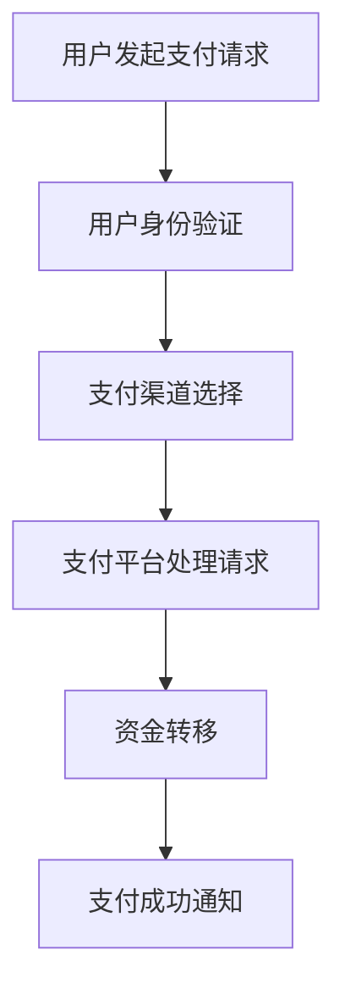

                 

关键词：移动支付、注意力经济、数字经济、金融科技、用户行为分析、商业模式创新

> 摘要：本文将探讨移动支付技术如何通过重塑用户行为和商业模式，深刻影响并改变了注意力经济的格局。文章首先回顾了移动支付的起源和发展，然后详细解析了其核心原理和关键环节，随后探讨了移动支付对注意力经济产生的实际影响，最后对未来的发展路径和潜在挑战进行了展望。

## 1. 背景介绍

移动支付作为金融科技领域的一项重要创新，自20世纪90年代末期开始逐渐兴起。早期的移动支付主要是通过短信和 USSD（Unstructured Supplementary Service Data）等方式进行，这类支付方式的便利性和安全性相对有限。然而，随着智能手机的普及和移动互联网技术的发展，移动支付迅速成为了人们日常生活的重要组成部分。

注意力经济是一个相对较新的概念，源于对用户注意力资源的重视。在传统经济模式中，产品和服务主要通过价格和品质来竞争，而注意力经济则强调通过吸引和保持用户的注意力来创造价值。随着移动互联网的发展，用户的时间更加碎片化，如何获取和维持用户的注意力成为企业竞争的关键。

移动支付与注意力经济的结合，主要体现在以下几个方面：首先，移动支付提供了便捷的支付手段，改变了用户的消费习惯，使得用户在享受服务的过程中更容易被吸引和保持注意力。其次，移动支付平台积累了大量用户数据，为数据分析提供了丰富的素材，这些数据可以用于精准营销和个性化服务，从而提升用户的注意力投入。最后，移动支付平台通过激励机制，如积分、优惠券等，进一步增强了用户的参与度和忠诚度。

## 2. 核心概念与联系

### 2.1 移动支付的定义与原理

移动支付是指通过手机或其他移动设备进行货币交易的一种支付方式。其核心原理包括以下几个方面：

- **用户身份验证**：用户通过密码、指纹、面部识别等方式验证身份，确保交易的安全性。
- **支付渠道**：包括银行账户、第三方支付平台（如支付宝、微信支付）以及其他支付工具。
- **支付流程**：从用户发起支付请求，到支付平台处理请求，再到资金最终到达收款方账户的一系列操作。

### 2.2 注意力经济的概念与原理

注意力经济是基于用户注意力资源的一种新型经济模式。其核心原理包括：

- **注意力资源**：用户的注意力是有限的，如何吸引和保持用户的注意力成为企业竞争的关键。
- **内容创作**：优质的内容创作能够吸引更多用户，从而增加注意力资源的价值。
- **用户参与**：通过互动和参与，增强用户的注意力投入，提升用户粘性。

### 2.3 移动支付与注意力经济的关联

移动支付与注意力经济的关联主要体现在以下几个方面：

- **支付便捷性**：移动支付的便捷性使得用户在享受服务的过程中更容易被吸引和保持注意力。
- **数据积累**：移动支付平台积累了大量用户数据，为数据分析提供了丰富的素材，这些数据可以用于精准营销和个性化服务。
- **激励机制**：移动支付平台通过积分、优惠券等激励机制，增强用户的参与度和忠诚度。

### 2.4 Mermaid 流程图



## 3. 核心算法原理 & 具体操作步骤

### 3.1 算法原理概述

移动支付的核心算法主要涉及用户身份验证和支付渠道选择。用户身份验证通常采用密码、指纹、面部识别等技术，确保交易的安全性。支付渠道选择则包括银行账户、第三方支付平台和其他支付工具。

### 3.2 算法步骤详解

1. **用户发起支付请求**：用户通过移动设备发起支付请求，请求中包含支付金额、收款人信息等。
2. **用户身份验证**：用户通过密码、指纹、面部识别等方式进行身份验证，确保交易的安全性。
3. **支付渠道选择**：用户在移动支付平台上选择支付渠道，如银行账户、第三方支付平台等。
4. **支付平台处理请求**：支付平台接收用户请求，进行风险控制和支付处理。
5. **资金转移**：支付平台将资金从用户账户转移到收款人账户。
6. **支付成功通知**：支付平台向用户发送支付成功通知。

### 3.3 算法优缺点

**优点**：

- **便捷性**：移动支付提供了便捷的支付手段，大大简化了支付流程。
- **安全性**：用户身份验证技术确保了交易的安全性。
- **个性化**：支付平台可以根据用户数据提供个性化服务，提升用户满意度。

**缺点**：

- **依赖网络**：移动支付依赖于网络环境，网络不稳定可能导致支付失败。
- **隐私风险**：用户数据的安全性和隐私保护仍是一个挑战。

### 3.4 算法应用领域

移动支付算法广泛应用于电子商务、在线购物、餐饮服务、公共交通等多个领域。例如，在电子商务领域，移动支付为消费者提供了便捷的支付方式，提高了购物体验；在公共交通领域，移动支付使得用户可以更加方便地进行乘车支付。

## 4. 数学模型和公式 & 详细讲解 & 举例说明

### 4.1 数学模型构建

移动支付过程中涉及多个数学模型，包括概率模型、线性规划模型等。以下是一个简单的概率模型示例：

假设用户A进行移动支付，选择支付渠道的概率为P1，P2，...，Pn，其中每个概率表示用户选择对应支付渠道的概率。支付成功的概率为Q1，Q2，...，Qn，其中每个概率表示选择对应支付渠道后支付成功的概率。

### 4.2 公式推导过程

支付成功的概率可以表示为：

$$ P_{success} = \sum_{i=1}^{n} P_i \cdot Q_i $$

其中，$P_i$为选择第i个支付渠道的概率，$Q_i$为选择第i个支付渠道后支付成功的概率。

### 4.3 案例分析与讲解

假设用户A进行移动支付，有三种支付渠道可供选择：银行账户、支付宝、微信支付。用户选择银行账户、支付宝和微信支付的概率分别为0.3、0.4、0.3。同时，选择银行账户、支付宝和微信支付后支付成功的概率分别为0.95、0.98、0.97。

根据上述公式，可以计算出支付成功的概率：

$$ P_{success} = 0.3 \cdot 0.95 + 0.4 \cdot 0.98 + 0.3 \cdot 0.97 = 0.961 $$

这意味着用户A进行移动支付的成功概率为96.1%。

## 5. 项目实践：代码实例和详细解释说明

### 5.1 开发环境搭建

在本项目中，我们使用Python作为开发语言，利用Flask框架搭建一个简单的移动支付系统。以下是开发环境的搭建步骤：

1. 安装Python：版本要求为3.6及以上。
2. 安装Flask：使用pip命令安装`pip install flask`。
3. 安装依赖库：根据项目需求安装其他依赖库，如`requests`、`pymysql`等。

### 5.2 源代码详细实现

以下是移动支付系统的源代码实现：

```python
from flask import Flask, request, jsonify
import pymysql

app = Flask(__name__)

# 数据库连接配置
config = {
    'host': 'localhost',
    'user': 'root',
    'password': 'password',
    'db': 'mobile_payment'
}

# 连接数据库
def connect_db():
    connection = pymysql.connect(**config)
    return connection

# 用户身份验证
@app.route('/auth', methods=['POST'])
def auth():
    data = request.get_json()
    user_id = data['user_id']
    password = data['password']
    
    # 查询用户信息
    connection = connect_db()
    cursor = connection.cursor()
    cursor.execute("SELECT * FROM users WHERE user_id = %s AND password = %s", (user_id, password))
    user = cursor.fetchone()
    cursor.close()
    connection.close()
    
    if user:
        return jsonify({'status': 'success', 'user_id': user[0]})
    else:
        return jsonify({'status': 'failure', 'error': 'invalid credentials'})

# 支付请求处理
@app.route('/pay', methods=['POST'])
def pay():
    data = request.get_json()
    user_id = data['user_id']
    amount = data['amount']
    payment_channel = data['payment_channel']
    
    # 处理支付请求
    connection = connect_db()
    cursor = connection.cursor()
    cursor.execute("UPDATE users SET balance = balance - %s WHERE user_id = %s", (amount, user_id))
    cursor.execute("INSERT INTO payments (user_id, amount, payment_channel) VALUES (%s, %s, %s)", (user_id, amount, payment_channel))
    connection.commit()
    cursor.close()
    connection.close()
    
    return jsonify({'status': 'success', 'message': 'payment processed'})

if __name__ == '__main__':
    app.run()
```

### 5.3 代码解读与分析

该移动支付系统分为两部分：用户身份验证和支付请求处理。

- **用户身份验证**：用户通过发送用户ID和密码进行身份验证。系统查询用户信息，如果用户存在且密码正确，则返回成功状态。
- **支付请求处理**：用户发送支付请求，包含用户ID、支付金额和支付渠道。系统扣除用户余额并记录支付信息。

### 5.4 运行结果展示

运行该系统后，用户可以通过API进行身份验证和支付请求。以下是一个简单的示例：

```shell
# 身份验证
$ curl -X POST -H "Content-Type: application/json" -d '{"user_id": "user123", "password": "password123"}' http://localhost:5000/auth
{"status":"success","user_id":"user123"}

# 支付请求
$ curl -X POST -H "Content-Type: application/json" -d '{"user_id": "user123", "amount": 100, "payment_channel": "alipay"}' http://localhost:5000/pay
{"status":"success","message":"payment processed"}
```

## 6. 实际应用场景

移动支付技术在实际应用中展现出极大的灵活性和便捷性，为各种场景下的支付提供了强有力的支持。以下是一些典型的应用场景：

### 6.1 电子商务

电子商务是移动支付最常见应用场景之一。用户通过移动设备在线购物，使用移动支付完成支付过程，从而享受便捷的购物体验。例如，淘宝、京东等电商平台都提供了移动支付功能，用户可以通过微信支付、支付宝等完成支付。

### 6.2 餐饮服务

在餐饮服务领域，移动支付同样得到了广泛应用。用户可以通过手机点餐，使用移动支付完成支付，避免了排队结账的繁琐过程。例如，美团、饿了么等外卖平台都提供了移动支付功能，用户可以方便地完成支付。

### 6.3 公共交通

公共交通领域是移动支付的重要应用场景之一。用户可以通过手机扫码乘坐公共交通工具，实现无现金支付。例如，北京、上海等城市的公共交通系统都实现了移动支付功能，用户可以通过微信支付、支付宝等完成支付。

### 6.4 零售门店

在零售门店中，移动支付技术同样具有重要意义。用户可以通过手机扫码完成支付，提高了结账效率。例如，很多超市和便利店都采用了移动支付技术，用户可以通过支付宝、微信支付等完成支付。

### 6.5 在线教育

在线教育领域也广泛应用了移动支付技术。用户可以通过手机完成课程购买和学习，提高了学习效率。例如，网易云课堂、腾讯课堂等在线教育平台都提供了移动支付功能，用户可以方便地完成课程购买。

## 7. 未来应用展望

随着移动支付技术的不断发展和完善，未来其在各个领域中的应用将更加广泛和深入。以下是一些未来应用展望：

### 7.1 智能家居

智能家居领域是移动支付技术的重要发展方向之一。用户可以通过手机远程控制家居设备，实现智能化的生活方式。例如，智能灯光、智能门锁等设备可以通过移动支付进行购买和设置，从而提高生活便利性。

### 7.2 物联网

物联网（IoT）是移动支付技术的重要应用领域。随着物联网设备的普及，移动支付可以用于各种物联网设备的支付和管理。例如，智能家居设备、智能交通设备等都可以通过移动支付进行购买和费用结算。

### 7.3 健康医疗

健康医疗领域同样具有巨大的应用潜力。移动支付可以用于医疗费用支付、药品购买、健康数据管理等。例如，用户可以通过移动支付完成医院挂号、缴费等操作，提高了就医效率。

### 7.4 区块链

区块链技术与移动支付的结合将带来新的应用场景和商业模式。通过区块链技术，移动支付可以实现去中心化、透明化的支付过程，提高支付安全性和效率。例如，跨境支付、数字货币交易等都可以通过区块链技术实现。

## 8. 工具和资源推荐

### 8.1 学习资源推荐

1. **《移动支付与互联网金融》**：全面介绍了移动支付的技术原理、应用场景和发展趋势。
2. **《注意力经济：注意力资源的价值创造》**：深入探讨了注意力经济的概念、原理和应用。

### 8.2 开发工具推荐

1. **Python**：作为一种通用编程语言，Python在移动支付开发中具有广泛的应用。
2. **Flask**：Flask是一个轻量级的Web框架，适用于移动支付系统的开发。

### 8.3 相关论文推荐

1. **"Mobile Payment Systems: Technology, Security, and Privacy Issues"**：探讨了移动支付技术的安全性、隐私保护等问题。
2. **"Attention Economics: Rethinking the Economics of User Attention"**：深入分析了注意力经济的本质和商业应用。

## 9. 总结：未来发展趋势与挑战

移动支付作为金融科技领域的一项重要创新，已经深刻改变了人们的支付习惯和商业模式。在未来，移动支付将继续发展，并面临一系列新的机遇和挑战。

### 9.1 研究成果总结

1. 移动支付技术不断成熟，为用户提供更加便捷、安全的支付体验。
2. 注意力经济模式在移动支付中的应用，为商业创新提供了新的思路。
3. 移动支付平台积累了大量用户数据，为数据分析提供了丰富的素材。

### 9.2 未来发展趋势

1. **技术进步**：随着人工智能、区块链等技术的不断发展，移动支付将实现更加智能化、去中心化的支付过程。
2. **应用拓展**：移动支付将在智能家居、物联网、健康医疗等新兴领域得到广泛应用。
3. **国际化**：随着跨境支付的普及，移动支付将打破地域限制，实现全球范围内的支付便捷性。

### 9.3 面临的挑战

1. **安全性**：用户数据安全和交易安全是移动支付面临的主要挑战，需要加强技术防护和监管。
2. **隐私保护**：用户隐私保护是移动支付平台需要关注的重要问题，需要制定更加严格的隐私政策。
3. **监管合规**：随着移动支付的快速发展，相关监管政策也将逐步完善，移动支付平台需要遵守相关法规。

### 9.4 研究展望

未来，移动支付领域将继续朝着智能化、去中心化的方向发展。同时，随着新技术、新应用的不断涌现，移动支付将不断拓展其应用场景，为人们的生活带来更多便利。在此过程中，如何保障用户数据安全和隐私保护，将是移动支付领域需要持续关注的重要课题。

## 10. 附录：常见问题与解答

### 10.1 什么是移动支付？

移动支付是指通过手机或其他移动设备进行货币交易的一种支付方式。它可以通过短信、USSD、NFC、二维码等方式实现，无需使用现金或银行卡。

### 10.2 移动支付有哪些优点？

移动支付具有以下优点：

1. **便捷性**：用户可以随时随地进行支付，无需携带现金或银行卡。
2. **安全性**：采用加密技术和身份验证，确保交易安全。
3. **个性化**：通过用户数据分析，提供个性化服务，提升用户体验。
4. **效率高**：支付过程快速，减少排队等候时间。

### 10.3 移动支付有哪些缺点？

移动支付也存在一些缺点：

1. **依赖网络**：需要稳定的网络环境，网络不稳定可能导致支付失败。
2. **隐私风险**：用户数据的安全性和隐私保护仍是一个挑战。
3. **普及程度**：在某些地区，移动支付尚未普及，用户需要一定的适应过程。

### 10.4 移动支付的安全性如何保障？

移动支付的安全性通过以下措施进行保障：

1. **加密技术**：使用加密算法确保交易数据的安全。
2. **身份验证**：采用密码、指纹、面部识别等方式进行身份验证。
3. **风险控制**：通过监控交易行为，及时发现并阻止异常交易。

### 10.5 移动支付的未来发展方向是什么？

移动支付的未来发展方向包括：

1. **技术进步**：随着人工智能、区块链等技术的发展，移动支付将实现更加智能化、去中心化的支付过程。
2. **应用拓展**：移动支付将在智能家居、物联网、健康医疗等新兴领域得到广泛应用。
3. **国际化**：随着跨境支付的普及，移动支付将打破地域限制，实现全球范围内的支付便捷性。

