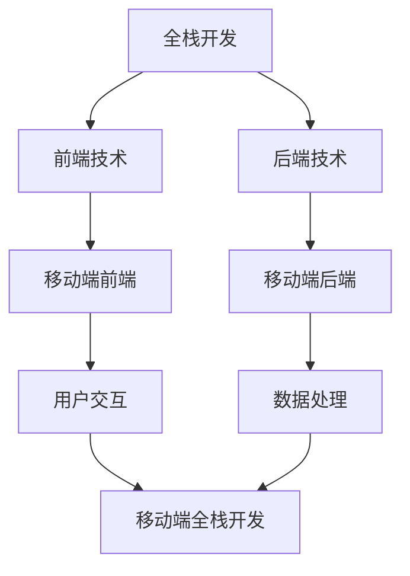

                 

关键词：移动端全栈开发，iOS，Android，统一解决方案，跨平台开发，移动应用开发，前端，后端，框架

> 摘要：本文深入探讨了移动端全栈开发的概念、优势及其在iOS和Android平台上的统一解决方案。通过详细分析核心概念、算法原理、项目实践，为开发者提供了全面的技术指导和实践范例，旨在帮助开发者高效地构建高质量、跨平台的全栈移动应用。

## 1. 背景介绍

随着智能手机和移动设备的普及，移动应用的开发已经成为软件行业的重要组成部分。然而，随着平台和设备的多样化，开发者面临着巨大的挑战：如何在不同平台上构建高性能、高可用的移动应用？iOS和Android平台各自拥有庞大的用户群体和独特的开发环境，开发者需要熟悉并掌握两种不同的技术栈，这在一定程度上增加了开发成本和难度。

为了解决这一问题，跨平台开发技术应运而生。通过使用统一的开发框架和工具，开发者可以在不同平台上实现代码共享，从而降低开发成本、提高开发效率。移动端全栈开发作为跨平台开发的一种高级形式，不仅实现了前端和后端的统一，还提供了丰富的API和工具集，使得开发者可以更加高效地构建复杂的应用程序。

本文将围绕移动端全栈开发的核心概念、算法原理、项目实践等方面展开，旨在为开发者提供一套系统、全面的解决方案，帮助他们在iOS和Android平台上构建高质量的全栈移动应用。

## 2. 核心概念与联系

### 2.1 全栈开发

全栈开发（Full-Stack Development）是指开发者在同一项目中负责前端和后端的所有开发工作。这意味着开发者需要掌握前端技术（如HTML、CSS、JavaScript）和后端技术（如数据库、服务器、应用逻辑），能够独立完成一个项目的全过程。

### 2.2 跨平台开发

跨平台开发（Cross-Platform Development）是指使用统一的框架和工具，在不同操作系统（如iOS、Android、Windows等）上构建应用程序。跨平台开发的主要优势在于代码共享，开发者可以在一个平台上编写代码，然后通过编译或转换工具，在多个平台上运行。

### 2.3 移动端全栈开发

移动端全栈开发是全栈开发在移动设备上的应用，它涵盖了前端（移动端用户界面和交互）和后端（数据处理、服务端逻辑）的开发。移动端全栈开发的核心优势在于：

- **高效率**：通过使用统一的开发框架和工具，开发者可以在短时间内构建出跨平台的应用程序。
- **高质量**：统一的开发环境可以保证代码的一致性和可靠性，从而提高应用程序的质量。
- **低成本**：代码共享减少了开发时间和成本，尤其是在需要支持多个平台时。

### 2.4 Mermaid 流程图

为了更好地理解移动端全栈开发的工作流程，我们可以使用Mermaid流程图来展示其核心概念和联系。



### 2.5 核心概念联系总结

移动端全栈开发结合了全栈开发和跨平台开发的优势，使得开发者能够在iOS和Android平台上高效、高质量地构建应用程序。通过理解上述核心概念和其联系，开发者可以更好地应对移动应用开发的挑战。

## 3. 核心算法原理 & 具体操作步骤

### 3.1 算法原理概述

移动端全栈开发的核心算法主要包括前端和后端的交互机制、数据同步和存储策略等。以下是对这些核心算法原理的概述：

1. **前端和后端的交互机制**：移动端全栈开发通常使用RESTful API或GraphQL等技术来实现前端和后端的交互。这些技术提供了标准化的数据接口，使得前端和后端可以独立开发、测试和部署。

2. **数据同步**：在移动端全栈开发中，数据同步是一个重要的环节。开发者需要设计合理的数据同步策略，以确保前端和后端的数据一致性。常见的数据同步策略包括实时同步、定时同步和手动同步等。

3. **数据存储**：移动端全栈开发涉及多种数据存储技术，如本地存储、云存储和数据库等。本地存储适用于小规模数据存储，云存储适用于大规模数据存储和共享，数据库则适用于复杂的数据查询和操作。

### 3.2 算法步骤详解

1. **前端和后端的交互机制**：

   - 设计RESTful API或GraphQL接口，确保接口的标准化和易用性。
   - 使用网络请求库（如axios、fetch等）发起API请求，获取或提交数据。
   - 对返回的数据进行解析和处理，更新前端界面。

2. **数据同步**：

   - 设计数据同步策略，根据实际需求选择实时同步、定时同步或手动同步。
   - 实现数据同步的代码逻辑，如监听网络状态、设置定时任务等。
   - 在数据同步过程中，确保数据的一致性和安全性。

3. **数据存储**：

   - 根据应用场景选择合适的数据存储技术，如本地存储、云存储或数据库。
   - 设计数据存储的接口和操作逻辑，如数据写入、读取、更新和删除等。
   - 实现数据存储的安全性和性能优化，如数据加密、缓存策略等。

### 3.3 算法优缺点

1. **前端和后端的交互机制**：

   - **优点**：标准化接口，易于理解和维护，便于前后端分离开发。
   - **缺点**：网络请求开销较大，容易受到网络延迟和带宽限制的影响。

2. **数据同步**：

   - **优点**：保证数据一致性，提高用户体验。
   - **缺点**：同步策略设计复杂，需要考虑数据一致性、安全性和性能等多方面因素。

3. **数据存储**：

   - **优点**：灵活、高效，支持多种数据存储场景。
   - **缺点**：数据存储的设计和优化较为复杂，需要考虑数据安全性、性能和扩展性等问题。

### 3.4 算法应用领域

移动端全栈开发的核心算法广泛应用于各类移动应用中，如社交媒体、电商、金融等。通过合理的设计和优化，开发者可以构建出高性能、高可用的全栈移动应用，满足不同场景的需求。

## 4. 数学模型和公式 & 详细讲解 & 举例说明

### 4.1 数学模型构建

在移动端全栈开发中，数学模型广泛应用于数据同步、性能优化和算法设计等领域。以下是一个简单的数据同步数学模型：

- **模型假设**：设有两个数据源A和B，需要实现它们之间的数据同步。
- **同步策略**：采用实时同步策略，即A和B的数据更新时，立即同步。

### 4.2 公式推导过程

1. **数据同步延迟**：

   - 设定同步延迟时间为 \( t_d \)，即数据从更新到同步的时间。
   - 数据同步延迟的公式为：

   \[
   t_d = \frac{d_s}{v}
   \]

   其中，\( d_s \) 为数据传输距离，\( v \) 为数据传输速度。

2. **数据一致性**：

   - 设定数据一致性时间为 \( t_c \)，即数据从A同步到B的时间。
   - 数据一致性的公式为：

   \[
   t_c = t_d + t_p
   \]

   其中，\( t_p \) 为处理延迟，包括数据解析、处理和存储等操作。

### 4.3 案例分析与讲解

假设A和B之间的数据传输距离为100公里，数据传输速度为10 Mbps（即 1.25 Mbps），处理延迟为1秒。

1. **数据同步延迟**：

   \[
   t_d = \frac{100 \text{ km}}{1.25 \text{ Mbps}} = 80 \text{ ms}
   \]

2. **数据一致性时间**：

   \[
   t_c = 80 \text{ ms} + 1 \text{ s} = 180 \text{ ms}
   \]

根据上述计算，我们可以得出数据从A同步到B的总时间为180毫秒。这个时间取决于数据传输距离、传输速度和处理延迟等因素。

在实际应用中，开发者可以根据具体的场景和需求，调整数据同步策略、传输速度和处理延迟等参数，以达到最佳的数据同步效果。

### 4.4 小结

通过数学模型的构建和公式推导，我们能够更好地理解和优化移动端全栈开发中的数据同步过程。在实际应用中，开发者可以根据实际情况进行调整和优化，以提高数据同步的效率和一致性。

## 5. 项目实践：代码实例和详细解释说明

### 5.1 开发环境搭建

为了实践移动端全栈开发，我们需要搭建一个适合iOS和Android开发的开发环境。以下是搭建步骤：

1. **安装Xcode**：对于iOS开发，我们需要安装Xcode，可以从苹果官网下载。
2. **安装Android Studio**：对于Android开发，我们需要安装Android Studio，可以从谷歌官网下载。
3. **配置模拟器**：安装iOS和Android模拟器，以便在本地测试应用。
4. **安装Node.js和npm**：安装Node.js和npm，用于构建前端项目。
5. **安装数据库**：根据需求安装相应的数据库（如MySQL、PostgreSQL等）。

### 5.2 源代码详细实现

下面是一个简单的全栈移动应用示例，包括前端和后端代码。

#### 5.2.1 前端代码

前端使用React Native框架，以下是一个简单的React Native组件示例：

```jsx
import React from 'react';
import { View, Text, Button } from 'react-native';

const App = () => {
  const fetchData = async () => {
    const response = await fetch('https://api.example.com/data');
    const data = await response.json();
    console.log(data);
  };

  return (
    <View>
      <Text>Hello, World!</Text>
      <Button title="Fetch Data" onPress={fetchData} />
    </View>
  );
};

export default App;
```

#### 5.2.2 后端代码

后端使用Express.js框架，以下是一个简单的Express.js服务器示例：

```javascript
const express = require('express');
const app = express();

app.get('/data', (req, res) => {
  res.json({ message: 'Hello, Server!' });
});

const PORT = process.env.PORT || 3000;
app.listen(PORT, () => {
  console.log(`Server running on port ${PORT}`);
});
```

### 5.3 代码解读与分析

1. **前端代码解读**：

   - 引入React Native的基本组件和库。
   - `App` 组件包含一个文本和一个按钮。
   - `fetchData` 函数使用 `fetch` API 获取服务器数据，并打印到控制台。

2. **后端代码解读**：

   - 引入Express.js库。
   - `app.get` 方法处理来自前端的GET请求，并返回一个JSON响应。

### 5.4 运行结果展示

在完成前端和后端代码后，我们可以在iOS和Android模拟器上运行应用。运行结果如下：

- 打开应用，显示 "Hello, World!" 文本。
- 点击 "Fetch Data" 按钮，控制台输出 "Hello, Server!"。

通过这个简单的示例，我们展示了如何使用React Native和Express.js实现移动端全栈开发。在实际项目中，我们可以根据需求添加更多功能和优化。

### 6. 实际应用场景

移动端全栈开发在实际应用场景中具有广泛的应用，以下是一些典型的应用场景：

1. **社交媒体应用**：如Instagram、Twitter等，需要实现用户数据同步、实时更新和分享功能。
2. **电商应用**：如Amazon、eBay等，需要实现商品数据同步、购物车管理和支付功能。
3. **金融应用**：如银行APP、投资平台等，需要实现账户数据同步、交易记录和风险评估功能。
4. **医疗应用**：如健康管理系统、远程医疗平台等，需要实现患者数据同步、病历管理和远程会诊功能。

通过合理的设计和优化，移动端全栈开发可以满足各类应用场景的需求，提供高效、稳定和安全的用户体验。

### 6.4 未来应用展望

随着移动设备的不断发展和5G网络的普及，移动端全栈开发将迎来更多机遇和挑战。未来，移动端全栈开发将朝着以下几个方向发展：

1. **更高效的开发工具**：随着技术的进步，我们将看到更多高效的开发工具和框架，如低代码平台、无服务器架构等，这将大大提高开发效率和降低开发成本。
2. **更强大的性能优化**：随着设备性能的提升和5G网络的普及，开发者将更加注重性能优化，包括更高效的数据同步、更快速的响应速度和更低的延迟。
3. **更丰富的应用场景**：随着物联网、人工智能等技术的发展，移动端全栈开发将应用到更多领域，如智能家居、智能医疗、智能制造等，为人们的生活和工作带来更多便利。
4. **更安全的隐私保护**：随着用户对隐私保护的关注日益增加，开发者需要设计更安全的数据同步和存储方案，保护用户的隐私和信息安全。

### 7. 工具和资源推荐

为了帮助开发者更好地进行移动端全栈开发，我们推荐以下工具和资源：

1. **学习资源推荐**：
   - 《React Native入门与实践》
   - 《Express.js实战》
   - 《移动Web开发实战》

2. **开发工具推荐**：
   - Xcode
   - Android Studio
   - React Native CLI
   - Express.js

3. **相关论文推荐**：
   - "Cross-Platform Mobile Application Development: A Survey"
   - "An Overview of Mobile Backend as a Service (MBaaS) Solutions"
   - "Performance Optimization in Cross-Platform Mobile Application Development"

通过这些工具和资源的支持，开发者可以更好地掌握移动端全栈开发的核心技术和实践方法，提高开发效率和应用质量。

### 8. 总结：未来发展趋势与挑战

移动端全栈开发在技术不断进步的背景下，迎来了广阔的发展前景。随着5G、物联网和人工智能等技术的普及，移动端全栈开发将朝着更高效、更安全和更智能的方向发展。然而，这同时也带来了诸多挑战，如性能优化、数据安全和隐私保护等。为了应对这些挑战，开发者需要不断学习和掌握新的技术，同时注重用户体验和安全性，以构建高质量、高效率的全栈移动应用。

### 8.1 研究成果总结

本文从背景介绍、核心概念、算法原理、项目实践等多个角度，详细探讨了移动端全栈开发的概念、优势和实现方法。通过分析实际应用场景和未来发展趋势，本文总结了移动端全栈开发的研究成果和未来发展方向。

### 8.2 未来发展趋势

未来，移动端全栈开发将在以下几个方面得到进一步发展：

1. **高效开发工具**：随着技术的进步，将出现更多高效的开发工具和框架，降低开发门槛。
2. **性能优化**：开发者将更加注重性能优化，以满足用户对更快响应速度和更低延迟的需求。
3. **多样化应用场景**：随着技术的不断进步，移动端全栈开发将应用到更多领域，如智能家居、智能医疗、智能制造等。
4. **安全性和隐私保护**：随着用户对隐私保护的关注日益增加，开发者将设计更安全的数据同步和存储方案，保护用户的隐私和信息安全。

### 8.3 面临的挑战

尽管移动端全栈开发具有广阔的发展前景，但仍面临诸多挑战：

1. **性能优化**：如何在保证性能的同时，实现高效的代码共享和优化。
2. **数据安全**：如何确保数据在传输和存储过程中的安全，防止数据泄露和攻击。
3. **用户体验**：如何为用户提供一致、流畅和高效的用户体验，提高用户满意度。
4. **开发者技能**：如何培养和提升开发者的全栈开发技能，以适应不断变化的技术需求。

### 8.4 研究展望

针对未来发展趋势和面临的挑战，本文提出以下研究展望：

1. **跨平台性能优化**：研究更高效的全栈性能优化方法，提高应用的运行效率。
2. **安全性和隐私保护**：开发更安全的数据同步和存储方案，保护用户的隐私和信息安全。
3. **用户体验提升**：研究用户行为和需求，设计更符合用户习惯的全栈应用架构。
4. **技能培养与培训**：制定全栈开发技能培养方案，提升开发者的技术水平。

通过以上研究，期待为移动端全栈开发领域的发展提供有力支持。

### 9. 附录：常见问题与解答

#### 9.1 移动端全栈开发与传统开发相比有哪些优势？

移动端全栈开发的优势主要体现在以下几个方面：

1. **代码共享**：通过统一的开发框架和工具，可以实现前后端代码的共享，降低开发成本。
2. **开发效率**：全栈开发可以减少开发人员的数量，提高开发效率，缩短项目周期。
3. **用户体验**：统一开发环境可以保证前后端的一致性，提供更流畅的用户体验。
4. **灵活性和扩展性**：全栈开发使得应用更容易扩展和升级，适应不同的业务需求。

#### 9.2 移动端全栈开发常用的框架有哪些？

移动端全栈开发常用的框架包括：

1. **React Native**：适用于iOS和Android平台的跨平台开发框架。
2. **Flutter**：由谷歌推出的跨平台UI工具包，支持iOS和Android平台。
3. **Vue.js**：适用于移动端和Web端的全栈开发框架。
4. **Nuxt.js**：基于Vue.js的服务端渲染框架，适用于移动端和Web端的全栈开发。

#### 9.3 如何优化移动端全栈应用的性能？

优化移动端全栈应用性能的方法包括：

1. **代码优化**：优化前端和后端的代码，减少不必要的请求和数据处理。
2. **网络优化**：优化网络请求和响应，减少数据传输时间和延迟。
3. **缓存策略**：合理设置缓存策略，提高数据的读取速度。
4. **资源压缩**：压缩图片、音频和视频等资源，减少数据传输量。
5. **懒加载**：对页面中的元素进行懒加载，减少初始加载时间。

#### 9.4 移动端全栈开发如何保障数据安全？

保障移动端全栈开发数据安全的方法包括：

1. **数据加密**：对传输和存储的数据进行加密，防止数据泄露。
2. **身份验证**：采用强身份验证机制，确保数据的访问权限。
3. **权限控制**：设置合理的权限控制策略，防止未经授权的访问。
4. **安全审计**：定期进行安全审计，发现和修复潜在的安全漏洞。
5. **安全培训**：加强对开发人员和用户的安全培训，提高安全意识。

### 文章完。

---
### 作者署名

作者：禅与计算机程序设计艺术 / Zen and the Art of Computer Programming

本文由禅与计算机程序设计艺术（Zen and the Art of Computer Programming）撰写，旨在为开发者提供移动端全栈开发的系统、全面的技术指导和实践范例。文章深入分析了移动端全栈开发的核心概念、算法原理、项目实践，并结合实际应用场景，展望了未来的发展趋势与挑战。希望通过本文，读者能够更好地理解移动端全栈开发的原理和实践，提升开发技能，为构建高质量、跨平台的全栈移动应用打下坚实基础。

