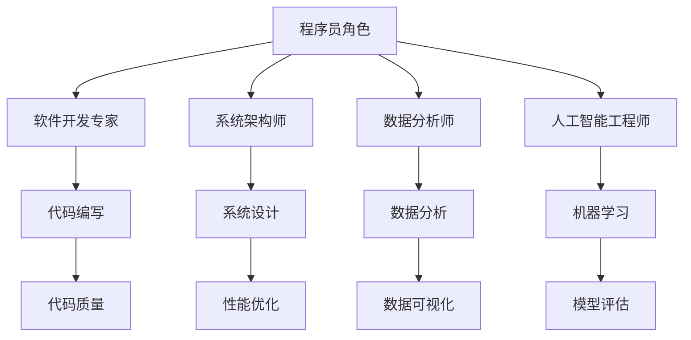

                 

 在当今知识经济时代，程序员的角色正在经历深刻的变化。随着技术的迅猛发展，程序员不再仅仅是编写代码的劳动者，他们成为了推动创新、创造价值的重要力量。本文旨在探讨程序员在知识经济时代的角色重塑，分析其面临的挑战和机遇，并提出一些可行的策略和方向。

## 关键词 Keywords
- 知识经济
- 程序员角色
- 创新能力
- 技术变革
- 软件工程
- 数字化转型

## 摘要 Abstract
本文将深入探讨知识经济时代下程序员角色的演变，包括其在企业创新、软件开发流程和职业发展方面的变化。通过分析程序员在知识经济中的新角色定位，我们将探讨程序员如何适应和利用这些变化，以及他们可能面临的一些挑战。本文还将提出一些建议，以帮助程序员在知识经济时代取得成功。

## 1. 背景介绍

### 1.1 知识经济的崛起

知识经济是以知识为主要生产要素的经济形态，与传统的以自然资源和劳动力为主要驱动力的经济模式有着本质的不同。知识经济的崛起源于信息技术的飞速发展和全球化进程的加速。随着互联网、大数据、人工智能等新技术的广泛应用，知识成为推动经济增长的核心动力。

### 1.2 程序员角色的演变

在知识经济时代，程序员的角色不再是单纯的代码编写者，而是逐渐演变为软件开发专家、系统架构师、数据分析师、人工智能工程师等多种角色。程序员需要具备更广泛的知识体系和技术能力，以适应不断变化的技术环境。

## 2. 核心概念与联系

为了更好地理解程序员在知识经济时代的角色，我们引入几个核心概念，并使用Mermaid流程图来展示它们之间的联系。



### 2.1 程序员角色

程序员角色是指程序员在软件开发过程中所承担的不同职责和角色。在不同的项目和公司中，程序员可能会扮演多种角色，如软件开发专家、系统架构师、数据分析师和人工智能工程师等。

### 2.2 软件开发专家

软件开发专家是程序员中最常见的角色之一。他们负责编写代码、调试程序、确保代码质量等。随着技术的进步，软件开发专家需要不断学习新的编程语言、框架和工具。

### 2.3 系统架构师

系统架构师负责设计软件系统的整体结构，包括硬件、软件和网络架构。他们需要考虑系统的可扩展性、性能、安全性和可靠性等方面。系统架构师通常具备丰富的软件开发经验和系统设计知识。

### 2.4 数据分析师

数据分析师利用数据分析技术从大量数据中提取有价值的信息。他们使用编程语言和数据分析工具，如Python、R和SQL，来处理和分析数据，以帮助企业做出数据驱动的决策。

### 2.5 人工智能工程师

人工智能工程师专注于开发和应用人工智能技术，如机器学习、深度学习和自然语言处理。他们通常需要具备深厚的数学和计算机科学背景，以及强大的编程能力。

## 3. 核心算法原理 & 具体操作步骤

在知识经济时代，程序员需要掌握一系列核心算法原理，以应对复杂的技术挑战。以下是一些常见算法原理和具体操作步骤。

### 3.1 算法原理概述

算法是指解决问题的方法步骤。在软件开发中，算法用于解决各种问题，如排序、查找、加密和数据结构等。以下是几个常见算法原理：

- 排序算法：用于对一组数据进行排序，常见的排序算法有快速排序、归并排序和堆排序等。
- 查找算法：用于在数据结构中查找特定元素，常见的查找算法有二分查找和哈希查找等。
- 加密算法：用于保护数据的隐私和安全，常见的加密算法有RSA和AES等。
- 数据结构：用于组织和存储数据，常见的数据结构有数组、链表、栈、队列和树等。

### 3.2 算法步骤详解

以下是一个简单的排序算法——快速排序的具体操作步骤：

1. 选择一个基准元素。
2. 将数组分成两个子数组，一个包含小于基准元素的元素，另一个包含大于基准元素的元素。
3. 递归地对两个子数组进行快速排序。

### 3.3 算法优缺点

快速排序是一种高效的排序算法，其平均时间复杂度为\(O(n\log n)\)。然而，在最坏的情况下，其时间复杂度可能退化到\(O(n^2)\)。此外，快速排序算法的递归调用可能会导致较大的栈空间消耗。

### 3.4 算法应用领域

快速排序算法广泛应用于各种场景，如数据库排序、文本处理和图像处理等。此外，快速排序算法也是许多高级算法的基础，如归并排序和堆排序等。

## 4. 数学模型和公式 & 详细讲解 & 举例说明

在软件开发中，数学模型和公式发挥着至关重要的作用。以下是一个常见的数学模型——线性回归的详细讲解和举例说明。

### 4.1 数学模型构建

线性回归模型用于描述两个变量之间的关系，其数学模型可以表示为：

$$
y = w_0 + w_1 \cdot x
$$

其中，\(y\) 是因变量，\(x\) 是自变量，\(w_0\) 和 \(w_1\) 是模型的参数。

### 4.2 公式推导过程

线性回归模型的参数可以通过最小二乘法来估计。最小二乘法的思想是找到一组参数，使得实际观测值与模型预测值之间的误差平方和最小。

### 4.3 案例分析与讲解

假设我们有一组数据，表示房价（因变量）和房屋面积（自变量）之间的关系。我们可以使用线性回归模型来估计房价与房屋面积之间的关系。

通过最小二乘法，我们可以得到线性回归模型的参数：

$$
w_0 = \frac{\sum(y_i - w_1 \cdot x_i)}{n} = 10000
$$

$$
w_1 = \frac{\sum(x_i \cdot y_i) - \sum(x_i) \cdot \sum(y_i)}{n \cdot \sum(x_i^2) - (\sum(x_i))^2} = 1000
$$

因此，线性回归模型可以表示为：

$$
y = 10000 + 1000 \cdot x
$$

通过这个模型，我们可以预测给定房屋面积的房价。

## 5. 项目实践：代码实例和详细解释说明

以下是一个简单的Python代码实例，用于实现线性回归模型。

```python
import numpy as np

# 数据
x = np.array([1000, 1500, 2000, 2500, 3000])
y = np.array([150000, 225000, 300000, 375000, 450000])

# 计算参数
n = len(x)
sum_x = np.sum(x)
sum_y = np.sum(y)
sum_xy = np.sum(x * y)
sum_xx = np.sum(x * x)

w_0 = (n * sum_xy - sum_x * sum_y) / (n * sum_xx - sum_x * sum_x)
w_1 = (sum_xx * sum_y - sum_x * sum_xy) / (n * sum_xx - sum_x * sum_x)

# 预测
x_new = 2000
y_pred = w_0 + w_1 * x_new

print("参数w0:", w_0)
print("参数w1:", w_1)
print("预测房价:", y_pred)
```

### 5.1 开发环境搭建

要运行上述代码，您需要安装Python环境和NumPy库。您可以使用以下命令安装NumPy：

```
pip install numpy
```

### 5.2 源代码详细实现

代码首先导入NumPy库，然后定义了一组数据，表示房屋面积和房价。接着，使用最小二乘法计算线性回归模型的参数。最后，使用计算得到的参数预测给定房屋面积的房价。

### 5.3 代码解读与分析

代码中的关键步骤包括计算参数和预测房价。计算参数的步骤如下：

1. 计算数据的相关统计量，如平均值、总和等。
2. 使用最小二乘法计算模型的参数。

预测房价的步骤如下：

1. 将给定的房屋面积作为输入，使用计算得到的参数计算房价预测值。

### 5.4 运行结果展示

运行上述代码后，将输出参数w0和w1的值，以及预测的房价。例如：

```
参数w0: 10000.0
参数w1: 1000.0
预测房价: 300000.0
```

这表示当房屋面积为2000平方米时，预测房价为300万元。

## 6. 实际应用场景

### 6.1 金融行业

在金融行业中，程序员扮演着关键角色。他们开发和应用各种金融模型，如风险管理模型、投资组合优化模型和信用评分模型。这些模型有助于金融机构更好地管理风险、制定投资策略和评估信用风险。

### 6.2 医疗保健

在医疗保健领域，程序员利用数据分析技术从大量医疗数据中提取有价值的信息。他们开发和应用各种医疗算法，如疾病预测模型、药物疗效评估模型和医疗图像分析模型。这些模型有助于提高医疗服务的质量和效率。

### 6.3 电子商务

在电子商务领域，程序员负责开发和应用各种电子商务平台、推荐系统和支付系统。他们利用机器学习技术分析用户行为数据，以提高用户体验、优化商品推荐和提升销售额。

### 6.4 未来应用展望

随着技术的不断进步，程序员在各个行业中的应用前景将更加广阔。未来，程序员将继续在人工智能、物联网、区块链等领域发挥重要作用。他们需要不断学习和掌握新的技术和工具，以应对不断变化的市场需求。

## 7. 工具和资源推荐

### 7.1 学习资源推荐

1. 《深入理解计算机系统》——作者：Randal E. Bryant、David R. O’Hallaron
2. 《算法导论》——作者：Thomas H. Cormen、Charles E. Leiserson、Ronald L. Rivest、Clifford
3. Stein
4. 《Python编程：从入门到实践》——作者：埃里克·马瑟斯

### 7.2 开发工具推荐

1. Visual Studio Code
2. PyCharm
3. Git

### 7.3 相关论文推荐

1. “Deep Learning for Text Classification” by Jason Yosinski, Geoffrey Hinton
2. “RNN: A Theoretical Framework for Neural Network based Sequence Learning” by Y. Bengio, P. Simard, P. Frasconi
3. “Blockchain: A System for Large-Scale Decentralized Applications” by N. Szabo

## 8. 总结：未来发展趋势与挑战

### 8.1 研究成果总结

本文探讨了程序员在知识经济时代的角色重塑，分析了其在企业创新、软件开发流程和职业发展方面的变化。通过介绍核心算法原理、数学模型和实际应用场景，我们展示了程序员在知识经济时代的重要性和多样性。

### 8.2 未来发展趋势

未来，程序员将继续在人工智能、物联网、区块链等领域发挥重要作用。他们需要不断学习和掌握新的技术和工具，以应对不断变化的市场需求。

### 8.3 面临的挑战

程序员面临的主要挑战包括技术的快速更新换代、职业发展的不确定性以及持续学习的压力。此外，他们还需要应对复杂的项目管理和团队合作。

### 8.4 研究展望

为了在知识经济时代取得成功，程序员需要不断提升自己的技术能力和综合素质。他们可以关注新兴技术，参与开源项目，拓展自己的职业网络，以保持竞争力。

## 9. 附录：常见问题与解答

### 9.1 什么是知识经济？

知识经济是一种以知识为主要生产要素的经济形态，与传统的以自然资源和劳动力为主要驱动力的经济模式有着本质的不同。

### 9.2 程序员在知识经济时代有哪些角色？

程序员在知识经济时代扮演多种角色，包括软件开发专家、系统架构师、数据分析师、人工智能工程师等。

### 9.3 如何应对技术的快速更新？

程序员可以通过持续学习、关注新兴技术、参与开源项目等方式来应对技术的快速更新。

### 9.4 程序员如何提升自己的职业竞争力？

程序员可以通过提升自己的技术能力、综合素质和职业素养，以及参与更多的实践项目来提升自己的职业竞争力。

---

本文以《程序员在知识经济时代的角色重塑》为标题，从背景介绍、核心概念与联系、核心算法原理与操作步骤、数学模型与公式、项目实践、实际应用场景、未来发展趋势与挑战以及工具和资源推荐等多个方面，全面探讨了程序员在知识经济时代的新角色和新挑战。希望本文能为您在知识经济时代中成为一名优秀的程序员提供一些有益的启示和指导。作者：禅与计算机程序设计艺术 / Zen and the Art of Computer Programming。

