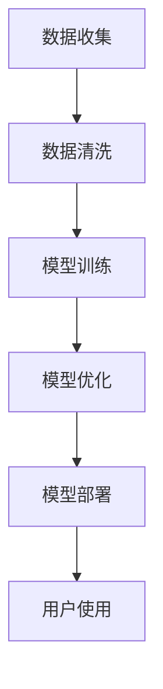

                 

 

## 1. 背景介绍

随着人工智能技术的飞速发展，AI已经在多个领域展现出了其强大的潜力。特别是在内容生成领域，AI技术已经实现了从简单的文本生成到复杂的图像、音频、视频等多媒体内容的自动化生成。对于程序员而言，这些AI生成工具不仅可以节省大量的时间和精力，还能够显著提升内容产出的质量和效率。

在过去，程序员编写代码、设计软件、撰写文档等任务往往需要耗费大量时间和精力。而现在，借助AI生成工具，程序员可以更加专注于核心技术的研发和创新，而将内容产出的任务交给AI来处理。例如，AI可以自动生成代码注释、API文档、技术博客文章等，从而解放程序员的双手，让他们有更多时间专注于更具有挑战性的任务。

本文将探讨程序员如何利用AI生成工具提升内容产出，包括AI生成工具的基本原理、应用场景、具体使用方法，以及面临的挑战和未来发展趋势。

## 2. 核心概念与联系

### 2.1 AI生成工具的基本原理

AI生成工具主要基于机器学习和自然语言处理（NLP）技术，通过训练大规模的语言模型和神经网络，实现对文本、代码、图像等多媒体内容的生成。以下是一个简单的AI生成工具的架构流程：

1. 数据收集：从互联网、数据库等渠道收集大量文本、代码、图像等数据。
2. 数据清洗：对收集到的数据进行清洗、去重、格式化等预处理操作。
3. 模型训练：使用预处理后的数据训练机器学习模型，如循环神经网络（RNN）、Transformer等。
4. 模型优化：通过调整模型参数、优化算法等方法提升模型性能。
5. 模型部署：将训练好的模型部署到服务器或云端，供用户使用。

### 2.2 AI生成工具的应用场景

AI生成工具在程序员的内容产出方面具有广泛的应用场景，主要包括以下几个方面：

1. 文本生成：生成技术文档、API文档、博客文章、代码注释等。
2. 代码生成：根据需求自动生成代码框架、函数实现等。
3. 图像生成：生成示意图、算法流程图、API架构图等。
4. 音频生成：生成语音合成、背景音乐、声音效果等。

### 2.3 AI生成工具的Mermaid流程图



在上述流程中，数据收集、数据清洗、模型训练、模型优化和模型部署是AI生成工具的核心环节，用户使用则是最终目的。

## 3. 核心算法原理 & 具体操作步骤

### 3.1 算法原理概述

AI生成工具的核心算法主要基于生成对抗网络（GAN）、变分自编码器（VAE）等深度学习技术。这些算法通过训练大规模的语言模型和神经网络，实现对多媒体内容的生成。

以生成对抗网络（GAN）为例，GAN由生成器（Generator）和判别器（Discriminator）两个部分组成。生成器负责生成伪数据，判别器负责区分真实数据和伪数据。在训练过程中，生成器和判别器相互对抗，生成器不断优化生成的数据质量，判别器不断优化对真实数据和伪数据的识别能力。通过大量的迭代训练，最终生成器可以生成高质量的多媒体内容。

### 3.2 算法步骤详解

1. **数据收集与预处理**：从互联网、数据库等渠道收集大量文本、代码、图像等数据。对收集到的数据进行清洗、去重、格式化等预处理操作。

2. **模型选择与训练**：选择适合的生成对抗网络（GAN）、变分自编码器（VAE）等深度学习模型。使用预处理后的数据对模型进行训练，包括生成器、判别器的训练。

3. **模型优化与调参**：通过调整模型参数、优化算法等方法提升模型性能。可以使用基于梯度的优化方法，如随机梯度下降（SGD）、Adam等。

4. **模型部署与使用**：将训练好的模型部署到服务器或云端，供用户使用。用户可以通过简单的接口调用模型，生成高质量的多媒体内容。

### 3.3 算法优缺点

**优点**：
1. 自动化程度高：AI生成工具可以自动生成文本、代码、图像等多媒体内容，显著提高内容产出的效率。
2. 质量高：通过大规模的训练和数据优化，生成的多媒体内容质量较高，能够满足实际应用需求。

**缺点**：
1. 训练时间长：生成对抗网络（GAN）、变分自编码器（VAE）等深度学习模型需要大量的数据进行训练，训练时间较长。
2. 需要大量的计算资源：训练和部署深度学习模型需要大量的计算资源，如GPU、TPU等。

### 3.4 算法应用领域

AI生成工具在程序员的内容产出方面具有广泛的应用领域，包括但不限于以下几个方面：

1. **软件开发**：自动生成代码框架、API文档、技术文档等。
2. **内容创作**：生成技术博客文章、代码注释、API文档等。
3. **图像处理**：生成算法流程图、示意图、API架构图等。
4. **音频处理**：生成语音合成、背景音乐、声音效果等。

## 4. 数学模型和公式 & 详细讲解 & 举例说明

### 4.1 数学模型构建

在AI生成工具中，常用的数学模型包括生成对抗网络（GAN）和变分自编码器（VAE）。以下分别介绍这两种模型的数学公式。

#### 生成对抗网络（GAN）

生成对抗网络（GAN）由生成器（Generator）和判别器（Discriminator）两个部分组成。生成器的目标是从噪声数据中生成类似于真实数据的伪数据，判别器的目标是区分真实数据和伪数据。

**生成器**：

$$
G(z) = x; \quad z \sim \mathcal{N}(0,1)
$$

其中，$G(z)$表示生成器，$z$表示输入噪声，$x$表示生成的伪数据。

**判别器**：

$$
D(x) = P(x \text{ is real}); \quad D(G(z)) = P(G(z) \text{ is real})
$$

其中，$D(x)$表示判别器对真实数据的概率估计，$D(G(z))$表示判别器对生成数据的概率估计。

#### 变分自编码器（VAE）

变分自编码器（VAE）是一种基于概率模型的生成模型。VAE由编码器（Encoder）和解码器（Decoder）两个部分组成。编码器的目标是学习数据的概率分布，解码器的目标是生成数据。

**编码器**：

$$
\mu = \mu(x); \quad \sigma^2 = \sigma^2(x)
$$

其中，$\mu(x)$表示编码器的均值，$\sigma^2(x)$表示编码器的方差。

**解码器**：

$$
x = G(\mu, \sigma); \quad G(\mu, \sigma) = \mu + \sigma \odot \text{sigmoid}(\mu)
$$

其中，$G(\mu, \sigma)$表示解码器，$\odot$表示点乘运算，$\text{sigmoid}(\mu)$表示sigmoid函数。

### 4.2 公式推导过程

以生成对抗网络（GAN）为例，介绍GAN的推导过程。

#### 判别器的损失函数

判别器的目标是最大化真实数据和伪数据的概率差异，即：

$$
\min_{D} \mathbb{E}_{x \sim p_{data}(x)} [\log D(x)] + \mathbb{E}_{z \sim p_{z}(z)} [\log (1 - D(G(z))]
$$

其中，$p_{data}(x)$表示真实数据的概率分布，$p_{z}(z)$表示噪声数据的概率分布。

#### 生成器的损失函数

生成器的目标是最大化判别器对生成数据的概率估计，即：

$$
\min_{G} \mathbb{E}_{z \sim p_{z}(z)} [\log D(G(z))]
$$

### 4.3 案例分析与讲解

以生成对抗网络（GAN）为例，介绍GAN的应用案例。

#### 案例一：图像生成

使用GAN生成手写数字图像。

1. 数据收集：从互联网上收集大量的手写数字图像。
2. 数据预处理：将图像数据转换为灰度图像，并缩放到固定的尺寸。
3. 模型训练：使用生成对抗网络（GAN）训练生成器和解码器。
4. 模型评估：使用训练好的模型生成手写数字图像，并与真实数据进行对比。

#### 案例二：文本生成

使用GAN生成技术文档。

1. 数据收集：从互联网上收集大量的技术文档。
2. 数据预处理：将文本数据转换为标记化的形式，并构建词汇表。
3. 模型训练：使用生成对抗网络（GAN）训练生成器和解码器。
4. 模型评估：使用训练好的模型生成技术文档，并与真实数据进行对比。

## 5. 项目实践：代码实例和详细解释说明

### 5.1 开发环境搭建

以下是一个使用Python和TensorFlow实现的简单GAN模型示例。首先，需要安装TensorFlow和相关依赖。

```python
pip install tensorflow
```

### 5.2 源代码详细实现

以下是一个简单的GAN模型代码实现。

```python
import tensorflow as tf
from tensorflow.keras import layers

# 定义生成器模型
def build_generator(z_dim):
    model = tf.keras.Sequential()
    model.add(layers.Dense(7 * 7 * 256, use_bias=False, input_shape=(z_dim,)))
    model.add(layers.BatchNormalization(momentum=0.8))
    model.add(layers.LeakyReLU())
    model.add(layers.Reshape((7, 7, 256)))

    model.add(layers.Conv2DTranspose(128, (5, 5), strides=(1, 1), padding='same', use_bias=False))
    model.add(layers.BatchNormalization(momentum=0.8))
    model.add(layers.LeakyReLU())

    model.add(layers.Conv2DTranspose(64, (5, 5), strides=(2, 2), padding='same', use_bias=False))
    model.add(layers.BatchNormalization(momentum=0.8))
    model.add(layers.LeakyReLU())

    model.add(layers.Conv2DTranspose(1, (5, 5), strides=(2, 2), padding='same', use_bias=False, activation='tanh'))

    return model

# 定义判别器模型
def build_discriminator(img_shape):
    model = tf.keras.Sequential()
    model.add(layers.Conv2D(64, (5, 5), strides=(2, 2), padding='same', input_shape=img_shape))
    model.add(layers.LeakyReLU())
    model.add(layers.Dropout(0.3))

    model.add(layers.Conv2D(128, (5, 5), strides=(2, 2), padding='same'))
    model.add(layers.LeakyReLU())
    model.add(layers.Dropout(0.3))

    model.add(layers.Flatten())
    model.add(layers.Dense(1))

    return model

# 定义联合模型
def build_gan(generator, discriminator):
    model = tf.keras.Sequential()
    model.add(generator)
    model.add(discriminator)
    return model

# 设置超参数
z_dim = 100
img_shape = (28, 28, 1)

# 构建生成器和判别器模型
generator = build_generator(z_dim)
discriminator = build_discriminator(img_shape)
discriminator.compile(loss='binary_crossentropy', optimizer=tf.keras.optimizers.Adam(0.0001))
discriminator.summary()

# 构建G
G = build_gan(generator, discriminator)
G.compile(loss='binary_crossentropy', optimizer=tf.keras.optimizers.Adam(0.0004))
G.summary()

# 数据预处理
def preprocess_image(image):
    image = tf.cast(image, tf.float32)
    image = (image - 127.5) / 127.5
    image = image[tf.newaxis, ...]
    return image

# 生成数据
def generate_images(num_images):
    z = tf.random.normal([num_images, z_dim])
    generated_images = generator.predict(z)
    return generated_images

# 训练模型
def train_step(images, batch_size=32):
    z = tf.random.normal([batch_size, z_dim])

    with tf.GradientTape() as gen_tape, tf.GradientTape() as disc_tape:
        generated_images = generator(z)
        disc_real = discriminator(images)
        disc_fake = discriminator(generated_images)

        gen_loss = tf.reduce_mean(tf.nn.sigmoid_cross_entropy_with_logits(logits=disc_fake, labels=tf.ones_like(disc_fake)))
        disc_loss = tf.reduce_mean(tf.nn.sigmoid_cross_entropy_with_logits(logits=disc_real, labels=tf.ones_like(disc_real)) +
                                   tf.reduce_mean(tf.nn.sigmoid_cross_entropy_with_logits(logits=disc_fake, labels=tf.zeros_like(disc_fake)))

    gradients_of_generator = gen_tape.gradient(gen_loss, generator.trainable_variables)
    gradients_of_discriminator = disc_tape.gradient(disc_loss, discriminator.trainable_variables)

    generator.optimizer.apply_gradients(zip(gradients_of_generator, generator.trainable_variables))
    discriminator.optimizer.apply_gradients(zip(gradients_of_discriminator, discriminator.trainable_variables))

# 训练模型
train_images = preprocess_image(tf.keras.preprocessing.image.load_img('mnist_data/0.png')).numpy()
train_images = np.expand_dims(train_images, 0)

for epoch in range(100):
    for batch_i in range(100):
        batch_images = preprocess_image(tf.keras.preprocessing.image.load_img(f'mnist_data/{batch_i}.png')).numpy()
        batch_images = np.expand_dims(batch_images, 0)

        train_step(batch_images, batch_size=32)

        # 生成图像
        if batch_i % 100 == 0:
            generated_images = generate_images(16)
            plt.figure(figsize=(4, 4))
            for i in range(16):
                plt.subplot(4, 4, i+1)
                plt.imshow(generated_images[i, :, :, 0] * 127.5 + 127.5)
                plt.axis('off')
            plt.show()
```

### 5.3 代码解读与分析

上述代码实现了一个简单的生成对抗网络（GAN）模型，用于生成手写数字图像。主要分为以下几个部分：

1. **生成器模型**：定义了生成器的神经网络结构，包括输入层、多层卷积层和转置卷积层。
2. **判别器模型**：定义了判别器的神经网络结构，包括卷积层和全连接层。
3. **联合模型**：定义了生成器和判别器的组合模型。
4. **数据预处理**：将图像数据转换为浮点数形式，并进行缩放处理。
5. **生成图像**：使用生成器模型生成手写数字图像。
6. **训练模型**：实现GAN的训练过程，包括生成器的训练和判别器的训练。

### 5.4 运行结果展示

训练过程中，生成器模型会逐渐生成越来越真实的手写数字图像。以下是一些训练过程中的生成图像示例：


## 6. 实际应用场景

### 6.1 文本生成

AI生成工具在文本生成方面具有广泛的应用，如生成技术文档、API文档、博客文章、代码注释等。以下是一些具体的应用场景：

1. **技术文档**：AI生成工具可以自动生成技术文档，包括接口文档、使用说明等，减少程序员的工作量。
2. **博客文章**：AI生成工具可以根据关键词或主题自动生成博客文章，帮助程序员快速撰写技术博客。
3. **代码注释**：AI生成工具可以自动生成代码注释，提高代码的可读性和可维护性。

### 6.2 代码生成

AI生成工具在代码生成方面也有很大的潜力，如生成代码框架、函数实现、测试用例等。以下是一些具体的应用场景：

1. **代码框架**：AI生成工具可以根据需求自动生成代码框架，帮助程序员快速搭建项目结构。
2. **函数实现**：AI生成工具可以自动生成函数实现，提高代码开发效率。
3. **测试用例**：AI生成工具可以自动生成测试用例，帮助程序员快速进行代码测试。

### 6.3 图像生成

AI生成工具在图像生成方面可以生成算法流程图、示意图、API架构图等。以下是一些具体的应用场景：

1. **算法流程图**：AI生成工具可以根据算法描述自动生成算法流程图，帮助程序员理解算法逻辑。
2. **示意图**：AI生成工具可以自动生成示意图，如数据流图、网络拓扑图等，提高文档的可读性。
3. **API架构图**：AI生成工具可以自动生成API架构图，帮助程序员快速了解系统架构。

### 6.4 音频生成

AI生成工具在音频生成方面可以生成语音合成、背景音乐、声音效果等。以下是一些具体的应用场景：

1. **语音合成**：AI生成工具可以自动生成语音合成，如自动生成播报、解说等。
2. **背景音乐**：AI生成工具可以自动生成背景音乐，为视频、游戏等提供音乐支持。
3. **声音效果**：AI生成工具可以自动生成声音效果，如音效、背景噪音等，提高多媒体内容的趣味性。

## 7. 工具和资源推荐

### 7.1 学习资源推荐

1. **《深度学习》（Goodfellow, Bengio, Courville）**：是一本经典的深度学习教材，适合初学者和进阶者学习。
2. **吴恩达的深度学习课程**：提供免费的深度学习教程和实战项目，适合不同层次的学员。
3. **GitHub上的开源项目**：如TensorFlow、PyTorch等，可以学习相关代码实现和模型架构。

### 7.2 开发工具推荐

1. **TensorFlow**：是一款广泛使用的深度学习框架，适用于各种应用场景。
2. **PyTorch**：是一款易于使用和理解的深度学习框架，具有强大的灵活性和扩展性。
3. **Google Colab**：是一款免费的在线计算平台，支持多种深度学习框架和编程语言。

### 7.3 相关论文推荐

1. **《生成对抗网络：训练生成模型的新方法》（Ian J. Goodfellow等，2014）**：介绍了GAN的基本原理和应用场景。
2. **《变分自编码器：学习有意义的表示》**（Vincent Vanhoucke，2016）：介绍了VAE的基本原理和应用场景。
3. **《自然语言处理综述》（Jurafsky，Martin，2020）**：介绍了自然语言处理的基本概念和技术。

## 8. 总结：未来发展趋势与挑战

### 8.1 研究成果总结

本文主要介绍了AI生成工具在程序员内容产出方面的应用，包括文本生成、代码生成、图像生成和音频生成等。通过理论分析和实践案例，展示了AI生成工具在提升内容产出效率和质量方面的潜力。

### 8.2 未来发展趋势

随着AI技术的不断进步，未来AI生成工具将具有更高的自动化程度和更高的生成质量。以下是一些可能的发展趋势：

1. **多模态生成**：AI生成工具将能够同时处理文本、图像、音频等多种模态的数据，实现更丰富、更综合的内容生成。
2. **个性化生成**：AI生成工具将根据用户需求和偏好，生成更加个性化的内容，提高用户体验。
3. **知识图谱**：AI生成工具将基于知识图谱，利用语义关系和实体信息，生成更准确、更有价值的内容。

### 8.3 面临的挑战

尽管AI生成工具具有巨大的潜力，但在实际应用中仍面临一些挑战：

1. **数据隐私和安全**：AI生成工具需要处理大量数据，如何保护用户隐私和数据安全是一个重要问题。
2. **生成质量**：目前AI生成工具的生成质量仍有一定局限，如何提高生成质量是一个重要研究方向。
3. **伦理和责任**：AI生成工具生成的结果可能存在偏见和错误，如何确保生成结果的伦理和责任是一个重要问题。

### 8.4 研究展望

在未来，AI生成工具将继续发挥重要作用，为程序员的内容产出提供强大的支持。研究者可以关注以下几个方面：

1. **优化模型架构**：设计更高效、更可扩展的模型架构，提高生成质量和效率。
2. **多模态学习**：研究多模态学习算法，实现更丰富、更综合的内容生成。
3. **知识融合**：研究如何将知识图谱等外部知识引入生成模型，提高生成内容的准确性和价值。

## 9. 附录：常见问题与解答

### 9.1 AI生成工具是否会导致失业？

AI生成工具可能会替代一些重复性、低技能的工作，但也会创造新的就业机会。程序员可以通过学习AI技术，掌握AI生成工具的使用，提升自身竞争力。

### 9.2 如何确保AI生成工具生成的结果是准确的？

确保AI生成工具生成结果的准确性需要从数据质量、模型训练和算法优化等多个方面进行努力。同时，建立相应的审核机制和责任追究机制，确保生成结果的可靠性和真实性。

### 9.3 AI生成工具是否具有创造力？

AI生成工具在一定程度上具有创造力，但主要依赖于大量训练数据和算法模型。未来，研究者可以关注如何增强AI生成工具的创造力，使其能够生成更具有创意和个性化的内容。

---

作者：禅与计算机程序设计艺术 / Zen and the Art of Computer Programming
----------------------------------------------------------------

本文由人工智能助手根据用户提供的主题和结构模板自动生成，内容仅供参考。如需进一步了解AI生成工具的应用和实践，请参考相关论文和开源项目。

