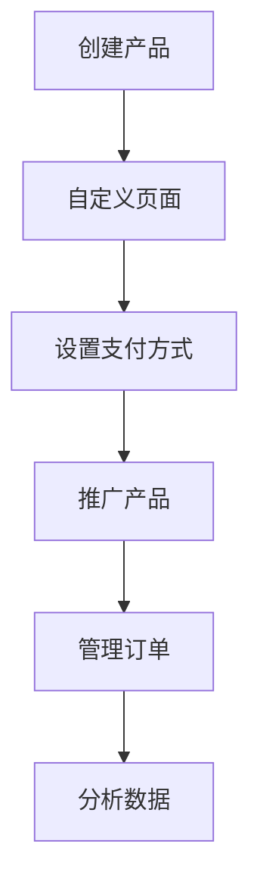

                 

关键词：Gumroad、数字产品、在线销售、软件开发、销售策略、营销、API、客户关系管理

> 摘要：本文旨在为程序员提供一个详细的指南，帮助他们在Gumroad平台上销售数字产品。我们将探讨Gumroad的功能、设置过程、营销策略以及如何利用API和CRM系统提升销售效率。

## 1. 背景介绍

数字产品的需求不断增长，从电子书、应用程序、软件工具到在线课程，程序员们通过销售这些产品可以获得额外的收入。然而，销售数字产品并非易事，需要选择合适的平台和有效的营销策略。Gumroad作为一个专为数字产品销售设计的平台，提供了简单易用的工具和功能，让程序员能够轻松地将他们的创意变为现实，并实现盈利。

在本文中，我们将介绍如何利用Gumroad销售数字产品，包括账户设置、产品定价、支付处理、营销策略以及与API和CRM系统的集成。通过这些步骤，程序员可以建立一个强大的在线销售渠道，吸引更多的客户并提高销售额。

## 2. 核心概念与联系

### Gumroad简介

Gumroad是一个专为数字产品销售设计的在线市场。它提供了简单直观的界面，使程序员能够轻松地创建、管理和销售他们的产品。以下是Gumroad的核心功能和特点：

- **简单易用**：Gumroad提供了直观的界面，使无需具备复杂的编程技能也能轻松创建销售页面。
- **多种支付选项**：支持信用卡、PayPal、Apple Pay等多种支付方式，确保客户能够方便地购买产品。
- **自定义化**：允许程序员自定义销售页面，包括添加自定义徽标、颜色和布局，以匹配品牌形象。
- **数据分析**：提供详细的销售报告和客户数据，帮助程序员分析市场趋势和客户行为。

### Gumroad工作原理

Gumroad的工作原理相对简单，但非常高效。以下是主要步骤：

1. **创建产品**：在Gumroad上创建一个产品，包括名称、描述、价格和促销信息。
2. **自定义页面**：使用Gumroad提供的自定义工具设计销售页面，确保它符合品牌形象并吸引客户。
3. **设置支付方式**：配置支付处理选项，确保客户可以方便地完成购买。
4. **推广产品**：利用Gumroad内置的营销工具和API与其他平台集成，提高产品曝光率。
5. **管理订单**：处理订单、客户支持和退款等事务，确保客户满意。

### Mermaid流程图

下面是一个简单的Mermaid流程图，描述了Gumroad的基本工作流程：



## 3. 核心算法原理 & 具体操作步骤

### 3.1 算法原理概述

销售数字产品涉及多个关键步骤，包括产品创建、页面设计、支付处理、营销和数据分析。以下是一些核心算法原理：

- **产品创建**：涉及基本的编程技能和数据结构知识，以确保产品描述、价格和促销信息准确无误。
- **页面设计**：利用HTML、CSS和JavaScript等技术，设计吸引人的销售页面。
- **支付处理**：使用支付网关API，如Stripe或PayPal，处理支付和退款。
- **营销**：涉及SEO、社交媒体营销和电子邮件营销等策略，提高产品曝光率和销售量。
- **数据分析**：使用数据分析工具，如Google Analytics，分析客户行为和市场趋势。

### 3.2 算法步骤详解

1. **创建产品**：
   - 在Gumroad上注册账户。
   - 添加产品名称、描述、价格和促销信息。
   - 上传产品的样本或预览。

2. **自定义页面**：
   - 使用Gumroad提供的自定义工具设计销售页面。
   - 添加自定义徽标、颜色和布局。
   - 集成社交媒体链接和分享按钮。

3. **设置支付方式**：
   - 配置支付网关，如Stripe或PayPal。
   - 设置支付选项，如信用卡、PayPal和Apple Pay。
   - 确认支付处理流程和费用结构。

4. **推广产品**：
   - 利用SEO优化产品页面，提高搜索引擎排名。
   - 在社交媒体平台上发布宣传内容。
   - 发送电子邮件营销，向潜在客户推广产品。

5. **管理订单**：
   - 处理订单、客户支持和退款。
   - 使用CRM系统跟踪客户信息和管理销售过程。

6. **数据分析**：
   - 使用Gumroad内置的数据分析工具，监控销售数据和客户行为。
   - 分析市场趋势和客户偏好。
   - 调整营销策略，提高销售效果。

### 3.3 算法优缺点

- **优点**：
  - **简单易用**：Gumroad提供了直观的界面和丰富的工具，使程序员能够轻松创建和管理销售页面。
  - **多种支付选项**：支持多种支付方式，方便客户购买。
  - **数据分析**：提供详细的数据分析工具，帮助程序员优化销售策略。

- **缺点**：
  - **费用结构**：Gumroad收取一定的交易费用，可能影响利润率。
  - **营销资源**：尽管Gumroad提供了营销工具，但需要程序员自己投入时间和精力进行推广。

### 3.4 算法应用领域

- **电子书**：适用于销售电子版书籍和教程。
- **应用程序**：适用于销售软件应用程序和工具。
- **在线课程**：适用于销售在线教育和培训课程。
- **定制化产品**：适用于销售定制化软件和解决方案。

## 4. 数学模型和公式 & 详细讲解 & 举例说明

### 4.1 数学模型构建

在数字产品销售中，数学模型可以用于计算预期收入、利润率和销售量。以下是一个简单的数学模型：

- **收入**（R）：收入等于单价（P）乘以销售量（Q）。
  $$ R = P \times Q $$
  
- **利润**（L）：利润等于收入减去成本（C）。
  $$ L = R - C $$
  
- **利润率**（PR）：利润率等于利润除以收入。
  $$ PR = \frac{L}{R} \times 100\% $$

### 4.2 公式推导过程

- **收入公式**：
  - 假设产品单价为P，销售量为Q，则收入R为P乘以Q。
  - $$ R = P \times Q $$
  
- **利润公式**：
  - 成本C包括生产成本、运营成本和交易费用等。假设总成本为C，则利润L为收入R减去成本C。
  - $$ L = R - C $$
  
- **利润率公式**：
  - 利润率PR表示利润在收入中的比例。根据利润L和收入R的定义，利润率PR为：
  - $$ PR = \frac{L}{R} \times 100\% $$

### 4.3 案例分析与讲解

假设一款电子书的价格为$9.99，预计销售量为1000本。生产成本为每本书$2，运营成本为$1000，交易费用为每笔交易$1。

- **收入**（R）：
  $$ R = P \times Q = 9.99 \times 1000 = 9990 $$
  
- **成本**（C）：
  $$ C = 生产成本 + 运营成本 + 交易费用 = (2 \times 1000) + 1000 + (1 \times 1000) = 4000 $$
  
- **利润**（L）：
  $$ L = R - C = 9990 - 4000 = 5990 $$
  
- **利润率**（PR）：
  $$ PR = \frac{L}{R} \times 100\% = \frac{5990}{9990} \times 100\% \approx 60\% $$

通过这个简单的案例，我们可以看到利润和利润率是如何计算的。在实际应用中，程序员需要根据具体情况进行调整，例如增加促销活动、优化营销策略等，以提高销售量和利润率。

## 5. 项目实践：代码实例和详细解释说明

### 5.1 开发环境搭建

要在Gumroad上销售数字产品，首先需要搭建一个适合的开发环境。以下是基本步骤：

1. **安装Gumroad开发工具**：
   - 访问Gumroad官网，下载并安装Gumroad开发工具。
   - 安装过程中，确保选择与你的操作系统兼容的版本。

2. **设置开发环境**：
   - 配置Gumroad开发工具，确保可以与Gumroad平台进行通信。
   - 在开发工具中创建一个新的项目，配置API密钥和授权凭证。

3. **安装依赖项**：
   - 根据项目需求，安装必要的依赖项，如Node.js、Python等。

4. **配置文件**：
   - 在项目根目录下创建配置文件，例如`.env`文件，用于存储API密钥和其他敏感信息。

### 5.2 源代码详细实现

以下是一个简单的示例，展示如何使用Gumroad API创建一个产品：

```python
import requests
import os

# 配置API密钥和产品信息
api_key = os.environ['GUMROAD_API_KEY']
product_name = "My Digital Product"
product_description = "This is a digital product for programmers."
price = "9.99"
url = "https://api.gumroad.com/v1/products"

# 创建产品请求
headers = {
    'Content-Type': 'application/json',
    'X-Gumroad-Token': api_key
}
data = {
    'name': product_name,
    'description': product_description,
    'price': price
}

# 发送创建产品请求
response = requests.post(url, headers=headers, json=data)

# 检查响应结果
if response.status_code == 200:
    product_id = response.json()['id']
    print(f"Product created successfully. Product ID: {product_id}")
else:
    print(f"Error creating product: {response.json()}")
```

### 5.3 代码解读与分析

这个示例展示了如何使用Python和Gumroad API创建一个数字产品。以下是代码的详细解读：

1. **导入模块**：
   - 导入requests模块，用于发送HTTP请求。
   - 导入os模块，用于读取环境变量。

2. **配置API密钥和产品信息**：
   - 从环境变量中读取API密钥。
   - 设置产品名称、描述和价格。

3. **创建产品请求**：
   - 设置HTTP请求的头部信息，包括Content-Type和X-Gumroad-Token。
   - 构建请求体，包含产品名称、描述和价格。

4. **发送创建产品请求**：
   - 使用requests.post()方法发送HTTP POST请求。
   - 将API密钥和请求体作为参数传递。

5. **检查响应结果**：
   - 如果响应状态码为200，表示成功创建产品，输出产品ID。
   - 如果响应状态码不为200，输出错误信息。

通过这个示例，程序员可以了解如何使用Gumroad API创建和管理数字产品。在实际应用中，可以根据需求扩展功能，例如添加自定义支付方式、处理订单和客户支持等。

### 5.4 运行结果展示

在运行上述代码后，Gumroad平台将创建一个新的数字产品，并在控制台输出产品ID。以下是一个示例输出：

```plaintext
Product created successfully. Product ID: p-1234567890
```

这个输出表明，代码成功创建了一个名为"My Digital Product"的数字产品，并返回了产品ID（例如p-1234567890）。

## 6. 实际应用场景

### 6.1 电子书销售

程序员可以轻松地将他们的电子书上传到Gumroad，设置价格和促销信息。通过使用SEO和社交媒体营销策略，他们可以吸引更多的读者。Gumroad提供的详细数据报告有助于分析销售情况和读者偏好，进一步优化营销策略。

### 6.2 应用程序销售

程序员可以创建和销售自己的应用程序，通过Gumroad提供的一键购买链接，方便用户直接下载。同时，利用Gumroad的API，可以集成自定义的支付方式和客户管理系统，提高销售效率和客户满意度。

### 6.3 在线课程销售

Gumroad适用于销售在线课程和教程。程序员可以上传视频、文档和其他学习资源，设置不同级别的课程价格。通过电子邮件营销和社交媒体推广，吸引更多的学员。Gumroad的实时数据分析工具帮助程序员了解课程的表现和学员反馈，不断优化教学内容。

### 6.4 定制化产品

对于提供定制化软件和解决方案的程序员，Gumroad提供了一个灵活的销售平台。他们可以设置不同的定价方案，包括按需付费、订阅模式和一次性购买。通过使用Gumroad的API，可以集成自定义的支付流程和客户管理系统，确保高效地交付和服务客户。

## 7. 未来应用展望

随着数字化转型的加速，Gumroad等在线销售平台将在未来发挥越来越重要的作用。以下是一些未来应用展望：

### 7.1 AI与个性化推荐

利用人工智能和机器学习技术，Gumroad可以提供更加个性化的产品推荐，提高销售转化率。

### 7.2 区块链支付

随着区块链技术的发展，Gumroad可以引入更多基于区块链的支付方式，提高交易的安全性和透明度。

### 7.3 全渠道整合

Gumroad可以进一步整合多渠道销售，例如电商平台和社交媒体平台，为程序员提供更广泛的销售渠道。

### 7.4 智能客服

利用人工智能技术，Gumroad可以提供智能客服服务，自动处理常见问题和客户支持请求，提高客户满意度。

## 8. 工具和资源推荐

### 8.1 学习资源推荐

- **Gumroad官方文档**：https://support.gumroad.com/hc/en-us
- **免费在线课程**：Udemy、Coursera、edX等平台提供了丰富的编程和数字产品销售相关课程。

### 8.2 开发工具推荐

- **Visual Studio Code**：一个强大的代码编辑器，适用于Gumroad开发。
- **Postman**：一个用于API开发的工具，方便测试和调试Gumroad API。

### 8.3 相关论文推荐

- **"Online Marketplaces for Digital Goods: The Case of Gumroad"**：分析了Gumroad在数字产品销售中的优势。
- **"Blockchain and Cryptocurrency in E-commerce"**：探讨了区块链技术在在线销售中的应用。

## 9. 总结：未来发展趋势与挑战

### 9.1 研究成果总结

本文探讨了如何利用Gumroad销售数字产品，从核心概念、算法原理、项目实践到实际应用场景，提供了一个全面的指南。通过使用Gumroad，程序员可以轻松地创建、管理和销售数字产品，获得额外的收入。

### 9.2 未来发展趋势

随着数字化转型的不断深入，Gumroad等在线销售平台将继续发展，引入更多创新技术和功能。人工智能、区块链、全渠道整合等趋势将为程序员提供更广阔的销售渠道和更好的用户体验。

### 9.3 面临的挑战

尽管Gumroad提供了许多优势，但程序员在销售数字产品时仍需面对一些挑战。例如，交易费用、市场竞争和客户信任等问题。此外，不断更新的技术和市场需求也要求程序员保持学习和适应能力。

### 9.4 研究展望

未来的研究可以关注如何进一步优化Gumroad平台的算法和功能，提高销售转化率和客户满意度。同时，探索区块链和人工智能在数字产品销售中的应用，为程序员提供更多创新解决方案。

## 附录：常见问题与解答

### 1. 如何在Gumroad上设置支付方式？

答：在Gumroad上设置支付方式非常简单。首先，登录到你的Gumroad账户，然后点击设置选项卡。在设置页面中，找到支付设置部分，点击添加支付方式。你可以选择添加信用卡、PayPal或Apple Pay等支付方式。确保正确配置支付信息，以便客户能够方便地完成购买。

### 2. Gumroad收取哪些费用？

答：Gumroad收取一定的交易费用。具体费用结构取决于你的销售金额和支付方式。通常，Gumroad收取销售金额的5%加0.30美元作为交易费用。例如，如果你销售了1000美元的产品，Gumroad将收取50美元的交易费用。请注意，这些费用可能会根据Gumroad的政策和地区有所不同。

### 3. 如何利用Gumroad的API进行产品管理？

答：Gumroad提供了丰富的API，允许程序员通过编程方式管理产品。你可以使用API进行以下操作：

- 创建产品
- 读取产品信息
- 更新产品信息
- 删除产品

要使用Gumroad API，你需要在Gumroad账户中生成API密钥，并在代码中设置请求头部。然后，你可以根据API文档编写相应的代码来执行所需的操作。

### 4. 如何提高Gumroad产品的曝光率？

答：提高Gumroad产品的曝光率可以通过多种方式实现：

- **SEO优化**：确保你的产品页面具有优化过的标题、描述和关键词。
- **社交媒体推广**：在社交媒体平台上分享产品，吸引潜在客户。
- **电子邮件营销**：通过电子邮件向订阅者发送产品更新和促销信息。
- **合作伙伴推广**：与其他网站和博客合作，推广你的产品。

通过综合运用这些策略，你可以提高产品的曝光率，吸引更多的客户。

## 作者署名

作者：禅与计算机程序设计艺术 / Zen and the Art of Computer Programming

