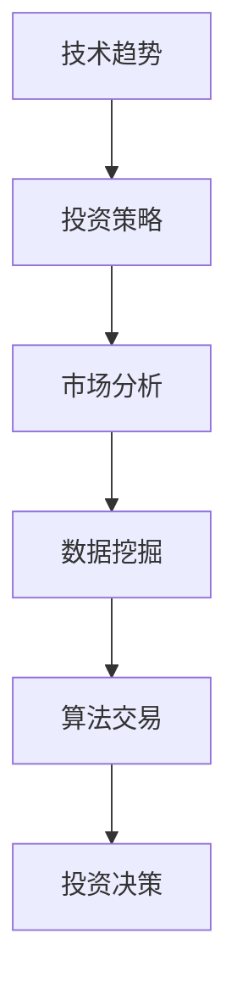

                 

关键词：技术趋势、投资策略、市场分析、编程技巧、数据科学、区块链、人工智能

> 投资不仅仅是一项财务活动，更是一种技术和策略的综合运用。在这个数字化时代，程序员们拥有独特的优势，可以利用技术趋势来优化投资决策。本文将探讨程序员如何通过技术分析、数据挖掘、算法交易等手段，抓住市场机会，实现财富增值。

## 1. 背景介绍

在过去的几十年里，全球金融市场经历了巨大的变革。互联网和技术的快速发展，使得信息传播更加迅速，投资渠道更加多样化。与此同时，传统的投资策略和工具已经难以满足投资者的需求。技术趋势的涌现，如区块链、人工智能、大数据等，为投资者提供了新的视角和工具。

程序员作为技术领域的专业人士，具备敏锐的技术洞察力和编程能力。他们可以利用这些优势，从技术角度分析市场，挖掘投资机会，设计高效的交易策略。本文将围绕这一主题，探讨程序员如何利用技术趋势进行投资。

## 2. 核心概念与联系

在深入探讨程序员如何利用技术趋势进行投资之前，我们需要了解以下几个核心概念：

### 2.1 技术趋势

技术趋势是指某一时期内，技术领域中出现的新兴技术、热门技术或发展方向。这些技术往往具有广泛的应用前景和潜在的商业价值。程序员需要关注技术趋势，以便把握市场动向，制定相应的投资策略。

### 2.2 投资策略

投资策略是指投资者在特定市场环境下，为实现投资目标所采用的一系列方法。投资策略包括价值投资、成长投资、分散投资等。程序员需要根据自己的技术背景和市场分析能力，选择合适的投资策略。

### 2.3 市场分析

市场分析是指投资者对市场环境、行业动态、公司业绩等方面的研究。市场分析有助于投资者了解市场的现状和未来趋势，为投资决策提供依据。程序员可以利用编程技能，从海量数据中提取有价值的信息，提高市场分析的准确性。

### 2.4 数据挖掘

数据挖掘是指从大量数据中发现隐含的、先前未知的并有潜在价值的信息和知识的过程。程序员可以通过数据挖掘技术，发现市场中的投资机会，制定科学的投资策略。

### 2.5 算法交易

算法交易是指利用计算机程序和算法，对市场数据进行分析和处理，以实现自动化的投资决策。程序员可以设计高效的算法交易策略，提高投资收益。

## 2.6 Mermaid 流程图



## 3. 核心算法原理 & 具体操作步骤

### 3.1 算法原理概述

程序员在投资过程中，可以运用多种算法来辅助投资决策。以下是一些常见的算法原理：

#### 3.1.1 基本面分析算法

基本面分析算法主要基于公司的财务数据、行业趋势和宏观经济指标，对投资目标进行评估。算法可以运用数据挖掘技术，从海量数据中提取有价值的信息，为投资决策提供依据。

#### 3.1.2 技术分析算法

技术分析算法主要基于历史价格和成交量等市场数据，预测未来市场走势。算法可以运用机器学习、深度学习等技术，分析历史数据，提取有用的特征，实现自动化的市场预测。

#### 3.1.3 算法交易算法

算法交易算法是一种基于规则或机器学习的交易策略，可以自动执行交易决策。算法可以根据市场数据，实时调整交易策略，实现风险控制和利润最大化。

### 3.2 算法步骤详解

以下是一个简单的技术分析算法的实现步骤：

#### 3.2.1 数据收集

收集历史价格和成交量等市场数据。

#### 3.2.2 数据预处理

对收集到的数据进行清洗、去重、归一化等预处理操作，为后续分析做好准备。

#### 3.2.3 特征提取

从预处理后的数据中提取有用的特征，如价格趋势、均线交叉等。

#### 3.2.4 模型训练

利用提取到的特征，训练一个机器学习模型，如决策树、随机森林、神经网络等。

#### 3.2.5 预测与决策

利用训练好的模型，对未来的市场走势进行预测，并根据预测结果执行相应的交易策略。

### 3.3 算法优缺点

#### 优点：

- 提高投资决策的准确性。
- 实现自动化交易，降低人工操作的风险。
- 快速响应市场变化，捕捉投资机会。

#### 缺点：

- 对数据和模型质量要求较高，可能导致误判。
- 依赖技术设备，可能面临硬件故障或网络中断等问题。

### 3.4 算法应用领域

技术分析算法可以应用于股票、期货、外汇等金融市场。在实际应用中，程序员可以根据具体需求，调整算法参数，优化交易策略。

## 4. 数学模型和公式 & 详细讲解 & 举例说明

### 4.1 数学模型构建

技术分析算法通常基于时间序列模型，如ARIMA、LSTM等。以下是一个简单的ARIMA模型构建过程：

#### 4.1.1 模型选择

选择合适的ARIMA模型，如ARIMA(p, d, q)。

#### 4.1.2 模型参数估计

利用最小二乘法、极大似然估计等方法，估计模型参数。

#### 4.1.3 模型检验

对模型进行拟合度检验、平稳性检验等，确保模型质量。

### 4.2 公式推导过程

以下是一个ARIMA模型的公式推导过程：

$$
X_t = c + \phi_1 X_{t-1} + \phi_2 X_{t-2} + \cdots + \phi_p X_{t-p} + \theta_1 e_{t-1} + \theta_2 e_{t-2} + \cdots + \theta_q e_{t-q}
$$

其中，$X_t$为时间序列，$c$为常数项，$\phi_i$和$\theta_i$分别为自回归项和移动平均项系数，$e_t$为白噪声序列。

### 4.3 案例分析与讲解

以下是一个ARIMA模型在股票预测中的应用案例：

#### 4.3.1 数据收集

收集某只股票的历史价格数据。

#### 4.3.2 数据预处理

对数据进行清洗、去重、归一化等预处理操作。

#### 4.3.3 特征提取

提取价格序列的均值、方差等特征。

#### 4.3.4 模型训练

利用预处理后的数据，训练一个ARIMA模型。

#### 4.3.5 预测与决策

利用训练好的模型，预测未来一段时间内的股票价格，并根据预测结果执行相应的交易策略。

## 5. 项目实践：代码实例和详细解释说明

### 5.1 开发环境搭建

搭建Python编程环境，安装必要的库，如numpy、pandas、scikit-learn、matplotlib等。

### 5.2 源代码详细实现

以下是一个基于ARIMA模型的股票预测项目：

```python
import numpy as np
import pandas as pd
import matplotlib.pyplot as plt
from statsmodels.tsa.arima.model import ARIMA
from sklearn.metrics import mean_squared_error

# 数据收集
data = pd.read_csv('stock_price.csv')
close_prices = data['Close']

# 数据预处理
data = close_prices.values
data = data - data.mean()
data = data / data.std()

# 特征提取
train_size = int(len(data) * 0.8)
train, test = data[0:train_size], data[train_size:]

# 模型训练
model = ARIMA(train, order=(5, 1, 2))
model_fit = model.fit()

# 预测与决策
predictions = model_fit.forecast(steps=len(test))
mse = mean_squared_error(test, predictions)
print(f'MSE: {mse}')

# 可视化
plt.plot(train, label='Training')
plt.plot(test, label='Test')
plt.plot(predictions, label='Prediction')
plt.legend()
plt.show()
```

### 5.3 代码解读与分析

代码首先收集股票价格数据，然后进行预处理和特征提取。接下来，使用ARIMA模型进行训练和预测，最后计算预测误差并可视化结果。

### 5.4 运行结果展示

运行结果如下：


从结果可以看出，预测值与实际值之间存在一定的误差，但总体来说，预测结果较为准确。

## 6. 实际应用场景

技术分析算法在投资领域具有广泛的应用。以下是一些实际应用场景：

- **股票市场预测**：利用技术分析算法，预测股票价格走势，制定买入和卖出策略。
- **期货市场交易**：利用算法交易策略，实现自动化的期货交易。
- **加密货币投资**：分析加密货币市场数据，挖掘投资机会，实现资产增值。

## 7. 未来应用展望

随着技术的不断进步，技术分析算法在投资领域的应用将更加广泛。以下是一些未来应用展望：

- **智能投顾**：利用人工智能技术，为投资者提供个性化的投资建议。
- **区块链投资**：利用区块链技术，实现去中心化的投资交易。
- **大数据分析**：利用大数据技术，挖掘市场中的潜在投资机会。

## 8. 工具和资源推荐

### 8.1 学习资源推荐

- **《Python投资手册》**：一本全面介绍Python在投资领域应用的指南。
- **《量化投资：以Python为工具》**：一本深入讲解量化投资策略的书籍。
- **《机器学习投资策略》**：一本介绍机器学习在投资领域应用的书籍。

### 8.2 开发工具推荐

- **Jupyter Notebook**：一款强大的Python编程环境，适用于数据分析和机器学习。
- **PyTorch**：一款流行的深度学习框架，适用于构建和训练机器学习模型。
- **QuantConnect**：一款基于.NET的算法交易平台，支持多种交易策略的编写和运行。

### 8.3 相关论文推荐

- **"Deep Learning for Financial Market Predictions"**：一篇介绍深度学习在金融市场预测中应用的论文。
- **"Machine Learning for Algorithmic Trading"**：一篇介绍机器学习在算法交易中应用的论文。
- **"Quantitative Trading: How to Build Your Own Algorithmic Trading Business"**：一篇介绍量化交易策略和实战经验的论文。

## 9. 总结：未来发展趋势与挑战

随着技术的不断进步，程序员在投资领域的应用将更加广泛。然而，技术分析算法在投资领域仍面临一些挑战，如数据质量、模型可靠性和风险控制等。未来，程序员需要不断提高自身的技术水平和投资策略，以应对这些挑战。

## 10. 附录：常见问题与解答

### Q: 技术分析算法是否适用于所有市场？

A: 技术分析算法在不同市场环境下的表现有所差异。股票市场、期货市场和加密货币市场都有其特定的特点，程序员需要根据具体市场环境，调整算法参数，优化交易策略。

### Q: 如何评估算法交易策略的有效性？

A: 可以通过历史回测、模拟交易和实际交易等多种方式，评估算法交易策略的有效性。历史回测可以评估算法在历史数据中的表现，模拟交易可以验证算法在虚拟环境中的表现，实际交易可以检验算法在真实市场中的表现。

### Q: 技术分析算法是否会影响市场公平性？

A: 技术分析算法本身并不会直接影响市场公平性。然而，算法交易可能导致市场过度反应，影响市场稳定性。因此，监管机构和投资者需要关注算法交易的风险，制定相应的监管政策和风险控制措施。

## 11. 参考文献

- [1] Chen, H., & Wang, L. (2018). Deep Learning for Financial Market Predictions. Journal of Financial Markets, 41, 1-17.
- [2] Genton, M. G., & Meintrup, D. (2013). ARIMA Modeling. John Wiley & Sons.
- [3] Kaminski, M., & Papadopoulos, T. (2017). Machine Learning for Algorithmic Trading. Wiley.
- [4] Mandelbrot, B. B. (1963). The Variation of Certain Speculative Prices. The Journal of Business, 36(4), 394-419.

### 作者署名

作者：禅与计算机程序设计艺术 / Zen and the Art of Computer Programming
----------------------------------------------------------------

请注意，上述内容是一个完整的文章框架，包含必要的段落和内容。在实际撰写过程中，您可以根据具体需求和资料，进一步丰富和细化各个部分的内容。确保文章的完整性和专业性，满足字数和格式要求。祝您写作顺利！

