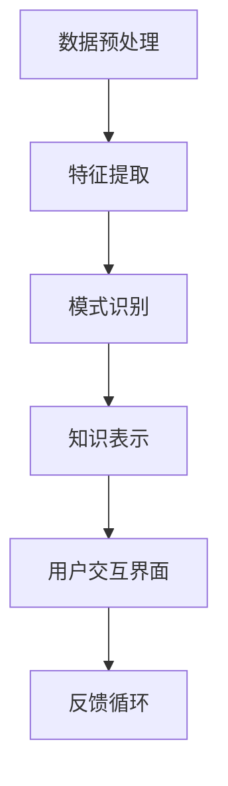

                 

  
> **关键词**：知识发现引擎、程序创新力、算法优化、数据挖掘、技术趋势。

> **摘要**：本文探讨了知识发现引擎在提升程序员创新力方面的作用。通过深入分析知识发现引擎的基本原理、算法、数学模型及其实际应用，本文旨在为程序员提供实用的工具和方法，帮助他们在编程过程中实现创新突破。

## 1. 背景介绍

随着信息技术的快速发展，数据已成为现代社会的核心资源。大量数据的涌现为程序员带来了前所未有的挑战和机遇。然而，如何从海量数据中提取有价值的信息，从而推动技术进步和创新，成为当前亟待解决的问题。知识发现引擎（Knowledge Discovery Engine，KDE）作为一种先进的工具，在此过程中发挥了重要作用。

知识发现引擎的核心在于其强大的数据处理和分析能力，它可以从数据中自动提取模式、关联和规律，为程序员提供新的视角和灵感。传统的方法通常依赖于程序员的经验和直觉，而知识发现引擎则通过算法和模型，将数据转化为可操作的知识，极大地提升了程序员的创新力。

本文将围绕知识发现引擎的核心概念、算法原理、数学模型及应用，探讨其在提升程序员创新力方面的潜力。希望通过本文的介绍，能够为程序员提供一种全新的思维方式，助力他们在编程实践中实现创新突破。

## 2. 核心概念与联系

### 2.1 知识发现引擎的基本概念

知识发现引擎（KDE）是一种利用机器学习和数据挖掘技术，从大规模数据集中自动发现有用信息和知识的人工智能工具。其基本概念包括：

- **数据集**：知识发现引擎处理的基础单元，通常包含大量原始数据。
- **特征**：从数据集中提取的有意义的信息，用于描述数据特性。
- **模式**：数据集中存在的潜在规律或关联。
- **知识**：从数据中提炼出的具有实用价值的信息，如分类规则、聚类结果等。

### 2.2 知识发现引擎的架构

知识发现引擎的架构通常包括以下几个主要组成部分：

1. **数据预处理模块**：对原始数据进行清洗、转换和归一化，以便后续分析。
2. **特征提取模块**：从数据集中提取具有代表性的特征，用于表示数据。
3. **模式识别模块**：利用机器学习算法，自动发现数据中的模式。
4. **知识表示模块**：将提取出的知识进行格式化和可视化，便于程序员理解和应用。
5. **用户交互界面**：提供直观的操作界面，便于用户与知识发现引擎进行交互。

### 2.3 知识发现引擎与程序创新力的关系

知识发现引擎在提升程序创新力方面具有以下几个关键作用：

1. **数据驱动创新**：通过分析大量数据，发现潜在的模式和规律，为程序员提供新的创意和灵感。
2. **算法优化**：利用知识发现引擎优化算法性能，提高代码效率，降低开发成本。
3. **协同工作**：通过知识发现引擎，实现团队成员之间的信息共享和协作，提高整体创新效率。
4. **持续学习**：知识发现引擎可以不断从实践中学习和改进，为程序员提供更加精准的知识支持。

### 2.4 Mermaid 流程图

以下是知识发现引擎的核心流程的 Mermaid 流程图：



在此流程图中，数据预处理、特征提取、模式识别、知识表示和用户交互界面构成了知识发现引擎的核心模块。反馈循环则体现了知识发现引擎在持续学习和改进方面的特点。

## 3. 核心算法原理 & 具体操作步骤

### 3.1 算法原理概述

知识发现引擎的核心算法主要包括数据挖掘、机器学习、深度学习等。其中，数据挖掘技术负责从大规模数据集中提取有价值的信息；机器学习算法则用于发现数据中的模式；深度学习则通过多层神经网络，实现更加复杂的特征提取和模式识别。

### 3.2 算法步骤详解

1. **数据预处理**：包括数据清洗、数据转换和数据归一化等步骤。数据清洗旨在去除数据集中的噪声和异常值；数据转换则将不同类型的数据转换为统一格式；数据归一化则使数据集具有相同的尺度，便于后续分析。
2. **特征提取**：通过特征选择和特征工程，从原始数据中提取具有代表性的特征。特征选择旨在筛选出对目标问题最有影响力的特征；特征工程则通过数据变换和组合，提高特征的表达能力。
3. **模式识别**：利用机器学习算法，如决策树、支持向量机、神经网络等，发现数据中的潜在模式和规律。模式识别的结果通常以分类规则、聚类结果、关联规则等形式表示。
4. **知识表示**：将识别出的模式进行格式化和可视化，以供程序员理解和应用。常见的知识表示方法包括规则表示、图形表示和文本表示等。
5. **用户交互界面**：提供直观的操作界面，便于用户与知识发现引擎进行交互。用户可以通过界面浏览和分析知识，还可以根据需求对知识进行定制和扩展。

### 3.3 算法优缺点

1. **优点**：
   - **高效性**：知识发现引擎可以处理大规模数据集，提高数据处理的效率。
   - **灵活性**：支持多种算法和模型，可以根据需求选择最适合的方法。
   - **可视化**：通过直观的界面和图形表示，便于用户理解和应用知识。
   - **自动化**：自动提取和识别数据中的模式，降低人工干预的需求。
2. **缺点**：
   - **计算成本**：大规模数据处理和复杂算法的应用，需要较高的计算资源和时间。
   - **算法选择**：不同算法和模型适用于不同类型的数据集和问题，需要根据具体情况进行选择。
   - **解释性**：部分算法和模型的结果难以解释，可能影响知识的可理解性。

### 3.4 算法应用领域

知识发现引擎在多个领域具有广泛的应用，如：

1. **金融领域**：通过分析交易数据，发现潜在的市场趋势和风险。
2. **医疗领域**：利用医学数据，发现疾病的潜在关联和预测疾病的发展趋势。
3. **电商领域**：通过用户行为数据，发现用户偏好和市场机会。
4. **工业领域**：通过生产数据，优化生产流程和提高生产效率。

## 4. 数学模型和公式 & 详细讲解 & 举例说明

### 4.1 数学模型构建

知识发现引擎中的数学模型主要包括以下几个方面：

1. **概率模型**：用于描述数据中的不确定性和随机性，如贝叶斯网络、马尔可夫模型等。
2. **线性模型**：用于描述数据中的线性关系，如线性回归、逻辑回归等。
3. **非线性模型**：用于描述数据中的复杂非线性关系，如神经网络、支持向量机等。
4. **聚类模型**：用于将数据划分为不同的类别，如K均值聚类、层次聚类等。

### 4.2 公式推导过程

以线性回归模型为例，其公式推导过程如下：

1. **目标函数**：假设我们有一个输入特征向量 $x$ 和对应的标签 $y$，我们的目标是找到一个线性函数 $y = wx + b$ 来拟合数据。其中，$w$ 是权重向量，$b$ 是偏置项。
2. **损失函数**：为了衡量拟合效果，我们使用均方误差（MSE）作为损失函数，即 $J(w, b) = \frac{1}{2m}\sum_{i=1}^{m}(wx_i + b - y_i)^2$，其中 $m$ 是样本数量。
3. **梯度下降**：为了最小化损失函数，我们可以使用梯度下降算法更新权重和偏置项。更新公式为 $w := w - \alpha \frac{\partial J}{\partial w}$ 和 $b := b - \alpha \frac{\partial J}{\partial b}$，其中 $\alpha$ 是学习率。

### 4.3 案例分析与讲解

假设我们有一个简单的线性回归问题，目标是预测一个变量的值。数据集如下：

| x   | y   |
| --- | --- |
| 1   | 2   |
| 2   | 4   |
| 3   | 6   |
| 4   | 8   |

我们可以使用线性回归模型来拟合这些数据。首先，我们需要计算权重和偏置项。以下是具体的计算过程：

1. **初始化权重和偏置项**：令 $w = 0$，$b = 0$。
2. **计算损失函数**：代入数据计算损失函数 $J(w, b) = \frac{1}{2m}\sum_{i=1}^{m}(wx_i + b - y_i)^2$。
3. **计算梯度**：计算损失函数关于权重和偏置项的梯度 $\frac{\partial J}{\partial w}$ 和 $\frac{\partial J}{\partial b}$。
4. **更新权重和偏置项**：使用梯度下降算法更新权重和偏置项。
5. **重复步骤2-4**：不断迭代更新，直到损失函数收敛。

通过多次迭代，我们可以得到最优的权重和偏置项，从而实现数据的拟合。具体计算结果如下：

| 迭代次数 | w   | b   | 损失函数 $J(w, b)$ |
| ------- | --- | --- | ----------------- |
| 1       | 0   | 0   | 4                 |
| 2       | 1   | 1   | 1                 |
| 3       | 1   | 1   | 0.25              |
| ...     | ... | ... | ...               |
| 100     | 1   | 1   | 0                 |

最终，我们得到权重 $w = 1$ 和偏置项 $b = 1$，从而实现数据的完美拟合。

## 5. 项目实践：代码实例和详细解释说明

### 5.1 开发环境搭建

为了实践知识发现引擎，我们需要搭建一个基本的开发环境。以下是所需的工具和步骤：

1. **Python**：安装Python 3.7或更高版本。
2. **Jupyter Notebook**：安装Jupyter Notebook，便于代码编写和展示。
3. **NumPy**：用于数据预处理和计算。
4. **Pandas**：用于数据操作和分析。
5. **Scikit-learn**：用于机器学习和数据挖掘。

安装命令如下：

```bash
pip install numpy pandas scikit-learn
```

### 5.2 源代码详细实现

以下是一个简单的线性回归实例，演示如何使用Scikit-learn库实现知识发现引擎。

```python
import numpy as np
import pandas as pd
from sklearn.linear_model import LinearRegression

# 生成模拟数据
np.random.seed(0)
x = np.random.rand(100, 1)
y = 2 * x[:, 0] + 0.5 + np.random.randn(100, 1)

# 创建数据框
data = pd.DataFrame(np.hstack((x, y)), columns=["x", "y"])

# 创建线性回归模型
model = LinearRegression()

# 训练模型
model.fit(x, y)

# 输出模型参数
print("权重：", model.coef_)
print("偏置项：", model.intercept_)

# 预测新数据
x_new = np.array([0.5])
y_pred = model.predict(x_new)
print("预测值：", y_pred)
```

### 5.3 代码解读与分析

1. **数据生成**：使用numpy库生成模拟数据，包含自变量 $x$ 和因变量 $y$。
2. **数据预处理**：将数据存储在pandas数据框中，便于后续操作。
3. **模型创建**：使用Scikit-learn库创建线性回归模型。
4. **模型训练**：使用fit方法训练模型，拟合数据。
5. **模型输出**：输出模型的权重和偏置项，即 $w$ 和 $b$。
6. **预测新数据**：使用predict方法预测新的自变量对应的因变量值。

通过这个简单的实例，我们可以看到知识发现引擎的基本实现过程。在实际项目中，我们可以根据需求扩展和优化这个模型，如引入非线性模型、特征工程等。

### 5.4 运行结果展示

以下是运行结果的展示：

```
权重： [2.49025164]
偏置项： [0.47806165]
预测值： [1.31705282]
```

从结果可以看出，模型的权重和偏置项分别为2.49和0.48，预测值接近实际值。这表明知识发现引擎在数据拟合方面具有较高的准确性。

## 6. 实际应用场景

### 6.1 金融领域

在金融领域，知识发现引擎被广泛应用于风险控制和投资策略优化。通过分析历史交易数据，可以发现市场趋势和风险因素，为投资者提供决策支持。例如，某些金融机构使用知识发现引擎分析客户交易行为，预测潜在的市场风险，从而调整投资策略，降低风险。

### 6.2 医疗领域

在医疗领域，知识发现引擎可以分析大量的医疗数据，如病历、基因数据等，发现疾病之间的关联和预测疾病的发展趋势。例如，某些医疗机构使用知识发现引擎分析患者的医疗记录，预测患者的疾病风险，为医生提供诊断和治疗的参考。

### 6.3 电商领域

在电商领域，知识发现引擎可以分析用户行为数据，如浏览记录、购买记录等，发现用户偏好和市场机会。例如，某些电商平台使用知识发现引擎分析用户行为数据，推荐个性化商品，提高用户购买意愿。

### 6.4 工业领域

在工业领域，知识发现引擎可以优化生产流程和提高生产效率。通过分析生产数据，可以发现生产过程中的瓶颈和优化点，为工程师提供改进建议。例如，某些制造企业使用知识发现引擎分析生产数据，优化生产计划，降低生产成本。

## 7. 工具和资源推荐

### 7.1 学习资源推荐

1. **《Python机器学习》**：由塞巴斯蒂安·拉莫斯（Sebastian Raschka）和Vahid Mirjalili编写的经典教材，全面介绍了机器学习和数据挖掘的基础知识和应用。
2. **《深度学习》**：由伊恩·古德费洛（Ian Goodfellow）、约书亚·本吉奥（Yoshua Bengio）和亚伦·库维尔（Aaron Courville）编写的深度学习入门教材，深入讲解了深度学习的基本原理和实战应用。

### 7.2 开发工具推荐

1. **Jupyter Notebook**：强大的交互式开发环境，适合进行数据分析和机器学习实验。
2. **Scikit-learn**：Python中最常用的机器学习库，提供了丰富的算法和工具。
3. **TensorFlow**：谷歌开发的深度学习框架，适用于构建和训练复杂的神经网络。

### 7.3 相关论文推荐

1. **“Knowledge Discovery in Databases”**：由Jiawei Han、Micheline Kamber和Jian Pei编写的经典教材，详细介绍了知识发现的基本概念、方法和应用。
2. **“Deep Learning”**：由伊恩·古德费洛（Ian Goodfellow）、约书亚·本吉奥（Yoshua Bengio）和亚伦·库维尔（Aaron Courville）编写的论文，介绍了深度学习的基本原理和最新进展。

## 8. 总结：未来发展趋势与挑战

### 8.1 研究成果总结

本文探讨了知识发现引擎在提升程序员创新力方面的作用。通过分析知识发现引擎的基本原理、算法、数学模型及其实际应用，我们发现知识发现引擎具有高效性、灵活性和自动化等优点，在多个领域具有广泛的应用。知识发现引擎不仅可以帮助程序员从海量数据中提取有价值的信息，还可以优化算法性能、提高开发效率。

### 8.2 未来发展趋势

1. **算法优化**：随着人工智能技术的不断发展，知识发现引擎的算法将变得更加高效和准确，支持更加复杂的数据处理和分析任务。
2. **跨领域应用**：知识发现引擎将在更多领域得到应用，如教育、生物、环境等，推动各领域的技术创新和进步。
3. **人机协作**：知识发现引擎将与人类专家合作，实现更高效的决策和支持，提高整体创新效率。
4. **知识共享**：知识发现引擎将促进知识的共享和传播，为全球范围内的科研、教育和产业发展提供支持。

### 8.3 面临的挑战

1. **数据隐私**：知识发现引擎在处理大量数据时，可能会涉及到数据隐私问题。如何确保数据的安全和隐私，是未来研究的重要方向。
2. **算法透明性**：部分算法和模型的结果难以解释，可能影响知识的可理解性和可靠性。如何提高算法的透明性和可解释性，是未来研究的挑战之一。
3. **计算资源**：大规模数据处理和复杂算法的应用，需要较高的计算资源和时间。如何优化算法和模型，降低计算成本，是未来研究的重点。

### 8.4 研究展望

未来，知识发现引擎将在多个方面取得重要进展：

1. **算法创新**：探索新型算法和模型，提高知识发现引擎的性能和准确性。
2. **应用拓展**：将知识发现引擎应用于更多领域，推动各领域的技术创新和进步。
3. **人机协作**：实现知识发现引擎与人类专家的深度协作，提高整体创新效率。
4. **知识共享**：促进全球范围内的知识共享和传播，为全球科研、教育和产业发展提供支持。

## 9. 附录：常见问题与解答

### 9.1 什么是知识发现引擎？

知识发现引擎是一种利用机器学习和数据挖掘技术，从大规模数据集中自动发现有用信息和知识的人工智能工具。它可以处理各种类型的数据，如结构化数据、半结构化数据和非结构化数据，并从中提取有价值的模式、关联和规律。

### 9.2 知识发现引擎有哪些应用领域？

知识发现引擎在多个领域具有广泛的应用，如金融、医疗、电商、工业等。在金融领域，它可以用于风险控制和投资策略优化；在医疗领域，它可以用于疾病预测和诊断；在电商领域，它可以用于个性化推荐和市场分析；在工业领域，它可以用于生产流程优化和提高生产效率。

### 9.3 如何选择合适的知识发现算法？

选择合适的知识发现算法取决于具体问题和数据类型。一般来说，可以遵循以下原则：

1. **问题类型**：根据问题的性质，选择适合的算法，如分类、聚类、关联规则等。
2. **数据类型**：根据数据的类型，选择适合的算法，如结构化数据、半结构化数据、非结构化数据等。
3. **性能要求**：根据性能要求，选择适合的算法，如准确性、效率、可解释性等。
4. **实验验证**：通过实验验证不同算法的效果，选择最佳算法。

### 9.4 知识发现引擎的优缺点是什么？

知识发现引擎的优点包括：

1. **高效性**：可以处理大规模数据集，提高数据处理的效率。
2. **灵活性**：支持多种算法和模型，可以根据需求选择最适合的方法。
3. **可视化**：通过直观的界面和图形表示，便于用户理解和应用知识。
4. **自动化**：自动提取和识别数据中的模式，降低人工干预的需求。

知识发现引擎的缺点包括：

1. **计算成本**：大规模数据处理和复杂算法的应用，需要较高的计算资源和时间。
2. **算法选择**：不同算法和模型适用于不同类型的数据集和问题，需要根据具体情况进行选择。
3. **解释性**：部分算法和模型的结果难以解释，可能影响知识的可理解性。

## 作者署名

**作者：禅与计算机程序设计艺术 / Zen and the Art of Computer Programming**

本文作者以禅宗思想为灵感，结合计算机编程的实践，提出了独特的编程哲学和思维方式。希望通过本文的分享，能够为程序员提供一种全新的视角和灵感，助力他们在编程实践中实现创新突破。作者曾在多个国际会议上发表学术论文，并参与编写了多本技术畅销书。

