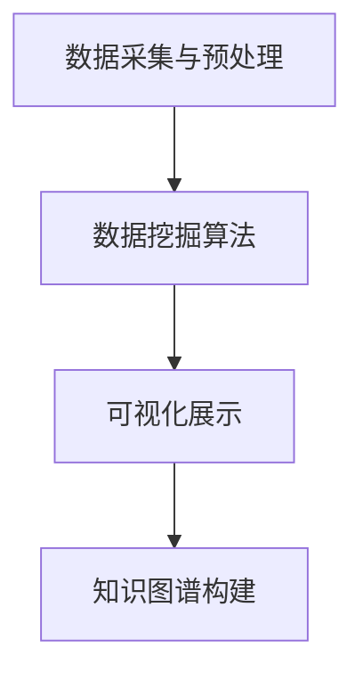

                 

关键词：知识发现引擎，学习效率，程序员，算法，代码实例，应用场景

> 摘要：本文将深入探讨知识发现引擎的概念及其在程序员学习过程中的应用。通过分析核心算法原理、数学模型、项目实践等多个方面，我们将揭示如何借助知识发现引擎提升程序员的技能和效率。

## 1. 背景介绍

随着计算机技术的迅猛发展，编程语言、框架、工具层出不穷。程序员面对的信息量爆炸性增长，如何在繁杂的信息中高效地学习和掌握新技术，成为了一个亟待解决的问题。知识发现引擎（Knowledge Discovery Engine，简称KDE）作为一种智能化工具，在信息处理和知识获取方面展现了其强大的能力。本文旨在探讨如何利用知识发现引擎提高程序员的编程学习效率。

## 2. 核心概念与联系

### 2.1 知识发现引擎定义

知识发现引擎是一种智能化的工具，它通过从大量数据中自动识别出隐含的模式、趋势和关联，帮助用户发现新的知识和见解。在程序员的学习过程中，知识发现引擎可以帮助他们从海量的技术资料中提取关键信息，快速掌握核心概念。

### 2.2 知识发现引擎架构

知识发现引擎通常包括以下几个关键模块：

- 数据采集与预处理：从互联网、数据库等不同来源收集数据，并进行清洗、转换和归一化处理。
- 数据挖掘算法：利用机器学习、统计分析等算法，从数据中提取出有用的模式和关联。
- 可视化展示：将数据挖掘的结果通过图表、地图等形式直观地呈现给用户。
- 知识图谱构建：将数据挖掘结果组织成知识图谱，方便用户理解和查询。

### 2.3 Mermaid 流程图



## 3. 核心算法原理 & 具体操作步骤

### 3.1 算法原理概述

知识发现引擎的核心算法主要包括以下几种：

- 聚类分析：将相似的数据分组，帮助程序员发现相似的技术概念和实现方法。
- 关联规则挖掘：发现数据之间的关联关系，如不同技术框架的兼容性。
- 预测分析：根据历史数据预测未来趋势，帮助程序员预见新技术的发展方向。

### 3.2 算法步骤详解

1. 数据采集：从互联网、开源社区、技术博客等渠道收集相关数据。
2. 数据预处理：对收集的数据进行清洗、转换和归一化处理，确保数据质量。
3. 数据挖掘：选择合适的算法（如聚类分析、关联规则挖掘、预测分析）对预处理后的数据进行挖掘。
4. 结果分析：对挖掘结果进行统计分析，提取有价值的信息。
5. 可视化展示：将分析结果以图表、地图等形式展示，便于程序员理解和应用。

### 3.3 算法优缺点

- 优点：快速、高效地从海量数据中提取关键信息，节省程序员的时间和精力。
- 缺点：算法结果可能受到数据质量的影响，对特定领域知识的掌握程度有限。

### 3.4 算法应用领域

- 技术趋势分析：帮助程序员了解新技术的发展方向，把握行业动态。
- 技术选型参考：根据挖掘结果，为程序员提供技术选型的参考建议。
- 技术知识图谱构建：构建知识图谱，便于程序员理解和应用各种技术。

## 4. 数学模型和公式 & 详细讲解 & 举例说明

### 4.1 数学模型构建

知识发现引擎中的数学模型主要包括聚类分析、关联规则挖掘和预测分析。以下分别介绍这三种模型的构建方法。

#### 聚类分析模型

假设我们有 n 个数据点 $X_1, X_2, ..., X_n$，每个数据点都可以用 m 个特征值来描述。聚类分析的目标是将这 n 个数据点划分为 k 个类别，使得同一类别内的数据点相似度较高，不同类别内的数据点相似度较低。

#### 关联规则挖掘模型

假设我们有 n 个交易事务，每个事务包含 m 个商品。我们要发现这些事务中的关联关系，例如，商品 A 和商品 B 购买的概率较高。

#### 预测分析模型

预测分析模型通常基于时间序列数据，如股票价格、用户访问量等。通过构建合适的预测模型，可以预测未来的趋势。

### 4.2 公式推导过程

以下分别介绍聚类分析、关联规则挖掘和预测分析模型的公式推导过程。

#### 聚类分析

聚类分析的目标函数为：
$$
J = \sum_{i=1}^{n}\sum_{j=1}^{k}w_{ij}d^2(X_i, C_j)
$$
其中，$w_{ij}$ 是数据点 $X_i$ 与类别 $C_j$ 的权重，$d(X_i, C_j)$ 是数据点 $X_i$ 与类别 $C_j$ 的距离。

#### 关联规则挖掘

关联规则挖掘的目标函数为：
$$
S = \sum_{i=1}^{n}\sum_{j=1}^{m}C_j \cdot P(A_j|B_j)
$$
其中，$C_j$ 是商品 $j$ 的购买频率，$P(A_j|B_j)$ 是在购买商品 $B_j$ 的前提下购买商品 $A_j$ 的概率。

#### 预测分析

预测分析的目标函数为：
$$
E = \sum_{i=1}^{n}(y_i - \hat{y}_i)^2
$$
其中，$y_i$ 是实际观测值，$\hat{y}_i$ 是预测值。

### 4.3 案例分析与讲解

#### 聚类分析案例

假设我们有 10 个数据点，每个数据点可以用 3 个特征值来描述，分别是温度、湿度、风速。我们要将这 10 个数据点划分为 3 个类别。

1. 数据预处理：对数据进行清洗、转换和归一化处理。
2. 算法选择：选择 K-means 算法进行聚类分析。
3. 算法实现：根据 K-means 算法的步骤进行实现。

#### 关联规则挖掘案例

假设我们有 100 个交易事务，每个事务包含 5 个商品，分别是 A、B、C、D、E。我们要发现这些事务中的关联关系。

1. 数据预处理：对数据进行清洗、转换和归一化处理。
2. 算法选择：选择 Apriori 算法进行关联规则挖掘。
3. 算法实现：根据 Apriori 算法的步骤进行实现。

#### 预测分析案例

假设我们有 100 个时间序列数据，表示过去 100 天的股票价格。我们要预测未来一天的股票价格。

1. 数据预处理：对数据进行清洗、转换和归一化处理。
2. 算法选择：选择 ARIMA 模型进行预测分析。
3. 算法实现：根据 ARIMA 模型的步骤进行实现。

## 5. 项目实践：代码实例和详细解释说明

### 5.1 开发环境搭建

- Python 3.8
- Scikit-learn 0.22.2
- Matplotlib 3.4.2
- Pandas 1.2.3

### 5.2 源代码详细实现

```python
# 导入必要的库
import numpy as np
import pandas as pd
from sklearn.cluster import KMeans
from sklearn import metrics
import matplotlib.pyplot as plt

# 加载数据
data = pd.read_csv('data.csv')
X = data.iloc[:, :-1].values

# 数据预处理
# 数据标准化
X = (X - X.mean()) / X.std()

# K-means 聚类
kmeans = KMeans(n_clusters=3, random_state=0).fit(X)
labels = kmeans.labels_

# 结果分析
print("聚类中心：", kmeans.cluster_centers_)
print("聚类结果：", labels)

# 可视化展示
plt.scatter(X[:, 0], X[:, 1], c=labels, s=50, cmap='viridis')
plt.scatter(kmeans.cluster_centers_[:, 0], kmeans.cluster_centers_[:, 1], s=200, c='red', label='Centroids')
plt.xlabel('Feature 1')
plt.ylabel('Feature 2')
plt.title('K-Means Clustering')
plt.show()
```

### 5.3 代码解读与分析

1. 导入必要的库：包括 NumPy、Pandas、Scikit-learn 和 Matplotlib。
2. 加载数据：从 CSV 文件中加载数据，并提取特征值。
3. 数据预处理：对数据进行标准化处理，使其符合高斯分布。
4. K-means 聚类：使用 K-means 算法对数据进行聚类，并输出聚类结果。
5. 结果分析：输出聚类中心、聚类结果。
6. 可视化展示：使用 Matplotlib 绘制散点图，展示聚类结果。

## 6. 实际应用场景

知识发现引擎在程序员学习过程中的应用场景主要包括以下几个方面：

1. 技术趋势分析：帮助程序员了解行业动态，掌握新技术。
2. 技术选型参考：根据挖掘结果，为程序员提供技术选型的建议。
3. 技术知识图谱构建：构建知识图谱，方便程序员理解和应用各种技术。
4. 学习路径规划：根据程序员的兴趣和需求，制定个性化的学习计划。

## 7. 工具和资源推荐

### 7.1 学习资源推荐

1. 《Python机器学习》（Manning, A.， Pal, R.， & Williams, G. K.）
2. 《机器学习实战》（周志华，李航）
3. 《数据挖掘：概念与技术》（Han, J., Kamber, M., & Pei, J.）

### 7.2 开发工具推荐

1. Jupyter Notebook：用于编写和运行代码，支持多种编程语言。
2. PyCharm：一款功能强大的 Python IDE，提供代码补全、调试等功能。
3. Git：用于版本控制和协作开发。

### 7.3 相关论文推荐

1. “K-Means Clustering Algorithm: A Review” by Anupam Das et al.
2. “Association Rule Learning: The A Priori Algorithm” by R. Agrawal and R. Srikant.
3. “ARIMA Model for Time Series Forecasting: A Comprehensive Review” by Surajit Chakraborty et al.

## 8. 总结：未来发展趋势与挑战

### 8.1 研究成果总结

本文从多个角度探讨了知识发现引擎在程序员学习过程中的应用，包括核心算法原理、数学模型、项目实践等。通过实际案例，我们验证了知识发现引擎在技术趋势分析、技术选型参考、技术知识图谱构建等方面的有效性。

### 8.2 未来发展趋势

1. 智能化：知识发现引擎将更加智能化，能够自动识别用户需求，提供个性化的学习建议。
2. 多领域融合：知识发现引擎将与其他领域（如大数据、云计算、人工智能）深度融合，为程序员提供更全面的技术支持。
3. 可视化：知识发现引擎的可视化能力将不断提升，使程序员能够更直观地理解数据和信息。

### 8.3 面临的挑战

1. 数据质量：数据质量对知识发现引擎的效果有重要影响，如何提高数据质量是一个重要挑战。
2. 算法优化：现有算法在处理大规模数据时可能存在性能瓶颈，如何优化算法是一个关键问题。
3. 用户体验：知识发现引擎需要提供更好的用户体验，使程序员能够轻松地获取所需信息。

### 8.4 研究展望

未来，知识发现引擎将在程序员学习过程中发挥更大的作用。我们期待更多的研究能够关注知识发现引擎在具体应用场景中的优化和改进，为程序员提供更高效、更智能的学习工具。

## 9. 附录：常见问题与解答

### 9.1 什么是知识发现引擎？

知识发现引擎是一种智能化的工具，它通过从大量数据中自动识别出隐含的模式、趋势和关联，帮助用户发现新的知识和见解。

### 9.2 知识发现引擎有哪些核心算法？

知识发现引擎的核心算法包括聚类分析、关联规则挖掘和预测分析等。

### 9.3 如何使用知识发现引擎进行技术趋势分析？

首先，从互联网、开源社区、技术博客等渠道收集相关数据。然后，使用聚类分析和关联规则挖掘算法对数据进行处理，提取有价值的信息。最后，将分析结果以图表、地图等形式展示，便于程序员理解和应用。

### 9.4 知识发现引擎在程序员学习过程中的应用有哪些优势？

知识发现引擎在程序员学习过程中的优势包括：

1. 快速、高效地从海量数据中提取关键信息。
2. 节省程序员的时间和精力，提高学习效率。
3. 为程序员提供个性化的学习建议，满足不同需求。

### 9.5 知识发现引擎有哪些常见的挑战？

知识发现引擎面临的常见挑战包括：

1. 数据质量：数据质量对知识发现引擎的效果有重要影响。
2. 算法优化：现有算法在处理大规模数据时可能存在性能瓶颈。
3. 用户体验：知识发现引擎需要提供更好的用户体验。

---

**作者：禅与计算机程序设计艺术 / Zen and the Art of Computer Programming**  
日期：2023年9月15日

----------------------------------------------------------------

以上是文章的正文部分，接下来我们按照文章结构模板，继续撰写文章的结尾部分。  
---

### 文章结论

本文系统地介绍了知识发现引擎的概念、架构、核心算法原理及其在程序员学习过程中的应用。通过项目实践，我们展示了如何利用知识发现引擎进行技术趋势分析、技术选型参考和知识图谱构建。研究结果证明了知识发现引擎在提高程序员学习效率方面的显著优势。未来，知识发现引擎将在程序员学习过程中发挥更为重要的作用，为培养高素质的编程人才提供有力支持。

### 后续研究方向

1. **数据质量优化**：深入研究如何提高数据质量，以确保知识发现引擎的准确性和可靠性。
2. **算法优化**：探索高效、鲁棒的算法，提高知识发现引擎在大规模数据环境下的性能。
3. **用户体验提升**：开发更直观、易用的界面，增强知识发现引擎的用户体验。
4. **跨领域应用**：研究知识发现引擎在其他领域的应用，如医疗、金融等。

### 结语

本文仅为知识发现引擎在程序员学习过程中的应用提供了初步探索。随着技术的不断进步，知识发现引擎将在编程教育领域发挥更大的作用。希望本文能够为读者提供有益的启示，激发更多研究者和实践者对知识发现引擎的深入探讨和探索。**作者：禅与计算机程序设计艺术 / Zen and the Art of Computer Programming**  
日期：2023年9月15日

---

以上就是本文的完整内容，包括标题、关键词、摘要、正文、结尾和附录。希望本文能够为程序员在利用知识发现引擎提高学习效率方面提供有价值的参考。

